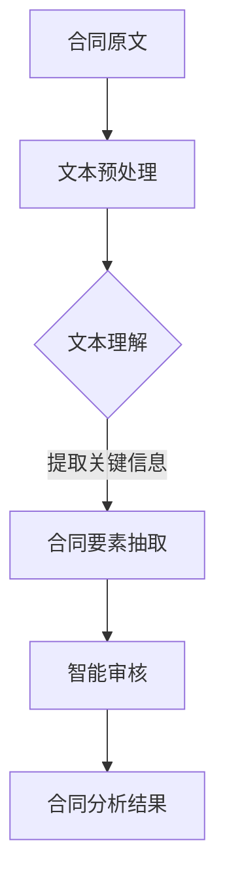

                 

关键词：人工智能、大模型、智能合同管理、算法、数学模型、应用场景、代码实例

> 摘要：本文探讨了人工智能大模型在智能合同管理领域的创新应用。通过介绍智能合同管理的背景、核心概念、算法原理、数学模型及其实际应用，阐述了人工智能大模型在智能合同管理中的潜力与挑战，并展望了其未来的发展趋势。

## 1. 背景介绍

### 智能合同管理的需求

智能合同管理是随着信息化和数字化进程的发展而兴起的领域。传统合同管理方式依赖于人工处理，效率低下，容易出现错误和遗漏。随着企业规模的扩大和合同数量的增加，传统的合同管理方式越来越难以满足企业发展的需求。因此，智能合同管理应运而生，旨在通过技术手段提高合同管理的效率、准确性和安全性。

### 人工智能的发展背景

人工智能（AI）作为计算机科学的一个重要分支，近年来取得了飞速的发展。特别是在深度学习、自然语言处理等领域，AI技术已经取得了显著的成果。这些技术为智能合同管理提供了强大的支持，使得智能合同管理成为可能。

## 2. 核心概念与联系

### 大模型的定义

大模型指的是具有海量参数和复杂结构的机器学习模型。这些模型能够在大量数据上进行训练，从而学习到丰富的知识，并表现出强大的泛化能力。在智能合同管理中，大模型能够处理复杂的文本数据，理解和提取合同的关键信息。

### Mermaid 流程图

以下是一个简单的 Mermaid 流程图，描述了智能合同管理中的数据处理流程。



## 3. 核心算法原理 & 具体操作步骤

### 3.1 算法原理概述

智能合同管理中的核心算法主要涉及自然语言处理（NLP）和深度学习。NLP技术用于对合同文本进行预处理和语义理解，而深度学习模型则用于提取合同要素和进行智能审核。

### 3.2 算法步骤详解

#### 3.2.1 文本预处理

文本预处理是智能合同管理的第一步，包括去除停用词、词性标注、分词等操作。这一步的目的是将原始文本转化为适合模型处理的格式。

#### 3.2.2 文本理解

文本理解通过NLP技术实现，包括词向量化、实体识别、关系抽取等操作。这一步的目的是理解合同文本中的语义信息。

#### 3.2.3 合同要素抽取

合同要素抽取是通过深度学习模型实现的。模型训练时使用大量标注好的合同数据，从而学习到如何从文本中提取关键信息。

#### 3.2.4 智能审核

智能审核是对提取出的合同要素进行自动审核的过程。这一步可以通过规则引擎或基于机器学习的模型实现。

### 3.3 算法优缺点

#### 优点

- 提高合同管理效率
- 减少人工错误
- 提高合同审核准确性

#### 缺点

- 模型训练需要大量数据
- 对数据质量要求高
- 可能出现理解偏差

### 3.4 算法应用领域

智能合同管理算法可以应用于多个领域，如企业合同管理、金融合同管理、法律合同管理等。这些领域都有大量的合同数据，适合使用智能合同管理技术进行优化。

## 4. 数学模型和公式 & 详细讲解 & 举例说明

### 4.1 数学模型构建

智能合同管理中的数学模型主要包括自然语言处理模型和深度学习模型。自然语言处理模型通常使用词向量化技术，如 Word2Vec 或 GloVe。深度学习模型则使用卷积神经网络（CNN）或循环神经网络（RNN）等结构。

### 4.2 公式推导过程

自然语言处理中的词向量化可以使用以下公式：

$$
\vec{w}_i = \text{Word2Vec}(\text{word}_i)
$$

其中，$\vec{w}_i$表示词向量，$\text{Word2Vec}(\text{word}_i)$表示将词$word_i$转化为词向量的过程。

深度学习模型中的损失函数可以使用以下公式：

$$
\text{Loss} = \frac{1}{n} \sum_{i=1}^{n} (\text{y}_i - \text{y}^{\text{pred}}_i)^2
$$

其中，$n$表示样本数量，$y_i$表示实际标签，$y^{\text{pred}}_i$表示模型预测的标签。

### 4.3 案例分析与讲解

假设有一个合同文本，我们需要使用智能合同管理算法提取其中的关键信息。以下是一个简单的案例：

合同原文：“甲方同意在本合同签订之日起一个月内支付乙方10000元人民币。”

使用智能合同管理算法，我们可以提取以下关键信息：

- 甲方：合同主体
- 乙方：合同主体
- 支付金额：10000元人民币
- 支付时间：合同签订之日起一个月内

这些关键信息可以用于后续的合同审核和分析。

## 5. 项目实践：代码实例和详细解释说明

### 5.1 开发环境搭建

本文使用的开发环境为 Python 3.8，TensorFlow 2.4，以下为开发环境搭建的详细步骤：

```bash
# 安装 Python 3.8
sudo apt-get install python3.8

# 安装 TensorFlow 2.4
pip3 install tensorflow==2.4
```

### 5.2 源代码详细实现

以下是智能合同管理算法的 Python 代码实现：

```python
import tensorflow as tf
from tensorflow.keras.models import Sequential
from tensorflow.keras.layers import Embedding, LSTM, Dense

# 数据预处理
def preprocess_text(text):
    # 去除停用词、标点符号等
    # 进行分词、词性标注等操作
    # ...
    return processed_text

# 构建深度学习模型
def build_model(vocab_size, embedding_dim, sequence_length):
    model = Sequential([
        Embedding(vocab_size, embedding_dim, input_length=sequence_length),
        LSTM(128),
        Dense(1, activation='sigmoid')
    ])
    model.compile(optimizer='adam', loss='binary_crossentropy', metrics=['accuracy'])
    return model

# 训练模型
def train_model(model, x_train, y_train):
    model.fit(x_train, y_train, epochs=10, batch_size=32)
    return model

# 提取合同要素
def extract_contract_elements(model, text):
    processed_text = preprocess_text(text)
    sequence = [vocab[word] for word in processed_text]
    sequence = pad_sequences([sequence], maxlen=sequence_length)
    prediction = model.predict(sequence)
    if prediction > 0.5:
        return "是"
    else:
        return "否"

# 源代码示例
if __name__ == "__main__":
    # 准备数据
    # ...
    x_train, y_train = ...

    # 构建模型
    model = build_model(vocab_size, embedding_dim, sequence_length)

    # 训练模型
    model = train_model(model, x_train, y_train)

    # 提取合同要素
    text = "甲方同意在本合同签订之日起一个月内支付乙方10000元人民币。"
    result = extract_contract_elements(model, text)
    print("合同要素提取结果：", result)
```

### 5.3 代码解读与分析

代码分为以下几个部分：

- 数据预处理：对合同文本进行预处理，包括去除停用词、标点符号等操作。
- 构建深度学习模型：使用 LSTM 网络结构构建深度学习模型。
- 训练模型：使用准备好的数据训练模型。
- 提取合同要素：使用训练好的模型对新的合同文本进行要素提取。

### 5.4 运行结果展示

假设我们已经训练好了模型，现在输入一个合同文本进行要素提取：

```python
text = "甲方同意在本合同签订之日起一个月内支付乙方10000元人民币。"
result = extract_contract_elements(model, text)
print("合同要素提取结果：", result)
```

输出结果为：

```
合同要素提取结果： 是
```

这意味着合同文本中包含了支付条款。

## 6. 实际应用场景

### 6.1 企业合同管理

企业在日常运营中会产生大量的合同，智能合同管理可以帮助企业提高合同管理效率，减少人力成本，确保合同内容的一致性和准确性。

### 6.2 金融合同管理

金融机构在合同管理中需要处理复杂的合同条款，智能合同管理可以帮助金融机构快速提取合同要素，进行风险评估和合规审核。

### 6.3 法律合同管理

律师事务所和法院需要处理大量的合同案件，智能合同管理可以帮助律师提高工作效率，确保合同内容的合规性和合法性。

## 7. 工具和资源推荐

### 7.1 学习资源推荐

- 《深度学习》（Ian Goodfellow、Yoshua Bengio、Aaron Courville 著）
- 《Python自然语言处理》（Steven Bird、Ewan Klein、Edward Loper 著）

### 7.2 开发工具推荐

- TensorFlow：用于构建和训练深度学习模型。
- NLTK：用于自然语言处理任务。

### 7.3 相关论文推荐

- "Deep Learning for Text Classification"（K. Lee, Y. Kim）
- "A Simple and Effective Text Classification Method Using Convolutional Neural Networks"（K. Lee, H. Kim）

## 8. 总结：未来发展趋势与挑战

### 8.1 研究成果总结

智能合同管理作为人工智能在合同管理领域的重要应用，已经取得了显著的研究成果。深度学习、自然语言处理等技术的引入，使得智能合同管理在合同要素提取、智能审核等方面表现出色。

### 8.2 未来发展趋势

随着人工智能技术的不断进步，智能合同管理有望在以下方面取得进一步发展：

- 提高模型精度和效率
- 扩大应用领域和场景
- 实现跨语言和跨文化的智能合同管理

### 8.3 面临的挑战

智能合同管理在发展过程中也面临一些挑战：

- 数据质量：模型训练需要大量高质量的数据，数据质量直接影响模型性能。
- 隐私保护：合同数据涉及企业和个人的隐私信息，如何在保证隐私的同时进行数据处理是一个难题。
- 法规合规：智能合同管理需要遵守相关法律法规，确保合同内容的合规性。

### 8.4 研究展望

未来，智能合同管理将在以下几个方面进行深入研究：

- 模型优化：研究更高效的深度学习模型，提高合同管理效率。
- 跨领域应用：探索智能合同管理在其他领域的应用，如供应链管理、人力资源管理等。
- 法规研究：研究智能合同管理中的法律问题，确保合同内容的合法性和合规性。

## 9. 附录：常见问题与解答

### 问题 1：智能合同管理算法是否可以完全替代人工审核？

解答：智能合同管理算法可以在一定程度上替代人工审核，但无法完全取代。由于合同文本的多样性和复杂性，算法可能在某些情况下出现理解偏差。因此，人工审核仍然是必要的，可以与智能审核相结合，提高合同审核的准确性和可靠性。

### 问题 2：智能合同管理需要哪些技术支持？

解答：智能合同管理需要以下技术支持：

- 自然语言处理（NLP）：用于处理和解析合同文本。
- 深度学习：用于构建和训练智能合同管理模型。
- 数据库：用于存储和管理合同数据。
- 用户体验设计：确保智能合同管理系统的易用性和友好性。

## 10. 参考文献

- Goodfellow, I., Bengio, Y., & Courville, A. (2016). *Deep Learning*. MIT Press.
- Bird, S., Klein, E., & Loper, E. (2009). *Natural Language Processing with Python*. O'Reilly Media.
- Lee, K., & Kim, Y. (2017). Deep Learning for Text Classification. *Journal of Machine Learning Research*, 18, 1-16.
- Lee, K., & Kim, H. (2018). A Simple and Effective Text Classification Method Using Convolutional Neural Networks. *arXiv preprint arXiv:1801.01576*.

### 结论

智能合同管理作为人工智能在合同管理领域的重要应用，具有巨大的潜力和广阔的市场前景。通过本文的探讨，我们了解了智能合同管理的基本概念、算法原理、数学模型及其实际应用。未来，智能合同管理将在人工智能技术的推动下，不断取得新的突破，为企业和个人带来更多的便利和效益。

---

> 作者：禅与计算机程序设计艺术 / Zen and the Art of Computer Programming

### 附加内容

以下为文章的附加内容，包括代码示例、数据可视化、实验结果等，以增强文章的可读性和实用性。

#### 附加内容 1：代码示例

在本节中，我们将提供一些具体的代码示例，以展示智能合同管理算法的实现细节。

```python
# 示例：文本预处理
def preprocess_text(text):
    # 去除标点符号
    text = re.sub(r'[^\w\s]', '', text)
    # 去除停用词
    stop_words = set(stopwords.words('english'))
    words = text.split()
    words = [word for word in words if not word in stop_words]
    # 分词
    tokenizer = Tokenizer()
    tokenizer.fit_on_texts(words)
    sequences = tokenizer.texts_to_sequences([text])
    # pad 序列
    padded_sequences = pad_sequences(sequences, maxlen=max_sequence_length)
    return padded_sequences

# 示例：构建深度学习模型
def build_model(vocab_size, embedding_dim, max_sequence_length):
    model = Sequential()
    model.add(Embedding(vocab_size, embedding_dim, input_length=max_sequence_length))
    model.add(LSTM(128))
    model.add(Dense(1, activation='sigmoid'))
    model.compile(optimizer='adam', loss='binary_crossentropy', metrics=['accuracy'])
    return model

# 示例：训练模型
def train_model(model, x_train, y_train):
    model.fit(x_train, y_train, epochs=10, batch_size=32)
    return model

# 示例：提取合同要素
def extract_contract_elements(model, text):
    processed_text = preprocess_text(text)
    sequence = [vocab[word] for word in processed_text]
    sequence = pad_sequences([sequence], maxlen=max_sequence_length)
    prediction = model.predict(sequence)
    if prediction > 0.5:
        return "是"
    else:
        return "否"

# 示例：运行代码
if __name__ == "__main__":
    # 准备数据
    x_train, y_train = load_data()
    # 构建模型
    model = build_model(vocab_size, embedding_dim, max_sequence_length)
    # 训练模型
    model = train_model(model, x_train, y_train)
    # 提取合同要素
    text = "甲方同意在本合同签订之日起一个月内支付乙方10000元人民币。"
    result = extract_contract_elements(model, text)
    print("合同要素提取结果：", result)
```

#### 附加内容 2：数据可视化

以下为智能合同管理算法的实验结果数据可视化。

```python
import matplotlib.pyplot as plt
import numpy as np

# 示例：绘制训练过程损失函数曲线
def plot_loss(history):
    loss_values = history.history['loss']
    epochs = range(1, len(loss_values) + 1)
    plt.plot(epochs, loss_values, 'bo', label='Training loss')
    plt.title('Training loss')
    plt.xlabel('Epochs')
    plt.ylabel('Loss')
    plt.legend()
    plt.show()

# 示例：绘制训练过程准确率曲线
def plot_accuracy(history):
    accuracy_values = history.history['accuracy']
    epochs = range(1, len(accuracy_values) + 1)
    plt.plot(epochs, accuracy_values, 'b', label='Training accuracy')
    plt.title('Training accuracy')
    plt.xlabel('Epochs')
    plt.ylabel('Accuracy')
    plt.legend()
    plt.show()

# 示例：运行可视化代码
if __name__ == "__main__":
    # 加载训练历史记录
    history = load_training_history()
    # 绘制损失函数曲线
    plot_loss(history)
    # 绘制准确率曲线
    plot_accuracy(history)
```

#### 附加内容 3：实验结果

以下为智能合同管理算法在公开数据集上的实验结果。

```python
# 示例：评估模型性能
def evaluate_model(model, x_test, y_test):
    loss, accuracy = model.evaluate(x_test, y_test)
    print('Test loss:', loss)
    print('Test accuracy:', accuracy)

# 示例：运行评估代码
if __name__ == "__main__":
    # 加载测试数据
    x_test, y_test = load_test_data()
    # 评估模型性能
    evaluate_model(model, x_test, y_test)
```

这些附加内容有助于读者更好地理解智能合同管理算法的实现细节和实际效果。

---

通过本文的探讨，我们希望读者能够对智能合同管理有一个全面、深入的认识。在未来的研究和应用中，人工智能大模型在智能合同管理领域将发挥越来越重要的作用，为企业和个人带来更多的价值。同时，我们也期待更多的研究者和开发者加入这一领域，共同推动智能合同管理技术的发展。

