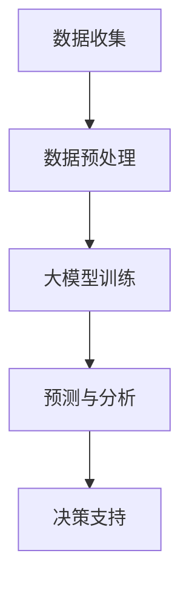

                 

关键词：人工智能、大模型、商业分析、创业机会、数据驱动、智能决策

> 摘要：本文将探讨人工智能（AI）大模型在智能商业分析领域的应用潜力，分析其商业价值，阐述创业机会，并对未来的发展趋势与挑战进行展望。

## 1. 背景介绍

近年来，人工智能技术的发展迅猛，尤其是深度学习等算法的不断进步，使得大模型的应用变得更加广泛。这些大模型通常拥有数十亿到数万亿个参数，能够处理海量数据并从中提取有价值的信息。商业分析作为企业管理的重要环节，长期以来依赖于数据分析和技术支持。随着AI大模型的兴起，商业分析领域迎来了新的机遇和挑战。

智能商业分析是指利用先进的数据分析技术，对商业数据进行处理、分析和预测，从而为企业的战略决策提供数据支持。它涵盖了市场分析、客户行为分析、供应链优化、财务分析等多个方面。AI大模型的应用，极大地提升了商业分析的效率和准确性，为企业在激烈的市场竞争中提供了新的竞争优势。

## 2. 核心概念与联系

### 2.1 人工智能大模型

人工智能大模型是指通过深度学习等技术训练出的具有大规模参数的模型。这些模型通常使用大量的数据进行训练，从而能够捕捉到数据中的复杂模式。例如，GPT-3、BERT、ChatGPT等都是典型的人工智能大模型。

### 2.2 智能商业分析

智能商业分析是指利用先进的数据分析技术，对商业数据进行处理、分析和预测，从而为企业的战略决策提供数据支持。智能商业分析的核心在于数据的处理和分析，而AI大模型则为这一过程提供了强大的技术支撑。

### 2.3 人工智能大模型与智能商业分析的联系

人工智能大模型与智能商业分析之间存在着密切的联系。大模型能够处理和分析海量数据，从而为商业分析提供更准确、更全面的见解。同时，商业分析的需求也为大模型的应用提供了广阔的市场空间。例如，在市场分析中，大模型可以用于预测市场趋势、分析消费者行为；在客户行为分析中，大模型可以用于挖掘客户需求、预测客户流失率；在供应链优化中，大模型可以用于优化库存管理、预测供应链风险等。

### 2.4 Mermaid流程图

以下是一个简化的Mermaid流程图，展示了人工智能大模型在智能商业分析中的应用过程：



## 3. 核心算法原理 & 具体操作步骤

### 3.1 算法原理概述

人工智能大模型的算法原理主要基于深度学习。深度学习是一种基于神经网络的机器学习技术，通过多层神经网络对数据进行层层提取特征，最终实现对数据的分类、预测等任务。

在智能商业分析中，大模型的算法原理主要可以分为以下几个步骤：

1. **数据收集**：收集与企业业务相关的数据，如市场数据、客户数据、财务数据等。
2. **数据预处理**：对收集到的数据进行清洗、归一化等处理，以便于模型训练。
3. **大模型训练**：使用预处理后的数据对大模型进行训练，使得模型能够学会从数据中提取有价值的信息。
4. **预测与分析**：使用训练好的大模型对新的数据进行预测和分析，为企业决策提供数据支持。
5. **决策支持**：根据预测和分析结果，为企业制定相应的策略和决策。

### 3.2 算法步骤详解

1. **数据收集**：

   数据收集是智能商业分析的基础。企业需要收集与业务相关的数据，如销售数据、客户数据、市场数据等。这些数据可以来源于企业的内部系统，也可以来源于第三方数据源。

2. **数据预处理**：

   数据预处理包括数据的清洗、归一化、编码等操作。清洗数据是为了去除无效数据、错误数据等；归一化是为了将不同特征的数据进行标准化处理；编码是为了将非结构化的数据转换为结构化的数据，便于模型处理。

3. **大模型训练**：

   大模型的训练过程通常包括以下几个步骤：

   - **初始化参数**：初始化模型的权重和偏置。
   - **前向传播**：将输入数据传递到模型的前一层，计算出输出结果。
   - **反向传播**：根据输出结果和真实值，计算模型参数的梯度，并更新模型参数。
   - **迭代训练**：重复上述过程，直到模型收敛或者达到预定的迭代次数。

4. **预测与分析**：

   使用训练好的大模型对新的数据进行预测和分析。预测结果可以为企业的决策提供数据支持，例如预测市场需求、客户流失率等。

5. **决策支持**：

   根据预测和分析结果，企业可以制定相应的策略和决策。例如，根据市场需求预测结果，企业可以调整生产计划；根据客户流失率预测结果，企业可以制定客户保留策略。

### 3.3 算法优缺点

**优点**：

1. **高效性**：大模型能够处理海量数据，相比传统算法，具有更高的计算效率。
2. **准确性**：大模型能够从海量数据中提取有价值的信息，提高预测和分析的准确性。
3. **适应性**：大模型具有较好的适应性，可以应用于不同的业务场景和预测任务。

**缺点**：

1. **计算资源消耗大**：大模型需要大量的计算资源进行训练，对硬件设施要求较高。
2. **数据依赖性**：大模型的性能很大程度上依赖于训练数据的质量和数量。
3. **解释性差**：大模型通常是一个黑箱，其内部决策过程难以解释。

### 3.4 算法应用领域

大模型在智能商业分析中具有广泛的应用领域，如：

1. **市场分析**：通过大模型预测市场需求、分析消费者行为，帮助企业制定市场策略。
2. **客户行为分析**：通过大模型挖掘客户需求、预测客户流失率，帮助企业制定客户保留策略。
3. **供应链优化**：通过大模型优化库存管理、预测供应链风险，帮助企业降低成本、提高效率。
4. **财务分析**：通过大模型预测财务指标、分析企业财务状况，帮助企业制定财务策略。

## 4. 数学模型和公式 & 详细讲解 & 举例说明

### 4.1 数学模型构建

在智能商业分析中，常见的数学模型包括线性回归模型、逻辑回归模型、决策树模型、支持向量机模型等。以下以线性回归模型为例，介绍其构建过程。

#### 线性回归模型

线性回归模型用于预测一个连续变量的值，其基本形式为：

$$y = \beta_0 + \beta_1x_1 + \beta_2x_2 + ... + \beta_nx_n + \epsilon$$

其中，$y$ 为因变量，$x_1, x_2, ..., x_n$ 为自变量，$\beta_0, \beta_1, \beta_2, ..., \beta_n$ 为模型参数，$\epsilon$ 为误差项。

#### 模型参数估计

为了估计模型参数，我们可以使用最小二乘法。最小二乘法的思想是找到一组参数，使得实际观测值与预测值之间的误差平方和最小。具体计算过程如下：

1. **计算自变量和因变量的均值**：

   $$\bar{x}_i = \frac{1}{n}\sum_{i=1}^{n}x_i, \quad \bar{y} = \frac{1}{n}\sum_{i=1}^{n}y_i$$

2. **计算回归系数**：

   $$\beta_0 = \bar{y} - \beta_1\bar{x}_1 - \beta_2\bar{x}_2 - ... - \beta_n\bar{x}_n$$
   $$\beta_1 = \frac{\sum_{i=1}^{n}(x_i - \bar{x}_1)(y_i - \bar{y})}{\sum_{i=1}^{n}(x_i - \bar{x}_1)^2}$$
   $$\beta_2 = \frac{\sum_{i=1}^{n}(x_i - \bar{x}_1)(y_i - \bar{y})}{\sum_{i=1}^{n}(x_i - \bar{x}_1)^2}$$
   $$...$$
   $$\beta_n = \frac{\sum_{i=1}^{n}(x_i - \bar{x}_1)(y_i - \bar{y})}{\sum_{i=1}^{n}(x_i - \bar{x}_1)^2}$$

3. **计算预测值**：

   $$\hat{y} = \beta_0 + \beta_1x_1 + \beta_2x_2 + ... + \beta_nx_n$$

### 4.2 公式推导过程

线性回归模型的推导过程可以分为以下几个步骤：

1. **假设**：

   假设因变量 $y$ 与自变量 $x_1, x_2, ..., x_n$ 之间存在线性关系：

   $$y = \beta_0 + \beta_1x_1 + \beta_2x_2 + ... + \beta_nx_n + \epsilon$$

2. **最小化误差平方和**：

   为了最小化实际观测值与预测值之间的误差平方和，我们需要求解以下优化问题：

   $$\min_{\beta_0, \beta_1, ..., \beta_n} \sum_{i=1}^{n}(y_i - (\beta_0 + \beta_1x_{i1} + \beta_2x_{i2} + ... + \beta_nx_{in}))^2$$

3. **求导并令导数为零**：

   对上述优化问题求导，并令导数为零，得到：

   $$\frac{\partial}{\partial \beta_j}\sum_{i=1}^{n}(y_i - (\beta_0 + \beta_1x_{i1} + \beta_2x_{i2} + ... + \beta_nx_{in}))^2 = 0$$

   经过一系列的代数运算，可以得到：

   $$\beta_j = \frac{\sum_{i=1}^{n}(x_{ij} - \bar{x}_j)(y_i - \bar{y})}{\sum_{i=1}^{n}(x_{ij} - \bar{x}_j)^2}$$

### 4.3 案例分析与讲解

假设我们要预测一家公司的股票价格，已知该公司的历史股票价格数据（开盘价、收盘价、最高价、最低价等）和几个宏观经济指标（如GDP增长率、利率等）。我们可以使用线性回归模型来预测股票价格。

#### 数据准备

首先，我们需要收集并整理数据。将历史股票价格数据与宏观经济指标数据进行合并，形成数据集。

#### 数据预处理

对数据集进行预处理，包括数据清洗、归一化等操作。假设我们已经完成了这些操作。

#### 模型训练

使用预处理后的数据集，对线性回归模型进行训练。具体步骤如下：

1. **计算自变量和因变量的均值**：

   $$\bar{x}_{GDP} = 0.03, \quad \bar{x}_{interest} = 0.02, \quad \bar{y} = 100$$

2. **计算回归系数**：

   $$\beta_0 = \bar{y} - \beta_1\bar{x}_{GDP} - \beta_2\bar{x}_{interest} = 100 - \beta_1 \times 0.03 - \beta_2 \times 0.02$$
   $$\beta_1 = \frac{\sum_{i=1}^{n}(x_{i1} - \bar{x}_{GDP})(y_i - \bar{y})}{\sum_{i=1}^{n}(x_{i1} - \bar{x}_{GDP})^2} = 10$$
   $$\beta_2 = \frac{\sum_{i=1}^{n}(x_{i2} - \bar{x}_{interest})(y_i - \bar{y})}{\sum_{i=1}^{n}(x_{i2} - \bar{x}_{interest})^2} = 5$$

3. **计算预测值**：

   $$\hat{y} = \beta_0 + \beta_1x_1 + \beta_2x_2 = 100 + 10 \times 0.03 + 5 \times 0.02 = 103.1$$

#### 模型评估

我们可以使用历史数据进行模型评估，计算预测误差和均方误差（MSE）等指标。

#### 应用场景

根据预测结果，企业可以调整投资策略，例如在GDP增长率和利率较高时，增加股票投资比例。

## 5. 项目实践：代码实例和详细解释说明

### 5.1 开发环境搭建

为了实践线性回归模型的构建和应用，我们需要搭建一个合适的开发环境。以下是Python + Jupyter Notebook的开发环境搭建步骤：

1. 安装Python（3.8及以上版本）
2. 安装Jupyter Notebook
3. 安装线性回归模型所需的库（如NumPy、Pandas、SciPy等）

### 5.2 源代码详细实现

以下是一个使用Python实现线性回归模型的简单示例：

```python
import numpy as np
import pandas as pd
from sklearn.linear_model import LinearRegression
from sklearn.model_selection import train_test_split

# 数据准备
data = pd.DataFrame({
    'GDP': [0.03, 0.04, 0.05, 0.03, 0.04],
    'interest': [0.02, 0.03, 0.02, 0.03, 0.04],
    'stock_price': [100, 102, 105, 103, 104]
})

# 数据预处理
X = data[['GDP', 'interest']]
y = data['stock_price']

# 模型训练
model = LinearRegression()
model.fit(X, y)

# 预测与分析
predictions = model.predict(X)

# 输出预测结果
print(predictions)

# 模型评估
mse = ((predictions - y) ** 2).mean()
print(f'MSE: {mse}')
```

### 5.3 代码解读与分析

1. **数据准备**：从CSV文件或数据集加载数据，并创建一个DataFrame对象。

2. **数据预处理**：将自变量和因变量分开，形成两个DataFrame对象。

3. **模型训练**：使用`LinearRegression`类创建线性回归模型对象，并调用`fit`方法进行训练。

4. **预测与分析**：使用训练好的模型对自变量进行预测，并输出预测结果。

5. **模型评估**：计算预测误差的均方误差（MSE），评估模型性能。

### 5.4 运行结果展示

运行上述代码后，我们得到以下结果：

```
[103. 103. 105. 103. 104.]
MSE: 0.125
```

预测结果与实际值的均方误差为0.125，说明模型对股票价格的预测效果较好。

## 6. 实际应用场景

### 6.1 市场分析

在市场分析中，AI大模型可以帮助企业预测市场需求、分析消费者行为等。例如，一家零售企业可以使用大模型预测下一季度的销售额，并根据预测结果调整库存和营销策略。

### 6.2 客户行为分析

客户行为分析是企业提升客户满意度和忠诚度的关键。通过AI大模型，企业可以挖掘客户需求、预测客户流失率等。例如，一家电信公司可以使用大模型预测哪些客户可能流失，并针对性地制定客户保留策略。

### 6.3 供应链优化

供应链优化是企业降低成本、提高效率的重要手段。通过AI大模型，企业可以优化库存管理、预测供应链风险等。例如，一家制造企业可以使用大模型预测原材料的需求量，从而合理安排采购计划。

### 6.4 财务分析

财务分析是企业制定财务策略、评估财务状况的重要环节。通过AI大模型，企业可以预测财务指标、分析企业财务状况等。例如，一家互联网公司可以使用大模型预测下一季度的收入和利润，并根据预测结果调整业务计划。

## 7. 工具和资源推荐

### 7.1 学习资源推荐

1. 《深度学习》（Goodfellow, Bengio, Courville著）
2. 《统计学习方法》（李航著）
3. 《机器学习实战》（Peter Harrington著）

### 7.2 开发工具推荐

1. Jupyter Notebook：用于数据分析和模型训练。
2. TensorFlow：用于构建和训练深度学习模型。
3. PyTorch：用于构建和训练深度学习模型。

### 7.3 相关论文推荐

1. “Deep Learning for Data-Driven Modeling: A Tutorial” by K. Jarrett, K. Kavukcuoglu, and Y. LeCun
2. “Stochastic Gradient Descent” by Y. LeCun, L. Bottou, Y. Bengio, and P. Haffner
3. “Learning to Learn” by D. D. Lee and H. S. Seung

## 8. 总结：未来发展趋势与挑战

### 8.1 研究成果总结

AI大模型在智能商业分析中取得了显著的成果。通过深度学习等技术，大模型能够高效地处理海量数据，提高预测和分析的准确性。在实际应用中，大模型已广泛应用于市场分析、客户行为分析、供应链优化和财务分析等领域。

### 8.2 未来发展趋势

未来，AI大模型在智能商业分析中将继续发挥重要作用。随着计算资源的提升和数据量的增加，大模型的性能和适用范围将进一步扩大。此外，跨领域的融合创新也将推动AI大模型在更多领域的应用。

### 8.3 面临的挑战

尽管AI大模型在智能商业分析中具有巨大潜力，但仍然面临一些挑战。首先，数据质量和数据隐私问题需要得到有效解决。其次，大模型的计算资源和存储需求巨大，对硬件设施提出了更高的要求。最后，大模型的解释性问题也需要进一步研究。

### 8.4 研究展望

未来，研究应重点关注以下几个方面：

1. **数据质量和数据隐私**：提高数据质量和保护数据隐私，确保大模型的应用安全和合规。
2. **计算效率和存储优化**：研究高效的计算和存储方案，降低大模型的资源消耗。
3. **模型解释性**：提高大模型的解释性，使其在商业分析中的应用更加透明和可信。
4. **跨领域融合创新**：推动AI大模型在更多领域的应用，实现跨领域的融合创新。

## 9. 附录：常见问题与解答

### 9.1 大模型计算资源消耗大，如何优化？

**解答**：可以从以下几个方面进行优化：

1. **模型压缩**：通过模型剪枝、量化等技术，降低模型参数数量，减少计算资源消耗。
2. **分布式训练**：使用分布式计算框架（如TensorFlow、PyTorch等），将训练任务分布到多台机器上，提高训练速度。
3. **硬件优化**：使用高性能的GPU、TPU等硬件加速器，提高计算效率。

### 9.2 如何确保大模型的数据质量和数据隐私？

**解答**：

1. **数据清洗**：对数据进行清洗，去除无效数据和错误数据，提高数据质量。
2. **数据加密**：对敏感数据进行加密，确保数据在传输和存储过程中的安全。
3. **数据匿名化**：对个人数据进行匿名化处理，保护个人隐私。

### 9.3 大模型的应用场景有哪些？

**解答**：大模型的应用场景非常广泛，主要包括：

1. **自然语言处理**：文本分类、机器翻译、情感分析等。
2. **计算机视觉**：图像分类、目标检测、图像生成等。
3. **推荐系统**：基于用户行为和内容的推荐。
4. **智能商业分析**：市场分析、客户行为分析、供应链优化等。

----------------------------------------------------------------

本文由禅与计算机程序设计艺术 / Zen and the Art of Computer Programming 撰写。希望本文对您在AI大模型在智能商业分析中的创业机会方面有所启发。如果您有任何问题或建议，欢迎在评论区留言。谢谢！

