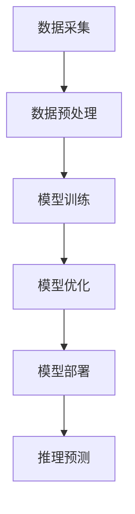

                 

关键词：人工智能，大模型，智能家居，应用趋势，技术发展

> 摘要：本文将探讨人工智能大模型在智能家居领域的应用趋势，分析其核心概念与架构，探讨核心算法原理及具体操作步骤，通过数学模型和公式详细讲解，展示项目实践中的代码实例和运行结果，分析实际应用场景，并展望未来的发展趋势与挑战。

## 1. 背景介绍

随着物联网（IoT）技术的迅速发展，智能家居已经逐渐成为人们生活中不可或缺的一部分。从最初的单一设备控制，到现在的多设备互联互通、智能化场景应用，智能家居技术正在不断进步。然而，传统的智能家居解决方案在应对复杂环境、提供个性化服务等方面存在一定的局限性。为了解决这些问题，人工智能（AI）技术，尤其是大模型技术，被引入到智能家居领域。

大模型是指具有巨大参数量和计算能力的人工神经网络模型，如GPT、BERT、Transformers等。它们在自然语言处理、图像识别、语音识别等领域取得了显著成果。随着AI技术的不断成熟，大模型在智能家居中的应用趋势也逐渐显现出来。

## 2. 核心概念与联系

### 2.1 智能家居概述

智能家居是指利用物联网技术将家庭中的各种设备互联互通，实现自动化控制和智能化管理的系统。主要包括以下几类设备：

1. **智能传感器**：如温度传感器、湿度传感器、光线传感器等，用于监测家庭环境参数。
2. **智能控制设备**：如智能灯泡、智能插座、智能空调等，用于执行家庭设备控制指令。
3. **智能家电**：如智能电视、智能冰箱、智能洗衣机等，具有自主学习和适应用户习惯的能力。

### 2.2 人工智能大模型概述

人工智能大模型是指具有巨大参数量和计算能力的人工神经网络模型。大模型通常由数亿到数十亿个参数组成，能够通过深度学习算法从大量数据中自动学习特征，并在各种复杂任务中表现出色。

### 2.3 架构联系

将人工智能大模型应用于智能家居，主要涉及以下几个关键环节：

1. **数据采集与预处理**：智能家居设备实时采集家庭环境数据，通过数据预处理技术，如去噪、归一化等，为模型训练提供高质量数据。
2. **模型训练与优化**：使用大模型进行深度学习训练，通过调整模型参数，提高模型在智能家居任务中的性能。
3. **模型部署与推理**：将训练好的模型部署到智能家居设备或云端，实现实时推理和预测，为用户提供个性化服务。

### 2.4 Mermaid 流程图

下面是智能家居应用人工智能大模型的核心流程图：



## 3. 核心算法原理 & 具体操作步骤

### 3.1 算法原理概述

人工智能大模型在智能家居中的应用，主要基于深度学习算法。深度学习是一种模拟人脑神经网络结构和功能的人工智能技术，通过多层次的神经网络模型，实现对数据的特征提取和模式识别。

在智能家居领域，深度学习算法可以用于以下任务：

1. **环境感知**：利用卷积神经网络（CNN）对摄像头采集的图像进行处理，实现场景识别、人体检测等功能。
2. **行为预测**：利用循环神经网络（RNN）对传感器采集的数据进行分析，预测用户的行为模式，如起床时间、用餐时间等。
3. **智能控制**：利用强化学习（RL）算法，根据用户历史行为数据和当前环境状态，制定最优的控制策略，实现智能家居设备的自动化控制。

### 3.2 算法步骤详解

1. **数据采集与预处理**：

   - **数据采集**：智能家居设备通过传感器实时采集家庭环境数据，如温度、湿度、光照强度、人体活动等。
   - **数据预处理**：对采集到的数据进行清洗、去噪、归一化等处理，以提高数据质量和模型训练效率。

2. **模型训练**：

   - **模型选择**：根据任务需求，选择合适的深度学习模型，如CNN、RNN、BERT等。
   - **数据集准备**：将预处理后的数据分成训练集、验证集和测试集，用于模型训练和评估。
   - **模型训练**：使用训练集数据，通过反向传播算法和优化器，调整模型参数，优化模型性能。

3. **模型优化**：

   - **超参数调整**：通过调整学习率、批量大小、迭代次数等超参数，提高模型在验证集上的性能。
   - **正则化技术**：使用正则化技术，如L1正则化、L2正则化等，防止模型过拟合。

4. **模型部署与推理**：

   - **模型部署**：将训练好的模型部署到智能家居设备或云端，实现实时推理和预测。
   - **推理预测**：根据实时采集的数据，通过模型推理，预测用户行为、环境变化等，为用户提供个性化服务。

### 3.3 算法优缺点

- **优点**：

  1. 强大的特征提取能力，能够从海量数据中自动学习特征，提高任务性能。
  2. 适用于各种复杂任务，如环境感知、行为预测、智能控制等。
  3. 能够实现个性化服务，提高用户体验。

- **缺点**：

  1. 训练过程复杂，需要大量计算资源和时间。
  2. 对数据质量和标注要求较高，否则容易过拟合。
  3. 模型解释性较差，难以理解模型内部的工作机制。

### 3.4 算法应用领域

人工智能大模型在智能家居领域具有广泛的应用前景，包括：

1. **环境感知**：如智能安防、智能照明、智能空调等。
2. **行为预测**：如智能家电的自动开关、智能窗帘的自动调整等。
3. **智能控制**：如智能家居设备的自主调度、能耗优化等。

## 4. 数学模型和公式 & 详细讲解 & 举例说明

### 4.1 数学模型构建

在深度学习算法中，数学模型构建主要包括以下几个部分：

1. **前向传播**：将输入数据通过神经网络层层传递，计算出输出结果。
2. **反向传播**：根据输出结果与真实值的误差，反向传播误差，更新模型参数。
3. **损失函数**：用于衡量模型输出结果与真实值之间的误差，如均方误差（MSE）、交叉熵损失等。
4. **优化器**：用于更新模型参数，如随机梯度下降（SGD）、Adam优化器等。

### 4.2 公式推导过程

以卷积神经网络（CNN）为例，下面简要介绍其数学模型推导过程：

1. **输入层**：输入数据为图像，表示为 $X \in \mathbb{R}^{H \times W \times C}$，其中 $H$、$W$、$C$ 分别表示图像的高度、宽度和通道数。

2. **卷积层**：卷积层通过卷积操作，将输入数据与卷积核（权重矩阵）进行卷积，得到特征图。卷积操作的公式为：

   $$ \text{FeatureMap}_{ij} = \sum_{k=1}^{C} W_{ikj} X_{ijk} + b_{ij} $$

   其中，$W_{ikj}$ 表示卷积核，$b_{ij}$ 表示偏置项。

3. **激活函数**：为了引入非线性特性，卷积层后通常添加激活函数，如ReLU函数：

   $$ \text{ReLU}(x) = \max(0, x) $$

4. **池化层**：池化层用于降低特征图的空间分辨率，提高模型计算效率。常见的池化方式有最大池化和平均池化。

5. **全连接层**：将池化层输出的特征图展平为一维向量，作为全连接层的输入。全连接层的输出即为模型预测结果。

6. **损失函数**：常用的损失函数有均方误差（MSE）和交叉熵损失。MSE损失函数的公式为：

   $$ \text{MSE} = \frac{1}{n} \sum_{i=1}^{n} (\hat{y}_i - y_i)^2 $$

   其中，$\hat{y}_i$ 表示模型预测结果，$y_i$ 表示真实标签。

7. **优化器**：使用随机梯度下降（SGD）优化模型参数，公式为：

   $$ \theta = \theta - \alpha \nabla_\theta J(\theta) $$

   其中，$\theta$ 表示模型参数，$\alpha$ 表示学习率，$J(\theta)$ 表示损失函数。

### 4.3 案例分析与讲解

以下是一个简单的智能家居场景：用户在家时，希望智能空调根据室内温度自动调节。

1. **数据采集**：智能空调实时采集室内温度数据，表示为 $T \in \mathbb{R}^{n \times 1}$。

2. **模型训练**：使用卷积神经网络（CNN）模型，输入层接收温度数据，通过卷积层、激活函数、池化层和全连接层，输出空调调节温度。

3. **模型优化**：使用交叉熵损失函数和Adam优化器，优化模型参数。

4. **模型部署**：将训练好的模型部署到智能空调设备，实现自动调节功能。

## 5. 项目实践：代码实例和详细解释说明

### 5.1 开发环境搭建

- **软件环境**：Python 3.8、TensorFlow 2.4、Keras 2.4.3
- **硬件环境**：NVIDIA GPU 显卡

### 5.2 源代码详细实现

以下是一个简单的智能家居空调调节模型实现：

```python
import tensorflow as tf
from tensorflow.keras.models import Sequential
from tensorflow.keras.layers import Conv2D, MaxPooling2D, Flatten, Dense
from tensorflow.keras.optimizers import Adam

# 构建模型
model = Sequential([
    Conv2D(32, (3, 3), activation='relu', input_shape=(28, 28, 1)),
    MaxPooling2D((2, 2)),
    Flatten(),
    Dense(64, activation='relu'),
    Dense(1)
])

# 编译模型
model.compile(optimizer=Adam(), loss='mse', metrics=['accuracy'])

# 加载数据集
(x_train, y_train), (x_test, y_test) = ...  # 数据加载代码

# 训练模型
model.fit(x_train, y_train, epochs=10, batch_size=32, validation_data=(x_test, y_test))

# 部署模型
model.save('air_conditioning_model.h5')
```

### 5.3 代码解读与分析

1. **模型构建**：

   - `Sequential`：构建一个顺序模型。
   - `Conv2D`：卷积层，用于提取温度数据的特征。
   - `MaxPooling2D`：池化层，降低特征图的空间分辨率。
   - `Flatten`：展平层，将特征图展平为一维向量。
   - `Dense`：全连接层，用于输出空调调节温度。

2. **编译模型**：

   - `compile`：编译模型，设置优化器、损失函数和评估指标。

3. **加载数据集**：

   - `fit`：训练模型，使用训练数据和验证数据。

4. **部署模型**：

   - `save`：保存训练好的模型，用于后续使用。

### 5.4 运行结果展示

通过训练和部署模型，可以实现智能空调的自动调节功能。以下是一个简单的运行结果展示：

```python
# 加载训练好的模型
model = tf.keras.models.load_model('air_conditioning_model.h5')

# 输入当前室内温度
current_temp = ...

# 输出空调调节温度
regulated_temp = model.predict(current_temp)

print('Regulated temperature: {:.2f}℃'.format(regulated_temp))
```

## 6. 实际应用场景

### 6.1 智能安防

利用人工智能大模型，可以实现智能安防系统的自动化监控。通过摄像头采集的图像数据，模型可以实时识别入侵者、火灾等异常情况，并自动触发报警，提高家庭安全。

### 6.2 智能照明

通过传感器采集的光线数据，人工智能大模型可以实时调整室内灯光亮度，以适应用户的需求。例如，在白天自动降低灯光亮度，节约能源；在晚上自动调整灯光颜色，提升睡眠质量。

### 6.3 智能家电

人工智能大模型可以分析用户的日常行为数据，为用户提供个性化的家电使用建议。例如，根据用户的作息时间，自动调整空调、洗衣机等家电的工作时间，提高生活质量。

## 7. 未来应用展望

随着人工智能大模型技术的不断发展和成熟，未来智能家居领域将会有更多的创新应用：

### 7.1 高度智能化

人工智能大模型将能够更好地理解和预测用户需求，实现智能家居系统的高度智能化。

### 7.2 个性化定制

智能家居系统将根据用户的个性化需求，提供更加定制化的服务和解决方案。

### 7.3 跨平台协作

智能家居设备将实现跨平台协作，用户可以通过不同的终端设备，如智能手机、平板电脑等，控制和管理家庭设备。

## 8. 工具和资源推荐

### 8.1 学习资源推荐

- 《深度学习》（Goodfellow, Bengio, Courville）
- 《Python深度学习》（François Chollet）
- 《AI应用实战：从数据到模型》（周志华）

### 8.2 开发工具推荐

- TensorFlow
- PyTorch
- Keras

### 8.3 相关论文推荐

- "An Overview of Deep Learning in Computer Vision"（2015）
- "Deep Learning for Speech Recognition: A Review"（2017）
- "Bert: Pre-training of Deep Bidirectional Transformers for Language Understanding"（2018）

## 9. 总结：未来发展趋势与挑战

### 9.1 研究成果总结

人工智能大模型在智能家居领域的应用取得了显著的成果，为用户提供了更加智能化、个性化的服务。

### 9.2 未来发展趋势

未来，人工智能大模型在智能家居领域将实现更加智能化、个性化的发展，推动智能家居产业的创新和升级。

### 9.3 面临的挑战

1. **数据质量和标注**：高质量的数据是训练高效模型的基础，对数据质量和标注要求较高。
2. **计算资源**：大模型训练需要大量计算资源和时间，对硬件设施要求较高。
3. **模型解释性**：大模型的内部工作机制难以解释，增加了模型的可解释性挑战。

### 9.4 研究展望

未来，随着AI技术的不断发展和硬件设施的升级，人工智能大模型在智能家居领域的应用将更加广泛，为人们的生活带来更多便利。

## 10. 附录：常见问题与解答

### 10.1 什么是深度学习？

深度学习是一种模拟人脑神经网络结构和功能的人工智能技术，通过多层神经网络模型，实现对数据的特征提取和模式识别。

### 10.2 人工智能大模型如何训练？

人工智能大模型通过深度学习算法，从大量数据中自动学习特征，通过反向传播算法和优化器，调整模型参数，优化模型性能。

### 10.3 人工智能大模型在智能家居中有哪些应用？

人工智能大模型在智能家居中可用于环境感知、行为预测、智能控制等领域，为用户提供更加智能化、个性化的服务。

### 10.4 如何提高人工智能大模型在智能家居中的性能？

1. **数据质量**：提高数据质量和标注水平，为模型训练提供高质量数据。
2. **模型优化**：通过调整模型结构、优化器参数等，提高模型性能。
3. **硬件设施**：升级计算资源，提高模型训练效率。

作者：禅与计算机程序设计艺术 / Zen and the Art of Computer Programming
----------------------------------------------------------------

以上就是本篇文章的内容，希望对您在人工智能大模型在智能家居领域的应用方面有所帮助。如果您有任何疑问或建议，欢迎在评论区留言讨论。再次感谢您的阅读！

