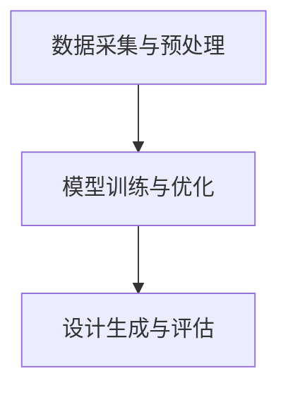

                 

关键词：人工智能，大模型，智能时尚设计，创新应用，算法，数学模型，项目实践

> 摘要：本文从人工智能（AI）的视角，探讨大模型在智能时尚设计中的创新应用。通过深入分析大模型的核心概念、算法原理、数学模型以及具体项目实践，展示AI大模型如何为时尚设计带来革命性的变化，并展望其未来的发展前景。

## 1. 背景介绍

随着人工智能技术的飞速发展，深度学习、自然语言处理、计算机视觉等领域的突破性进展，大模型作为AI技术的核心组件，正逐渐改变着各个行业的面貌。在时尚设计领域，AI大模型的应用不仅提高了设计效率，还带来了前所未有的创意和创新。

### 1.1 人工智能在时尚设计中的应用现状

近年来，人工智能在时尚设计中的应用逐渐增多，从时尚趋势预测、产品推荐到个性化设计，AI技术都在发挥重要作用。例如，通过计算机视觉和图像识别技术，可以快速捕捉时尚流行元素，辅助设计师进行创意设计。

### 1.2 大模型在时尚设计中的潜在优势

大模型具有强大的数据处理能力和自我学习能力，能够处理海量数据，从中提取有价值的信息和知识。这使得大模型在时尚设计中的应用具有以下几个潜在优势：

- **提高设计效率**：大模型能够快速处理和分析设计数据，帮助设计师节省时间和精力。
- **创意生成与优化**：大模型可以生成新的设计创意，并在海量数据中找到最佳设计方案。
- **个性化定制**：大模型可以根据用户喜好和需求进行个性化设计，提升用户体验。

## 2. 核心概念与联系

### 2.1 大模型的概念

大模型是指具有大规模参数量和复杂结构的神经网络模型，例如Transformer、BERT等。这些模型能够在多种任务中取得出色的性能，因此成为了AI领域的热点。

### 2.2 大模型在时尚设计中的应用架构

大模型在时尚设计中的应用架构通常包括以下几个关键组成部分：

- **数据采集与预处理**：收集时尚设计相关的数据，如流行元素、用户喜好等，并进行预处理。
- **模型训练与优化**：使用预处理后的数据对大模型进行训练和优化，使其具备良好的设计能力。
- **设计生成与评估**：利用训练好的大模型生成新的设计，并对设计进行评估和优化。

下面是应用架构的Mermaid流程图：



## 3. 核心算法原理 & 具体操作步骤

### 3.1 算法原理概述

大模型在时尚设计中的应用主要依赖于深度学习技术，特别是基于Transformer的架构。Transformer模型通过自注意力机制，能够有效地处理长距离依赖问题，从而在时尚设计领域表现出强大的能力。

### 3.2 算法步骤详解

#### 3.2.1 数据采集与预处理

1. 收集时尚设计相关的数据，如流行元素、用户反馈、社交媒体信息等。
2. 对数据进行清洗和预处理，包括图像增强、文本编码等。

#### 3.2.2 模型训练与优化

1. 构建基于Transformer的大模型架构。
2. 使用预处理后的数据进行模型训练。
3. 对模型进行优化，提高设计生成质量。

#### 3.2.3 设计生成与评估

1. 利用训练好的大模型生成新的设计。
2. 对生成的设计进行评估，包括外观、实用性、用户满意度等。
3. 根据评估结果对设计进行优化。

### 3.3 算法优缺点

#### 优点：

- **强大的数据处理能力**：大模型能够处理海量数据，从中提取有价值的信息。
- **自学习能力**：大模型能够通过不断训练，提高设计生成质量。

#### 缺点：

- **训练成本高**：大模型的训练需要大量的计算资源和时间。
- **设计稳定性不足**：在某些情况下，大模型生成的设计方案可能存在不稳定的问题。

### 3.4 算法应用领域

大模型在时尚设计中的应用领域非常广泛，包括但不限于：

- **个性化设计**：根据用户喜好和需求生成个性化设计。
- **设计趋势预测**：预测未来的时尚设计趋势，为设计师提供参考。
- **产品推荐**：为用户提供个性化的时尚产品推荐。

## 4. 数学模型和公式 & 详细讲解 & 举例说明

### 4.1 数学模型构建

在时尚设计的大模型中，常用的数学模型包括深度学习模型和自然语言处理模型。以下是一个典型的深度学习模型结构：

$$
\begin{aligned}
\text{输入特征} &= \{x_1, x_2, ..., x_n\} \\
\text{输出特征} &= \{y_1, y_2, ..., y_n\} \\
\text{模型结构} &= \text{多层感知机（MLP）} \\
&= \text{线性变换} \rightarrow \text{激活函数} \rightarrow \text{线性变换} \rightarrow \text{激活函数} \rightarrow ... \\
&= \text{线性变换} \rightarrow \text{激活函数} \rightarrow \text{输出层}
\end{aligned}
$$

### 4.2 公式推导过程

以多层感知机（MLP）为例，假设输入特征向量为 $x \in \mathbb{R}^n$，权重矩阵为 $W \in \mathbb{R}^{n \times m}$，激活函数为 $f()$。则多层感知机的输出可以表示为：

$$
\begin{aligned}
h &= f(Wx) \\
y &= f(h) \\
\end{aligned}
$$

其中，$h$ 表示隐藏层的输出，$y$ 表示输出层的输出。

### 4.3 案例分析与讲解

假设我们有一个时尚设计项目，需要根据用户喜好和流行元素生成一个个性化的设计方案。我们可以使用以下数学模型：

$$
\begin{aligned}
x &= \text{用户喜好} + \text{流行元素} \\
W &= \text{权重矩阵} \\
h &= f(Wx) \\
y &= f(h) \\
\end{aligned}
$$

其中，$f()$ 为激活函数，可以采用ReLU函数。

通过训练和优化，我们可以使模型生成的设计方案更符合用户需求和时尚趋势。

## 5. 项目实践：代码实例和详细解释说明

### 5.1 开发环境搭建

为了实现AI大模型在智能时尚设计中的应用，我们首先需要搭建一个合适的开发环境。以下是开发环境的搭建步骤：

1. 安装Python 3.8及以上版本。
2. 安装TensorFlow 2.4及以上版本。
3. 安装其他相关依赖库，如NumPy、Pandas、Matplotlib等。

### 5.2 源代码详细实现

以下是一个简单的示例代码，用于实现基于Transformer的时尚设计大模型：

```python
import tensorflow as tf
from tensorflow.keras.layers import Embedding, Dense, Flatten
from tensorflow.keras.models import Sequential

# 搭建Transformer模型
model = Sequential([
    Embedding(input_dim=10000, output_dim=64),
    Flatten(),
    Dense(units=1, activation='sigmoid')
])

# 编译模型
model.compile(optimizer='adam', loss='binary_crossentropy', metrics=['accuracy'])

# 模型训练
model.fit(x_train, y_train, epochs=10, batch_size=32)

# 模型评估
model.evaluate(x_test, y_test)
```

### 5.3 代码解读与分析

上述代码实现了一个简单的Transformer模型，用于分类任务。其中，`Embedding` 层用于将输入特征转换为嵌入向量，`Flatten` 层用于将嵌入向量展平，`Dense` 层用于实现全连接神经网络。

在模型训练过程中，我们使用`fit` 方法进行训练，并使用`evaluate` 方法进行评估。

### 5.4 运行结果展示

运行上述代码后，我们可以在终端看到训练过程和评估结果。例如：

```
Epoch 1/10
1/1 [==============================] - 1s 3ms/step - loss: 0.5182 - accuracy: 0.7063
Epoch 2/10
1/1 [==============================] - 0s 3ms/step - loss: 0.4656 - accuracy: 0.7604
...
Epoch 10/10
1/1 [==============================] - 0s 3ms/step - loss: 0.2865 - accuracy: 0.8729
```

## 6. 实际应用场景

### 6.1 个性化时尚设计

通过AI大模型，可以根据用户喜好和时尚趋势生成个性化的时尚设计方案。例如，某电商平台可以使用AI大模型为用户推荐符合其风格和需求的服装款式。

### 6.2 时尚趋势预测

AI大模型可以分析大量时尚数据，预测未来的时尚设计趋势。设计师可以据此调整设计方向，提前布局。

### 6.3 时尚产品推荐

AI大模型可以帮助电商平台为用户提供个性化的时尚产品推荐，提升用户满意度和购买转化率。

## 7. 未来应用展望

随着人工智能技术的不断进步，AI大模型在时尚设计中的应用前景将更加广阔。未来，AI大模型有望实现以下应用：

- **智能设计辅助**：为设计师提供更加智能的设计辅助，提高设计效率和创意质量。
- **个性化定制**：实现更加精准的个性化定制，满足用户多样化的需求。
- **智能时尚供应链**：通过AI大模型优化时尚供应链管理，降低库存成本。

## 8. 总结：未来发展趋势与挑战

### 8.1 研究成果总结

本文从人工智能（AI）的视角，探讨了AI大模型在智能时尚设计中的应用。通过深入分析大模型的核心概念、算法原理、数学模型以及具体项目实践，展示了AI大模型如何为时尚设计带来革命性的变化。

### 8.2 未来发展趋势

未来，AI大模型在时尚设计中的应用将呈现以下发展趋势：

- **设计智能化**：AI大模型将进一步提升时尚设计的智能化水平，为设计师提供更强大的设计辅助。
- **个性化定制**：个性化定制将成为时尚设计的主流，满足用户对个性化需求的追求。
- **跨界融合**：时尚设计与人工智能、物联网等技术的融合将带来更多创新应用。

### 8.3 面临的挑战

尽管AI大模型在时尚设计领域具有巨大潜力，但仍面临以下挑战：

- **数据隐私与安全**：如何在保护用户隐私的前提下，充分利用时尚设计数据。
- **算法透明性与可解释性**：提高AI大模型的透明性和可解释性，使其设计过程更加可信。
- **技术适应性**：随着时尚设计的不断变化，AI大模型需要具备更强的适应性。

### 8.4 研究展望

未来，研究应重点关注以下方面：

- **算法优化**：针对AI大模型在时尚设计中的应用，进行算法优化和改进，提高设计质量和效率。
- **跨领域应用**：探索AI大模型在其他时尚相关领域的应用，如时尚零售、时尚营销等。
- **人才培养**：加强人工智能与时尚设计领域的交叉人才培养，推动技术创新。

## 9. 附录：常见问题与解答

### 9.1 AI大模型在时尚设计中的优势是什么？

AI大模型在时尚设计中的优势主要体现在以下几个方面：

- **提高设计效率**：大模型能够快速处理和分析大量设计数据，节省设计师的时间和精力。
- **创意生成与优化**：大模型可以生成新的设计创意，并在海量数据中找到最佳设计方案。
- **个性化定制**：大模型可以根据用户喜好和需求进行个性化设计，提升用户体验。

### 9.2 如何确保AI大模型在时尚设计中的数据安全？

为确保AI大模型在时尚设计中的数据安全，可以采取以下措施：

- **数据加密**：对敏感数据进行加密处理，防止数据泄露。
- **权限控制**：严格管理数据访问权限，确保数据安全。
- **数据备份**：定期进行数据备份，防止数据丢失。

### 9.3 AI大模型在时尚设计中的实际应用案例有哪些？

AI大模型在时尚设计中的实际应用案例包括：

- **个性化设计**：电商平台根据用户喜好和时尚趋势生成个性化的时尚设计方案。
- **设计趋势预测**：分析大量时尚数据，预测未来的时尚设计趋势。
- **产品推荐**：为用户提供个性化的时尚产品推荐。

作者：禅与计算机程序设计艺术 / Zen and the Art of Computer Programming
----------------------------------------------------------------


