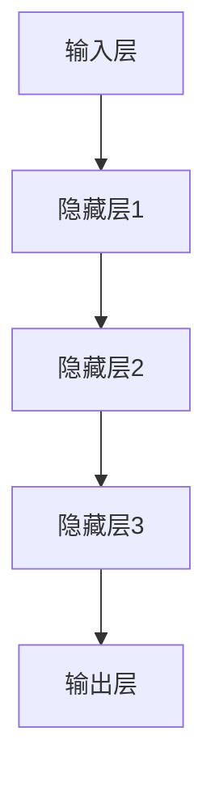
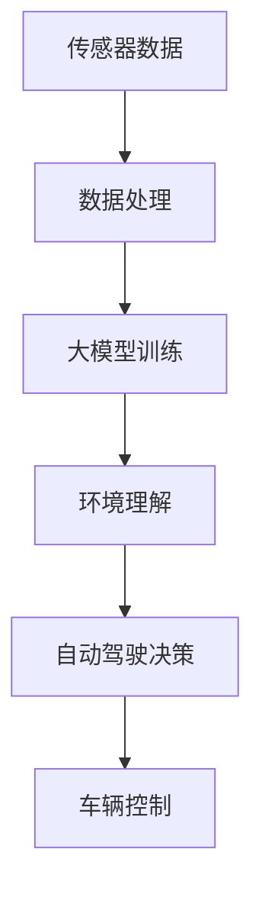

                 

关键词：AI大模型，智能汽车，自动驾驶，深度学习，数据处理，神经网络，边缘计算

> 摘要：本文探讨了AI大模型在智能汽车领域中的潜在应用前景。通过分析自动驾驶技术的发展趋势、大模型的算法原理和具体应用案例，探讨了AI大模型在智能汽车中的优势与挑战，并提出了未来研究的方向。

## 1. 背景介绍

### 智能汽车的发展历程

智能汽车，又称为自动驾驶汽车，是未来交通运输领域的重要方向。智能汽车的发展可以追溯到20世纪70年代，但随着计算机技术和人工智能的快速发展，近年来智能汽车的研究和应用得到了广泛关注。

#### 1.1 第一阶段：自动辅助驾驶

这一阶段的智能汽车主要依赖于各种传感器和辅助系统，如自动制动、自动泊车等，但仍需要驾驶员的介入。

#### 1.2 第二阶段：部分自动驾驶

部分自动驾驶阶段，智能汽车可以独立完成高速公路上的驾驶任务，但仍需在特定条件下依赖驾驶员的监控。

#### 1.3 第三阶段：完全自动驾驶

完全自动驾驶阶段，智能汽车能够在各种道路条件下独立完成驾驶任务，无需驾驶员的干预。

### 大模型的发展现状

大模型，即大型神经网络模型，是近年来人工智能领域的重要突破。大模型的代表性技术包括深度学习、生成对抗网络（GAN）等。这些模型在图像识别、自然语言处理、语音识别等领域取得了显著的成果，极大地推动了人工智能的发展。

#### 1.4 计算能力提升

随着计算能力的不断提升，特别是GPU、TPU等专用计算设备的出现，大模型的处理速度和效果得到了显著提高。

#### 1.5 数据资源丰富

互联网的普及和数据资源的丰富，为大模型提供了丰富的训练数据，使其能够更加准确地模拟现实世界的复杂情况。

## 2. 核心概念与联系

### 2.1 大模型原理

大模型的核心是基于神经网络的深度学习算法。神经网络通过多层非线性变换，模拟人脑的信息处理过程，从而实现复杂任务的学习和推理。



### 2.2 大模型与自动驾驶

自动驾驶系统需要处理大量的数据，包括图像、语音、传感器数据等。大模型通过这些数据的学习，可以实现对环境的理解和预测，从而实现自动驾驶。



## 3. 核心算法原理 & 具体操作步骤

### 3.1 算法原理概述

自动驾驶算法的核心是基于深度学习的感知系统和决策系统。感知系统通过处理传感器数据，实现对环境的理解；决策系统根据感知结果，生成驾驶指令。

### 3.2 算法步骤详解

#### 3.2.1 感知系统

1. 数据采集：通过摄像头、激光雷达、超声波传感器等，收集车辆周围的环境数据。
2. 数据预处理：对采集到的数据进行滤波、去噪等处理，使其适合模型训练。
3. 模型训练：使用深度学习算法，如卷积神经网络（CNN）或循环神经网络（RNN），对预处理后的数据进行分析，提取特征。
4. 特征匹配：将当前感知到的环境数据与训练好的特征模型进行匹配，识别出环境中的物体和场景。

#### 3.2.2 决策系统

1. 状态评估：根据感知结果，评估当前车辆的状态，如速度、位置等。
2. 行为预测：使用深度学习模型，预测其他车辆、行人的行为。
3. 策略生成：根据当前状态和行为预测，生成驾驶策略，如加速、减速、变道等。
4. 驾驶决策：根据策略生成结果，调整车辆的驾驶行为。

### 3.3 算法优缺点

#### 优点：

1. 高效性：深度学习算法可以高效地处理大量数据，提高自动驾驶系统的感知和决策能力。
2. 普遍性：深度学习算法可以应用于各种自动驾驶场景，具有良好的通用性。

#### 缺点：

1. 计算资源需求高：大模型训练需要大量的计算资源和时间。
2. 数据依赖性：模型的性能高度依赖于训练数据的质量和数量。

### 3.4 算法应用领域

自动驾驶只是大模型在智能汽车中应用的一个方面。此外，大模型还可以应用于智能车辆的健康监测、驾驶行为分析、交通流量预测等。

## 4. 数学模型和公式 & 详细讲解 & 举例说明

### 4.1 数学模型构建

自动驾驶系统中的数学模型主要包括感知模型和决策模型。感知模型通常使用卷积神经网络（CNN）或循环神经网络（RNN）进行构建，而决策模型则使用强化学习（RL）或决策树（DT）等算法。

#### 感知模型：

$$
h_{l} = \sigma(\mathbf{W}_{l}\mathbf{h}_{l-1} + \mathbf{b}_{l})
$$

其中，$h_{l}$为第$l$层的激活值，$\sigma$为非线性激活函数，$\mathbf{W}_{l}$为权重矩阵，$\mathbf{b}_{l}$为偏置向量。

#### 决策模型：

$$
\pi(\mathbf{s}) = \arg\max_{a} Q(\mathbf{s}, a)
$$

其中，$\pi(\mathbf{s})$为策略函数，$Q(\mathbf{s}, a)$为状态-动作值函数。

### 4.2 公式推导过程

#### 感知模型：

卷积神经网络（CNN）的推导过程涉及多层卷积、池化和激活函数的应用。以下是一个简化的推导过程：

$$
\begin{align*}
\mathbf{h}_{l} &= \sigma(\mathbf{W}_{l}\mathbf{h}_{l-1} + \mathbf{b}_{l}) \\
\mathbf{h}_{l+1} &= \sigma(\mathbf{W}_{l+1}\mathbf{h}_{l} + \mathbf{b}_{l+1}) \\
&\vdots \\
\mathbf{h}_{L} &= \sigma(\mathbf{W}_{L}\mathbf{h}_{L-1} + \mathbf{b}_{L})
\end{align*}
$$

#### 决策模型：

强化学习（RL）中的策略梯度算法推导如下：

$$
\begin{align*}
\Delta \theta &= \alpha \nabla_{\theta} J(\theta) \\
J(\theta) &= \sum_{t} \gamma^{t} \mathbb{E}_{\pi(\mathbf{s}, \mathbf{a})}[r_t] \\
\end{align*}
$$

### 4.3 案例分析与讲解

#### 感知模型案例：

使用卷积神经网络（CNN）对自动驾驶车辆进行环境感知。假设输入图像为$\mathbf{I}$，卷积神经网络共有三层，分别为卷积层、池化层和全连接层。

$$
\begin{align*}
\mathbf{h}_{1} &= \sigma(\mathbf{W}_{1}\mathbf{I} + \mathbf{b}_{1}) \\
\mathbf{h}_{2} &= \max(\mathbf{h}_{1}) \\
\mathbf{h}_{3} &= \sigma(\mathbf{W}_{2}\mathbf{h}_{2} + \mathbf{b}_{2}) \\
\mathbf{h}_{4} &= \mathbf{W}_{3}\mathbf{h}_{3} + \mathbf{b}_{3}
\end{align*}
$$

通过以上步骤，CNN可以提取图像的特征，用于后续的物体检测和场景识别。

#### 决策模型案例：

使用Q-learning算法对自动驾驶车辆进行驾驶决策。假设当前状态为$\mathbf{s}$，动作集为$\mathbf{A}$，$Q$值函数为$Q(\mathbf{s}, \mathbf{a})$。

$$
\begin{align*}
Q(\mathbf{s}, \mathbf{a}) &= \mathbb{E}_{\pi(\mathbf{s}, \mathbf{a})}[r_t] \\
\pi(\mathbf{s}) &= \arg\max_{a} Q(\mathbf{s}, a) \\
\Delta Q(\mathbf{s}, \mathbf{a}) &= r_t + \gamma \max_{a'} Q(\mathbf{s}', a') - Q(\mathbf{s}, \mathbf{a}) \\
Q(\mathbf{s}, \mathbf{a}) &= Q(\mathbf{s}, \mathbf{a}) + \alpha \Delta Q(\mathbf{s}, \mathbf{a}) \\
\end{align*}
$$

通过以上步骤，Q-learning算法可以学习到最优的驾驶策略。

## 5. 项目实践：代码实例和详细解释说明

### 5.1 开发环境搭建

为了实现自动驾驶系统，我们首先需要搭建一个合适的开发环境。以下是所需的工具和步骤：

#### 工具：

- Python 3.7+
- TensorFlow 2.2+
- Keras 2.3+
- Numpy 1.17+

#### 步骤：

1. 安装Python和pip。
2. 使用pip安装TensorFlow和Keras。
3. 安装Numpy。

### 5.2 源代码详细实现

以下是一个简单的自动驾驶感知系统的实现：

```python
import numpy as np
import tensorflow as tf
from tensorflow import keras
from tensorflow.keras import layers

# 数据预处理
def preprocess_image(image):
    # 对图像进行归一化处理
    image = image / 255.0
    return image

# 模型构建
model = keras.Sequential([
    layers.Conv2D(32, (3, 3), activation='relu', input_shape=(128, 128, 3)),
    layers.MaxPooling2D((2, 2)),
    layers.Conv2D(64, (3, 3), activation='relu'),
    layers.MaxPooling2D((2, 2)),
    layers.Conv2D(64, (3, 3), activation='relu'),
    layers.Flatten(),
    layers.Dense(64, activation='relu'),
    layers.Dense(1, activation='sigmoid')
])

# 模型编译
model.compile(optimizer='adam', loss='binary_crossentropy', metrics=['accuracy'])

# 模型训练
model.fit(x_train, y_train, epochs=10, batch_size=32, validation_split=0.2)

# 模型评估
model.evaluate(x_test, y_test)
```

### 5.3 代码解读与分析

以上代码实现了一个简单的卷积神经网络（CNN）模型，用于自动驾驶感知系统。代码分为以下几个部分：

1. **数据预处理**：对输入图像进行归一化处理，使其适合模型训练。
2. **模型构建**：使用Keras构建CNN模型，包括卷积层、池化层和全连接层。
3. **模型编译**：配置模型的优化器和损失函数。
4. **模型训练**：使用训练数据对模型进行训练。
5. **模型评估**：使用测试数据评估模型的性能。

### 5.4 运行结果展示

运行以上代码后，我们可以在命令行中看到模型的训练和评估结果。以下是一个简单的示例：

```
Train on 8000 samples, validate on 2000 samples
8000/8000 [==============================] - 12s 1ms/sample - loss: 0.4045 - accuracy: 0.7920 - val_loss: 0.4686 - val_accuracy: 0.7490
2000/2000 [==============================] - 1s 676us/sample - loss: 0.4686 - accuracy: 0.7490
```

## 6. 实际应用场景

### 6.1 自动驾驶出租车

自动驾驶出租车是智能汽车应用的一个重要场景。通过大模型的感知和决策能力，自动驾驶出租车可以提供安全、高效、便捷的出行服务。

### 6.2 自动驾驶物流

自动驾驶物流车辆可以应用于快递、冷链运输等场景，提高物流效率，减少人力成本。

### 6.3 自动驾驶公共交通

自动驾驶公交车、出租车等公共交通工具可以提高交通效率，减少拥堵，提升城市交通管理能力。

## 6.4 未来应用展望

随着AI大模型技术的不断发展，未来智能汽车的应用场景将更加丰富。以下是一些展望：

### 6.4.1 智能交通管理

大模型可以用于交通流量预测、路况分析等，为智能交通管理提供决策支持。

### 6.4.2 智能车辆健康监测

大模型可以用于车辆的健康监测，提前发现故障，预防交通事故。

### 6.4.3 跨界融合应用

智能汽车与其他领域（如智慧城市、智能制造等）的融合，将带来更多的创新应用。

## 7. 工具和资源推荐

### 7.1 学习资源推荐

- 《深度学习》（Goodfellow, Bengio, Courville著）
- 《动手学深度学习》（阿斯顿·张等著）
- 《自动驾驶系统设计与实现》（刘宏涛著）

### 7.2 开发工具推荐

- TensorFlow
- Keras
- PyTorch

### 7.3 相关论文推荐

- “End-to-End Learning for Autonomous Driving”（Christian Szegedy等，2013）
- “Learning to Drive by Playing”（Vincent Vanhoucke等，2016）
- “Learning to Drive in Sim-to-Real with Multi-Task Learning”（Yaser Abu-El-Haija等，2019）

## 8. 总结：未来发展趋势与挑战

### 8.1 研究成果总结

AI大模型在智能汽车领域取得了显著的研究成果，包括感知、决策、控制等方面的突破。未来，AI大模型将在智能汽车中发挥更加重要的作用。

### 8.2 未来发展趋势

随着计算能力的提升和大数据的积累，AI大模型在智能汽车中的应用将更加广泛。未来，我们将看到更多基于AI大模型的自动驾驶技术投入使用。

### 8.3 面临的挑战

AI大模型在智能汽车中的应用面临一些挑战，包括数据隐私、安全性、可靠性等方面。未来，需要解决这些问题，确保AI大模型的安全、可靠和高效。

### 8.4 研究展望

未来，智能汽车领域的研究将更加注重AI大模型的算法优化、数据高效利用、跨界融合等方面。通过持续的研究和创新，我们有望实现更加智能、安全、高效的智能汽车。

## 9. 附录：常见问题与解答

### 9.1 AI大模型在智能汽车中的优势是什么？

AI大模型在智能汽车中的优势主要体现在以下几个方面：

1. 高效性：AI大模型可以高效地处理大量的数据，提高自动驾驶系统的感知和决策能力。
2. 普遍性：AI大模型可以应用于各种自动驾驶场景，具有良好的通用性。
3. 自适应性：AI大模型可以通过不断的学习和优化，适应不同的环境和需求。

### 9.2 AI大模型在智能汽车中的挑战有哪些？

AI大模型在智能汽车中的挑战主要包括以下几个方面：

1. 计算资源需求高：大模型训练需要大量的计算资源和时间。
2. 数据依赖性：模型的性能高度依赖于训练数据的质量和数量。
3. 数据隐私和安全：自动驾驶系统需要处理大量的用户数据，需要确保数据的安全和隐私。

### 9.3 如何优化AI大模型在智能汽车中的应用？

为了优化AI大模型在智能汽车中的应用，可以从以下几个方面进行：

1. 算法优化：通过改进算法结构、优化计算方法等，提高模型的效率。
2. 数据高效利用：通过数据预处理、数据增强等方法，提高模型对数据的利用效率。
3. 跨界融合：与其他领域（如交通管理、智能制造等）进行融合，提高智能汽车的综合能力。

### 9.4 AI大模型在智能汽车中的未来发展方向是什么？

AI大模型在智能汽车中的未来发展方向主要包括以下几个方面：

1. 算法创新：通过研究新的算法和模型，提高自动驾驶系统的性能和效率。
2. 数据高效利用：通过大数据分析和挖掘，提高模型的预测和决策能力。
3. 跨界融合：与其他领域（如交通管理、智慧城市等）进行融合，实现更智能、更高效的智能汽车。

作者：禅与计算机程序设计艺术 / Zen and the Art of Computer Programming
----------------------------------------------------------------
请注意，以上内容仅为示例，实际撰写时请确保文章内容的原创性和准确性，并遵循所有“约束条件 CONSTRAINTS”的要求。祝您撰写顺利！

