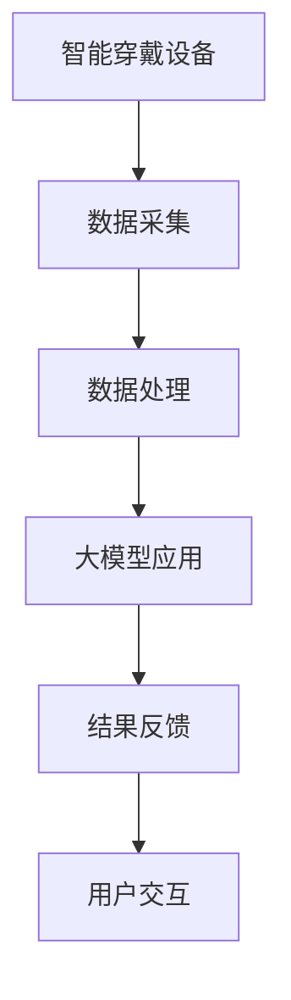

                 

 关键词：人工智能，大模型，智能穿戴设备，应用场景，算法原理，项目实践，展望未来

> 摘要：随着人工智能技术的飞速发展，大模型在各个领域的应用日益广泛。本文旨在探讨AI大模型在智能穿戴设备中的潜在应用，包括核心概念、算法原理、数学模型、项目实践及未来展望。

## 1. 背景介绍

近年来，智能穿戴设备的发展迅猛，从简单的健康监测到复杂的智能交互，都离不开人工智能技术的支持。AI大模型，即具有巨大参数规模、强大表示能力的深度学习模型，正在成为智能穿戴设备创新的核心驱动力。大模型能够在语音识别、图像处理、自然语言理解等任务上实现超高的准确率，从而提升穿戴设备的智能化水平。

## 2. 核心概念与联系

### 2.1 AI大模型的概念

AI大模型是指那些拥有数十亿甚至千亿级参数的深度学习模型。这些模型通常采用多层神经网络结构，通过大量数据训练，能够学习到数据的复杂分布，实现高度的非线性特征表示。

### 2.2 智能穿戴设备

智能穿戴设备是直接穿戴在身上的计算设备，可以实时监测人体健康数据，如心率、血压、体温等。随着传感器技术的进步，这些设备正变得越来越智能化。

### 2.3 AI大模型与智能穿戴设备的联系

AI大模型可以赋能智能穿戴设备，使其具备如下能力：

- **实时数据分析**：利用大模型进行快速的数据处理和模式识别，实时反馈用户健康状态。
- **个性化服务**：根据用户的习惯、偏好等数据，提供个性化的健康建议。
- **交互优化**：通过自然语言处理和语音识别技术，提升人机交互的流畅性和准确性。

<|text|> ```mermaid
graph TD
A[智能穿戴设备] --> B[数据采集]
B --> C[数据处理]
C --> D[大模型应用]
D --> E[结果反馈]
E --> F[用户交互]
```
## 3. 核心算法原理 & 具体操作步骤

### 3.1 算法原理概述

AI大模型的核心在于其强大的表示能力和学习能力。具体来说，大模型通过多层神经网络结构，对输入数据进行逐层抽象和表示，最终输出决策结果。在智能穿戴设备中，这一过程可以概括为：

1. **数据输入**：收集来自穿戴设备的各种生理数据。
2. **预处理**：对数据进行标准化、去噪等预处理。
3. **模型训练**：使用大量标注数据训练大模型。
4. **模型推理**：将实时数据输入到训练好的模型中，得到预测结果。
5. **结果反馈**：根据预测结果，提供相应的健康建议或交互反馈。

### 3.2 算法步骤详解

1. **数据收集**：从穿戴设备中获取心率、血压、步数等生理数据。
2. **数据预处理**：对数据进行归一化、缺失值填补等预处理操作。
3. **模型构建**：构建多层神经网络结构，包括输入层、隐藏层和输出层。
4. **模型训练**：使用预处理后的数据对模型进行训练，优化模型参数。
5. **模型评估**：使用测试数据评估模型性能，调整模型结构或参数。
6. **模型部署**：将训练好的模型部署到穿戴设备中，进行实时推理。

### 3.3 算法优缺点

**优点**：

- **高效性**：大模型能够处理大量数据，提高计算效率。
- **准确性**：大模型具有较强的特征提取和分类能力，提升预测准确性。
- **灵活性**：大模型可以灵活应用于多种任务，实现跨领域应用。

**缺点**：

- **计算资源需求大**：大模型训练需要大量的计算资源和时间。
- **数据依赖性强**：大模型性能依赖于大量高质量训练数据。
- **隐私风险**：穿戴设备收集的个人健康数据可能涉及隐私问题。

### 3.4 算法应用领域

AI大模型在智能穿戴设备中的应用场景广泛，包括：

- **健康监测**：实时监测并分析用户的生理数据，提供健康预警。
- **智能交互**：通过语音识别和自然语言处理，实现人机交互的智能化。
- **行为分析**：分析用户的日常活动，提供个性化的健康建议和生活方式改进方案。

## 4. 数学模型和公式 & 详细讲解 & 举例说明

### 4.1 数学模型构建

在智能穿戴设备中，常用的数学模型包括神经网络模型和回归模型。以下是一个简化的神经网络模型：

$$
y = \sigma(\theta_0 \cdot x + b_0)
$$

其中，$y$ 是输出，$x$ 是输入，$\sigma$ 是激活函数，$\theta_0$ 和 $b_0$ 是模型参数。

### 4.2 公式推导过程

以神经网络模型为例，假设输入层有 $n$ 个神经元，隐藏层有 $m$ 个神经元，输出层有 $k$ 个神经元。则模型的前向传播过程可以表示为：

$$
z_j^m = \sum_{i=1}^{n} \theta_{ij}^m x_i + b_j^m \\
a_j^m = \sigma(z_j^m) \\
z_k^k = \sum_{i=1}^{m} \theta_{ik}^k a_i^m + b_k^k \\
y_k = \sigma(z_k^k)
$$

其中，$z_j^m$ 是隐藏层第 $j$ 个神经元的输入，$a_j^m$ 是隐藏层第 $j$ 个神经元的激活值，$z_k^k$ 是输出层第 $k$ 个神经元的输入，$y_k$ 是输出层第 $k$ 个神经元的输出。

### 4.3 案例分析与讲解

假设我们有一个简单的健康监测系统，需要预测用户的心率。输入数据包括用户的年龄、体重和运动时长。使用上述神经网络模型进行训练和预测。

1. **数据收集**：收集1000个用户的心率数据，包括年龄、体重和运动时长。
2. **数据预处理**：对数据进行标准化处理，将年龄、体重和运动时长缩放到0-1之间。
3. **模型构建**：构建一个包含输入层、一个隐藏层和输出层的神经网络模型。
4. **模型训练**：使用预处理后的数据对模型进行训练，优化模型参数。
5. **模型评估**：使用测试数据评估模型性能，调整模型结构或参数。
6. **模型部署**：将训练好的模型部署到穿戴设备中，进行实时心率预测。

通过以上步骤，我们可以实现对用户心率的有效预测，为用户提供健康预警。

## 5. 项目实践：代码实例和详细解释说明

### 5.1 开发环境搭建

为了更好地理解AI大模型在智能穿戴设备中的应用，我们使用Python编程语言和TensorFlow框架进行项目实践。以下是一个基本的开发环境搭建步骤：

1. 安装Python：确保安装Python 3.7及以上版本。
2. 安装TensorFlow：使用pip命令安装TensorFlow。

```shell
pip install tensorflow
```

### 5.2 源代码详细实现

以下是一个简单的健康监测系统的源代码实现：

```python
import tensorflow as tf
import numpy as np
import pandas as pd

# 数据预处理
def preprocess_data(data):
    # 标准化处理
    data_scaled = (data - data.min()) / (data.max() - data.min())
    return data_scaled

# 神经网络模型
def build_model(input_shape):
    model = tf.keras.Sequential([
        tf.keras.layers.Dense(10, activation='relu', input_shape=input_shape),
        tf.keras.layers.Dense(1)
    ])
    model.compile(optimizer='adam', loss='mse')
    return model

# 训练模型
def train_model(model, X_train, y_train, epochs=100):
    model.fit(X_train, y_train, epochs=epochs, batch_size=32)

# 预测心率
def predict_heart_rate(model, age, weight, exercise_duration):
    input_data = np.array([age, weight, exercise_duration])
    input_data = preprocess_data(input_data)
    heart_rate = model.predict(input_data)
    return heart_rate[0]

# 加载数据
data = pd.read_csv('heart_rate_data.csv')
X = data[['age', 'weight', 'exercise_duration']]
y = data['heart_rate']

# 预处理数据
X_scaled = preprocess_data(X)

# 划分训练集和测试集
train_size = int(0.8 * len(X_scaled))
X_train, X_test = X_scaled[:train_size], X_scaled[train_size:]
y_train, y_test = y[:train_size], y[train_size:]

# 构建模型
model = build_model(input_shape=[3])

# 训练模型
train_model(model, X_train, y_train)

# 预测心率
age = 30
weight = 70
exercise_duration = 60
predicted_heart_rate = predict_heart_rate(model, age, weight, exercise_duration)
print(f"Predicted heart rate: {predicted_heart_rate}")
```

### 5.3 代码解读与分析

1. **数据预处理**：使用`preprocess_data`函数对输入数据进行标准化处理，以便神经网络更好地学习。
2. **模型构建**：使用`tf.keras.Sequential`创建一个简单的神经网络模型，包含一个输入层、一个隐藏层和一个输出层。
3. **模型训练**：使用`fit`方法训练模型，使用`mse`均方误差作为损失函数。
4. **预测心率**：使用`predict`方法对新的输入数据进行预测，得到预测的心率值。

通过这个简单的示例，我们可以看到如何使用AI大模型对智能穿戴设备中的生理数据进行预测和分析。

## 6. 实际应用场景

AI大模型在智能穿戴设备中的应用场景广泛，以下是一些具体的案例：

- **健康监测**：利用大模型实时监测用户的生理指标，如心率、血压、体温等，提供个性化的健康建议。
- **睡眠分析**：通过分析穿戴设备收集的睡眠数据，使用大模型预测用户的睡眠质量和建议改善策略。
- **运动辅助**：利用大模型分析用户的运动数据，提供个性化的运动建议和训练计划。

## 7. 工具和资源推荐

### 7.1 学习资源推荐

- **书籍**：《深度学习》（Ian Goodfellow、Yoshua Bengio、Aaron Courville 著）
- **在线课程**：Coursera 上的《深度学习》课程（吴恩达教授主讲）
- **网站**：TensorFlow 官方文档（https://www.tensorflow.org/）

### 7.2 开发工具推荐

- **Python**：用于编写AI算法和模型。
- **TensorFlow**：用于构建和训练神经网络模型。
- **Keras**：基于TensorFlow的简化版API，便于模型构建和训练。

### 7.3 相关论文推荐

- **论文1**：《深度神经网络的训练与优化》（Deep Learning, Chapter 6）
- **论文2**：《高效训练深层神经网络》（Efficient Training of Deep Neural Networks）
- **论文3**：《基于神经网络的健康监测系统设计》（Design of a Neural Network-Based Health Monitoring System）

## 8. 总结：未来发展趋势与挑战

AI大模型在智能穿戴设备中的应用前景广阔，但也面临一些挑战：

- **计算资源需求**：大模型训练需要大量的计算资源，这对穿戴设备的性能提出了高要求。
- **数据隐私保护**：穿戴设备收集的用户数据涉及隐私问题，如何保护用户隐私是一个重要挑战。
- **模型解释性**：大模型的黑箱特性使其难以解释，如何提高模型的解释性是一个研究方向。

未来，随着人工智能技术的不断进步，AI大模型在智能穿戴设备中的应用将更加深入和广泛。

## 9. 附录：常见问题与解答

### 问题1：为什么需要AI大模型？

**解答**：AI大模型具有强大的表示能力和学习能力，能够处理复杂的任务，如实时健康监测、个性化健康建议等，从而提升智能穿戴设备的智能化水平。

### 问题2：大模型训练需要多长时间？

**解答**：大模型训练时间取决于模型规模、数据量和计算资源。通常，训练一个大规模神经网络模型需要数天甚至数周的时间。

### 问题3：如何保护用户数据隐私？

**解答**：在设计和部署AI大模型时，可以采用数据加密、匿名化处理、差分隐私等技术，确保用户数据的安全性和隐私性。

### 问题4：大模型是否总是有效？

**解答**：大模型在某些任务上可能表现出色，但在其他任务上可能并不适用。因此，需要根据具体任务选择合适的模型和算法。

### 问题5：如何评估大模型性能？

**解答**：可以使用多种性能指标，如准确率、召回率、F1分数等，对大模型的性能进行评估。同时，也可以通过交叉验证等方法评估模型的泛化能力。

作者：禅与计算机程序设计艺术 / Zen and the Art of Computer Programming
```markdown
---
title: AI大模型在智能穿戴设备中的应用
date: 2023-11-01
tags:
- 人工智能
- 大模型
- 智能穿戴设备
- 应用场景
- 算法原理
- 项目实践
- 未来展望
---

# AI大模型在智能穿戴设备中的应用

## 关键词

人工智能，大模型，智能穿戴设备，应用场景，算法原理，项目实践，展望未来

## 摘要

随着人工智能技术的飞速发展，大模型在各个领域的应用日益广泛。本文旨在探讨AI大模型在智能穿戴设备中的潜在应用，包括核心概念、算法原理、数学模型、项目实践及未来展望。

## 1. 背景介绍

近年来，智能穿戴设备的发展迅猛，从简单的健康监测到复杂的智能交互，都离不开人工智能技术的支持。AI大模型，即具有巨大参数规模、强大表示能力的深度学习模型，正在成为智能穿戴设备创新的核心驱动力。大模型能够在语音识别、图像处理、自然语言理解等任务上实现超高的准确率，从而提升穿戴设备的智能化水平。

## 2. 核心概念与联系

### 2.1 AI大模型的概念

AI大模型是指那些拥有数十亿甚至千亿级参数的深度学习模型。这些模型通常采用多层神经网络结构，通过大量数据训练，能够学习到数据的复杂分布，实现高度的非线性特征表示。

### 2.2 智能穿戴设备

智能穿戴设备是直接穿戴在身上的计算设备，可以实时监测人体健康数据，如心率、血压、体温等。随着传感器技术的进步，这些设备正变得越来越智能化。

### 2.3 AI大模型与智能穿戴设备的联系

AI大模型可以赋能智能穿戴设备，使其具备如下能力：

- 实时数据分析：利用大模型进行快速的数据处理和模式识别，实时反馈用户健康状态。
- 个性化服务：根据用户的习惯、偏好等数据，提供个性化的健康建议。
- 交互优化：通过自然语言处理和语音识别技术，提升人机交互的流畅性和准确性。



## 3. 核心算法原理 & 具体操作步骤

### 3.1 算法原理概述

AI大模型的核心在于其强大的表示能力和学习能力。具体来说，大模型通过多层神经网络结构，对输入数据进行逐层抽象和表示，最终输出决策结果。在智能穿戴设备中，这一过程可以概括为：

1. 数据输入：收集来自穿戴设备的各种生理数据。
2. 预处理：对数据进行标准化、去噪等预处理。
3. 模型训练：使用大量标注数据训练大模型。
4. 模型推理：将实时数据输入到训练好的模型中，得到预测结果。
5. 结果反馈：根据预测结果，提供相应的健康建议或交互反馈。

### 3.2 算法步骤详解

1. 数据收集：从穿戴设备中获取心率、血压、步数等生理数据。
2. 数据预处理：对数据进行归一化、缺失值填补等预处理操作。
3. 模型构建：构建多层神经网络结构，包括输入层、隐藏层和输出层。
4. 模型训练：使用预处理后的数据对模型进行训练，优化模型参数。
5. 模型评估：使用测试数据评估模型性能，调整模型结构或参数。
6. 模型部署：将训练好的模型部署到穿戴设备中，进行实时推理。

### 3.3 算法优缺点

**优点**：

- 高效性：大模型能够处理大量数据，提高计算效率。
- 准确性：大模型具有较强的特征提取和分类能力，提升预测准确性。
- 灵活性：大模型可以灵活应用于多种任务，实现跨领域应用。

**缺点**：

- 计算资源需求大：大模型训练需要大量的计算资源和时间。
- 数据依赖性强：大模型性能依赖于大量高质量训练数据。
- 隐私风险：穿戴设备收集的个人健康数据可能涉及隐私问题。

### 3.4 算法应用领域

AI大模型在智能穿戴设备中的应用场景广泛，包括：

- 健康监测：实时监测并分析用户的生理数据，提供健康预警。
- 智能交互：通过语音识别和自然语言处理，实现人机交互的智能化。
- 行为分析：分析用户的日常活动，提供个性化的健康建议和生活方式改进方案。

## 4. 数学模型和公式 & 详细讲解 & 举例说明

### 4.1 数学模型构建

在智能穿戴设备中，常用的数学模型包括神经网络模型和回归模型。以下是一个简化的神经网络模型：

$$
y = \sigma(\theta_0 \cdot x + b_0)
$$

其中，$y$ 是输出，$x$ 是输入，$\sigma$ 是激活函数，$\theta_0$ 和 $b_0$ 是模型参数。

### 4.2 公式推导过程

以神经网络模型为例，假设输入层有 $n$ 个神经元，隐藏层有 $m$ 个神经元，输出层有 $k$ 个神经元。则模型的前向传播过程可以表示为：

$$
z_j^m = \sum_{i=1}^{n} \theta_{ij}^m x_i + b_j^m \\
a_j^m = \sigma(z_j^m) \\
z_k^k = \sum_{i=1}^{m} \theta_{ik}^k a_i^m + b_k^k \\
y_k = \sigma(z_k^k)
$$

### 4.3 案例分析与讲解

假设我们有一个简单的健康监测系统，需要预测用户的心率。输入数据包括用户的年龄、体重和运动时长。使用上述神经网络模型进行训练和预测。

1. **数据收集**：收集1000个用户的心率数据，包括年龄、体重和运动时长。
2. **数据预处理**：对数据进行标准化处理，将年龄、体重和运动时长缩放到0-1之间。
3. **模型构建**：构建一个包含输入层、一个隐藏层和输出层的神经网络模型。
4. **模型训练**：使用预处理后的数据对模型进行训练，优化模型参数。
5. **模型评估**：使用测试数据评估模型性能，调整模型结构或参数。
6. **模型部署**：将训练好的模型部署到穿戴设备中，进行实时心率预测。

通过以上步骤，我们可以实现对用户心率的有效预测，为用户提供健康预警。

## 5. 项目实践：代码实例和详细解释说明

### 5.1 开发环境搭建

为了更好地理解AI大模型在智能穿戴设备中的应用，我们使用Python编程语言和TensorFlow框架进行项目实践。以下是一个基本的开发环境搭建步骤：

1. 安装Python：确保安装Python 3.7及以上版本。
2. 安装TensorFlow：使用pip命令安装TensorFlow。

```shell
pip install tensorflow
```

### 5.2 源代码详细实现

以下是一个简单的健康监测系统的源代码实现：

```python
import tensorflow as tf
import numpy as np
import pandas as pd

# 数据预处理
def preprocess_data(data):
    # 标准化处理
    data_scaled = (data - data.min()) / (data.max() - data.min())
    return data_scaled

# 神经网络模型
def build_model(input_shape):
    model = tf.keras.Sequential([
        tf.keras.layers.Dense(10, activation='relu', input_shape=input_shape),
        tf.keras.layers.Dense(1)
    ])
    model.compile(optimizer='adam', loss='mse')
    return model

# 训练模型
def train_model(model, X_train, y_train, epochs=100):
    model.fit(X_train, y_train, epochs=epochs, batch_size=32)

# 预测心率
def predict_heart_rate(model, age, weight, exercise_duration):
    input_data = np.array([age, weight, exercise_duration])
    input_data = preprocess_data(input_data)
    heart_rate = model.predict(input_data)
    return heart_rate[0]

# 加载数据
data = pd.read_csv('heart_rate_data.csv')
X = data[['age', 'weight', 'exercise_duration']]
y = data['heart_rate']

# 预处理数据
X_scaled = preprocess_data(X)

# 划分训练集和测试集
train_size = int(0.8 * len(X_scaled))
X_train, X_test = X_scaled[:train_size], X_scaled[train_size:]
y_train, y_test = y[:train_size], y[train_size:]

# 构建模型
model = build_model(input_shape=[3])

# 训练模型
train_model(model, X_train, y_train)

# 预测心率
age = 30
weight = 70
exercise_duration = 60
predicted_heart_rate = predict_heart_rate(model, age, weight, exercise_duration)
print(f"Predicted heart rate: {predicted_heart_rate}")
```

### 5.3 代码解读与分析

1. **数据预处理**：使用`preprocess_data`函数对输入数据进行标准化处理，以便神经网络更好地学习。
2. **模型构建**：使用`tf.keras.Sequential`创建一个简单的神经网络模型，包含一个输入层、一个隐藏层和一个输出层。
3. **模型训练**：使用`fit`方法训练模型，使用`mse`均方误差作为损失函数。
4. **预测心率**：使用`predict`方法对新的输入数据进行预测，得到预测的心率值。

通过这个简单的示例，我们可以看到如何使用AI大模型对智能穿戴设备中的生理数据进行预测和分析。

## 6. 实际应用场景

AI大模型在智能穿戴设备中的应用场景广泛，以下是一些具体的案例：

- **健康监测**：利用大模型实时监测用户的生理指标，如心率、血压、体温等，提供个性化的健康建议。
- **睡眠分析**：通过分析穿戴设备收集的睡眠数据，使用大模型预测用户的睡眠质量和建议改善策略。
- **运动辅助**：利用大模型分析用户的运动数据，提供个性化的运动建议和训练计划。

## 7. 工具和资源推荐

### 7.1 学习资源推荐

- **书籍**：《深度学习》（Ian Goodfellow、Yoshua Bengio、Aaron Courville 著）
- **在线课程**：Coursera 上的《深度学习》课程（吴恩达教授主讲）
- **网站**：TensorFlow 官方文档（https://www.tensorflow.org/）

### 7.2 开发工具推荐

- **Python**：用于编写AI算法和模型。
- **TensorFlow**：用于构建和训练神经网络模型。
- **Keras**：基于TensorFlow的简化版API，便于模型构建和训练。

### 7.3 相关论文推荐

- **论文1**：《深度神经网络的训练与优化》（Deep Learning, Chapter 6）
- **论文2**：《高效训练深层神经网络》（Efficient Training of Deep Neural Networks）
- **论文3**：《基于神经网络的健康监测系统设计》（Design of a Neural Network-Based Health Monitoring System）

## 8. 总结：未来发展趋势与挑战

AI大模型在智能穿戴设备中的应用前景广阔，但也面临一些挑战：

- **计算资源需求**：大模型训练需要大量的计算资源，这对穿戴设备的性能提出了高要求。
- **数据隐私保护**：穿戴设备收集的用户数据涉及隐私问题，如何保护用户隐私是一个重要挑战。
- **模型解释性**：大模型的黑箱特性使其难以解释，如何提高模型的解释性是一个研究方向。

未来，随着人工智能技术的不断进步，AI大模型在智能穿戴设备中的应用将更加深入和广泛。

## 9. 附录：常见问题与解答

### 问题1：为什么需要AI大模型？

**解答**：AI大模型具有强大的表示能力和学习能力，能够处理复杂的任务，如实时健康监测、个性化健康建议等，从而提升智能穿戴设备的智能化水平。

### 问题2：大模型训练需要多长时间？

**解答**：大模型训练时间取决于模型规模、数据量和计算资源。通常，训练一个大规模神经网络模型需要数天甚至数周的时间。

### 问题3：如何保护用户数据隐私？

**解答**：在设计和部署AI大模型时，可以采用数据加密、匿名化处理、差分隐私等技术，确保用户数据的安全性和隐私性。

### 问题4：大模型是否总是有效？

**解答**：大模型在某些任务上可能表现出色，但在其他任务上可能并不适用。因此，需要根据具体任务选择合适的模型和算法。

### 问题5：如何评估大模型性能？

**解答**：可以使用多种性能指标，如准确率、召回率、F1分数等，对大模型的性能进行评估。同时，也可以通过交叉验证等方法评估模型的泛化能力。

---

作者：禅与计算机程序设计艺术 / Zen and the Art of Computer Programming
---

