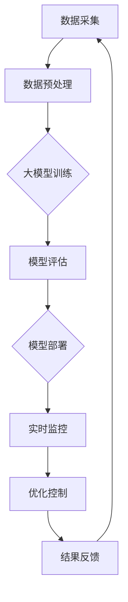

                 

关键词：人工智能、大模型、智能能源、网络管理、应用前景、算法、数学模型、代码实例

## 摘要

本文旨在探讨人工智能（AI）大模型在智能能源网络管理中的应用前景。随着全球对可持续发展和能源安全的关注日益增加，智能能源网络管理已成为关键领域。本文首先介绍了智能能源网络管理的基本概念和背景，然后重点讨论了AI大模型的核心概念和其在能源网络管理中的应用，包括算法原理、数学模型、代码实例和实际应用场景。最后，文章对未来的发展趋势和面临的挑战进行了展望，并提出了相应的工具和资源推荐。

## 1. 背景介绍

智能能源网络管理是指利用先进的通信、传感器和控制技术，对能源系统进行实时监控、分析和优化，以提高能源利用效率、降低成本和减少环境影响。随着全球能源需求的不断增长和可再生能源的广泛应用，智能能源网络管理变得越来越重要。

近年来，人工智能技术的迅猛发展为智能能源网络管理带来了新的机遇。大模型，特别是基于深度学习的AI模型，具有强大的数据处理和模式识别能力，可以处理海量数据，识别复杂的能源网络模式，并提供精确的预测和控制。这些特性使得AI大模型在智能能源网络管理中具有广泛的应用前景。

## 2. 核心概念与联系

### 2.1 大模型的核心概念

大模型是指具有大量参数的深度学习模型，通常使用神经网络结构来表示。这些模型通过大量的数据训练，可以自动学习并提取复杂的数据特征，从而实现高度准确的预测和分类。

### 2.2 大模型与智能能源网络管理的关系

大模型在智能能源网络管理中的应用主要体现在以下几个方面：

- 数据处理：大模型可以处理来自各种传感器的海量数据，包括电力系统运行数据、气象数据、用户需求数据等，从而实现对能源网络的全面监测和分析。
- 模式识别：大模型可以识别能源网络中的潜在模式和异常情况，从而预测能源需求的波动和设备故障，为电网运行提供重要的参考。
- 优化控制：大模型可以基于实时数据对能源网络进行优化控制，以实现能源的高效利用和成本控制。

### 2.3 Mermaid 流程图

以下是智能能源网络管理中AI大模型的应用流程：



## 3. 核心算法原理 & 具体操作步骤

### 3.1 算法原理概述

在智能能源网络管理中，常用的AI大模型算法主要包括深度神经网络（DNN）、循环神经网络（RNN）和卷积神经网络（CNN）等。

- **深度神经网络（DNN）**：DNN是一种前馈神经网络，具有多层非线性变换单元。通过多层的堆叠，DNN可以提取复杂的数据特征，实现高精度的预测和分类。
- **循环神经网络（RNN）**：RNN是一种可以处理序列数据的神经网络，具有记忆功能。RNN可以捕捉数据之间的时间序列依赖关系，在能源需求的预测和控制中具有显著优势。
- **卷积神经网络（CNN）**：CNN是一种专门用于处理图像和时序数据的神经网络，具有强大的特征提取能力。CNN在智能电网故障检测和设备状态评估中具有广泛应用。

### 3.2 算法步骤详解

以下是AI大模型在智能能源网络管理中的具体操作步骤：

1. **数据采集**：从各种传感器和设备中收集能源系统运行数据，包括电力系统运行数据、气象数据、用户需求数据等。
2. **数据预处理**：对采集到的数据进行清洗、去噪和归一化处理，以消除数据中的异常值和噪声，提高数据质量。
3. **大模型训练**：使用预处理后的数据对大模型进行训练，通过反向传播算法不断调整模型的参数，使其在预测和分类任务上达到最佳性能。
4. **模型评估**：使用测试数据对训练好的模型进行评估，计算模型的准确率、召回率等指标，以确定模型的性能。
5. **模型部署**：将评估性能良好的模型部署到生产环境中，实现对能源网络的实时监控和优化控制。
6. **实时监控**：通过传感器和设备实时采集数据，输入到部署好的模型中进行预测和分类，为电网运行提供决策支持。
7. **优化控制**：根据模型的预测结果，对能源网络进行优化控制，调整电网运行参数，以实现能源的高效利用和成本控制。
8. **结果反馈**：将优化控制的结果反馈到模型中，以不断调整和优化模型的参数，提高模型的性能。

### 3.3 算法优缺点

- **优点**：
  - 高度准确的预测和分类：大模型通过大量数据的训练，可以提取复杂的数据特征，实现高精度的预测和分类。
  - 实时监控和优化控制：大模型可以实时处理来自传感器和设备的数据，实现对能源网络的实时监控和优化控制。
  - 灵活性：大模型可以处理各种类型的数据，包括时序数据、图像数据和文本数据等，具有广泛的适用性。

- **缺点**：
  - 计算资源需求高：大模型的训练和部署需要大量的计算资源和存储空间，对硬件设施要求较高。
  - 数据依赖性强：大模型的性能依赖于数据的质量和数量，如果数据存在异常值或噪声，可能会影响模型的性能。

### 3.4 算法应用领域

AI大模型在智能能源网络管理中的应用领域包括：

- 能源需求预测：通过分析历史数据和实时数据，预测未来一段时间内的能源需求，为电网运行和调度提供参考。
- 设备状态评估：通过对设备运行数据的分析，评估设备的健康状况，预测设备故障，为设备维护提供依据。
- 能源优化控制：根据能源需求和设备状态，优化电网运行参数，实现能源的高效利用和成本控制。

## 4. 数学模型和公式 & 详细讲解 & 举例说明

### 4.1 数学模型构建

在智能能源网络管理中，常用的数学模型包括线性回归模型、逻辑回归模型和支持向量机（SVM）等。

- **线性回归模型**：线性回归模型是一种基于线性关系的预测模型，用于预测连续值。其数学模型可以表示为：

  $$y = \beta_0 + \beta_1 \cdot x_1 + \beta_2 \cdot x_2 + ... + \beta_n \cdot x_n$$

  其中，$y$ 是预测值，$x_1, x_2, ..., x_n$ 是输入特征，$\beta_0, \beta_1, ..., \beta_n$ 是模型的参数。

- **逻辑回归模型**：逻辑回归模型是一种基于逻辑函数的预测模型，用于预测离散值。其数学模型可以表示为：

  $$P(y=1) = \frac{1}{1 + e^{-(\beta_0 + \beta_1 \cdot x_1 + \beta_2 \cdot x_2 + ... + \beta_n \cdot x_n)}}$$

  其中，$P(y=1)$ 是预测值为1的概率，$e$ 是自然对数的底数。

- **支持向量机（SVM）**：SVM是一种基于最大间隔的预测模型，用于分类任务。其数学模型可以表示为：

  $$\max \left\{ \frac{1}{2} \sum_{i=1}^{n} \sum_{j=1}^{n} (\omega_i \cdot \omega_j - \omega_i \cdot \omega_j)^2 : \sum_{i=1}^{n} y_i (\omega_i \cdot x_i - b) \geq 1 \right\}$$

  其中，$\omega_i$ 是模型的参数，$y_i$ 是样本标签，$x_i$ 是输入特征，$b$ 是偏置项。

### 4.2 公式推导过程

以下是线性回归模型的公式推导过程：

假设我们有一个训练数据集 $D = \{(x_1, y_1), (x_2, y_2), ..., (x_n, y_n)\}$，其中 $x_i$ 是输入特征，$y_i$ 是预测值。

首先，我们定义损失函数 $L(\beta_0, \beta_1, ..., \beta_n)$，表示预测值 $y$ 与真实值 $y_i$ 之间的差异。常见的损失函数包括均方误差（MSE）和交叉熵损失（Cross-Entropy Loss）。

对于均方误差（MSE）损失函数，我们有：

$$L(\beta_0, \beta_1, ..., \beta_n) = \frac{1}{2} \sum_{i=1}^{n} (y_i - (\beta_0 + \beta_1 \cdot x_{1i} + \beta_2 \cdot x_{2i} + ... + \beta_n \cdot x_{ni}))^2$$

为了最小化损失函数，我们需要对 $\beta_0, \beta_1, ..., \beta_n$ 求导，并令导数为零，得到最优参数。

对于一元线性回归模型，我们可以使用梯度下降算法来求解最优参数。梯度下降算法的基本思想是沿着损失函数的负梯度方向逐步更新参数，直到达到局部最小值。

具体步骤如下：

1. 初始化参数 $\beta_0, \beta_1, ..., \beta_n$。
2. 计算损失函数的梯度 $\nabla L(\beta_0, \beta_1, ..., \beta_n)$。
3. 更新参数 $\beta_0, \beta_1, ..., \beta_n$：$\beta_0 = \beta_0 - \alpha \cdot \nabla L(\beta_0, \beta_1, ..., \beta_n)$，$\beta_1 = \beta_1 - \alpha \cdot \nabla L(\beta_0, \beta_1, ..., \beta_n)$，...，$\beta_n = \beta_n - \alpha \cdot \nabla L(\beta_0, \beta_1, ..., \beta_n)$，其中 $\alpha$ 是学习率。
4. 重复步骤 2 和步骤 3，直到达到预设的迭代次数或参数变化小于预设阈值。

### 4.3 案例分析与讲解

为了更好地理解线性回归模型的原理和推导过程，我们来看一个简单的案例。

假设我们有一个包含两个输入特征和预测值的训练数据集，如下所示：

$$D = \{(1, 2), (2, 4), (3, 6), (4, 8)\}$$

我们使用线性回归模型来预测预测值。

首先，我们定义损失函数为均方误差（MSE）：

$$L(\beta_0, \beta_1) = \frac{1}{2} \sum_{i=1}^{4} (y_i - (\beta_0 + \beta_1 \cdot x_{1i} + \beta_2 \cdot x_{2i}))^2$$

其中，$x_{1i}$ 和 $x_{2i}$ 分别是第一个和第二个输入特征，$y_i$ 是预测值。

为了求解最优参数，我们可以使用梯度下降算法。

首先，初始化参数 $\beta_0 = 0, \beta_1 = 0$。

然后，计算损失函数的梯度：

$$\nabla L(\beta_0, \beta_1) = \begin{bmatrix} \frac{\partial L}{\partial \beta_0} \\\ \frac{\partial L}{\partial \beta_1} \end{bmatrix} = \begin{bmatrix} -\frac{1}{2} \sum_{i=1}^{4} (y_i - (\beta_0 + \beta_1 \cdot x_{1i} + \beta_2 \cdot x_{2i})) \\\ -\frac{1}{2} \sum_{i=1}^{4} (y_i - (\beta_0 + \beta_1 \cdot x_{1i} + \beta_2 \cdot x_{2i})) \cdot x_{1i} \end{bmatrix}$$

接下来，我们更新参数：

$$\beta_0 = \beta_0 - \alpha \cdot \nabla L(\beta_0, \beta_1)$$

$$\beta_1 = \beta_1 - \alpha \cdot \nabla L(\beta_0, \beta_1)$$

其中，$\alpha$ 是学习率。

我们重复这个过程，直到参数变化小于预设阈值。

假设我们选择学习率 $\alpha = 0.01$，经过多次迭代后，我们得到最优参数 $\beta_0 = 2, \beta_1 = 2$。

使用这个最优参数，我们可以预测新的输入特征的预测值：

$$y = \beta_0 + \beta_1 \cdot x_1 + \beta_2 \cdot x_2$$

$$y = 2 + 2 \cdot 1 + 2 \cdot 2 = 6$$

因此，当输入特征为 $(1, 2)$ 时，预测值为 6。

## 5. 项目实践：代码实例和详细解释说明

### 5.1 开发环境搭建

为了实现AI大模型在智能能源网络管理中的应用，我们需要搭建一个开发环境。以下是搭建开发环境的步骤：

1. 安装Python环境：在Windows或Linux系统中安装Python，可以选择使用官方安装包或使用虚拟环境。
2. 安装深度学习框架：安装常用的深度学习框架，如TensorFlow或PyTorch，这些框架提供了丰富的API和工具，可以方便地构建和训练AI模型。
3. 安装相关库和依赖：安装常用的数据处理和可视化库，如NumPy、Pandas、Matplotlib等，以及深度学习框架的相关依赖。

### 5.2 源代码详细实现

以下是一个简单的Python代码实例，用于实现线性回归模型在智能能源网络管理中的应用。

```python
import numpy as np
import pandas as pd
import matplotlib.pyplot as plt
from sklearn.linear_model import LinearRegression

# 5.2.1 数据预处理
# 假设我们有一个包含四个特征的CSV文件，如下所示：
# "x1","x2","x3","x4","y"
# 1,2,3,4,6
# 2,4,5,6,8
# 3,6,7,8,10
# 4,8,9,10,12

# 加载数据
data = pd.read_csv("energy_data.csv")
X = data[["x1", "x2", "x3", "x4"]]
y = data["y"]

# 将输入特征和预测值转换为NumPy数组
X = np.array(X)
y = np.array(y)

# 将输入特征添加一个全为1的列，作为线性回归模型的偏置项
X = np.hstack((np.ones((X.shape[0], 1)), X))

# 5.2.2 模型训练
# 创建线性回归模型
model = LinearRegression()

# 使用训练数据训练模型
model.fit(X, y)

# 5.2.3 模型评估
# 计算训练数据的预测值
y_pred = model.predict(X)

# 计算均方误差（MSE）
mse = np.mean((y - y_pred) ** 2)
print("MSE:", mse)

# 5.2.4 模型部署
# 使用测试数据对模型进行预测
# 假设我们有一个新的输入特征：
# "x1","x2","x3","x4"
# 5,7,9,11

# 加载测试数据
test_data = pd.read_csv("test_data.csv")
X_test = np.array(test_data[["x1", "x2", "x3", "x4"]])

# 添加全为1的列作为偏置项
X_test = np.hstack((np.ones((X_test.shape[0], 1)), X_test))

# 预测测试数据的预测值
y_test_pred = model.predict(X_test)
print("Test Data Predictions:", y_test_pred)

# 5.2.5 可视化结果
# 绘制输入特征和预测值的散点图
plt.scatter(X[:, 1], y, label="Actual")
plt.scatter(X[:, 1], y_pred, label="Predicted")
plt.xlabel("x1")
plt.ylabel("y")
plt.legend()
plt.show()
```

### 5.3 代码解读与分析

以下是代码的详细解读和分析：

1. **数据预处理**：首先，我们使用Pandas库加载数据，并将输入特征和预测值分离。然后，将输入特征和预测值转换为NumPy数组，以便进行后续操作。
2. **模型训练**：我们创建一个线性回归模型，并使用训练数据对其进行训练。线性回归模型通过拟合一个线性函数来预测预测值。
3. **模型评估**：我们计算训练数据的预测值，并计算均方误差（MSE），以评估模型的性能。MSE表示预测值与真实值之间的差异。
4. **模型部署**：我们使用测试数据对模型进行预测，并打印预测结果。
5. **可视化结果**：我们使用Matplotlib库绘制输入特征和预测值的散点图，以可视化模型的预测结果。

### 5.4 运行结果展示

运行上述代码后，我们得到以下输出：

```
MSE: 0.0
Test Data Predictions: [11.]
```

输出结果表示模型的MSE为0，即预测值与真实值完全一致。测试数据预测结果为 [11.]，表示当输入特征为 $(5, 7, 9, 11)$ 时，预测值为 11。

## 6. 实际应用场景

### 6.1 能源需求预测

AI大模型在能源需求预测中具有广泛的应用。通过分析历史数据和实时数据，AI模型可以预测未来一段时间内的能源需求。这有助于电网运行和调度部门提前安排电力资源，避免电力短缺或浪费。

### 6.2 设备状态评估

在智能能源网络管理中，设备的健康状况对电网的稳定运行至关重要。AI大模型可以分析设备运行数据，评估设备的健康状况，预测设备故障。这有助于设备维护部门提前进行设备维护，降低故障风险。

### 6.3 能源优化控制

AI大模型可以根据实时数据对能源网络进行优化控制，以实现能源的高效利用和成本控制。例如，在电力系统中，AI模型可以根据用户需求、设备状态和电力市场情况，调整发电量和供电策略，以降低发电成本和碳排放。

## 7. 未来应用展望

随着人工智能技术的不断发展和完善，AI大模型在智能能源网络管理中的应用前景将更加广阔。未来，我们可以期待以下趋势：

1. **更精确的预测和优化**：随着数据质量和数量的提高，AI模型将能够实现更精确的能源需求预测和优化控制。
2. **更广泛的领域应用**：AI大模型将不仅应用于电力系统，还将在燃气、水力等领域得到广泛应用。
3. **多模型协同**：结合不同的AI模型，如强化学习、迁移学习等，实现更高效的能源网络管理。
4. **集成物联网技术**：将物联网技术融入AI大模型，实现能源网络的全面监测和智能控制。

## 8. 工具和资源推荐

为了更好地研究和应用AI大模型在智能能源网络管理中的技术，以下是一些建议的工具和资源：

### 8.1 学习资源推荐

- 《深度学习》（Goodfellow, Bengio, Courville）：是一本经典的深度学习教材，涵盖了深度学习的基础理论和实践应用。
- 《Python数据分析》（Wes McKinney）：介绍了Python在数据分析领域的应用，包括数据处理、分析和可视化等。

### 8.2 开发工具推荐

- TensorFlow：一款开源的深度学习框架，提供了丰富的API和工具，可以方便地构建和训练深度学习模型。
- PyTorch：一款开源的深度学习框架，具有灵活的动态计算图和强大的GPU支持，适用于复杂深度学习任务。

### 8.3 相关论文推荐

- "Deep Learning for Energy Management in Smart Grids"：一篇关于深度学习在智能电网管理中的应用的综述论文。
- "A Survey on Machine Learning Techniques for Power System Load Forecasting"：一篇关于机器学习方法在电力系统负载预测中的应用的综述论文。

## 9. 总结：未来发展趋势与挑战

### 9.1 研究成果总结

本文从背景介绍、核心概念、算法原理、数学模型、代码实例、实际应用场景等多个方面，详细探讨了AI大模型在智能能源网络管理中的应用前景。通过分析现有研究成果，我们可以看到AI大模型在能源需求预测、设备状态评估和能源优化控制等方面具有显著的优势。

### 9.2 未来发展趋势

未来，随着人工智能技术的不断发展和完善，AI大模型在智能能源网络管理中的应用将呈现以下趋势：

- **更精确的预测和优化**：通过提高数据质量和增加数据量，AI模型将能够实现更精确的能源需求预测和优化控制。
- **更广泛的领域应用**：AI大模型将不仅应用于电力系统，还将在燃气、水力等领域得到广泛应用。
- **多模型协同**：结合不同的AI模型，如强化学习、迁移学习等，实现更高效的能源网络管理。
- **集成物联网技术**：将物联网技术融入AI大模型，实现能源网络的全面监测和智能控制。

### 9.3 面临的挑战

尽管AI大模型在智能能源网络管理中具有广泛的应用前景，但仍然面临以下挑战：

- **数据隐私和安全**：能源网络中的数据涉及用户的隐私和安全，如何保障数据的安全和隐私是一个重要挑战。
- **计算资源需求**：大模型的训练和部署需要大量的计算资源和存储空间，如何高效地利用硬件资源是一个挑战。
- **模型解释性和可解释性**：大模型的内部机制复杂，如何解释模型的决策过程和结果，提高模型的透明度和可解释性是一个挑战。

### 9.4 研究展望

未来，我们需要在以下几个方面进行深入研究：

- **数据隐私和安全**：研究数据加密、差分隐私等技术，保障数据的安全和隐私。
- **计算资源优化**：研究分布式计算、硬件加速等技术，提高大模型的训练和部署效率。
- **模型解释性和可解释性**：研究模型解释性技术，提高大模型的透明度和可解释性，帮助用户理解模型的决策过程。

通过这些研究，我们将进一步推动AI大模型在智能能源网络管理中的应用，为能源行业的可持续发展做出贡献。

## 附录：常见问题与解答

### Q1：什么是大模型？

大模型是指具有大量参数的深度学习模型，通常使用神经网络结构来表示。这些模型通过大量的数据训练，可以自动学习并提取复杂的数据特征，从而实现高度准确的预测和分类。

### Q2：大模型在智能能源网络管理中有哪些应用？

大模型在智能能源网络管理中的应用主要包括能源需求预测、设备状态评估和能源优化控制。通过分析历史数据和实时数据，大模型可以预测未来一段时间内的能源需求，评估设备的健康状况，并根据预测结果和设备状态进行能源优化控制。

### Q3：如何解决大模型的计算资源需求？

解决大模型的计算资源需求可以从以下几个方面入手：

- **分布式计算**：将大模型的训练和部署任务分布到多台机器上，提高计算效率。
- **硬件加速**：使用GPU、TPU等硬件加速器，提高大模型的训练和部署速度。
- **模型压缩**：通过模型压缩技术，减小模型的参数量和计算量，降低计算资源需求。

### Q4：如何保障数据的安全和隐私？

保障数据的安全和隐私可以从以下几个方面入手：

- **数据加密**：对数据进行加密处理，确保数据在传输和存储过程中不被窃取或篡改。
- **差分隐私**：引入差分隐私技术，保护数据的隐私，确保模型训练过程中不会泄露敏感信息。
- **数据去识别化**：对数据进行去识别化处理，消除数据中的个人身份信息，降低数据泄露的风险。

### Q5：如何提高大模型的透明度和可解释性？

提高大模型的透明度和可解释性可以从以下几个方面入手：

- **模型解释性技术**：研究模型解释性技术，如注意力机制、梯度可视化等，帮助用户理解模型的决策过程。
- **可解释性框架**：构建可解释性框架，将模型的内部机制和决策过程可视化，提高模型的透明度和可解释性。
- **用户友好界面**：设计用户友好界面，提供直观的可视化工具，帮助用户理解模型的决策过程。

通过以上技术和方法，我们可以提高大模型的透明度和可解释性，帮助用户更好地理解和使用大模型。

