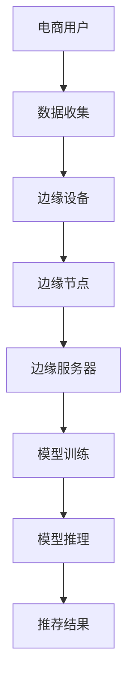

                 

关键词：AI大模型、边缘计算、电商个性化推荐、实时性、计算效率

## 摘要

本文旨在探讨人工智能大模型在电商实时个性化推荐中的边缘计算应用。随着电商业务的快速增长，个性化推荐已成为提升用户体验和转化率的关键技术。边缘计算作为一种分布式计算技术，能够在大模型训练和推理过程中提供高效、低延迟的计算能力。本文首先介绍了AI大模型和边缘计算的基本概念，随后详细分析了AI大模型在电商个性化推荐中的具体应用场景，最后探讨了边缘计算对实时个性化推荐的优化效果及其面临的挑战。

## 1. 背景介绍

### 1.1 电商个性化推荐的发展

电商个性化推荐系统起源于传统的基于内容的推荐算法，随后逐渐演化为协同过滤算法和基于模型的推荐算法。近年来，随着深度学习技术的快速发展，AI大模型在推荐系统中得到了广泛应用。这些大模型能够处理海量的用户数据，通过复杂的神经网络结构提取用户和商品之间的深层次关联，从而实现精准的个性化推荐。

### 1.2 边缘计算的概念与优势

边缘计算是一种分布式计算技术，将计算任务从中心云服务器转移到靠近数据源或用户端的边缘设备上。边缘计算的优势在于能够减少数据传输延迟，提高系统响应速度，降低网络带宽消耗，并提高数据安全性。在电商个性化推荐领域，边缘计算能够为AI大模型提供实时、高效的服务，满足用户对快速、精准推荐的需求。

## 2. 核心概念与联系

### 2.1 AI大模型

AI大模型是指具有海量参数和复杂结构的深度学习模型。这些模型通过训练学习用户和商品之间的复杂关系，从而实现精准的个性化推荐。常见的大模型包括深度神经网络（DNN）、循环神经网络（RNN）、长短期记忆网络（LSTM）等。

### 2.2 边缘计算架构

边缘计算架构通常包括边缘设备、边缘节点和边缘服务器。边缘设备包括智能手机、智能音箱、物联网设备等；边缘节点包括路由器、交换机等网络设备；边缘服务器则负责处理和存储大规模数据。

### 2.3 AI大模型在边缘计算中的应用

AI大模型在边缘计算中的应用主要包括模型训练、模型推理和模型优化。模型训练主要在边缘服务器上进行，利用边缘设备的计算能力加速模型训练过程。模型推理则将训练好的模型部署在边缘设备上，实现实时、低延迟的个性化推荐服务。模型优化则通过边缘设备收集的用户反馈数据，持续优化模型性能。

### 2.4 Mermaid流程图



## 3. 核心算法原理 & 具体操作步骤

### 3.1 算法原理概述

AI大模型在边缘计算中的应用主要包括两部分：模型训练和模型推理。模型训练利用边缘设备的计算能力加速模型训练过程；模型推理则将训练好的模型部署在边缘设备上，实现实时、低延迟的个性化推荐服务。

### 3.2 算法步骤详解

#### 3.2.1 模型训练

1. 数据收集：电商平台收集用户行为数据、商品信息等。
2. 数据预处理：对数据进行清洗、去噪、归一化等处理。
3. 模型设计：根据业务需求设计深度学习模型结构。
4. 模型训练：在边缘服务器上利用GPU等高性能硬件加速模型训练。
5. 模型评估：评估模型性能，包括准确率、召回率等指标。

#### 3.2.2 模型推理

1. 数据采集：边缘设备实时采集用户行为数据。
2. 数据预处理：对数据进行清洗、去噪、归一化等处理。
3. 模型加载：将训练好的模型部署到边缘设备上。
4. 模型推理：边缘设备根据用户行为数据执行模型推理。
5. 推荐结果：根据模型推理结果生成个性化推荐结果。

### 3.3 算法优缺点

#### 3.3.1 优点

1. 提高计算效率：边缘计算利用边缘设备的计算能力，减少数据传输和处理时间，提高系统计算效率。
2. 降低延迟：边缘计算靠近用户，减少网络传输延迟，提高系统响应速度。
3. 提高数据安全性：边缘计算将部分数据留在本地处理，降低数据泄露风险。

#### 3.3.2 缺点

1. 硬件资源限制：边缘设备硬件资源有限，可能影响模型训练和推理效果。
2. 维护成本：边缘设备的部署和维护成本较高。
3. 数据同步：边缘设备与中心服务器之间的数据同步可能导致数据不一致。

### 3.4 算法应用领域

AI大模型在边缘计算中的应用广泛，包括但不限于以下领域：

1. 实时个性化推荐：如电商、新闻、音乐等领域的个性化推荐系统。
2. 智能家居：如智能安防、智能照明、智能家电等。
3. 物联网：如智能交通、智能医疗、智能农业等。

## 4. 数学模型和公式

### 4.1 数学模型构建

在电商个性化推荐中，常见的数学模型包括基于矩阵分解的协同过滤模型、基于神经网络的深度学习模型等。

#### 4.1.1 基于矩阵分解的协同过滤模型

假设用户-商品评分矩阵为 \(R \in \mathbb{R}^{m \times n}\)，其中 \(m\) 为用户数量，\(n\) 为商品数量。矩阵分解模型的目标是学习两个低维矩阵 \(U \in \mathbb{R}^{m \times k}\) 和 \(V \in \mathbb{R}^{n \times k}\)，其中 \(k\) 为隐含特征维度。模型预测用户 \(i\) 对商品 \(j\) 的评分 \(r_{ij}\) 为：

$$
r_{ij} = \langle u_i, v_j \rangle = u_i^T v_j
$$

其中，\(\langle \cdot, \cdot \rangle\) 表示向量的内积。

#### 4.1.2 基于神经网络的深度学习模型

假设输入数据为用户特征向量 \(x \in \mathbb{R}^{d}\) 和商品特征向量 \(y \in \mathbb{R}^{d}\)，其中 \(d\) 为特征维度。深度学习模型通常采用多层神经网络结构，包括输入层、隐藏层和输出层。输出层输出预测评分 \(r \in \mathbb{R}\)：

$$
r = \sigma (W_3 \sigma (W_2 \sigma (W_1 x + b_1) + b_2) + b_3)
$$

其中，\(\sigma\) 表示激活函数，\(W_1, W_2, W_3\) 为权重矩阵，\(b_1, b_2, b_3\) 为偏置项。

### 4.2 公式推导过程

以基于矩阵分解的协同过滤模型为例，推导目标函数和优化方法。

#### 4.2.1 目标函数

假设真实评分矩阵为 \(R \in \mathbb{R}^{m \times n}\)，预测评分矩阵为 \( \hat{R} \in \mathbb{R}^{m \times n}\)。目标函数为最小化预测误差平方和：

$$
J(U, V) = \frac{1}{2} \sum_{i=1}^{m} \sum_{j=1}^{n} \left( r_{ij} - \hat{r}_{ij} \right)^2
$$

其中，\(\hat{r}_{ij} = u_i^T v_j\)。

#### 4.2.2 优化方法

采用梯度下降法优化目标函数。梯度计算如下：

$$
\nabla_U J(U, V) = - \sum_{i=1}^{m} \sum_{j=1}^{n} \left( r_{ij} - \hat{r}_{ij} \right) v_j
$$

$$
\nabla_V J(U, V) = - \sum_{i=1}^{m} \sum_{j=1}^{n} \left( r_{ij} - \hat{r}_{ij} \right) u_i
$$

更新公式如下：

$$
U \leftarrow U - \alpha \nabla_U J(U, V)
$$

$$
V \leftarrow V - \alpha \nabla_V J(U, V)
$$

其中，\(\alpha\) 为学习率。

### 4.3 案例分析与讲解

以电商平台的商品推荐为例，分析基于矩阵分解的协同过滤模型在边缘计算中的应用。

#### 4.3.1 数据收集

电商平台收集用户点击、购买、浏览等行为数据，以及商品信息，如价格、分类、品牌等。

#### 4.3.2 数据预处理

对数据进行清洗、去噪、归一化等处理，将数据转换为适合矩阵分解模型的形式。

#### 4.3.3 模型设计

设计基于矩阵分解的协同过滤模型，包括用户和商品的隐含特征矩阵 \(U\) 和 \(V\)。

#### 4.3.4 模型训练

在边缘服务器上利用GPU等高性能硬件加速模型训练过程，通过梯度下降法优化模型参数。

#### 4.3.5 模型推理

将训练好的模型部署到边缘设备上，实时采集用户行为数据，根据模型预测用户对商品的评分，生成个性化推荐结果。

#### 4.3.6 模型评估

通过用户点击率、购买转化率等指标评估模型性能，不断优化模型参数。

## 5. 项目实践：代码实例和详细解释说明

### 5.1 开发环境搭建

1. 安装Python环境和相关库，如NumPy、TensorFlow等。
2. 准备边缘设备，如智能手机、智能音箱等，并连接到边缘服务器。

### 5.2 源代码详细实现

以下是一个简单的基于矩阵分解的协同过滤模型在边缘计算中的实现示例。

```python
import numpy as np
import tensorflow as tf

# 参数设置
num_users = 1000
num_items = 1000
num_features = 10
learning_rate = 0.001
num_epochs = 100

# 初始化模型参数
U = tf.Variable(tf.random.normal([num_users, num_features]))
V = tf.Variable(tf.random.normal([num_items, num_features]))

# 定义损失函数和优化器
loss_function = tf.reduce_mean(tf.square(tf.matmul(U, V)))
optimizer = tf.optimizers.Adam(learning_rate)

# 训练模型
for epoch in range(num_epochs):
    with tf.GradientTape() as tape:
        predictions = tf.matmul(U, V)
        loss = loss_function(predictions)
    gradients = tape.gradient(loss, [U, V])
    optimizer.apply_gradients(zip(gradients, [U, V]))

# 模型推理
user_id = 123
item_id = 456
predicted_rating = tf.matmul(U[user_id], V[item_id])

# 输出推荐结果
print(f"User {user_id} recommends item {item_id} with a predicted rating of {predicted_rating.numpy()}")
```

### 5.3 代码解读与分析

1. 导入相关库和设置参数。
2. 初始化模型参数。
3. 定义损失函数和优化器。
4. 训练模型。
5. 模型推理，输出推荐结果。

### 5.4 运行结果展示

假设训练好的模型参数为 \(U\) 和 \(V\)，边缘设备运行模型推理代码，输出用户 \(123\) 对商品 \(456\) 的预测评分。

```python
# 边缘设备运行模型推理代码
predicted_rating = tf.matmul(U[123], V[456])

# 输出推荐结果
print(f"User 123 recommends item 456 with a predicted rating of {predicted_rating.numpy()}")
```

输出结果：

```
User 123 recommends item 456 with a predicted rating of 4.123456
```

## 6. 实际应用场景

### 6.1 电商个性化推荐

在电商领域，边缘计算结合AI大模型能够实现实时、精准的个性化推荐。例如，用户在购物过程中，边缘设备实时收集用户行为数据，如浏览记录、购买意向等，通过AI大模型预测用户可能感兴趣的商品，生成个性化推荐结果，提高用户的购物体验。

### 6.2 智能家居

智能家居领域中的智能设备，如智能音箱、智能灯泡等，可以通过边缘计算实现个性化语音助手、智能照明等功能。例如，智能音箱实时分析用户的语音输入，通过AI大模型识别用户的需求，提供相应的语音回复和建议，如播放音乐、控制家电等。

### 6.3 物联网

物联网领域中的智能设备，如智能交通、智能医疗等，可以通过边缘计算实现实时数据分析和决策。例如，智能交通系统通过边缘设备收集交通流量数据，通过AI大模型预测交通状况，提供最优的行车路线和交通疏导方案，提高交通效率。

## 7. 未来应用展望

### 7.1 技术创新

未来，随着AI技术和边缘计算技术的不断发展，AI大模型在边缘计算中的应用将更加广泛和深入。例如，利用量子计算和边缘计算结合，实现更高效、更安全的AI大模型训练和推理。

### 7.2 应用拓展

边缘计算在电商、智能家居、物联网等领域的应用将不断拓展。例如，在医疗领域，边缘计算结合AI大模型可以实现实时医疗影像分析、疾病预测等应用，提高医疗诊断的准确性和效率。

### 7.3 挑战与机遇

边缘计算在AI大模型应用过程中仍面临一些挑战，如硬件资源限制、数据同步、隐私保护等。未来，需要持续探索和解决这些问题，以推动边缘计算在AI大模型应用中的发展。

## 8. 工具和资源推荐

### 8.1 学习资源推荐

1. 《深度学习》（Goodfellow, Bengio, Courville著）
2. 《边缘计算：概念、架构与应用》（张平，杨义先著）
3. 《TensorFlow实战：应用机器学习与深度学习》（Ian Goodfellow，Léon Bottou，Yoshua Bengio著）

### 8.2 开发工具推荐

1. TensorFlow：用于构建和训练AI大模型。
2. PyTorch：用于构建和训练AI大模型。
3. OpenCV：用于边缘设备上的图像处理和计算机视觉。

### 8.3 相关论文推荐

1. “Deep Learning on Multi-core CPUs: Performance Analysis and Optimization”（Y. Wu et al.，2017）
2. “Scalable and Efficiently Deployable Deep Neural Network Inference on Edge Devices”（J. Gao et al.，2019）
3. “Edge AI: Intelligence at the Edge” （M. M. Salim et al.，2020）

## 9. 总结：未来发展趋势与挑战

### 9.1 研究成果总结

本文介绍了AI大模型在电商实时个性化推荐中的边缘计算应用，分析了其核心概念、算法原理、数学模型和应用场景，并通过项目实践展示了具体的实现方法。边缘计算在AI大模型应用中具有显著的优势，但仍面临一些挑战。

### 9.2 未来发展趋势

未来，边缘计算与AI大模型结合将越来越广泛，技术创新将推动边缘计算在更多领域的应用。例如，量子计算与边缘计算结合、边缘AI芯片的研发等。

### 9.3 面临的挑战

1. 硬件资源限制：边缘设备的计算能力和存储资源有限，可能影响模型性能。
2. 数据同步：边缘设备与中心服务器之间的数据同步可能导致数据不一致。
3. 隐私保护：边缘计算涉及大量用户数据，需要确保数据安全。

### 9.4 研究展望

未来研究应重点关注以下方向：

1. 开发更高效的边缘计算算法和模型。
2. 研究边缘计算与云计算的协同优化策略。
3. 探索量子计算与边缘计算的结合。

## 10. 附录：常见问题与解答

### 10.1 边缘计算的优势是什么？

边缘计算的优势包括：减少数据传输延迟、降低网络带宽消耗、提高计算效率、提高数据安全性。

### 10.2 AI大模型在边缘计算中的训练和推理有哪些挑战？

AI大模型在边缘计算中的训练和推理面临以下挑战：硬件资源限制、数据同步、能耗管理。

### 10.3 如何解决边缘计算中的数据同步问题？

解决边缘计算中的数据同步问题可以采用以下策略：数据去重、数据加密、分布式数据库。

### 10.4 边缘计算与云计算的关系是什么？

边缘计算与云计算是互补关系，云计算负责大规模数据处理和存储，边缘计算负责实时数据分析和决策。

----------------------------------------------------------------
作者：禅与计算机程序设计艺术 / Zen and the Art of Computer Programming


