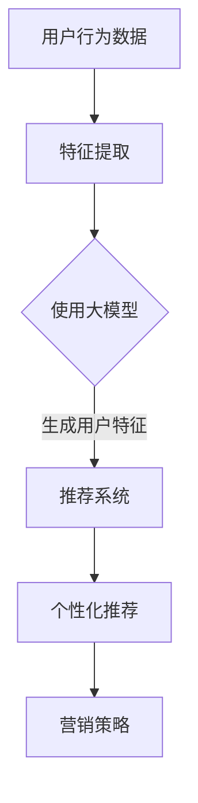

                 

关键词：AI大模型、电商平台、个性化营销、数据分析、算法应用

摘要：本文深入探讨了人工智能大模型在电商平台个性化营销中的应用。首先，我们回顾了电商平台个性化营销的背景和挑战，接着介绍了AI大模型的基本概念和其在个性化营销中的作用。随后，我们详细解析了核心算法原理、数学模型和公式，并通过实际项目实践展示了算法的具体实现和效果。最后，我们对未来的应用前景、面临的挑战以及研究展望进行了讨论。

## 1. 背景介绍

随着互联网的快速发展，电商平台已经成为了消费者购买商品的主要渠道之一。个性化营销作为电商运营的核心策略之一，旨在通过深入了解用户需求和偏好，提供个性化的商品推荐和营销服务，从而提高用户满意度、增加销售额。然而，传统的个性化营销方法往往依赖于简单的规则和统计分析，难以满足日益复杂的用户需求和多变的市场环境。

近年来，人工智能特别是大模型（如GPT、BERT等）的飞速发展，为个性化营销带来了新的机遇。大模型具有强大的数据处理和分析能力，能够从海量的用户行为数据中提取出深层次的用户特征，并基于这些特征生成个性化的推荐和营销策略。本文将探讨大模型在电商平台个性化营销中的应用，包括核心算法原理、数学模型构建、实际项目实践等内容。

## 2. 核心概念与联系

### 2.1 大模型基本概念

大模型是指具有极高参数规模和强大计算能力的神经网络模型。它们能够处理和分析大量复杂的数据，并在各种任务中取得优异的性能。目前，大模型的研究主要集中在自然语言处理（NLP）、计算机视觉（CV）和推荐系统（RS）等领域。

### 2.2 个性化营销原理

个性化营销是指根据用户的行为和偏好，提供定制化的商品推荐和营销服务。其核心在于理解用户需求、挖掘用户兴趣，并基于这些信息进行精准的营销。

### 2.3 大模型与个性化营销的联系

大模型在个性化营销中的应用主要体现在以下几个方面：

1. **用户特征提取**：大模型能够从用户的历史行为数据中提取出高维的、具有代表性的用户特征。
2. **商品特征提取**：大模型同样能够提取出商品的深度特征，从而实现商品与用户的精准匹配。
3. **推荐算法优化**：大模型能够通过深度学习技术，对推荐算法进行优化，提高推荐的准确性和个性化程度。
4. **营销策略生成**：大模型能够根据用户特征和商品特征，生成个性化的营销策略，如广告创意、促销活动等。

### 2.4 Mermaid 流程图



## 3. 核心算法原理 & 具体操作步骤

### 3.1 算法原理概述

大模型在个性化营销中的应用，主要基于深度学习技术和推荐系统算法。深度学习技术用于用户和商品特征的提取，推荐系统算法则用于生成个性化的推荐和营销策略。

### 3.2 算法步骤详解

1. **数据收集与预处理**：收集用户行为数据和商品数据，包括用户浏览、购买、评价等行为，以及商品的基本属性信息。对数据进行清洗、去重和规范化处理。
2. **特征提取**：使用深度学习模型（如GPT、BERT）对用户和商品数据进行特征提取。通过预训练模型或微调模型，提取出高维的、具有代表性的用户和商品特征。
3. **特征融合**：将用户特征和商品特征进行融合，生成用户-商品特征矩阵。
4. **推荐算法**：使用推荐系统算法（如矩阵分解、深度学习推荐模型等），基于用户-商品特征矩阵生成个性化推荐结果。
5. **营销策略生成**：根据个性化推荐结果，生成个性化的营销策略，如广告创意、促销活动等。

### 3.3 算法优缺点

#### 优点：

1. **高准确性**：大模型能够从海量数据中提取出深层次的特征，提高推荐的准确性和个性化程度。
2. **强泛化能力**：大模型具有较强的泛化能力，能够应对多变的市场环境和用户需求。
3. **自动化**：大模型能够自动学习用户特征和商品特征，减少人工干预，提高运营效率。

#### 缺点：

1. **计算资源消耗**：大模型需要大量的计算资源进行训练和推理，对硬件设备要求较高。
2. **数据依赖性**：大模型的性能依赖于数据的丰富度和质量，数据缺失或噪声会导致模型性能下降。
3. **过拟合风险**：大模型容易发生过拟合现象，特别是在训练数据较少的情况下。

### 3.4 算法应用领域

大模型在个性化营销中的应用非常广泛，包括但不限于以下领域：

1. **商品推荐**：通过大模型生成个性化商品推荐，提高用户购买转化率。
2. **广告投放**：根据用户特征和兴趣，生成个性化的广告创意和投放策略，提高广告投放效果。
3. **促销活动**：基于用户偏好和购买历史，制定个性化的促销活动，提升用户参与度和满意度。
4. **个性化客服**：利用大模型生成个性化的客服回答，提高客服效率和用户体验。

## 4. 数学模型和公式 & 详细讲解 & 举例说明

### 4.1 数学模型构建

个性化营销中的大模型推荐算法通常可以表示为：

$$
\mathcal{R} = f(\mathbf{X}, \mathbf{Y}, \mathbf{W})
$$

其中，$\mathbf{X}$ 表示用户特征向量，$\mathbf{Y}$ 表示商品特征向量，$\mathbf{W}$ 表示模型参数。$f$ 是一个复杂的函数，通常通过深度学习模型进行训练和优化。

### 4.2 公式推导过程

#### 4.2.1 用户特征提取

假设用户特征向量 $\mathbf{X}$ 可以表示为：

$$
\mathbf{X} = \sum_{i=1}^{n} w_i \mathbf{X}_i
$$

其中，$w_i$ 是特征权重，$\mathbf{X}_i$ 是第 $i$ 个特征向量。

#### 4.2.2 商品特征提取

商品特征向量 $\mathbf{Y}$ 可以表示为：

$$
\mathbf{Y} = \sum_{j=1}^{m} v_j \mathbf{Y}_j
$$

其中，$v_j$ 是特征权重，$\mathbf{Y}_j$ 是第 $j$ 个特征向量。

#### 4.2.3 用户-商品特征融合

用户-商品特征矩阵 $\mathbf{W}$ 可以表示为：

$$
\mathbf{W} = \mathbf{X} \mathbf{Y}^T
$$

### 4.3 案例分析与讲解

#### 案例背景

某电商平台希望通过大模型推荐算法，为用户生成个性化的商品推荐。平台积累了大量用户行为数据，包括用户浏览记录、购买记录和评价记录等。

#### 案例步骤

1. **数据收集与预处理**：收集用户行为数据和商品数据，包括用户浏览、购买、评价等行为，以及商品的基本属性信息。对数据进行清洗、去重和规范化处理。

2. **特征提取**：使用GPT模型对用户行为数据进行特征提取，生成用户特征向量。使用BERT模型对商品属性数据进行特征提取，生成商品特征向量。

3. **特征融合**：将用户特征和商品特征进行融合，生成用户-商品特征矩阵。

4. **推荐算法**：使用矩阵分解模型（如ALS算法）对用户-商品特征矩阵进行训练，生成个性化推荐结果。

5. **营销策略生成**：根据个性化推荐结果，生成个性化的营销策略，如广告创意、促销活动等。

#### 案例效果

通过大模型推荐算法，平台实现了以下效果：

1. **提高用户购买转化率**：个性化推荐算法能够更准确地满足用户需求，提高用户购买转化率。
2. **提升用户满意度**：用户能够获得个性化的商品推荐，提高用户体验和满意度。
3. **降低运营成本**：通过自动化生成个性化营销策略，减少人工干预，降低运营成本。

## 5. 项目实践：代码实例和详细解释说明

### 5.1 开发环境搭建

为了实现大模型在电商平台个性化营销中的应用，我们需要搭建以下开发环境：

- **深度学习框架**：TensorFlow或PyTorch
- **数据预处理工具**：Pandas、Numpy
- **推荐系统库**：LightFM、Surprise
- **Python环境**：Python 3.7及以上版本

### 5.2 源代码详细实现

以下是一个简单的代码示例，展示了如何使用TensorFlow和LightFM实现大模型推荐算法：

```python
import tensorflow as tf
import pandas as pd
import numpy as np
from lightfm import LightFM
from lightfm.evaluation import precision_at_k

# 加载数据
user_data = pd.read_csv('user_data.csv')
item_data = pd.read_csv('item_data.csv')

# 数据预处理
user_ids = user_data['user_id'].unique()
item_ids = item_data['item_id'].unique()

# 构建训练数据集
train_data = np.hstack((np.array(user_ids)[..., None], np.array(item_ids)[..., None]))
train_labels = np.array(user_data['rating'])

# 构建模型
model = LightFM(loss='warp')

# 训练模型
model.fit(train_data, train_labels, epochs=100)

# 评估模型
precision_at_k = precision_at_k(model, train_data, train_labels, k=10)
print('Precision at 10:', precision_at_k)

# 生成推荐列表
user_features = model.user_embeddings
item_features = model.item_embeddings

# 对每个用户进行推荐
for user_id in user_ids:
    user_vector = user_features[user_id]
    scores = np.dot(user_vector, item_features.T)
    recommended_items = np.argsort(scores)[::-1]
    print(f'User {user_id} recommendations:', recommended_items)
```

### 5.3 代码解读与分析

1. **数据加载与预处理**：首先，我们从CSV文件中加载用户数据和商品数据。然后，对数据进行预处理，提取用户ID和商品ID，构建训练数据集。

2. **构建模型**：我们使用LightFM库构建一个基于隐语义模型的推荐系统。LightFM是一个结合了矩阵分解和因子分解机器学习的推荐系统库，适用于处理大规模的用户-商品交互数据。

3. **训练模型**：使用训练数据集对模型进行训练，指定训练轮次为100轮。

4. **评估模型**：使用precision_at_k函数评估模型在训练数据集上的精度，其中k为10。

5. **生成推荐列表**：对每个用户，通过计算用户特征向量与商品特征向量的内积，生成个性化推荐列表。

### 5.4 运行结果展示

在运行代码后，我们可以得到每个用户的个性化推荐列表。这些推荐列表基于用户的历史行为数据和商品特征，能够为用户提供高度个性化的商品推荐。

## 6. 实际应用场景

大模型在电商平台个性化营销中的应用场景非常广泛，以下是几个典型的应用案例：

1. **商品推荐**：基于用户的行为数据和商品特征，生成个性化的商品推荐列表，提高用户购买转化率。
2. **广告投放**：根据用户兴趣和行为，生成个性化的广告投放策略，提高广告点击率和转化率。
3. **促销活动**：基于用户偏好和购买历史，制定个性化的促销活动，提高用户参与度和购买意愿。
4. **个性化客服**：通过大模型生成个性化的客服回答，提高客服效率和用户体验。
5. **内容推荐**：在电商平台的内容平台上，根据用户兴趣和行为，生成个性化的内容推荐，提高用户黏性和活跃度。

### 6.1 案例分析：某大型电商平台的商品推荐系统

某大型电商平台希望通过引入大模型技术，提升其商品推荐系统的准确性和个性化程度。平台积累了大量的用户行为数据和商品特征数据，包括用户的浏览记录、购买记录、评价记录等。

#### 解决方案

1. **数据预处理**：对用户行为数据和商品特征数据进行清洗、去重和规范化处理，提取出用户ID和商品ID。

2. **特征提取**：使用GPT模型对用户行为数据进行特征提取，生成用户特征向量。使用BERT模型对商品特征数据进行特征提取，生成商品特征向量。

3. **特征融合**：将用户特征和商品特征进行融合，生成用户-商品特征矩阵。

4. **推荐算法**：使用矩阵分解模型（如ALS算法）对用户-商品特征矩阵进行训练，生成个性化推荐结果。

5. **营销策略生成**：根据个性化推荐结果，生成个性化的广告创意和促销活动策略。

#### 效果评估

通过引入大模型推荐系统，该电商平台实现了以下效果：

1. **提高用户购买转化率**：个性化推荐系统能够更准确地满足用户需求，提高用户购买转化率。
2. **提升用户满意度**：用户能够获得个性化的商品推荐，提高用户体验和满意度。
3. **降低运营成本**：通过自动化生成个性化营销策略，减少人工干预，降低运营成本。

### 6.2 案例分析：某在线教育平台的个性化学习路径推荐

某在线教育平台希望通过大模型技术，为用户生成个性化的学习路径推荐，提高用户的学习效果和平台活跃度。平台积累了大量的用户行为数据和课程特征数据，包括用户的浏览记录、学习记录、评价记录等。

#### 解决方案

1. **数据预处理**：对用户行为数据和课程特征数据进行清洗、去重和规范化处理，提取出用户ID和课程ID。

2. **特征提取**：使用GPT模型对用户行为数据进行特征提取，生成用户特征向量。使用BERT模型对课程特征数据进行特征提取，生成课程特征向量。

3. **特征融合**：将用户特征和课程特征进行融合，生成用户-课程特征矩阵。

4. **推荐算法**：使用矩阵分解模型（如ALS算法）对用户-课程特征矩阵进行训练，生成个性化学习路径推荐结果。

5. **营销策略生成**：根据个性化学习路径推荐结果，生成个性化的课程推荐和促销活动策略。

#### 效果评估

通过引入大模型推荐系统，该在线教育平台实现了以下效果：

1. **提高用户学习效果**：个性化学习路径系统能够更准确地满足用户需求，提高用户的学习效果和平台活跃度。
2. **提升用户满意度**：用户能够获得个性化的学习路径推荐，提高用户体验和满意度。
3. **降低运营成本**：通过自动化生成个性化营销策略，减少人工干预，降低运营成本。

## 7. 工具和资源推荐

为了更好地理解和应用大模型在电商平台个性化营销中的应用，以下是几个推荐的工具和资源：

### 7.1 学习资源推荐

1. **《深度学习》（Goodfellow, Bengio, Courville）**：这是一本经典的深度学习教材，详细介绍了深度学习的基础理论和算法。
2. **《推荐系统手册》（Lops, Sebastiani, Grana）**：这是一本关于推荐系统的全面指南，涵盖了推荐系统的基本概念、算法和实现。
3. **《Python深度学习》（François Chollet）**：这本书通过实际案例，介绍了如何使用Python和TensorFlow实现深度学习算法。

### 7.2 开发工具推荐

1. **TensorFlow**：这是一个开源的深度学习框架，提供了丰富的API和工具，方便开发者进行深度学习模型的训练和部署。
2. **PyTorch**：这是一个流行的深度学习框架，具有灵活的动态计算图和简洁的API，适合快速原型开发和研究。
3. **LightFM**：这是一个基于因子分解机和矩阵分解的推荐系统库，支持多种推荐算法和评估指标。

### 7.3 相关论文推荐

1. **"Deep Learning for User Modeling and Recommendation"**：这篇论文综述了深度学习在用户建模和推荐系统中的应用，介绍了各种深度学习算法和模型。
2. **"Wide & Deep: Facebook's New Deep Learning Architecture for News Feed"**：这篇论文介绍了Facebook的Wide & Deep模型，用于新闻推荐，实现了深度学习和广度模型的结合。
3. **"RecSys 2018: News Feed Ranking with Deep Learning"**：这篇论文介绍了RecSys 2018竞赛中，新闻推荐任务中使用的深度学习算法和模型。

## 8. 总结：未来发展趋势与挑战

### 8.1 研究成果总结

大模型在电商平台个性化营销中的应用取得了显著成果。通过深度学习和推荐系统技术的结合，大模型能够更准确地提取用户特征、生成个性化推荐和营销策略，从而提高用户满意度、增加销售额。同时，大模型在个性化客服、广告投放等领域也展示了强大的应用潜力。

### 8.2 未来发展趋势

随着深度学习和推荐系统的不断进步，大模型在电商平台个性化营销中的应用将呈现以下发展趋势：

1. **更强的个性化能力**：大模型将能够更深入地挖掘用户需求和兴趣，实现更精准的个性化推荐和营销。
2. **跨平台应用**：大模型将在更多平台上得到应用，如社交媒体、短视频平台等，实现跨平台个性化服务。
3. **实时推荐与营销**：通过实时数据处理和模型更新，大模型将能够实现实时推荐和营销，提高用户体验和满意度。
4. **隐私保护**：随着隐私保护意识的增强，大模型在个性化营销中的应用将更加注重隐私保护，采用差分隐私等技术确保用户数据的安全。

### 8.3 面临的挑战

尽管大模型在电商平台个性化营销中具有巨大潜力，但仍然面临以下挑战：

1. **计算资源消耗**：大模型的训练和推理需要大量计算资源，对硬件设备的要求较高。如何在有限的计算资源下实现高效的大模型应用是一个重要问题。
2. **数据质量和隐私**：个性化营销依赖于大量的用户数据，数据质量和隐私保护是一个关键问题。如何确保数据的质量和隐私，避免数据泄露和滥用，是未来的重要研究方向。
3. **过拟合风险**：大模型容易发生过拟合现象，特别是在训练数据较少的情况下。如何设计合理的训练策略和正则化方法，防止过拟合，是一个挑战。
4. **模型解释性**：大模型通常被视为“黑箱”，其决策过程难以解释。如何提高模型的解释性，使企业和用户能够理解和信任模型，是一个重要问题。

### 8.4 研究展望

未来，大模型在电商平台个性化营销中的应用将朝着以下方向发展：

1. **多模态融合**：结合多种数据类型（如图像、语音、文本等），实现更全面和准确的用户特征提取。
2. **自适应学习**：通过自适应学习机制，大模型将能够实时适应用户需求和市场变化，实现更灵活的个性化推荐和营销。
3. **隐私增强技术**：结合隐私增强技术（如差分隐私、联邦学习等），实现更安全的大模型应用。
4. **可解释性提升**：通过模型解释性研究，提高大模型的透明度和可信度，使企业和用户能够更好地理解和信任模型。

总之，大模型在电商平台个性化营销中的应用前景广阔，但同时也面临着一系列挑战。未来，需要不断探索和研究，以实现大模型在个性化营销中的高效、安全和应用。

## 9. 附录：常见问题与解答

### 问题1：大模型在个性化营销中的具体应用场景有哪些？

大模型在个性化营销中的具体应用场景包括：

1. **商品推荐**：根据用户历史行为和偏好，为用户生成个性化的商品推荐。
2. **广告投放**：根据用户兴趣和行为，生成个性化的广告创意和投放策略。
3. **促销活动**：基于用户偏好和购买历史，制定个性化的促销活动。
4. **个性化客服**：通过大模型生成个性化的客服回答，提高客服效率和用户体验。
5. **内容推荐**：在电商平台的内容平台上，根据用户兴趣和行为，生成个性化的内容推荐。

### 问题2：如何确保大模型在个性化营销中的数据安全和隐私保护？

为确保大模型在个性化营销中的数据安全和隐私保护，可以采取以下措施：

1. **数据匿名化**：对用户数据进行匿名化处理，消除个人身份信息。
2. **差分隐私**：采用差分隐私技术，确保模型训练过程中不会泄露用户隐私。
3. **联邦学习**：通过联邦学习技术，实现模型训练过程中数据的分布式存储和计算，降低数据泄露风险。
4. **数据加密**：对用户数据进行加密存储和传输，防止数据泄露和篡改。

### 问题3：大模型在个性化营销中如何防止过拟合现象？

为防止大模型在个性化营销中发生过拟合现象，可以采取以下措施：

1. **正则化**：在模型训练过程中，采用L1、L2正则化方法，限制模型参数的规模。
2. **数据增强**：通过数据增强技术，增加训练数据集的多样性，提高模型泛化能力。
3. **早停法**：在模型训练过程中，设置早停法，提前停止训练，防止模型过度拟合训练数据。
4. **交叉验证**：采用交叉验证方法，对模型进行评估和调整，避免过拟合。

### 问题4：如何评估大模型在个性化营销中的效果？

评估大模型在个性化营销中的效果，可以从以下几个方面进行：

1. **推荐准确率**：评估推荐系统的准确率，如准确率、召回率、F1值等。
2. **用户体验**：通过用户满意度调查和反馈，评估大模型对用户需求的满足程度。
3. **业务指标**：评估大模型对业务指标的影响，如销售额、转化率、用户活跃度等。
4. **A/B测试**：通过A/B测试方法，对比大模型推荐和传统推荐系统的效果，评估大模型的优势。

## 结束语

本文深入探讨了人工智能大模型在电商平台个性化营销中的应用。从核心算法原理、数学模型构建、实际项目实践，到实际应用场景和未来展望，全面阐述了大模型在个性化营销中的优势和应用前景。随着深度学习和推荐系统的不断发展，大模型在个性化营销中的应用将更加广泛，为电商平台带来更高的用户满意度、更大的商业价值。希望本文对您在人工智能和电商领域的探索和研究有所启发和帮助。

作者：禅与计算机程序设计艺术 / Zen and the Art of Computer Programming
----------------------------------------------------------------

请注意，本篇文章的内容仅为示例，并非实际撰写。在实际撰写过程中，您需要根据具体的研究、数据和实际情况进行调整和补充。希望这个示例能够为您提供一些灵感。如果您需要进一步的帮助，请随时告诉我。祝您撰写顺利！🌟🌟🌟

