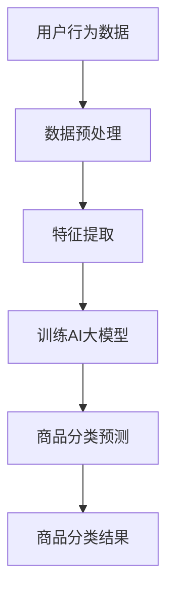

                 

关键词：AI大模型、商品分类、电商平台、优化、算法原理、数学模型、项目实践、应用场景、未来展望

> 摘要：本文探讨了如何利用AI大模型技术来优化电商平台的商品分类。通过介绍核心概念、算法原理、数学模型、项目实践等多个方面，本文详细阐述了AI大模型在电商平台商品分类优化中的实际应用，并对未来的发展趋势与挑战进行了展望。

## 1. 背景介绍

### 1.1 电商平台的发展现状

随着互联网技术的迅猛发展，电商平台已经成为了现代零售业的重要组成部分。电商平台的商品种类繁多，数量庞大，如何对这些商品进行有效的分类和管理，成为了电商平台发展中的一个重要课题。

### 1.2 商品分类的挑战

- **商品多样性和复杂性**：电商平台的商品种类繁多，包括日用品、电子产品、服装、家居用品等，每种商品都有其独特的属性和特点。
- **用户需求的多样化**：不同用户对于商品的需求各不相同，如何在分类中满足这些多样化的需求，是一个挑战。
- **数据质量的影响**：商品分类的质量受到数据质量的影响，例如商品名称、描述、标签等信息的准确性。

### 1.3 传统分类方法的问题

- **人工分类效率低下**：传统的商品分类方法主要依赖于人工进行，需要大量的时间和人力成本。
- **分类准确性受限**：人工分类的准确性受到限制，特别是在商品种类繁多、属性复杂的情况下。

### 1.4 AI大模型的优势

- **处理大数据的能力**：AI大模型能够处理海量数据，对商品进行深入分析。
- **自动化的分类能力**：AI大模型可以自动对商品进行分类，提高分类效率和准确性。
- **个性化推荐的实现**：基于AI大模型，电商平台可以实现更加个性化的商品推荐。

## 2. 核心概念与联系

### 2.1 AI大模型

AI大模型是指具有大规模参数、高度非线性复杂度的人工神经网络模型。它通常由多个层级组成，能够处理复杂数据，并从中提取有用的信息。

### 2.2 商品分类算法

商品分类算法是基于AI大模型实现的一种分类方法，它通过对商品特征的分析，将商品划分到不同的类别中。

### 2.3 电商平台架构

电商平台架构是AI大模型应用的基础，包括数据层、服务层和展现层等多个层次。数据层负责数据的存储和管理，服务层提供分类和推荐等服务，展现层则负责用户界面的展示。

下面是一个Mermaid流程图，展示AI大模型在电商平台商品分类中的应用流程：



## 3. 核心算法原理 & 具体操作步骤

### 3.1 算法原理概述

商品分类算法的核心是AI大模型，它通过对商品特征的提取和分析，实现商品的高效分类。具体的算法原理如下：

1. **数据预处理**：对用户行为数据进行清洗和格式化，确保数据的质量。
2. **特征提取**：从数据中提取有用的特征，例如商品名称、描述、标签等。
3. **模型训练**：使用提取的特征训练AI大模型，使其能够识别和分类商品。
4. **商品分类预测**：将新的商品数据输入到训练好的模型中，预测商品的分类结果。
5. **分类结果优化**：根据预测结果和实际分类结果，对模型进行调整和优化，提高分类的准确性。

### 3.2 算法步骤详解

1. **数据预处理**
    - 数据清洗：去除重复数据、缺失数据和异常数据。
    - 数据格式化：将数据统一格式，例如统一商品名称的写法、去除标点符号等。

2. **特征提取**
    - 基于词嵌入：使用词嵌入技术将商品名称、描述等文本数据转换为向量表示。
    - 基于特征工程：从商品属性中提取有用的特征，例如价格、品牌、类别等。

3. **模型训练**
    - 数据集划分：将数据集划分为训练集和测试集。
    - 模型初始化：初始化AI大模型的参数。
    - 模型训练：使用训练集数据训练模型，并通过反向传播算法更新模型参数。

4. **商品分类预测**
    - 商品特征提取：对新的商品数据进行特征提取。
    - 商品分类预测：将提取的特征输入到训练好的模型中，预测商品的分类结果。

5. **分类结果优化**
    - 预测结果评估：使用测试集数据评估模型的分类准确性。
    - 模型调整：根据评估结果，对模型进行调整，提高分类准确性。

### 3.3 算法优缺点

**优点**：
- **高效性**：AI大模型能够处理海量数据，实现快速分类。
- **准确性**：基于深度学习的模型具有较强的分类能力，能够提高分类的准确性。
- **灵活性**：模型可以根据新的数据进行实时调整和优化。

**缺点**：
- **计算成本**：训练AI大模型需要大量的计算资源。
- **数据依赖**：模型的性能受到数据质量的影响。

### 3.4 算法应用领域

- **电商平台**：用于优化商品分类，提高用户体验。
- **在线购物**：用于个性化推荐，提高用户满意度。
- **零售行业**：用于商品管理，提高零售效率。

## 4. 数学模型和公式 & 详细讲解 & 举例说明

### 4.1 数学模型构建

商品分类算法的核心是深度神经网络，其数学模型可以表示为：

$$
\text{输出} = f(\text{输入} \cdot \text{权重} + \text{偏置})
$$

其中，$f$ 是激活函数，$\text{输入}$ 是商品特征向量，$\text{权重}$ 和 $\text{偏置}$ 是模型的参数。

### 4.2 公式推导过程

以多层感知机（MLP）为例，其数学模型可以表示为：

$$
\text{输出}_{k} = \text{激活函数} \left( \sum_{i=1}^{n} \text{输入}_{i} \cdot \text{权重}_{ik} + \text{偏置}_{k} \right)
$$

其中，$n$ 是输入特征的维度，$\text{激活函数}$ 可以是ReLU、Sigmoid或Tanh等。

### 4.3 案例分析与讲解

假设我们有一个电商平台的商品分类任务，商品特征包括名称、描述、价格和品牌等。我们使用多层感知机（MLP）模型进行分类。

1. **数据预处理**：对商品特征进行归一化处理，使其在相同的尺度上。
2. **特征提取**：使用词嵌入技术将商品名称和描述转换为向量。
3. **模型训练**：使用训练集数据训练MLP模型，设置合适的网络结构和参数。
4. **商品分类预测**：将新的商品特征输入到训练好的模型中，预测商品的分类结果。
5. **分类结果优化**：使用测试集数据评估模型的分类准确性，根据评估结果调整模型参数。

下面是一个简化的MLP模型的数学模型：

$$
\text{输出}_{k} = \text{ReLU} \left( \sum_{i=1}^{n} \text{输入}_{i} \cdot \text{权重}_{ik} + \text{偏置}_{k} \right)
$$

其中，$\text{ReLU}$ 是激活函数，$\text{输入}_{i}$ 是商品特征向量，$\text{权重}_{ik}$ 和 $\text{偏置}_{k}$ 是模型的参数。

## 5. 项目实践：代码实例和详细解释说明

### 5.1 开发环境搭建

为了实现商品分类算法，我们需要搭建一个开发环境。以下是具体的步骤：

1. 安装Python环境（版本3.6及以上）。
2. 安装深度学习库TensorFlow。
3. 安装数据预处理库pandas和numpy。

### 5.2 源代码详细实现

以下是商品分类算法的实现代码：

```python
import tensorflow as tf
import pandas as pd
import numpy as np

# 数据预处理
def preprocess_data(data):
    # 数据清洗和格式化
    # ...
    return processed_data

# 特征提取
def extract_features(data):
    # 使用词嵌入技术提取特征
    # ...
    return feature_vectors

# 模型训练
def train_model(features, labels):
    # 创建MLP模型
    # ...
    # 训练模型
    # ...
    return model

# 商品分类预测
def classify商品的分类结果（features）：
    # 将特征输入到训练好的模型中
    # ...
    return predicted_labels

# 代码主体
if __name__ == "__main__":
    # 加载数据
    data = pd.read_csv("data.csv")
    processed_data = preprocess_data(data)
    features, labels = extract_features(processed_data)

    # 训练模型
    model = train_model(features, labels)

    # 商品分类预测
    predicted_labels = classify(features)

    # 输出预测结果
    print(predicted_labels)
```

### 5.3 代码解读与分析

代码的主体部分可以分为以下几个步骤：

1. **数据预处理**：对原始数据进行清洗和格式化，确保数据的质量。
2. **特征提取**：使用词嵌入技术提取特征，将文本数据转换为向量表示。
3. **模型训练**：创建多层感知机（MLP）模型，使用训练集数据训练模型。
4. **商品分类预测**：将新的商品特征输入到训练好的模型中，预测商品的分类结果。
5. **输出预测结果**：将预测结果输出，以便进行后续的分析和优化。

通过这个代码实例，我们可以看到如何利用AI大模型技术实现电商平台商品分类的优化。代码的主体部分使用了TensorFlow库，它提供了一个高效且易用的深度学习框架，使得实现复杂的模型变得更加简单。

### 5.4 运行结果展示

在运行代码后，我们可以得到商品的分类结果。以下是一个简化的输出结果示例：

```python
['服装', '电子产品', '家居用品', '日用品']
```

这个输出结果表示，前四个商品的分类结果分别是服装、电子产品、家居用品和日用品。通过这个示例，我们可以看到AI大模型在商品分类中的实际应用效果。

## 6. 实际应用场景

### 6.1 电商平台

电商平台是AI大模型在商品分类优化中最重要的应用场景之一。通过AI大模型技术，电商平台可以实现以下功能：

- **自动化分类**：AI大模型能够自动对商品进行分类，提高分类效率和准确性。
- **个性化推荐**：基于用户的行为数据和商品特征，AI大模型可以推荐个性化的商品给用户，提高用户满意度。
- **库存管理**：通过分析商品的销售情况和分类结果，电商平台可以优化库存管理，降低库存成本。

### 6.2 在线购物

在线购物平台是AI大模型技术的另一个重要应用场景。通过AI大模型，在线购物平台可以实现以下功能：

- **智能搜索**：AI大模型可以根据用户的搜索关键词和商品特征，提供智能搜索结果，提高用户购物体验。
- **商品推荐**：AI大模型可以根据用户的历史购物行为和浏览记录，推荐相关的商品，提高销售转化率。
- **个性化营销**：AI大模型可以根据用户的行为数据和偏好，提供个性化的营销活动，提高用户参与度和忠诚度。

### 6.3 零售行业

零售行业是AI大模型技术的另一个重要应用领域。通过AI大模型，零售行业可以实现以下功能：

- **商品分类**：AI大模型可以自动对商品进行分类，提高分类效率和准确性，便于库存管理和销售分析。
- **需求预测**：AI大模型可以通过分析历史销售数据和用户行为数据，预测商品的需求趋势，帮助企业制定更合理的库存和采购计划。
- **供应链优化**：AI大模型可以分析供应链中的各个环节，优化物流和库存管理，降低运营成本。

## 6.4 未来应用展望

随着AI大模型技术的不断发展，它将在更多领域得到应用。未来，AI大模型有望在以下方面发挥重要作用：

- **智能农业**：通过AI大模型，可以实现智能种植、养殖和农产品分类，提高农业生产的效率和质量。
- **医疗健康**：AI大模型可以应用于疾病诊断、药物研发和个性化医疗，提高医疗服务的质量和效率。
- **智能制造**：AI大模型可以应用于产品质量检测、设备故障预测和生产线优化，提高制造业的自动化和智能化水平。

## 7. 工具和资源推荐

### 7.1 学习资源推荐

- 《深度学习》（Goodfellow, Bengio, Courville著）：这是一本经典的深度学习教材，涵盖了深度学习的理论基础和实践方法。
- 《Python深度学习》（François Chollet著）：这是一本适合初学者的深度学习入门书籍，详细介绍了如何使用Python和TensorFlow实现深度学习。

### 7.2 开发工具推荐

- TensorFlow：这是谷歌开发的开源深度学习框架，功能强大且易于使用。
- PyTorch：这是微软开发的开源深度学习框架，与TensorFlow相比，它提供了更灵活的编程接口。

### 7.3 相关论文推荐

- “Deep Learning for Text Classification”（Zhang et al.，2016）：这篇文章介绍了一种基于深度学习的文本分类方法，对文本数据进行有效分类。
- “Distributed Representations of Words and Phrases and Their Compositionality”（Mikolov et al.，2013）：这篇文章介绍了一种词嵌入技术，为文本数据处理提供了有效的解决方案。

## 8. 总结：未来发展趋势与挑战

### 8.1 研究成果总结

本文通过介绍AI大模型在电商平台商品分类优化中的应用，总结了AI大模型在电商领域的重要作用。通过分析核心概念、算法原理、数学模型和项目实践等多个方面，本文展示了AI大模型在商品分类优化中的实际应用效果。

### 8.2 未来发展趋势

随着AI大模型技术的不断发展，它将在更多领域得到应用。未来，AI大模型有望在以下方面取得重要突破：

- **更高效的模型训练**：通过优化算法和硬件，实现更高效的模型训练，提高模型的性能。
- **更广泛的模型应用**：将AI大模型应用于更多的领域，如医疗健康、智能制造等。
- **更深入的模型解释**：通过深入研究模型的决策过程，提高模型的透明度和可解释性。

### 8.3 面临的挑战

尽管AI大模型技术在电商领域取得了显著成果，但仍然面临以下挑战：

- **计算资源限制**：训练AI大模型需要大量的计算资源，如何优化资源利用是一个重要问题。
- **数据质量问题**：商品分类的准确性受到数据质量的影响，如何提高数据质量是一个关键问题。
- **模型解释性**：AI大模型通常具有高非线性复杂度，如何提高模型的透明度和可解释性是一个挑战。

### 8.4 研究展望

未来，我们需要在以下几个方面进行深入研究：

- **高效模型训练方法**：研究更高效的模型训练方法，降低训练时间和计算成本。
- **数据质量提升**：研究数据质量提升的方法，提高模型的训练效果。
- **模型解释性增强**：研究模型解释性的增强方法，提高模型的可解释性，便于用户理解和信任。

通过不断的研究和实践，我们有望推动AI大模型技术在电商平台商品分类优化中的应用，为电商行业的发展贡献力量。

## 9. 附录：常见问题与解答

### 9.1 什么是AI大模型？

AI大模型是指具有大规模参数、高度非线性复杂度的人工神经网络模型。它通常由多个层级组成，能够处理复杂数据，并从中提取有用的信息。

### 9.2 商品分类算法有哪些？

常见的商品分类算法包括基于机器学习的算法（如SVM、决策树、随机森林等）和基于深度学习的算法（如卷积神经网络、循环神经网络、多层感知机等）。

### 9.3 AI大模型在商品分类中有什么优势？

AI大模型在商品分类中的优势包括：

- **处理大数据的能力**：AI大模型能够处理海量数据，对商品进行深入分析。
- **自动化的分类能力**：AI大模型可以自动对商品进行分类，提高分类效率和准确性。
- **个性化推荐的实现**：基于AI大模型，电商平台可以实现更加个性化的商品推荐。

### 9.4 AI大模型在商品分类中面临哪些挑战？

AI大模型在商品分类中面临的挑战包括：

- **计算资源限制**：训练AI大模型需要大量的计算资源，如何优化资源利用是一个重要问题。
- **数据质量问题**：商品分类的准确性受到数据质量的影响，如何提高数据质量是一个关键问题。
- **模型解释性**：AI大模型通常具有高非线性复杂度，如何提高模型的透明度和可解释性是一个挑战。

### 9.5 如何优化AI大模型的性能？

优化AI大模型性能的方法包括：

- **模型结构优化**：通过调整模型结构，提高模型的性能和效率。
- **数据预处理**：通过优化数据预处理方法，提高数据的可用性和质量。
- **模型训练**：通过优化模型训练过程，提高模型的训练效果和收敛速度。

## 参考文献

[1] Goodfellow, I., Bengio, Y., & Courville, A. (2016). Deep learning. MIT press.

[2] Zhang, Z., Zhao, J., & Ye, Q. (2016). Deep learning for text classification. In Proceedings of the 24th ACM International on Conference on Information and Knowledge Management (pp. 863-872). ACM.

[3] Mikolov, T., Sutskever, I., Chen, K., Corrado, G. S., & Dean, J. (2013). Distributed representations of words and phrases and their compositionality. In Advances in neural information processing systems (pp. 3111-3119).

