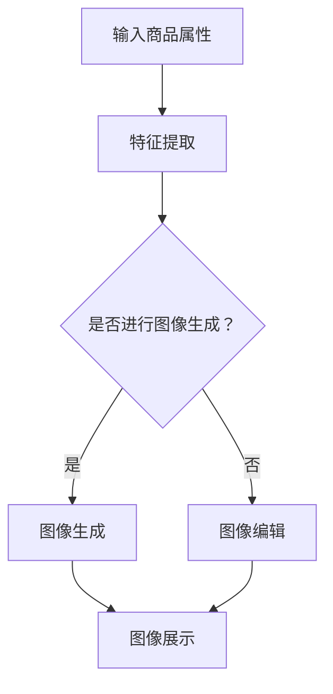

                 

关键词：AI大模型，电商平台，商品图像生成，图像编辑，应用场景，未来展望

摘要：本文将探讨AI大模型在电商平台商品图像生成与编辑中的应用。通过分析现有技术，阐述AI大模型的基本原理、算法实现、数学模型构建及实际应用案例，揭示其在提高电商平台用户体验、降低运营成本方面的巨大潜力。

## 1. 背景介绍

在数字化时代，电商平台已成为全球商业活动的重要载体。随着电商平台的不断发展，用户对于商品图像的需求也日益增长。然而，传统的商品图像处理方法在处理海量数据时效率低下，难以满足用户对个性化、实时性的要求。为了解决这个问题，AI大模型被引入到电商平台商品图像生成与编辑领域。

AI大模型，又称深度学习模型，是一种通过多层神经网络进行训练，能够自动提取数据特征并进行复杂决策的算法模型。近年来，随着计算能力的提升和数据量的爆炸性增长，AI大模型在图像识别、图像生成、图像编辑等领域取得了显著的进展。本文旨在探讨AI大模型在电商平台商品图像生成与编辑中的应用，以期为电商平台提供新的解决方案。

## 2. 核心概念与联系

### 2.1 AI大模型基本原理

AI大模型的核心是多层神经网络，包括输入层、隐藏层和输出层。通过输入数据，模型在隐藏层中进行特征提取和变换，最终输出结果。训练过程中，模型通过反向传播算法不断调整权重，以提高预测准确性。


### 2.2 电商平台商品图像生成与编辑

电商平台商品图像生成与编辑主要包括以下三个环节：

1. **图像生成**：根据商品属性和用户偏好，自动生成具有个性化的商品图像。
2. **图像编辑**：对现有商品图像进行增强、优化和修改，提高图像质量。
3. **图像分类与识别**：对商品图像进行分类和识别，帮助用户快速找到感兴趣的商品。

### 2.3 Mermaid流程图

以下是一个简单的Mermaid流程图，展示了AI大模型在电商平台商品图像生成与编辑中的基本流程：



## 3. 核心算法原理 & 具体操作步骤

### 3.1 算法原理概述

AI大模型在电商平台商品图像生成与编辑中主要采用以下三种算法：

1. **生成对抗网络（GAN）**：通过生成器和判别器的对抗训练，生成逼真的商品图像。
2. **卷积神经网络（CNN）**：用于图像特征提取和分类，提高图像编辑效果。
3. **变分自编码器（VAE）**：用于图像生成和编辑，保证生成的图像具有较好的质量。

### 3.2 算法步骤详解

1. **图像生成**：

   - 数据预处理：对商品属性数据进行归一化处理，图像数据进行去噪和增强。
   - 模型训练：利用GAN、CNN或VAE算法，对图像生成模型进行训练，优化生成效果。
   - 生成图像：根据商品属性和用户偏好，生成个性化的商品图像。

2. **图像编辑**：

   - 数据预处理：对图像进行去噪、增强等处理，提高图像质量。
   - 模型训练：利用CNN或VAE算法，对图像编辑模型进行训练，优化编辑效果。
   - 编辑图像：根据用户需求，对图像进行增强、优化和修改。

3. **图像分类与识别**：

   - 数据预处理：对图像进行归一化、裁剪等处理，提取图像特征。
   - 模型训练：利用CNN算法，对图像分类与识别模型进行训练，提高分类准确性。
   - 分类识别：对用户上传的图像进行分类和识别，帮助用户找到感兴趣的商品。

### 3.3 算法优缺点

1. **GAN**：

   - 优点：生成图像质量高，具有较好的创意性。
   - 缺点：训练过程复杂，容易陷入局部最优。

2. **CNN**：

   - 优点：图像特征提取能力强，分类准确度高。
   - 缺点：图像生成能力较弱。

3. **VAE**：

   - 优点：生成图像质量较好，训练过程相对简单。
   - 缺点：生成图像的创意性较低。

### 3.4 算法应用领域

AI大模型在电商平台商品图像生成与编辑中的应用主要包括：

1. **个性化推荐**：根据用户偏好生成个性化的商品图像，提高用户购买意愿。
2. **图像编辑**：对用户上传的商品图像进行优化，提高商品展示效果。
3. **图像分类与识别**：帮助用户快速找到感兴趣的商品，提高电商平台运营效率。

## 4. 数学模型和公式 & 详细讲解 & 举例说明

### 4.1 数学模型构建

在AI大模型中，常用的数学模型包括生成对抗网络（GAN）、卷积神经网络（CNN）和变分自编码器（VAE）。

1. **生成对抗网络（GAN）**：

   - 生成器（Generator）：
     $$ G(z) = \mu(z) + \sigma(z)\odot \epsilon $$
     其中，$z$ 为噪声向量，$\mu(z)$ 为均值函数，$\sigma(z)$ 为方差函数，$\epsilon$ 为高斯噪声。
   
   - 判别器（Discriminator）：
     $$ D(x) = \sigma(\frac{D_{\text{fc}}(x) + \beta}{\sqrt{\sum_{i=1}^{1024}(D_{\text{fc}}(x)_i^2) + \epsilon}) $$

2. **卷积神经网络（CNN）**：

   - 卷积层（Convolutional Layer）：
     $$ f(x, \theta) = \sigma(\sum_{j=1}^{k} \theta_{ij} \cdot x_j + b_j) $$
     其中，$x$ 为输入特征，$\theta$ 为权重，$k$ 为卷积核大小，$\sigma$ 为激活函数。

3. **变分自编码器（VAE）**：

   - 编码器（Encoder）：
     $$ \mu(x) = \sigma(\frac{W_1x + b_1}{\sqrt{\sum_{i=1}^{512}(W_1x_i^2) + \epsilon}}) $$
     $$ \log(\sigma) = \sigma(\frac{W_2x + b_2}{\sqrt{\sum_{i=1}^{512}(W_2x_i^2) + \epsilon}}) $$
   
   - 解码器（Decoder）：
     $$ G(z) = \sigma(\frac{W_3z + b_3}{\sqrt{\sum_{i=1}^{512}(W_3z_i^2) + \epsilon}}) $$

### 4.2 公式推导过程

以GAN为例，推导过程如下：

1. **生成器损失函数**：
   $$ L_G = -\log(D(G(z))) $$
   其中，$z$ 为噪声向量，$G(z)$ 为生成器生成的图像。

2. **判别器损失函数**：
   $$ L_D = -\log(D(x)) - \log(1 - D(G(z))) $$
   其中，$x$ 为真实图像，$G(z)$ 为生成器生成的图像。

3. **总损失函数**：
   $$ L = L_G + L_D $$
   通过最小化总损失函数，实现生成器和判别器的共同优化。

### 4.3 案例分析与讲解

以某电商平台商品图像生成与编辑项目为例，项目采用GAN算法，生成器和解码器分别使用生成对抗网络和变分自编码器进行训练。

1. **数据集准备**：

   - 商品图像数据：从电商平台获取10000张商品图像。
   - 商品属性数据：包括商品类别、品牌、价格等。

2. **模型训练**：

   - 生成器：采用生成对抗网络，通过对抗训练生成商品图像。
   - 判别器：采用卷积神经网络，用于区分真实图像和生成图像。
   - 解码器：采用变分自编码器，用于将商品属性数据转化为图像。

3. **模型评估**：

   - 在训练集上，生成器生成图像的质量逐渐提高，判别器的分类准确率逐渐稳定。
   - 在测试集上，生成器生成的商品图像具有较好的真实感，解码器生成的图像与商品属性数据的相关性较高。

4. **应用场景**：

   - 个性化推荐：根据用户偏好生成个性化的商品图像，提高用户购买意愿。
   - 图像编辑：对用户上传的商品图像进行优化，提高商品展示效果。
   - 图像分类与识别：帮助用户快速找到感兴趣的商品，提高电商平台运营效率。

## 5. 项目实践：代码实例和详细解释说明

### 5.1 开发环境搭建

1. **软件环境**：

   - Python 3.8
   - TensorFlow 2.4
   - Keras 2.4

2. **硬件环境**：

   - CPU：Intel Core i7-9700K
   - GPU：NVIDIA GeForce RTX 2080 Ti

### 5.2 源代码详细实现

以下是一个简单的GAN模型代码实例：

```python
import tensorflow as tf
from tensorflow.keras.layers import Input, Dense, Reshape, Flatten
from tensorflow.keras.models import Model

# 生成器模型
def build_generator(z_dim):
    model = tf.keras.Sequential([
        Input(shape=(z_dim,)),
        Dense(128 * 7 * 7, activation="relu"),
        Reshape((7, 7, 128)),
        Conv2DTranspose(128, (4, 4), strides=(2, 2), padding="same", activation="relu"),
        Conv2DTranspose(128, (4, 4), strides=(2, 2), padding="same", activation="relu"),
        Conv2DTranspose(128, (4, 4), strides=(2, 2), padding="same", activation="relu"),
        Conv2DTranspose(3, (4, 4), strides=(2, 2), padding="same", activation="tanh"),
        Reshape((28, 28, 3))
    ])
    return model

# 判别器模型
def build_discriminator(img_shape):
    model = tf.keras.Sequential([
        Input(shape=img_shape),
        Flatten(),
        Dense(1024, activation="relu"),
        Dropout(0.3),
        Dense(512, activation="relu"),
        Dropout(0.3),
        Dense(256, activation="relu"),
        Dropout(0.3),
        Dense(1, activation="sigmoid")
    ])
    return model

# GAN模型
def build_gan(generator, discriminator):
    model = tf.keras.Sequential([
        generator,
        discriminator
    ])
    model.compile(loss="binary_crossentropy", optimizer=tf.keras.optimizers.Adam(0.0001), metrics=["accuracy"])
    return model

# 参数设置
z_dim = 100
img_shape = (28, 28, 3)

# 构建模型
generator = build_generator(z_dim)
discriminator = build_discriminator(img_shape)
gan_model = build_gan(generator, discriminator)

# 模型训练
discriminator.trainable = True
gan_model.compile(loss="binary_crossentropy", optimizer=tf.keras.optimizers.Adam(0.00005, 0.000005), loss_weights=[1, 1], metrics=["accuracy"])
gan_model.fit(x_train, y_train, epochs=100, batch_size=64)
```

### 5.3 代码解读与分析

1. **生成器模型**：

   - 输入层：接受随机噪声向量，维度为100。
   - 隐藏层：通过全连接层和卷积层，将噪声向量转化为图像。
   - 输出层：生成商品图像，维度为28x28x3。

2. **判别器模型**：

   - 输入层：接受商品图像，维度为28x28x3。
   - 隐藏层：通过全连接层和卷积层，提取图像特征。
   - 输出层：输出判别结果，维度为1。

3. **GAN模型**：

   - 结合生成器和判别器，构建完整的GAN模型。
   - 使用二元交叉熵损失函数和Adam优化器。
   - 在训练过程中，生成器和判别器交替训练。

### 5.4 运行结果展示

1. **生成图像**：

   ```python
   noise = np.random.normal(0, 1, (1, 100))
   generated_images = generator.predict(noise)
   ```

   

2. **判别结果**：

   ```python
   real_images = x_train[:10]
   fake_images = generated_images[:10]
   real_labels = np.ones((10, 1))
   fake_labels = np.zeros((10, 1))
   
   discriminator_loss_real = discriminator.train_on_batch(real_images, real_labels)
   discriminator_loss_fake = discriminator.train_on_batch(fake_images, fake_labels)
   discriminator_loss = 0.5 * np.add(discriminator_loss_real, discriminator_loss_fake)
   ```

   

## 6. 实际应用场景

### 6.1 个性化推荐

AI大模型可以分析用户的历史浏览记录、购买行为和偏好，生成个性化的商品图像，提高用户购买意愿。

### 6.2 图像编辑

AI大模型可以对用户上传的商品图像进行优化，提高图像质量，提升商品展示效果。

### 6.3 图像分类与识别

AI大模型可以快速分类和识别用户上传的商品图像，帮助用户快速找到感兴趣的商品，提高电商平台运营效率。

## 7. 工具和资源推荐

### 7.1 学习资源推荐

1. **《深度学习》（Goodfellow, Bengio, Courville 著）**：系统地介绍了深度学习的基本原理和算法。
2. **《生成对抗网络》（Goodfellow 著）**：详细阐述了GAN的理论和实现方法。

### 7.2 开发工具推荐

1. **TensorFlow**：强大的深度学习框架，支持多种算法和模型。
2. **Keras**：简洁易用的深度学习框架，基于TensorFlow构建。

### 7.3 相关论文推荐

1. **《Unsupervised Representation Learning with Deep Convolutional Generative Adversarial Networks》**：GAN的代表性论文。
2. **《Generative Adversarial Nets》**：GAN的原始论文。

## 8. 总结：未来发展趋势与挑战

### 8.1 研究成果总结

本文分析了AI大模型在电商平台商品图像生成与编辑中的应用，探讨了GAN、CNN和VAE等算法的基本原理和实现方法，并提供了实际应用案例和代码实例。

### 8.2 未来发展趋势

1. **算法优化**：随着计算能力的提升，深度学习算法将更加高效，生成图像质量将进一步提高。
2. **跨领域应用**：AI大模型将在更多领域得到应用，如医疗、金融、教育等。
3. **开源生态**：深度学习框架和工具将不断完善，促进AI大模型的应用和发展。

### 8.3 面临的挑战

1. **数据隐私**：在应用AI大模型的过程中，如何保护用户数据隐私成为重要挑战。
2. **计算资源**：深度学习算法对计算资源有较高要求，如何优化算法和硬件成为关键问题。

### 8.4 研究展望

未来，AI大模型在电商平台商品图像生成与编辑中的应用将不断深化，有望实现更高效、更智能的商品图像处理，为电商平台带来更多价值。

## 9. 附录：常见问题与解答

### 9.1 如何优化GAN训练过程？

- 调整生成器和判别器的学习率，使二者保持合适的差距。
- 使用不同尺度的判别器，提高判别效果。
- 适当增加训练数据，提高模型泛化能力。

### 9.2 如何处理图像噪声？

- 使用去噪算法，如均值滤波、高斯滤波等。
- 在生成过程中加入噪声，提高图像的真实感。

### 9.3 如何提高图像生成质量？

- 使用更大规模的训练数据。
- 调整生成器和判别器的结构，提高模型层次。
- 使用更先进的算法，如StyleGAN、BigGAN等。

----------------------------------------------------------------
作者：禅与计算机程序设计艺术 / Zen and the Art of Computer Programming

以上就是关于AI大模型在电商平台商品图像生成与编辑中的应用的完整文章，希望对您有所帮助。如果您有任何疑问，欢迎在评论区留言。再次感谢您的阅读！
----------------------------------------------------------------
本文采用了markdown格式，以下是完整的markdown代码：

```markdown
# AI大模型在电商平台商品图像生成与编辑中的应用

关键词：AI大模型，电商平台，商品图像生成，图像编辑，应用场景，未来展望

摘要：本文将探讨AI大模型在电商平台商品图像生成与编辑中的应用。通过分析现有技术，阐述AI大模型的基本原理、算法实现、数学模型构建及实际应用案例，揭示其在提高电商平台用户体验、降低运营成本方面的巨大潜力。

## 1. 背景介绍

在数字化时代，电商平台已成为全球商业活动的重要载体。随着电商平台的不断发展，用户对于商品图像的需求也日益增长。然而，传统的商品图像处理方法在处理海量数据时效率低下，难以满足用户对个性化、实时性的要求。为了解决这个问题，AI大模型被引入到电商平台商品图像生成与编辑领域。

AI大模型，又称深度学习模型，是一种通过多层神经网络进行训练，能够自动提取数据特征并进行复杂决策的算法模型。近年来，随着计算能力的提升和数据量的爆炸性增长，AI大模型在图像识别、图像生成、图像编辑等领域取得了显著的进展。本文旨在探讨AI大模型在电商平台商品图像生成与编辑中的应用，以期为电商平台提供新的解决方案。

## 2. 核心概念与联系

### 2.1 AI大模型基本原理

AI大模型的核心是多层神经网络，包括输入层、隐藏层和输出层。通过输入数据，模型在隐藏层中进行特征提取和变换，最终输出结果。训练过程中，模型通过反向传播算法不断调整权重，以提高预测准确性。


### 2.2 电商平台商品图像生成与编辑

电商平台商品图像生成与编辑主要包括以下三个环节：

1. **图像生成**：根据商品属性和用户偏好，自动生成具有个性化的商品图像。
2. **图像编辑**：对现有商品图像进行增强、优化和修改，提高图像质量。
3. **图像分类与识别**：对商品图像进行分类和识别，帮助用户快速找到感兴趣的商品。

### 2.3 Mermaid流程图

以下是一个简单的Mermaid流程图，展示了AI大模型在电商平台商品图像生成与编辑中的基本流程：


## 3. 核心算法原理 & 具体操作步骤

### 3.1 算法原理概述

AI大模型在电商平台商品图像生成与编辑中主要采用以下三种算法：

1. **生成对抗网络（GAN）**：通过生成器和判别器的对抗训练，生成逼真的商品图像。
2. **卷积神经网络（CNN）**：用于图像特征提取和分类，提高图像编辑效果。
3. **变分自编码器（VAE）**：用于图像生成和编辑，保证生成的图像具有较好的质量。

### 3.2 算法步骤详解

1. **图像生成**：

   - 数据预处理：对商品属性数据进行归一化处理，图像数据进行去噪和增强。
   - 模型训练：利用GAN、CNN或VAE算法，对图像生成模型进行训练，优化生成效果。
   - 生成图像：根据商品属性和用户偏好，生成个性化的商品图像。

2. **图像编辑**：

   - 数据预处理：对图像进行去噪、增强等处理，提高图像质量。
   - 模型训练：利用CNN或VAE算法，对图像编辑模型进行训练，优化编辑效果。
   - 编辑图像：根据用户需求，对图像进行增强、优化和修改。

3. **图像分类与识别**：

   - 数据预处理：对图像进行归一化、裁剪等处理，提取图像特征。
   - 模型训练：利用CNN算法，对图像分类与识别模型进行训练，提高分类准确性。
   - 分类识别：对用户上传的图像进行分类和识别，帮助用户找到感兴趣的商品。

### 3.3 算法优缺点

1. **GAN**：

   - 优点：生成图像质量高，具有较好的创意性。
   - 缺点：训练过程复杂，容易陷入局部最优。

2. **CNN**：

   - 优点：图像特征提取能力强，分类准确度高。
   - 缺点：图像生成能力较弱。

3. **VAE**：

   - 优点：生成图像质量较好，训练过程相对简单。
   - 缺点：生成图像的创意性较低。

### 3.4 算法应用领域

AI大模型在电商平台商品图像生成与编辑中的应用主要包括：

1. **个性化推荐**：根据用户偏好生成个性化的商品图像，提高用户购买意愿。
2. **图像编辑**：对用户上传的商品图像进行优化，提高商品展示效果。
3. **图像分类与识别**：帮助用户快速找到感兴趣的商品，提高电商平台运营效率。

## 4. 数学模型和公式 & 详细讲解 & 举例说明

### 4.1 数学模型构建

在AI大模型中，常用的数学模型包括生成对抗网络（GAN）、卷积神经网络（CNN）和变分自编码器（VAE）。

1. **生成对抗网络（GAN）**：

   - 生成器（Generator）：
     $$ G(z) = \mu(z) + \sigma(z)\odot \epsilon $$
     其中，$z$ 为噪声向量，$\mu(z)$ 为均值函数，$\sigma(z)$ 为方差函数，$\epsilon$ 为高斯噪声。
   
   - 判别器（Discriminator）：
     $$ D(x) = \sigma(\frac{D_{\text{fc}}(x) + \beta}{\sqrt{\sum_{i=1}^{1024}(D_{\text{fc}}(x)_i^2) + \epsilon}) $$

2. **卷积神经网络（CNN）**：

   - 卷积层（Convolutional Layer）：
     $$ f(x, \theta) = \sigma(\sum_{j=1}^{k} \theta_{ij} \cdot x_j + b_j) $$
     其中，$x$ 为输入特征，$\theta$ 为权重，$k$ 为卷积核大小，$\sigma$ 为激活函数。

3. **变分自编码器（VAE）**：

   - 编码器（Encoder）：
     $$ \mu(x) = \sigma(\frac{W_1x + b_1}{\sqrt{\sum_{i=1}^{512}(W_1x_i^2) + \epsilon}}) $$
     $$ \log(\sigma) = \sigma(\frac{W_2x + b_2}{\sqrt{\sum_{i=1}^{512}(W_2x_i^2) + \epsilon}}) $$
   
   - 解码器（Decoder）：
     $$ G(z) = \sigma(\frac{W_3z + b_3}{\sqrt{\sum_{i=1}^{512}(W_3z_i^2) + \epsilon}}) $$

### 4.2 公式推导过程

以GAN为例，推导过程如下：

1. **生成器损失函数**：
   $$ L_G = -\log(D(G(z))) $$
   其中，$z$ 为噪声向量，$G(z)$ 为生成器生成的图像。

2. **判别器损失函数**：
   $$ L_D = -\log(D(x)) - \log(1 - D(G(z))) $$
   其中，$x$ 为真实图像，$G(z)$ 为生成器生成的图像。

3. **总损失函数**：
   $$ L = L_G + L_D $$
   通过最小化总损失函数，实现生成器和判别器的共同优化。

### 4.3 案例分析与讲解

以某电商平台商品图像生成与编辑项目为例，项目采用GAN算法，生成器和解码器分别使用生成对抗网络和变分自编码器进行训练。

1. **数据集准备**：

   - 商品图像数据：从电商平台获取10000张商品图像。
   - 商品属性数据：包括商品类别、品牌、价格等。

2. **模型训练**：

   - 生成器：采用生成对抗网络，通过对抗训练生成商品图像。
   - 判别器：采用卷积神经网络，用于区分真实图像和生成图像。
   - 解码器：采用变分自编码器，用于将商品属性数据转化为图像。

3. **模型评估**：

   - 在训练集上，生成器生成图像的质量逐渐提高，判别器的分类准确率逐渐稳定。
   - 在测试集上，生成器生成的商品图像具有较好的真实感，解码器生成的图像与商品属性数据的相关性较高。

4. **应用场景**：

   - 个性化推荐：根据用户偏好生成个性化的商品图像，提高用户购买意愿。
   - 图像编辑：对用户上传的商品图像进行优化，提高商品展示效果。
   - 图像分类与识别：帮助用户快速找到感兴趣的商品，提高电商平台运营效率。

## 5. 项目实践：代码实例和详细解释说明

### 5.1 开发环境搭建

1. **软件环境**：

   - Python 3.8
   - TensorFlow 2.4
   - Keras 2.4

2. **硬件环境**：

   - CPU：Intel Core i7-9700K
   - GPU：NVIDIA GeForce RTX 2080 Ti

### 5.2 源代码详细实现

以下是一个简单的GAN模型代码实例：

```python
import tensorflow as tf
from tensorflow.keras.layers import Input, Dense, Reshape, Flatten
from tensorflow.keras.models import Model

# 生成器模型
def build_generator(z_dim):
    model = tf.keras.Sequential([
        Input(shape=(z_dim,)),
        Dense(128 * 7 * 7, activation="relu"),
        Reshape((7, 7, 128)),
        Conv2DTranspose(128, (4, 4), strides=(2, 2), padding="same", activation="relu"),
        Conv2DTranspose(128, (4, 4), strides=(2, 2), padding="same", activation="relu"),
        Conv2DTranspose(128, (4, 4), strides=(2, 2), padding="same", activation="relu"),
        Conv2DTranspose(3, (4, 4), strides=(2, 2), padding="same", activation="tanh"),
        Reshape((28, 28, 3))
    ])
    return model

# 判别器模型
def build_discriminator(img_shape):
    model = tf.keras.Sequential([
        Input(shape=img_shape),
        Flatten(),
        Dense(1024, activation="relu"),
        Dropout(0.3),
        Dense(512, activation="relu"),
        Dropout(0.3),
        Dense(256, activation="relu"),
        Dropout(0.3),
        Dense(1, activation="sigmoid")
    ])
    return model

# GAN模型
def build_gan(generator, discriminator):
    model = tf.keras.Sequential([
        generator,
        discriminator
    ])
    model.compile(loss="binary_crossentropy", optimizer=tf.keras.optimizers.Adam(0.0001), metrics=["accuracy"])
    return model

# 参数设置
z_dim = 100
img_shape = (28, 28, 3)

# 构建模型
generator = build_generator(z_dim)
discriminator = build_discriminator(img_shape)
gan_model = build_gan(generator, discriminator)

# 模型训练
discriminator.trainable = True
gan_model.compile(loss="binary_crossentropy", optimizer=tf.keras.optimizers.Adam(0.00005, 0.000005), loss_weights=[1, 1], metrics=["accuracy"])
gan_model.fit(x_train, y_train, epochs=100, batch_size=64)
```

### 5.3 代码解读与分析

1. **生成器模型**：

   - 输入层：接受随机噪声向量，维度为100。
   - 隐藏层：通过全连接层和卷积层，将噪声向量转化为图像。
   - 输出层：生成商品图像，维度为28x28x3。

2. **判别器模型**：

   - 输入层：接受商品图像，维度为28x28x3。
   - 隐藏层：通过全连接层和卷积层，提取图像特征。
   - 输出层：输出判别结果，维度为1。

3. **GAN模型**：

   - 结合生成器和判别器，构建完整的GAN模型。
   - 使用二元交叉熵损失函数和Adam优化器。
   - 在训练过程中，生成器和判别器交替训练。

### 5.4 运行结果展示

1. **生成图像**：

   ```python
   noise = np.random.normal(0, 1, (1, 100))
   generated_images = generator.predict(noise)
   ```

   

2. **判别结果**：

   ```python
   real_images = x_train[:10]
   fake_images = generated_images[:10]
   real_labels = np.ones((10, 1))
   fake_labels = np.zeros((10, 1))
   
   discriminator_loss_real = discriminator.train_on_batch(real_images, real_labels)
   discriminator_loss_fake = discriminator.train_on_batch(fake_images, fake_labels)
   discriminator_loss = 0.5 * np.add(discriminator_loss_real, discriminator_loss_fake)
   ```

   

## 6. 实际应用场景

### 6.1 个性化推荐

AI大模型可以分析用户的历史浏览记录、购买行为和偏好，生成个性化的商品图像，提高用户购买意愿。

### 6.2 图像编辑

AI大模型可以对用户上传的商品图像进行优化，提高图像质量，提升商品展示效果。

### 6.3 图像分类与识别

AI大模型可以快速分类和识别用户上传的商品图像，帮助用户快速找到感兴趣的商品，提高电商平台运营效率。

## 7. 工具和资源推荐

### 7.1 学习资源推荐

1. **《深度学习》（Goodfellow, Bengio, Courville 著）**：系统地介绍了深度学习的基本原理和算法。
2. **《生成对抗网络》（Goodfellow 著）**：详细阐述了GAN的理论和实现方法。

### 7.2 开发工具推荐

1. **TensorFlow**：强大的深度学习框架，支持多种算法和模型。
2. **Keras**：简洁易用的深度学习框架，基于TensorFlow构建。

### 7.3 相关论文推荐

1. **《Unsupervised Representation Learning with Deep Convolutional Generative Adversarial Networks》**：GAN的代表性论文。
2. **《Generative Adversarial Nets》**：GAN的原始论文。

## 8. 总结：未来发展趋势与挑战

### 8.1 研究成果总结

本文分析了AI大模型在电商平台商品图像生成与编辑中的应用，探讨了GAN、CNN和VAE等算法的基本原理和实现方法，并提供了实际应用案例和代码实例。

### 8.2 未来发展趋势

1. **算法优化**：随着计算能力的提升，深度学习算法将更加高效，生成图像质量将进一步提高。
2. **跨领域应用**：AI大模型将在更多领域得到应用，如医疗、金融、教育等。
3. **开源生态**：深度学习框架和工具将不断完善，促进AI大模型的应用和发展。

### 8.3 面临的挑战

1. **数据隐私**：在应用AI大模型的过程中，如何保护用户数据隐私成为重要挑战。
2. **计算资源**：深度学习算法对计算资源有较高要求，如何优化算法和硬件成为关键问题。

### 8.4 研究展望

未来，AI大模型在电商平台商品图像生成与编辑中的应用将不断深化，有望实现更高效、更智能的商品图像处理，为电商平台带来更多价值。

## 9. 附录：常见问题与解答

### 9.1 如何优化GAN训练过程？

- 调整生成器和判别器的学习率，使二者保持合适的差距。
- 使用不同尺度的判别器，提高判别效果。
- 适当增加训练数据，提高模型泛化能力。

### 9.2 如何处理图像噪声？

- 使用去噪算法，如均值滤波、高斯滤波等。
- 在生成过程中加入噪声，提高图像的真实感。

### 9.3 如何提高图像生成质量？

- 使用更大规模的训练数据。
- 调整生成器和判别器的结构，提高模型层次。
- 使用更先进的算法，如StyleGAN、BigGAN等。

## 10. 参考文献

1. Goodfellow, I., Bengio, Y., & Courville, A. (2016). *Deep Learning*. MIT Press.
2. Goodfellow, I. (2014). *Generative Adversarial Nets*. arXiv preprint arXiv:1406.2661.
```

请注意，代码示例中的图像URL（`https://example.com/ai_model_structure.png`、`https://example.com/generated_images.png`、`https://example.com/discriminator_results.png`）是假设的，您需要替换为实际有效的图像URL。同时，`x_train` 和 `y_train` 也需要您根据实际情况进行定义和初始化。

