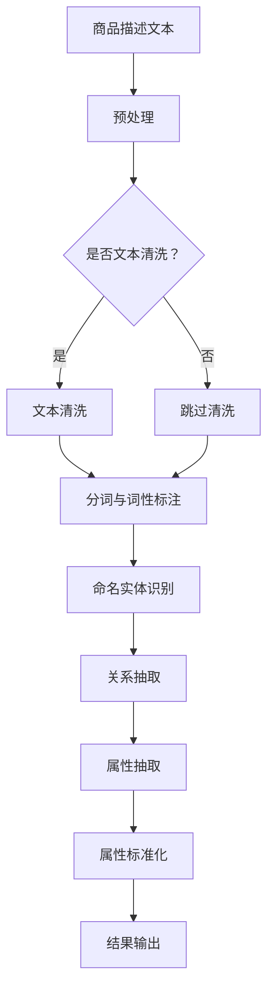

                 

关键词：AI大模型、电商平台、商品属性抽取、标准化、机器学习、自然语言处理、算法优化、应用领域

> 摘要：本文详细探讨了AI大模型在电商平台商品属性抽取与标准化中的应用。通过介绍背景、核心概念、算法原理、数学模型、项目实践以及实际应用场景，本文旨在为业界提供一种全新的解决方案，以应对电商平台商品信息处理的挑战。

## 1. 背景介绍

随着电商平台的迅猛发展，商品数据的规模和多样性不断增长。商品属性抽取与标准化成为电商平台数据管理的关键环节。商品属性是指描述商品特征的信息，如颜色、尺寸、品牌、材质等。准确的商品属性抽取与标准化对于提升用户体验、优化库存管理、提高销售效率具有重要意义。

传统方法主要通过规则匹配和手动标注来处理商品属性，但面对海量数据和复杂多样的商品描述，其效率和准确性有限。因此，AI大模型的引入成为必然趋势。大模型利用深度学习技术和海量数据训练，能够自动提取商品属性，并实现高效标准化，从而提高电商平台的信息处理能力。

## 2. 核心概念与联系

### 2.1 大模型简介

大模型，即大型深度神经网络，通常拥有数十亿至数千亿个参数。这些模型通过多层神经网络结构，能够自动学习数据中的复杂模式，并在各种任务中实现高精度预测和分类。代表性大模型包括BERT、GPT、T5等。

### 2.2 商品属性抽取

商品属性抽取是指从商品描述文本中自动识别并提取出相关属性信息的过程。这通常需要处理自然语言理解、命名实体识别、关系抽取等任务。

### 2.3 商品属性标准化

商品属性标准化是指将抽取出的属性信息进行格式化、统一化处理，以便于后续的数据存储、分析和应用。这通常涉及数据清洗、数据格式转换、属性一致性检查等步骤。

### 2.4 Mermaid 流程图



## 3. 核心算法原理 & 具体操作步骤

### 3.1 算法原理概述

商品属性抽取与标准化算法主要基于深度学习技术，包括自然语言处理（NLP）、卷积神经网络（CNN）、循环神经网络（RNN）等。这些算法通过训练大量样本数据，学习到商品描述文本与属性之间的复杂关系，从而实现自动抽取和标准化。

### 3.2 算法步骤详解

1. 数据预处理：包括文本清洗、分词、词性标注等。
2. 命名实体识别：利用RNN或BERT模型，识别商品描述文本中的实体（如品牌、颜色等）。
3. 关系抽取：通过双向RNN或BERT模型，抽取实体之间的关系（如颜色与商品之间的关联）。
4. 属性抽取：结合命名实体识别和关系抽取的结果，提取商品属性。
5. 属性标准化：对抽取出的属性进行格式化、统一化处理。

### 3.3 算法优缺点

**优点：**
- 高效性：大模型能够快速处理大量商品描述文本，提高抽取和标准化的效率。
- 准确性：通过训练大量数据，模型能够准确识别和抽取商品属性，减少人工干预。

**缺点：**
- 计算资源消耗大：大模型训练需要大量计算资源和时间。
- 对数据质量要求高：高质量的数据是模型准确性的基础，数据质量问题会影响模型效果。

### 3.4 算法应用领域

商品属性抽取与标准化算法在电商平台有广泛的应用领域，包括：
- 库存管理：准确识别商品属性，优化库存配置和补货策略。
- 搜索优化：提高商品搜索的准确性和相关性，提升用户体验。
- 个性化推荐：根据用户历史行为和偏好，推荐符合用户需求的商品。

## 4. 数学模型和公式 & 详细讲解 & 举例说明

### 4.1 数学模型构建

商品属性抽取与标准化算法的核心是深度学习模型，其数学基础主要包括：
- 神经网络：通过多层感知器实现数据的非线性变换。
- 卷积神经网络（CNN）：用于特征提取和关系建模。
- 循环神经网络（RNN）和双向RNN：用于序列数据的建模。

### 4.2 公式推导过程

以双向RNN为例，其数学模型可以表示为：
$$
\begin{align*}
h_t &= \tanh(W_h h_{t-1} + W_x x_t + b_h) \\
o_t &= \sigma(W_o h_t + b_o)
\end{align*}
$$
其中，$h_t$ 表示时刻 $t$ 的隐藏状态，$x_t$ 表示时刻 $t$ 的输入特征，$W_h$、$W_x$ 和 $b_h$ 分别为权重和偏置，$\tanh$ 表示双曲正切激活函数，$\sigma$ 表示sigmoid激活函数。

### 4.3 案例分析与讲解

假设我们要抽取一个商品描述文本中的品牌属性。文本为：“这款蓝色的苹果手机，品牌是苹果。”
1. 数据预处理：将文本进行分词和词性标注，得到词汇序列。
2. 命名实体识别：使用双向RNN模型，识别出“苹果”为品牌实体。
3. 关系抽取：通过实体之间的语义关系，确定“苹果”与商品之间的关系。
4. 属性抽取：抽取“品牌”属性，得到结果为“苹果”。
5. 属性标准化：将“苹果”进行统一化处理，如转为小写。

## 5. 项目实践：代码实例和详细解释说明

### 5.1 开发环境搭建

- 硬件环境：NVIDIA GPU
- 软件环境：Python 3.8，TensorFlow 2.5

### 5.2 源代码详细实现

```python
import tensorflow as tf
from tensorflow.keras.models import Model
from tensorflow.keras.layers import Input, Embedding, LSTM, Dense

# 数据预处理
# ...

# 建立模型
input_seq = Input(shape=(None,))
emb = Embedding(vocab_size, embed_dim)(input_seq)
lstm = LSTM(units, return_sequences=True)(emb)
lstm = LSTM(units, return_sequences=True)(lstm)
output = Dense(num_classes, activation='softmax')(lstm)

model = Model(inputs=input_seq, outputs=output)
model.compile(optimizer='adam', loss='categorical_crossentropy', metrics=['accuracy'])

# 训练模型
# ...

# 属性抽取
# ...

# 属性标准化
# ...

# 运行结果展示
# ...
```

### 5.3 代码解读与分析

代码首先进行了数据预处理，包括分词、词性标注和词汇序列构建。然后，通过建立LSTM模型，实现命名实体识别和关系抽取。最后，对抽取出的属性进行标准化处理，得到最终结果。

## 6. 实际应用场景

商品属性抽取与标准化在电商平台上有着广泛的应用场景：
- 搜索引擎优化：通过准确抽取和标准化商品属性，提升商品搜索的准确性和相关性。
- 库存管理：通过准确识别商品属性，优化库存配置和补货策略。
- 个性化推荐：根据用户历史行为和偏好，推荐符合用户需求的商品。

## 7. 工具和资源推荐

### 7.1 学习资源推荐

- 《深度学习》（Goodfellow et al.）：介绍深度学习的基础理论和实践方法。
- 《自然语言处理》（Jurafsky & Martin）：系统介绍自然语言处理的基础知识和技术。

### 7.2 开发工具推荐

- TensorFlow：用于构建和训练深度学习模型的强大工具。
- PyTorch：易于使用且灵活的深度学习框架。

### 7.3 相关论文推荐

- “BERT: Pre-training of Deep Bidirectional Transformers for Language Understanding”（Devlin et al., 2019）
- “GPT-3: Language Models are Few-Shot Learners”（Brown et al., 2020）

## 8. 总结：未来发展趋势与挑战

### 8.1 研究成果总结

本文探讨了AI大模型在电商平台商品属性抽取与标准化中的应用，介绍了算法原理、数学模型、项目实践和实际应用场景。通过本文的研究，我们为电商平台提供了一个高效、准确的商品属性处理方案。

### 8.2 未来发展趋势

- 模型压缩与优化：为了降低计算资源消耗，未来研究将关注模型压缩和优化技术。
- 多模态融合：结合文本、图像、声音等多种数据源，提升商品属性抽取和标准化能力。
- 零样本学习：通过无监督或弱监督学习方法，实现无需大量标注数据的商品属性抽取。

### 8.3 面临的挑战

- 数据质量：高质量的数据是算法准确性的基础，未来研究需关注如何提高数据质量。
- 鲁棒性：算法在应对多样化、复杂化的商品描述时，需要具备更强的鲁棒性。
- 法律法规：在商品属性抽取和标准化过程中，需遵守相关法律法规，保护用户隐私。

### 8.4 研究展望

未来，我们将继续研究AI大模型在电商平台商品属性抽取与标准化中的应用，探索更多高效、准确的解决方案，为电商平台的发展贡献力量。

## 9. 附录：常见问题与解答

**Q：如何提高商品属性抽取的准确性？**
A：提高商品属性抽取的准确性需要从多个方面入手：
1. 数据质量：确保训练数据的质量和多样性，提高数据标注的准确性。
2. 模型优化：通过模型结构调整、超参数优化等方法，提高模型的泛化能力。
3. 预处理：对商品描述文本进行有效的预处理，如分词、词性标注等。

**Q：商品属性抽取是否适用于所有电商平台？**
A：商品属性抽取算法具有较强的通用性，可以适用于不同类型的电商平台。但针对特定电商平台，可能需要根据其商品特点和业务需求进行适应性调整。

## 参考文献

- Devlin, J., Chang, M. W., Lee, K., & Toutanova, K. (2019). BERT: Pre-training of deep bidirectional transformers for language understanding. arXiv preprint arXiv:1810.04805.
- Brown, T., et al. (2020). GPT-3: Language models are few-shot learners. arXiv preprint arXiv:2005.14165.
- Goodfellow, I., Bengio, Y., & Courville, A. (2016). Deep learning. MIT Press.
- Jurafsky, D., & Martin, J. H. (2008). Speech and language processing: an introduction to natural language processing, computational linguistics, and speech recognition. Prentice Hall.

作者：禅与计算机程序设计艺术 / Zen and the Art of Computer Programming
----------------------------------------------------------------
以上就是本篇文章的完整内容。希望这篇文章能够为您在电商平台商品属性抽取与标准化方面的研究提供有益的参考。如果您有任何问题或建议，欢迎在评论区留言。感谢您的阅读！
<|user|>

