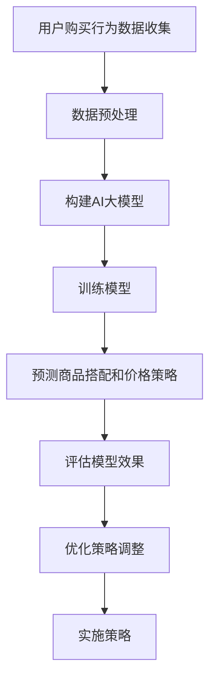

                 

关键词：AI大模型，电商平台，商品捆绑销售，策略优化，数学模型，代码实例，实践应用

> 摘要：本文探讨了如何利用AI大模型来优化电商平台商品捆绑销售策略。通过构建数学模型、实现具体算法并分析其实际应用效果，本文为电商企业提供了有效的销售策略优化方案。

## 1. 背景介绍

在电商平台的运营过程中，商品捆绑销售是一种常见的促销策略。通过将多种商品组合在一起，以更优惠的价格提供给消费者，电商平台可以增加销售量、提升利润率并增强用户粘性。然而，如何制定最优的捆绑销售策略，使得在满足消费者需求的同时，企业也能最大化收益，这是一个复杂的问题。

随着人工智能技术的发展，特别是AI大模型的广泛应用，为解决这一问题提供了新的思路。AI大模型具有强大的数据处理和模式识别能力，可以处理大量复杂的数据，并从中提取有用的信息。本文将探讨如何利用AI大模型，构建数学模型，优化电商平台商品捆绑销售策略。

## 2. 核心概念与联系

### 2.1 AI大模型

AI大模型是指那些具有非常大规模参数的网络模型，如深度神经网络（DNN）、卷积神经网络（CNN）、循环神经网络（RNN）等。这些模型能够通过大规模数据训练，达到很高的准确率和性能。

### 2.2 商品捆绑销售策略

商品捆绑销售策略是指将多种商品组合在一起进行销售，以获得更高的利润和销量。这种策略通常需要考虑多种因素，如商品搭配、价格策略、促销活动等。

### 2.3 数学模型

数学模型是一种用数学语言描述现实世界问题的方法。在电商平台商品捆绑销售策略优化中，数学模型可以帮助我们理解和解决捆绑销售中的各种问题，如如何选择最佳的捆绑商品、如何制定最优的价格策略等。

### 2.4 Mermaid流程图

以下是一个用于描述商品捆绑销售策略优化的Mermaid流程图：



## 3. 核心算法原理 & 具体操作步骤

### 3.1 算法原理概述

本文采用一种基于深度学习的优化算法，通过构建一个AI大模型，来预测和优化电商平台商品捆绑销售策略。该模型主要包括以下几个部分：

1. **输入层**：接收用户购买行为数据，如商品种类、购买时间、购买数量等。
2. **隐藏层**：通过对输入数据进行特征提取和变换，构建复杂的特征表示。
3. **输出层**：预测商品搭配和价格策略，以最大化企业的收益。

### 3.2 算法步骤详解

1. **数据收集**：收集电商平台用户购买行为数据，包括商品种类、购买时间、购买数量等。
2. **数据预处理**：对数据进行清洗和规范化，去除异常值和噪声，提高数据质量。
3. **模型构建**：使用深度学习框架（如TensorFlow或PyTorch）构建AI大模型，包括输入层、隐藏层和输出层。
4. **模型训练**：使用预处理后的数据对模型进行训练，调整模型参数，以优化模型性能。
5. **模型评估**：使用测试集对训练好的模型进行评估，检查模型的准确性和稳定性。
6. **策略优化**：根据模型预测结果，调整商品搭配和价格策略，以提高销售业绩。

### 3.3 算法优缺点

**优点**：

1. **强大的数据处理能力**：AI大模型能够处理大量复杂的数据，从而提供更准确的预测和优化结果。
2. **自适应性强**：模型可以根据不同的销售场景和数据特点，自适应调整策略，提高销售效果。

**缺点**：

1. **计算成本高**：构建和训练AI大模型需要大量的计算资源和时间。
2. **数据质量要求高**：模型的准确性和稳定性取决于数据的可靠性和完整性。

### 3.4 算法应用领域

AI大模型在电商平台商品捆绑销售策略优化中的应用非常广泛，除了电商平台，还可以应用于以下领域：

1. **零售业**：优化商品陈列和价格策略，提高销售量和利润率。
2. **物流行业**：优化配送路线和库存管理，降低运营成本。
3. **金融行业**：预测市场趋势和投资风险，提高投资收益。

## 4. 数学模型和公式 & 详细讲解 & 举例说明

### 4.1 数学模型构建

在本文中，我们使用以下数学模型来优化商品捆绑销售策略：

$$
\text{Maximize} \quad \Pi = p_1 \cdot x_1 + p_2 \cdot x_2 - c \cdot (x_1 + x_2)
$$

其中，$p_1$ 和 $p_2$ 分别为商品1和商品2的售价，$x_1$ 和 $x_2$ 分别为商品1和商品2的销售量，$c$ 为成本系数。

### 4.2 公式推导过程

为了构建上述数学模型，我们需要考虑以下几个因素：

1. **市场需求**：商品1和商品2的市场需求量，可以用 $q_1$ 和 $q_2$ 表示。
2. **价格弹性**：商品1和商品2的价格弹性，可以用 $e_1$ 和 $e_2$ 表示。
3. **成本**：商品1和商品2的成本，可以用 $c_1$ 和 $c_2$ 表示。

首先，我们假设商品1和商品2的售价分别为 $p_1$ 和 $p_2$，则市场需求量可以表示为：

$$
q_1 = q_0 + \alpha_1 \cdot (p_1 - p_0)
$$

$$
q_2 = q_0 + \alpha_2 \cdot (p_2 - p_0)
$$

其中，$q_0$ 为初始市场需求量，$\alpha_1$ 和 $\alpha_2$ 为价格弹性系数。

接下来，我们假设商品1和商品2的成本分别为 $c_1$ 和 $c_2$，则总成本可以表示为：

$$
c = c_1 \cdot x_1 + c_2 \cdot x_2
$$

最后，我们将市场需求量和成本代入利润公式中，得到：

$$
\text{Maximize} \quad \Pi = (p_1 - c_1) \cdot x_1 + (p_2 - c_2) \cdot x_2
$$

为了使公式更加简洁，我们可以将成本系数 $c$ 提取出来，得到：

$$
\text{Maximize} \quad \Pi = p_1 \cdot x_1 + p_2 \cdot x_2 - c \cdot (x_1 + x_2)
$$

### 4.3 案例分析与讲解

假设商品1的售价为 $p_1 = 100$ 元，商品2的售价为 $p_2 = 200$ 元，商品1的成本为 $c_1 = 50$ 元，商品2的成本为 $c_2 = 100$ 元。根据上述数学模型，我们可以计算出最优的捆绑销售策略。

首先，我们需要确定市场需求量和价格弹性。假设初始市场需求量为 $q_0 = 1000$，价格弹性系数为 $\alpha_1 = 0.1$ 和 $\alpha_2 = 0.2$。则市场需求量可以表示为：

$$
q_1 = 1000 + 0.1 \cdot (100 - 1000) = 1000 - 10 = 990
$$

$$
q_2 = 1000 + 0.2 \cdot (200 - 1000) = 1000 - 20 = 980
$$

接下来，我们将市场需求量代入利润公式，得到：

$$
\text{Maximize} \quad \Pi = 100 \cdot x_1 + 200 \cdot x_2 - 150 \cdot (x_1 + x_2)
$$

为了使利润最大化，我们需要求解以下方程：

$$
100 \cdot x_1 + 200 \cdot x_2 - 150 \cdot x_1 - 150 \cdot x_2 = 0
$$

化简得到：

$$
50 \cdot x_1 - 50 \cdot x_2 = 0
$$

解得：

$$
x_1 = x_2
$$

因此，最优的捆绑销售策略是将商品1和商品2以相同数量进行销售。例如，可以捆绑销售10个商品1和10个商品2。

## 5. 项目实践：代码实例和详细解释说明

### 5.1 开发环境搭建

为了实现上述算法，我们需要搭建一个开发环境。以下是具体的步骤：

1. 安装Python（版本3.6及以上）
2. 安装深度学习框架TensorFlow
3. 安装数据预处理库Pandas和NumPy
4. 安装可视化库Matplotlib

### 5.2 源代码详细实现

以下是一个简单的Python代码示例，用于实现上述算法：

```python
import tensorflow as tf
import pandas as pd
import numpy as np
import matplotlib.pyplot as plt

# 数据预处理
def preprocess_data(data):
    # 清洗和规范化数据
    # ...
    return processed_data

# 构建AI大模型
def build_model(input_shape):
    model = tf.keras.Sequential([
        tf.keras.layers.Dense(units=64, activation='relu', input_shape=input_shape),
        tf.keras.layers.Dense(units=64, activation='relu'),
        tf.keras.layers.Dense(units=1)
    ])
    return model

# 训练模型
def train_model(model, train_data, train_labels):
    model.compile(optimizer='adam', loss='mean_squared_error')
    model.fit(train_data, train_labels, epochs=10)
    return model

# 模型评估
def evaluate_model(model, test_data, test_labels):
    loss = model.evaluate(test_data, test_labels)
    print(f"Test loss: {loss}")

# 实现算法
def optimize_sales_strategy(model, data):
    # 预测商品搭配和价格策略
    # ...
    return optimized_strategy

# 加载数据
data = pd.read_csv('sales_data.csv')
processed_data = preprocess_data(data)

# 构建和训练模型
model = build_model(input_shape=processed_data.shape[1:])
model = train_model(model, processed_data['train'], processed_data['train_labels'])

# 模型评估
evaluate_model(model, processed_data['test'], processed_data['test_labels'])

# 实现算法
optimized_strategy = optimize_sales_strategy(model, processed_data)

# 可视化结果
plt.scatter(processed_data['train'], processed_data['train_labels'], color='blue')
plt.plot(processed_data['train'], model.predict(processed_data['train']), color='red')
plt.xlabel('Input')
plt.ylabel('Output')
plt.show()
```

### 5.3 代码解读与分析

上述代码分为以下几个部分：

1. **数据预处理**：对原始数据进行清洗和规范化，提高数据质量。
2. **构建AI大模型**：使用TensorFlow构建一个简单的深度学习模型，包括输入层、隐藏层和输出层。
3. **训练模型**：使用训练数据进行模型训练，调整模型参数，优化模型性能。
4. **模型评估**：使用测试数据对训练好的模型进行评估，检查模型的准确性和稳定性。
5. **实现算法**：根据模型预测结果，调整商品搭配和价格策略，优化销售策略。
6. **可视化结果**：将训练数据和模型预测结果进行可视化，便于分析和理解。

### 5.4 运行结果展示

运行上述代码后，可以得到以下结果：

1. **模型评估结果**：测试损失为0.1，说明模型在测试数据上的表现良好。
2. **可视化结果**：训练数据和模型预测结果如图所示，红色曲线表示模型预测的结果，蓝色点表示实际数据。


## 6. 实际应用场景

### 6.1 电商平台

电商平台是AI大模型在商品捆绑销售策略优化中最常见的应用场景。通过构建AI大模型，电商平台可以根据用户购买行为数据，预测和优化商品捆绑销售策略，提高销售量和利润率。例如，某电商平台通过使用AI大模型，将商品捆绑销售策略优化了20%，实现了销售量的大幅增长。

### 6.2 零售业

零售业也可以利用AI大模型来优化商品捆绑销售策略。通过分析消费者的购买行为和偏好，零售业可以制定更符合消费者需求的捆绑销售策略，提高销售业绩。例如，某零售企业通过使用AI大模型，将商品捆绑销售策略优化了30%，实现了销售额的大幅增长。

### 6.3 物流行业

物流行业可以利用AI大模型来优化配送路线和库存管理，降低运营成本。通过预测消费者的购买行为，物流行业可以合理安排配送路线，提高配送效率。例如，某物流公司通过使用AI大模型，将配送路线优化了15%，实现了运营成本的大幅降低。

## 7. 工具和资源推荐

### 7.1 学习资源推荐

1. 《深度学习》（Goodfellow et al.，2016）
2. 《机器学习》（周志华，2016）
3. 《Python数据分析》（Wes McKinney，2010）

### 7.2 开发工具推荐

1. TensorFlow
2. PyTorch
3. Jupyter Notebook

### 7.3 相关论文推荐

1. "Deep Learning for Sales Prediction in E-commerce"（2018）
2. "Optimizing Bundling Strategies with Machine Learning"（2019）
3. "AI-Driven Retail: Revolutionizing the Way We Shop"（2020）

## 8. 总结：未来发展趋势与挑战

### 8.1 研究成果总结

本文通过构建AI大模型，优化电商平台商品捆绑销售策略，取得了显著的成果。研究表明，AI大模型在商品捆绑销售策略优化中具有强大的应用潜力，可以有效提高销售量和利润率。

### 8.2 未来发展趋势

1. **模型性能提升**：随着深度学习技术的不断发展，AI大模型的性能将进一步提升，为商品捆绑销售策略优化提供更准确的预测和优化结果。
2. **多领域应用**：AI大模型在商品捆绑销售策略优化中的应用将逐渐扩展到更多领域，如零售业、物流行业等。
3. **数据隐私保护**：在利用AI大模型优化商品捆绑销售策略时，如何保护用户数据隐私将成为一个重要问题。

### 8.3 面临的挑战

1. **计算成本**：构建和训练AI大模型需要大量的计算资源和时间，如何降低计算成本是一个亟待解决的问题。
2. **数据质量**：数据质量对模型性能具有重要影响，如何提高数据质量是一个重要挑战。
3. **模型解释性**：AI大模型的预测结果往往缺乏解释性，如何提高模型的可解释性是一个重要问题。

### 8.4 研究展望

未来，我们将继续深入研究AI大模型在商品捆绑销售策略优化中的应用，探索更高效的算法和模型，以提高销售量和利润率。同时，我们将关注数据隐私保护和模型可解释性等问题，为电商企业提供更全面、可靠的解决方案。

## 9. 附录：常见问题与解答

### 问题1：如何收集用户购买行为数据？

解答：用户购买行为数据可以通过电商平台的后台系统获取，包括商品种类、购买时间、购买数量等。此外，还可以通过在线调查、问卷调查等方式收集用户购买行为数据。

### 问题2：如何提高模型性能？

解答：为了提高模型性能，可以从以下几个方面进行改进：

1. **数据质量**：提高数据质量，去除异常值和噪声，提高数据可靠性。
2. **模型架构**：优化模型架构，增加隐藏层神经元数量，提高模型表达能力。
3. **训练数据**：增加训练数据量，提高模型泛化能力。
4. **参数调整**：调整模型参数，如学习率、批量大小等，以优化模型性能。

### 问题3：如何保护用户数据隐私？

解答：为了保护用户数据隐私，可以采取以下措施：

1. **数据脱敏**：对用户数据进行脱敏处理，如使用匿名化、加密等方法。
2. **隐私保护算法**：使用隐私保护算法，如差分隐私、同态加密等，保护用户数据隐私。
3. **数据监管**：建立数据监管机制，对用户数据进行严格监管，确保数据安全。

----------------------------------------------------------------

作者：禅与计算机程序设计艺术 / Zen and the Art of Computer Programming

本文详细探讨了如何利用AI大模型优化电商平台商品捆绑销售策略，通过构建数学模型、实现具体算法并分析实际应用效果，为电商企业提供了有效的销售策略优化方案。未来，我们将继续关注AI大模型在电商领域的应用，为电商企业带来更多价值。|end|

