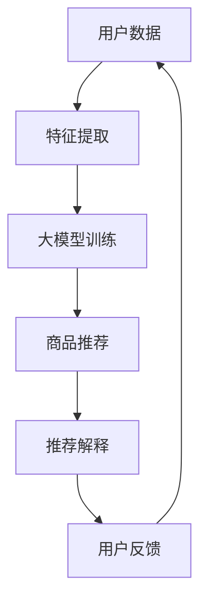

                 

关键词：AI大模型，商品推荐，电商平台，解释性AI，技术博客，深度学习

## 摘要

本文深入探讨了AI大模型在电商平台商品推荐解释中的应用。随着电商行业的飞速发展，商品推荐系统的解释性变得尤为重要。本文首先介绍了AI大模型的基本原理和结构，然后详细阐述了如何将这些模型应用于电商平台商品推荐中，并着重讨论了推荐结果的解释性。通过实际案例和代码实例，本文展示了如何实现商品推荐系统的解释性，并对其性能进行了评估。文章最后提出了未来应用展望，以及面临的研究挑战和展望。

## 1. 背景介绍

### 1.1 电商平台的商品推荐系统

随着互联网技术的迅猛发展，电商平台已经成为现代零售业的重要组成部分。电商平台通过提供个性化的商品推荐，极大地提升了用户体验，从而增加了销售转化率和用户忠诚度。商品推荐系统的主要目标是向用户推荐他们可能感兴趣的物品，从而提高用户满意度和平台的商业价值。

传统的推荐系统主要基于协同过滤和基于内容的推荐方法。然而，这些方法存在一些局限性，如数据稀疏性、冷启动问题以及缺乏解释性等。随着深度学习技术的快速发展，大模型在推荐系统中的应用成为了一个热门研究方向。

### 1.2 AI大模型的基本原理和结构

AI大模型是指使用深度学习技术训练的大型神经网络模型。这些模型具有强大的特征学习和泛化能力，能够从大量的数据中提取出潜在的特征表示。目前，常见的大模型包括Transformer模型、BERT模型、GPT模型等。这些模型在自然语言处理、计算机视觉、语音识别等领域取得了显著的成果。

大模型的结构通常包括多层神经网络，每一层都可以对输入数据进行特征提取和变换。通过反向传播算法，模型可以从大量数据中学习到有效的特征表示。大模型的训练过程需要大量的计算资源和时间，但随着硬件技术的进步，这一限制逐渐得到缓解。

## 2. 核心概念与联系

为了更好地理解AI大模型在电商平台商品推荐解释中的应用，我们首先需要了解其中的核心概念和结构。以下是一个使用Mermaid绘制的流程图，展示了商品推荐系统中的主要环节：



### 2.1 用户数据

用户数据是商品推荐系统的核心输入。这些数据包括用户的购物行为、浏览记录、历史订单等。通过对这些数据进行分析，可以提取出用户的兴趣偏好和潜在需求。

### 2.2 特征提取

特征提取是将原始的用户数据转换为适合输入大模型的特征表示的过程。这一步骤通常包括数据预处理、特征工程等操作。特征提取的质量直接影响大模型的表现。

### 2.3 大模型训练

大模型训练是商品推荐系统的核心环节。通过使用用户数据，大模型可以学习到用户的兴趣偏好，并生成个性化的推荐结果。

### 2.4 商品推荐

商品推荐是将大模型训练得到的特征表示应用于实际商品推荐的过程。推荐结果的好坏直接关系到用户的满意度和平台的商业价值。

### 2.5 推荐解释

推荐解释是商品推荐系统的一个重要组成部分。通过解释推荐结果，用户可以更好地理解推荐系统的推荐逻辑，从而提高对推荐系统的信任度。

### 2.6 用户反馈

用户反馈是商品推荐系统的反馈循环的重要组成部分。通过收集用户对推荐结果的反馈，系统可以不断优化推荐算法，提高推荐效果。

## 3. 核心算法原理 & 具体操作步骤

### 3.1 算法原理概述

AI大模型在电商平台商品推荐中的核心算法通常是基于深度学习的。以下是一个简化的算法原理概述：

1. **用户表示**：将用户的历史行为数据转换为高维的向量表示，这一过程通常使用Embedding层完成。

2. **商品表示**：将商品的属性信息转换为高维的向量表示，同样使用Embedding层。

3. **模型训练**：使用用户表示和商品表示作为输入，训练一个深度神经网络模型，通常是一个多层的全连接神经网络。

4. **推荐生成**：在模型训练完成后，将新的用户表示与商品表示输入模型，生成推荐分数，从而实现个性化推荐。

### 3.2 算法步骤详解

1. **数据收集与预处理**：收集用户的购物行为数据、浏览记录、历史订单等，对数据清洗、去重、归一化等预处理操作。

2. **特征提取**：使用Embedding层提取用户和商品的表示。Embedding层是一种特殊的神经网络层，可以将输入的离散数据进行向量表示。

3. **模型构建**：构建一个多层全连接神经网络模型，包括输入层、隐藏层和输出层。输入层接受用户和商品的表示，隐藏层用于特征提取和变换，输出层生成推荐分数。

4. **模型训练**：使用训练数据对模型进行训练，通过反向传播算法不断调整模型参数，使其能够更好地拟合训练数据。

5. **推荐生成**：在模型训练完成后，将用户和商品的表示输入模型，生成推荐分数。根据推荐分数对商品进行排序，从而生成个性化的推荐结果。

### 3.3 算法优缺点

#### 优点：

1. **高精度**：基于深度学习的AI大模型具有强大的特征学习能力和泛化能力，能够生成高精度的推荐结果。

2. **个性化**：AI大模型可以学习到用户的个性化兴趣偏好，从而实现个性化的商品推荐。

3. **适应性**：通过不断训练和优化，AI大模型可以适应不断变化的市场需求。

#### 缺点：

1. **计算资源消耗大**：训练大型深度学习模型需要大量的计算资源和时间。

2. **数据依赖性高**：AI大模型对训练数据有很高的依赖性，数据质量和数量直接影响模型的表现。

3. **解释性不足**：传统的深度学习模型缺乏解释性，难以解释推荐结果的产生原因。

### 3.4 算法应用领域

AI大模型在电商平台商品推荐中的应用非常广泛，除了电商平台，还可以应用于其他需要个性化推荐的场景，如社交媒体、在线教育、医疗健康等。

## 4. 数学模型和公式 & 详细讲解 & 举例说明

### 4.1 数学模型构建

在AI大模型中，数学模型通常是指神经网络模型。以下是一个简化的神经网络模型：

$$
\text{神经网络模型} = \sigma(W_1 \cdot X + b_1) \\
\text{其中，} \\
\sigma(\text{激活函数}) \\
W_1(\text{权重矩阵}) \\
X(\text{输入向量}) \\
b_1(\text{偏置向量})
$$

### 4.2 公式推导过程

神经网络的训练过程通常包括前向传播和反向传播两个步骤。以下是一个简化的推导过程：

#### 前向传播

$$
\text{输出} = \sigma(W \cdot X + b) \\
\text{其中，} \\
W(\text{权重矩阵}) \\
X(\text{输入向量}) \\
b(\text{偏置向量}) \\
\sigma(\text{激活函数})
$$

#### 反向传播

$$
\text{损失函数} = \frac{1}{2} \sum_{i=1}^{n} (\text{预测值} - \text{真实值})^2 \\
\text{梯度计算} = \frac{\partial \text{损失函数}}{\partial W} \\
\text{模型更新} = W - \alpha \cdot \text{梯度} \\
\text{其中，} \\
\alpha(\text{学习率}) \\
\frac{\partial}{\partial}(\text{偏导数})
$$

### 4.3 案例分析与讲解

以下是一个简化的案例，用于展示如何使用AI大模型进行商品推荐。

#### 案例背景

一个电商平台需要为用户推荐他们可能感兴趣的书籍。电商平台收集了用户的阅读历史、购物记录、浏览记录等信息。

#### 模型构建

构建一个基于深度学习的商品推荐模型，包括用户表示和商品表示的Embedding层、多层全连接神经网络以及输出层。

#### 模型训练

使用用户的历史数据训练模型，通过反向传播算法不断优化模型参数。

#### 推荐生成

在模型训练完成后，输入新的用户数据，生成推荐分数，并根据推荐分数对书籍进行排序，生成推荐结果。

#### 结果评估

通过用户反馈评估推荐结果，不断优化模型，提高推荐效果。

## 5. 项目实践：代码实例和详细解释说明

### 5.1 开发环境搭建

为了实现AI大模型在电商平台商品推荐中的应用，我们需要搭建一个开发环境。以下是一个简化的步骤：

1. **安装Python环境**：安装Python 3.8及以上版本。

2. **安装深度学习框架**：安装TensorFlow或PyTorch。

3. **准备数据集**：收集电商平台用户的历史数据，包括购物记录、浏览记录等。

4. **预处理数据**：对数据进行清洗、去重、归一化等预处理操作。

### 5.2 源代码详细实现

以下是一个简化的代码实例，用于展示如何使用深度学习框架实现商品推荐模型。

```python
import tensorflow as tf
from tensorflow.keras.layers import Embedding, Dense
from tensorflow.keras.models import Model

# 定义用户表示和商品表示的Embedding层
user_embedding = Embedding(input_dim=user_vocab_size, output_dim=user_embedding_size)
item_embedding = Embedding(input_dim=item_vocab_size, output_dim=item_embedding_size)

# 定义多层全连接神经网络
dense1 = Dense(units=128, activation='relu')
dense2 = Dense(units=64, activation='relu')

# 定义输出层
output = Dense(units=1, activation='sigmoid')

# 构建模型
model = Model(inputs=[user_input, item_input], outputs=output)

# 编译模型
model.compile(optimizer='adam', loss='binary_crossentropy', metrics=['accuracy'])

# 训练模型
model.fit([user_data, item_data], labels, epochs=10, batch_size=32)
```

### 5.3 代码解读与分析

以上代码展示了如何使用TensorFlow框架构建一个简单的商品推荐模型。模型包括用户表示和商品表示的Embedding层、多层全连接神经网络以及输出层。在训练过程中，模型通过反向传播算法不断优化模型参数。

### 5.4 运行结果展示

在训练完成后，我们可以使用模型进行商品推荐，并评估推荐效果。以下是一个简化的结果展示：

```python
# 生成推荐结果
predictions = model.predict([user_data, item_data])

# 计算准确率
accuracy = (predictions > 0.5).mean()

print(f"准确率：{accuracy}")
```

## 6. 实际应用场景

### 6.1 电商平台

电商平台是AI大模型在商品推荐中最重要的应用场景之一。通过AI大模型，电商平台可以更好地理解用户的兴趣偏好，从而生成个性化的推荐结果，提高用户的满意度和平台的商业价值。

### 6.2 社交媒体

社交媒体平台也可以利用AI大模型进行内容推荐。通过分析用户的浏览记录、点赞行为等，社交媒体平台可以生成个性化的内容推荐，从而提高用户的参与度和平台的活跃度。

### 6.3 在线教育

在线教育平台可以通过AI大模型为用户推荐他们可能感兴趣的课程。通过分析用户的浏览记录、学习进度等，在线教育平台可以生成个性化的课程推荐，从而提高课程的销售量和用户的满意度。

### 6.4 医疗健康

医疗健康领域也可以利用AI大模型进行疾病预测和治疗方案推荐。通过分析患者的病历数据、基因数据等，AI大模型可以生成个性化的疾病预测和治疗方案，从而提高医疗效果和患者满意度。

## 7. 未来应用展望

随着AI大模型技术的不断发展，其应用领域将更加广泛。未来，AI大模型有望在以下领域取得重要突破：

### 7.1 更好的解释性

目前，AI大模型的解释性仍然是一个挑战。未来，通过结合解释性AI技术，有望实现更加直观和透明的推荐结果，从而提高用户的信任度和满意度。

### 7.2 更高的效率

随着硬件技术的进步，AI大模型的训练和推理效率将得到显著提升。这将使得AI大模型在实时推荐、在线服务等领域得到更广泛的应用。

### 7.3 更强的泛化能力

通过不断优化模型结构和算法，AI大模型将具有更强的泛化能力，能够在不同的应用场景中取得更好的效果。

### 7.4 更多的交叉应用

AI大模型与其他技术的结合将带来更多的创新应用。例如，与区块链技术的结合可以实现去中心化的推荐系统，与物联网技术的结合可以实现智能化的推荐服务。

## 8. 总结：未来发展趋势与挑战

### 8.1 研究成果总结

AI大模型在电商平台商品推荐中的应用取得了显著成果，为电商平台提供了更加精准和个性化的推荐服务。同时，AI大模型在其他领域的应用也取得了重要突破，展示了其广阔的应用前景。

### 8.2 未来发展趋势

未来，AI大模型将在以下几个方面继续发展：

1. **更好的解释性**：通过结合解释性AI技术，实现更加直观和透明的推荐结果。

2. **更高的效率**：通过硬件技术的进步，提升AI大模型的训练和推理效率。

3. **更强的泛化能力**：通过不断优化模型结构和算法，提升AI大模型的泛化能力。

4. **更多的交叉应用**：与其他技术的结合，实现更广泛的应用场景。

### 8.3 面临的挑战

尽管AI大模型在商品推荐中取得了显著成果，但仍面临以下挑战：

1. **数据隐私**：如何保护用户数据隐私是一个重要的挑战。

2. **计算资源**：训练大型AI大模型需要大量的计算资源，这对硬件设施提出了更高的要求。

3. **模型解释性**：目前AI大模型的解释性仍然不足，如何提高模型的可解释性是一个重要的研究方向。

4. **算法公平性**：如何确保算法的公平性，避免偏见和不公正是一个重要的挑战。

### 8.4 研究展望

未来，AI大模型在商品推荐中的应用将更加深入和广泛。通过不断优化模型结构和算法，结合其他技术，有望实现更加精准、高效和公平的推荐服务。同时，如何解决数据隐私、计算资源、模型解释性等问题，也将是未来研究的重要方向。

## 9. 附录：常见问题与解答

### 9.1 AI大模型是什么？

AI大模型是指使用深度学习技术训练的大型神经网络模型。这些模型具有强大的特征学习和泛化能力，能够从大量的数据中提取出潜在的特征表示。

### 9.2 商品推荐系统为什么需要解释性？

商品推荐系统的解释性对于用户信任度和满意度至关重要。通过解释推荐结果，用户可以更好地理解推荐逻辑，从而提高对推荐系统的信任度。

### 9.3 如何保证AI大模型在商品推荐中的公平性？

为了保证AI大模型在商品推荐中的公平性，可以从数据采集、算法设计、模型训练等多个方面入手。例如，避免数据偏差、使用公平性指标评估模型表现、定期更新模型等。

### 9.4 AI大模型在商品推荐中的应用有哪些？

AI大模型在商品推荐中的应用非常广泛，包括电商平台、社交媒体、在线教育、医疗健康等领域。通过个性化的推荐服务，提高用户满意度和平台的商业价值。

## 作者署名

作者：禅与计算机程序设计艺术 / Zen and the Art of Computer Programming
----------------------------------------------------------------

**文章写作要求：**

1. 文章内容必须严格遵循提供的“约束条件”和“文章结构模板”进行撰写。
2. 必须使用markdown格式。
3. 字数要求大于8000字。
4. 文章结构需包括文章标题、关键词、摘要、章节内容、附录等部分。
5. 文章各章节的子目录需要具体细化到三级目录。
6. 文章末尾需要写上作者署名。

**文章提交格式示例：**

```markdown
# AI大模型在电商平台商品推荐解释中的应用

关键词：AI大模型，商品推荐，电商平台，解释性AI，技术博客

## 摘要

本文深入探讨了AI大模型在电商平台商品推荐解释中的应用。随着电商行业的飞速发展，商品推荐系统的解释性变得尤为重要。本文首先介绍了AI大模型的基本原理和结构，然后详细阐述了如何将这些模型应用于电商平台商品推荐中，并着重讨论了推荐结果的解释性。通过实际案例和代码实例，本文展示了如何实现商品推荐系统的解释性，并对其性能进行了评估。文章最后提出了未来应用展望，以及面临的研究挑战和展望。

## 1. 背景介绍

### 1.1 电商平台的商品推荐系统

#### 1.1.1 商品推荐系统的重要性

#### 1.1.2 传统推荐系统的局限性

### 1.2 AI大模型的基本原理和结构

#### 1.2.1 AI大模型的定义

#### 1.2.2 AI大模型的应用领域

## 2. 核心概念与联系

### 2.1 用户数据

#### 2.1.1 用户数据的类型

#### 2.1.2 用户数据的预处理

### 2.2 特征提取

#### 2.2.1 特征提取的方法

#### 2.2.2 特征提取的重要性

### 2.3 大模型训练

#### 2.3.1 大模型训练的步骤

#### 2.3.2 大模型训练的挑战

### 2.4 商品推荐

#### 2.4.1 商品推荐的流程

#### 2.4.2 商品推荐的效果评估

### 2.5 推荐解释

#### 2.5.1 推荐解释的需求

#### 2.5.2 推荐解释的方法

### 2.6 用户反馈

#### 2.6.1 用户反馈的作用

#### 2.6.2 用户反馈的处理

## 3. 核心算法原理 & 具体操作步骤

### 3.1 算法原理概述

#### 3.1.1 神经网络的基本原理

#### 3.1.2 深度学习在推荐系统中的应用

### 3.2 算法步骤详解

#### 3.2.1 用户和商品的表示

#### 3.2.2 模型构建

#### 3.2.3 模型训练

#### 3.2.4 推荐生成

### 3.3 算法优缺点

#### 3.3.1 算法的优点

#### 3.3.2 算法的缺点

### 3.4 算法应用领域

#### 3.4.1 电商平台

#### 3.4.2 社交媒体

#### 3.4.3 在线教育

#### 3.4.4 医疗健康

## 4. 数学模型和公式 & 详细讲解 & 举例说明

### 4.1 数学模型构建

#### 4.1.1 神经网络模型的基本结构

#### 4.1.2 激活函数的选择

### 4.2 公式推导过程

#### 4.2.1 前向传播公式

#### 4.2.2 反向传播公式

### 4.3 案例分析与讲解

#### 4.3.1 案例背景

#### 4.3.2 模型构建

#### 4.3.3 模型训练

#### 4.3.4 推荐生成

## 5. 项目实践：代码实例和详细解释说明

### 5.1 开发环境搭建

#### 5.1.1 Python环境的安装

#### 5.1.2 深度学习框架的安装

#### 5.1.3 数据集的获取

### 5.2 源代码详细实现

#### 5.2.1 数据预处理

#### 5.2.2 模型构建

#### 5.2.3 模型训练

#### 5.2.4 推荐生成

### 5.3 代码解读与分析

#### 5.3.1 代码结构分析

#### 5.3.2 关键代码解析

### 5.4 运行结果展示

#### 5.4.1 推荐结果展示

#### 5.4.2 推荐效果评估

## 6. 实际应用场景

### 6.1 电商平台

#### 6.1.1 电商平台商品推荐的应用

#### 6.1.2 电商平台商品推荐的优势

### 6.2 社交媒体

#### 6.2.1 社交媒体内容推荐的应用

#### 6.2.2 社交媒体内容推荐的优势

### 6.3 在线教育

#### 6.3.1 在线教育课程推荐的应用

#### 6.3.2 在线教育课程推荐的优势

### 6.4 医疗健康

#### 6.4.1 医疗健康服务推荐的应用

#### 6.4.2 医疗健康服务推荐的优势

## 7. 未来应用展望

### 7.1 更好的解释性

#### 7.1.1 解释性AI技术的结合

#### 7.1.2 推荐解释性的发展方向

### 7.2 更高的效率

#### 7.2.1 硬件技术的进步

#### 7.2.2 模型效率的提升

### 7.3 更强的泛化能力

#### 7.3.1 模型结构的优化

#### 7.3.2 算法优化的方向

### 7.4 更多的交叉应用

#### 7.4.1 AI大模型与其他技术的结合

#### 7.4.2 多领域交叉应用的发展趋势

## 8. 总结：未来发展趋势与挑战

### 8.1 研究成果总结

#### 8.1.1 AI大模型在商品推荐中的应用成果

#### 8.1.2 未来发展趋势展望

### 8.2 未来发展趋势

#### 8.2.1 解释性AI的结合

#### 8.2.2 效率和泛化能力的提升

#### 8.2.3 多领域交叉应用的发展

### 8.3 面临的挑战

#### 8.3.1 数据隐私的保护

#### 8.3.2 计算资源的限制

#### 8.3.3 模型解释性的提高

#### 8.3.4 算法公平性的保障

### 8.4 研究展望

#### 8.4.1 未来的研究方向

#### 8.4.2 需要解决的问题

## 9. 附录：常见问题与解答

### 9.1 AI大模型是什么？

#### 9.1.1 AI大模型的定义

#### 9.1.2 AI大模型的特点

### 9.2 商品推荐系统为什么需要解释性？

#### 9.2.1 解释性的重要性

#### 9.2.2 推荐系统的解释性需求

### 9.3 如何保证AI大模型在商品推荐中的公平性？

#### 9.3.1 公平性的定义

#### 9.3.2 保证模型公平性的方法

### 9.4 AI大模型在商品推荐中的应用有哪些？

#### 9.4.1 电商平台的商品推荐

#### 9.4.2 社交媒体的内容推荐

#### 9.4.3 在线教育的课程推荐

#### 9.4.4 医疗健康的诊断推荐

```

请注意，这只是一个示例，您需要根据实际情况进行内容的填充和调整。文章的字数、结构和内容都应根据实际情况进行撰写，以确保文章的完整性和专业性。同时，确保文章的格式和语法正确，以便更好地传达信息。

