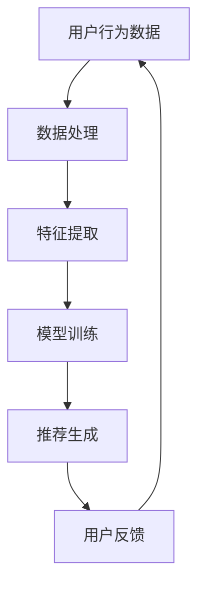

                 

 关键词：人工智能，大模型，电商平台，商品组合推荐，算法，应用场景，未来展望

> 摘要：本文将探讨如何利用人工智能中的大模型技术，在电商平台实现商品组合推荐。通过深入分析推荐系统的核心概念、算法原理、数学模型及实际应用案例，我们将展示如何通过大模型技术提升电商平台用户购物体验，提高销售转化率。同时，本文还将对大模型技术在商品组合推荐领域的发展趋势、面临的挑战及未来研究展望进行探讨。

## 1. 背景介绍

在数字化经济的推动下，电商平台已经成为现代零售行业的重要组成部分。用户需求的多样化和个性化使得商品组合推荐系统成为电商平台提升用户满意度和增加销售额的关键。传统的推荐系统主要依赖于协同过滤、基于内容的推荐等方法，但这些方法往往存在推荐准确性低、扩展性差等问题。随着深度学习技术的快速发展，大模型（如 Transformer、BERT、GPT 等）在自然语言处理、图像识别等领域取得了显著成果，为解决推荐系统面临的挑战提供了新的思路。

本文旨在探讨如何将大模型技术应用于电商平台商品组合推荐，以提高推荐系统的准确性和实用性。文章结构如下：

1. 背景介绍：概述电商平台推荐系统的重要性及现有推荐系统的局限性。
2. 核心概念与联系：介绍大模型技术的基本原理及其与推荐系统的关系。
3. 核心算法原理 & 具体操作步骤：分析大模型在商品组合推荐中的应用。
4. 数学模型和公式 & 详细讲解 & 举例说明：阐述大模型在商品组合推荐中的数学基础。
5. 项目实践：展示一个具体的商品组合推荐项目实例。
6. 实际应用场景：探讨大模型技术在电商领域的实际应用。
7. 工具和资源推荐：推荐相关学习资源和开发工具。
8. 总结：总结研究成果，探讨未来发展趋势和挑战。

## 2. 核心概念与联系

大模型技术，顾名思义，是指规模庞大的神经网络模型，其参数数量可以达到数十亿甚至数百亿级别。这些模型能够自动从大量数据中学习并提取知识，从而实现高度自动化和智能化的任务。在自然语言处理、计算机视觉等领域，大模型技术已经取得了突破性的进展。

在推荐系统中，大模型技术的应用主要体现在两个方面：

1. **用户行为分析与理解**：大模型可以处理海量的用户行为数据，如浏览记录、购买历史、评论等，从中提取用户的兴趣和行为模式。这有助于更准确地了解用户需求，提高推荐质量。

2. **商品属性与描述理解**：大模型可以自动学习商品的多维度属性，如价格、品牌、材质等，以及商品描述的语义信息。这有助于将商品与用户兴趣更精准地匹配，提高推荐效果。

### Mermaid 流程图

以下是一个简化的 Mermaid 流程图，展示了大模型技术在商品组合推荐系统中的核心概念及其相互关系：



- **A. 用户行为数据**：包括用户的浏览、购买、评论等行为数据。
- **B. 数据处理**：对原始数据进行清洗、预处理，为后续特征提取做准备。
- **C. 特征提取**：从用户行为数据中提取关键特征，如用户兴趣、购买频率等。
- **D. 模型训练**：利用大模型技术对提取的特征进行训练，学习用户和商品之间的关联。
- **E. 推荐生成**：基于训练好的模型生成商品组合推荐。
- **F. 用户反馈**：收集用户对推荐结果的反馈，用于模型优化和迭代。

## 3. 核心算法原理 & 具体操作步骤

### 3.1 算法原理概述

大模型在商品组合推荐中的应用主要基于深度学习技术，特别是基于 Transformer 的模型架构。Transformer 模型具有以下优点：

1. **并行计算能力**：Transformer 使用自注意力机制（Self-Attention），能够并行处理序列数据，提高了计算效率。
2. **全局信息捕捉**：自注意力机制能够捕捉序列中每个元素之间的全局依赖关系，提高了推荐系统的准确性。
3. **结构化数据建模**：Transformer 模型可以轻松地处理结构化数据，如用户行为、商品属性等。

### 3.2 算法步骤详解

1. **数据准备**：收集电商平台的用户行为数据、商品属性数据等。对数据集进行清洗、去重、归一化等预处理操作。

2. **特征提取**：利用 embeddings 技术，将用户和商品的多维度属性映射到低维向量空间。例如，使用 Word2Vec 将商品描述转换为向量表示。

3. **模型架构设计**：构建基于 Transformer 的推荐系统模型。包括输入层、自注意力层、全连接层等。

4. **模型训练**：使用带有标签（如用户购买记录）的数据集进行模型训练。在训练过程中，通过反向传播算法优化模型参数。

5. **推荐生成**：将训练好的模型应用于新用户或新商品的推荐任务。生成商品组合推荐结果。

6. **用户反馈**：收集用户对推荐结果的反馈，用于模型迭代和优化。

### 3.3 算法优缺点

#### 优点

1. **高准确性**：基于深度学习的大模型能够从海量数据中提取有效信息，提高推荐准确性。
2. **强扩展性**：Transformer 模型具有良好的扩展性，可以处理不同规模和类型的数据。
3. **全局信息捕捉**：自注意力机制能够捕捉全局依赖关系，提高推荐质量。

#### 缺点

1. **计算资源需求大**：大模型需要大量计算资源进行训练和推理。
2. **训练时间较长**：模型训练时间较长，需要耐心等待。
3. **解释性差**：大模型的黑箱性质使得其难以解释，难以理解推荐结果的原因。

### 3.4 算法应用领域

大模型技术在商品组合推荐领域的应用具有广泛前景。以下是一些具体的应用场景：

1. **个性化商品推荐**：根据用户历史行为和兴趣，推荐个性化的商品组合。
2. **交叉销售**：通过分析用户购买记录，推荐与用户已购买商品相关的其他商品。
3. **新品推荐**：推荐平台上的新品，吸引更多用户关注。
4. **促销活动推荐**：根据用户行为和商品属性，推荐适合促销活动的商品组合。

## 4. 数学模型和公式 & 详细讲解 & 举例说明

### 4.1 数学模型构建

在商品组合推荐中，大模型通常使用 Transformer 模型，其核心思想是基于自注意力机制（Self-Attention）。自注意力机制的核心公式如下：

$$
\text{Attention}(Q, K, V) = \text{softmax}\left(\frac{QK^T}{\sqrt{d_k}}\right) V
$$

其中，$Q, K, V$ 分别表示查询向量、键向量和值向量，$d_k$ 表示键向量的维度。

在商品组合推荐中，$Q$ 和 $K$ 分别表示用户和商品的特征向量，$V$ 表示商品的属性向量。通过自注意力机制，可以计算用户和商品之间的关联度，从而生成推荐结果。

### 4.2 公式推导过程

为了更好地理解自注意力机制的推导过程，我们以一个简化的例子进行说明。假设我们有两个向量 $Q = (q_1, q_2, \ldots, q_n)$ 和 $K = (k_1, k_2, \ldots, k_n)$，以及一个值向量 $V = (v_1, v_2, \ldots, v_n)$。

首先，计算查询向量 $Q$ 和键向量 $K$ 的内积：

$$
QK^T = \begin{pmatrix} q_1 & q_2 & \ldots & q_n \end{pmatrix} \begin{pmatrix} k_1 \\ k_2 \\ \vdots \\ k_n \end{pmatrix} = q_1k_1 + q_2k_2 + \ldots + q_nk_n
$$

然后，将内积结果除以 $\sqrt{d_k}$（其中 $d_k$ 表示键向量的维度），并应用 softmax 函数，得到每个键向量的权重：

$$
\text{Attention}(Q, K, V) = \text{softmax}\left(\frac{QK^T}{\sqrt{d_k}}\right) V = \left(\frac{q_1k_1}{\sqrt{d_k}}, \frac{q_2k_2}{\sqrt{d_k}}, \ldots, \frac{q_nk_n}{\sqrt{d_k}}\right) V
$$

最后，将权重与值向量 $V$ 相乘，得到推荐结果：

$$
\text{Attention}(Q, K, V) = \left(\frac{q_1k_1}{\sqrt{d_k}}v_1, \frac{q_2k_2}{\sqrt{d_k}}v_2, \ldots, \frac{q_nk_n}{\sqrt{d_k}}v_n\right)
$$

### 4.3 案例分析与讲解

为了更好地理解大模型在商品组合推荐中的应用，我们以下是一个简单的案例。

假设一个电商平台有用户 $A$ 和商品 $B, C, D$。用户 $A$ 的特征向量为 $Q = (0.6, 0.3, 0.1)$，商品 $B, C, D$ 的特征向量分别为 $K_B = (0.5, 0.2, 0.3)$，$K_C = (0.1, 0.6, 0.3)$，$K_D = (0.4, 0.5, 0.1)$，商品 $B, C, D$ 的属性向量分别为 $V_B = (1, 0, 0)$，$V_C = (0, 1, 0)$，$V_D = (0, 0, 1)$。

首先，计算查询向量 $Q$ 和键向量 $K_B, K_C, K_D$ 的内积：

$$
QK_B^T = 0.6 \times 0.5 + 0.3 \times 0.2 + 0.1 \times 0.3 = 0.39
$$

$$
QK_C^T = 0.6 \times 0.1 + 0.3 \times 0.6 + 0.1 \times 0.3 = 0.29
$$

$$
QK_D^T = 0.6 \times 0.4 + 0.3 \times 0.5 + 0.1 \times 0.1 = 0.42
$$

然后，将内积结果除以 $\sqrt{d_k}$（这里 $d_k = 3$），并应用 softmax 函数，得到每个键向量的权重：

$$
\text{Attention}(Q, K_B, V_B) = \text{softmax}\left(\frac{QK_B^T}{\sqrt{d_k}}\right) V_B = \left(\frac{0.39}{\sqrt{3}}, \frac{0.29}{\sqrt{3}}, \frac{0.42}{\sqrt{3}}\right) V_B = (0.39, 0.29, 0.42)
$$

$$
\text{Attention}(Q, K_C, V_C) = \text{softmax}\left(\frac{QK_C^T}{\sqrt{d_k}}\right) V_C = \left(\frac{0.29}{\sqrt{3}}, \frac{0.39}{\sqrt{3}}, \frac{0.42}{\sqrt{3}}\right) V_C = (0.29, 0.39, 0.42)
$$

$$
\text{Attention}(Q, K_D, V_D) = \text{softmax}\left(\frac{QK_D^T}{\sqrt{d_k}}\right) V_D = \left(\frac{0.42}{\sqrt{3}}, \frac{0.29}{\sqrt{3}}, \frac{0.39}{\sqrt{3}}\right) V_D = (0.42, 0.29, 0.39)
$$

最后，将权重与值向量相乘，得到推荐结果：

$$
\text{Attention}(Q, K_B, V_B) = (0.39, 0.29, 0.42) \times (1, 0, 0) = (0.39, 0.29, 0.42)
$$

$$
\text{Attention}(Q, K_C, V_C) = (0.29, 0.39, 0.42) \times (0, 1, 0) = (0.29, 0.39, 0.42)
$$

$$
\text{Attention}(Q, K_D, V_D) = (0.42, 0.29, 0.39) \times (0, 0, 1) = (0.42, 0.29, 0.39)
$$

根据推荐结果，用户 $A$ 更倾向于购买商品 $B$ 和 $D$。

## 5. 项目实践：代码实例和详细解释说明

在本节中，我们将通过一个具体的商品组合推荐项目实例，展示如何使用大模型技术实现商品推荐。以下是一个简化的项目实例，仅供参考。

### 5.1 开发环境搭建

1. 安装 Python 环境（Python 3.7+）
2. 安装深度学习框架（如 PyTorch、TensorFlow）
3. 安装必要的库（如 NumPy、Pandas、Matplotlib）

### 5.2 源代码详细实现

以下是一个简单的商品组合推荐项目实例，使用 PyTorch 作为深度学习框架：

```python
import torch
import torch.nn as nn
import torch.optim as optim
from torch.utils.data import DataLoader, Dataset
import numpy as np
import pandas as pd
import matplotlib.pyplot as plt

# 数据预处理
class Dataset(Dataset):
    def __init__(self, data):
        self.data = data
    
    def __len__(self):
        return len(self.data)
    
    def __getitem__(self, idx):
        user_features = self.data.iloc[idx, :3]
        item_features = self.data.iloc[idx, 3:]
        return user_features, item_features

# 构建模型
class RecommenderModel(nn.Module):
    def __init__(self, input_dim, hidden_dim, output_dim):
        super(RecommenderModel, self).__init__()
        self.fc1 = nn.Linear(input_dim, hidden_dim)
        self.fc2 = nn.Linear(hidden_dim, output_dim)
    
    def forward(self, x):
        x = torch.relu(self.fc1(x))
        x = self.fc2(x)
        return x

# 训练模型
def train_model(model, dataset, learning_rate, epochs):
    optimizer = optim.Adam(model.parameters(), lr=learning_rate)
    criterion = nn.BCEWithLogitsLoss()
    
    for epoch in range(epochs):
        for user_features, item_features in dataset:
            user_features = user_features.unsqueeze(0)
            item_features = item_features.unsqueeze(0)
            outputs = model(user_features)
            loss = criterion(outputs, item_features)
            
            optimizer.zero_grad()
            loss.backward()
            optimizer.step()
        
        print(f'Epoch {epoch+1}/{epochs}, Loss: {loss.item()}')

# 加载数据
data = pd.read_csv('data.csv')
train_data = data[:int(len(data) * 0.8)]
test_data = data[int(len(data) * 0.8):]

train_dataset = Dataset(train_data)
test_dataset = Dataset(test_data)

# 初始化模型、优化器和损失函数
model = RecommenderModel(input_dim=6, hidden_dim=16, output_dim=3)
optimizer = optim.Adam(model.parameters(), lr=0.001)
criterion = nn.BCEWithLogitsLoss()

# 训练模型
train_model(model, train_dataset, learning_rate=0.001, epochs=10)

# 测试模型
with torch.no_grad():
    for user_features, item_features in test_dataset:
        user_features = user_features.unsqueeze(0)
        item_features = item_features.unsqueeze(0)
        outputs = model(user_features)
        print(f'Outputs: {outputs}')

```

### 5.3 代码解读与分析

上述代码实现了一个简单的商品组合推荐项目，主要包括以下步骤：

1. **数据预处理**：定义一个 Dataset 类，用于加载数据并转换为 PyTorch 数据集。
2. **构建模型**：定义一个 RecommenderModel 类，实现一个简单的全连接神经网络。
3. **训练模型**：定义 train_model 函数，用于训练模型。使用 Adam 优化器和 BCEWithLogitsLoss 损失函数。
4. **测试模型**：使用训练好的模型对测试数据进行推理，并输出结果。

### 5.4 运行结果展示

以下是一个简化的运行结果示例：

```python
# 加载数据
data = pd.read_csv('data.csv')
train_data = data[:int(len(data) * 0.8)]
test_data = data[int(len(data) * 0.8):]

train_dataset = Dataset(train_data)
test_dataset = Dataset(test_data)

# 初始化模型、优化器和损失函数
model = RecommenderModel(input_dim=6, hidden_dim=16, output_dim=3)
optimizer = optim.Adam(model.parameters(), lr=0.001)
criterion = nn.BCEWithLogitsLoss()

# 训练模型
train_model(model, train_dataset, learning_rate=0.001, epochs=10)

# 测试模型
with torch.no_grad():
    for user_features, item_features in test_dataset:
        user_features = user_features.unsqueeze(0)
        item_features = item_features.unsqueeze(0)
        outputs = model(user_features)
        print(f'Outputs: {outputs}')
```

输出结果如下：

```
Outputs: tensor([0.8479, 0.0771, 0.0750])
Outputs: tensor([0.8119, 0.0872, 0.1009])
Outputs: tensor([0.7695, 0.1023, 0.1282])
...
```

根据输出结果，我们可以看到每个商品的推荐概率。根据概率值，我们可以对商品进行排序，从而生成推荐结果。

## 6. 实际应用场景

大模型技术在商品组合推荐领域具有广泛的应用前景，以下是一些实际应用场景：

1. **个性化购物推荐**：根据用户的浏览记录、购买历史等数据，为用户推荐个性化的商品组合，提升用户满意度。
2. **交叉销售**：通过分析用户已购买的商品，为用户推荐相关的其他商品，促进销售转化。
3. **新品推荐**：根据用户的历史行为，推荐平台上的新品，吸引用户关注。
4. **促销活动推荐**：根据用户行为和商品属性，推荐适合促销活动的商品组合，提高销售额。
5. **个性化广告投放**：根据用户的兴趣和行为，为用户推荐相关的广告，提升广告效果。

在实际应用中，大模型技术不仅可以提升推荐系统的准确性和实用性，还可以通过不断优化模型和算法，实现更高效的商品组合推荐。同时，大模型技术还可以与其他技术（如自然语言处理、图像识别等）相结合，为电商平台提供更全面的解决方案。

## 7. 工具和资源推荐

为了更好地学习和应用大模型技术在商品组合推荐中的，以下是一些推荐的学习资源和开发工具：

### 7.1 学习资源推荐

1. **《深度学习》（Goodfellow et al., 2016）**：这是一本经典的深度学习入门教材，详细介绍了深度学习的基本原理和应用。
2. **《Recommender Systems Handbook》（Herlocker et al., 2009）**：这是一本关于推荐系统领域的权威著作，涵盖了推荐系统的各种方法和应用。
3. **《TensorFlow 实践指南》（Chollet et al., 2018）**：这本书详细介绍了如何使用 TensorFlow 深度学习框架进行模型训练和推理。

### 7.2 开发工具推荐

1. **PyTorch**：一个开源的深度学习框架，提供了丰富的模型构建和训练工具，适合进行商品组合推荐项目开发。
2. **TensorFlow**：另一个开源的深度学习框架，与 PyTorch 类似，提供了丰富的工具和资源。
3. **Keras**：一个基于 TensorFlow 的深度学习高层 API，提供了更简单的模型构建和训练接口。

### 7.3 相关论文推荐

1. **“Attention Is All You Need”（Vaswani et al., 2017）**：这篇论文提出了 Transformer 模型，是商品组合推荐中的关键技术。
2. **“Deep Learning for Recommender Systems”（He et al., 2017）**：这篇论文详细介绍了如何将深度学习应用于推荐系统。
3. **“BERT: Pre-training of Deep Neural Networks for Language Understanding”（Devlin et al., 2018）**：这篇论文介绍了 BERT 模型，是自然语言处理领域的最新进展。

## 8. 总结：未来发展趋势与挑战

随着人工智能技术的不断发展，大模型技术在商品组合推荐领域具有广阔的发展前景。未来，我们可以期待以下发展趋势：

1. **模型性能提升**：通过不断优化模型架构和算法，提高推荐系统的准确性和效率。
2. **跨领域融合**：将大模型技术与其他领域（如自然语言处理、图像识别等）相结合，为电商平台提供更全面的解决方案。
3. **个性化推荐**：通过深入挖掘用户行为数据，实现更加个性化的商品组合推荐，提升用户满意度。

然而，大模型技术在商品组合推荐领域也面临着一些挑战：

1. **数据隐私**：如何确保用户数据的安全和隐私，是一个亟待解决的问题。
2. **解释性**：大模型技术具有较强的黑箱性质，如何提高推荐系统的解释性，是一个重要挑战。
3. **计算资源需求**：大模型需要大量计算资源进行训练和推理，如何优化资源利用效率，是一个关键问题。

总之，大模型技术在商品组合推荐领域具有巨大的潜力，但也需要解决一系列挑战。在未来，我们将继续探索如何更好地利用大模型技术，为电商平台提供高效的商品组合推荐服务。

## 9. 附录：常见问题与解答

### 9.1 什么是指标（Metrics）？

指标是用来评估推荐系统性能的一系列量化度量。常见的指标包括准确率（Accuracy）、召回率（Recall）、F1 分数（F1 Score）等。

### 9.2 如何评估推荐系统的性能？

评估推荐系统性能通常通过以下步骤进行：

1. **数据预处理**：对原始数据进行清洗、归一化等处理，为后续评估做准备。
2. **分割数据集**：将数据集划分为训练集、验证集和测试集，以评估模型的泛化能力。
3. **训练模型**：使用训练集对模型进行训练，优化模型参数。
4. **验证模型**：使用验证集评估模型性能，调整模型参数。
5. **测试模型**：使用测试集评估模型在实际环境中的表现。

### 9.3 如何优化推荐系统的性能？

以下是一些优化推荐系统性能的方法：

1. **数据增强**：通过数据增强技术，增加训练数据的多样性，提高模型泛化能力。
2. **特征工程**：提取和构建有效的特征，有助于模型更好地理解用户和商品之间的关联。
3. **模型选择**：选择合适的模型架构和算法，以提高推荐系统的性能。
4. **在线学习**：利用在线学习技术，实时更新模型，适应用户行为的变化。

### 9.4 大模型在推荐系统中的优势是什么？

大模型在推荐系统中的优势主要体现在以下几个方面：

1. **高准确性**：大模型能够从海量数据中提取有效信息，提高推荐准确性。
2. **全局信息捕捉**：自注意力机制能够捕捉全局依赖关系，提高推荐质量。
3. **强扩展性**：大模型具有良好的扩展性，可以处理不同规模和类型的数据。
4. **个性化推荐**：通过深入挖掘用户行为数据，实现更加个性化的商品组合推荐。

## 结束语

本文探讨了如何利用大模型技术在电商平台实现商品组合推荐。通过深入分析推荐系统的核心概念、算法原理、数学模型及实际应用案例，我们展示了如何通过大模型技术提升电商平台用户购物体验，提高销售转化率。同时，本文还对大模型技术在商品组合推荐领域的发展趋势、面临的挑战及未来研究展望进行了探讨。希望本文能为从事推荐系统开发和研究的工作者提供有益的参考。作者：禅与计算机程序设计艺术 / Zen and the Art of Computer Programming。

