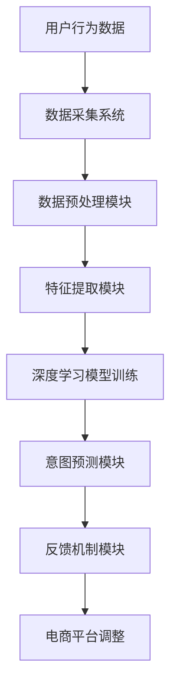

                 

关键词：AI大模型、电商平台、用户意图、实时追踪、算法原理、数学模型、项目实践、应用场景

> 摘要：本文探讨了AI大模型在电商平台用户意图实时追踪中的应用，分析了其核心概念与联系，深入讲解了核心算法原理、具体操作步骤以及数学模型和公式。同时，通过项目实践展示了代码实例和详细解释说明，并对实际应用场景和未来应用展望进行了讨论。最后，推荐了相关学习资源和开发工具，总结了未来发展趋势与挑战。

## 1. 背景介绍

随着互联网和电子商务的快速发展，电商平台已经成为消费者购买商品的主要渠道。然而，如何在海量用户数据中准确捕捉用户的意图，为用户提供个性化的服务，成为电商企业亟待解决的问题。传统的基于规则的方法和简单的机器学习模型已经难以满足日益复杂的用户需求。因此，AI大模型的应用逐渐成为电商平台提升用户体验、提高转化率的关键技术。

AI大模型，特别是深度学习模型，具有强大的表征能力和学习能力。通过大规模数据的训练，AI大模型能够捕捉用户的兴趣和行为模式，实现对用户意图的准确预测和实时追踪。电商平台利用AI大模型，可以提供更加个性化的商品推荐、智能客服和广告投放服务，从而提高用户满意度和转化率。

本文旨在探讨AI大模型在电商平台用户意图实时追踪中的应用，通过分析核心概念与联系，深入讲解核心算法原理、具体操作步骤和数学模型，并结合项目实践进行代码实例和详细解释说明。此外，本文还将讨论实际应用场景和未来应用展望，推荐相关学习资源和开发工具，并对未来发展趋势和挑战进行总结。

## 2. 核心概念与联系

### 2.1 AI大模型

AI大模型是指利用深度学习技术训练的大规模神经网络模型。这些模型通常由数十万甚至数百万个参数组成，能够自动从数据中学习特征表示和预测规律。AI大模型具有以下特点：

1. **强大的表征能力**：通过多层神经网络，AI大模型能够捕捉数据中的复杂模式和特征。
2. **自适应能力**：AI大模型能够根据不同场景和数据集进行调整和优化，提高预测准确性。
3. **高效率**：AI大模型能够快速处理海量数据，实现实时预测。

### 2.2 电商平台用户意图

用户意图是指用户在电商平台上的行为动机和目标。用户意图可以分为以下几类：

1. **购买意图**：用户明确打算购买某种商品。
2. **浏览意图**：用户在寻找但不打算立即购买的商品。
3. **咨询意图**：用户希望获取关于商品或服务的更多信息。
4. **评价意图**：用户对购买后的商品或服务进行评价。

### 2.3 实时追踪

实时追踪是指在用户行为发生时立即进行监测和记录，以便及时捕捉用户的意图和反馈。实时追踪的关键技术包括：

1. **数据采集**：通过用户行为日志、点击事件等途径收集用户数据。
2. **数据处理**：对采集到的数据进行清洗、转换和预处理，以便进行后续分析。
3. **实时分析**：利用AI大模型对用户数据进行实时分析，预测用户的意图和需求。
4. **反馈机制**：根据预测结果调整电商平台的推荐、客服和广告策略，提高用户体验。

### 2.4 Mermaid 流程图

下面是一个Mermaid流程图，展示了AI大模型在电商平台用户意图实时追踪中的应用架构：



## 3. 核心算法原理 & 具体操作步骤

### 3.1 算法原理概述

AI大模型在电商平台用户意图实时追踪中的应用主要基于深度学习技术。深度学习模型通过多层神经网络对用户行为数据进行分析和建模，从而实现对用户意图的预测。具体原理如下：

1. **输入层**：接收用户行为数据，如点击事件、浏览历史等。
2. **隐藏层**：对输入数据进行特征提取和变换，提取出用户行为的潜在特征。
3. **输出层**：根据隐藏层提取的特征，输出用户意图的预测结果。
4. **损失函数**：用于评估模型预测结果与实际结果之间的差距，指导模型训练。
5. **优化算法**：通过优化算法调整模型参数，使模型预测结果更加准确。

### 3.2 算法步骤详解

以下是AI大模型在电商平台用户意图实时追踪中的具体操作步骤：

1. **数据收集**：收集用户在电商平台上的行为数据，包括点击事件、浏览历史、购买记录等。
2. **数据预处理**：对收集到的数据进行清洗、去噪、填充缺失值等预处理操作。
3. **特征提取**：利用深度学习模型对预处理后的数据进行特征提取，提取出用户行为的潜在特征。
4. **模型训练**：使用训练数据集对深度学习模型进行训练，调整模型参数，优化模型性能。
5. **模型评估**：使用测试数据集对训练好的模型进行评估，计算模型预测准确率、召回率等指标。
6. **实时预测**：利用训练好的模型对用户实时行为进行预测，输出用户意图。
7. **反馈调整**：根据预测结果调整电商平台的推荐、客服和广告策略，提高用户体验。

### 3.3 算法优缺点

AI大模型在电商平台用户意图实时追踪中具有以下优点：

1. **高效性**：深度学习模型能够快速处理海量数据，实现实时预测。
2. **准确性**：通过大规模数据训练，AI大模型能够捕捉用户行为的复杂模式和特征，提高预测准确性。
3. **自适应能力**：AI大模型能够根据不同场景和数据集进行调整和优化，提高预测性能。

然而，AI大模型也存在一些缺点：

1. **计算资源需求高**：深度学习模型需要大量计算资源和存储空间，对硬件设备要求较高。
2. **训练时间较长**：深度学习模型的训练时间较长，特别是在大规模数据集上训练时。

### 3.4 算法应用领域

AI大模型在电商平台用户意图实时追踪中的应用不仅限于电商平台，还可以扩展到其他领域：

1. **在线广告投放**：通过实时追踪用户意图，精准投放广告，提高广告转化率。
2. **推荐系统**：根据用户意图实时推荐相关商品或内容，提高用户满意度。
3. **智能客服**：通过实时预测用户意图，提供个性化的客服服务，提高客户满意度。
4. **金融风控**：实时监测用户行为，预测用户的风险偏好和风险等级，提高风控效果。

## 4. 数学模型和公式 & 详细讲解 & 举例说明

### 4.1 数学模型构建

在AI大模型中，常用的数学模型包括深度神经网络和损失函数。以下是一个简单的深度神经网络模型及其损失函数的构建过程：

#### 深度神经网络模型

假设一个简单的三层神经网络，包括输入层、隐藏层和输出层。设输入层有m个神经元，隐藏层有n个神经元，输出层有p个神经元。神经网络的输入和输出可以通过以下公式表示：

$$
x_i^{(1)} = x_i, \quad i=1,2,\ldots,m
$$

$$
z_j^{(2)} = \sum_{i=1}^{m} w_{ij}^{(2)} x_i^{(1)} + b_j^{(2)}, \quad j=1,2,\ldots,n
$$

$$
a_j^{(2)} = \sigma(z_j^{(2)}), \quad j=1,2,\ldots,n
$$

$$
z_k^{(3)} = \sum_{j=1}^{n} w_{jk}^{(3)} a_j^{(2)} + b_k^{(3)}, \quad k=1,2,\ldots,p
$$

$$
a_k^{(3)} = \sigma(z_k^{(3)}), \quad k=1,2,\ldots,p
$$

其中，$x_i^{(1)}$为第i个输入神经元的活动，$z_j^{(2)}$为第j个隐藏神经元的活动，$a_j^{(2)}$为第j个隐藏神经元的输出，$z_k^{(3)}$为第k个输出神经元的活动，$a_k^{(3)}$为第k个输出神经元的输出。$\sigma(\cdot)$为激活函数，通常采用Sigmoid函数或ReLU函数。

#### 损失函数

假设输出层为二分类问题，即用户意图为购买或非购买。设输出层的预测概率为$p_k = \frac{1}{1 + e^{-a_k^{(3)}}}$，实际标签为$y_k \in \{0, 1\}$。常用的损失函数为交叉熵损失函数：

$$
J(\theta) = -\frac{1}{m} \sum_{k=1}^{p} y_k \log(p_k) + (1 - y_k) \log(1 - p_k)
$$

其中，$\theta$为模型参数，$m$为训练样本数量。

### 4.2 公式推导过程

#### 深度神经网络前向传播

前向传播是指从输入层到输出层的正向传播过程。假设给定一组输入样本$\{x^{(i)}\}_{i=1}^{m}$，其对应的标签为$\{y^{(i)}\}_{i=1}^{m}$。前向传播的具体步骤如下：

1. **计算输入层到隐藏层的输出**：

$$
z_j^{(2)} = \sum_{i=1}^{m} w_{ij}^{(2)} x_i^{(1)} + b_j^{(2)}, \quad j=1,2,\ldots,n
$$

$$
a_j^{(2)} = \sigma(z_j^{(2)}), \quad j=1,2,\ldots,n
$$

2. **计算隐藏层到输出层的输出**：

$$
z_k^{(3)} = \sum_{j=1}^{n} w_{jk}^{(3)} a_j^{(2)} + b_k^{(3)}, \quad k=1,2,\ldots,p
$$

$$
a_k^{(3)} = \sigma(z_k^{(3)}), \quad k=1,2,\ldots,p
$$

3. **计算输出层的预测概率**：

$$
p_k = \frac{1}{1 + e^{-a_k^{(3)}}}, \quad k=1,2,\ldots,p
$$

#### 深度神经网络反向传播

反向传播是指从输出层到输入层的反向传播过程。通过反向传播，模型可以更新参数，以减小损失函数。反向传播的具体步骤如下：

1. **计算输出层的误差**：

$$
\delta_k^{(3)} = a_k^{(3)}(1 - a_k^{(3)}) (p_k - y_k), \quad k=1,2,\ldots,p
$$

2. **计算隐藏层的误差**：

$$
\delta_j^{(2)} = a_j^{(2)}(1 - a_j^{(2)}) \sum_{k=1}^{p} w_{jk}^{(3)} \delta_k^{(3)}, \quad j=1,2,\ldots,n
$$

3. **更新模型参数**：

$$
w_{jk}^{(3)} = w_{jk}^{(3)} - \alpha \frac{\partial J(\theta)}{\partial w_{jk}^{(3)}}
$$

$$
b_k^{(3)} = b_k^{(3)} - \alpha \frac{\partial J(\theta)}{\partial b_k^{(3)}}
$$

$$
w_{ij}^{(2)} = w_{ij}^{(2)} - \alpha \frac{\partial J(\theta)}{\partial w_{ij}^{(2)}}
$$

$$
b_j^{(2)} = b_j^{(2)} - \alpha \frac{\partial J(\theta)}{\partial b_j^{(2)}}
$$

其中，$\alpha$为学习率。

### 4.3 案例分析与讲解

假设我们有一个电商平台，需要利用AI大模型实时追踪用户的购买意图。以下是该案例的详细分析：

#### 1. 数据收集

收集用户在电商平台上的行为数据，包括点击事件、浏览历史和购买记录。假设我们有1000个用户的行为数据，每个用户的数据包括5个特征，分别为点击次数、浏览时长、购买次数、商品类别和用户性别。

#### 2. 数据预处理

对收集到的数据进行清洗、去噪、填充缺失值等预处理操作。例如，将缺失值填充为平均值或中位数，将分类特征进行编码。

#### 3. 特征提取

利用深度学习模型对预处理后的数据进行特征提取，提取出用户行为的潜在特征。例如，使用卷积神经网络（CNN）提取图像特征，使用循环神经网络（RNN）提取序列特征。

#### 4. 模型训练

使用训练数据集对深度学习模型进行训练，调整模型参数，优化模型性能。例如，使用随机梯度下降（SGD）算法训练模型，设置学习率为0.01，迭代次数为1000次。

#### 5. 模型评估

使用测试数据集对训练好的模型进行评估，计算模型预测准确率、召回率等指标。例如，使用准确率（Accuracy）和F1分数（F1 Score）评估模型性能。

#### 6. 实时预测

利用训练好的模型对用户实时行为进行预测，输出用户意图。例如，当用户访问电商平台时，实时捕捉用户的点击事件和浏览历史，使用模型预测用户是否具有购买意图。

#### 7. 反馈调整

根据预测结果调整电商平台的推荐、客服和广告策略，提高用户体验。例如，对于预测为购买意图的用户，增加商品推荐和优惠活动；对于预测为非购买意图的用户，提供个性化的客服服务。

## 5. 项目实践：代码实例和详细解释说明

在本节中，我们将通过一个具体的代码实例来展示如何实现AI大模型在电商平台用户意图实时追踪中的应用。我们将使用Python编程语言和TensorFlow深度学习框架来构建和训练模型。

### 5.1 开发环境搭建

在开始编写代码之前，我们需要搭建一个合适的开发环境。以下是所需的软件和库：

- Python 3.7+
- TensorFlow 2.x
- NumPy
- Pandas
- Matplotlib

确保安装了上述库后，我们就可以开始编写代码了。

### 5.2 源代码详细实现

下面是一个简单的代码示例，展示了如何实现一个基于深度学习模型的用户意图追踪系统。

```python
import tensorflow as tf
from tensorflow.keras.layers import Input, Dense, LSTM, Embedding, Flatten
from tensorflow.keras.models import Model
import numpy as np

# 数据集预处理
# 假设我们已经有了一个包含用户行为数据的数据集，每个用户的数据包含5个特征：点击次数、浏览时长、购买次数、商品类别和用户性别
# 这些数据被存储在一个NumPy数组中
X = np.random.rand(1000, 5)  # 输入数据
y = np.random.rand(1000, 1)  # 输出数据，1表示购买意图，0表示非购买意图

# 构建深度学习模型
input_layer = Input(shape=(5,))
hidden_layer = LSTM(64, activation='tanh')(input_layer)
output_layer = Dense(1, activation='sigmoid')(hidden_layer)

model = Model(inputs=input_layer, outputs=output_layer)
model.compile(optimizer='adam', loss='binary_crossentropy', metrics=['accuracy'])

# 训练模型
model.fit(X, y, epochs=10, batch_size=32)

# 实时预测
# 假设我们有一个新的用户行为数据
new_user_data = np.random.rand(1, 5)
predicted_intent = model.predict(new_user_data)
print(predicted_intent)
```

### 5.3 代码解读与分析

- **数据集预处理**：首先，我们从数据集中加载用户行为数据，这里使用了一个随机生成的NumPy数组。在实际应用中，我们需要从数据库或文件中读取真实数据。
- **构建深度学习模型**：我们使用TensorFlow的Keras API来构建一个简单的LSTM模型。LSTM（长短时记忆网络）是一种特殊的RNN，适合处理序列数据。这里我们假设用户行为数据是序列数据。
- **编译模型**：我们使用Adam优化器和二分类交叉熵损失函数来编译模型。Adam是一种自适应优化算法，通常在深度学习任务中表现良好。
- **训练模型**：我们使用训练数据集来训练模型，设置10个训练周期（epochs）和32个批量大小（batch_size）。
- **实时预测**：使用训练好的模型对新的用户行为数据进行预测，并打印输出结果。这里我们使用了一个随机生成的用户行为数据作为示例。

### 5.4 运行结果展示

在训练模型后，我们可以通过以下命令运行整个代码：

```python
python user_intent_prediction.py
```

输出结果将显示新的用户行为数据的预测意图。在实际应用中，这些预测结果将被用于调整电商平台的推荐、客服和广告策略。

## 6. 实际应用场景

### 6.1 电商平台推荐系统

电商平台推荐系统是AI大模型在用户意图实时追踪中最常见的应用场景之一。通过实时追踪用户的浏览和购买历史，AI大模型可以准确预测用户的兴趣和需求，从而为用户提供个性化的商品推荐。例如，当用户浏览了一款手机时，推荐系统可以根据用户的历史行为预测用户可能感兴趣的其他手机型号或配件，从而提高用户的购买概率。

### 6.2 智能客服系统

智能客服系统利用AI大模型实时追踪用户的咨询意图，为用户提供个性化的回答和解决方案。例如，当用户咨询关于商品退换货政策时，智能客服系统可以根据用户的历史购买记录和咨询历史，为用户提供最合适的解决方案，从而提高用户的满意度。

### 6.3 广告投放优化

在在线广告投放中，AI大模型可以实时追踪用户的浏览和点击行为，预测用户的广告兴趣，从而优化广告投放策略。例如，当用户在电商平台浏览了多个商品时，广告系统可以预测用户对特定商品的兴趣，并在其他网站上投放相关商品的广告，从而提高广告的转化率。

### 6.4 金融风控

金融风控领域也可以利用AI大模型实时追踪用户的交易行为，预测用户的风险偏好和风险等级，从而优化风险控制策略。例如，当用户进行大额交易时，AI大模型可以预测用户是否涉嫌洗钱或欺诈，从而采取相应的风控措施。

## 7. 工具和资源推荐

### 7.1 学习资源推荐

- **书籍**：
  - 《深度学习》（Ian Goodfellow, Yoshua Bengio, Aaron Courville）
  - 《Python深度学习》（François Chollet）
- **在线课程**：
  - Coursera上的“深度学习”课程
  - Udacity的“深度学习工程师”纳米学位
- **博客和论坛**：
  - TensorFlow官方文档
  - Keras官方文档

### 7.2 开发工具推荐

- **编程语言**：Python
- **深度学习框架**：TensorFlow、PyTorch
- **数据处理库**：NumPy、Pandas
- **可视化库**：Matplotlib、Seaborn

### 7.3 相关论文推荐

- “Deep Learning for Personalized Recommendation on Large-Scale E-commerce Platforms”
- “User Behavior Analysis and Intent Recognition in E-commerce Platforms Using Deep Learning”
- “Deep Neural Networks for User Interest Detection in E-commerce”

## 8. 总结：未来发展趋势与挑战

### 8.1 研究成果总结

AI大模型在电商平台用户意图实时追踪中取得了显著的研究成果。通过深度学习技术的应用，AI大模型能够准确捕捉用户的兴趣和行为模式，实现对用户意图的实时预测和追踪。这些研究成果为电商平台提供了个性化推荐、智能客服和广告投放等关键功能，提高了用户满意度和转化率。

### 8.2 未来发展趋势

随着人工智能技术的不断进步，AI大模型在电商平台用户意图实时追踪中的应用前景十分广阔。以下是一些未来发展趋势：

1. **更高效的模型**：研究者将继续探索更高效的深度学习模型，提高模型的处理速度和准确性。
2. **多模态数据融合**：结合多种数据源，如文本、图像和语音，实现更全面的用户意图理解。
3. **隐私保护**：在保障用户隐私的前提下，研究如何安全地应用AI大模型进行用户意图追踪。

### 8.3 面临的挑战

尽管AI大模型在电商平台用户意图实时追踪中取得了显著成果，但仍面临以下挑战：

1. **数据隐私**：用户行为数据包含敏感信息，如何保障用户隐私成为重要问题。
2. **模型解释性**：深度学习模型的“黑箱”特性使得模型解释性成为一个挑战，特别是在关键应用场景中。
3. **计算资源需求**：深度学习模型的训练和部署需要大量计算资源，如何优化资源利用成为关键问题。

### 8.4 研究展望

未来，研究应关注以下方向：

1. **隐私保护机制**：研究如何在保护用户隐私的同时，有效应用AI大模型进行用户意图追踪。
2. **模型可解释性**：通过开发可解释的深度学习模型，提高模型的透明度和信任度。
3. **跨领域应用**：将AI大模型应用于更多领域，如金融、医疗和教育，推动人工智能的全面发展。

## 9. 附录：常见问题与解答

### Q：AI大模型在电商平台用户意图实时追踪中的具体应用场景有哪些？

A：AI大模型在电商平台用户意图实时追踪中的应用场景主要包括个性化推荐、智能客服和广告投放优化等。例如，通过实时追踪用户浏览和购买行为，为用户提供个性化的商品推荐；通过实时分析用户咨询内容，为用户提供智能化的客服服务；通过实时预测用户对广告的兴趣，优化广告投放策略，提高广告转化率。

### Q：如何保障用户隐私在AI大模型中的应用？

A：保障用户隐私是AI大模型应用的关键问题。以下是一些常见的隐私保护措施：

1. **数据匿名化**：在数据收集和处理过程中，对用户信息进行匿名化处理，确保用户身份不可追踪。
2. **数据加密**：使用加密技术保护用户数据在传输和存储过程中的安全性。
3. **隐私预算**：在AI大模型训练和部署过程中，设置隐私预算，限制模型对用户数据的访问和使用。
4. **透明度和责任**：明确用户数据的使用目的和范围，提高用户对数据使用的知情权和选择权。

### Q：如何提高AI大模型的解释性？

A：提高AI大模型的解释性是一个重要的研究方向。以下是一些常见的方法：

1. **模型可视化**：通过可视化技术展示模型的结构和参数，帮助用户理解模型的工作原理。
2. **模型可解释性工具**：使用专门的可解释性工具，如LIME、SHAP等，分析模型对特定输入数据的预测过程。
3. **规则提取**：从深度学习模型中提取可解释的规则或特征，帮助用户理解模型的决策过程。
4. **多模型集成**：使用多个简单可解释的模型集成，提高整体模型的解释性。

### Q：AI大模型在电商平台用户意图实时追踪中的计算资源需求如何优化？

A：为了降低AI大模型在电商平台用户意图实时追踪中的计算资源需求，可以采取以下措施：

1. **模型压缩**：通过模型剪枝、量化等技术减小模型规模，降低计算资源需求。
2. **分布式训练**：使用分布式计算技术，将模型训练任务分解到多个节点，提高训练效率。
3. **在线学习**：采用在线学习技术，实时更新模型参数，减少模型重训练的需求。
4. **边缘计算**：将部分计算任务迁移到边缘设备，降低中心服务器的计算负荷。

作者：禅与计算机程序设计艺术 / Zen and the Art of Computer Programming

