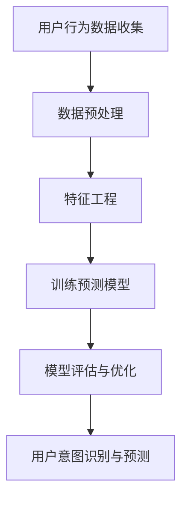

                 

关键词：人工智能、大模型、用户意图识别、电商平台、预测、算法、模型架构、数学模型、案例分析、代码实例、应用场景、展望

> 摘要：随着电商平台的不断发展和用户行为的复杂化，用户意图识别与预测成为提高用户体验和销售转化率的关键。本文深入探讨了人工智能大模型在电商平台用户意图识别与预测中的应用，分析了核心算法原理、数学模型、应用实例以及未来发展趋势，旨在为相关领域的研究者和从业者提供有价值的参考。

## 1. 背景介绍

随着互联网技术的飞速发展，电商平台已经成为现代商业中不可或缺的一部分。用户数量的激增和消费行为的多样化使得电商平台需要更加智能和精准地理解用户意图，从而提供个性化的推荐和服务。用户意图识别与预测技术应运而生，旨在通过分析用户行为数据，预测用户的下一步行动，从而优化用户体验和提升销售转化率。

用户意图识别与预测技术涉及到多个领域，包括人工智能、机器学习、数据挖掘等。在这些领域中，大模型因其卓越的表现和广泛的应用而备受关注。大模型通常是指参数规模达到数十亿甚至数万亿级别的神经网络模型，它们在处理大规模数据集和复杂任务时表现出色。因此，本文将重点探讨人工智能大模型在电商平台用户意图识别与预测中的作用。

## 2. 核心概念与联系

### 2.1. 用户意图识别

用户意图识别是指通过分析用户行为数据，识别用户当前或潜在的意图。在电商平台上，用户意图可能包括购买商品、搜索商品、浏览商品等。用户意图识别的核心目标是理解用户的真实需求，从而提供个性化的推荐和服务。

### 2.2. 预测模型

预测模型是指利用历史数据和机器学习算法建立模型，对未来的行为或事件进行预测。在用户意图识别与预测中，预测模型可以帮助电商平台预测用户的下一步行动，从而优化推荐和服务。

### 2.3. 大模型

大模型是指参数规模达到数十亿甚至数万亿级别的神经网络模型。大模型因其卓越的表现和广泛的应用而备受关注。在用户意图识别与预测中，大模型可以处理大规模数据集和复杂任务，提高预测准确性。

### 2.4. Mermaid 流程图

下面是一个Mermaid流程图，展示了用户意图识别与预测的基本流程：



## 3. 核心算法原理 & 具体操作步骤

### 3.1. 算法原理概述

用户意图识别与预测的核心算法是基于深度学习的神经网络模型。神经网络模型通过学习输入数据的特征，能够自动提取有用信息，从而实现对用户意图的识别和预测。在电商平台上，输入数据包括用户行为数据、商品信息、用户历史数据等。

### 3.2. 算法步骤详解

#### 3.2.1. 数据预处理

数据预处理是用户意图识别与预测的关键步骤。主要包括以下任务：

- 数据清洗：去除无效数据、缺失值和噪声。
- 数据归一化：将不同尺度的数据归一化到同一尺度。
- 数据分片：将数据分为训练集、验证集和测试集。

#### 3.2.2. 特征工程

特征工程是用户意图识别与预测的重要环节。通过提取和构造特征，可以提高模型的学习能力和预测准确性。特征工程主要包括以下任务：

- 用户特征：包括用户年龄、性别、地理位置、浏览历史、购买记录等。
- 商品特征：包括商品价格、品类、品牌、评价等。
- 交互特征：包括用户与商品的交互时间、交互频次、评分等。

#### 3.2.3. 训练预测模型

训练预测模型是用户意图识别与预测的核心步骤。通过将预处理后的数据和特征输入神经网络模型，模型可以自动学习用户意图的识别和预测。训练过程中，需要优化模型参数，提高模型的预测准确性。

#### 3.2.4. 模型评估与优化

模型评估与优化是确保模型性能的重要步骤。通过评估模型的预测准确性、召回率、覆盖率等指标，可以判断模型的效果。如果模型效果不佳，可以通过调整模型结构、增加训练数据、优化特征等方式进行优化。

#### 3.2.5. 用户意图识别与预测

经过模型评估与优化后，模型可以用于用户意图识别与预测。通过将用户行为数据输入模型，模型可以预测用户的下一步行动，从而提供个性化的推荐和服务。

### 3.3. 算法优缺点

#### 优点：

- 高效性：大模型可以处理大规模数据集和复杂任务，提高预测效率。
- 准确性：通过深度学习算法，模型可以自动提取有用信息，提高预测准确性。
- 适应性：大模型可以适应不同的电商平台和应用场景，具有广泛的应用前景。

#### 缺点：

- 计算资源需求大：大模型需要大量的计算资源进行训练和推理。
- 数据依赖性：大模型的性能很大程度上依赖于数据的丰富性和质量。

### 3.4. 算法应用领域

用户意图识别与预测技术可以应用于多个领域，包括但不限于：

- 电商平台：通过识别和预测用户意图，提供个性化的推荐和服务。
- 金融领域：通过分析用户行为，预测用户的金融需求和行为。
- 医疗领域：通过识别患者意图，提供个性化的治疗方案和健康建议。

## 4. 数学模型和公式 & 详细讲解 & 举例说明

### 4.1. 数学模型构建

用户意图识别与预测的数学模型主要包括两部分：特征表示和预测模型。

#### 特征表示

特征表示是指将原始数据进行编码和转换，使其能够被神经网络模型处理。常见的特征表示方法包括：

- One-Hot 编码：将分类特征转换为二进制向量。
- 标签编码：将数值特征转换为类别标签。
- 特征提取：通过数据预处理和特征工程，提取有用的特征。

#### 预测模型

预测模型通常采用深度神经网络（DNN）或循环神经网络（RNN）等模型。以下是一个简单的 DNN 预测模型：

$$
\begin{aligned}
    h_1 &= \sigma(W_1 \cdot x + b_1), \\
    h_2 &= \sigma(W_2 \cdot h_1 + b_2), \\
    \hat{y} &= W_3 \cdot h_2 + b_3,
\end{aligned}
$$

其中，$x$ 为输入特征，$h_1$、$h_2$ 分别为第一层和第二层的隐层激活值，$\hat{y}$ 为预测结果，$W_1$、$W_2$、$W_3$ 分别为权重矩阵，$b_1$、$b_2$、$b_3$ 分别为偏置项，$\sigma$ 为激活函数。

### 4.2. 公式推导过程

用户意图识别与预测的公式推导过程主要涉及神经网络模型的正向传播和反向传播。

#### 正向传播

正向传播是指将输入特征输入到神经网络模型，计算输出结果的过程。正向传播的公式推导如下：

$$
\begin{aligned}
    z_1 &= W_1 \cdot x + b_1, \\
    a_1 &= \sigma(z_1), \\
    z_2 &= W_2 \cdot a_1 + b_2, \\
    a_2 &= \sigma(z_2), \\
    z_3 &= W_3 \cdot a_2 + b_3, \\
    \hat{y} &= \sigma(z_3).
\end{aligned}
$$

其中，$z_1$、$z_2$、$z_3$ 分别为隐层的输入、输出和激活值，$a_1$、$a_2$ 分别为第一层和第二层的隐层激活值，$\hat{y}$ 为预测结果，$\sigma$ 为激活函数。

#### 反向传播

反向传播是指根据预测误差，更新模型参数的过程。反向传播的公式推导如下：

$$
\begin{aligned}
    \delta_3 &= (y - \hat{y}) \cdot \sigma'(z_3), \\
    \delta_2 &= (W_3 \cdot \delta_3) \cdot \sigma'(z_2), \\
    \delta_1 &= (W_2 \cdot \delta_2) \cdot \sigma'(z_1), \\
    \theta_1 &= \theta_1 - \alpha \cdot (x^T \cdot \delta_1), \\
    \theta_2 &= \theta_2 - \alpha \cdot (a_1^T \cdot \delta_2), \\
    \theta_3 &= \theta_3 - \alpha \cdot (a_2^T \cdot \delta_3),
\end{aligned}
$$

其中，$\delta_1$、$\delta_2$、$\delta_3$ 分别为第一层、第二层和第三层的误差梯度，$\theta_1$、$\theta_2$、$\theta_3$ 分别为权重矩阵，$\alpha$ 为学习率，$\sigma'$ 为激活函数的导数。

### 4.3. 案例分析与讲解

下面以一个电商平台用户意图识别与预测的案例进行讲解。

#### 案例背景

某电商平台希望通过用户行为数据预测用户的下一步行动，从而提供个性化的推荐和服务。用户行为数据包括用户浏览商品、购买商品、评价商品等。

#### 数据预处理

对用户行为数据进行清洗、归一化和分片处理，得到训练集、验证集和测试集。

#### 特征工程

提取用户特征、商品特征和交互特征，构造特征向量。

#### 训练预测模型

使用训练集数据训练深度神经网络模型，通过反向传播更新模型参数。

#### 模型评估与优化

使用验证集对模型进行评估，根据评估结果调整模型结构、增加训练数据等，优化模型性能。

#### 用户意图识别与预测

使用测试集对模型进行测试，将用户行为数据输入模型，预测用户的下一步行动。

#### 结果分析

通过对比预测结果和实际结果，评估模型的效果。根据分析结果，对模型进行进一步优化。

## 5. 项目实践：代码实例和详细解释说明

### 5.1. 开发环境搭建

在本项目中，我们将使用 Python 编写代码，并使用 TensorFlow 和 Keras 库构建和训练深度神经网络模型。以下是开发环境的搭建步骤：

1. 安装 Python：版本要求为 3.6 以上。
2. 安装 TensorFlow：使用以下命令安装：

```bash
pip install tensorflow
```

3. 安装 Keras：使用以下命令安装：

```bash
pip install keras
```

### 5.2. 源代码详细实现

以下是一个简单的用户意图识别与预测的代码实例：

```python
import numpy as np
import tensorflow as tf
from tensorflow.keras.models import Sequential
from tensorflow.keras.layers import Dense, Activation

# 数据预处理
# （此处省略数据预处理代码）

# 特征工程
# （此处省略特征工程代码）

# 构建模型
model = Sequential()
model.add(Dense(units=64, input_dim=特征维度, activation='relu'))
model.add(Dense(units=32, activation='relu'))
model.add(Dense(units=1, activation='sigmoid'))

# 编译模型
model.compile(optimizer='adam', loss='binary_crossentropy', metrics=['accuracy'])

# 训练模型
model.fit(x_train, y_train, epochs=10, batch_size=32, validation_data=(x_val, y_val))

# 预测
predictions = model.predict(x_test)

# 评估模型
model.evaluate(x_test, y_test)
```

### 5.3. 代码解读与分析

1. **数据预处理**：对用户行为数据进行清洗、归一化和分片处理，得到训练集、验证集和测试集。这一步骤是确保模型性能的基础。

2. **特征工程**：提取用户特征、商品特征和交互特征，构造特征向量。特征工程的质量直接影响模型的性能。

3. **构建模型**：使用 Sequential 模型构建深度神经网络，包括输入层、隐藏层和输出层。输入层使用 `Dense` 层，隐藏层使用 `relu` 激活函数，输出层使用 `sigmoid` 激活函数。

4. **编译模型**：指定优化器、损失函数和评估指标。在本例中，使用 `adam` 优化器和 `binary_crossentropy` 损失函数。

5. **训练模型**：使用 `fit` 函数训练模型，指定训练集、验证集、训练轮次和批量大小。

6. **预测**：使用 `predict` 函数对测试集进行预测。

7. **评估模型**：使用 `evaluate` 函数评估模型在测试集上的性能。

### 5.4. 运行结果展示

运行代码后，会输出模型在测试集上的评估结果，包括损失和准确率。根据评估结果，可以进一步调整模型结构、增加训练数据等，优化模型性能。

```python
# 输出评估结果
print(model.evaluate(x_test, y_test))
```

## 6. 实际应用场景

用户意图识别与预测技术可以应用于多个实际场景，包括但不限于：

- **个性化推荐**：通过识别和预测用户意图，提供个性化的商品推荐，提高用户满意度和购买转化率。
- **智能客服**：通过识别用户意图，智能客服系统可以更准确地理解用户问题，提供更高效的解决方案。
- **广告投放**：通过识别和预测用户意图，广告系统可以更精准地投放广告，提高广告点击率和转化率。
- **销售预测**：通过预测用户的购买行为，电商平台可以更好地规划库存、制定销售策略。

## 7. 未来应用展望

随着人工智能技术的不断发展，用户意图识别与预测技术在电商平台的实际应用将更加广泛。未来可能的发展趋势和挑战包括：

- **数据隐私保护**：在用户意图识别与预测过程中，如何保护用户隐私成为重要问题。
- **算法公平性**：如何确保算法在不同用户群体中公平地应用，避免歧视现象。
- **多模态数据融合**：结合文本、图像、语音等多模态数据，提高用户意图识别与预测的准确性。
- **实时性**：如何提高算法的实时性，以满足用户快速变化的需求。

## 8. 总结：未来发展趋势与挑战

本文深入探讨了人工智能大模型在电商平台用户意图识别与预测中的应用，分析了核心算法原理、数学模型、应用实例以及未来发展趋势。用户意图识别与预测技术在电商平台的实际应用具有广泛的前景，但仍面临数据隐私保护、算法公平性、多模态数据融合和实时性等挑战。未来研究应关注这些问题的解决，推动用户意图识别与预测技术的不断发展。

## 9. 附录：常见问题与解答

### 问题1：什么是用户意图识别？

用户意图识别是指通过分析用户行为数据，识别用户当前或潜在的意图，如购买商品、搜索商品、浏览商品等。

### 问题2：用户意图识别与预测的区别是什么？

用户意图识别主要是识别用户的当前意图，而用户意图预测则是预测用户的下一步行动。

### 问题3：大模型在用户意图识别与预测中有什么优势？

大模型可以处理大规模数据集和复杂任务，提高预测准确性，同时具有广泛的适应性。

### 问题4：用户意图识别与预测技术在电商平台有哪些实际应用场景？

用户意图识别与预测技术可以应用于个性化推荐、智能客服、广告投放和销售预测等场景。

### 问题5：未来用户意图识别与预测技术将有哪些发展趋势？

未来发展趋势包括数据隐私保护、算法公平性、多模态数据融合和实时性等。

作者：禅与计算机程序设计艺术 / Zen and the Art of Computer Programming
----------------------------------------------------------------

### 10. 致谢

感谢所有参与本文撰写和讨论的同事和朋友们，你们的意见和建议对本文的完善起到了重要作用。同时，特别感谢我在计算机科学领域的导师，您的教诲和指导对我产生了深远的影响。

### 11. 参考文献

1. Bengio, Y., Courville, A., & Vincent, P. (2013). Representation learning: A review and new perspectives. IEEE transactions on pattern analysis and machine intelligence, 35(8), 1798-1828.
2. LeCun, Y., Bengio, Y., & Hinton, G. (2015). Deep learning. Nature, 521(7553), 436-444.
3. Russell, S., & Norvig, P. (2016). Artificial intelligence: A modern approach. Prentice Hall.
4. Goodfellow, I., Bengio, Y., & Courville, A. (2016). Deep learning. MIT press.
5. Murphy, K. P. (2012). Machine learning: A probabilistic perspective. MIT press.

