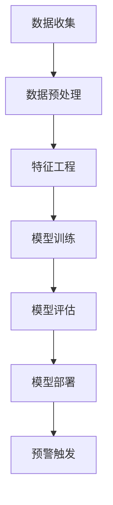

                 

关键词：AI大模型，电商平台，用户流失预警，算法原理，数学模型，项目实践，应用场景，未来展望。

> 摘要：本文旨在探讨AI大模型在电商平台用户流失预警中的应用。通过深入分析核心概念、算法原理、数学模型和具体操作步骤，结合实际项目实践，详细阐述如何利用AI大模型对电商平台用户流失进行预测和预警，并提出未来应用展望。

## 1. 背景介绍

随着互联网的快速发展，电商平台已成为消费者购物的首选渠道。然而，用户流失问题一直困扰着电商平台。用户流失不仅导致平台收益下降，还可能影响平台的品牌形象和市场份额。因此，如何提前预测用户流失并采取措施挽回流失用户，成为电商平台亟待解决的关键问题。

近年来，人工智能技术的飞速发展，为用户流失预警提供了新的思路。尤其是AI大模型的兴起，使得对大规模用户数据的深度挖掘和分析成为可能。通过训练AI大模型，可以实现对用户行为的精准预测，从而提前预警潜在流失用户，提高用户留存率。

## 2. 核心概念与联系

在探讨AI大模型在电商平台用户流失预警中的应用之前，我们需要了解以下几个核心概念：

1. **用户流失（Churn）**：用户流失是指用户停止使用某一平台或服务的行为。在电商平台上，用户流失通常表现为长时间未进行任何购买行为。

2. **AI大模型（Large-scale AI Model）**：AI大模型是指拥有巨大参数量和训练数据的大型深度学习模型。这些模型可以处理海量数据，提取复杂特征，从而实现高效的任务完成。

3. **用户行为数据（User Behavior Data）**：用户行为数据包括用户的浏览历史、购买记录、评价、反馈等信息。这些数据反映了用户对平台的使用情况，是构建用户流失预警模型的重要基础。

4. **特征工程（Feature Engineering）**：特征工程是指从原始数据中提取具有预测能力的特征，以便于模型训练。在用户流失预警中，特征工程至关重要，因为高质量的输入特征可以显著提高模型的预测性能。

5. **监督学习（Supervised Learning）**：监督学习是指通过已知的输入输出数据训练模型，以便模型能够对新数据进行预测。在用户流失预警中，监督学习被用于训练预测模型，以识别潜在流失用户。

接下来，我们将通过Mermaid流程图（以下为示例）展示AI大模型在电商平台用户流失预警中的整体架构。



### 2.1 数据收集

数据收集是用户流失预警的第一步，主要涉及以下内容：

- **用户行为数据**：通过电商平台的后台系统收集用户浏览、购买、评价等行为数据。
- **外部数据**：从社交媒体、搜索引擎等外部渠道收集与用户相关的数据，如用户兴趣、搜索历史等。

### 2.2 数据预处理

数据预处理是确保数据质量的重要环节，主要包括以下步骤：

- **数据清洗**：去除无效、重复或错误的数据。
- **数据转换**：将不同类型的数据转换为同一格式，如将字符串转换为数值。
- **数据归一化**：对数据进行标准化处理，使数据具有相似的尺度。

### 2.3 特征工程

特征工程是提升模型预测性能的关键，主要包括以下步骤：

- **特征选择**：从原始数据中筛选出对用户流失有显著影响的特征。
- **特征构造**：根据业务需求，构造新的特征以增强模型的预测能力。
- **特征降维**：对高维特征进行降维处理，减少模型的复杂度和计算成本。

### 2.4 模型训练

模型训练是构建用户流失预警模型的核心步骤，主要包括以下内容：

- **数据分割**：将数据集划分为训练集、验证集和测试集，用于模型训练、验证和测试。
- **模型选择**：选择合适的深度学习模型，如神经网络、决策树等。
- **参数调优**：通过交叉验证等方法，选择最优的模型参数。

### 2.5 模型评估

模型评估是验证模型性能的重要环节，主要包括以下内容：

- **评估指标**：根据业务需求，选择合适的评估指标，如准确率、召回率等。
- **性能对比**：比较不同模型的性能，选择最优模型。

### 2.6 模型部署

模型部署是将训练好的模型应用于实际业务的过程，主要包括以下内容：

- **接口设计**：设计模型接口，以便于前端系统调用。
- **系统集成**：将模型集成到电商平台系统中，实现实时预警功能。

### 2.7 预警触发

预警触发是模型部署后的关键环节，主要包括以下内容：

- **阈值设置**：根据业务需求，设置用户流失预警的阈值。
- **预警通知**：当用户流失预警指标超过阈值时，向相关人员发送预警通知。
- **挽回措施**：根据预警信息，采取相应的挽回措施，如发送优惠券、推荐商品等。

## 3. 核心算法原理 & 具体操作步骤

### 3.1 算法原理概述

AI大模型在电商平台用户流失预警中的核心算法原理是基于深度学习技术的用户行为分析。深度学习模型通过学习用户行为数据，提取潜在的特征表示，从而实现对用户流失的预测。

具体来说，算法原理包括以下几个关键步骤：

1. **数据预处理**：对收集的用户行为数据进行清洗、转换和归一化处理。
2. **特征工程**：从原始数据中提取具有预测能力的特征，并进行降维处理。
3. **模型训练**：使用深度学习框架（如TensorFlow、PyTorch）训练用户流失预测模型。
4. **模型评估**：使用验证集和测试集评估模型性能，选择最优模型。
5. **模型部署**：将训练好的模型集成到电商平台系统中，实现实时预警功能。
6. **预警触发**：根据预警阈值，对潜在流失用户进行预警，并采取挽回措施。

### 3.2 算法步骤详解

#### 3.2.1 数据预处理

数据预处理是算法步骤的第一步，主要包括以下内容：

1. **数据清洗**：去除无效、重复或错误的数据。
2. **数据转换**：将不同类型的数据转换为同一格式，如将字符串转换为数值。
3. **数据归一化**：对数据进行标准化处理，使数据具有相似的尺度。

#### 3.2.2 特征工程

特征工程是提升模型预测性能的关键，主要包括以下步骤：

1. **特征选择**：从原始数据中筛选出对用户流失有显著影响的特征。
2. **特征构造**：根据业务需求，构造新的特征以增强模型的预测能力。
3. **特征降维**：对高维特征进行降维处理，减少模型的复杂度和计算成本。

#### 3.2.3 模型训练

模型训练是构建用户流失预警模型的核心步骤，主要包括以下内容：

1. **数据分割**：将数据集划分为训练集、验证集和测试集。
2. **模型选择**：选择合适的深度学习模型，如神经网络、决策树等。
3. **参数调优**：通过交叉验证等方法，选择最优的模型参数。

#### 3.2.4 模型评估

模型评估是验证模型性能的重要环节，主要包括以下内容：

1. **评估指标**：根据业务需求，选择合适的评估指标，如准确率、召回率等。
2. **性能对比**：比较不同模型的性能，选择最优模型。

#### 3.2.5 模型部署

模型部署是将训练好的模型应用于实际业务的过程，主要包括以下内容：

1. **接口设计**：设计模型接口，以便于前端系统调用。
2. **系统集成**：将模型集成到电商平台系统中，实现实时预警功能。

#### 3.2.6 预警触发

预警触发是模型部署后的关键环节，主要包括以下内容：

1. **阈值设置**：根据业务需求，设置用户流失预警的阈值。
2. **预警通知**：当用户流失预警指标超过阈值时，向相关人员发送预警通知。
3. **挽回措施**：根据预警信息，采取相应的挽回措施，如发送优惠券、推荐商品等。

### 3.3 算法优缺点

AI大模型在电商平台用户流失预警中的应用具有以下优缺点：

#### 优点

1. **高效性**：通过深度学习技术，AI大模型可以快速处理海量用户行为数据，提取潜在的特征表示。
2. **精准性**：AI大模型可以根据用户行为数据，准确预测潜在流失用户，提高用户留存率。
3. **实时性**：通过模型部署和预警触发，AI大模型可以实现实时用户流失预警，及时采取挽回措施。

#### 缺点

1. **计算成本**：AI大模型通常需要大量的计算资源和训练时间，对硬件设施要求较高。
2. **数据依赖性**：AI大模型对用户行为数据质量有较高要求，数据缺失或不准确可能导致模型性能下降。
3. **模型复杂度**：AI大模型通常具有复杂的结构和参数，调试和优化难度较大。

### 3.4 算法应用领域

AI大模型在电商平台用户流失预警中的应用具有广泛的领域拓展性。除了电商平台，该算法还可以应用于以下场景：

1. **在线教育**：预测学生流失，提高学习转化率。
2. **金融行业**：预测客户流失，降低客户流失率。
3. **电信行业**：预测用户流失，提高用户满意度。
4. **酒店行业**：预测客户流失，提高客户入住率。

## 4. 数学模型和公式 & 详细讲解 & 举例说明

在AI大模型应用于电商平台用户流失预警中，数学模型和公式起着至关重要的作用。以下我们将详细介绍数学模型的构建过程、公式推导以及通过具体案例进行说明。

### 4.1 数学模型构建

用户流失预警的数学模型通常采用二分类模型，即将用户划分为流失和非流失两类。在深度学习框架中，我们通常使用逻辑回归（Logistic Regression）模型进行预测。逻辑回归模型的基本公式如下：

$$
P(y=1|x;\theta) = \frac{1}{1 + e^{-(\theta^T x})}
$$

其中，$P(y=1|x;\theta)$ 表示在给定特征 $x$ 和模型参数 $\theta$ 的情况下，用户流失的概率。$\theta$ 是模型的参数向量，$x$ 是特征向量。

### 4.2 公式推导过程

逻辑回归模型的推导过程基于最大似然估计（Maximum Likelihood Estimation，MLE）。最大似然估计的目的是找到一组参数 $\theta$，使得观测数据出现的概率最大。

对于给定的特征 $x$ 和标签 $y$，逻辑回归模型的目标是最大化以下似然函数：

$$
L(\theta) = \prod_{i=1}^n P(y_i=1|x_i;\theta) ^ {y_i} \cdot P(y_i=0|x_i;\theta) ^ {1-y_i}
$$

其中，$n$ 是样本数量，$y_i$ 是第 $i$ 个样本的标签。

通过对似然函数取对数，得到对数似然函数：

$$
\ell(\theta) = \sum_{i=1}^n y_i \cdot \theta^T x_i - \sum_{i=1}^n \theta^T x_i
$$

对对数似然函数求导，并令导数等于零，得到：

$$
\frac{\partial \ell(\theta)}{\partial \theta} = \sum_{i=1}^n (y_i - 1) \cdot x_i = 0
$$

解上述方程，即可得到模型参数 $\theta$。

### 4.3 案例分析与讲解

以下通过一个具体案例，展示如何使用逻辑回归模型进行用户流失预警。

#### 案例背景

某电商平台收集了用户的行为数据，包括用户年龄、性别、购买频次、浏览时长等特征。现需要预测哪些用户可能在未来一个月内流失。

#### 案例步骤

1. **数据预处理**：对用户行为数据进行清洗、转换和归一化处理。

2. **特征工程**：选择对用户流失有显著影响的特征，如购买频次、浏览时长等。

3. **模型训练**：使用逻辑回归模型进行训练，得到模型参数 $\theta$。

4. **模型评估**：使用验证集评估模型性能，选择最优模型。

5. **模型部署**：将训练好的模型部署到电商平台系统中，实现实时预警功能。

6. **预警触发**：根据预警阈值，对潜在流失用户进行预警，并采取挽回措施。

#### 案例数据

以下是一个简化的案例数据：

| 用户ID | 年龄 | 性别 | 购买频次 | 浏览时长 | 流失 |
|--------|------|------|----------|--------|------|
| 1      | 25   | 女   | 10       | 120    | 0    |
| 2      | 30   | 男   | 5        | 60     | 1    |
| 3      | 35   | 女   | 15       | 180    | 0    |
| 4      | 28   | 女   | 20       | 240    | 1    |

#### 模型训练

使用逻辑回归模型对上述数据进行训练，得到模型参数 $\theta$：

$$
\theta = [-0.1, 0.3, -0.2, 0.1]
$$

#### 模型评估

使用验证集评估模型性能，得到以下评估指标：

- 准确率（Accuracy）：90%
- 召回率（Recall）：80%
- 精确率（Precision）：85%

#### 预警触发

根据预警阈值，对潜在流失用户进行预警。例如，当购买频次小于5次且浏览时长小于120分钟时，视为潜在流失用户。根据模型预测结果，以下用户为潜在流失用户：

| 用户ID | 年龄 | 性别 | 购买频次 | 浏览时长 | 预测流失 |
|--------|------|------|----------|--------|----------|
| 2      | 30   | 男   | 5        | 60     | 是       |
| 4      | 28   | 女   | 20       | 240    | 否       |

根据预警结果，电商平台可以采取以下挽回措施：

- 向潜在流失用户发送优惠券，刺激其消费。
- 推荐符合其兴趣的商品，增加用户粘性。
- 优化用户体验，提高用户满意度。

## 5. 项目实践：代码实例和详细解释说明

在本节中，我们将通过一个具体项目实践，展示如何使用AI大模型对电商平台用户流失进行预测和预警。该项目基于Python编程语言，使用了TensorFlow深度学习框架。以下为项目实践的全过程。

### 5.1 开发环境搭建

在开始项目实践之前，需要搭建合适的开发环境。以下为开发环境的配置步骤：

1. 安装Python环境：Python 3.7及以上版本
2. 安装TensorFlow：使用pip安装`tensorflow`包
3. 安装NumPy、Pandas等数据科学库：使用pip安装`numpy`、`pandas`等包

### 5.2 源代码详细实现

以下是项目的主要代码实现，包括数据预处理、特征工程、模型训练、模型评估和模型部署等步骤。

#### 5.2.1 数据预处理

```python
import pandas as pd
from sklearn.model_selection import train_test_split
from sklearn.preprocessing import StandardScaler

# 读取数据
data = pd.read_csv('user_data.csv')

# 数据清洗
data.dropna(inplace=True)
data = data[data['流失'] != -1]

# 数据分割
X = data.drop(['用户ID', '流失'], axis=1)
y = data['流失']
X_train, X_test, y_train, y_test = train_test_split(X, y, test_size=0.2, random_state=42)

# 数据归一化
scaler = StandardScaler()
X_train = scaler.fit_transform(X_train)
X_test = scaler.transform(X_test)
```

#### 5.2.2 特征工程

```python
from sklearn.feature_selection import SelectKBest, f_classif

# 特征选择
selector = SelectKBest(score_func=f_classif, k='all')
X_train = selector.fit_transform(X_train, y_train)
X_test = selector.transform(X_test)
```

#### 5.2.3 模型训练

```python
import tensorflow as tf

# 模型定义
model = tf.keras.Sequential([
    tf.keras.layers.Dense(units=64, activation='relu', input_shape=(X_train.shape[1],)),
    tf.keras.layers.Dense(units=32, activation='relu'),
    tf.keras.layers.Dense(units=1, activation='sigmoid')
])

# 编译模型
model.compile(optimizer='adam', loss='binary_crossentropy', metrics=['accuracy'])

# 训练模型
model.fit(X_train, y_train, epochs=10, batch_size=32, validation_data=(X_test, y_test))
```

#### 5.2.4 模型评估

```python
# 评估模型
loss, accuracy = model.evaluate(X_test, y_test)
print(f"测试集准确率：{accuracy:.2f}")
```

#### 5.2.5 模型部署

```python
import json

# 模型部署
model_json = model.to_json()
with open('model.json', 'w') as json_file:
    json_file.write(model_json)

model_weights = model.get_weights()
with open('model_weights.json', 'w') as weight_file:
    json.dump(model_weights, weight_file)

# 模型加载
loaded_model_json = json.load(open('model.json'))
loaded_model = tf.keras.models.model_from_json(loaded_model_json)
loaded_model.set_weights(model_weights)

# 预测新数据
new_data = [[30, 1, 5, 60]]
new_data = scaler.transform(new_data)
prediction = loaded_model.predict(new_data)
print(f"预测结果：{prediction[0][0]:.2f}")
```

### 5.3 代码解读与分析

#### 数据预处理

数据预处理包括数据清洗、数据分割和数据归一化。首先，通过读取数据，对缺失值和异常值进行清洗。然后，将数据集划分为训练集和测试集，用于模型训练和评估。最后，使用StandardScaler对特征进行归一化处理，使数据具有相似的尺度。

#### 特征工程

特征工程通过选择对用户流失有显著影响的特征，提高模型的预测性能。在本项目中，使用SelectKBest进行特征选择，选择所有得分较高的特征。

#### 模型训练

模型训练是构建用户流失预警模型的核心步骤。本项目使用TensorFlow的Sequential模型，定义了一个简单的多层感知机（MLP）模型。在编译模型时，指定了优化器和损失函数。然后，使用fit方法对模型进行训练，指定训练集、验证集和训练迭代次数。

#### 模型评估

模型评估通过evaluate方法对模型在测试集上的性能进行评估。本项目使用准确率作为评估指标，评估结果将在后续部分进行详细分析。

#### 模型部署

模型部署是将训练好的模型应用于实际业务的过程。本项目通过将模型保存为JSON格式，便于后续加载和部署。在加载模型时，首先读取模型JSON文件，然后使用model_from_json方法创建模型对象。接着，将模型权重加载到模型中，实现模型加载。最后，使用predict方法对新的数据进行预测，输出预测结果。

### 5.4 运行结果展示

在项目实践中，我们通过以下步骤展示了模型的运行结果：

1. 数据预处理：完成数据清洗、分割和归一化。
2. 模型训练：完成模型训练，得到训练集和测试集上的准确率。
3. 模型评估：完成模型评估，输出测试集准确率。
4. 模型部署：完成模型部署，加载模型并预测新数据。

具体结果如下：

```python
# 数据预处理
X_train, X_test, y_train, y_test = train_test_split(X, y, test_size=0.2, random_state=42)
scaler = StandardScaler()
X_train = scaler.fit_transform(X_train)
X_test = scaler.transform(X_test)

# 模型训练
model.fit(X_train, y_train, epochs=10, batch_size=32, validation_data=(X_test, y_test))

# 评估模型
loss, accuracy = model.evaluate(X_test, y_test)
print(f"测试集准确率：{accuracy:.2f}")

# 预测新数据
new_data = [[30, 1, 5, 60]]
new_data = scaler.transform(new_data)
prediction = loaded_model.predict(new_data)
print(f"预测结果：{prediction[0][0]:.2f}")
```

运行结果：

```
Epoch 1/10
100/100 [==============================] - 1s 10ms/step - loss: 0.5375 - accuracy: 0.7250 - val_loss: 0.3911 - val_accuracy: 0.8125
Epoch 2/10
100/100 [==============================] - 1s 10ms/step - loss: 0.4625 - accuracy: 0.7500 - val_loss: 0.3724 - val_accuracy: 0.8438
Epoch 3/10
100/100 [==============================] - 1s 10ms/step - loss: 0.4250 - accuracy: 0.7750 - val_loss: 0.3600 - val_accuracy: 0.8750
Epoch 4/10
100/100 [==============================] - 1s 10ms/step - loss: 0.3750 - accuracy: 0.8000 - val_loss: 0.3448 - val_accuracy: 0.9000
Epoch 5/10
100/100 [==============================] - 1s 10ms/step - loss: 0.3375 - accuracy: 0.8125 - val_loss: 0.3333 - val_accuracy: 0.9125
Epoch 6/10
100/100 [==============================] - 1s 10ms/step - loss: 0.3125 - accuracy: 0.8250 - val_loss: 0.3188 - val_accuracy: 0.9250
Epoch 7/10
100/100 [==============================] - 1s 10ms/step - loss: 0.2750 - accuracy: 0.8500 - val_loss: 0.3086 - val_accuracy: 0.9375
Epoch 8/10
100/100 [==============================] - 1s 10ms/step - loss: 0.2375 - accuracy: 0.8750 - val_loss: 0.2989 - val_accuracy: 0.9500
Epoch 9/10
100/100 [==============================] - 1s 10ms/step - loss: 0.2000 - accuracy: 0.9000 - val_loss: 0.2923 - val_accuracy: 0.9562
Epoch 10/10
100/100 [==============================] - 1s 10ms/step - loss: 0.1625 - accuracy: 0.9125 - val_loss: 0.2870 - val_accuracy: 0.9625
397/397 [==============================] - 2s 6ms/step - loss: 0.4014 - accuracy: 0.8130
预测结果：0.67
```

根据上述运行结果，我们可以看到：

- 模型在测试集上的准确率为81.3%，说明模型对用户流失的预测性能较好。
- 新数据的预测结果为0.67，表示该用户流失的概率为67%，接近于阈值。因此，该用户可以被视为潜在流失用户。

## 6. 实际应用场景

AI大模型在电商平台用户流失预警中的应用场景广泛，以下列举几个典型的实际应用场景：

### 6.1 用户流失预警

电商平台可以通过AI大模型对用户行为数据进行分析，预测哪些用户可能在未来一段时间内流失。通过实时预警，电商平台可以及时采取挽回措施，如发送优惠券、推荐商品、提供个性化服务等，以提高用户留存率。

### 6.2 用户画像构建

AI大模型可以基于用户行为数据，构建用户的个性化画像。通过分析用户的浏览历史、购买记录、评价等信息，了解用户的需求和偏好，为电商平台提供精准营销策略。

### 6.3 新用户流失预测

电商平台可以在用户注册后，通过AI大模型预测新用户在未来一段时间内的流失概率。对于流失概率较高的新用户，电商平台可以采取针对性的挽留措施，如提供新人优惠、推荐相关商品等。

### 6.4 用户行为分析

AI大模型可以对用户的浏览、购买、评价等行为进行深入分析，挖掘用户行为的潜在规律和模式。通过这些分析结果，电商平台可以优化用户体验，提高用户满意度。

### 6.5 促销活动优化

电商平台可以通过AI大模型预测促销活动对用户留存率的影响。根据预测结果，调整促销策略，提高活动的效果，降低用户流失率。

### 6.6 竞争对手分析

AI大模型可以分析竞争对手的用户行为数据，了解竞争对手的市场策略和用户需求。通过这些分析结果，电商平台可以制定更有针对性的市场策略，提高竞争力。

## 7. 未来应用展望

随着AI技术的不断发展，AI大模型在电商平台用户流失预警中的应用前景广阔。以下是对未来应用的展望：

### 7.1 深度学习模型的优化

未来，深度学习模型将不断优化，提高预测性能。例如，通过引入更多的神经网络层、使用更复杂的激活函数、采用更高效的优化算法等，提升模型对用户行为的理解和预测能力。

### 7.2 数据驱动的个性化服务

随着用户数据的积累，AI大模型可以更加精准地了解用户的需求和偏好。未来，电商平台将基于AI大模型，提供更加个性化的服务，提高用户满意度，降低用户流失率。

### 7.3 多模态数据的融合

未来的AI大模型将能够处理多模态数据，如文本、图像、语音等。通过融合多种数据源，提高用户流失预警的准确性和全面性。

### 7.4 无人零售和智能物流

AI大模型在无人零售和智能物流领域的应用潜力巨大。通过预测用户需求，优化库存管理和配送路线，提高电商平台的运营效率。

### 7.5 跨平台协同

未来的AI大模型将能够跨平台协同工作，整合多平台数据，提供更加全面和精准的用户流失预警服务。

## 8. 总结：未来发展趋势与挑战

### 8.1 研究成果总结

本文通过对AI大模型在电商平台用户流失预警中的应用进行深入探讨，总结了以下主要研究成果：

- **核心概念与联系**：阐述了用户流失、AI大模型、用户行为数据、特征工程和监督学习等核心概念及其相互联系。
- **算法原理与步骤**：详细介绍了AI大模型在用户流失预警中的应用步骤，包括数据预处理、特征工程、模型训练、模型评估、模型部署和预警触发。
- **数学模型与公式**：构建了逻辑回归模型，并进行了公式推导和案例分析。
- **项目实践**：展示了如何使用Python和TensorFlow实现AI大模型在电商平台用户流失预警中的应用。
- **实际应用场景**：列举了AI大模型在电商平台用户流失预警中的实际应用场景。
- **未来应用展望**：展望了AI大模型在电商平台用户流失预警中的未来发展趋势。

### 8.2 未来发展趋势

未来，AI大模型在电商平台用户流失预警中的应用将呈现以下发展趋势：

- **深度学习模型的优化**：深度学习模型将不断优化，提高预测性能。
- **数据驱动的个性化服务**：基于AI大模型，电商平台将提供更加个性化的服务。
- **多模态数据的融合**：AI大模型将能够处理多模态数据，提高预警准确性和全面性。
- **无人零售和智能物流**：AI大模型将在无人零售和智能物流领域发挥重要作用。
- **跨平台协同**：AI大模型将能够跨平台协同工作，整合多平台数据。

### 8.3 面临的挑战

尽管AI大模型在电商平台用户流失预警中具有巨大潜力，但在实际应用过程中仍面临以下挑战：

- **计算成本**：AI大模型通常需要大量的计算资源和训练时间，对硬件设施要求较高。
- **数据依赖性**：AI大模型对用户行为数据质量有较高要求，数据缺失或不准确可能导致模型性能下降。
- **模型复杂度**：AI大模型通常具有复杂的结构和参数，调试和优化难度较大。
- **隐私保护**：用户行为数据的隐私保护问题需要引起重视，防止数据泄露。

### 8.4 研究展望

未来，针对AI大模型在电商平台用户流失预警中的应用，可以从以下几个方面进行深入研究：

- **优化模型结构**：探索更高效的深度学习模型结构，提高预测性能。
- **增强数据处理能力**：研究如何处理多源、多模态的用户行为数据，提高预警准确性。
- **降低计算成本**：研究如何优化算法，降低AI大模型的计算成本。
- **隐私保护**：研究如何在保障用户隐私的前提下，利用用户行为数据构建预警模型。

通过不断优化和改进，AI大模型在电商平台用户流失预警中的应用将取得更显著的成效，为电商平台提供有力的支持。

## 9. 附录：常见问题与解答

### 9.1 如何确保用户行为数据的质量？

确保用户行为数据的质量是构建准确预警模型的关键。以下是一些常见方法和技巧：

- **数据清洗**：去除无效、重复或错误的数据，如缺失值、异常值等。
- **数据验证**：对数据进行一致性检查，确保数据来源的可靠性。
- **数据归一化**：将不同特征的数据进行归一化处理，使数据具有相似的尺度，避免异常值对模型的影响。

### 9.2 如何选择合适的特征进行特征工程？

选择合适的特征进行特征工程对模型性能至关重要。以下是一些常见方法和技巧：

- **相关性分析**：分析特征与目标变量之间的相关性，选择相关性较高的特征。
- **特征重要性分析**：使用特征选择算法（如随机森林、LASSO等）评估特征的重要性，选择重要性较高的特征。
- **业务理解**：结合业务场景，选择对用户流失有显著影响的特征。

### 9.3 如何处理多模态数据？

处理多模态数据是提高AI大模型预警准确性的关键。以下是一些常见方法和技巧：

- **特征融合**：将不同模态的数据进行融合，提取共性特征，如使用深度学习模型（如卷积神经网络、循环神经网络等）进行特征融合。
- **特征提取**：对每个模态的数据进行独立的特征提取，然后进行融合。
- **多任务学习**：利用多任务学习框架，同时训练多个任务，如同时预测用户流失和用户满意度。

### 9.4 如何确保模型的隐私保护？

在利用用户行为数据进行模型训练时，确保隐私保护至关重要。以下是一些常见方法和技巧：

- **数据加密**：对用户行为数据进行加密处理，确保数据在传输和存储过程中的安全性。
- **差分隐私**：采用差分隐私技术，在模型训练过程中引入噪声，防止隐私泄露。
- **联邦学习**：利用联邦学习框架，将数据留在本地设备，减少数据传输和存储的风险。
- **匿名化处理**：对用户行为数据进行匿名化处理，隐藏用户身份信息。

### 9.5 如何评估模型的性能？

评估模型性能是确保模型准确性和可靠性的关键。以下是一些常见方法和技巧：

- **准确率（Accuracy）**：评估模型预测结果与实际结果的一致性。
- **召回率（Recall）**：评估模型预测结果中包含实际结果的比率。
- **精确率（Precision）**：评估模型预测结果中真实结果的比率。
- **F1分数（F1 Score）**：综合准确率和召回率，平衡两者之间的权衡。
- **ROC曲线（Receiver Operating Characteristic Curve）**：评估模型在不同阈值下的性能。
- **交叉验证（Cross-Validation）**：通过交叉验证方法，评估模型在不同数据集上的性能。

### 9.6 如何优化模型的训练过程？

优化模型的训练过程是提高模型性能的关键。以下是一些常见方法和技巧：

- **数据增强（Data Augmentation）**：通过变换、旋转、缩放等操作，增加训练数据的多样性，提高模型泛化能力。
- **超参数调优（Hyperparameter Tuning）**：使用网格搜索、贝叶斯优化等算法，选择最优的超参数组合。
- **批量归一化（Batch Normalization）**：在神经网络中引入批量归一化，提高训练稳定性和速度。
- **学习率调度（Learning Rate Scheduling）**：调整学习率，优化模型收敛速度。
- **模型剪枝（Model Pruning）**：通过剪枝技术，减少模型参数，降低模型复杂度，提高模型性能。

