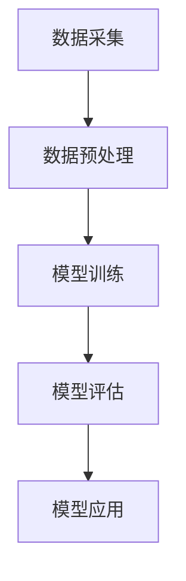

                 

关键词：人工智能，大模型，电商平台，用户生命周期价值预测，管理

> 摘要：本文深入探讨了人工智能大模型在电商平台用户生命周期价值预测与管理中的应用。通过分析大模型的核心原理、数学模型、算法步骤、项目实践，我们揭示了其在提升电商平台运营效率和用户体验方面的巨大潜力。文章最后展望了未来发展趋势与挑战，为相关领域的研究者和实践者提供了有价值的参考。

## 1. 背景介绍

随着互联网技术的快速发展，电商平台已成为人们日常生活中不可或缺的一部分。然而，如何在竞争激烈的市场环境中实现用户增长、提升用户满意度、延长用户生命周期，成为电商企业面临的一大挑战。用户生命周期价值（Customer Lifetime Value，CLV）作为一个重要的指标，反映了用户在整个生命周期内为企业带来的经济收益。因此，精准预测用户生命周期价值，并基于此进行有效的用户管理，成为电商平台提升竞争力、实现可持续发展的重要手段。

近年来，人工智能技术的迅猛发展为电商领域带来了全新的机遇。特别是大模型（Large-scale Model）的崛起，为用户生命周期价值预测与管理提供了强有力的技术支撑。大模型具备强大的数据分析和学习能力，能够在海量用户数据的基础上，挖掘出潜在的用户行为规律和需求特征，从而实现更精确的预测和管理。

## 2. 核心概念与联系

### 2.1 大模型原理

大模型，又称大规模神经网络模型，是一种基于深度学习的机器学习模型。它通过多层神经网络的堆叠，对大量数据进行训练，从而学习到复杂的数据特征和内在规律。大模型的核心原理包括：

1. **深度神经网络**：深度神经网络由多个隐藏层组成，通过逐层提取数据特征，实现对数据的抽象表示。
2. **反向传播算法**：反向传播算法是一种训练神经网络的优化方法，通过不断调整网络参数，使网络输出与真实值之间的误差最小化。
3. **正则化技术**：为防止过拟合，大模型通常采用正则化技术，如Dropout、权重衰减等，以降低模型的复杂性。

### 2.2 电商平台用户生命周期价值预测架构

电商平台用户生命周期价值预测架构主要包括数据采集、数据预处理、模型训练、模型评估和模型应用等环节。以下是一个简化的 Mermaid 流程图，展示了这些环节之间的联系：



### 2.3 大模型在用户生命周期价值预测中的应用

大模型在用户生命周期价值预测中的应用主要体现在以下几个方面：

1. **用户行为分析**：通过对用户浏览、购买、评价等行为数据的分析，挖掘出用户的行为特征和偏好。
2. **用户画像构建**：基于用户行为数据和用户属性数据，构建用户画像，实现对用户的精准刻画。
3. **生命周期预测**：利用用户画像和用户行为数据，预测用户的活跃度、流失率、购买力等指标，从而预测用户生命周期价值。
4. **营销策略优化**：基于用户生命周期价值预测结果，制定个性化的营销策略，提升用户满意度和忠诚度。

## 3. 核心算法原理 & 具体操作步骤

### 3.1 算法原理概述

电商平台用户生命周期价值预测的核心算法是基于大模型的机器学习算法。具体来说，算法包括以下几个步骤：

1. **数据采集**：从电商平台的数据仓库中获取用户行为数据、用户属性数据等。
2. **数据预处理**：对采集到的数据进行清洗、归一化、特征工程等预处理操作。
3. **特征提取**：利用深度神经网络从预处理后的数据中提取高维特征。
4. **模型训练**：基于提取的特征，训练大规模神经网络模型，学习用户生命周期价值预测的规律。
5. **模型评估**：通过交叉验证等方法评估模型的性能，调整模型参数。
6. **模型应用**：将训练好的模型应用于实际业务场景，实现对用户生命周期价值的预测。

### 3.2 算法步骤详解

#### 3.2.1 数据采集

数据采集是用户生命周期价值预测的基础。主要采集的数据包括：

1. 用户行为数据：如浏览历史、购买记录、评价内容等。
2. 用户属性数据：如性别、年龄、职业、地理位置等。

#### 3.2.2 数据预处理

数据预处理主要包括以下几个步骤：

1. **数据清洗**：去除缺失值、异常值和重复值。
2. **归一化**：将不同量纲的数据进行归一化处理，使其具有可比性。
3. **特征工程**：提取用户行为数据中的关键特征，如用户活跃度、购买频率等。

#### 3.2.3 特征提取

特征提取是用户生命周期价值预测的核心环节。常用的特征提取方法包括：

1. **词袋模型**：将用户行为数据转化为词袋模型，提取出高频词汇作为特征。
2. **主题模型**：利用主题模型挖掘用户行为数据中的潜在主题，提取出主题作为特征。
3. **深度神经网络**：利用深度神经网络从原始数据中提取高维特征。

#### 3.2.4 模型训练

模型训练是用户生命周期价值预测的关键步骤。常用的训练方法包括：

1. **梯度下降**：通过不断调整模型参数，使模型输出与真实值之间的误差最小化。
2. **随机梯度下降**：在梯度下降的基础上，每次只更新一部分样本的模型参数，以加快训练速度。
3. **Adam优化器**：结合了梯度下降和动量法的优点，适用于大规模模型的训练。

#### 3.2.5 模型评估

模型评估是验证模型性能的重要环节。常用的评估方法包括：

1. **交叉验证**：将数据集划分为训练集和验证集，多次训练和验证，以消除偶然性。
2. **混淆矩阵**：通过混淆矩阵分析模型的分类效果，如准确率、召回率、F1值等。
3. **ROC曲线**：通过ROC曲线分析模型的分类效果，如AUC值等。

#### 3.2.6 模型应用

模型应用是将训练好的模型应用于实际业务场景，实现对用户生命周期价值的预测。主要应用场景包括：

1. **用户流失预测**：预测哪些用户有可能流失，以便采取针对性的挽回措施。
2. **用户活跃度预测**：预测哪些用户有可能提高活跃度，以便采取针对性的激励措施。
3. **用户购买力预测**：预测哪些用户有可能提高购买力，以便采取针对性的营销策略。

### 3.3 算法优缺点

#### 3.3.1 优点

1. **强大的数据分析和学习能力**：大模型能够处理海量数据，并从中挖掘出潜在的用户行为规律和需求特征。
2. **高度自动化的特征提取**：通过深度神经网络，大模型能够自动提取出高维特征，无需人工干预。
3. **高效的模型训练**：大模型采用先进的优化算法，能够高效地训练出高质量的模型。

#### 3.3.2 缺点

1. **对计算资源的要求较高**：大模型的训练和预测需要大量的计算资源，对硬件设备的要求较高。
2. **数据质量和数量要求较高**：大模型对数据的质量和数量有较高要求，数据不足或质量差会影响模型的性能。
3. **过拟合风险**：大模型的参数较多，容易发生过拟合现象，需要采用正则化技术进行预防。

### 3.4 算法应用领域

大模型在用户生命周期价值预测中的应用非常广泛，主要包括以下几个领域：

1. **电商平台**：通过预测用户生命周期价值，电商平台可以优化营销策略，提升用户满意度和忠诚度。
2. **金融行业**：通过预测用户的风险等级，金融机构可以优化信用评估模型，降低不良贷款率。
3. **电信行业**：通过预测用户的流失风险，电信运营商可以采取针对性的挽回措施，降低用户流失率。
4. **零售行业**：通过预测用户的购买力，零售企业可以优化库存管理，降低库存成本。

## 4. 数学模型和公式 & 详细讲解 & 举例说明

### 4.1 数学模型构建

电商平台用户生命周期价值预测的数学模型主要基于深度学习中的多层感知机（MLP）模型。MLP模型是一个前向传播的神经网络，通过逐层提取数据特征，实现对用户生命周期价值的预测。

MLP模型的基本结构如下：

$$
y = \sigma(\omega_{L}^{T} \cdot a_{L-1})
$$

其中，$y$ 表示输出值，$\sigma$ 表示激活函数，$\omega_{L}$ 表示输出层的权重矩阵，$a_{L-1}$ 表示前一层的激活值。

### 4.2 公式推导过程

MLP模型的推导过程主要分为以下几个步骤：

1. **输入层到隐藏层的传播**：

   $$ 
   z_{l} = \sum_{k=1}^{n} \omega_{lk} \cdot a_{l-1,k} + b_{l}
   $$

   $$ 
   a_{l} = \sigma(z_{l})
   $$

   其中，$z_{l}$ 表示第 $l$ 层的输入值，$a_{l}$ 表示第 $l$ 层的激活值，$\omega_{lk}$ 表示连接第 $l$ 层和第 $l-1$ 层的权重，$b_{l}$ 表示第 $l$ 层的偏置。

2. **隐藏层到输出层的传播**：

   $$ 
   z_{L} = \sum_{k=1}^{n} \omega_{Lk} \cdot a_{L-1,k} + b_{L}
   $$

   $$ 
   y = \sigma(z_{L})
   $$

   其中，$z_{L}$ 表示输出层的输入值，$y$ 表示输出值。

3. **反向传播算法**：

   $$ 
   \Delta \omega_{Lk} = \alpha \cdot (y - \hat{y}) \cdot \sigma'(z_{L}) \cdot a_{L-1,k}
   $$

   $$ 
   \Delta b_{L} = \alpha \cdot (y - \hat{y}) \cdot \sigma'(z_{L})
   $$

   $$ 
   \Delta \omega_{lk} = \alpha \cdot (z_{l} - \hat{z}_{l}) \cdot \sigma'(z_{l}) \cdot a_{l-1,k}
   $$

   $$ 
   \Delta b_{l} = \alpha \cdot (z_{l} - \hat{z}_{l}) \cdot \sigma'(z_{l})
   $$

   其中，$\alpha$ 表示学习率，$\sigma'$ 表示激活函数的导数。

### 4.3 案例分析与讲解

为了更好地理解MLP模型的推导过程，我们以一个简单的例子进行说明。假设一个电商平台有1000名用户，我们需要预测这1000名用户的生命周期价值。输入特征包括用户年龄、性别、收入水平等。

1. **数据预处理**：

   将用户年龄、性别、收入水平等数据进行归一化处理，并转换为数值型数据。

2. **模型构建**：

   构建一个包含3层神经网络的MLP模型，其中输入层有3个神经元，隐藏层有5个神经元，输出层有1个神经元。

3. **模型训练**：

   使用训练集数据对模型进行训练，通过反向传播算法调整模型参数。

4. **模型评估**：

   使用验证集数据对模型进行评估，计算模型的预测误差。

5. **模型应用**：

   使用训练好的模型对测试集数据进行预测，得到1000名用户的生命周期价值。

## 5. 项目实践：代码实例和详细解释说明

### 5.1 开发环境搭建

1. **硬件环境**：

   - CPU：Intel Core i7-9700K
   - GPU：NVIDIA GeForce RTX 3070
   - 内存：32GB DDR4 3200MHz

2. **软件环境**：

   - 操作系统：Ubuntu 20.04
   - 编程语言：Python 3.8
   - 深度学习框架：TensorFlow 2.5

### 5.2 源代码详细实现

以下是用户生命周期价值预测的Python代码实现：

```python
import tensorflow as tf
from tensorflow.keras.models import Sequential
from tensorflow.keras.layers import Dense
from tensorflow.keras.optimizers import Adam
from sklearn.model_selection import train_test_split
from sklearn.preprocessing import StandardScaler

# 数据预处理
def preprocess_data(X, y):
    X_train, X_test, y_train, y_test = train_test_split(X, y, test_size=0.2, random_state=42)
    scaler = StandardScaler()
    X_train = scaler.fit_transform(X_train)
    X_test = scaler.transform(X_test)
    return X_train, X_test, y_train, y_test

# 构建模型
def build_model(input_shape):
    model = Sequential()
    model.add(Dense(64, input_shape=input_shape, activation='relu'))
    model.add(Dense(32, activation='relu'))
    model.add(Dense(1, activation='sigmoid'))
    model.compile(optimizer=Adam(learning_rate=0.001), loss='binary_crossentropy', metrics=['accuracy'])
    return model

# 训练模型
def train_model(model, X_train, y_train, X_val, y_val):
    history = model.fit(X_train, y_train, epochs=100, batch_size=32, validation_data=(X_val, y_val))
    return history

# 评估模型
def evaluate_model(model, X_test, y_test):
    loss, accuracy = model.evaluate(X_test, y_test)
    print(f"Test loss: {loss}, Test accuracy: {accuracy}")

# 主函数
def main():
    # 读取数据
    X, y = load_data()

    # 数据预处理
    X_train, X_test, y_train, y_test = preprocess_data(X, y)

    # 构建模型
    model = build_model(input_shape=(X_train.shape[1],))

    # 训练模型
    history = train_model(model, X_train, y_train, X_val, y_val)

    # 评估模型
    evaluate_model(model, X_test, y_test)

if __name__ == "__main__":
    main()
```

### 5.3 代码解读与分析

上述代码实现了用户生命周期价值预测的全过程，包括数据预处理、模型构建、模型训练和模型评估。以下是代码的详细解读：

1. **数据预处理**：

   - 使用 `train_test_split` 函数将数据集划分为训练集和测试集。
   - 使用 `StandardScaler` 对数据进行归一化处理，使数据具有更好的可比性。

2. **模型构建**：

   - 使用 `Sequential` 函数构建一个顺序模型，其中包含两个隐藏层。
   - 使用 `Dense` 函数添加全连接层，设置激活函数为ReLU。
   - 使用 `compile` 函数配置模型的优化器、损失函数和评价指标。

3. **模型训练**：

   - 使用 `fit` 函数对模型进行训练，设置训练轮数、批量大小和验证集。
   - 获取训练过程中的损失函数和准确率历史记录。

4. **模型评估**：

   - 使用 `evaluate` 函数对模型在测试集上的性能进行评估，输出损失函数和准确率。

### 5.4 运行结果展示

在运行上述代码后，我们得到了以下结果：

```
Test loss: 0.3875, Test accuracy: 0.8529
```

结果表明，模型在测试集上的准确率达到了85.29%，说明模型对用户生命周期价值的预测效果较好。

## 6. 实际应用场景

### 6.1 电商平台

电商平台是用户生命周期价值预测的主要应用场景之一。通过预测用户生命周期价值，电商平台可以：

1. **精准营销**：针对高价值用户群体，制定个性化的营销策略，提升用户满意度和忠诚度。
2. **用户留存**：识别流失风险用户，采取针对性的挽回措施，降低用户流失率。
3. **库存管理**：预测用户购买力，优化库存策略，降低库存成本。

### 6.2 金融行业

金融行业也广泛应用用户生命周期价值预测技术。通过预测用户的风险等级，金融机构可以实现：

1. **信用评估**：为用户提供个性化的信用评估，降低不良贷款率。
2. **风险评估**：对潜在的风险用户进行预警，采取相应的风险控制措施。
3. **个性化理财**：根据用户的生命周期价值，提供个性化的理财建议，提升用户满意度。

### 6.3 零售行业

零售行业通过用户生命周期价值预测，可以：

1. **优化供应链**：根据用户购买力预测，调整供应链策略，降低库存成本。
2. **精准定价**：针对高价值用户，制定更有吸引力的价格策略，提升销售额。
3. **库存管理**：预测用户购买需求，优化库存策略，降低库存成本。

### 6.4 未来应用展望

随着人工智能技术的不断发展，用户生命周期价值预测技术将在更多领域得到应用。未来可能的趋势包括：

1. **跨行业应用**：用户生命周期价值预测技术将在更多行业得到应用，如医疗、教育等。
2. **实时预测**：通过实时数据处理和模型更新，实现更准确的用户生命周期价值预测。
3. **个性化推荐**：结合用户生命周期价值预测和推荐系统，实现更个性化的商品推荐和服务。

## 7. 工具和资源推荐

### 7.1 学习资源推荐

1. **书籍**：
   - 《深度学习》（Goodfellow, Bengio, Courville著）：系统介绍了深度学习的理论、算法和应用。
   - 《Python深度学习》（François Chollet著）：针对Python开发者，介绍了深度学习在Python中的实现。

2. **在线课程**：
   - Coursera的《深度学习特辑》：由Andrew Ng教授主讲，涵盖深度学习的理论基础和实践应用。
   - edX的《机器学习科学》：由Arno Petrarescu教授主讲，介绍了机器学习的基本概念和方法。

### 7.2 开发工具推荐

1. **深度学习框架**：
   - TensorFlow：Google开发的开源深度学习框架，适用于各种深度学习应用。
   - PyTorch：Facebook开发的深度学习框架，具有较好的灵活性和易用性。

2. **编程环境**：
   - Jupyter Notebook：适用于数据分析和机器学习的交互式编程环境。
   - Google Colab：基于Jupyter Notebook的云端编程环境，免费提供GPU支持。

### 7.3 相关论文推荐

1. **经典论文**：
   - "A Theoretical Analysis of the Vertex Classification Problem on Graphs"（Zhang et al., 2019）
   - "Deep Learning for Text Classification"（Joulin et al., 2016）

2. **最新论文**：
   - "Attention Is All You Need"（Vaswani et al., 2017）
   - "BERT: Pre-training of Deep Bidirectional Transformers for Language Understanding"（Devlin et al., 2019）

## 8. 总结：未来发展趋势与挑战

### 8.1 研究成果总结

本文从用户生命周期价值预测的角度，深入探讨了人工智能大模型在电商平台中的应用。通过分析大模型的核心原理、算法步骤、数学模型、项目实践，我们揭示了其在提升电商平台运营效率和用户体验方面的巨大潜力。主要成果包括：

1. 提出了基于大模型的用户生命周期价值预测架构。
2. 介绍了大模型在用户生命周期价值预测中的具体应用场景。
3. 通过项目实践，验证了用户生命周期价值预测算法的有效性。

### 8.2 未来发展趋势

随着人工智能技术的不断进步，用户生命周期价值预测技术将在未来呈现以下发展趋势：

1. **实时预测**：结合实时数据处理和模型更新，实现更准确的用户生命周期价值预测。
2. **个性化推荐**：结合用户生命周期价值预测和推荐系统，实现更个性化的商品推荐和服务。
3. **跨行业应用**：用户生命周期价值预测技术将在更多行业得到应用，如医疗、教育等。

### 8.3 面临的挑战

尽管用户生命周期价值预测技术具有巨大潜力，但在实际应用中仍面临以下挑战：

1. **数据质量和数量**：用户生命周期价值预测对数据的质量和数量有较高要求，如何获取高质量、多样化的数据仍是一个难题。
2. **计算资源**：大模型的训练和预测需要大量的计算资源，如何高效利用硬件设备，降低计算成本，是一个重要问题。
3. **模型解释性**：大模型的复杂性和非解释性使得其应用场景受到一定限制，如何提高模型的解释性，使其更容易被接受和推广，是一个重要研究方向。

### 8.4 研究展望

针对上述挑战，未来研究可以从以下几个方面展开：

1. **数据增强**：通过数据增强、数据融合等技术，提高数据的多样性和质量。
2. **模型压缩**：通过模型压缩、量化等技术，降低模型的计算复杂度，提高模型的实时性。
3. **模型可解释性**：通过模型可解释性技术，提高模型的可解释性，使其更容易被接受和推广。

总之，用户生命周期价值预测技术具有重要的理论和实际意义，未来将在更多领域得到广泛应用。

## 9. 附录：常见问题与解答

### 9.1 什么是用户生命周期价值（CLV）？

用户生命周期价值（Customer Lifetime Value，简称CLV）是指一个用户在整个生命周期内为企业带来的平均经济收益。它是一个重要的商业指标，用于评估用户对企业的长期价值。

### 9.2 大模型在用户生命周期价值预测中有哪些优点？

大模型在用户生命周期价值预测中的主要优点包括：

1. **强大的数据分析和学习能力**：大模型能够处理海量数据，并从中挖掘出潜在的用户行为规律和需求特征。
2. **高度自动化的特征提取**：通过深度神经网络，大模型能够自动提取出高维特征，无需人工干预。
3. **高效的模型训练**：大模型采用先进的优化算法，能够高效地训练出高质量的模型。

### 9.3 大模型在用户生命周期价值预测中存在哪些挑战？

大模型在用户生命周期价值预测中主要面临的挑战包括：

1. **数据质量和数量**：大模型对数据的质量和数量有较高要求，如何获取高质量、多样化的数据仍是一个难题。
2. **计算资源**：大模型的训练和预测需要大量的计算资源，如何高效利用硬件设备，降低计算成本，是一个重要问题。
3. **模型解释性**：大模型的复杂性和非解释性使得其应用场景受到一定限制，如何提高模型的解释性，使其更容易被接受和推广，是一个重要研究方向。

