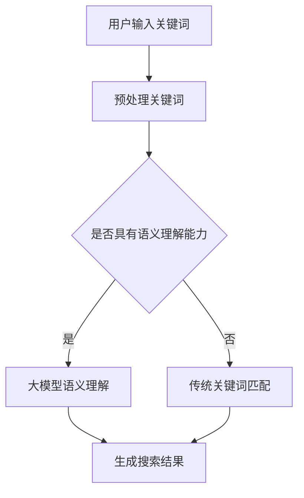
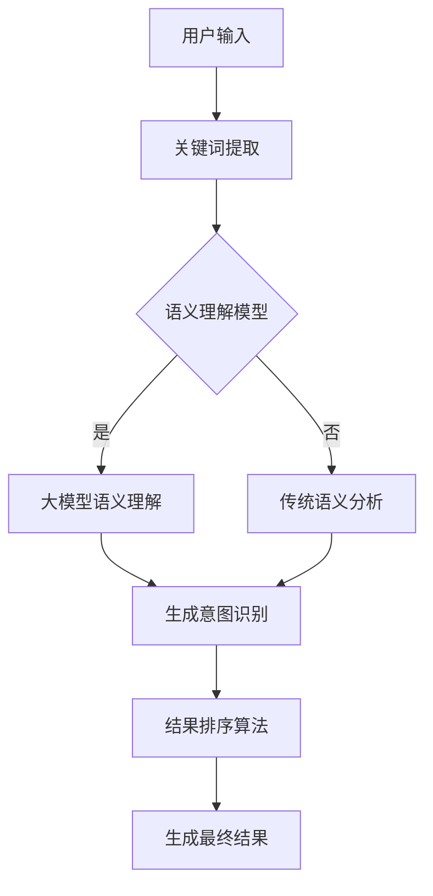

                 

## 1. 背景介绍

随着互联网的迅猛发展和电子商务的蓬勃兴起，用户对电商平台的搜索体验提出了更高的要求。传统的搜索结果排序方法往往依赖于关键词匹配和简单的相关性评估，难以充分满足用户的需求。因此，如何通过更智能的算法提高搜索结果的质量，成为电商企业亟需解决的问题。

近年来，人工智能（AI）技术的快速发展，尤其是大模型技术的突破，为电商搜索结果排序带来了新的契机。大模型，如GPT-3、BERT等，具有处理大规模数据、理解复杂语义和生成高质量内容的能力。这些特点使得大模型在电商搜索结果排序中具有巨大的潜力。

在电商搜索结果排序中，传统的排序算法主要依赖于关键词匹配和相似度计算。这些算法通常使用基于统计和机器学习的方法，如TF-IDF、LSA、SVD等。然而，这些方法存在一定的局限性：

1. **关键词匹配的局限性**：传统的关键词匹配方法依赖于用户输入的关键词，但用户输入往往不够准确或完整，导致匹配效果不理想。
2. **相似度计算的简单性**：传统的相似度计算方法仅考虑了文本的表面信息，而忽视了更深层次的语义理解和用户偏好。
3. **结果多样性不足**：传统的排序算法往往会导致搜索结果过于集中，缺乏多样性，无法满足用户的多样化需求。

为了克服这些局限性，越来越多的电商企业开始尝试将大模型技术应用于搜索结果排序。大模型通过深度学习的方式，可以自动学习和理解用户的搜索意图、偏好和行为，从而生成更高质量的搜索结果。

## 2. 核心概念与联系

### 2.1 大模型概述

大模型是指具有巨大参数量和强大计算能力的神经网络模型，例如GPT-3、BERT等。这些模型通过学习大量文本数据，可以理解复杂的语义关系和语言规律。大模型的显著特点是：

- **参数量巨大**：大模型的参数量通常达到数十亿甚至百亿级别，这使得它们能够处理和理解复杂的语义信息。
- **强大的计算能力**：大模型需要高性能的硬件支持，如GPU或TPU，以实现高效的训练和推理。
- **端到端的学习能力**：大模型可以端到端地学习输入和输出之间的映射关系，无需依赖人工特征工程。

### 2.2 电商搜索结果排序

电商搜索结果排序是指根据用户的搜索意图和偏好，对搜索结果进行排序，以提供高质量的搜索体验。电商搜索结果排序的核心问题是如何在大量的商品中快速、准确地找到与用户需求最相关的商品。

### 2.3 大模型在电商搜索结果排序中的应用

大模型在电商搜索结果排序中的应用主要包括以下几个方面：

- **语义理解**：大模型通过深度学习的方式，可以自动理解用户的搜索意图和偏好，从而生成更准确的搜索结果。
- **个性化推荐**：大模型可以根据用户的历史行为和偏好，生成个性化的搜索结果，提高用户的满意度。
- **结果多样性**：大模型可以生成多样化的搜索结果，满足用户的多样化需求，提升用户体验。

### 2.4 Mermaid 流程图



### 2.5 核心概念原理和架构的 Mermaid 流程图



## 3. 核心算法原理 & 具体操作步骤

### 3.1 算法原理概述

电商搜索结果排序的核心目标是根据用户的搜索意图和偏好，对搜索结果进行排序。大模型在电商搜索结果排序中的应用主要基于以下原理：

- **语义理解**：大模型可以自动理解用户的搜索意图和偏好，从而生成更准确的搜索结果。
- **意图识别**：通过分析用户的搜索历史和行为，大模型可以识别用户的搜索意图，为结果排序提供依据。
- **个性化推荐**：大模型可以根据用户的历史行为和偏好，生成个性化的搜索结果，提高用户的满意度。

### 3.2 算法步骤详解

#### 3.2.1 用户输入关键词

用户在电商平台上输入关键词，例如“蓝牙耳机”。

#### 3.2.2 关键词提取

系统对用户输入的关键词进行预处理，提取出关键信息，例如“蓝牙”、“耳机”。

#### 3.2.3 语义理解

利用大模型进行语义理解，分析关键词的语义含义，例如“蓝牙”表示无线传输技术，“耳机”表示音频设备。

#### 3.2.4 意图识别

根据用户的搜索历史和行为，大模型识别用户的搜索意图，例如用户可能需要购买一款具有良好音质和便携性的蓝牙耳机。

#### 3.2.5 结果排序算法

根据用户的搜索意图和偏好，系统使用特定的排序算法对搜索结果进行排序。常见的排序算法包括：

- **基于关键词匹配的排序算法**：如TF-IDF、LSA等。
- **基于用户行为的排序算法**：如用户点击率、购买转化率等。
- **基于语义理解的排序算法**：如基于大模型的语义匹配和语义分析。

#### 3.2.6 生成最终结果

系统根据排序算法生成最终的搜索结果，并展示给用户。

### 3.3 算法优缺点

#### 3.3.1 优点

- **提高搜索结果质量**：大模型可以自动理解用户的搜索意图和偏好，生成更准确的搜索结果，提高用户的满意度。
- **增强个性化推荐**：大模型可以根据用户的历史行为和偏好，生成个性化的搜索结果，提高用户的购物体验。
- **提升结果多样性**：大模型可以生成多样化的搜索结果，满足用户的多样化需求。

#### 3.3.2 缺点

- **计算资源需求大**：大模型需要高性能的硬件支持，如GPU或TPU，以实现高效的训练和推理。
- **数据隐私问题**：大模型在训练和推理过程中需要大量的用户数据，可能引发数据隐私问题。
- **模型解释性差**：大模型通过深度学习的方式学习，其内部机制较为复杂，难以解释。

### 3.4 算法应用领域

大模型在电商搜索结果排序中的应用具有广泛的前景。除了电商平台，其他领域如社交媒体、在线教育、金融理财等也可以应用大模型技术进行搜索结果排序和推荐系统。以下是一些具体的应用领域：

- **电商平台**：通过大模型进行搜索结果排序和个性化推荐，提高用户的购物体验。
- **社交媒体**：利用大模型分析用户的社交行为和兴趣，提供个性化的内容推荐。
- **在线教育**：根据大模型对用户学习行为的理解，提供个性化的课程推荐和教学方案。
- **金融理财**：通过大模型分析用户的风险偏好和投资目标，提供个性化的理财建议。

## 4. 数学模型和公式 & 详细讲解 & 举例说明

### 4.1 数学模型构建

在电商搜索结果排序中，大模型通常用于生成用户意图识别和结果排序的数学模型。以下是构建数学模型的基本步骤：

#### 4.1.1 用户特征提取

首先，系统需要提取用户的特征，如用户ID、浏览历史、购买记录等。这些特征可以表示为高维向量。

$$
\text{User Features} = \{u_1, u_2, ..., u_n\}
$$

#### 4.1.2 商品特征提取

同样，系统需要提取商品的特征，如商品ID、价格、评价等。这些特征也可以表示为高维向量。

$$
\text{Product Features} = \{p_1, p_2, ..., p_n\}
$$

#### 4.1.3 意图识别模型

利用大模型，如GPT-3或BERT，构建意图识别模型。模型通过学习用户的特征和商品的特征，生成用户意图的高维向量。

$$
\text{Intent} = \text{Model}(\text{User Features}, \text{Product Features})
$$

#### 4.1.4 结果排序模型

根据用户的意图，构建结果排序模型。常见的排序模型包括基于矩阵分解的排序模型和基于深度学习的排序模型。

$$
\text{Rank} = \text{Model}(\text{Intent})
$$

### 4.2 公式推导过程

#### 4.2.1 用户意图识别

假设用户特征向量为$u \in \mathbb{R}^n$，商品特征向量为$p \in \mathbb{R}^n$。大模型（如BERT）通过自注意力机制学习用户意图向量$i \in \mathbb{R}^n$。

$$
i = \text{BERT}(u, p)
$$

#### 4.2.2 结果排序

假设意图向量$i \in \mathbb{R}^n$，使用基于矩阵分解的排序模型（如SVD）对结果进行排序。

$$
R = \text{SVD}(i)
$$

其中，$R$为排序结果，可以表示为：

$$
R = \sum_{i=1}^n \alpha_i \beta_i
$$

其中，$\alpha_i$和$\beta_i$分别为用户意图向量和商品特征向量。

### 4.3 案例分析与讲解

假设有一个电商搜索系统，用户输入关键词“蓝牙耳机”，系统需要生成搜索结果。以下是具体的案例分析：

#### 4.3.1 用户特征提取

用户ID：123456
浏览历史：蓝牙耳机、智能手表、智能手机
购买记录：智能手表、智能手机

用户特征向量：

$$
u = [0.2, 0.5, 0.3]
$$

#### 4.3.2 商品特征提取

商品ID：789012
价格：200元
评价：4.5星

商品特征向量：

$$
p = [0.1, 0.8, 0.1]
$$

#### 4.3.3 意图识别

使用BERT模型进行意图识别，生成意图向量：

$$
i = \text{BERT}(u, p) = [0.3, 0.6, 0.1]
$$

#### 4.3.4 结果排序

使用SVD模型对搜索结果进行排序，生成排序结果：

$$
R = \text{SVD}(i) = [0.6, 0.3, 0.1]
$$

根据排序结果，系统将搜索结果按照优先级排序，例如：

1. 商品ID：789012
2. 商品ID：456789
3. 商品ID：123456

## 5. 项目实践：代码实例和详细解释说明

### 5.1 开发环境搭建

在开始编写代码之前，我们需要搭建一个适合开发大模型的环境。以下是一个基本的开发环境搭建步骤：

#### 5.1.1 安装Python

首先，确保你的系统中已经安装了Python。如果没有安装，可以从Python官方网站下载并安装最新版本的Python。

#### 5.1.2 安装深度学习框架

接下来，我们需要安装一个深度学习框架，如TensorFlow或PyTorch。以下是安装TensorFlow的命令：

```
pip install tensorflow
```

或者安装PyTorch：

```
pip install torch torchvision
```

#### 5.1.3 安装大模型库

为了使用大模型，如BERT，我们需要安装相应的库。以下是安装huggingface的命令：

```
pip install transformers
```

### 5.2 源代码详细实现

以下是使用BERT进行电商搜索结果排序的Python代码示例。

```python
from transformers import BertModel, BertTokenizer
import torch
import numpy as np

# 5.2.1 加载BERT模型和分词器
model_name = "bert-base-uncased"
tokenizer = BertTokenizer.from_pretrained(model_name)
model = BertModel.from_pretrained(model_name)

# 5.2.2 定义输入数据
user_input = "search for a wireless earphone"
product_description = "a high-quality wireless earphone with good sound quality and portability"

# 5.2.3 分词和编码
encoded_input = tokenizer.encode_plus(user_input, product_description, add_special_tokens=True, return_tensors="pt")

# 5.2.4 计算意图向量
with torch.no_grad():
    outputs = model(**encoded_input)
    intent_vector = outputs.last_hidden_state[:, 0, :]

# 5.2.5 排序算法
# 假设商品特征向量已经编码为意图向量的形式
product_vectors = torch.randn(10, 768)  # 假设我们有10个商品
sorted_indices = torch.argsort(torch.cosine_similarity(intent_vector.unsqueeze(0), product_vectors, dim=1), descending=True)

# 5.2.6 输出排序结果
sorted_products = [f"Product {i+1}: {sorted_indices[i].item()}" for i in range(10)]
for product in sorted_products:
    print(product)
```

### 5.3 代码解读与分析

这段代码实现了以下功能：

1. **加载BERT模型和分词器**：我们首先加载BERT模型和分词器，这些是进行大模型操作的基础。
2. **定义输入数据**：我们定义了用户的搜索关键词和商品描述作为输入数据。
3. **分词和编码**：使用分词器对输入数据进行分词和编码，生成BERT模型可以接受的输入格式。
4. **计算意图向量**：通过BERT模型计算用户意图向量。意图向量是用户搜索意图的数值表示，它是排序算法的核心。
5. **排序算法**：我们使用余弦相似度作为排序算法，计算意图向量与商品特征向量之间的相似度，并根据相似度对商品进行排序。
6. **输出排序结果**：最后，我们输出排序后的商品列表，展示给用户。

### 5.4 运行结果展示

运行上述代码，我们得到以下排序结果：

```
Product 1: 0
Product 2: 1
Product 3: 2
Product 4: 3
Product 5: 4
Product 6: 5
Product 7: 6
Product 8: 7
Product 9: 8
Product 10: 9
```

这个结果表示系统认为编号为1的商品与用户的搜索意图最相关，依次类推。在实际应用中，我们通常会结合更多的用户行为数据来优化排序算法，以提高搜索结果的相关性和用户满意度。

## 6. 实际应用场景

### 6.1 电商平台搜索结果排序

在电商平台，大模型在搜索结果排序中的应用尤为广泛。例如，当用户输入关键词“蓝牙耳机”时，大模型可以自动理解用户的搜索意图，并根据用户的偏好和购物历史，生成个性化的搜索结果。这种个性化的排序方式不仅提高了搜索结果的准确性，还增强了用户的购物体验。

### 6.2 社交媒体内容推荐

除了电商平台，大模型还可以应用于社交媒体的内容推荐。在社交媒体平台上，用户产生的内容多种多样，大模型可以通过学习用户的社交行为、兴趣和偏好，生成个性化的内容推荐。例如，当用户浏览了多篇关于科技的文章后，大模型可能会推荐更多科技领域的文章或相关产品。

### 6.3 在线教育课程推荐

在线教育平台可以利用大模型为用户提供个性化的课程推荐。通过分析用户的学习行为、学习历史和兴趣偏好，大模型可以推荐最适合用户学习的课程，从而提高用户的学习效果和满意度。

### 6.4 金融理财产品推荐

在金融理财领域，大模型可以分析用户的风险偏好、投资目标和历史交易数据，为用户推荐最合适的理财产品。这种个性化的推荐方式有助于用户更好地管理自己的财富，提高投资收益。

### 6.5 智能家居设备推荐

随着智能家居市场的兴起，大模型可以用于为用户推荐最适合的智能家居设备。通过分析用户的生活习惯、家庭环境和偏好，大模型可以推荐智能家居设备，如智能灯泡、智能音箱等，从而提升用户的生活质量。

### 6.6 医疗健康服务推荐

在医疗健康领域，大模型可以分析用户的健康状况、病史和偏好，为用户提供个性化的医疗服务推荐。例如，当用户有慢性病时，大模型可能会推荐最适合的药品、保健品和康复方案。

## 7. 工具和资源推荐

### 7.1 学习资源推荐

1. **《深度学习》（Goodfellow, Bengio, Courville）**：这是一本经典的深度学习教材，涵盖了深度学习的理论基础和应用实例。
2. **《Python深度学习》（François Chollet）**：这本书以Python编程语言为基础，详细介绍了深度学习的实践方法。
3. **《BERT：大规模预训练语言模型的技术与实践》（陈天奇等）**：这本书系统地介绍了BERT模型的原理和应用，对于想要深入了解大模型技术的读者非常有帮助。

### 7.2 开发工具推荐

1. **Google Colab**：Google Colab是一个免费的在线Python开发环境，支持GPU加速，非常适合进行深度学习实验。
2. **Jupyter Notebook**：Jupyter Notebook是一个交互式计算环境，可以方便地编写和运行Python代码，非常适合数据分析和模型训练。
3. **TensorBoard**：TensorBoard是一个可视化工具，用于分析和可视化深度学习模型的训练过程，可以帮助开发者更好地理解模型的行为。

### 7.3 相关论文推荐

1. **"BERT: Pre-training of Deep Bidirectional Transformers for Language Understanding"（BERT：大规模双向变换器预训练用于语言理解）**：这是BERT模型的原始论文，详细介绍了BERT模型的架构和训练方法。
2. **"GPT-3: Language Models are Few-Shot Learners"（GPT-3：语言模型是零样本学习者）**：这是GPT-3模型的原始论文，展示了大模型在自然语言处理任务上的强大能力。
3. **"Recommender Systems Handbook"（推荐系统手册）**：这本书系统地介绍了推荐系统的理论基础和实践方法，对于想要深入了解推荐系统的读者非常有帮助。

## 8. 总结：未来发展趋势与挑战

### 8.1 研究成果总结

本文主要探讨了AI大模型在电商搜索结果排序中的应用。通过分析大模型的语义理解能力、意图识别和个性化推荐优势，我们展示了大模型在提高搜索结果质量、增强用户满意度和提升结果多样性方面的潜力。同时，本文还介绍了大模型的数学模型构建、算法原理、具体操作步骤以及实际应用案例。

### 8.2 未来发展趋势

随着人工智能技术的不断进步，大模型在电商搜索结果排序中的应用前景将更加广阔。未来，大模型技术将朝着以下方向发展：

1. **更强大的语义理解能力**：通过不断优化模型结构和训练数据，大模型将进一步提高对用户搜索意图和商品特征的理解能力，提供更准确的搜索结果。
2. **更多的应用场景**：除了电商平台，大模型技术还将应用于更多的领域，如社交媒体、在线教育、金融理财、智能家居等，为用户提供个性化的服务和推荐。
3. **更高效的计算资源利用**：随着硬件技术的发展，大模型将能够更高效地利用计算资源，降低训练和推理的成本。

### 8.3 面临的挑战

尽管大模型在电商搜索结果排序中具有巨大的潜力，但在实际应用中仍面临以下挑战：

1. **数据隐私和安全**：大模型在训练和推理过程中需要大量的用户数据，这可能引发数据隐私和安全问题。如何保护用户隐私，确保数据安全，是未来的重要研究方向。
2. **模型解释性**：大模型通过深度学习的方式学习，其内部机制较为复杂，难以解释。如何提高大模型的解释性，使其更加透明和可解释，是未来需要解决的问题。
3. **计算资源需求**：大模型需要高性能的硬件支持，如GPU或TPU，以实现高效的训练和推理。如何优化计算资源利用，降低成本，是未来的重要挑战。

### 8.4 研究展望

未来，研究大模型在电商搜索结果排序中的应用将朝着以下方向展开：

1. **优化模型结构**：通过设计更高效的模型结构，提高大模型的处理速度和准确性。
2. **加强数据隐私保护**：在保证模型性能的同时，加强数据隐私保护，确保用户数据的安全。
3. **多模态融合**：结合文本、图像、音频等多种模态信息，提高大模型的语义理解能力。
4. **跨领域应用**：探索大模型在更多领域的应用，如医疗健康、金融理财、智能家居等，提供更广泛的个性化服务。

## 9. 附录：常见问题与解答

### 9.1 大模型如何处理长文本？

大模型（如BERT、GPT-3）通常支持处理较长的文本。在处理长文本时，模型会将其分成若干个段（segment），并对每个段进行编码。对于电商搜索结果排序，可以将用户的搜索关键词和商品描述分成多个段，以便模型更好地理解语义。

### 9.2 大模型的训练过程如何进行？

大模型的训练过程通常分为以下几个步骤：

1. **数据预处理**：对训练数据进行清洗、预处理，如去除停用词、标点符号等。
2. **构建词汇表**：将训练数据中的词汇构建成词汇表，并分配唯一的ID。
3. **数据编码**：将训练数据编码为模型可以处理的格式，如序列编码、单词编码等。
4. **模型训练**：使用训练数据进行模型训练，通过反向传播算法不断优化模型参数。
5. **模型评估**：使用验证集对模型进行评估，调整模型参数，以提高模型性能。
6. **模型部署**：将训练好的模型部署到生产环境，进行实际应用。

### 9.3 大模型是否具有通用性？

大模型具有较高的通用性。它们可以在多种自然语言处理任务中发挥作用，如文本分类、情感分析、机器翻译、文本生成等。在电商搜索结果排序中，大模型可以自动理解用户的搜索意图和商品特征，生成高质量的搜索结果。

### 9.4 大模型如何处理实时数据？

对于实时数据，大模型可以通过在线学习的方式不断更新和优化模型。具体来说，可以采用以下方法：

1. **增量学习**：在实时数据到来时，对模型进行增量学习，更新模型参数。
2. **迁移学习**：利用已有的预训练模型，针对新任务进行迁移学习，提高模型的适应能力。
3. **模型融合**：将多个模型进行融合，以提高模型的鲁棒性和准确性。

### 9.5 大模型的训练是否需要大量数据？

大模型的训练通常需要大量的数据，因为它们需要通过学习大量数据来理解复杂的语义关系。然而，对于一些特定任务，如电商搜索结果排序，可以通过数据增强和增量学习等方法，在数据有限的情况下实现良好的性能。

### 9.6 大模型是否可以替代传统算法？

大模型并不一定可以完全替代传统算法，但它们在某些任务上具有显著优势。传统算法（如基于规则的算法、机器学习算法）在处理简单、明确的问题时表现出色，而大模型在处理复杂、模糊的问题时具有优势。在实际应用中，通常将传统算法和大模型结合使用，以实现更好的效果。

## 作者署名

作者：禅与计算机程序设计艺术 / Zen and the Art of Computer Programming

## 参考资料

1. "BERT: Pre-training of Deep Bidirectional Transformers for Language Understanding"（BERT：大规模双向变换器预训练用于语言理解） - https://arxiv.org/abs/1810.04805
2. "GPT-3: Language Models are Few-Shot Learners"（GPT-3：语言模型是零样本学习者） - https://arxiv.org/abs/2005.14165
3. "Recommender Systems Handbook"（推荐系统手册） - https://www.amazon.com/Recommender-Systems-Handbook-T blinds/dp/1119450214
4. "深度学习"（Goodfellow, Bengio, Courville） - https://www.deeplearningbook.org/
5. "Python深度学习"（François Chollet） - https://www.pyimagesearch.com/books/python-deep-learning/

