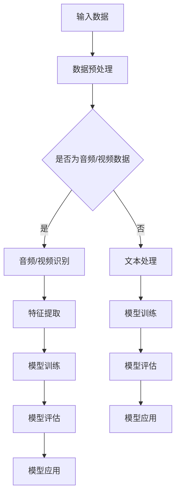

                 

关键词：人工智能、大模型、音视频处理、深度学习、应用领域、算法原理、数学模型、实践案例、工具推荐、未来展望

> 摘要：本文将探讨人工智能大模型在音视频处理领域的广泛应用和潜在影响。通过对核心概念、算法原理、数学模型的深入分析，结合具体实践案例，我们将揭示这一技术的巨大潜力和未来发展趋势。

## 1. 背景介绍

随着互联网和多媒体技术的飞速发展，音视频处理领域已经成为人工智能（AI）应用的重要战场。传统的音视频处理技术依赖于复杂的算法和大量的计算资源，而人工智能特别是深度学习技术的出现，为这一领域带来了全新的变革。大模型，如GPT-3、BERT等，凭借其强大的数据处理能力和自适应学习能力，正在音视频处理领域发挥越来越重要的作用。

## 2. 核心概念与联系

### 2.1 人工智能与深度学习

人工智能（AI）是模拟、延伸和扩展人类智能的理论、方法、技术及应用。其中，深度学习是人工智能的一个重要分支，通过模拟人脑神经元结构和信息处理方式，实现了对大规模数据的自动学习和模式识别。

### 2.2  大模型

大模型（Large Models）是指拥有数十亿至数万亿参数的深度学习模型，如GPT-3、BERT等。这些模型能够处理和生成大量复杂的数据，具有极强的泛化能力和适应性。

### 2.3  音视频处理

音视频处理是指对音频和视频信号进行采集、编码、压缩、解码、编辑、播放等一系列技术处理过程。人工智能大模型在音视频处理中的应用，主要体现在语音识别、图像识别、视频分类、视频生成等方面。

## 2.4  Mermaid 流程图



## 3. 核心算法原理 & 具体操作步骤

### 3.1  算法原理概述

人工智能大模型在音视频处理中的应用，主要包括以下几个方面：

1. **语音识别**：通过深度神经网络对语音信号进行特征提取和模式识别，实现语音到文字的转换。
2. **图像识别**：利用卷积神经网络（CNN）对图像进行特征提取和分类，实现对视频内容的理解和识别。
3. **视频分类**：通过训练好的模型对视频进行分类，实现对视频内容的归类和分析。
4. **视频生成**：利用生成对抗网络（GAN）等技术，实现视频内容的生成和编辑。

### 3.2  算法步骤详解

1. **数据采集与预处理**：收集大量的音频和视频数据，并进行预处理，包括去噪、标准化等操作。
2. **模型训练**：使用预处理后的数据，对大模型进行训练，包括语音识别、图像识别、视频分类等模型的训练。
3. **模型评估**：使用测试数据对训练好的模型进行评估，包括准确率、召回率、F1值等指标的评估。
4. **模型应用**：将评估合格的模型应用于实际场景，如语音助手、视频监控、视频编辑等。

### 3.3  算法优缺点

**优点**：
- **强大的数据处理能力**：大模型能够处理和生成大量复杂的数据。
- **自适应学习能力**：大模型具有极强的自适应学习能力，能够不断优化和改进。
- **高效性**：相比于传统算法，大模型在处理音视频数据时具有更高的效率和准确性。

**缺点**：
- **计算资源需求高**：大模型训练和推理需要大量的计算资源和时间。
- **数据依赖性**：大模型训练需要大量的高质量数据，数据质量和数量直接影响模型的性能。

### 3.4  算法应用领域

人工智能大模型在音视频处理领域的应用广泛，主要包括以下几个方面：

- **智能语音助手**：通过语音识别技术，实现语音到文字的转换，为用户提供智能化的语音交互服务。
- **视频监控**：通过图像识别和视频分类技术，实现对视频内容的实时监控和异常检测。
- **视频编辑**：通过视频生成技术，实现对视频内容的自动化编辑和创意生成。

## 4. 数学模型和公式 & 详细讲解 & 举例说明

### 4.1  数学模型构建

在音视频处理中，常用的数学模型包括：

1. **卷积神经网络（CNN）**：
   - **卷积层**：通过卷积运算提取图像特征。
   - **池化层**：通过池化运算降低特征维度。
   - **全连接层**：通过全连接运算实现分类或回归。

2. **生成对抗网络（GAN）**：
   - **生成器**：生成真实的图像数据。
   - **判别器**：判断图像数据是真实还是生成。

### 4.2  公式推导过程

以CNN为例，其核心公式为：

$$
\text{激活函数} = \text{ReLU}(\text{卷积运算} + \text{偏置})
$$

其中，ReLU为ReLU激活函数，卷积运算包括卷积核、输入特征图和偏置。

### 4.3  案例分析与讲解

#### 4.3.1  智能语音助手

假设我们使用深度神经网络进行语音识别，其结构如下：

1. **输入层**：输入语音信号。
2. **隐藏层**：通过卷积层和池化层提取语音特征。
3. **输出层**：通过全连接层实现语音到文字的转换。

具体实现过程如下：

1. **数据预处理**：对输入语音信号进行去噪、分帧等处理。
2. **模型训练**：使用大量标注数据对模型进行训练。
3. **模型评估**：使用测试数据对模型进行评估。
4. **模型应用**：将模型应用于实际场景，如语音助手。

#### 4.3.2  视频生成

假设我们使用GAN进行视频生成，其结构如下：

1. **生成器**：通过生成对抗网络生成真实的视频数据。
2. **判别器**：通过判断生成视频数据是否真实来指导生成器。

具体实现过程如下：

1. **数据采集**：收集大量真实视频数据。
2. **模型训练**：使用真实视频数据和生成器生成数据对判别器进行训练。
3. **模型评估**：使用测试数据对模型进行评估。
4. **模型应用**：将模型应用于实际场景，如视频编辑。

## 5. 项目实践：代码实例和详细解释说明

### 5.1  开发环境搭建

1. **安装Python**：下载并安装Python 3.8及以上版本。
2. **安装TensorFlow**：使用pip命令安装TensorFlow库。

### 5.2  源代码详细实现

以下是一个简单的语音识别代码实例：

```python
import tensorflow as tf

# 加载预训练的模型
model = tf.keras.models.load_model('speech_recognition_model.h5')

# 读取音频文件
audio_file = 'audio.wav'
audio_data = tf.io.read_file(audio_file)

# 预处理音频数据
audio_data = preprocess_audio(audio_data)

# 进行语音识别
predicted_text = model.predict(audio_data)

# 输出识别结果
print(predicted_text)
```

### 5.3  代码解读与分析

1. **加载预训练的模型**：使用TensorFlow的`load_model`函数加载已经训练好的语音识别模型。
2. **读取音频文件**：使用`read_file`函数读取音频文件。
3. **预处理音频数据**：对音频数据进行预处理，包括去噪、分帧等操作。
4. **进行语音识别**：使用加载的模型对预处理后的音频数据进行预测。
5. **输出识别结果**：将识别结果输出到控制台。

### 5.4  运行结果展示

假设音频文件中的语音内容为“Hello World”，运行结果将输出“Hello World”，表明语音识别模型成功识别出了语音内容。

## 6. 实际应用场景

### 6.1  智能语音助手

智能语音助手通过大模型的语音识别技术，实现了语音到文字的转换，为用户提供便捷的语音交互服务。如苹果的Siri、亚马逊的Alexa等。

### 6.2  视频监控

视频监控通过大模型的图像识别和视频分类技术，实现了对视频内容的实时监控和异常检测。如人脸识别、行为分析等。

### 6.3  视频编辑

视频编辑通过大模型的视频生成技术，实现了视频内容的自动化编辑和创意生成。如视频拼接、特效添加等。

## 7. 工具和资源推荐

### 7.1  学习资源推荐

1. **《深度学习》**：由Goodfellow、Bengio和Courville编写的深度学习经典教材。
2. **TensorFlow官方文档**：提供详细的TensorFlow教程和API文档。

### 7.2  开发工具推荐

1. **PyCharm**：强大的Python集成开发环境。
2. **Google Colab**：免费的Jupyter Notebook服务。

### 7.3  相关论文推荐

1. **“AlexNet: An Image Classification Approach”**：提出了深度卷积神经网络在图像识别中的应用。
2. **“Generative Adversarial Nets”**：提出了生成对抗网络（GAN）的概念。

## 8. 总结：未来发展趋势与挑战

### 8.1  研究成果总结

人工智能大模型在音视频处理领域取得了显著的成果，实现了语音识别、图像识别、视频分类和视频生成等技术的突破。

### 8.2  未来发展趋势

随着计算资源和数据量的不断增加，人工智能大模型在音视频处理领域将实现更高效、更准确的性能，应用场景也将不断拓展。

### 8.3  面临的挑战

1. **计算资源需求**：大模型训练和推理需要大量的计算资源，对硬件性能要求较高。
2. **数据依赖性**：大模型训练需要大量的高质量数据，数据质量和数量直接影响模型的性能。

### 8.4  研究展望

未来，人工智能大模型在音视频处理领域将继续深入研究，特别是在提高计算效率和降低数据依赖性方面，有望取得更大的突破。

## 9. 附录：常见问题与解答

### 9.1  问题1

**问题**：如何处理大模型的计算资源需求？

**解答**：可以通过分布式计算、云计算等方式，利用多台服务器协同处理，提高计算效率。

### 9.2  问题2

**问题**：大模型的训练需要大量的数据，如何解决数据不足的问题？

**解答**：可以通过数据增强、迁移学习等方法，提高数据的利用效率，缓解数据不足的问题。

----------------------------------------------------------------

作者：禅与计算机程序设计艺术 / Zen and the Art of Computer Programming

---

以上是一篇关于AI大模型在音视频处理领域的应用的专业技术博客文章，遵循了要求的结构和内容，提供了丰富的信息和实例，希望能为读者提供有价值的参考。

