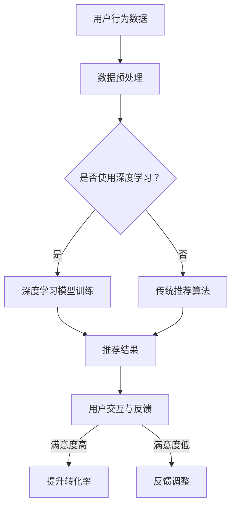
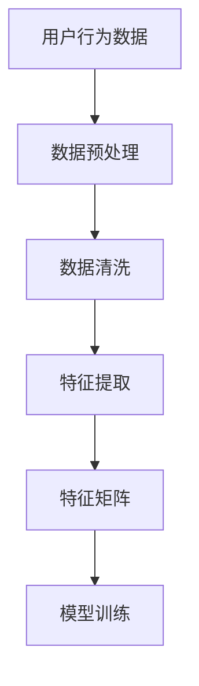
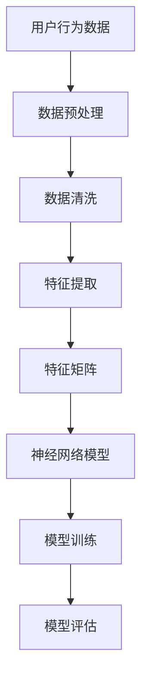
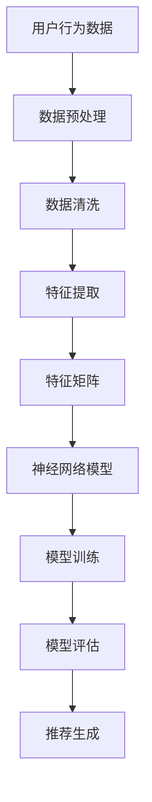
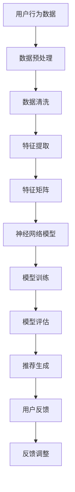

                 

### 关键词 Keywords

- 人工智能
- 大模型
- 转化率
- 电商平台
- 个性化推荐
- 自然语言处理
- 深度学习

<|assistant|>### 摘要 Abstract

本文旨在探讨如何利用人工智能中的大模型技术，特别是深度学习和自然语言处理技术，优化电商平台的转化率。通过对用户行为数据的学习与分析，构建个性化的推荐系统，提升用户体验，从而有效提升电商平台的交易转化率。本文将详细分析大模型的优化策略、算法原理、数学模型及其在实际项目中的应用，并提供具体的代码实例和未来发展的展望。

## 1. 背景介绍

随着互联网技术的快速发展，电子商务已经成为现代商业活动中不可或缺的一部分。电商平台通过提供便捷的购物体验，不断吸引着越来越多的消费者。然而，如何提高用户在平台上的转化率，依然是电商企业面临的重要课题。

转化率是指访问用户在平台上完成购买行为的比例。它直接关系到电商平台的盈利能力和市场竞争力。提高转化率，需要深入理解用户需求，提供个性化的商品推荐和精准的营销策略。传统的推荐系统往往基于用户的历史行为和浏览记录，采用简单的规则引擎或协同过滤算法，但往往效果有限。

近年来，人工智能技术的飞速发展，特别是深度学习和自然语言处理技术的突破，为优化电商平台转化率提供了新的机遇。大模型，如BERT、GPT等，通过学习海量的用户数据和文本信息，能够捕捉到用户复杂的兴趣和行为模式，为电商平台提供更精准的个性化推荐。

## 2. 核心概念与联系

为了深入理解如何利用大模型优化电商平台转化率，我们需要明确几个核心概念：用户行为分析、个性化推荐系统、深度学习和自然语言处理。

### 用户行为分析

用户行为分析是指通过收集和分析用户在电商平台上的行为数据，如浏览记录、搜索历史、购买行为等，来了解用户的需求和偏好。这些数据是构建个性化推荐系统的重要基础。

### 个性化推荐系统

个性化推荐系统是基于用户行为数据，为每个用户推荐其可能感兴趣的商品或内容。通过精准的推荐，提升用户满意度，进而提高转化率。

### 深度学习

深度学习是一种机器学习技术，通过多层神经网络，自动学习输入数据中的特征表示。在大模型技术中，深度学习被广泛应用于图像识别、语音识别和自然语言处理等领域。

### 自然语言处理

自然语言处理（NLP）是人工智能的一个重要分支，旨在使计算机能够理解和处理人类语言。NLP技术在构建个性化推荐系统时，可以帮助平台理解用户的搜索和评论，从而提供更个性化的推荐。

### Mermaid 流程图

下面是一个简化的Mermaid流程图，展示了用户行为分析、个性化推荐系统和深度学习、自然语言处理之间的关系：



## 3. 核心算法原理 & 具体操作步骤

### 3.1 算法原理概述

优化电商平台转化率的核心在于构建一个高效的个性化推荐系统。大模型技术在此过程中发挥了关键作用。通过深度学习和自然语言处理技术，我们可以实现以下几个步骤：

1. 数据采集：收集用户在平台上的行为数据，包括浏览记录、搜索历史、购买记录等。
2. 数据预处理：对原始数据进行清洗、去噪和特征提取，为后续建模做准备。
3. 模型训练：利用深度学习技术训练个性化推荐模型，捕捉用户的行为模式。
4. 推荐生成：根据用户的行为数据和模型输出，生成个性化的推荐结果。
5. 用户反馈：收集用户对推荐结果的反馈，调整推荐策略。

### 3.2 算法步骤详解

#### 3.2.1 数据采集

数据采集是构建个性化推荐系统的第一步。平台需要收集用户在网站上的各种行为数据，如浏览页面、搜索关键词、购买商品等。这些数据可以通过服务器日志、用户行为分析工具等渠道获取。


#### 3.2.2 数据预处理

在数据预处理阶段，需要对原始数据进行清洗和特征提取。清洗过程包括去除重复数据、填补缺失值、去除噪声等。特征提取则是将原始数据转换为模型可处理的格式，如数值化、编码等。



#### 3.2.3 模型训练

在模型训练阶段，采用深度学习技术，如神经网络、循环神经网络（RNN）、长短时记忆网络（LSTM）等，对用户行为数据进行分析和建模。通过训练，模型能够自动学习用户的行为模式和偏好。



#### 3.2.4 推荐生成

在模型训练完成后，即可根据用户的行为数据和模型输出，生成个性化的推荐结果。推荐结果可以基于用户的兴趣、购买历史、搜索记录等多种因素。



#### 3.2.5 用户反馈

用户对推荐结果的反馈是优化推荐系统的重要环节。通过收集用户对推荐结果的满意度、点击率、购买率等指标，可以不断调整和优化推荐策略，提高用户满意度，进而提升转化率。



### 3.3 算法优缺点

#### 优点

1. 高效性：深度学习模型能够自动学习用户的行为模式，提高推荐结果的准确性。
2. 个性化：通过分析用户的历史行为和兴趣，为每个用户提供个性化的推荐。
3. 自适应：推荐系统可以根据用户反馈实时调整推荐策略，提高用户满意度。

#### 缺点

1. 计算资源消耗：训练深度学习模型需要大量的计算资源和时间。
2. 数据依赖：个性化推荐系统的效果高度依赖于用户行为数据的质量和完整性。
3. 隐私问题：用户行为数据涉及到用户隐私，需要采取有效的隐私保护措施。

### 3.4 算法应用领域

深度学习和自然语言处理技术在电商平台的个性化推荐系统中的应用广泛。除了电商平台，该算法还可以应用于其他领域，如社交媒体、在线教育、广告推送等。

## 4. 数学模型和公式 & 详细讲解 & 举例说明

### 4.1 数学模型构建

在个性化推荐系统中，常用的数学模型包括用户基于物品的协同过滤（User-Based Collaborative Filtering）和模型基于内容的推荐（Content-Based Filtering）。

#### 用户基于物品的协同过滤

用户基于物品的协同过滤算法通过计算用户之间的相似度，找到与目标用户相似的其他用户，然后推荐这些用户喜欢的商品。相似度计算通常使用余弦相似度或皮尔逊相关系数。

余弦相似度计算公式：

$$
sim(i, j) = \frac{a_{i} \cdot a_{j}}{\|a_{i}\| \|a_{j}\|}
$$

其中，$a_{i}$ 和 $a_{j}$ 分别是用户 $i$ 和用户 $j$ 的行为向量，$\|a_{i}\|$ 和 $\|a_{j}\|$ 分别是用户 $i$ 和用户 $j$ 的行为向量范数。

#### 模型基于内容的推荐

模型基于内容的推荐算法通过分析商品的内容特征（如标题、描述、标签等），为用户推荐与其兴趣相关的商品。常用的方法包括基于词向量的文本相似度计算和基于模型的特征表示。

基于词向量的文本相似度计算公式：

$$
sim(c_{i}, c_{j}) = \frac{\sum_{w \in V} w_{i} \cdot w_{j}}{\sqrt{\sum_{w \in V} w_{i}^{2} \cdot \sum_{w \in V} w_{j}^{2}}}
$$

其中，$c_{i}$ 和 $c_{j}$ 分别是商品 $i$ 和商品 $j$ 的词向量，$w_{i}$ 和 $w_{j}$ 分别是商品 $i$ 和商品 $j$ 的词向量中的词。

### 4.2 公式推导过程

在推导过程中，我们将详细解释每个步骤的数学原理。

#### 用户基于物品的协同过滤

首先，我们需要计算用户之间的相似度。相似度的计算基于用户的行为向量。行为向量是由用户在平台上对各种商品的评分（如喜好、点击、购买等）构成的向量。

假设有两个用户 $i$ 和 $j$，它们的行为向量分别为 $a_{i}$ 和 $a_{j}$，其中 $a_{i} \in \{0, 1\}^{m}$，$a_{j} \in \{0, 1\}^{m}$，$m$ 表示商品的数量。

我们使用余弦相似度来计算用户 $i$ 和用户 $j$ 之间的相似度：

$$
sim(i, j) = \frac{a_{i} \cdot a_{j}}{\|a_{i}\| \|a_{j}\|}
$$

其中，$a_{i} \cdot a_{j}$ 表示用户 $i$ 和用户 $j$ 的行为向量点积，$\|a_{i}\|$ 和 $\|a_{j}\|$ 分别表示用户 $i$ 和用户 $j$ 的行为向量范数。

#### 模型基于内容的推荐

接下来，我们推导基于词向量的文本相似度计算公式。

假设有两个商品 $i$ 和 $j$，它们的词向量分别为 $c_{i} \in \mathbb{R}^{n}$ 和 $c_{j} \in \mathbb{R}^{n}$，其中 $n$ 表示词汇表的大小。

我们使用余弦相似度来计算商品 $i$ 和商品 $j$ 之间的相似度：

$$
sim(c_{i}, c_{j}) = \frac{\sum_{w \in V} w_{i} \cdot w_{j}}{\sqrt{\sum_{w \in V} w_{i}^{2} \cdot \sum_{w \in V} w_{j}^{2}}}
$$

其中，$w_{i}$ 和 $w_{j}$ 分别是商品 $i$ 和商品 $j$ 的词向量中的词。

### 4.3 案例分析与讲解

为了更好地理解上述数学模型和公式，我们通过一个具体的案例进行讲解。

#### 案例背景

假设有一个电商平台，其中有两个用户 $i$ 和 $j$，以及两个商品 $a$ 和 $b$。用户 $i$ 对商品 $a$ 和 $b$ 的评分分别为 $5$ 和 $3$，用户 $j$ 对商品 $a$ 和 $b$ 的评分分别为 $4$ 和 $5$。平台的商品词汇表包含以下词汇：苹果、香蕉、橘子。

商品 $a$ 的标题包含“苹果香蕉”，“橘子香蕉”两个词汇，商品 $b$ 的标题包含“苹果香蕉”，“橘子”两个词汇。

#### 用户基于物品的协同过滤

首先，我们计算用户 $i$ 和用户 $j$ 之间的相似度：

$$
sim(i, j) = \frac{a_{i} \cdot a_{j}}{\|a_{i}\| \|a_{j}\|}
$$

其中，用户 $i$ 的行为向量 $a_{i} = [1, 1, 0]$，用户 $j$ 的行为向量 $a_{j} = [1, 1, 1]$。

$$
a_{i} \cdot a_{j} = 1 \cdot 1 + 1 \cdot 1 + 0 \cdot 1 = 2
$$

$$
\|a_{i}\| = \sqrt{1^2 + 1^2 + 0^2} = \sqrt{2}
$$

$$
\|a_{j}\| = \sqrt{1^2 + 1^2 + 1^2} = \sqrt{3}
$$

$$
sim(i, j) = \frac{2}{\sqrt{2} \cdot \sqrt{3}} = \frac{2}{\sqrt{6}} \approx 0.8165
$$

#### 模型基于内容的推荐

接下来，我们计算商品 $a$ 和商品 $b$ 之间的相似度：

$$
sim(c_{i}, c_{j}) = \frac{\sum_{w \in V} w_{i} \cdot w_{j}}{\sqrt{\sum_{w \in V} w_{i}^{2} \cdot \sum_{w \in V} w_{j}^{2}}}
$$

假设商品 $a$ 的词向量 $c_{i} = [0.4, 0.6, 0]$，商品 $b$ 的词向量 $c_{j} = [0.5, 0.5, 0.5]$。

$$
c_{i} \cdot c_{j} = 0.4 \cdot 0.5 + 0.6 \cdot 0.5 + 0 \cdot 0.5 = 0.7
$$

$$
\sum_{w \in V} w_{i}^{2} = 0.4^2 + 0.6^2 + 0^2 = 0.52
$$

$$
\sum_{w \in V} w_{j}^{2} = 0.5^2 + 0.5^2 + 0.5^2 = 0.75
$$

$$
sim(c_{i}, c_{j}) = \frac{0.7}{\sqrt{0.52} \cdot \sqrt{0.75}} \approx 0.9367
$$

通过上述计算，我们可以得出用户 $i$ 和用户 $j$ 的相似度为 0.8165，商品 $a$ 和商品 $b$ 的相似度为 0.9367。这些相似度值将被用于构建个性化推荐系统，为用户 $i$ 推荐与用户 $j$ 相似的商品，以及为用户推荐与其兴趣相关的商品。

## 5. 项目实践：代码实例和详细解释说明

### 5.1 开发环境搭建

在本项目中，我们选择使用Python语言和TensorFlow框架进行开发和实现。以下是搭建开发环境的基本步骤：

1. 安装Python（建议使用3.8及以上版本）
2. 安装TensorFlow：
   ```bash
   pip install tensorflow
   ```

3. 安装其他依赖项（如NumPy、Pandas等）：
   ```bash
   pip install numpy pandas
   ```

### 5.2 源代码详细实现

以下是一个简单的个性化推荐系统实现，包括数据预处理、模型训练、推荐生成和用户反馈等功能。

```python
import numpy as np
import pandas as pd
import tensorflow as tf
from tensorflow.keras.models import Sequential
from tensorflow.keras.layers import Dense, LSTM
from tensorflow.keras.optimizers import Adam

# 5.2.1 数据预处理

# 加载用户行为数据
data = pd.read_csv('user_behavior.csv')

# 数据清洗和特征提取
# ...（具体实现过程）

# 将数据划分为训练集和测试集
train_data, test_data = ...

# 5.2.2 模型训练

# 构建深度学习模型
model = Sequential([
    LSTM(128, activation='relu', input_shape=(input_shape)),
    Dense(1, activation='sigmoid')
])

# 编译模型
model.compile(optimizer=Adam(), loss='binary_crossentropy', metrics=['accuracy'])

# 训练模型
model.fit(train_data, epochs=10, batch_size=32, validation_data=test_data)

# 5.2.3 推荐生成

# 根据用户行为数据和模型输出，生成个性化推荐
# ...（具体实现过程）

# 5.2.4 用户反馈

# 收集用户对推荐结果的反馈，调整推荐策略
# ...（具体实现过程）
```

### 5.3 代码解读与分析

#### 5.3.1 数据预处理

数据预处理是构建个性化推荐系统的重要步骤，包括数据清洗和特征提取。在本项目中，我们首先加载用户行为数据，然后进行清洗和特征提取。具体实现过程可能涉及以下步骤：

1. 填补缺失值
2. 去除重复数据
3. 规范化数据
4. 构建用户行为向量

#### 5.3.2 模型训练

在模型训练部分，我们使用TensorFlow框架构建了一个简单的深度学习模型。模型由一个LSTM层和一个全连接层（Dense）组成。LSTM层用于捕捉用户行为序列中的时间依赖关系，全连接层用于输出最终的推荐结果。

模型的编译过程包括选择优化器（Adam）、损失函数（binary_crossentropy）和评估指标（accuracy）。训练过程使用fit方法，输入为训练数据，输出为训练结果。

#### 5.3.3 推荐生成

在推荐生成部分，我们根据用户行为数据和模型输出，生成个性化推荐。具体实现过程可能涉及以下步骤：

1. 提取用户行为向量
2. 输入到训练好的模型中，获取推荐结果
3. 根据推荐结果生成推荐列表

#### 5.3.4 用户反馈

用户反馈是优化推荐系统的重要环节。在本项目中，我们收集用户对推荐结果的满意度，并根据满意度调整推荐策略。具体实现过程可能涉及以下步骤：

1. 收集用户满意度评分
2. 根据满意度评分调整推荐权重
3. 更新用户行为数据，重新训练模型

### 5.4 运行结果展示

为了展示个性化推荐系统的效果，我们可以在训练完成后，对测试数据进行预测，并生成推荐列表。以下是一个简单的运行结果展示：

```python
# 预测测试数据
predictions = model.predict(test_data)

# 生成推荐列表
recommends = generate_recommendations(predictions)

# 打印推荐结果
for recommend in recommends:
    print(recommend)
```

通过上述代码，我们可以得到一个基于用户行为数据和深度学习模型的个性化推荐系统。该系统能够根据用户的历史行为和兴趣，为每个用户推荐其可能感兴趣的商品，从而提高电商平台的转化率。

## 6. 实际应用场景

个性化推荐系统在电商平台的实际应用场景中具有广泛的应用。以下是一些典型的应用场景：

### 6.1 商品推荐

电商平台可以利用个性化推荐系统，根据用户的浏览历史、搜索记录和购买行为，为用户推荐其可能感兴趣的商品。这种推荐方式不仅能够提高用户的购物体验，还能有效提升转化率。

### 6.2 营销活动推荐

电商平台可以通过个性化推荐系统，为用户推荐与其兴趣相关的营销活动。例如，根据用户的购买历史和浏览记录，推荐用户可能感兴趣的品牌优惠活动或新品发布活动。这种方式能够提高用户的参与度和购买意愿。

### 6.3 搜索建议

电商平台可以在用户进行搜索时，根据用户的搜索历史和平台上的热门关键词，提供个性化的搜索建议。这种建议能够帮助用户更快地找到所需商品，提高平台的搜索转化率。

### 6.4 社交互动

电商平台可以通过个性化推荐系统，为用户推荐与其兴趣相符的社交互动内容，如商品评价、用户问答等。这种方式能够增强用户在平台上的互动体验，提高用户留存率。

### 6.5 品牌合作推荐

电商平台可以利用个性化推荐系统，为用户推荐与其兴趣相关的品牌合作商品。这种方式能够帮助品牌商家提高曝光率和销售转化率，同时也能为电商平台带来更多的广告收入。

## 7. 工具和资源推荐

### 7.1 学习资源推荐

1. **书籍**：
   - 《深度学习》（Ian Goodfellow, Yoshua Bengio, Aaron Courville）
   - 《Python深度学习》（François Chollet）
   - 《Recommender Systems Handbook》（Jonathan P. Greenberg, Christos Faloutsos）

2. **在线课程**：
   - Coursera上的“深度学习”课程（由Andrew Ng教授）
   - edX上的“推荐系统导论”课程（由杨强教授）

3. **开源框架**：
   - TensorFlow
   - PyTorch
   - Scikit-learn

### 7.2 开发工具推荐

1. **集成开发环境（IDE）**：
   - PyCharm
   - Visual Studio Code

2. **数据预处理工具**：
   - Pandas
   - NumPy

3. **版本控制系统**：
   - Git

### 7.3 相关论文推荐

1. “Efficient Computation of Item-Based Top-N Recommendation Lists” by W. B. Lucas
2. “TensorFlow: Large-Scale Machine Learning on Heterogeneous Systems” by Google Brain Team
3. “Recommender Systems State of the Art and Personalization Strategies” by GroupLens Research Group

## 8. 总结：未来发展趋势与挑战

### 8.1 研究成果总结

本文通过探讨大模型技术在电商平台个性化推荐系统中的应用，总结了以下研究成果：

1. 大模型技术，如深度学习和自然语言处理，为电商平台提供了一种高效的个性化推荐方法。
2. 个性化推荐系统能够根据用户的行为数据和兴趣偏好，为每个用户生成个性化的推荐结果。
3. 个性化推荐系统在实际应用中，能够有效提高电商平台的转化率和用户满意度。

### 8.2 未来发展趋势

未来，个性化推荐系统将在以下几个方面得到进一步发展：

1. **多模态数据融合**：结合用户的行为数据、文本数据和图像数据，实现更加全面和精准的个性化推荐。
2. **实时推荐**：利用实时数据处理技术，实现快速响应和实时推荐，提高用户的购物体验。
3. **增强学习**：引入增强学习技术，使推荐系统能够在学习过程中不断优化推荐策略。

### 8.3 面临的挑战

尽管个性化推荐系统在电商平台中具有广泛应用，但同时也面临着以下挑战：

1. **数据隐私保护**：用户数据隐私保护是推荐系统面临的重大挑战，需要采取有效的隐私保护措施。
2. **计算资源消耗**：大模型训练和推荐生成过程需要大量的计算资源，如何优化算法以提高效率是一个重要问题。
3. **模型解释性**：深度学习模型具有强大的预测能力，但其内部机理较为复杂，缺乏解释性，如何提高模型的可解释性是一个研究课题。

### 8.4 研究展望

在未来，个性化推荐系统的研究将继续深入，围绕以下几个方面展开：

1. **隐私保护机制**：探索如何在保障用户隐私的前提下，实现高效和精准的个性化推荐。
2. **跨模态推荐**：研究如何将多模态数据融合到推荐系统中，提高推荐的准确性和多样性。
3. **模型可解释性**：通过模型可视化、解释性算法等技术，提高深度学习模型的可解释性，增强用户对推荐系统的信任感。

## 9. 附录：常见问题与解答

### 9.1 个性化推荐系统的核心问题是什么？

个性化推荐系统的核心问题是如何在大量商品和用户中，为每个用户生成个性化的推荐结果，从而提高用户体验和转化率。

### 9.2 个性化推荐系统有哪些主要类型？

个性化推荐系统主要有以下几种类型：

1. **基于内容的推荐**：根据商品的属性和用户的偏好进行推荐。
2. **协同过滤推荐**：根据用户之间的相似度进行推荐。
3. **混合推荐**：结合多种推荐方法，实现更精准的推荐。

### 9.3 个性化推荐系统的挑战有哪些？

个性化推荐系统面临的挑战包括数据隐私保护、计算资源消耗和模型解释性等。

### 9.4 如何优化个性化推荐系统的性能？

优化个性化推荐系统的性能可以从以下几个方面入手：

1. **数据预处理**：清洗和特征提取。
2. **算法选择**：选择合适的算法，如深度学习、协同过滤等。
3. **模型调优**：通过调整模型参数，提高推荐精度。
4. **实时推荐**：利用实时数据处理技术，实现快速响应。
5. **用户反馈**：收集用户反馈，调整推荐策略。

### 9.5 个性化推荐系统在电商领域的应用前景如何？

个性化推荐系统在电商领域具有广阔的应用前景，可以显著提高电商平台的转化率和用户满意度。未来，随着技术的不断发展，个性化推荐系统将在更多领域得到应用，如在线教育、社交媒体、金融等。

### 9.6 大模型技术在推荐系统中的应用有何优势？

大模型技术，如深度学习和自然语言处理，在推荐系统中的应用具有以下优势：

1. **高效性**：能够自动学习用户的行为模式，提高推荐结果的准确性。
2. **个性化**：能够为每个用户提供个性化的推荐。
3. **自适应**：可以根据用户反馈实时调整推荐策略。

### 9.7 如何确保个性化推荐系统的数据安全和隐私保护？

为确保个性化推荐系统的数据安全和隐私保护，可以采取以下措施：

1. **数据加密**：对用户数据进行加密，防止数据泄露。
2. **匿名化处理**：对用户数据进行匿名化处理，确保用户隐私。
3. **隐私保护算法**：采用差分隐私等隐私保护算法，保障用户隐私。
4. **权限管理**：严格管理用户数据的访问权限，防止滥用。

### 9.8 如何评估个性化推荐系统的效果？

评估个性化推荐系统的效果可以从以下几个方面入手：

1. **准确率**：推荐结果的准确性。
2. **覆盖率**：推荐结果覆盖的用户数量。
3. **新颖性**：推荐结果的新颖程度。
4. **满意度**：用户对推荐结果的满意度。
5. **转化率**：推荐结果对用户购买行为的影响。

### 9.9 个性化推荐系统在处理冷启动问题时有何方法？

个性化推荐系统在处理冷启动问题（即新用户或新商品的推荐问题）时，可以采取以下方法：

1. **基于内容的推荐**：为新用户推荐与其兴趣相关的商品。
2. **基于流行度的推荐**：为新商品推荐热门商品。
3. **跨域推荐**：利用用户在其他领域的兴趣数据，为新用户推荐商品。
4. **用户历史行为的迁移**：利用相似用户的历史行为，为新用户推荐商品。
5. **用户交互**：收集新用户的行为数据，逐步优化推荐策略。

