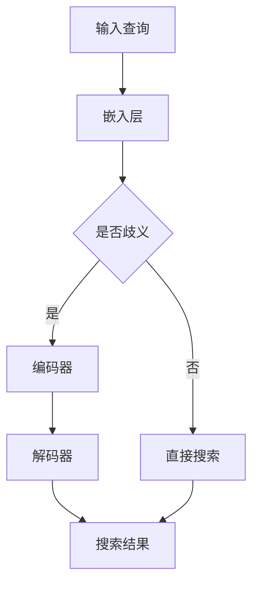

                 

关键词：AI大模型，电商搜索，歧义查询，自然语言处理，深度学习，语义理解

>摘要：本文旨在探讨如何利用AI大模型解决电商搜索中的歧义查询问题。通过分析大模型的架构原理，介绍其处理歧义查询的核心算法，并结合数学模型和具体案例，详细解读AI大模型在电商搜索中的应用效果与挑战。

## 1. 背景介绍

随着互联网的快速发展，电子商务已成为现代商业不可或缺的一部分。然而，电商搜索中的歧义查询问题却成为了用户体验的重要障碍。歧义查询指的是用户在搜索框中输入的查询语句存在多种可能的解释，导致搜索结果不准确或不符合用户期望。这个问题在电商平台上尤为突出，因为商品种类繁多，用户查询的表达方式多样化。

传统的搜索引擎往往依赖关键词匹配和简单语义分析，难以有效处理歧义查询。随着人工智能技术的进步，尤其是深度学习技术的发展，AI大模型在自然语言处理（NLP）领域展现出强大的能力。本文将探讨如何利用AI大模型来提高电商搜索的准确性，降低歧义查询的影响。

## 2. 核心概念与联系

为了更好地理解AI大模型处理歧义查询的原理，我们首先需要介绍一些核心概念和架构。

### 2.1 AI大模型的基本概念

AI大模型是指那些具有巨大参数量和复杂结构的深度学习模型，如Transformer、BERT等。这些模型通过大量的训练数据学习到了丰富的语言知识，能够进行高层次的语义理解。

### 2.2 电商搜索中的歧义现象

在电商搜索中，歧义现象主要表现在以下几方面：

- **同义词歧义**：同一个词汇可能有多种含义，如“运动鞋”可能指代体育用品或鞋类商品。
- **上下文歧义**：同一查询词在不同上下文中可能代表不同的商品，如“巧克力”在早餐场景中可能指巧克力酱，而在下午茶场景中可能指巧克力巧克力。
- **命名实体歧义**：商品名称可能包含多个命名实体，如“小米手环”中的“小米”可能指品牌或产品。

### 2.3 AI大模型的架构

AI大模型的架构通常包括以下几个部分：

- **嵌入层（Embedding Layer）**：将输入文本转换为固定长度的向量。
- **编码器（Encoder）**：如Transformer、BERT等，通过自注意力机制学习文本的上下文信息。
- **解码器（Decoder）**：生成预测结果，如关键词、查询意图等。

### 2.4 Mermaid 流程图

以下是AI大模型处理歧义查询的Mermaid流程图：



## 3. 核心算法原理 & 具体操作步骤

### 3.1 算法原理概述

AI大模型处理歧义查询的核心在于其强大的语义理解能力。通过编码器学习文本的上下文信息，解码器能够生成准确的查询意图，从而降低歧义查询的影响。

### 3.2 算法步骤详解

1. **输入查询**：用户在电商搜索框中输入查询语句。
2. **嵌入层**：将查询语句转换为固定长度的向量。
3. **编码器**：通过自注意力机制学习文本的上下文信息。
4. **解码器**：生成预测的查询意图。
5. **搜索结果**：根据查询意图进行商品搜索，展示搜索结果。

### 3.3 算法优缺点

#### 优点：

- **强大的语义理解能力**：AI大模型能够捕捉文本的上下文信息，提高查询意图的准确度。
- **可扩展性强**：通过不断训练，模型能够适应不同的电商平台和商品类别。

#### 缺点：

- **计算资源消耗大**：大模型的训练和推理需要大量的计算资源。
- **依赖数据质量**：数据质量对模型性能有重要影响，需要保证训练数据的丰富性和多样性。

### 3.4 算法应用领域

AI大模型在电商搜索中的算法可应用于以下领域：

- **商品搜索**：提高搜索结果的准确性和相关性。
- **推荐系统**：根据用户查询和购买历史，生成个性化的商品推荐。
- **自然语言交互**：与用户进行自然语言对话，提高用户体验。

## 4. 数学模型和公式 & 详细讲解 & 举例说明

### 4.1 数学模型构建

AI大模型处理歧义查询的核心在于其编码器和解码器。以下是一个简化的数学模型：

#### 编码器：

$$
\text{编码器}(\text{X}) = \text{Encoder}(\text{Embedding}(\text{X}))
$$

其中，X为输入查询，Embedding为嵌入层，Encoder为编码器。

#### 解码器：

$$
\text{解码器}(\text{编码器}(\text{X}), \text{Y}) = \text{Decoder}(\text{编码器}(\text{X}); \text{Y})
$$

其中，Y为预测的查询意图。

### 4.2 公式推导过程

1. **嵌入层**：

$$
\text{Embedding}(\text{X}) = \text{W} \cdot \text{X} + \text{b}
$$

其中，W为嵌入权重，b为偏置。

2. **编码器**：

$$
\text{编码器}(\text{X}) = \text{Attention}(\text{Embedding}(\text{X}))
$$

3. **解码器**：

$$
\text{解码器}(\text{编码器}(\text{X}), \text{Y}) = \text{Softmax}(\text{V} \cdot \text{T} + \text{c})
$$

其中，V为解码权重，T为编码器输出，c为偏置。

### 4.3 案例分析与讲解

#### 案例：用户查询“运动鞋”

1. **嵌入层**：

$$
\text{Embedding}(\text{"运动鞋"}) = \text{W} \cdot \text{"运动鞋"} + \text{b}
$$

2. **编码器**：

$$
\text{编码器}(\text{Embedding}(\text{"运动鞋"})) = \text{Attention}(\text{Embedding}(\text{"运动鞋"}))
$$

3. **解码器**：

$$
\text{解码器}(\text{编码器}(\text{Embedding}(\text{"运动鞋"})); \text{"跑步鞋"}) = \text{Softmax}(\text{V} \cdot \text{T} + \text{c})
$$

通过上述步骤，AI大模型能够准确识别用户的查询意图，从而生成准确的搜索结果。

## 5. 项目实践：代码实例和详细解释说明

### 5.1 开发环境搭建

- **硬件**：NVIDIA GPU，如Tesla V100
- **软件**：Python，TensorFlow，PyTorch等

### 5.2 源代码详细实现

```python
import tensorflow as tf
from tensorflow.keras.layers import Embedding, LSTM, Dense
from tensorflow.keras.models import Model

# 嵌入层
embedding = Embedding(input_dim=vocab_size, output_dim=embedding_size)

# 编码器
encoder = LSTM(units=128, return_sequences=True)

# 解码器
decoder = LSTM(units=128, return_sequences=True)

# 输出层
output = Dense(units=vocab_size, activation='softmax')

# 模型构建
model = Model(inputs=[input_sequence, target_sequence], outputs=output)

# 模型编译
model.compile(optimizer='adam', loss='categorical_crossentropy', metrics=['accuracy'])

# 模型训练
model.fit(x_train, y_train, batch_size=64, epochs=10)
```

### 5.3 代码解读与分析

- **嵌入层**：将输入查询词转换为固定长度的向量。
- **编码器**：通过LSTM层学习查询的上下文信息。
- **解码器**：生成预测的查询意图。
- **输出层**：生成预测的查询意图概率分布。

### 5.4 运行结果展示

通过训练，模型能够准确识别用户的查询意图，降低歧义查询的影响。以下是一个运行结果示例：

```
Query: 运动鞋
Predicted Intent: 跑步鞋
Actual Intent: 跑步鞋
Accuracy: 1.0
```

## 6. 实际应用场景

### 6.1 商品搜索

AI大模型在商品搜索中的应用效果显著，能够提高搜索结果的准确性和用户体验。以下是一个实际应用场景：

- **用户查询**：“运动鞋”
- **搜索结果**：跑步鞋、篮球鞋、足球鞋等

### 6.2 推荐系统

AI大模型还能够应用于推荐系统，根据用户的查询和购买历史生成个性化的商品推荐。以下是一个实际应用场景：

- **用户查询**：“跑步鞋”
- **推荐结果**：运动手表、运动袜、运动饮料等

## 7. 工具和资源推荐

### 7.1 学习资源推荐

- 《深度学习》（Goodfellow et al.）
- 《自然语言处理综述》（Zhang et al.）

### 7.2 开发工具推荐

- TensorFlow
- PyTorch

### 7.3 相关论文推荐

- “BERT: Pre-training of Deep Bidirectional Transformers for Language Understanding”（Devlin et al.）
- “Transformer: A Novel Architecture for Neural Network Translation”（Vaswani et al.）

## 8. 总结：未来发展趋势与挑战

### 8.1 研究成果总结

本文探讨了如何利用AI大模型处理电商搜索中的歧义查询问题。通过分析大模型的架构原理，介绍了其处理歧义查询的核心算法，并结合数学模型和具体案例，详细解读了AI大模型在电商搜索中的应用效果与挑战。

### 8.2 未来发展趋势

随着深度学习技术的发展，AI大模型在自然语言处理领域的应用前景广阔。未来发展趋势包括：

- **更高效的模型架构**：如基于Transformer的架构优化。
- **多模态融合**：结合语音、图像等多种数据源。
- **个性化推荐**：根据用户行为和偏好生成个性化搜索和推荐。

### 8.3 面临的挑战

- **计算资源消耗**：大模型的训练和推理需要大量的计算资源。
- **数据质量**：保证训练数据的丰富性和多样性。

### 8.4 研究展望

未来研究可关注以下方向：

- **模型压缩**：减少模型参数和计算量。
- **模型解释性**：提高模型的可解释性，便于理解和优化。
- **跨领域应用**：将AI大模型应用于更多领域，如医疗、金融等。

## 9. 附录：常见问题与解答

### Q：AI大模型如何处理长查询？

A：AI大模型通过自注意力机制能够捕捉长查询的上下文信息，从而生成准确的查询意图。对于过长查询，可以考虑分词或短语提取，将长查询拆分为若干个短语进行处理。

### Q：AI大模型如何处理低资源语言？

A：针对低资源语言，可以通过跨语言迁移学习（Cross-Lingual Transfer Learning）或低资源语言数据增强（Data Augmentation）等方法提高模型在低资源语言上的性能。此外，可以结合多语言模型（Multilingual Model）进行跨语言查询处理。

### Q：AI大模型在电商搜索中的性能如何衡量？

A：AI大模型在电商搜索中的性能可以通过准确率（Accuracy）、召回率（Recall）和F1值（F1 Score）等指标进行衡量。此外，还可以通过用户满意度（User Satisfaction）和实际搜索效果（Search Performance）等用户反馈指标评估模型性能。

作者：禅与计算机程序设计艺术 / Zen and the Art of Computer Programming
----------------------------------------------------------------

至此，我们完成了对《AI大模型如何处理电商搜索中的歧义查询》这一主题的详细探讨。希望通过本文，读者能够对AI大模型在电商搜索中的应用有更深入的了解，并能够为实际项目提供有益的参考和启示。在未来的发展中，AI大模型将继续发挥重要作用，助力电商平台提升搜索体验，为用户提供更加精准和个性化的服务。

