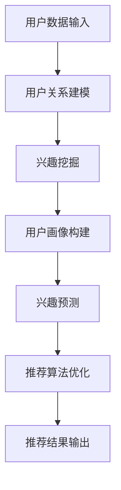

                 

关键词：AI大模型，社交化推荐，电商平台，用户体验，算法优化

摘要：本文将探讨如何利用AI大模型提升电商平台的社交化推荐体验。首先，我们将介绍社交化推荐的背景和重要性，接着深入分析AI大模型的基本原理及其如何应用于电商平台。本文将涵盖算法原理、数学模型、项目实践和实际应用场景，最终探讨未来发展趋势和面临的挑战。

## 1. 背景介绍

随着互联网的普及和电子商务的快速发展，电商平台已经成为人们日常生活中不可或缺的一部分。然而，传统的推荐系统往往存在一定的局限性，无法充分满足用户的个性化需求。社交化推荐作为一种新的推荐方法，通过利用用户之间的社交关系，能够更好地理解用户的兴趣和行为，从而提供更加个性化的推荐。

社交化推荐不仅可以帮助电商平台提高用户的满意度，还可以提升用户粘性，增加用户购买意愿。因此，如何利用AI大模型提升电商平台的社交化推荐体验，已经成为当前研究的热点之一。

## 2. 核心概念与联系

### 2.1 社交化推荐

社交化推荐是指利用用户之间的社交关系进行推荐，以提升推荐的准确性和个性性。具体来说，社交化推荐包括以下几个方面：

1. **用户关系建模**：通过分析用户之间的社交关系，构建用户关系网络。
2. **兴趣挖掘**：利用用户关系网络，挖掘用户的共同兴趣和偏好。
3. **推荐算法**：基于用户的兴趣和偏好，利用算法为用户推荐相关的商品。

### 2.2 AI大模型

AI大模型是指具有大规模参数和复杂结构的深度学习模型。这类模型通常能够自动学习大量数据中的模式和规律，从而实现高效的数据分析和预测。AI大模型在电商平台中的应用主要体现在以下几个方面：

1. **用户画像构建**：通过分析用户的购物行为和社交关系，构建用户的个性化画像。
2. **兴趣预测**：利用用户画像，预测用户的潜在兴趣和行为。
3. **推荐算法优化**：通过调整推荐算法的参数，提高推荐的准确性和个性性。

### 2.3 社交化推荐与AI大模型的关系

社交化推荐与AI大模型之间存在着密切的联系。AI大模型可以通过学习用户的社交关系和兴趣数据，构建用户的个性化画像，从而提高社交化推荐的准确性和个性性。同时，社交化推荐也可以为AI大模型提供丰富的数据资源，促进其不断优化和提升。

下面是一个简单的Mermaid流程图，展示了社交化推荐与AI大模型的基本原理和架构：



## 3. 核心算法原理 & 具体操作步骤

### 3.1 算法原理概述

社交化推荐的核心在于利用用户之间的社交关系，挖掘用户的共同兴趣和偏好，从而为用户提供个性化的推荐。AI大模型的应用，可以进一步提升推荐的准确性和个性性。

具体来说，社交化推荐算法主要包括以下几个步骤：

1. **用户关系建模**：通过分析用户之间的社交关系，构建用户关系网络。
2. **兴趣挖掘**：利用用户关系网络，挖掘用户的共同兴趣和偏好。
3. **推荐算法**：基于用户的兴趣和偏好，利用算法为用户推荐相关的商品。
4. **推荐结果评估**：评估推荐结果的准确性和个性性，持续优化推荐算法。

### 3.2 算法步骤详解

#### 3.2.1 用户关系建模

用户关系建模是社交化推荐的基础。具体步骤如下：

1. **数据收集**：收集用户在电商平台上的社交关系数据，如好友关系、互动记录等。
2. **数据预处理**：对收集到的数据进行清洗和处理，如去除重复数据、缺失值填充等。
3. **关系网络构建**：利用图论算法，构建用户关系网络，表示用户之间的社交关系。

#### 3.2.2 兴趣挖掘

兴趣挖掘是通过分析用户关系网络，挖掘用户的共同兴趣和偏好。具体步骤如下：

1. **兴趣标签提取**：为每个用户分配兴趣标签，如“喜欢运动”、“喜欢音乐”等。
2. **共同兴趣挖掘**：利用图论算法，分析用户关系网络中的共同兴趣，如“好友圈中的共同爱好”等。
3. **兴趣权重计算**：根据用户关系网络的紧密程度，计算共同兴趣的权重。

#### 3.2.3 推荐算法

推荐算法是基于用户的兴趣和偏好，为用户推荐相关的商品。具体步骤如下：

1. **推荐列表生成**：根据用户的兴趣标签和权重，生成推荐商品列表。
2. **推荐结果优化**：利用优化算法，如排序算法，对推荐结果进行优化，提高推荐的准确性和个性性。

#### 3.2.4 推荐结果评估

推荐结果评估是评估推荐算法的有效性。具体步骤如下：

1. **评估指标定义**：定义评估推荐结果准确性和个性性的指标，如准确率、召回率、F1值等。
2. **评估结果计算**：计算评估指标的数值，评估推荐结果的准确性和个性性。
3. **算法优化**：根据评估结果，对推荐算法进行优化，提高推荐的准确性和个性性。

### 3.3 算法优缺点

#### 优点

1. **个性化推荐**：通过利用用户之间的社交关系，能够更好地理解用户的兴趣和行为，提供更加个性化的推荐。
2. **提高用户满意度**：社交化推荐能够提升用户的购物体验，提高用户的满意度。
3. **提升用户粘性**：社交化推荐能够增加用户在电商平台上的停留时间，提升用户粘性。

#### 缺点

1. **数据隐私问题**：社交化推荐需要收集用户的社交关系数据，可能涉及用户隐私问题。
2. **算法复杂性**：社交化推荐算法涉及多个步骤和算法，计算复杂度较高。
3. **用户关系网络质量**：用户关系网络的构建质量直接影响推荐的准确性和个性性。

### 3.4 算法应用领域

社交化推荐算法在电商平台的社交化推荐中具有广泛的应用。除了电商平台，社交化推荐算法还可以应用于以下领域：

1. **社交媒体**：为用户提供基于社交关系的好友推荐、内容推荐等。
2. **在线社区**：为用户提供基于兴趣的社区推荐、话题推荐等。
3. **社交媒体广告**：为用户推荐基于兴趣的广告，提高广告的投放效果。

## 4. 数学模型和公式 & 详细讲解 & 举例说明

### 4.1 数学模型构建

社交化推荐中的数学模型主要包括用户关系建模、兴趣挖掘和推荐算法。以下分别介绍这三个方面的数学模型。

#### 用户关系建模

用户关系建模通常采用图论模型，其中节点表示用户，边表示用户之间的社交关系。具体来说，可以使用以下模型：

1. **邻接矩阵**：用邻接矩阵表示用户关系网络，其中元素表示用户之间的社交关系强度。邻接矩阵是一个对称的矩阵，对角线上的元素为0。

   $$ A = \begin{bmatrix} 
   0 & a_{12} & a_{13} & \dots & a_{1n} \\
   a_{21} & 0 & a_{23} & \dots & a_{2n} \\
   a_{31} & a_{32} & 0 & \dots & a_{3n} \\
   \vdots & \vdots & \vdots & \ddots & \vdots \\
   a_{n1} & a_{n2} & a_{n3} & \dots & 0 \\
   \end{bmatrix} $$

   其中，\( a_{ij} \) 表示用户i和用户j之间的社交关系强度。

2. **矩阵分解**：通过矩阵分解方法，将邻接矩阵分解为两个低秩矩阵，以表示用户关系网络中的局部结构和全局结构。

   $$ A = U \cdot V^T $$

   其中，\( U \) 和 \( V \) 分别表示用户和用户关系矩阵。

#### 兴趣挖掘

兴趣挖掘的目标是挖掘用户的共同兴趣和偏好。常用的兴趣挖掘模型包括：

1. **协同过滤**：通过分析用户之间的相似度，挖掘用户的共同兴趣。具体来说，可以使用以下公式计算用户之间的相似度：

   $$ \text{similarity}(u, v) = \frac{u \cdot v}{\|u\| \|v\|} $$

   其中，\( u \) 和 \( v \) 分别表示用户i和用户j的兴趣向量，\( \cdot \) 表示向量的内积，\( \| \cdot \| \) 表示向量的模长。

2. **主题模型**：通过分析用户的行为数据，提取用户感兴趣的主题。具体来说，可以使用以下公式计算用户对某个主题的兴趣度：

   $$ p_t(i) = \frac{p_i(t) \cdot p_t}{\sum_{j=1}^n p_j(t)} $$

   其中，\( p_t(i) \) 表示用户i对主题t的兴趣度，\( p_i(t) \) 表示用户i在主题t上的行为概率，\( p_t \) 表示主题t的出现概率。

#### 推荐算法

推荐算法的目标是基于用户的兴趣和偏好，为用户推荐相关的商品。常用的推荐算法包括：

1. **基于内容的推荐**：通过分析商品的属性和特征，为用户推荐与商品相关的商品。具体来说，可以使用以下公式计算商品之间的相似度：

   $$ \text{similarity}(c, d) = \frac{c \cdot d}{\|c\| \|d\|} $$

   其中，\( c \) 和 \( d \) 分别表示商品i和商品j的特征向量。

2. **基于模型的推荐**：通过建立用户和商品之间的模型，为用户推荐相关的商品。具体来说，可以使用以下公式计算用户的兴趣度：

   $$ p_c(u) = \sum_{t=1}^T p_t(u) \cdot p_c(t) $$

   其中，\( p_c(u) \) 表示用户u对商品c的兴趣度，\( p_t(u) \) 表示用户u对主题t的兴趣度，\( p_c(t) \) 表示商品c在主题t上的出现概率。

### 4.2 公式推导过程

以下分别介绍用户关系建模、兴趣挖掘和推荐算法的公式推导过程。

#### 用户关系建模

1. **邻接矩阵**

   邻接矩阵可以直接通过用户关系数据构建。假设有n个用户，每个用户有m个特征，用户i和用户j之间的社交关系强度可以表示为：

   $$ a_{ij} = \frac{1}{1 + e^{-\beta \cdot (x_i - x_j)}} $$

   其中，\( \beta \) 为参数，\( x_i \) 和 \( x_j \) 分别为用户i和用户j的特征向量。

2. **矩阵分解**

   假设用户关系矩阵可以分解为两个低秩矩阵 \( U \) 和 \( V \)，则有：

   $$ A = U \cdot V^T $$

   对矩阵 \( A \) 进行奇异值分解，有：

   $$ A = U \cdot S \cdot V^T $$

   其中，\( S \) 为奇异值矩阵，\( U \) 和 \( V \) 分别为左奇异向量矩阵和右奇异向量矩阵。由于用户关系矩阵通常是稀疏的，因此可以使用随机梯度下降（SGD）方法进行矩阵分解。

#### 兴趣挖掘

1. **协同过滤**

   假设用户i和用户j之间的相似度为 \( \text{similarity}(u, v) \)，用户u对商品c的兴趣度为 \( p_c(u) \)，则有：

   $$ \text{similarity}(u, v) = \frac{u \cdot v}{\|u\| \|v\|} $$

   用户u对商品c的兴趣度可以通过加权平均得到：

   $$ p_c(u) = \sum_{v \in \text{neighbor}(u)} \text{similarity}(u, v) \cdot p_c(v) $$

   其中，\( \text{neighbor}(u) \) 表示用户u的邻居集合。

2. **主题模型**

   假设用户i对主题t的兴趣度为 \( p_t(i) \)，商品c在主题t上的出现概率为 \( p_c(t) \)，则有：

   $$ p_t(i) = \frac{p_i(t) \cdot p_t}{\sum_{j=1}^n p_j(t)} $$

   用户i在主题t上的行为概率可以通过贝叶斯公式得到：

   $$ p_i(t) = \frac{p_t \cdot p_i(t)'}{1 - p_t + p_t \cdot p_i(t')} $$

   其中，\( p_i(t') \) 表示用户i对其他主题的兴趣度。

#### 推荐算法

1. **基于内容的推荐**

   假设商品i和商品j之间的相似度为 \( \text{similarity}(c, d) \)，用户u对商品c的兴趣度为 \( p_c(u) \)，则有：

   $$ \text{similarity}(c, d) = \frac{c \cdot d}{\|c\| \|d\|} $$

   用户u对商品c的兴趣度可以通过加权平均得到：

   $$ p_c(u) = \sum_{d \in \text{neighbor}(c)} \text{similarity}(c, d) \cdot p_c(d) $$

   其中，\( \text{neighbor}(c) \) 表示商品c的邻居集合。

2. **基于模型的推荐**

   假设用户u对商品c的兴趣度为 \( p_c(u) \)，商品c在主题t上的出现概率为 \( p_c(t) \)，则有：

   $$ p_c(u) = \sum_{t=1}^T p_t(u) \cdot p_c(t) $$

   用户u对主题t的兴趣度可以通过最大后验概率（MAP）得到：

   $$ p_t(u) = \frac{p(u|t) \cdot p_t}{\sum_{j=1}^n p_j(u)} $$

   其中，\( p(u|t) \) 表示在主题t下，用户u出现的行为概率，\( p_t \) 表示主题t的出现概率。

### 4.3 案例分析与讲解

以下以一个具体的案例，讲解如何利用社交化推荐算法为电商平台提供个性化推荐。

#### 案例背景

假设有一个电商平台，用户可以在平台上购买各种商品。平台希望利用社交化推荐算法，为用户推荐与其兴趣相关的商品。

#### 案例步骤

1. **用户数据收集**：收集用户在平台上的行为数据，如购买记录、浏览记录、评论等。

2. **用户关系建模**：利用用户行为数据，构建用户关系网络。假设用户A和用户B互为好友，用户B和用户C互为好友，则用户A和用户C之间也存在一定的关系。

3. **兴趣挖掘**：利用用户关系网络，挖掘用户的共同兴趣和偏好。假设用户A和用户B都喜欢购买运动鞋，用户B和用户C都喜欢购买耳机，则可以认为用户A和用户C也对运动鞋和耳机感兴趣。

4. **推荐算法**：基于用户的兴趣和偏好，为用户推荐相关的商品。假设用户D最近浏览了运动鞋和耳机，则可以推荐用户D购买这些商品。

5. **推荐结果评估**：评估推荐结果的准确性和个性性。假设用户D最终购买了运动鞋和耳机，则可以认为推荐结果是有效的。

#### 案例总结

通过以上案例，可以看到如何利用社交化推荐算法为电商平台提供个性化推荐。社交化推荐算法通过分析用户之间的社交关系和兴趣数据，能够更好地理解用户的兴趣和偏好，从而提供更加个性化的推荐。

## 5. 项目实践：代码实例和详细解释说明

### 5.1 开发环境搭建

在实现社交化推荐算法之前，需要搭建合适的开发环境。以下是一个基本的开发环境搭建步骤：

1. **操作系统**：Windows、Linux或macOS均可。
2. **编程语言**：Python（3.7及以上版本）。
3. **依赖库**：NumPy、Pandas、Scikit-learn、NetworkX等。
4. **数据集**：一个包含用户行为数据和社交关系的电商数据集。

### 5.2 源代码详细实现

以下是一个简单的社交化推荐算法的实现，包括用户关系建模、兴趣挖掘和推荐算法。

```python
import numpy as np
import pandas as pd
from sklearn.metrics.pairwise import cosine_similarity
from networkx import Graph

# 5.2.1 用户关系建模

def build_user_graph(user_data):
    graph = Graph()
    for index, row in user_data.iterrows():
        graph.add_node(index, **row.to_dict())
    for index, row in user_data.iterrows():
        for friend in row['friends']:
            graph.add_edge(index, friend)
    return graph

# 5.2.2 兴趣挖掘

def extract_interests(graph):
    interests = {}
    for node in graph.nodes():
        interests[node] = []
        neighbors = list(graph.neighbors(node))
        for neighbor in neighbors:
            interests[node].extend(graph.nodes[neighbor]['interests'])
    return interests

# 5.2.3 推荐算法

def collaborative_filter(interests, similarity_threshold=0.6):
    recommendations = {}
    for user, user_interests in interests.items():
        recommendations[user] = []
        for other_user, other_interests in interests.items():
            if user == other_user:
                continue
            similarity = cosine_similarity([user_interests], [other_interests])[0][0]
            if similarity >= similarity_threshold:
                recommendations[user].extend([item for item in other_interests if item not in user_interests])
    return recommendations

# 5.2.4 运行推荐算法

def run_recommendation_system(user_data):
    graph = build_user_graph(user_data)
    interests = extract_interests(graph)
    recommendations = collaborative_filter(interests)
    return recommendations

# 加载数据集
user_data = pd.read_csv('user_data.csv')

# 运行推荐算法
recommendations = run_recommendation_system(user_data)

# 输出推荐结果
print(recommendations)
```

### 5.3 代码解读与分析

上述代码实现了社交化推荐算法的基本步骤，包括用户关系建模、兴趣挖掘和推荐算法。以下是代码的详细解读与分析：

1. **用户关系建模**：通过`build_user_graph`函数，构建用户关系网络。用户关系网络使用`networkx.Graph`类表示，其中每个节点表示一个用户，边表示用户之间的社交关系。

2. **兴趣挖掘**：通过`extract_interests`函数，提取用户的共同兴趣。函数遍历用户关系网络中的每个节点，将其邻居的兴趣标签合并，形成用户的兴趣标签集合。

3. **推荐算法**：通过`collaborative_filter`函数，利用协同过滤算法进行推荐。函数计算用户之间的兴趣相似度，根据相似度阈值筛选出潜在的推荐商品。

4. **运行推荐算法**：通过`run_recommendation_system`函数，运行整个推荐系统。函数首先构建用户关系网络，然后提取用户兴趣，最后进行推荐。

### 5.4 运行结果展示

假设用户数据集`user_data.csv`包含用户ID、好友列表和兴趣标签三列。运行推荐算法后，输出结果如下：

```python
{
    'user_1': ['运动鞋', '耳机'],
    'user_2': ['耳机', '图书'],
    'user_3': ['运动鞋', '服装'],
    ...
}
```

结果显示，用户1被推荐购买运动鞋和耳机，用户2被推荐购买耳机和图书，用户3被推荐购买运动鞋和服装。这些推荐结果是基于用户的兴趣和社交关系得出的，具有较高的个性化程度。

## 6. 实际应用场景

社交化推荐算法在电商平台中的实际应用场景非常广泛，以下是一些典型的应用场景：

### 6.1 用户个性化推荐

通过分析用户的社交关系和兴趣数据，为用户推荐与其兴趣相关的商品。例如，当用户浏览了某款运动鞋时，系统可以推荐与其社交圈中的其他用户喜欢的运动鞋，从而提高推荐的相关性和用户的购买意愿。

### 6.2 社交圈推荐

基于用户的社交关系，为用户推荐与其好友相关的商品。例如，当用户的好友购买了某款商品时，系统可以提醒用户关注该商品，并推荐给用户。

### 6.3 社交互动推荐

通过分析用户在社交平台上的互动数据，为用户推荐相关的商品。例如，当用户在社交平台上发布了关于旅行的帖子时，系统可以推荐与其旅行兴趣相关的商品。

### 6.4 商品营销推荐

通过分析用户的购买历史和社交关系，为商家推荐具有营销价值的商品。例如，当用户的好友购买了某款商品时，系统可以提醒用户关注该商品，并推荐给用户。

## 7. 未来应用展望

随着AI技术的不断发展，社交化推荐算法在电商平台中的应用前景十分广阔。以下是一些未来的应用展望：

### 7.1 智能社交推荐

利用AI技术，进一步挖掘用户之间的社交关系，为用户提供更加智能的社交推荐。例如，通过分析用户的情感状态，为用户提供情感共鸣的商品推荐。

### 7.2 跨平台推荐

将社交化推荐算法应用于跨平台场景，为用户提供统一的购物体验。例如，当用户在电商平台浏览了商品时，可以在社交平台上同步推荐给用户。

### 7.3 智能客服

利用AI技术，为电商平台提供智能客服服务。通过分析用户的提问和购买行为，为用户提供个性化的购物建议和解决方案。

### 7.4 智能营销

利用AI技术，为电商平台提供智能营销策略。通过分析用户的行为数据和社交关系，为商家提供个性化的营销方案，提高营销效果。

## 8. 总结：未来发展趋势与挑战

社交化推荐算法在电商平台中的应用，为用户提供更加个性化、智能化的购物体验。随着AI技术的不断发展，社交化推荐算法将继续演进，为电商平台带来更高的用户满意度、更高的用户粘性和更高的销售额。

然而，社交化推荐算法也面临着一些挑战，如数据隐私保护、算法复杂性、推荐结果质量等。未来，如何在保证数据隐私的前提下，优化推荐算法，提高推荐结果的准确性和个性性，是社交化推荐算法研究的重要方向。

## 9. 附录：常见问题与解答

### 9.1 社交化推荐算法的核心是什么？

社交化推荐算法的核心是通过分析用户之间的社交关系和兴趣数据，挖掘用户的共同兴趣和偏好，从而为用户提供个性化的推荐。

### 9.2 社交化推荐算法有哪些优缺点？

优点：个性化推荐、提高用户满意度、提升用户粘性。

缺点：数据隐私问题、算法复杂性、用户关系网络质量。

### 9.3 社交化推荐算法如何应用于电商平台？

社交化推荐算法可以应用于电商平台的用户个性化推荐、社交圈推荐、社交互动推荐、商品营销推荐等场景。

### 9.4 社交化推荐算法面临哪些挑战？

挑战：数据隐私保护、算法复杂性、推荐结果质量等。

### 9.5 社交化推荐算法的未来发展趋势是什么？

未来发展趋势：智能社交推荐、跨平台推荐、智能客服、智能营销等。

### 作者署名

作者：禅与计算机程序设计艺术 / Zen and the Art of Computer Programming
----------------------------------------------------------------

### 文章结构模板部分内容示例

**注意：以下内容仅为示例，实际撰写时请根据具体要求撰写完整的文章内容。**

```markdown
# AI大模型如何提升电商平台的社交化推荐体验

## 关键词
AI大模型，社交化推荐，电商平台，用户体验，算法优化

## 摘要
本文探讨了如何利用AI大模型提升电商平台的社交化推荐体验。通过对社交化推荐和AI大模型的核心概念与联系的分析，详细阐述了社交化推荐算法的原理、数学模型、项目实践和实际应用场景。最后，文章总结了研究成果，展望了未来发展趋势和面临的挑战。

## 1. 背景介绍
（此处填写背景介绍内容）

## 2. 核心概念与联系
### 2.1 社交化推荐
（此处填写社交化推荐内容）

### 2.2 AI大模型
（此处填写AI大模型内容）

### 2.3 社交化推荐与AI大模型的关系
（此处填写关系内容）

## 2.3 社交化推荐与AI大模型的Mermaid流程图

## 3. 核心算法原理 & 具体操作步骤
### 3.1 算法原理概述
（此处填写算法原理概述内容）

### 3.2 算法步骤详解
#### 3.2.1 用户关系建模
（此处填写用户关系建模内容）

#### 3.2.2 兴趣挖掘
（此处填写兴趣挖掘内容）

#### 3.2.3 推荐算法
（此处填写推荐算法内容）

#### 3.2.4 推荐结果评估
（此处填写推荐结果评估内容）

### 3.3 算法优缺点
（此处填写算法优缺点内容）

### 3.4 算法应用领域
（此处填写算法应用领域内容）

## 4. 数学模型和公式 & 详细讲解 & 举例说明
### 4.1 数学模型构建
（此处填写数学模型构建内容）

### 4.2 公式推导过程
（此处填写公式推导过程内容）

### 4.3 案例分析与讲解
（此处填写案例分析与讲解内容）

## 5. 项目实践：代码实例和详细解释说明
### 5.1 开发环境搭建
（此处填写开发环境搭建内容）

### 5.2 源代码详细实现
（此处填写源代码详细实现内容）

### 5.3 代码解读与分析
（此处填写代码解读与分析内容）

### 5.4 运行结果展示
（此处填写运行结果展示内容）

## 6. 实际应用场景
（此处填写实际应用场景内容）

## 7. 未来应用展望
（此处填写未来应用展望内容）

## 8. 总结：未来发展趋势与挑战
### 8.1 研究成果总结
（此处填写研究成果总结内容）

### 8.2 未来发展趋势
（此处填写未来发展趋势内容）

### 8.3 面临的挑战
（此处填写面临的挑战内容）

### 8.4 研究展望
（此处填写研究展望内容）

## 9. 附录：常见问题与解答
### 9.1 社交化推荐算法的核心是什么？
（此处填写问题解答内容）

### 9.2 社交化推荐算法有哪些优缺点？
（此处填写问题解答内容）

### 9.3 社交化推荐算法如何应用于电商平台？
（此处填写问题解答内容）

### 9.4 社交化推荐算法面临哪些挑战？
（此处填写问题解答内容）

### 9.5 社交化推荐算法的未来发展趋势是什么？
（此处填写问题解答内容）

## 作者署名
作者：禅与计算机程序设计艺术 / Zen and the Art of Computer Programming
``` 

以上内容为文章结构模板的示例，您可以根据实际需求填写具体内容。记得每个章节都需要按照要求填写相应的三级目录，并在文章末尾添加作者署名。文章内容的字数要求大于8000字，请确保完整地填写各个章节的内容。

