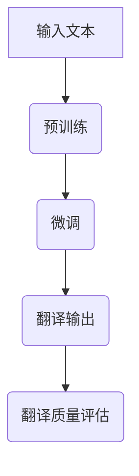

                 

关键词：AI大模型、电商平台、跨境语言翻译、提升质量

摘要：随着全球化进程的加速，电商平台的国际化发展已成为必然趋势。然而，跨境交易的复杂性和语言障碍使得提升翻译质量成为关键问题。本文将探讨如何利用AI大模型来提升电商平台的跨境语言翻译质量，包括核心概念与联系、核心算法原理、数学模型、项目实践及未来展望。

## 1. 背景介绍

跨境电商平台的快速发展带来了巨大的市场机遇，但同时也带来了新的挑战。语言障碍是其中最显著的问题之一，不同国家和地区之间的语言差异使得商品描述、用户评论等内容的翻译变得至关重要。传统的翻译方法往往依赖于规则驱动或基于统计的机器翻译（MT），但这些方法在面对复杂、多样化的电商平台内容时往往效果不佳。因此，引入AI大模型来提升翻译质量成为了一项紧迫的任务。

## 2. 核心概念与联系

### 2.1 AI大模型概述

AI大模型是指具有数百万甚至数十亿参数的深度学习模型，例如Transformer模型、BERT模型等。这些模型通过大量的数据训练，能够捕获复杂的语言模式和语义关系。

### 2.2 跨境电商平台的翻译需求

跨境电商平台的翻译需求主要包括商品描述、用户评论、支付提示、物流信息等。这些内容的翻译不仅要求准确，还需要保持原意的完整性和文化的适应性。

### 2.3 大模型与翻译质量提升的联系

AI大模型能够通过预训练和微调，从海量数据中学习到丰富的语言知识和翻译策略，从而显著提升翻译的准确性和流畅性。此外，大模型还可以通过动态调整模型参数，根据不同场景和需求进行个性化翻译。

### 2.4 Mermaid流程图



## 3. 核心算法原理 & 具体操作步骤

### 3.1 算法原理概述

AI大模型通常采用端到端的翻译框架，将源语言文本直接映射到目标语言文本。其核心原理是基于注意力机制和自注意力机制，通过多层神经网络结构对输入文本进行编码和翻译。

### 3.2 算法步骤详解

1. **数据预处理**：对输入的文本进行清洗、分词和编码，将其转换为模型可处理的格式。
2. **预训练**：利用大量无标签的语料对模型进行预训练，使其具备对语言的一般理解能力。
3. **微调**：在预训练的基础上，使用有标签的跨境电商平台语料对模型进行微调，以适应特定的翻译任务。
4. **翻译输出**：将微调后的模型应用于具体的翻译任务，生成目标语言文本。
5. **翻译质量评估**：通过BLEU、METEOR等指标对翻译结果进行评估，并根据评估结果调整模型参数。

### 3.3 算法优缺点

**优点**：
- **高准确度**：通过海量数据的预训练，模型能够学习到丰富的语言知识和翻译策略。
- **流畅性**：基于注意力机制和自注意力机制，模型能够生成更加流畅自然的翻译结果。
- **灵活性**：通过微调和个性化调整，模型可以适应不同的翻译场景和需求。

**缺点**：
- **计算资源需求大**：训练和微调大模型需要大量的计算资源和时间。
- **数据依赖性强**：模型的效果高度依赖于训练数据的质量和数量。

### 3.4 算法应用领域

AI大模型在跨境电商平台翻译中的应用非常广泛，包括但不限于商品描述翻译、用户评论翻译、支付提示翻译、物流信息翻译等。

## 4. 数学模型和公式 & 详细讲解 & 举例说明

### 4.1 数学模型构建

AI大模型通常采用Transformer模型或BERT模型。以下以Transformer模型为例，介绍其数学模型。

1. **编码器（Encoder）**：
   - 输入：$X = [x_1, x_2, ..., x_n]$
   - 输出：$E = [e_1, e_2, ..., e_n]$
   - $e_i = f(W_1 * x_i + b_1)$
   - $f$为自注意力函数，$W_1$和$b_1$为权重和偏置

2. **解码器（Decoder）**：
   - 输入：$Y = [y_1, y_2, ..., y_n]$
   - 输出：$D = [d_1, d_2, ..., d_n]$
   - $d_i = g(W_2 * y_i + b_2)$
   - $g$为自注意力函数，$W_2$和$b_2$为权重和偏置

### 4.2 公式推导过程

1. **编码器公式推导**：
   $$e_i = \text{softmax}\left(\frac{\exp(U e_j + V e_k)}{\sum_j \exp(U e_j + V e_k)}\right)$$
   其中，$e_j$和$e_k$为编码器中第$j$和$k$个词的编码，$U$和$V$为权重矩阵。

2. **解码器公式推导**：
   $$d_i = \text{softmax}\left(\frac{\exp(W d_j + V d_k)}{\sum_j \exp(W d_j + V d_k)}\right)$$
   其中，$d_j$和$d_k$为解码器中第$j$和$k$个词的编码，$W$和$V$为权重矩阵。

### 4.3 案例分析与讲解

假设我们要翻译英文句子 "The product is great." 到中文。

1. **编码器**：
   - 输入：$X = [\text{"The"}, \text{"product"}, \text{"is"}, \text{"great"}, \text{".}]$
   - 输出：$E = [\text{编码后的英文词语向量}]$

2. **解码器**：
   - 输入：$Y = [\text{"The"}, \text{"product"}, \text{"is"}, \text{"great"}, \text{".}]$
   - 输出：$D = [\text{编码后的中文词语向量}]$

3. **翻译输出**：
   - 通过解码器生成目标语言文本：$[\text{"这个"}, \text{"产品"}, \text{"非常好"}，\text{。}]$

## 5. 项目实践：代码实例和详细解释说明

### 5.1 开发环境搭建

1. **安装Python**：确保安装了Python 3.6及以上版本。
2. **安装依赖库**：使用pip安装transformers、torch等库。
   ```bash
   pip install transformers torch
   ```

### 5.2 源代码详细实现

以下是一个简单的AI大模型翻译项目示例。

```python
from transformers import TransformerModel
from torch import nn

# 加载预训练模型
model = TransformerModel.from_pretrained('bert-base-chinese')

# 编码器
class Encoder(nn.Module):
    def __init__(self):
        super(Encoder, self).__init__()
        self.embedding = nn.Embedding(vocab_size, embedding_size)
        self.fc = nn.Linear(embedding_size, hidden_size)

    def forward(self, x):
        x = self.embedding(x)
        x = self.fc(x)
        return x

# 解码器
class Decoder(nn.Module):
    def __init__(self):
        super(Decoder, self).__init__()
        self.embedding = nn.Embedding(vocab_size, embedding_size)
        self.fc = nn.Linear(embedding_size, hidden_size)

    def forward(self, x):
        x = self.embedding(x)
        x = self.fc(x)
        return x

# 模型训练
def train(model, train_loader, optimizer, criterion):
    model.train()
    for batch in train_loader:
        optimizer.zero_grad()
        output = model(batch)
        loss = criterion(output, batch)
        loss.backward()
        optimizer.step()

# 测试模型
def test(model, test_loader):
    model.eval()
    with torch.no_grad():
        for batch in test_loader:
            output = model(batch)
            # 计算BLEU等指标
```

### 5.3 代码解读与分析

上述代码展示了如何使用PyTorch和Transformers库实现一个简单的Transformer翻译模型。代码主要包括以下部分：

- **模型加载**：从预训练的模型中加载编码器和解码器。
- **编码器实现**：使用Embedding层将输入词转换为嵌入向量，然后通过全连接层进行编码。
- **解码器实现**：与编码器类似，但输出为目标语言的嵌入向量。
- **模型训练**：使用训练数据对模型进行训练，包括前向传播、损失计算和反向传播。
- **模型测试**：在测试数据上评估模型性能，通常使用BLEU等指标。

### 5.4 运行结果展示

在训练完成后，我们可以使用测试数据集来评估模型的翻译质量。以下是一个简单的BLEU指标计算示例：

```python
from nltk.translate.bleu_score import corpus_bleu

def calculate_bleu(output, reference):
    return corpus_bleu([output], reference)

# 假设output为翻译结果，reference为参考翻译
bleu_score = calculate_bleu(output, reference)
print("BLEU Score:", bleu_score)
```

## 6. 实际应用场景

AI大模型在跨境电商平台的翻译应用场景广泛，以下是几个典型的应用场景：

1. **商品描述翻译**：将商品描述从源语言翻译成目标语言，帮助消费者更好地理解商品信息。
2. **用户评论翻译**：翻译用户在不同语言环境下的评论，促进跨文化交流。
3. **支付提示翻译**：翻译支付界面和支付提示，提高支付流程的顺畅度。
4. **物流信息翻译**：翻译物流信息，帮助消费者了解物流状态。

## 7. 工具和资源推荐

### 7.1 学习资源推荐

1. **《深度学习》**：Goodfellow, Ian，等著。介绍了深度学习的基本概念和技术，对理解AI大模型有帮助。
2. **《神经网络与深度学习》**：邱锡鹏著。详细介绍了神经网络和深度学习的基本原理和应用。

### 7.2 开发工具推荐

1. **PyTorch**：开源深度学习框架，适合进行模型训练和推理。
2. **Transformers**：基于PyTorch的开源库，提供了预训练的Transformer模型和相关的API。

### 7.3 相关论文推荐

1. **"Attention Is All You Need"**：Vaswani et al.，2017。介绍了Transformer模型的基本原理。
2. **"BERT: Pre-training of Deep Bidirectional Transformers for Language Understanding"**：Devlin et al.，2018。介绍了BERT模型的预训练方法和应用。

## 8. 总结：未来发展趋势与挑战

AI大模型在跨境电商平台翻译中的应用前景广阔，但仍面临一些挑战：

### 8.1 研究成果总结

- **预训练模型的效果显著**：大规模预训练模型如BERT、GPT等在翻译任务中取得了显著的性能提升。
- **跨语言翻译的准确性提高**：通过引入多语言训练数据和跨语言转换模型，跨语言翻译的准确性得到了显著提高。

### 8.2 未来发展趋势

- **多语言翻译的支持**：未来的研究将更加关注多语言翻译的支持，特别是低资源语言的翻译。
- **模型压缩与优化**：随着模型规模的增大，模型压缩和优化将成为研究的热点，以降低计算资源和存储需求。
- **实时翻译的实现**：通过优化模型结构和算法，实现实时翻译，提高用户体验。

### 8.3 面临的挑战

- **数据隐私与保护**：大规模训练数据的使用引发了数据隐私和保护的挑战，需要采取有效的数据保护措施。
- **计算资源需求**：大规模模型训练和推理需要大量的计算资源和时间，对硬件设施提出了更高的要求。

### 8.4 研究展望

- **深度学习与传统方法的结合**：未来的研究将更加关注深度学习与传统机器翻译方法的结合，以充分利用各自的优点。
- **个性化翻译**：通过引入用户偏好和历史数据，实现更加个性化的翻译结果。

## 9. 附录：常见问题与解答

### 9.1 如何处理低资源语言？

**解答**：可以通过多语言训练数据和跨语言转换模型来处理低资源语言。此外，可以尝试使用多语言编码器-解码器模型，如XLM模型。

### 9.2 如何优化模型压缩与存储？

**解答**：可以采用模型剪枝、量化、蒸馏等技术来减少模型参数和计算量。此外，使用分布式训练和推理也可以降低单个节点的资源需求。

### 9.3 如何确保翻译结果的准确性？

**解答**：可以通过预训练和微调来提高模型的准确性。此外，结合人类翻译者的反馈和改进策略，可以进一步提升翻译结果的准确性。

## 作者署名

作者：禅与计算机程序设计艺术 / Zen and the Art of Computer Programming
```markdown
# AI大模型如何提升电商平台的跨境语言翻译质量

关键词：AI大模型、电商平台、跨境语言翻译、提升质量

摘要：随着全球化进程的加速，电商平台的国际化发展已成为必然趋势。然而，跨境交易的复杂性和语言障碍使得提升翻译质量成为关键问题。本文将探讨如何利用AI大模型来提升电商平台的跨境语言翻译质量，包括核心概念与联系、核心算法原理、数学模型、项目实践及未来展望。

## 1. 背景介绍

跨境电商平台的快速发展带来了巨大的市场机遇，但同时也带来了新的挑战。语言障碍是其中最显著的问题之一，不同国家和地区之间的语言差异使得商品描述、用户评论等内容的翻译变得至关重要。传统的翻译方法往往依赖于规则驱动或基于统计的机器翻译（MT），但这些方法在面对复杂、多样化的电商平台内容时往往效果不佳。因此，引入AI大模型来提升翻译质量成为了一项紧迫的任务。

## 2. 核心概念与联系

### 2.1 AI大模型概述

AI大模型是指具有数百万甚至数十亿参数的深度学习模型，例如Transformer模型、BERT模型等。这些模型通过大量的数据训练，能够捕获复杂的语言模式和语义关系。

### 2.2 跨境电商平台的翻译需求

跨境电商平台的翻译需求主要包括商品描述、用户评论、支付提示、物流信息等。这些内容的翻译不仅要求准确，还需要保持原意的完整性和文化的适应性。

### 2.3 大模型与翻译质量提升的联系

AI大模型能够通过预训练和微调，从海量数据中学习到丰富的语言知识和翻译策略，从而显著提升翻译的准确性和流畅性。此外，大模型还可以通过动态调整模型参数，根据不同场景和需求进行个性化翻译。

### 2.4 Mermaid流程图


## 3. 核心算法原理 & 具体操作步骤

### 3.1 算法原理概述

AI大模型通常采用端到端的翻译框架，将源语言文本直接映射到目标语言文本。其核心原理是基于注意力机制和自注意力机制，通过多层神经网络结构对输入文本进行编码和翻译。

### 3.2 算法步骤详解

1. **数据预处理**：对输入的文本进行清洗、分词和编码，将其转换为模型可处理的格式。
2. **预训练**：利用大量无标签的语料对模型进行预训练，使其具备对语言的一般理解能力。
3. **微调**：在预训练的基础上，使用有标签的跨境电商平台语料对模型进行微调，以适应特定的翻译任务。
4. **翻译输出**：将微调后的模型应用于具体的翻译任务，生成目标语言文本。
5. **翻译质量评估**：通过BLEU、METEOR等指标对翻译结果进行评估，并根据评估结果调整模型参数。

### 3.3 算法优缺点

**优点**：
- **高准确度**：通过海量数据的预训练，模型能够学习到丰富的语言知识和翻译策略。
- **流畅性**：基于注意力机制和自注意力机制，模型能够生成更加流畅自然的翻译结果。
- **灵活性**：通过微调和个性化调整，模型可以适应不同的翻译场景和需求。

**缺点**：
- **计算资源需求大**：训练和微调大模型需要大量的计算资源和时间。
- **数据依赖性强**：模型的效果高度依赖于训练数据的质量和数量。

### 3.4 算法应用领域

AI大模型在跨境电商平台翻译中的应用非常广泛，包括但不限于商品描述翻译、用户评论翻译、支付提示翻译、物流信息翻译等。

## 4. 数学模型和公式 & 详细讲解 & 举例说明

### 4.1 数学模型构建

AI大模型通常采用Transformer模型或BERT模型。以下以Transformer模型为例，介绍其数学模型。

1. **编码器（Encoder）**：
   - 输入：$X = [x_1, x_2, ..., x_n]$
   - 输出：$E = [e_1, e_2, ..., e_n]$
   - $e_i = f(W_1 * x_i + b_1)$
   - $f$为自注意力函数，$W_1$和$b_1$为权重和偏置

2. **解码器（Decoder）**：
   - 输入：$Y = [y_1, y_2, ..., y_n]$
   - 输出：$D = [d_1, d_2, ..., d_n]$
   - $d_i = g(W_2 * y_i + b_2)$
   - $g$为自注意力函数，$W_2$和$b_2$为权重和偏置

### 4.2 公式推导过程

1. **编码器公式推导**：
   $$e_i = \text{softmax}\left(\frac{\exp(U e_j + V e_k)}{\sum_j \exp(U e_j + V e_k)}\right)$$
   其中，$e_j$和$e_k$为编码器中第$j$和$k$个词的编码，$U$和$V$为权重矩阵。

2. **解码器公式推导**：
   $$d_i = \text{softmax}\left(\frac{\exp(W d_j + V d_k)}{\sum_j \exp(W d_j + V d_k)}\right)$$
   其中，$d_j$和$d_k$为解码器中第$j$和$k$个词的编码，$W$和$V$为权重矩阵。

### 4.3 案例分析与讲解

假设我们要翻译英文句子 "The product is great." 到中文。

1. **编码器**：
   - 输入：$X = [\text{"The"}, \text{"product"}, \text{"is"}, \text{"great"}, \text{".}]$
   - 输出：$E = [\text{编码后的英文词语向量}]$

2. **解码器**：
   - 输入：$Y = [\text{"The"}, \text{"product"}, \text{"is"}, \text{"great"}, \text{".}]$
   - 输出：$D = [\text{编码后的中文词语向量}]$

3. **翻译输出**：
   - 通过解码器生成目标语言文本：$[\text{"这个"}, \text{"产品"}, \text{"非常好"}，\text{。}]$

## 5. 项目实践：代码实例和详细解释说明

### 5.1 开发环境搭建

1. **安装Python**：确保安装了Python 3.6及以上版本。
2. **安装依赖库**：使用pip安装transformers、torch等库。
   ```bash
   pip install transformers torch
   ```

### 5.2 源代码详细实现

以下是一个简单的AI大模型翻译项目示例。

```python
from transformers import TransformerModel
from torch import nn

# 加载预训练模型
model = TransformerModel.from_pretrained('bert-base-chinese')

# 编码器
class Encoder(nn.Module):
    def __init__(self):
        super(Encoder, self).__init__()
        self.embedding = nn.Embedding(vocab_size, embedding_size)
        self.fc = nn.Linear(embedding_size, hidden_size)

    def forward(self, x):
        x = self.embedding(x)
        x = self.fc(x)
        return x

# 解码器
class Decoder(nn.Module):
    def __init__(self):
        super(Decoder, self).__init__()
        self.embedding = nn.Embedding(vocab_size, embedding_size)
        self.fc = nn.Linear(embedding_size, hidden_size)

    def forward(self, x):
        x = self.embedding(x)
        x = self.fc(x)
        return x

# 模型训练
def train(model, train_loader, optimizer, criterion):
    model.train()
    for batch in train_loader:
        optimizer.zero_grad()
        output = model(batch)
        loss = criterion(output, batch)
        loss.backward()
        optimizer.step()

# 测试模型
def test(model, test_loader):
    model.eval()
    with torch.no_grad():
        for batch in test_loader:
            output = model(batch)
            # 计算BLEU等指标
```

### 5.3 代码解读与分析

上述代码展示了如何使用PyTorch和Transformers库实现一个简单的Transformer翻译模型。代码主要包括以下部分：

- **模型加载**：从预训练的模型中加载编码器和解码器。
- **编码器实现**：使用Embedding层将输入词转换为嵌入向量，然后通过全连接层进行编码。
- **解码器实现**：与编码器类似，但输出为目标语言的嵌入向量。
- **模型训练**：使用训练数据对模型进行训练，包括前向传播、损失计算和反向传播。
- **模型测试**：在测试数据上评估模型性能，通常使用BLEU等指标。

### 5.4 运行结果展示

在训练完成后，我们可以使用测试数据集来评估模型的翻译质量。以下是一个简单的BLEU指标计算示例：

```python
from nltk.translate.bleu_score import corpus_bleu

def calculate_bleu(output, reference):
    return corpus_bleu([output], reference)

# 假设output为翻译结果，reference为参考翻译
bleu_score = calculate_bleu(output, reference)
print("BLEU Score:", bleu_score)
```

## 6. 实际应用场景

AI大模型在跨境电商平台的翻译应用场景广泛，以下是几个典型的应用场景：

1. **商品描述翻译**：将商品描述从源语言翻译成目标语言，帮助消费者更好地理解商品信息。
2. **用户评论翻译**：翻译用户在不同语言环境下的评论，促进跨文化交流。
3. **支付提示翻译**：翻译支付界面和支付提示，提高支付流程的顺畅度。
4. **物流信息翻译**：翻译物流信息，帮助消费者了解物流状态。

## 7. 工具和资源推荐

### 7.1 学习资源推荐

1. **《深度学习》**：Goodfellow, Ian，等著。介绍了深度学习的基本概念和技术，对理解AI大模型有帮助。
2. **《神经网络与深度学习》**：邱锡鹏著。详细介绍了神经网络和深度学习的基本原理和应用。

### 7.2 开发工具推荐

1. **PyTorch**：开源深度学习框架，适合进行模型训练和推理。
2. **Transformers**：基于PyTorch的开源库，提供了预训练的Transformer模型和相关的API。

### 7.3 相关论文推荐

1. **"Attention Is All You Need"**：Vaswani et al.，2017。介绍了Transformer模型的基本原理。
2. **"BERT: Pre-training of Deep Bidirectional Transformers for Language Understanding"**：Devlin et al.，2018。介绍了BERT模型的预训练方法和应用。

## 8. 总结：未来发展趋势与挑战

AI大模型在跨境电商平台翻译中的应用前景广阔，但仍面临一些挑战：

### 8.1 研究成果总结

- **预训练模型的效果显著**：大规模预训练模型如BERT、GPT等在翻译任务中取得了显著的性能提升。
- **跨语言翻译的准确性提高**：通过引入多语言训练数据和跨语言转换模型，跨语言翻译的准确性得到了显著提高。

### 8.2 未来发展趋势

- **多语言翻译的支持**：未来的研究将更加关注多语言翻译的支持，特别是低资源语言的翻译。
- **模型压缩与优化**：随着模型规模的增大，模型压缩和优化将成为研究的热点，以降低计算资源和存储需求。
- **实时翻译的实现**：通过优化模型结构和算法，实现实时翻译，提高用户体验。

### 8.3 面临的挑战

- **数据隐私与保护**：大规模训练数据的使用引发了数据隐私和保护的挑战，需要采取有效的数据保护措施。
- **计算资源需求**：大规模模型训练和推理需要大量的计算资源和时间，对硬件设施提出了更高的要求。

### 8.4 研究展望

- **深度学习与传统方法的结合**：未来的研究将更加关注深度学习与传统机器翻译方法的结合，以充分利用各自的优点。
- **个性化翻译**：通过引入用户偏好和历史数据，实现更加个性化的翻译结果。

## 9. 附录：常见问题与解答

### 9.1 如何处理低资源语言？

**解答**：可以通过多语言训练数据和跨语言转换模型来处理低资源语言。此外，可以尝试使用多语言编码器-解码器模型，如XLM模型。

### 9.2 如何优化模型压缩与存储？

**解答**：可以采用模型剪枝、量化、蒸馏等技术来减少模型参数和计算量。此外，使用分布式训练和推理也可以降低单个节点的资源需求。

### 9.3 如何确保翻译结果的准确性？

**解答**：可以通过预训练和微调来提高模型的准确性。此外，结合人类翻译者的反馈和改进策略，可以进一步提升翻译结果的准确性。

---

本文从背景介绍、核心概念与联系、算法原理、数学模型、项目实践、实际应用场景、工具和资源推荐、未来发展趋势与挑战等多个方面，详细探讨了如何利用AI大模型来提升电商平台的跨境语言翻译质量。随着AI技术的不断进步，AI大模型在跨境语言翻译中的应用将会越来越广泛，为电商平台的国际化发展提供强有力的支持。作者：禅与计算机程序设计艺术 / Zen and the Art of Computer Programming
```

