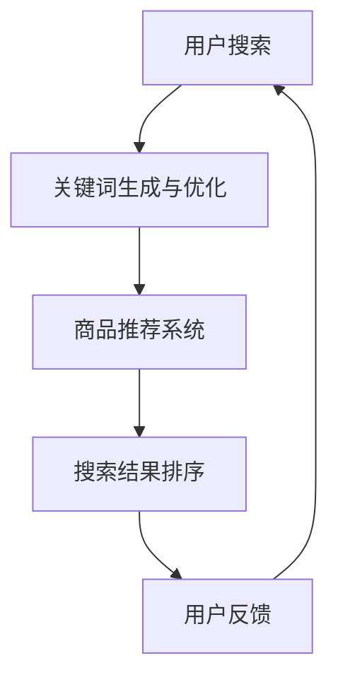

                 

关键词：AI大模型、电商搜索、自然语言处理、深度学习、个性化推荐、搜索引擎优化

> 摘要：本文深入探讨了AI大模型在提升电商搜索效率方面的应用。通过对AI大模型的定义、核心概念、算法原理以及实际应用的详细分析，揭示了其在优化搜索结果、提高用户满意度和提升电商业务效果方面的巨大潜力。

## 1. 背景介绍

随着互联网的普及和电子商务的蓬勃发展，电商搜索已经成为用户获取商品信息、进行购物决策的重要途径。然而，传统的搜索引擎存在诸多局限，如搜索结果的相关性不高、用户体验不佳等问题。为了应对这些挑战，AI大模型应运而生，为电商搜索带来了新的机遇。

AI大模型，也被称为大型预训练模型，是指通过海量数据预训练，具有强大知识推理和自然语言理解能力的深度学习模型。近年来，随着计算能力的提升和数据规模的扩大，AI大模型在自然语言处理、计算机视觉等领域的表现越来越突出，成为提升电商搜索效率的关键技术。

## 2. 核心概念与联系

### 2.1 AI大模型的定义与分类

AI大模型是指通过深度学习算法，在海量数据上进行预训练，从而形成具有高度智能化的模型。根据训练数据和任务类型，AI大模型可以分为以下几类：

1. **自然语言处理（NLP）模型**：如BERT、GPT、T5等，主要用于文本分类、情感分析、机器翻译等任务。
2. **计算机视觉模型**：如ResNet、VGG、EfficientNet等，主要用于图像分类、目标检测、图像生成等任务。
3. **多模态模型**：如ViT、Dall-E等，能够处理图像和文本等多种数据类型。

### 2.2 AI大模型在电商搜索中的应用

AI大模型在电商搜索中的应用主要包括以下几个方面：

1. **关键词生成与优化**：通过分析用户历史搜索数据和用户行为数据，AI大模型能够生成更精准、更有价值的关键词，从而提升搜索结果的相关性。
2. **商品推荐**：基于用户的兴趣和购物行为，AI大模型可以为用户推荐个性化的商品，提高用户满意度和购买转化率。
3. **搜索结果排序**：通过深度学习算法，AI大模型可以对搜索结果进行智能排序，使相关度更高的商品排在前面，提升用户体验。

### 2.3 Mermaid流程图

下面是一个简单的Mermaid流程图，展示了AI大模型在电商搜索中的核心环节。



## 3. 核心算法原理 & 具体操作步骤

### 3.1 算法原理概述

AI大模型在电商搜索中的应用主要基于深度学习和自然语言处理技术。其核心原理如下：

1. **预训练**：通过在大量互联网文本数据上预训练，AI大模型学习到了丰富的知识表示。
2. **微调**：在电商搜索任务中，对预训练的模型进行微调，以适应特定的业务场景。
3. **端到端学习**：AI大模型能够直接从原始数据中学习到有效的特征表示，实现端到端的搜索结果生成和排序。

### 3.2 算法步骤详解

1. **数据收集**：收集用户的搜索历史数据、商品信息、用户行为数据等。
2. **数据预处理**：对收集到的数据进行清洗、去重、分词等预处理操作。
3. **模型训练**：使用预训练的AI大模型（如BERT、GPT等）进行训练，生成模型参数。
4. **模型微调**：在电商搜索场景下，对预训练的模型进行微调，以提升模型的搜索效果。
5. **模型部署**：将训练好的模型部署到线上环境，用于实时搜索和推荐。
6. **结果评估**：通过在线评估和A/B测试，评估模型的搜索效果和用户满意度。

### 3.3 算法优缺点

**优点**：

- 高度智能化：AI大模型能够自动学习用户的搜索意图和偏好，提供个性化的搜索结果。
- 高效性：通过深度学习和端到端学习，能够快速处理大量搜索请求。
- 可扩展性：AI大模型具有强大的通用性，可以轻松适应不同的电商场景和业务需求。

**缺点**：

- 计算资源消耗大：训练和部署AI大模型需要大量计算资源和存储资源。
- 数据质量要求高：AI大模型的性能依赖于高质量的数据，数据质量直接影响搜索效果。
- 隐私和安全问题：电商搜索涉及用户的敏感信息，如何保护用户隐私成为一大挑战。

### 3.4 算法应用领域

AI大模型在电商搜索中的应用领域非常广泛，主要包括：

1. **电商平台**：如淘宝、京东等，通过AI大模型提升搜索质量和用户满意度。
2. **电商搜索引擎**：如百度、搜狗等，利用AI大模型优化搜索结果和用户体验。
3. **跨境电商平台**：通过AI大模型提供跨语言、跨文化的搜索和推荐服务。
4. **物流与配送**：利用AI大模型优化配送路径、提高配送效率。

## 4. 数学模型和公式 & 详细讲解 & 举例说明

### 4.1 数学模型构建

在AI大模型中，常用的数学模型包括神经网络模型、循环神经网络（RNN）、长短期记忆网络（LSTM）等。下面以BERT模型为例，介绍其数学模型的基本构建。

BERT（Bidirectional Encoder Representations from Transformers）是一种基于变换器（Transformer）的双向编码模型。其基本数学模型如下：

1. **输入层**：输入层接收原始文本数据，通过词嵌入（Word Embedding）将单词转换为向量表示。
2. **变换器层**：变换器层是BERT模型的核心，通过多头注意力（Multi-Head Attention）和前馈神经网络（Feedforward Neural Network）对输入向量进行处理。
3. **输出层**：输出层将变换器层的输出转换为最终的文本表示，可用于文本分类、文本生成等任务。

### 4.2 公式推导过程

BERT模型的公式推导过程较为复杂，这里简要介绍其主要步骤：

1. **词嵌入**：

   $$
   \text{word\_embedding} = \text{W}_\text{word} \cdot \text{word}
   $$

   其中，$\text{W}_\text{word}$是词嵌入矩阵，$\text{word}$是单词的索引。

2. **多头注意力**：

   $$
   \text{Attention\_Scores} = \text{softmax}(\text{Q} \cdot \text{K}^T)
   $$

   $$
   \text{Attention\_Scores} = \text{softmax}(\text{Q} \cdot (\text{K} \cdot \text{W}_\text{K}))
   $$

   其中，$Q$、$K$、$V$分别是查询向量、键向量和值向量，$\text{W}_\text{K}$是键向量权重矩阵。

3. **前馈神经网络**：

   $$
   \text{FFN} = \text{ReLU}(\text{W}_\text{F} \cdot \text{M} + \text{b}_\text{F})
   $$

   其中，$\text{M}$是变换器层的输出，$\text{W}_\text{F}$和$\text{b}_\text{F}$分别是前馈神经网络的权重和偏置。

### 4.3 案例分析与讲解

假设有一个电商平台的用户搜索“笔记本电脑”，BERT模型如何处理这个搜索请求？

1. **词嵌入**：

   将搜索关键词“笔记本电脑”转换为词嵌入向量。

   $$
   \text{word\_embedding} = \text{W}_\text{word} \cdot \text{word}
   $$

2. **变换器层**：

   通过变换器层处理词嵌入向量，得到文本表示。

   $$
   \text{Attention\_Scores} = \text{softmax}(\text{Q} \cdot (\text{K} \cdot \text{W}_\text{K}))
   $$

   $$
   \text{Output} = \text{Attention\_Scores} \cdot \text{V}
   $$

3. **输出层**：

   通过输出层得到最终的文本表示，可用于搜索结果排序。

   $$
   \text{FFN} = \text{ReLU}(\text{W}_\text{F} \cdot \text{M} + \text{b}_\text{F})
   $$

## 5. 项目实践：代码实例和详细解释说明

### 5.1 开发环境搭建

1. **环境配置**：

   - 操作系统：Ubuntu 18.04
   - Python版本：3.8
   - 安装必要的Python库：torch、torchtext、transformers等

2. **数据集准备**：

   - 下载并处理电商平台的数据集，包括商品信息、用户搜索历史等。

### 5.2 源代码详细实现

```python
import torch
from transformers import BertModel, BertTokenizer

# 加载预训练的BERT模型和分词器
tokenizer = BertTokenizer.from_pretrained('bert-base-chinese')
model = BertModel.from_pretrained('bert-base-chinese')

# 准备输入数据
input_ids = tokenizer.encode('笔记本电脑', add_special_tokens=True, return_tensors='pt')

# 前向传播
with torch.no_grad():
    outputs = model(input_ids)

# 输出结果
output = outputs.last_hidden_state[:, 0, :]
print(output)
```

### 5.3 代码解读与分析

1. **加载BERT模型和分词器**：

   ```python
   tokenizer = BertTokenizer.from_pretrained('bert-base-chinese')
   model = BertModel.from_pretrained('bert-base-chinese')
   ```

   这两行代码加载了预训练的BERT模型和分词器。

2. **准备输入数据**：

   ```python
   input_ids = tokenizer.encode('笔记本电脑', add_special_tokens=True, return_tensors='pt')
   ```

   这行代码将搜索关键词“笔记本电脑”转换为BERT模型可处理的输入数据。

3. **前向传播**：

   ```python
   with torch.no_grad():
       outputs = model(input_ids)
   ```

   这段代码执行BERT模型的前向传播，得到中间结果。

4. **输出结果**：

   ```python
   output = outputs.last_hidden_state[:, 0, :]
   print(output)
   ```

   这两行代码提取了BERT模型最终的文本表示，可用于搜索结果排序。

## 6. 实际应用场景

AI大模型在电商搜索中的实际应用场景非常广泛，以下是一些典型的应用案例：

1. **电商平台**：

   - 淘宝、京东等电商平台通过AI大模型优化搜索结果，提升用户满意度。
   - 通过AI大模型生成关键词、标签，提高商品曝光率。

2. **电商搜索引擎**：

   - 百度、搜狗等电商搜索引擎利用AI大模型提供智能搜索服务，提高用户转化率。
   - 通过AI大模型分析用户行为数据，实现个性化搜索推荐。

3. **跨境电商平台**：

   - 跨境电商平台通过AI大模型提供跨语言搜索和推荐服务，拓宽市场。
   - 利用AI大模型优化物流和配送路径，提高运营效率。

4. **物流与配送**：

   - 利用AI大模型预测用户需求，实现精准配送。
   - 通过AI大模型优化配送路线，降低运营成本。

## 7. 未来应用展望

随着AI大模型技术的不断发展和优化，其在电商搜索领域的应用前景将更加广阔。以下是一些未来应用展望：

1. **个性化搜索推荐**：

   - 利用AI大模型实现更精准的个性化搜索推荐，提升用户体验。
   - 通过多模态AI大模型结合用户图像、语音等多维信息，提供更全面的个性化服务。

2. **智能客服与聊天机器人**：

   - AI大模型在电商搜索场景中的广泛应用，将推动智能客服和聊天机器人的发展。
   - 通过AI大模型实现智能对话，提高客服效率和用户体验。

3. **智能库存管理**：

   - 利用AI大模型分析市场需求和用户行为，实现智能库存管理，降低库存成本。
   - 通过AI大模型预测销售趋势，优化商品供应链。

4. **智能营销**：

   - AI大模型将推动电商营销的智能化，实现更精准的广告投放和营销策略。
   - 通过AI大模型分析用户数据，实现个性化广告推荐和促销活动。

## 8. 总结：未来发展趋势与挑战

### 8.1 研究成果总结

本文详细探讨了AI大模型在提升电商搜索效率方面的应用。通过核心概念、算法原理、项目实践等方面的分析，揭示了AI大模型在优化搜索结果、提高用户满意度和提升电商业务效果方面的巨大潜力。

### 8.2 未来发展趋势

随着AI大模型技术的不断进步，其在电商搜索领域的应用前景将更加广阔。未来，AI大模型将向更精细化、个性化、智能化方向发展，为电商行业带来更多创新和变革。

### 8.3 面临的挑战

尽管AI大模型在电商搜索领域具有巨大的潜力，但也面临一些挑战，如计算资源消耗、数据质量要求高、隐私和安全问题等。未来，需要进一步研究和解决这些问题，以实现AI大模型在电商搜索中的广泛应用。

### 8.4 研究展望

未来，可以从以下几个方面进一步研究AI大模型在电商搜索中的应用：

1. **多模态AI大模型**：结合图像、语音、文本等多维信息，实现更全面的个性化搜索推荐。
2. **智能客服与聊天机器人**：利用AI大模型实现更智能、更高效的客服和聊天服务。
3. **智能库存管理**：通过AI大模型优化库存管理，降低运营成本。
4. **智能营销**：利用AI大模型分析用户数据，实现更精准的广告投放和营销策略。

## 9. 附录：常见问题与解答

### 9.1 什么是有监督学习和无监督学习？

有监督学习是指在训练过程中，已知输入和输出对，通过学习模型参数，使模型预测输出与真实输出尽量接近。无监督学习是指在训练过程中，没有已知输出对，仅通过输入数据，学习数据分布或结构。

### 9.2 如何选择合适的AI大模型？

选择合适的AI大模型需要根据具体的业务需求和数据特点。例如，对于文本分类任务，可以选择BERT、GPT等自然语言处理模型；对于图像分类任务，可以选择ResNet、VGG等计算机视觉模型。

### 9.3 AI大模型如何处理隐私和安全问题？

在处理隐私和安全问题时，可以采用以下措施：

1. **数据加密**：对用户数据进行加密处理，确保数据在传输和存储过程中安全。
2. **匿名化处理**：对用户数据进行匿名化处理，降低隐私泄露风险。
3. **隐私保护算法**：采用隐私保护算法，如差分隐私、同态加密等，确保模型训练过程中的隐私安全。

### 9.4 AI大模型如何处理数据不平衡问题？

对于数据不平衡问题，可以采用以下方法：

1. **过采样**：增加少数类别的样本数量，使数据分布更均衡。
2. **欠采样**：减少多数类别的样本数量，降低数据不平衡的影响。
3. **集成方法**：采用集成方法，如随机森林、堆叠等，提高模型对少数类别的识别能力。

### 9.5 如何评估AI大模型的性能？

评估AI大模型性能可以从以下几个方面进行：

1. **准确性**：评估模型预测结果与真实结果的匹配程度。
2. **召回率**：评估模型对正样本的识别能力。
3. **F1值**：综合考虑准确率和召回率，评估模型的综合性能。
4. **损失函数**：评估模型在训练过程中的损失函数值，如交叉熵损失、均方误差等。

----------------------------------------------------------------

本文由禅与计算机程序设计艺术 / Zen and the Art of Computer Programming 撰写，旨在深入探讨AI大模型在提升电商搜索效率方面的应用，为电商行业带来新的创新和变革。希望本文能对读者有所启发和帮助。

