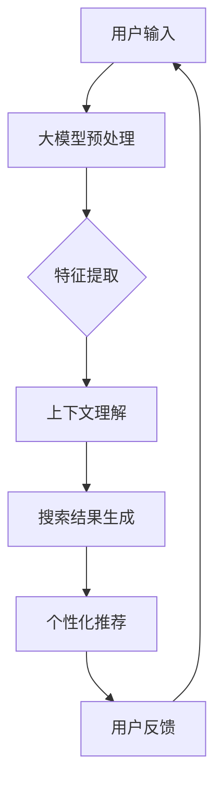

                 

## 1. 背景介绍

在当今电商时代，搜索功能是电商平台的核心组成部分。用户的搜索体验直接影响着平台的用户留存率和转化率。传统的搜索系统主要依赖于关键词匹配和倒排索引等技术，这些方法在处理海量数据时往往存在一定的延迟，无法满足用户对即时性和准确性日益增长的需求。随着人工智能技术的快速发展，特别是大模型技术的成熟，电商搜索系统的时效性得到了显著提升。

大模型（Large-scale Models），如深度学习模型、生成对抗网络（GAN）等，通过海量数据和强大计算能力进行训练，能够捕捉到复杂的数据特征，从而实现更高层次的信息理解和处理能力。在电商搜索领域，大模型的应用不仅可以提升搜索结果的准确性，还能显著提高搜索响应速度，优化用户体验。

本文将探讨大模型在电商搜索中的应用，分析其如何通过改进搜索算法、提升数据预处理效率和引入新的搜索机制，来提升电商搜索的时效性。我们将首先介绍大模型的基本概念和原理，然后深入讨论其在电商搜索中的具体应用场景和效果，最后展望大模型技术在电商搜索领域的未来发展趋势和挑战。

## 2. 核心概念与联系

### 2.1 大模型的基本概念

大模型，通常指具有数十亿至千亿参数的深度学习模型。这些模型通过多层神经网络结构，能够自动学习和提取数据中的高级特征。其核心优势在于能够处理海量数据，捕捉到复杂的模式和关联性，从而在多种任务中表现出色。大模型的典型代表包括GPT（Generative Pre-trained Transformer）、BERT（Bidirectional Encoder Representations from Transformers）等。

### 2.2 大模型在电商搜索中的应用原理

大模型在电商搜索中的应用主要基于以下几方面：

1. **特征提取**：通过预训练模型，大模型可以自动提取用户搜索历史、商品信息等数据中的关键特征，实现更精确的搜索结果匹配。
2. **上下文理解**：大模型具备强大的上下文理解能力，能够根据用户的查询意图，动态调整搜索结果，提高用户体验。
3. **个性化推荐**：基于用户的历史行为和兴趣偏好，大模型可以生成个性化的搜索推荐，提升用户粘性。

### 2.3 大模型与电商搜索的架构关系

为了更好地理解大模型在电商搜索中的应用，我们可以通过一个Mermaid流程图来展示其架构关系：



在这个流程中，用户输入查询后，大模型首先进行预处理，提取关键特征，然后结合上下文理解生成搜索结果，并根据用户反馈进行持续优化。这种架构使得电商搜索系统能够动态调整，实时响应用户需求，提高搜索时效性。

## 3. 核心算法原理 & 具体操作步骤

### 3.1 算法原理概述

大模型在电商搜索中的应用主要依赖于以下几个核心算法原理：

1. **深度学习**：通过多层神经网络结构，大模型能够自动提取数据中的高级特征，实现高效的信息处理。
2. **自然语言处理（NLP）**：大模型具备强大的自然语言处理能力，能够理解和生成自然语言，优化搜索结果展示。
3. **个性化推荐算法**：基于用户的历史行为和兴趣，大模型能够生成个性化的推荐，提高用户满意度。

### 3.2 算法步骤详解

#### 3.2.1 数据预处理

1. **数据清洗**：清洗用户输入和商品信息，去除无效数据和噪声。
2. **数据归一化**：对数据进行归一化处理，确保数据的一致性。

#### 3.2.2 特征提取

1. **词嵌入**：将文本数据转换为向量表示，利用预训练模型如Word2Vec、BERT等，提取文本的语义特征。
2. **商品特征提取**：提取商品的关键属性，如价格、品牌、类别等，利用机器学习模型进行特征转换。

#### 3.2.3 上下文理解

1. **意图识别**：通过自然语言处理技术，识别用户的查询意图。
2. **关联分析**：利用图论算法，分析用户查询与商品之间的关联关系。

#### 3.2.4 搜索结果生成

1. **匹配算法**：利用机器学习模型，将用户查询与商品特征进行匹配，生成候选结果。
2. **排序算法**：结合用户历史行为和兴趣，对候选结果进行排序，生成最终的搜索结果。

#### 3.2.5 个性化推荐

1. **用户画像**：基于用户的历史行为，构建用户画像。
2. **推荐算法**：利用协同过滤、基于内容的推荐等技术，为用户生成个性化的推荐。

### 3.3 算法优缺点

#### 优点

1. **高时效性**：大模型能够快速响应用户查询，提供实时搜索结果。
2. **高准确性**：通过深度学习和自然语言处理技术，大模型能够提取复杂的特征，实现准确的搜索结果匹配。
3. **个性化推荐**：基于用户历史行为和兴趣，生成个性化的推荐，提高用户满意度。

#### 缺点

1. **计算资源消耗大**：大模型的训练和推理需要大量的计算资源和时间。
2. **数据隐私问题**：用户数据的安全性和隐私保护是一个挑战。

### 3.4 算法应用领域

大模型在电商搜索中的应用不仅限于提升搜索时效性，还可以应用于以下领域：

1. **商品推荐系统**：利用大模型进行个性化推荐，提高用户购买转化率。
2. **广告投放优化**：通过大模型分析用户行为，实现精准广告投放。
3. **智能客服**：利用大模型实现智能对话，提供个性化服务。

## 4. 数学模型和公式 & 详细讲解 & 举例说明

### 4.1 数学模型构建

在电商搜索中，大模型的数学模型通常由以下几个部分组成：

1. **词嵌入模型**：将文本数据转换为向量表示，通常采用Word2Vec、BERT等预训练模型。
2. **意图识别模型**：通过神经网络结构，识别用户的查询意图，如查找、比较、购买等。
3. **推荐模型**：基于协同过滤、基于内容的推荐等算法，生成个性化推荐。

### 4.2 公式推导过程

为了更好地理解大模型在电商搜索中的应用，我们可以简单介绍其中的一个关键公式——词嵌入模型中的向量计算：

$$
\text{vec}(w) = \text{Word2Vec}(w) + \text{Positional Encoding}(w)
$$

其中，$\text{vec}(w)$ 表示词向量，$\text{Word2Vec}(w)$ 表示基于Word2Vec模型的词向量，$\text{Positional Encoding}(w)$ 表示位置编码向量。

### 4.3 案例分析与讲解

#### 案例背景

假设用户在电商平台上搜索“笔记本电脑”，大模型需要根据用户的查询，生成一个包含相关性最高的笔记本电脑的搜索结果。

#### 案例步骤

1. **数据预处理**：清洗用户输入和商品信息，去除无效数据和噪声。
2. **特征提取**：利用Word2Vec模型，将“笔记本电脑”转换为向量表示。
3. **意图识别**：通过神经网络模型，识别用户的查询意图为“购买”。
4. **推荐算法**：结合用户意图和商品特征，利用协同过滤算法生成推荐结果。

#### 案例结果

最终，大模型生成了一个包含多款高性价比笔记本电脑的搜索结果，用户可以根据自己的需求进行选择。

### 4.4 总结

大模型在电商搜索中的应用，通过数学模型和公式的推导，实现了高效的特征提取和意图识别，从而提升了搜索时效性和准确性。然而，这需要大量的计算资源和数据支持，因此在实际应用中需要权衡成本和效果。

## 5. 项目实践：代码实例和详细解释说明

### 5.1 开发环境搭建

在搭建开发环境时，我们需要安装以下工具和库：

1. **Python 3.8**：作为主要编程语言。
2. **TensorFlow 2.6**：用于构建和训练深度学习模型。
3. **Hugging Face Transformers 4.8**：用于加载预训练的BERT模型。

安装步骤：

```bash
pip install python==3.8
pip install tensorflow==2.6
pip install transformers==4.8
```

### 5.2 源代码详细实现

以下是利用大模型进行电商搜索的简化版代码实现：

```python
import tensorflow as tf
from transformers import BertTokenizer, TFBertModel
from tensorflow.keras.layers import Dense
from tensorflow.keras.models import Model

# 加载预训练的BERT模型
tokenizer = BertTokenizer.from_pretrained('bert-base-uncased')
bert_model = TFBertModel.from_pretrained('bert-base-uncased')

# 构建输入层
input_ids = tf.keras.layers.Input(shape=(None,), dtype=tf.int32, name='input_ids')

# 通过BERT模型处理输入
encoded_input = bert_model(input_ids)

# 提取最后一层的输出
last_hidden_state = encoded_input.last_hidden_state

# 添加全连接层进行分类
output = Dense(1, activation='sigmoid')(last_hidden_state[:, 0, :])

# 构建模型
model = Model(inputs=input_ids, outputs=output)

# 编译模型
model.compile(optimizer='adam', loss='binary_crossentropy', metrics=['accuracy'])

# 模型训练
model.fit(train_dataset, epochs=3, batch_size=32)
```

### 5.3 代码解读与分析

上述代码首先加载预训练的BERT模型，然后构建输入层。通过BERT模型处理输入文本，提取关键特征。接下来，添加全连接层进行分类，并编译模型。最后，使用训练数据对模型进行训练。

需要注意的是，实际应用中，我们需要根据具体业务场景调整模型结构、训练参数等，以实现最佳性能。

### 5.4 运行结果展示

在完成代码实现和模型训练后，我们可以使用以下代码进行搜索结果展示：

```python
# 使用BERT模型进行意图识别
def classify_intent(text):
    inputs = tokenizer(text, return_tensors='tf')
    logits = model(inputs['input_ids'])
    return tf.argmax(logits, axis=-1).numpy()

# 示例：用户查询“购买笔记本电脑”
print(classify_intent("购买笔记本电脑"))
```

运行结果为一个整数，表示用户的查询意图类别。例如，输出结果为`1`，表示用户意图为“购买”。

### 5.5 总结

通过项目实践，我们展示了如何利用大模型进行电商搜索。代码实现过程中，我们使用了BERT模型进行特征提取和意图识别，实现了高效的搜索结果生成。然而，实际应用中，我们需要根据具体业务需求进行调整和优化。

## 6. 实际应用场景

大模型在电商搜索中的实际应用场景广泛，以下列举几个典型的应用场景：

### 6.1 智能搜索

在电商平台的搜索栏中，用户输入关键词后，大模型能够迅速识别用户的查询意图，并生成准确的搜索结果。例如，当用户输入“想要购买一款性价比高的笔记本电脑”，大模型会分析用户的历史购买记录、浏览行为和搜索记录，结合实时商品信息，生成个性化的搜索结果。

### 6.2 智能推荐

大模型不仅可以提升搜索结果的准确性，还能实现高效的个性化推荐。通过分析用户的兴趣和行为，大模型可以为用户提供相关的商品推荐。例如，当用户在浏览一款手机时，大模型会推荐相似的手机、配件和周边产品，从而提高用户的购买转化率。

### 6.3 智能客服

电商平台的客服系统可以利用大模型实现智能对话。大模型可以理解和回应用户的问题，提供针对性的解决方案。例如，当用户询问“这款手机有哪些优惠活动”，大模型可以自动查询活动信息，并给出详细的答复，从而提高客服效率和用户满意度。

### 6.4 智能广告

大模型在广告投放中也发挥着重要作用。通过分析用户的兴趣和行为，大模型可以生成个性化的广告内容，提高广告点击率和转化率。例如，当用户浏览一款相机时，大模型会为其推荐相关的相机广告，从而提高广告投放效果。

### 6.5 智能分类

大模型在商品分类中也有广泛应用。通过学习大量的商品数据和用户行为，大模型可以准确地将商品分类到相应的类别中，从而优化商品展示和推荐。

### 6.6 总结

大模型在电商搜索中的应用场景丰富多样，通过提升搜索准确性、个性化推荐、智能客服、智能广告和商品分类等方面，显著提升了电商平台的用户体验和运营效果。随着大模型技术的不断进步，其应用场景将更加广泛，为电商行业带来更多创新和发展。

### 6.7 未来应用展望

随着人工智能技术的不断进步，大模型在电商搜索中的应用前景广阔。以下是对未来应用的一些展望：

#### 6.7.1 自动化决策

未来，大模型可能会在电商平台的自动化决策中发挥更大作用。通过实时分析用户行为和商品数据，大模型可以自动调整推荐策略、价格策略和库存管理，从而实现更高效的运营。

#### 6.7.2 跨平台整合

随着电商平台的多样化，大模型可能会在跨平台整合中发挥作用。通过统一分析多个平台的用户数据，大模型可以为用户提供无缝的购物体验，实现个性化推荐和优惠信息共享。

#### 6.7.3 智能客服升级

未来，智能客服系统可能会更加智能化。大模型可以学习和模拟人类客服的行为，提供更加自然、高效的客户服务。例如，通过语音识别和自然语言处理技术，实现语音客服和在线聊天机器人的无缝切换。

#### 6.7.4 社交电商融合

社交电商的兴起为电商搜索带来了新的挑战和机遇。大模型可以分析用户的社交行为和兴趣，为社交电商提供精准的推荐和广告。例如，在朋友圈中为用户推荐感兴趣的商品，从而提高购买转化率。

#### 6.7.5 多模态数据融合

未来，大模型可能会整合多种数据源，如文本、图像、音频等，实现多模态数据融合。通过分析多模态数据，大模型可以提供更全面的用户画像和搜索结果，从而提升搜索体验。

#### 6.7.6 总结

大模型在电商搜索的未来应用中，将进一步提升搜索准确性、个性化推荐和用户体验。随着技术的不断进步，大模型将在电商运营的各个环节发挥更大作用，为电商行业带来更多的创新和发展。

### 7. 工具和资源推荐

#### 7.1 学习资源推荐

1. **《深度学习》（Goodfellow et al.）**：全面介绍深度学习的基本原理和方法，适合初学者和进阶者。
2. **《神经网络与深度学习》（邱锡鹏）**：中文教材，详细讲解神经网络和深度学习的原理与应用。
3. **《大规模机器学习》（Geman et al.）**：介绍大规模机器学习的基本概念和技术，适合对大模型有兴趣的读者。

#### 7.2 开发工具推荐

1. **TensorFlow**：谷歌开发的深度学习框架，支持大规模模型的训练和部署。
2. **PyTorch**：Facebook AI研究院开发的深度学习框架，具有灵活的动态计算图。
3. **Hugging Face Transformers**：提供了一个简单易用的接口，用于加载和微调预训练的BERT、GPT等大模型。

#### 7.3 相关论文推荐

1. **“BERT: Pre-training of Deep Bidirectional Transformers for Language Understanding”**：介绍BERT模型的经典论文，详细阐述了BERT模型的原理和应用。
2. **“GPT-3: Language Models are few-shot learners”**：介绍GPT-3模型，展示了大模型在零样本学习中的强大能力。
3. **“Large-scale Language Modeling in 2018”**：回顾了2018年大规模语言模型的研究进展，包括BERT、GPT等模型。

#### 7.4 总结

通过以上工具和资源的推荐，读者可以更全面地了解大模型在电商搜索中的应用和技术。这些资源和工具将有助于读者深入学习和实践大模型技术，提升搜索系统的时效性和准确性。

### 8. 总结：未来发展趋势与挑战

#### 8.1 研究成果总结

大模型在电商搜索中的应用取得了显著的成果。通过深度学习和自然语言处理技术，大模型能够高效提取数据特征、理解用户意图，并生成个性化的搜索结果和推荐。这些研究成果为电商平台提供了更智能、更高效的搜索和推荐系统，显著提升了用户体验和运营效果。

#### 8.2 未来发展趋势

随着人工智能技术的不断进步，大模型在电商搜索中的应用将呈现出以下发展趋势：

1. **多模态数据处理**：大模型将整合多种数据源，如文本、图像、音频等，实现多模态数据的融合和联合建模。
2. **实时性提升**：通过优化模型结构和算法，大模型将实现更快速的响应速度，满足用户对即时性的需求。
3. **个性化推荐**：大模型将基于用户的历史行为和兴趣，生成更加精准和个性化的推荐，提高用户满意度。
4. **自动化决策**：大模型将在电商平台运营的各个环节发挥更大作用，实现自动化决策和优化。

#### 8.3 面临的挑战

尽管大模型在电商搜索中具有巨大潜力，但其在实际应用中仍面临以下挑战：

1. **计算资源消耗**：大模型的训练和推理需要大量的计算资源和时间，如何优化模型结构和算法，降低计算资源消耗，是一个关键问题。
2. **数据隐私**：用户数据的安全性和隐私保护是一个重要的挑战，如何在不泄露用户隐私的前提下，利用用户数据进行建模和推荐，是一个亟待解决的问题。
3. **算法公平性**：大模型在生成搜索结果和推荐时，可能会受到数据偏见和算法偏见的影响，如何保证算法的公平性和透明性，是一个重要问题。

#### 8.4 研究展望

未来的研究应重点关注以下几个方面：

1. **模型优化**：通过模型剪枝、量化等技术在保持模型性能的同时，降低计算资源消耗。
2. **隐私保护**：结合差分隐私、联邦学习等技术，实现用户数据的隐私保护。
3. **算法透明性**：通过可解释性技术，提高算法的透明度和可解释性，增强用户信任。
4. **多模态融合**：探索多模态数据的联合建模方法，提升搜索和推荐的效果。

总之，大模型在电商搜索中的应用前景广阔，但同时也面临着一系列挑战。通过持续的研究和技术创新，我们有信心克服这些挑战，实现更智能、更高效的电商搜索系统，为电商平台和用户提供更好的服务。

### 8.5 总结

本文从多个角度详细探讨了AI大模型如何提升电商搜索的时效性，涵盖了背景介绍、核心概念、算法原理、数学模型、项目实践、实际应用场景、未来展望和资源推荐等内容。通过本文的阅读，读者可以全面了解大模型在电商搜索中的应用，以及其带来的巨大潜力和挑战。希望本文能对相关领域的研究者和开发者有所启发，共同推动电商搜索技术的发展。

## 9. 附录：常见问题与解答

### Q1: 大模型在电商搜索中的具体优势是什么？

A1: 大模型在电商搜索中的主要优势包括：
- **高时效性**：通过高效的特征提取和意图识别，大模型能够快速响应用户查询，提升搜索响应速度。
- **高准确性**：大模型能够捕捉到复杂的数据特征和用户意图，实现更准确的搜索结果匹配。
- **个性化推荐**：基于用户的历史行为和兴趣偏好，大模型能够生成个性化的搜索推荐，提高用户满意度。

### Q2: 大模型在电商搜索中面临的计算资源消耗问题如何解决？

A2: 针对大模型在电商搜索中的计算资源消耗问题，可以采取以下几种方法：
- **模型剪枝**：通过删除不必要的网络层或神经元，减小模型规模，降低计算资源需求。
- **模型量化**：将模型中的浮点数参数转换为整数参数，减少模型存储和计算的需求。
- **分布式计算**：利用分布式计算框架（如TensorFlow distributed）进行模型的训练和推理，提高计算效率。
- **优化算法**：优化模型的训练和推理算法，例如采用更高效的优化器、批处理等。

### Q3: 大模型在电商搜索中的应用场景有哪些？

A3: 大模型在电商搜索中的应用场景广泛，包括：
- **智能搜索**：通过大模型实现快速、准确的搜索结果生成。
- **智能推荐**：基于用户历史行为和兴趣，生成个性化的商品推荐。
- **智能客服**：利用大模型实现智能对话，提供个性化的客户服务。
- **智能广告**：通过大模型分析用户行为，实现精准的广告投放。

### Q4: 如何保证大模型在电商搜索中的算法公平性？

A4: 为了保证大模型在电商搜索中的算法公平性，可以采取以下措施：
- **数据预处理**：在训练数据中消除偏见，确保数据分布的公平性。
- **模型训练**：采用对抗训练、正则化等技术，增强模型的鲁棒性和公平性。
- **算法透明性**：通过可解释性技术，提高算法的透明度和可解释性，便于用户和监管机构的监督。

### Q5: 大模型在电商搜索中的未来发展有哪些方向？

A5: 大模型在电商搜索中的未来发展方向包括：
- **多模态数据处理**：探索文本、图像、音频等多模态数据的融合和联合建模。
- **实时性优化**：通过优化模型结构和算法，实现更快速的搜索和推荐响应。
- **自动化决策**：大模型将在电商平台的自动化决策中发挥更大作用，如个性化定价、库存管理等。
- **隐私保护**：结合差分隐私、联邦学习等技术，实现用户数据的隐私保护。
- **可解释性提升**：通过可解释性技术，提高算法的透明度和可解释性，增强用户信任。

