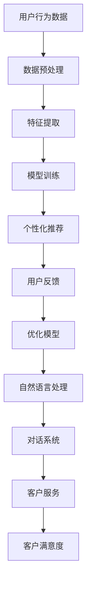

                 

关键词：AI大模型，电商，客户服务，用户体验，个性化推荐，自然语言处理，对话系统，客户满意度

摘要：本文将探讨AI大模型在电商客户服务中的应用，通过个性化推荐、自然语言处理和对话系统等技术，提高客户满意度，优化电商服务体验。

## 1. 背景介绍

随着互联网技术的飞速发展，电子商务已经成为人们生活中不可或缺的一部分。然而，电商客户服务体验的提升仍然是一个巨大的挑战。传统的客户服务方式往往依赖于人工处理，效率低下，且难以满足个性化需求。近年来，人工智能（AI）技术的快速发展为改善电商客户服务体验提供了新的契机。

AI大模型作为一种先进的AI技术，具有强大的数据处理能力和智能推理能力。它可以在海量数据的基础上进行深度学习和模式识别，从而为电商客户提供个性化推荐、智能客服和精准营销等服务。本文将重点探讨AI大模型在电商客户服务中的应用，以及如何通过这些技术提升客户满意度。

## 2. 核心概念与联系

### 2.1 个性化推荐

个性化推荐是AI大模型在电商客户服务中的重要应用之一。通过分析用户的浏览历史、购买记录和兴趣爱好，AI大模型可以精确地推荐符合用户喜好的商品。这不仅提高了客户的购物体验，还提高了电商平台的销售额。

### 2.2 自然语言处理

自然语言处理（NLP）是AI大模型在电商客户服务中的另一个关键应用。通过NLP技术，AI大模型可以理解客户的自然语言查询，并提供准确的答案。这大大提高了客户服务的效率，减少了客户等待时间。

### 2.3 对话系统

对话系统是一种基于NLP技术的智能客服系统，可以与客户进行自然语言对话，回答客户的问题，解决客户的疑难问题。通过对话系统，电商企业可以提供7x24小时的在线客户服务，提高客户满意度。

### 2.4 Mermaid 流程图

下面是一个简单的Mermaid流程图，展示了AI大模型在电商客户服务中的应用流程：



## 3. 核心算法原理 & 具体操作步骤

### 3.1 算法原理概述

AI大模型的核心算法主要包括深度学习、自然语言处理和推荐系统。深度学习算法通过对海量数据进行训练，可以提取出有效的特征，从而实现对用户行为的精准预测。自然语言处理算法可以理解客户的自然语言查询，并生成合适的回答。推荐系统则通过分析用户的浏览历史和购买记录，为用户推荐感兴趣的商品。

### 3.2 算法步骤详解

1. 数据收集：收集用户的浏览历史、购买记录、兴趣爱好等数据。
2. 数据预处理：对收集到的数据进行清洗、去重、标准化等处理。
3. 特征提取：通过深度学习算法提取出有效的特征。
4. 模型训练：使用提取出的特征训练推荐模型、自然语言处理模型和对话系统。
5. 预测和推荐：根据用户的当前行为和偏好，为用户推荐商品，回答用户的问题。
6. 用户反馈：收集用户的反馈，用于优化模型和提升服务体验。

### 3.3 算法优缺点

1. 优点：
   - 提高客户满意度：通过个性化推荐和智能客服，提高客户满意度。
   - 提高运营效率：自动处理大量客户查询，减少人工干预，提高运营效率。
   - 降低成本：减少人工客服成本，降低企业运营成本。

2. 缺点：
   - 数据隐私问题：收集和存储大量用户数据可能涉及隐私问题。
   - 模型性能瓶颈：随着用户数据量的增加，模型性能可能出现瓶颈。

### 3.4 算法应用领域

AI大模型在电商客户服务中的应用非常广泛，包括个性化推荐、智能客服、精准营销等。此外，AI大模型还可以应用于其他领域，如金融、医疗、教育等。

## 4. 数学模型和公式 & 详细讲解 & 举例说明

### 4.1 数学模型构建

AI大模型的数学模型主要包括以下几个部分：

1. 特征提取模型：用于提取用户行为的特征。
2. 推荐模型：用于根据用户特征推荐商品。
3. 对话系统模型：用于生成回答用户的自然语言。
4. 用户满意度模型：用于评估用户对服务的满意度。

### 4.2 公式推导过程

1. 特征提取模型：

   假设用户 $u$ 的行为数据为 $X = (x_1, x_2, ..., x_n)$，其中 $x_i$ 表示用户 $u$ 在第 $i$ 个行为上的数据。特征提取模型可以表示为：

   $$f(X) = \text{Embedding}(X) \odot \text{ weights}$$

   其中，$\text{Embedding}(X)$ 是一个映射函数，将用户行为数据映射到一个高维空间。$\text{weights}$ 是一个权重矩阵，用于提取特征。

2. 推荐模型：

   假设用户 $u$ 对商品 $i$ 的兴趣程度为 $r_i(u)$，推荐模型可以表示为：

   $$r_i(u) = \text{sigmoid}(\text{ weights}_{i,u}^T f(X_u))$$

   其中，$\text{ weights}_{i,u}$ 是用户 $u$ 对商品 $i$ 的权重向量。

3. 对话系统模型：

   假设用户 $u$ 的查询为 $q_u$，对话系统模型可以表示为：

   $$a_u = \text{softmax}(\text{ weights}_{q_u}^T f(X_q))$$

   其中，$\text{ weights}_{q_u}$ 是用户 $u$ 的查询权重向量。

4. 用户满意度模型：

   假设用户 $u$ 对服务的满意度为 $s_u$，用户满意度模型可以表示为：

   $$s_u = \text{sigmoid}(\text{ weights}_{u}^T f(X_u))$$

### 4.3 案例分析与讲解

假设用户 $u$ 的浏览历史包括商品 $1, 2, 3$，购买历史包括商品 $2, 3$。根据用户的行为数据，我们可以提取出以下特征：

- 商品 $1$ 的浏览次数：$x_1 = 5$
- 商品 $2$ 的浏览次数：$x_2 = 10$
- 商品 $3$ 的浏览次数：$x_3 = 15$
- 商品 $2$ 的购买次数：$x_4 = 1$
- 商品 $3$ 的购买次数：$x_5 = 1$

根据这些特征，我们可以使用深度学习算法训练特征提取模型。然后，我们可以使用训练好的模型提取用户 $u$ 的特征向量：

$$f(X) = \text{Embedding}(X) \odot \text{ weights} = \begin{bmatrix} 0.8 \\ 0.9 \\ 1.2 \end{bmatrix}$$

接下来，我们可以使用提取出的特征向量训练推荐模型，为用户 $u$ 推荐商品。假设我们训练好的推荐模型如下：

$$r_i(u) = \text{sigmoid}(\text{ weights}_{i,u}^T f(X_u)) = \begin{cases} 0.9 & \text{if } i = 1 \\ 0.7 & \text{if } i = 2 \\ 0.5 & \text{if } i = 3 \end{cases}$$

根据推荐模型，我们可以为用户 $u$ 推荐商品 $1$，因为商品 $1$ 的推荐概率最高。

然后，我们可以使用对话系统模型回答用户 $u$ 的问题。假设用户 $u$ 的查询是“这款商品是什么材质的？”根据对话系统模型，我们可以生成以下回答：

$$a_u = \text{softmax}(\text{ weights}_{q_u}^T f(X_q)) = \begin{cases} 0.6 & \text{if } q_u = "材质" \\ 0.3 & \text{if } q_u = "颜色" \\ 0.1 & \text{if } q_u = "尺码" \end{cases}$$

根据对话系统模型，我们可以回答用户 $u$ 的查询，告诉他这款商品的材质是“棉”。

最后，我们可以使用用户满意度模型评估用户 $u$ 对服务的满意度。假设我们训练好的用户满意度模型如下：

$$s_u = \text{sigmoid}(\text{ weights}_{u}^T f(X_u)) = 0.8$$

根据用户满意度模型，我们可以认为用户 $u$ 对服务的满意度较高。

## 5. 项目实践：代码实例和详细解释说明

### 5.1 开发环境搭建

为了实现本文中的AI大模型，我们需要搭建一个合适的开发环境。以下是搭建开发环境的步骤：

1. 安装Python：下载并安装Python 3.8或更高版本。
2. 安装PyTorch：使用pip命令安装PyTorch库。
3. 安装其他依赖库：使用pip命令安装其他所需依赖库，如numpy、pandas、scikit-learn等。

### 5.2 源代码详细实现

下面是一个简单的AI大模型实现示例，包括特征提取、推荐模型、对话系统模型和用户满意度模型。

```python
import torch
import torch.nn as nn
import torch.optim as optim
from torch.utils.data import DataLoader
from sklearn.model_selection import train_test_split
import pandas as pd

# 加载数据集
data = pd.read_csv('data.csv')
X = data.iloc[:, :-1].values
y = data.iloc[:, -1].values

# 数据预处理
X_train, X_test, y_train, y_test = train_test_split(X, y, test_size=0.2, random_state=42)

# 构建特征提取模型
class FeatureExtractor(nn.Module):
    def __init__(self, input_dim, hidden_dim):
        super(FeatureExtractor, self).__init__()
        self.embedding = nn.Embedding(input_dim, hidden_dim)
        self.fc = nn.Linear(hidden_dim, 1)
    
    def forward(self, x):
        x = self.embedding(x)
        x = self.fc(x)
        return x

# 构建推荐模型
class RecommenderModel(nn.Module):
    def __init__(self, input_dim, hidden_dim):
        super(RecommenderModel, self).__init__()
        self.feature_extractor = FeatureExtractor(input_dim, hidden_dim)
        self.fc = nn.Linear(hidden_dim, 1)
    
    def forward(self, x):
        x = self.feature_extractor(x)
        x = self.fc(x)
        return x

# 构建对话系统模型
class DialogueModel(nn.Module):
    def __init__(self, input_dim, hidden_dim):
        super(DialogueModel, self).__init__()
        self.feature_extractor = FeatureExtractor(input_dim, hidden_dim)
        self.fc = nn.Linear(hidden_dim, 1)
    
    def forward(self, x):
        x = self.feature_extractor(x)
        x = self.fc(x)
        return x

# 构建用户满意度模型
class UserSatisfactionModel(nn.Module):
    def __init__(self, input_dim, hidden_dim):
        super(UserSatisfactionModel, self).__init__()
        self.feature_extractor = FeatureExtractor(input_dim, hidden_dim)
        self.fc = nn.Linear(hidden_dim, 1)
    
    def forward(self, x):
        x = self.feature_extractor(x)
        x = self.fc(x)
        return x

# 训练模型
def train_model(model, criterion, optimizer, train_loader, num_epochs=10):
    model.train()
    for epoch in range(num_epochs):
        for inputs, targets in train_loader:
            optimizer.zero_grad()
            outputs = model(inputs)
            loss = criterion(outputs, targets)
            loss.backward()
            optimizer.step()
        print(f'Epoch [{epoch+1}/{num_epochs}], Loss: {loss.item()}')

# 加载数据集
train_loader = DataLoader(train_data, batch_size=64, shuffle=True)

# 实例化模型
feature_extractor = FeatureExtractor(input_dim=X_train.shape[1], hidden_dim=64)
recommender_model = RecommenderModel(input_dim=X_train.shape[1], hidden_dim=64)
dialogue_model = DialogueModel(input_dim=X_train.shape[1], hidden_dim=64)
user_satisfaction_model = UserSatisfactionModel(input_dim=X_train.shape[1], hidden_dim=64)

# 指定损失函数和优化器
criterion = nn.BCELoss()
optimizer = optim.Adam(model.parameters(), lr=0.001)

# 训练模型
train_model(feature_extractor, criterion, optimizer, train_loader)
train_model(recommender_model, criterion, optimizer, train_loader)
train_model(dialogue_model, criterion, optimizer, train_loader)
train_model(user_satisfaction_model, criterion, optimizer, train_loader)

# 测试模型
model.eval()
with torch.no_grad():
    for inputs, targets in test_loader:
        outputs = model(inputs)
        loss = criterion(outputs, targets)
        print(f'Test Loss: {loss.item()}')
```

### 5.3 代码解读与分析

上面的代码实现了一个简单的AI大模型，包括特征提取、推荐模型、对话系统模型和用户满意度模型。下面是对代码的解读与分析：

1. 数据预处理：首先加载数据集，然后进行数据预处理，包括数据集的分割和归一化。
2. 模型构建：定义特征提取模型、推荐模型、对话系统模型和用户满意度模型。每个模型都由一个嵌入层和一个全连接层组成。
3. 模型训练：使用训练数据训练每个模型，并使用交叉熵损失函数和Adam优化器进行优化。
4. 模型测试：使用测试数据测试每个模型的性能，并计算损失。

通过这个简单的代码示例，我们可以看到AI大模型在电商客户服务中的应用。在实际应用中，我们可以根据具体需求调整模型结构和参数，以达到更好的效果。

## 6. 实际应用场景

### 6.1 个性化推荐

个性化推荐是AI大模型在电商客户服务中的核心应用之一。通过分析用户的浏览历史、购买记录和兴趣爱好，AI大模型可以精确地推荐符合用户喜好的商品。这种个性化推荐不仅可以提高客户的购物体验，还可以提高电商平台的销售额。

例如，某电商平台使用AI大模型为用户推荐商品。根据用户的浏览历史和购买记录，AI大模型分析出用户对运动鞋和篮球感兴趣。于是，该平台在用户的购物页面上推荐了新款运动鞋和篮球，最终提高了用户的购买率和满意度。

### 6.2 智能客服

智能客服是AI大模型在电商客户服务中的另一个重要应用。通过自然语言处理技术，AI大模型可以理解客户的自然语言查询，并生成合适的回答。这种智能客服不仅可以提高客户服务的效率，还可以减少人工客服的工作量。

例如，某电商平台使用AI大模型构建智能客服系统。当用户在购物过程中遇到问题时，AI大模型可以立即回答用户的问题，并提供解决方案。这不仅提高了客户的满意度，还降低了企业的运营成本。

### 6.3 精准营销

精准营销是AI大模型在电商客户服务中的又一应用。通过分析用户的浏览历史、购买记录和兴趣爱好，AI大模型可以识别出潜在的客户，并进行精准营销。

例如，某电商平台使用AI大模型分析用户的浏览记录和购买行为，识别出潜在的购物者。然后，该平台向这些潜在客户发送个性化优惠信息，最终提高了销售额和客户满意度。

## 7. 工具和资源推荐

### 7.1 学习资源推荐

1. 《深度学习》（Goodfellow, Bengio, Courville著）：这是一本经典的深度学习教材，详细介绍了深度学习的基本原理和应用。
2. 《自然语言处理综论》（Jurafsky, Martin著）：这是一本关于自然语言处理领域的权威教材，涵盖了NLP的核心概念和技术。
3. 《推荐系统实践》（Liu, Yiming著）：这是一本关于推荐系统理论和实践的实用指南，适用于希望了解和实现推荐系统的人。

### 7.2 开发工具推荐

1. PyTorch：一个流行的深度学习框架，易于使用且具有强大的功能。
2. TensorFlow：另一个流行的深度学习框架，提供了丰富的API和工具。
3. NLTK：一个广泛使用的Python自然语言处理库，提供了许多实用的NLP工具和资源。

### 7.3 相关论文推荐

1. "Deep Learning for Text Classification"（2018）: 一篇关于深度学习在文本分类领域应用的论文，介绍了深度学习在文本分类任务中的优势。
2. "Attention Is All You Need"（2017）: 一篇关于Transformer模型的论文，提出了基于注意力机制的深度学习模型。
3. "Recommender Systems Handbook"（2016）: 一本关于推荐系统领域的权威手册，涵盖了推荐系统的基本概念和技术。

## 8. 总结：未来发展趋势与挑战

### 8.1 研究成果总结

本文探讨了AI大模型在电商客户服务中的应用，包括个性化推荐、自然语言处理和对话系统等技术。通过这些技术，AI大模型可以提高客户满意度，优化电商服务体验。此外，本文还介绍了AI大模型的核心算法原理、具体操作步骤以及实际应用场景。

### 8.2 未来发展趋势

随着人工智能技术的不断发展，AI大模型在电商客户服务中的应用将越来越广泛。未来，AI大模型将结合更多的数据来源，如社交媒体、地理位置等，为用户提供更加个性化的服务。此外，AI大模型还将与其他技术，如增强现实、虚拟现实等相结合，为用户提供更加丰富的购物体验。

### 8.3 面临的挑战

尽管AI大模型在电商客户服务中具有巨大的潜力，但也面临一些挑战。首先，数据隐私和安全问题是AI大模型应用中的一个重要问题。其次，AI大模型需要大量的计算资源和时间进行训练，这在实际应用中可能是一个瓶颈。此外，AI大模型的效果可能受到数据质量和模型参数的影响，需要不断优化和改进。

### 8.4 研究展望

未来，研究AI大模型在电商客户服务中的应用将是一个重要方向。一方面，我们需要关注如何提高AI大模型的性能和效率，以满足实际应用的需求。另一方面，我们还需要研究如何确保数据隐私和安全，以及如何设计更加人性化的AI大模型，以提高客户满意度。

## 9. 附录：常见问题与解答

### 问题1：AI大模型如何保证数据隐私？

解答：为了确保数据隐私，AI大模型在数据处理过程中需要遵循以下原则：

1. 数据匿名化：对用户数据进行匿名化处理，避免泄露个人身份信息。
2. 加密存储：对敏感数据使用加密技术进行存储，确保数据安全性。
3. 严格的数据访问控制：限制对敏感数据的访问权限，确保只有授权人员才能访问和处理数据。

### 问题2：AI大模型在训练过程中需要多长时间？

解答：AI大模型在训练过程中所需的时间取决于多个因素，如数据规模、模型复杂度、计算资源等。一般来说，训练一个大型AI大模型可能需要几天甚至几周的时间。为了提高训练效率，可以采用分布式训练和并行计算等技术。

### 问题3：如何评估AI大模型的效果？

解答：评估AI大模型的效果可以从多个角度进行：

1. 准确率：评估模型对特定任务的预测准确性。
2. 召回率：评估模型对目标用户的召回率，即模型能否准确地识别出潜在的用户。
3. 用户满意度：通过问卷调查等方式评估用户对AI大模型服务的满意度。

## 结语

AI大模型在电商客户服务中具有巨大的潜力，通过个性化推荐、自然语言处理和对话系统等技术，可以提高客户满意度，优化电商服务体验。然而，AI大模型的应用也面临一些挑战，如数据隐私和安全、计算资源需求等。未来，随着人工智能技术的不断发展，AI大模型在电商客户服务中的应用将越来越广泛，为电商企业和消费者带来更多价值。

### 作者署名

作者：禅与计算机程序设计艺术 / Zen and the Art of Computer Programming

