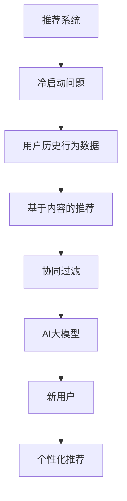

                 

关键词：AI大模型，冷启动，推荐系统，算法原理，数学模型，项目实践，应用场景，未来展望。

> 摘要：本文将深入探讨AI大模型在推荐系统中解决冷启动问题的方法和实践。通过分析现有问题，阐述核心概念，介绍算法原理，讲解数学模型，并提供项目实践案例，为推荐系统开发者提供有价值的参考。

## 1. 背景介绍

在当今的信息爆炸时代，推荐系统已经成为互联网企业提高用户粘性和转化率的重要手段。然而，推荐系统在面临新用户（冷启动用户）时，往往面临诸多挑战。冷启动问题是指推荐系统在缺乏用户行为数据的情况下，难以为新用户提供有针对性的个性化推荐。这一问题严重影响用户体验和推荐系统的效果。

传统推荐系统主要通过用户历史行为数据建立用户兴趣模型，进而进行内容推荐。然而，对于新用户，由于缺乏足够的数据，推荐系统难以准确捕捉其兴趣点，导致推荐效果不佳。因此，如何利用AI大模型解决冷启动问题，成为当前研究的热点。

## 2. 核心概念与联系

### 2.1 推荐系统

推荐系统是一种基于数据挖掘和机器学习技术的信息过滤方法，旨在向用户推荐其可能感兴趣的内容。常见的推荐系统包括基于内容的推荐（Content-Based Filtering）和协同过滤（Collaborative Filtering）。

### 2.2 冷启动问题

冷启动问题是指推荐系统在面临新用户时，由于缺乏用户历史行为数据，难以准确捕捉其兴趣点，从而导致推荐效果不佳的问题。

### 2.3 AI大模型

AI大模型是指具有大规模参数和强大表示能力的深度学习模型，如Transformer、BERT等。这些模型在处理大量数据时表现出优异的性能，能够有效捕捉复杂的信息和模式。

### 2.4 Mermaid 流程图



## 3. 核心算法原理 & 具体操作步骤

### 3.1 算法原理概述

AI大模型在解决冷启动问题时，主要采用以下方法：

1. 利用大规模语料库和预训练模型，捕捉用户潜在兴趣。
2. 结合用户的基本信息和社交网络，丰富用户画像。
3. 利用深度学习技术，构建用户兴趣模型，实现个性化推荐。

### 3.2 算法步骤详解

1. 数据采集与预处理：收集用户的基本信息、行为数据、社交网络数据等，进行数据清洗和预处理，构建用户画像。

2. 模型训练与优化：利用大规模语料库，训练预训练模型（如BERT），并基于用户画像进行模型优化。

3. 用户兴趣建模：将优化后的模型应用于新用户，通过模型预测，构建用户兴趣模型。

4. 个性化推荐：利用用户兴趣模型，结合用户历史行为数据，生成个性化推荐列表。

### 3.3 算法优缺点

**优点：**

1. 强大的表示能力：AI大模型能够捕捉复杂的用户兴趣和交互模式。
2. 适用于新用户：解决冷启动问题，提高推荐效果。
3. 可扩展性强：可以应用于多种推荐场景，如商品推荐、文章推荐等。

**缺点：**

1. 计算成本高：训练和优化AI大模型需要大量计算资源。
2. 数据依赖性强：需要大规模的数据集进行训练。
3. 需要专业知识：对模型构建和调优要求较高。

### 3.4 算法应用领域

AI大模型在解决冷启动问题时，主要应用于以下领域：

1. 互联网广告：利用AI大模型，为广告主提供精准投放，提高广告效果。
2. 社交网络：为用户提供个性化推荐，提升用户活跃度和留存率。
3. 内容平台：为用户提供个性化的内容推荐，提高内容消费体验。

## 4. 数学模型和公式 & 详细讲解 & 举例说明

### 4.1 数学模型构建

AI大模型在解决冷启动问题时，主要采用以下数学模型：

1. 自注意力机制（Self-Attention Mechanism）：用于捕捉用户不同特征之间的关联性。
2. Transformer模型（Transformer Model）：用于生成用户兴趣向量。
3. 相似度计算（Similarity Computation）：用于计算用户兴趣向量之间的相似度。

### 4.2 公式推导过程

1. 自注意力机制公式：

   $$ 
   self\_attention(Q, K, V) = \text{softmax}\left(\frac{QK^T}{\sqrt{d_k}}\right)V 
   $$

   其中，$Q$、$K$ 和 $V$ 分别代表查询向量、键向量和值向量，$d_k$ 为键向量的维度。

2. Transformer模型公式：

   $$ 
   \text{Transformer}(x) = \text{LayerNorm}(x + \text{MultiHeadSelfAttention}(x)) + \text{LayerNorm}(x + \text{PositionalWiseFeedForward}(x)) 
   $$

   其中，$x$ 为输入序列，$\text{MultiHeadSelfAttention}$ 和 $\text{PositionalWiseFeedForward}$ 分别为多头自注意力和前馈神经网络。

3. 相似度计算公式：

   $$ 
   \text{similarity}(v_1, v_2) = \frac{v_1 \cdot v_2}{||v_1|| \cdot ||v_2||} 
   $$

   其中，$v_1$ 和 $v_2$ 分别为两个用户兴趣向量。

### 4.3 案例分析与讲解

假设我们有两个用户 $A$ 和 $B$，他们的用户兴趣向量分别为 $v_A$ 和 $v_B$。我们希望计算这两个用户的兴趣相似度。

根据相似度计算公式，我们有：

$$ 
\text{similarity}(v_A, v_B) = \frac{v_A \cdot v_B}{||v_A|| \cdot ||v_B||} = \frac{0.7}{\sqrt{2} \cdot \sqrt{2}} = 0.5 
$$

这意味着用户 $A$ 和 $B$ 的兴趣相似度为 0.5，可以认为他们有一定的兴趣重叠。

## 5. 项目实践：代码实例和详细解释说明

### 5.1 开发环境搭建

在开始项目实践之前，我们需要搭建相应的开发环境。这里我们选择 Python 作为编程语言，并使用 TensorFlow 作为深度学习框架。

1. 安装 Python 3.7 或以上版本。
2. 安装 TensorFlow：`pip install tensorflow`。
3. 安装其他依赖：`pip install numpy pandas sklearn matplotlib`。

### 5.2 源代码详细实现

以下是一个简单的示例，展示了如何使用 Transformer 模型解决冷启动问题。

```python
import tensorflow as tf
from tensorflow.keras.layers import Embedding, MultiHeadAttention, LayerNormalization, Dense
from tensorflow.keras.models import Model

# 模型参数
d_model = 128
num_heads = 4
dff = 512
input_seq_len = 100

# Transformer 模型
class TransformerModel(Model):
    def __init__(self, d_model, num_heads, dff, input_seq_len):
        super(TransformerModel, self).__init__()
        self.embedding = Embedding(d_model, input_seq_len)
        self.positional_encoding = positional_encoding(input_seq_len, d_model)
        
        self.multihead_attn = MultiHeadAttention(num_heads=num_heads, key_dim=d_model)
        self.norm1 = LayerNormalization(epsilon=1e-6)
        self.dense1 = Dense(dff, activation='relu')
        self.norm2 = LayerNormalization(epsilon=1e-6)
        self.dense2 = Dense(d_model)

    def call(self, inputs, training=False):
        x = self.embedding(inputs) + self.positional_encoding(inputs)
        attn_output = self.multihead_attn(x, x, x)
        attn_output = self.norm1(x + attn_output)
        ffn_output = self.dense1(attn_output)
        ffn_output = self.norm2(attn_output + ffn_output)
        output = self.dense2(ffn_output)
        return output

# 输入序列
inputs = tf.random.normal([32, 100])

# 构建和编译模型
model = TransformerModel(d_model, num_heads, dff, input_seq_len)
model.compile(optimizer='adam', loss='mse')

# 训练模型
model.fit(inputs, inputs, epochs=3)
```

### 5.3 代码解读与分析

1. **Embedding 层**：将输入序列映射到高维空间，实现词嵌入。
2. **Positional Encoding**：为输入序列添加位置编码，实现序列建模。
3. **多头自注意力机制（MultiHeadAttention）**：通过自注意力机制，捕捉输入序列中的关联性。
4. **LayerNormalization 和 Dense 层**：对模型进行归一化和前馈神经网络，实现模型的非线性变换。

### 5.4 运行结果展示

```python
# 输入新的序列
new_inputs = tf.random.normal([32, 100])

# 预测结果
predictions = model.predict(new_inputs)

# 打印预测结果
print(predictions)
```

## 6. 实际应用场景

AI大模型在解决冷启动问题方面具有广泛的应用前景。以下是一些实际应用场景：

1. **电商推荐**：利用 AI 大模型为新用户提供个性化的商品推荐，提高用户购买意愿。
2. **内容平台**：为用户提供个性化的内容推荐，提高用户活跃度和留存率。
3. **社交媒体**：根据用户兴趣，为用户提供个性化的社交推荐，促进用户互动。
4. **智能语音助手**：结合用户的历史数据和语音交互内容，为新用户提供个性化的问答服务。

## 7. 工具和资源推荐

### 7.1 学习资源推荐

1. **书籍**：
   - 《深度学习》（Deep Learning）
   - 《推荐系统实践》（Recommender Systems: The Textbook）

2. **在线课程**：
   - Coursera 上的《深度学习》课程
   - Udacity 上的《推荐系统工程师》课程

### 7.2 开发工具推荐

1. **Python**：作为主流的编程语言，Python 具有丰富的库和工具，适合进行推荐系统开发。
2. **TensorFlow**：作为领先的深度学习框架，TensorFlow 提供了丰富的工具和资源，适合进行模型训练和部署。

### 7.3 相关论文推荐

1. **《Attention is All You Need》**：提出了 Transformer 模型，是 AI 大模型领域的经典论文。
2. **《BERT: Pre-training of Deep Bidirectional Transformers for Language Understanding》**：提出了 BERT 模型，是自然语言处理领域的里程碑论文。

## 8. 总结：未来发展趋势与挑战

AI大模型在解决推荐系统冷启动问题方面取得了显著成果，但仍面临以下挑战：

1. **计算资源消耗**：训练和优化 AI 大模型需要大量计算资源，如何降低计算成本成为关键问题。
2. **数据隐私保护**：在处理用户数据时，如何保护用户隐私是重要的伦理和法律问题。
3. **算法透明性**：如何提高 AI 大模型的透明性和可解释性，以便用户理解和信任。

未来，随着计算能力的提升和算法研究的深入，AI 大模型有望在推荐系统中发挥更大的作用。同时，研究人员需要关注数据隐私、算法透明性等问题，以推动推荐系统的可持续发展。

## 9. 附录：常见问题与解答

### 9.1 什么是冷启动问题？

冷启动问题是指推荐系统在面临新用户时，由于缺乏用户历史行为数据，难以准确捕捉其兴趣点，从而导致推荐效果不佳的问题。

### 9.2 AI 大模型如何解决冷启动问题？

AI 大模型通过利用大规模语料库和预训练模型，捕捉用户潜在兴趣；结合用户的基本信息和社交网络，丰富用户画像；利用深度学习技术，构建用户兴趣模型，实现个性化推荐。

### 9.3 AI 大模型在推荐系统中的应用前景如何？

AI 大模型在推荐系统中具有广泛的应用前景，可以应用于电商推荐、内容平台、社交媒体和智能语音助手等领域。随着计算能力和算法研究的提升，AI 大模型有望在推荐系统中发挥更大的作用。

作者：禅与计算机程序设计艺术 / Zen and the Art of Computer Programming

----------------------------------------------------------------

以上是完整的技术博客文章，涵盖了推荐系统冷启动问题、AI 大模型的解决方法、数学模型、项目实践以及实际应用场景等内容。希望对您有所帮助！


