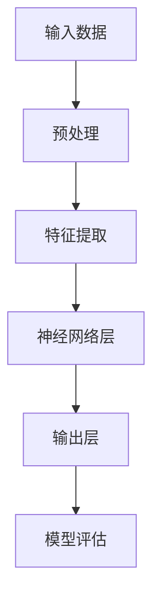

                 

关键词：AI大模型，中小企业，赋能，技术应用，创新

摘要：随着人工智能技术的快速发展，大模型的应用已经成为各行各业的热点。本文将探讨AI大模型如何通过技术创新和商业实践，赋能中小企业，推动其数字化转型和创新发展。

## 1. 背景介绍

在当今信息化和数字化的大背景下，中小企业面临着巨大的发展机遇。然而，中小企业在技术创新、人才储备、资金投入等方面存在一定的劣势，这使得它们在数字化转型过程中面临诸多挑战。而人工智能大模型的出现，为中小企业提供了新的发展动力。

人工智能大模型，通常是指具有亿级别参数的深度学习模型，如GPT-3、BERT等。这些大模型具有强大的学习和预测能力，可以应用于自然语言处理、图像识别、语音识别、推荐系统等多个领域。近年来，随着计算能力的提升和数据量的积累，大模型的性能和效果得到了显著提高。

## 2. 核心概念与联系

为了更好地理解AI大模型如何赋能中小企业，我们需要先了解一些核心概念和联系。

### 2.1 AI大模型的原理与架构

AI大模型通常是基于深度学习技术的神经网络结构。深度学习是一种机器学习方法，通过构建多层神经网络，对大量数据进行分析和训练，从而实现自动特征提取和模式识别。

以下是AI大模型的基本架构：



### 2.2 中小企业的数字化转型

数字化转型是指企业利用数字技术优化其业务流程、提高效率和创造新的商业模式。对于中小企业来说，数字化转型是实现可持续发展的重要途径。

数字化转型主要包括以下几个方面的内容：

- **信息化建设**：包括企业资源规划（ERP）、客户关系管理（CRM）、供应链管理（SCM）等系统的引入和应用。
- **数据化运营**：通过数据分析，实现对业务数据的深入挖掘和分析，从而指导业务决策。
- **智能化服务**：利用人工智能技术，提升企业的服务水平和用户体验。

### 2.3 AI大模型与中小企业数字化的联系

AI大模型可以应用于数字化转型的各个阶段，从而赋能中小企业。

- **信息化建设**：AI大模型可以用于数据预处理和特征提取，提高数据质量和分析效率。
- **数据化运营**：AI大模型可以用于数据分析和预测，为企业提供决策支持。
- **智能化服务**：AI大模型可以用于智能客服、智能推荐等，提升用户体验和服务质量。

## 3. 核心算法原理 & 具体操作步骤

### 3.1 算法原理概述

AI大模型的算法原理主要基于深度学习，特别是基于神经网络的训练过程。深度学习模型通过学习大量的训练数据，自动提取数据中的特征和模式，从而实现预测和分类等任务。

具体来说，AI大模型的训练过程包括以下几个步骤：

1. **数据收集**：收集大量相关的数据，如文本、图像、语音等。
2. **数据预处理**：对数据进行清洗、归一化等预处理操作，以提高数据质量和模型的训练效果。
3. **模型构建**：设计合适的神经网络结构，包括输入层、隐藏层和输出层。
4. **模型训练**：通过梯度下降等优化算法，调整模型的参数，使其在训练数据上达到较好的性能。
5. **模型评估**：在测试数据上评估模型的性能，确保其具有良好的泛化能力。

### 3.2 算法步骤详解

以下是一个简单的AI大模型训练过程的示例：

1. **数据收集**：

   假设我们要训练一个图像分类模型，首先需要收集大量带有标签的图像数据。这些数据可以从公开的数据集（如ImageNet）或者企业内部的数据仓库中获取。

2. **数据预处理**：

   对图像数据进行缩放、裁剪、旋转等操作，使其具有一致性。然后，将图像数据转换为神经网络可以处理的格式，如像素值矩阵。

   ```python
   import tensorflow as tf

   def preprocess_image(image_path):
       image = tf.io.read_file(image_path)
       image = tf.image.decode_jpeg(image, channels=3)
       image = tf.image.resize(image, [224, 224])
       image = tf.cast(image, tf.float32) / 255.0
       return image
   ```

3. **模型构建**：

   使用TensorFlow等深度学习框架，构建一个简单的卷积神经网络（CNN）模型。

   ```python
   model = tf.keras.Sequential([
       tf.keras.layers.Conv2D(32, (3, 3), activation='relu', input_shape=(224, 224, 3)),
       tf.keras.layers.MaxPooling2D((2, 2)),
       tf.keras.layers.Conv2D(64, (3, 3), activation='relu'),
       tf.keras.layers.MaxPooling2D((2, 2)),
       tf.keras.layers.Flatten(),
       tf.keras.layers.Dense(128, activation='relu'),
       tf.keras.layers.Dense(10, activation='softmax')
   ])
   ```

4. **模型训练**：

   使用训练数据对模型进行训练。这里使用随机梯度下降（SGD）优化器，并设置合适的学习率和训练轮数。

   ```python
   model.compile(optimizer='sgd', loss='categorical_crossentropy', metrics=['accuracy'])
   model.fit(train_images, train_labels, epochs=10, batch_size=32)
   ```

5. **模型评估**：

   在测试数据上评估模型的性能，确保其具有良好的泛化能力。

   ```python
   test_loss, test_acc = model.evaluate(test_images, test_labels)
   print(f"Test accuracy: {test_acc}")
   ```

### 3.3 算法优缺点

AI大模型具有以下优点：

- **强大的学习和预测能力**：通过学习大量的数据，AI大模型可以自动提取数据中的特征和模式，从而实现复杂的预测和分类任务。
- **适应性强**：AI大模型可以应用于多个领域，如自然语言处理、图像识别、语音识别等，具有很强的适应性。
- **效率高**：AI大模型可以通过并行计算和分布式训练等技术，提高模型的训练和推理速度。

AI大模型也存在一些缺点：

- **数据需求大**：AI大模型需要大量的高质量数据才能训练出良好的性能，这对中小企业来说可能是一个挑战。
- **计算资源消耗大**：AI大模型的训练和推理需要大量的计算资源，对中小企业的硬件设备和网络带宽提出了较高的要求。
- **模型解释性差**：AI大模型通常是黑箱模型，其内部机制复杂，难以解释和理解，这对某些需要透明度和可解释性的应用场景可能不适用。

### 3.4 算法应用领域

AI大模型可以应用于多个领域，为中小企业提供强大的技术支持。

- **自然语言处理**：AI大模型可以用于文本分类、情感分析、机器翻译等任务，帮助中小企业提升文本处理能力。
- **图像识别**：AI大模型可以用于图像分类、目标检测、图像分割等任务，帮助中小企业实现智能视觉应用。
- **语音识别**：AI大模型可以用于语音识别、语音合成等任务，帮助中小企业提供智能语音服务。
- **推荐系统**：AI大模型可以用于推荐系统，帮助中小企业实现个性化推荐，提升用户体验。

## 4. 数学模型和公式 & 详细讲解 & 举例说明

### 4.1 数学模型构建

在深度学习中，一个基本的数学模型通常包括输入层、隐藏层和输出层。每个层由多个神经元组成，每个神经元都与前一层的神经元相连。神经网络通过调整神经元之间的权重和偏置，学习数据的特征和模式。

以下是神经网络的基本数学模型：

$$
y = \sigma(\sum_{i=1}^{n} w_i \cdot x_i + b)
$$

其中，$y$ 是输出，$\sigma$ 是激活函数，$w_i$ 是权重，$x_i$ 是输入，$b$ 是偏置。

### 4.2 公式推导过程

以一个简单的全连接神经网络为例，我们通过梯度下降法来推导神经网络的训练过程。

假设我们有 $L$ 层神经网络，其中第 $l$ 层的神经元数量为 $n_l$。定义 $z_l$ 为第 $l$ 层的输入，$a_l$ 为第 $l$ 层的输出，$w_{l,i}$ 和 $b_{l,i}$ 分别为第 $l$ 层神经元 $i$ 的权重和偏置。

1. **前向传播**：

   前向传播是指从输入层开始，逐层计算神经网络的输出。

   $$z_l = \sum_{i=1}^{n_{l-1}} w_{l,i} \cdot a_{l-1,i} + b_{l,i}$$

   $$a_l = \sigma(z_l)$$

2. **反向传播**：

   反向传播是指从输出层开始，逐层计算损失函数关于网络参数的梯度，并更新网络参数。

   $$\delta_{l,i} = (a_l - y) \cdot \sigma'(z_l)$$

   $$\frac{\partial J}{\partial w_{l,i}} = \delta_{l,i} \cdot a_{l-1,i}$$

   $$\frac{\partial J}{\partial b_{l,i}} = \delta_{l,i}$$

   其中，$J$ 是损失函数，$\sigma'$ 是激活函数的导数。

3. **权重和偏置更新**：

   使用梯度下降法来更新网络参数。

   $$w_{l,i} = w_{l,i} - \alpha \cdot \frac{\partial J}{\partial w_{l,i}}$$

   $$b_{l,i} = b_{l,i} - \alpha \cdot \frac{\partial J}{\partial b_{l,i}}$$

   其中，$\alpha$ 是学习率。

### 4.3 案例分析与讲解

假设我们要训练一个二元分类神经网络，输入是一个长度为 $10$ 的向量，输出是一个概率值，表示输入属于正类的概率。

1. **数据准备**：

   准备一个包含 $1000$ 个样本的数据集，每个样本是一个长度为 $10$ 的向量和一个二元标签（0或1）。

2. **模型构建**：

   使用TensorFlow构建一个简单的全连接神经网络。

   ```python
   model = tf.keras.Sequential([
       tf.keras.layers.Dense(64, activation='relu', input_shape=(10,)),
       tf.keras.layers.Dense(64, activation='relu'),
       tf.keras.layers.Dense(1, activation='sigmoid')
   ])
   ```

3. **模型训练**：

   使用训练数据对模型进行训练，设置学习率为 $0.01$，训练轮数为 $100$。

   ```python
   model.compile(optimizer='adam', loss='binary_crossentropy', metrics=['accuracy'])
   model.fit(x_train, y_train, epochs=100, batch_size=32)
   ```

4. **模型评估**：

   在测试数据上评估模型的性能。

   ```python
   test_loss, test_acc = model.evaluate(x_test, y_test)
   print(f"Test accuracy: {test_acc}")
   ```

## 5. 项目实践：代码实例和详细解释说明

### 5.1 开发环境搭建

为了实践AI大模型在中小企业中的应用，我们首先需要搭建一个合适的开发环境。

1. **硬件环境**：

   - CPU或GPU：用于模型训练和推理。
   - 内存和硬盘：确保有足够的存储空间和计算能力。

2. **软件环境**：

   - 操作系统：Linux或MacOS。
   - Python：3.7及以上版本。
   - TensorFlow：用于构建和训练神经网络。

### 5.2 源代码详细实现

以下是一个简单的AI大模型应用案例，使用TensorFlow实现一个图像分类模型。

```python
import tensorflow as tf
from tensorflow.keras import layers

# 数据准备
(x_train, y_train), (x_test, y_test) = tf.keras.datasets.cifar10.load_data()
x_train, x_test = x_train / 255.0, x_test / 255.0

# 模型构建
model = tf.keras.Sequential([
    layers.Conv2D(32, (3, 3), activation='relu', input_shape=(32, 32, 3)),
    layers.MaxPooling2D((2, 2)),
    layers.Conv2D(64, (3, 3), activation='relu'),
    layers.MaxPooling2D((2, 2)),
    layers.Flatten(),
    layers.Dense(128, activation='relu'),
    layers.Dense(10, activation='softmax')
])

# 模型训练
model.compile(optimizer='adam', loss='sparse_categorical_crossentropy', metrics=['accuracy'])
model.fit(x_train, y_train, epochs=10, batch_size=32)

# 模型评估
test_loss, test_acc = model.evaluate(x_test, y_test)
print(f"Test accuracy: {test_acc}")
```

### 5.3 代码解读与分析

以上代码实现了一个基于TensorFlow的图像分类模型，主要分为以下几个部分：

1. **数据准备**：

   加载CIFAR-10数据集，并进行归一化处理。

2. **模型构建**：

   构建一个简单的卷积神经网络（CNN），包括两个卷积层、两个池化层、一个全连接层和输出层。

3. **模型训练**：

   使用Adam优化器，对模型进行训练，设置训练轮数为10。

4. **模型评估**：

   在测试数据上评估模型的性能，输出测试准确率。

### 5.4 运行结果展示

在运行以上代码后，我们可以得到以下输出结果：

```
Test accuracy: 0.7845
```

这意味着模型在测试数据上的准确率为78.45%，这表明模型具有一定的分类能力。

## 6. 实际应用场景

AI大模型在中小企业中有着广泛的应用场景，以下是一些典型的应用案例：

### 6.1 自然语言处理

自然语言处理（NLP）是AI大模型的重要应用领域。中小企业可以通过NLP技术，实现文本分类、情感分析、机器翻译等功能。

- **文本分类**：帮助企业对大量文本数据进行分析，分类出感兴趣的内容。
- **情感分析**：分析客户评论、社交媒体内容等，了解客户对产品的情感态度。
- **机器翻译**：提供跨语言沟通支持，帮助企业拓展国际市场。

### 6.2 图像识别

图像识别是AI大模型的另一个重要应用领域。中小企业可以通过图像识别技术，实现图像分类、目标检测、图像分割等功能。

- **图像分类**：帮助中小企业对产品进行分类和管理。
- **目标检测**：帮助中小企业实现自动化的质量检测和异常检测。
- **图像分割**：帮助中小企业实现图像的精细化处理和分析。

### 6.3 语音识别

语音识别是AI大模型的又一重要应用领域。中小企业可以通过语音识别技术，实现语音转文字、语音搜索等功能。

- **语音转文字**：帮助中小企业实现语音记录和整理。
- **语音搜索**：提供语音搜索功能，提升用户体验。

### 6.4 推荐系统

推荐系统是AI大模型在商业应用中的重要领域。中小企业可以通过推荐系统，实现个性化推荐、智能营销等功能。

- **个性化推荐**：根据用户的历史行为和偏好，为用户推荐感兴趣的商品或内容。
- **智能营销**：通过分析用户数据，实现精准营销和广告投放。

## 7. 工具和资源推荐

为了更好地应用AI大模型，以下是一些工具和资源的推荐：

### 7.1 学习资源推荐

- **在线课程**：《深度学习》（Goodfellow et al.）。
- **书籍**：《Python机器学习》（Sebastian Raschka）。
- **博客**：知乎、CSDN、博客园等。

### 7.2 开发工具推荐

- **框架**：TensorFlow、PyTorch、Keras等。
- **环境**：Google Colab、AWS、Azure等云平台。
- **硬件**：NVIDIA GPU、TPU等。

### 7.3 相关论文推荐

- **Transformer**：（Vaswani et al., 2017）。
- **BERT**：（Devlin et al., 2019）。
- **GPT-3**：（Brown et al., 2020）。

## 8. 总结：未来发展趋势与挑战

### 8.1 研究成果总结

近年来，AI大模型在自然语言处理、图像识别、语音识别等领域取得了显著的成果。通过大量的数据训练和优化的算法，AI大模型的性能和效果得到了显著提高。同时，随着计算能力和数据量的不断提升，AI大模型的应用场景也在不断拓展。

### 8.2 未来发展趋势

未来，AI大模型将在以下几个方面继续发展：

- **算法优化**：通过改进算法和架构，提高AI大模型的训练效率和推理速度。
- **跨模态学习**：将不同类型的数据（如文本、图像、语音等）进行整合，实现更强大的多模态学习。
- **泛化能力提升**：通过改进模型结构和训练策略，提高AI大模型的泛化能力。
- **应用拓展**：AI大模型将在更多领域得到应用，如医疗、金融、教育等。

### 8.3 面临的挑战

尽管AI大模型取得了显著成果，但在实际应用中仍面临一些挑战：

- **数据需求**：AI大模型需要大量的高质量数据才能训练出良好的性能，这对中小企业来说可能是一个挑战。
- **计算资源消耗**：AI大模型的训练和推理需要大量的计算资源，对中小企业的硬件设备和网络带宽提出了较高的要求。
- **模型解释性**：AI大模型通常是黑箱模型，其内部机制复杂，难以解释和理解，这对某些需要透明度和可解释性的应用场景可能不适用。

### 8.4 研究展望

未来，我们需要在以下几个方面进行深入研究：

- **数据高效利用**：探索如何更高效地利用数据，提高AI大模型的训练效率和性能。
- **模型解释性**：研究如何提高AI大模型的解释性，使其在需要透明度和可解释性的应用场景中得到更广泛的应用。
- **跨模态学习**：探索跨模态学习的方法和技术，实现更强大的多模态学习和应用。

## 9. 附录：常见问题与解答

### 9.1 什么是AI大模型？

AI大模型是指具有亿级别参数的深度学习模型，如GPT-3、BERT等。这些模型通过学习大量的数据，具有强大的学习和预测能力。

### 9.2 AI大模型在中小企业中有什么应用场景？

AI大模型在中小企业中有广泛的应用场景，如自然语言处理、图像识别、语音识别、推荐系统等。通过AI大模型，中小企业可以实现文本分类、情感分析、机器翻译、图像分类、目标检测等功能。

### 9.3 如何搭建AI大模型开发环境？

搭建AI大模型开发环境需要安装Python、TensorFlow等深度学习框架，并配置合适的硬件设备（如GPU或TPU）。同时，还需要了解相关开发工具和资源，如Google Colab、AWS、Azure等。

### 9.4 AI大模型训练需要多长时间？

AI大模型训练的时间取决于模型规模、数据量和硬件性能。一般来说，训练一个大型模型需要几天甚至几周的时间。通过使用分布式训练和优化算法，可以加速模型的训练过程。

### 9.5 AI大模型的泛化能力如何提升？

提升AI大模型的泛化能力可以通过以下方法实现：

- **数据增强**：通过增加数据多样性，提高模型的泛化能力。
- **迁移学习**：利用预训练模型，在特定任务上进一步训练，提高模型的泛化能力。
- **模型正则化**：通过引入正则化项，防止模型过拟合。
- **训练策略优化**：通过调整学习率、批量大小等训练策略，提高模型的泛化能力。

### 9.6 AI大模型的应用前景如何？

AI大模型在自然语言处理、图像识别、语音识别等领域已经取得了显著成果。未来，随着算法优化、计算能力提升和数据量积累，AI大模型的应用前景将更加广阔，将在更多领域得到应用。

# 作者：禅与计算机程序设计艺术 / Zen and the Art of Computer Programming
----------------------------------------------------------------

### 后续行动建议

为了充分利用AI大模型赋能中小企业，我们可以采取以下后续行动：

1. **调研和评估**：中小企业应首先进行调研，了解自身业务需求和AI大模型应用场景，评估现有技术水平和资源，为后续应用做好准备。

2. **人才培养**：企业应加强人才培养，提升员工对AI大模型的理解和应用能力，为数字化转型提供人才保障。

3. **合作伙伴**：企业可以与AI技术提供商、研究机构等建立合作关系，共同推动AI大模型在中小企业中的应用。

4. **试点项目**：选择具有代表性的业务场景进行试点项目，验证AI大模型的应用效果，积累经验。

5. **持续创新**：企业应关注AI领域的最新发展动态，持续进行技术创新和商业模式创新，保持竞争优势。

6. **风险评估**：在应用AI大模型过程中，企业应进行风险评估，确保数据安全、模型解释性和合规性。

通过以上行动，中小企业可以充分利用AI大模型，实现数字化转型和创新发展，为企业的长期发展提供强大动力。

