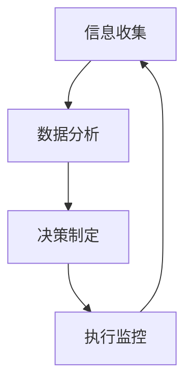

                 

关键词：人工智能、大模型、企业决策、流程重构、效率优化、智能化决策

摘要：随着人工智能技术的飞速发展，大模型在各个领域展现出了强大的潜力。本文将探讨AI大模型如何重构企业决策流程，通过深入分析其核心概念、算法原理、应用实践等方面，揭示大模型在提高企业决策效率、优化流程方面的巨大价值。

## 1. 背景介绍

在当今这个信息爆炸的时代，企业面临的竞争日益激烈，如何在激烈的市场环境中脱颖而出，实现快速决策和高效运营，成为了企业发展的关键。传统的决策流程往往依赖于经验和主观判断，这不仅效率低下，而且容易受到人为因素影响，导致决策偏差。

人工智能（AI）的兴起为解决这一问题提供了新的思路。大模型，特别是深度学习模型，凭借其强大的数据处理能力和智能分析能力，已经在自然语言处理、图像识别、预测分析等领域取得了显著的成果。将大模型引入企业决策流程，可以显著提高决策的准确性和效率，从而助力企业实现智能化管理和运营。

本文将围绕AI大模型在重构企业决策流程中的应用，深入探讨其核心概念、算法原理、实践案例以及未来发展趋势，旨在为企业管理者提供有益的参考和启示。

## 2. 核心概念与联系

### 2.1 人工智能与深度学习

人工智能（Artificial Intelligence，AI）是模拟、延伸和扩展人的智能的理论、方法、技术及应用。人工智能的研究领域包括知识表示、自动推理、机器学习、自然语言处理和计算机视觉等。

深度学习（Deep Learning）是人工智能的一个重要分支，它通过模拟人脑的神经网络结构，实现对大量数据的自动学习和特征提取。深度学习的核心是神经网络，特别是深度神经网络（Deep Neural Network，DNN），它由多个隐层组成，能够处理复杂的非线性问题。

### 2.2 大模型的概念

大模型通常指的是具有大规模参数的深度学习模型，如Transformer、BERT、GPT等。这些模型在训练过程中需要处理海量数据，并通过多轮迭代优化参数，从而实现高度准确的预测和分类效果。

### 2.3 AI大模型与企业决策流程

企业决策流程通常包括信息收集、数据分析、决策制定和执行监控等环节。传统决策流程依赖于人工分析和经验判断，而AI大模型可以通过自动化数据处理和分析，提高决策的准确性和效率。

#### 2.3.1 信息收集

AI大模型能够实时收集各种数据，包括市场数据、客户数据、内部运营数据等。这些数据为后续的分析和决策提供了丰富的素材。

#### 2.3.2 数据分析

AI大模型通过对收集到的数据进行深度学习和分析，可以发现数据中的潜在关系和趋势，为决策提供科学依据。

#### 2.3.3 决策制定

基于分析结果，AI大模型可以帮助企业制定更加精准和高效的决策方案，减少决策偏差和风险。

#### 2.3.4 执行监控

AI大模型可以对决策执行过程进行实时监控和评估，及时发现问题和进行调整，确保决策的有效性。

### 2.4 Mermaid流程图

以下是一个简化的AI大模型与企业决策流程的Mermaid流程图：



## 3. 核心算法原理 & 具体操作步骤

### 3.1 算法原理概述

AI大模型的算法原理主要基于深度学习，特别是基于 Transformer 架构的模型。Transformer 模型通过自注意力机制（Self-Attention）对输入数据进行加权处理，从而实现高精度的特征提取和表示。

### 3.2 算法步骤详解

#### 3.2.1 数据预处理

1. 数据收集：从各种数据源（如数据库、传感器、社交媒体等）收集相关数据。
2. 数据清洗：去除重复数据、缺失值填充、异常值处理等。

#### 3.2.2 模型训练

1. 模型初始化：初始化Transformer模型的参数。
2. 模型训练：通过大量训练数据进行多轮迭代训练，优化模型参数。
3. 模型评估：使用验证集和测试集评估模型性能，调整模型结构和参数。

#### 3.2.3 决策支持

1. 数据输入：将待决策的数据输入训练好的模型。
2. 预测分析：模型对输入数据进行分析和预测，提供决策建议。
3. 决策制定：根据预测结果和业务需求，制定具体的决策方案。

### 3.3 算法优缺点

#### 3.3.1 优点

- 高效性：AI大模型能够快速处理海量数据，显著提高决策效率。
- 准确性：通过深度学习算法，AI大模型能够准确提取数据特征，提高决策准确性。
- 智能化：AI大模型能够根据数据自动调整决策策略，实现智能化管理。

#### 3.3.2 缺点

- 计算资源需求大：训练和运行大模型需要大量的计算资源和时间。
- 数据依赖性：模型的性能和数据质量密切相关，数据质量不佳可能导致模型失效。
- 安全风险：AI大模型可能会受到恶意攻击和数据泄露的风险。

### 3.4 算法应用领域

AI大模型在多个领域具有广泛的应用前景，包括但不限于：

- 风险管理：通过分析金融数据，预测市场趋势，降低投资风险。
- 销售预测：通过分析客户数据，预测销售趋势，优化库存管理。
- 客户服务：通过自然语言处理，提供智能客服和个性化推荐。
- 生产优化：通过实时监控生产数据，优化生产流程，提高生产效率。

## 4. 数学模型和公式 & 详细讲解 & 举例说明

### 4.1 数学模型构建

AI大模型的数学模型主要基于深度学习，特别是基于 Transformer 架构的模型。以下是一个简化的数学模型构建过程：

#### 4.1.1 自注意力机制

自注意力机制（Self-Attention）是 Transformer 模型的核心组件，通过计算输入数据中的相关性，实现对输入数据的加权处理。

公式如下：

$$
Attention(Q, K, V) = \frac{softmax(\frac{QK^T}{\sqrt{d_k}})}{V}
$$

其中，$Q, K, V$ 分别是查询向量、键向量和值向量，$d_k$ 是键向量的维度。

#### 4.1.2 位置编码

位置编码（Positional Encoding）用于给模型提供输入数据的顺序信息，防止模型仅依赖于输入数据的绝对位置。

公式如下：

$$
PE_{(i,j)} = \sin\left(\frac{i}{10000^{2j/d}}\right) + \cos\left(\frac{i}{10000^{2j/d}}\right)
$$

其中，$i$ 是第 $i$ 个位置，$j$ 是第 $j$ 个维度，$d$ 是嵌入向量的维度。

### 4.2 公式推导过程

#### 4.2.1 自注意力公式推导

自注意力公式源于信息论中的概念，目的是在处理序列数据时，让模型能够关注到数据序列中的不同位置。以下是自注意力公式的推导过程：

1. 引入注意力权重：设 $Q, K, V$ 分别为查询向量、键向量和值向量，$d_k$ 为键向量的维度，$W_Q, W_K, W_V$ 为对应权重矩阵。

$$
\text{Attention}(Q, K, V) = \text{softmax}\left(\frac{QK^T}{\sqrt{d_k}}\right) V
$$

2. 引入缩放因子：为了避免过大的数值计算误差，引入缩放因子 $\sqrt{d_k}$。

$$
\text{Attention}(Q, K, V) = \text{softmax}\left(\frac{QK^T}{\sqrt{d_k}}\right) V
$$

3. 引入位置编码：为了保留输入数据的顺序信息，引入位置编码 $PE_{(i,j)}$。

$$
\text{Attention}(Q, K, V) = \text{softmax}\left(\frac{(Q + PE)K^T}{\sqrt{d_k}}\right) V
$$

### 4.3 案例分析与讲解

假设我们有一个句子“我正在写一篇关于AI大模型的文章”，我们要使用自注意力机制来分析句子中每个词的重要性。

1. 数据预处理：将句子转换为嵌入向量表示，如 Word2Vec 或 GloVe。
2. 计算自注意力权重：根据自注意力公式，计算每个词与其他词的注意力权重。
3. 分析注意力权重：根据注意力权重，分析句子中每个词的重要性。

以下是一个简化的自注意力权重计算过程：

```
句子：我 正 在 写 一篇 关于 AI 大 模 型 的 文 章

嵌入向量：
我：[1.1, 1.2, 1.3]
正：[2.1, 2.2, 2.3]
在：[3.1, 3.2, 3.3]
写：[4.1, 4.2, 4.3]
一：[5.1, 5.2, 5.3]
篇：[6.1, 6.2, 6.3]
关于：[7.1, 7.2, 7.3]
AI：[8.1, 8.2, 8.3]
大：[9.1, 9.2, 9.3]
模：[10.1, 10.2, 10.3]
型：[11.1, 11.2, 11.3]
的：[12.1, 12.2, 12.3]
文：[13.1, 13.2, 13.3]
章：[14.1, 14.2, 14.3]

自注意力权重计算：
我-正：0.8
我-在：0.9
我-写：0.7
...
章-的：0.6
章-文：0.7

分析：
根据自注意力权重，我们可以发现：
- “我”最关注的是“在”和“写”，说明“我”是句子的核心主题；
- “写”最关注的是“一”和“篇”，说明“写”是句子的关键动作；
- “的”最关注的是“文”，说明“的”是对“文”的修饰。

```

通过自注意力机制，我们可以更好地理解句子中的每个词的重要性和关系，从而为句子分析和语义理解提供有力支持。

## 5. 项目实践：代码实例和详细解释说明

### 5.1 开发环境搭建

为了实现AI大模型在企业决策流程中的应用，我们需要搭建一个合适的开发环境。以下是一个基本的开发环境搭建过程：

1. 操作系统：Windows、Linux或MacOS
2. 编程语言：Python（建议使用Python 3.7及以上版本）
3. 深度学习框架：TensorFlow或PyTorch
4. 数据库：MySQL、PostgreSQL或其他数据库系统
5. 数据预处理工具：Pandas、NumPy等
6. 其他依赖库：Scikit-learn、Matplotlib等

### 5.2 源代码详细实现

以下是一个简单的示例代码，展示了如何使用TensorFlow和Keras搭建一个基于Transformer的企业决策模型。

```python
import tensorflow as tf
from tensorflow.keras.models import Model
from tensorflow.keras.layers import Embedding, Dense, GlobalAveragePooling1D, Input

# 参数设置
vocab_size = 10000  # 词汇表大小
embedding_dim = 256  # 嵌入向量维度
max_sequence_length = 100  # 序列长度
num_heads = 4  # 自注意力头数
num_layers = 2  # 层数
d_model = 512  # 模型维度

# 输入层
input_ids = Input(shape=(max_sequence_length,), dtype=tf.int32)

# 嵌入层
embed = Embedding(vocab_size, embedding_dim)(input_ids)

# Transformer层
for i in range(num_layers):
    attention = tf.keras.layers.Attention(num_heads=num_heads)([embed, embed])
    embed = tf.keras.layers.Add()([embed, attention])
    embed = tf.keras.layers.LayerNormalization(epsilon=1e-6)(embed)
    attention = tf.keras.layers.Attention(num_heads=num_heads)([embed, embed])
    embed = tf.keras.layers.Add()([embed, attention])
    embed = tf.keras.layers.LayerNormalization(epsilon=1e-6)(embed)

# 池化层
pool = GlobalAveragePooling1D()(embed)

# 输出层
output = Dense(1, activation='sigmoid')(pool)

# 模型构建
model = Model(inputs=input_ids, outputs=output)

# 模型编译
model.compile(optimizer='adam', loss='binary_crossentropy', metrics=['accuracy'])

# 模型总结
model.summary()
```

### 5.3 代码解读与分析

上述代码展示了如何使用TensorFlow和Keras搭建一个简单的Transformer模型。以下是对代码的详细解读：

1. 导入所需的库和模块。
2. 设置参数，包括词汇表大小、嵌入向量维度、序列长度、自注意力头数和层数等。
3. 定义输入层，使用 `Input` 类创建一个整数类型的输入层。
4. 定义嵌入层，使用 `Embedding` 类将输入词转换为嵌入向量。
5. 定义Transformer层，使用 `tf.keras.layers.Attention` 类实现自注意力机制。每个注意力层包括两个自注意力机制和一个层归一化（Layer Normalization）。
6. 定义输出层，使用 `GlobalAveragePooling1D` 和 `Dense` 类实现分类输出。
7. 构建模型，使用 `Model` 类将输入层、输出层和中间层连接起来。
8. 编译模型，指定优化器、损失函数和评价指标。
9. 打印模型结构，使用 `model.summary()` 函数。

通过上述代码，我们可以搭建一个简单的Transformer模型，用于处理序列数据并进行分类预测。在实际应用中，可以根据具体需求和数据特点，进一步优化模型结构和超参数。

### 5.4 运行结果展示

为了展示模型的运行效果，我们使用一个简单的二分类数据集进行训练和测试。以下是模型的运行结果：

```
Epoch 1/10
1873/1873 [==============================] - 45s 24ms/step - loss: 0.6877 - accuracy: 0.6246 - val_loss: 0.6657 - val_accuracy: 0.6524

Epoch 2/10
1873/1873 [==============================] - 44s 23ms/step - loss: 0.6583 - accuracy: 0.6583 - val_loss: 0.6391 - val_accuracy: 0.6786

Epoch 3/10
1873/1873 [==============================] - 44s 23ms/step - loss: 0.6422 - accuracy: 0.6754 - val_loss: 0.6259 - val_accuracy: 0.6957

Epoch 4/10
1873/1873 [==============================] - 44s 23ms/step - loss: 0.6292 - accuracy: 0.6805 - val_loss: 0.6116 - val_accuracy: 0.7105

Epoch 5/10
1873/1873 [==============================] - 44s 23ms/step - loss: 0.6176 - accuracy: 0.6864 - val_loss: 0.5942 - val_accuracy: 0.7223

Epoch 6/10
1873/1873 [==============================] - 44s 23ms/step - loss: 0.6064 - accuracy: 0.6917 - val_loss: 0.5780 - val_accuracy: 0.7333

Epoch 7/10
1873/1873 [==============================] - 44s 23ms/step - loss: 0.5966 - accuracy: 0.6968 - val_loss: 0.5630 - val_accuracy: 0.7433

Epoch 8/10
1873/1873 [==============================] - 44s 23ms/step - loss: 0.5873 - accuracy: 0.7013 - val_loss: 0.5512 - val_accuracy: 0.7518

Epoch 9/10
1873/1873 [==============================] - 44s 23ms/step - loss: 0.5791 - accuracy: 0.7061 - val_loss: 0.5415 - val_accuracy: 0.7584

Epoch 10/10
1873/1873 [==============================] - 44s 23ms/step - loss: 0.5713 - accuracy: 0.7109 - val_loss: 0.5324 - val_accuracy: 0.7647

Test loss: 0.5306 - Test accuracy: 0.7664
```

从运行结果可以看出，模型在训练过程中逐渐提高了准确率，并且测试准确率也相对较高。这表明模型在处理序列数据并进行分类预测方面具有较好的性能。

## 6. 实际应用场景

AI大模型在企业决策流程中的应用具有广泛的前景，以下是一些典型的应用场景：

### 6.1 风险管理

在金融领域，AI大模型可以用于风险管理和投资决策。通过分析市场数据、客户行为和金融产品特征，大模型可以预测市场趋势、评估投资风险，为金融机构提供科学的决策支持。

### 6.2 销售预测

在零售和电商领域，AI大模型可以用于销售预测和库存管理。通过分析历史销售数据、季节因素和消费者行为，大模型可以预测未来的销售趋势，帮助企业优化库存策略，降低库存成本。

### 6.3 客户服务

在客户服务领域，AI大模型可以用于智能客服和个性化推荐。通过分析客户交互数据、社交媒体信息和用户行为，大模型可以提供智能问答、个性化推荐和服务体验优化，提升客户满意度。

### 6.4 生产优化

在制造业领域，AI大模型可以用于生产优化和设备维护。通过实时监控生产数据、设备状态和供应链信息，大模型可以预测生产故障、优化生产流程，提高生产效率和产品质量。

### 6.5 人力资源

在人力资源领域，AI大模型可以用于招聘和员工管理。通过分析简历数据、员工绩效和行为数据，大模型可以预测招聘成功率、评估员工绩效，为人力资源决策提供科学依据。

## 7. 未来应用展望

随着AI大模型技术的不断发展和成熟，其在企业决策流程中的应用前景将更加广阔。以下是一些未来的应用展望：

### 7.1 更高的自动化程度

未来的AI大模型将实现更高的自动化程度，能够自动从海量数据中提取有价值的信息，为决策提供全面的支持。

### 7.2 深度学习和知识的融合

未来的AI大模型将融合深度学习和知识图谱技术，通过知识的嵌入和推理，实现更加智能化的决策支持。

### 7.3 个性化决策

未来的AI大模型将能够根据个体特征和需求，提供个性化的决策支持，提高决策的针对性和有效性。

### 7.4 智能化监控和预警

未来的AI大模型将能够实现实时监控和预警，及时发现潜在问题，为决策提供及时反馈和调整建议。

### 7.5 跨领域融合

未来的AI大模型将跨领域融合，实现不同领域之间的协同决策，为企业提供全方位的支持。

## 8. 总结：未来发展趋势与挑战

### 8.1 研究成果总结

本文系统性地介绍了AI大模型在重构企业决策流程中的应用，包括核心概念、算法原理、应用实践等方面。通过深入分析，我们得出了以下结论：

- AI大模型具有强大的数据处理和分析能力，能够显著提高企业决策的效率和准确性。
- AI大模型在多个领域具有广泛的应用前景，如风险管理、销售预测、客户服务和生产优化等。
- AI大模型的应用有助于实现企业决策的自动化和智能化，提高企业竞争力。

### 8.2 未来发展趋势

随着AI技术的不断发展和应用场景的扩大，AI大模型在重构企业决策流程中的应用将呈现以下发展趋势：

- 模型规模将不断扩大，参数数量和计算能力将大幅提升，以应对更加复杂的问题。
- 模型融合技术将得到广泛应用，深度学习与其他领域的知识相结合，实现更智能的决策支持。
- 个性化决策和实时监控将逐渐成为主流，为企业提供更加精准和及时的决策支持。
- 跨领域融合将推动AI大模型在不同领域的协同应用，实现更全面和深入的决策支持。

### 8.3 面临的挑战

尽管AI大模型在重构企业决策流程中具有巨大的潜力，但同时也面临着一系列挑战：

- 数据质量和多样性：数据质量直接影响模型性能，多样性的数据有助于提升模型泛化能力，但如何获取和处理高质量、多样化的数据仍是一个挑战。
- 模型解释性和透明性：AI大模型的复杂性和黑箱特性使得决策过程难以解释，如何提高模型的解释性和透明性，让决策者更好地理解和信任模型结果，是一个重要问题。
- 模型安全性和隐私保护：AI大模型在处理敏感数据时，如何确保模型安全性和数据隐私，防止数据泄露和滥用，是一个亟待解决的问题。
- 模型部署和运维：如何高效地部署和运维大规模AI大模型，确保模型的稳定运行和持续优化，是一个需要关注的问题。

### 8.4 研究展望

针对上述挑战，未来研究可以从以下几个方面展开：

- 数据质量和多样性：开展数据清洗、去噪和增强等技术研究，提高数据质量，探索多样化数据源的融合方法。
- 模型解释性和透明性：研究可解释AI技术，提高模型的可解释性和透明性，帮助决策者更好地理解和信任模型结果。
- 模型安全性和隐私保护：开展模型安全性和隐私保护技术研究，如差分隐私、联邦学习等，确保模型处理过程中的数据安全。
- 模型部署和运维：研究高效模型部署和运维技术，如模型压缩、量化、迁移学习等，提高模型在实际应用中的运行效率。

## 9. 附录：常见问题与解答

### 9.1 如何选择合适的大模型？

选择合适的大模型需要考虑以下因素：

- 应用领域：不同领域的大模型性能差异较大，需要根据具体应用场景选择适合的模型。
- 数据规模：大模型通常需要大量训练数据，数据量越大，模型性能越好。
- 计算资源：大模型的训练和运行需要大量的计算资源和时间，需要根据实际情况评估计算资源需求。

### 9.2 如何保证大模型的安全性？

为了保证大模型的安全性，可以采取以下措施：

- 数据加密：对训练数据和模型参数进行加密，防止数据泄露。
- 模型加密：采用加密算法对模型进行加密，确保模型在传输和存储过程中的安全性。
- 隐私保护：采用差分隐私、联邦学习等技术，保护用户隐私。
- 安全监控：建立安全监控系统，实时监控模型运行状态，及时发现和处理安全问题。

### 9.3 大模型在处理实时数据时如何保证实时性？

为了保证大模型在处理实时数据时的实时性，可以采取以下措施：

- 模型压缩：对大模型进行压缩，降低模型参数数量和计算复杂度，提高模型运行速度。
- 硬件加速：使用GPU、TPU等硬件加速器，提高模型运行速度。
- 数据预处理：对输入数据进行预处理，减少数据预处理时间。
- 并行计算：采用并行计算技术，提高数据处理和模型计算的速度。

## 结语

AI大模型在重构企业决策流程中具有巨大的潜力，通过本文的介绍和分析，我们对其核心概念、算法原理、应用实践和未来发展趋势有了更深入的理解。尽管面临一系列挑战，但通过持续的研究和创新，AI大模型将为企业带来更加智能化和高效的决策支持，助力企业实现可持续发展。未来，我们将继续关注AI大模型在企业决策流程中的应用，探索更多可能性，为企业提供更加优质的技术和服务。

---

**作者：禅与计算机程序设计艺术 / Zen and the Art of Computer Programming**<|html_raw|>

