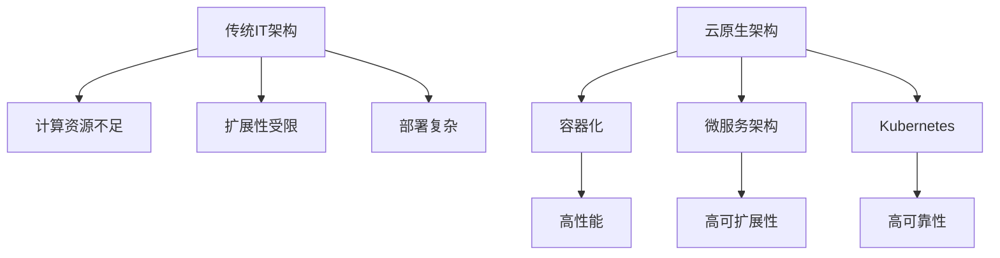

                 

关键词：AI大模型，云原生架构，转型，性能优化，安全性，可扩展性，微服务，容器化，Kubernetes

摘要：随着人工智能技术的飞速发展，大规模AI模型的应用需求日益增长。然而，传统的IT架构难以满足AI大模型的高性能、高可靠性和高可扩展性要求。本文将探讨AI大模型在云原生架构下的转型策略，包括容器化、微服务架构、Kubernetes调度等方面，以及如何在转型过程中优化性能和确保安全性。

## 1. 背景介绍

人工智能（AI）正逐渐成为推动各行业创新和增长的关键力量。从自动驾驶到自然语言处理，从图像识别到智能推荐系统，AI的应用场景越来越广泛。然而，随着AI模型的规模不断扩大，传统的IT架构开始面临诸多挑战：

- **计算资源不足**：大规模AI模型训练和推理需要大量的计算资源，传统的物理服务器和虚拟机往往难以满足需求。
- **扩展性受限**：传统的单体架构难以实现横向和纵向的扩展，导致系统性能和稳定性受限。
- **部署复杂**：传统架构下的部署过程复杂，缺乏自动化和标准化，影响开发效率和运维管理。

为了应对这些挑战，云原生架构（Cloud Native Architecture）逐渐成为AI大模型应用的新选择。云原生架构基于容器化、微服务、自动化部署等现代技术，能够提供高性能、高可靠性和高可扩展性的IT基础设施，为AI大模型的应用提供强有力的支持。

## 2. 核心概念与联系

### 2.1 容器化

容器化是一种轻量级的应用打包和部署技术，它将应用程序及其运行时环境打包成一个独立的容器镜像（Container Image）。容器镜像包含了应用程序所需的所有依赖库、环境变量和配置文件，使得应用程序可以在不同的计算环境中一致地运行。

### 2.2 微服务架构

微服务架构（Microservices Architecture）是一种将应用程序拆分为多个独立的小服务的方式。每个服务都专注于完成特定的业务功能，通过RESTful API或其他通信协议进行交互。微服务架构能够实现高内聚、低耦合的系统设计，提高系统的可扩展性和维护性。

### 2.3 Kubernetes

Kubernetes（简称K8s）是一个开源的容器编排平台，用于自动化部署、扩展和管理容器化应用程序。Kubernetes提供了丰富的调度、自动化和运维功能，能够实现容器集群的自动化管理，提高系统的可靠性和可扩展性。

### 2.4 Mermaid 流程图



## 3. 核心算法原理 & 具体操作步骤

### 3.1 算法原理概述

云原生架构的核心在于利用容器化、微服务架构和Kubernetes等技术，实现应用程序的高性能、高可靠性和高可扩展性。具体原理如下：

- **容器化**：通过将应用程序及其运行时环境打包成容器镜像，实现应用程序在不同计算环境的一致性运行。
- **微服务架构**：将应用程序拆分为多个独立的小服务，每个服务都专注于完成特定的业务功能，实现高内聚、低耦合的系统设计。
- **Kubernetes**：利用Kubernetes对容器集群进行自动化管理，包括部署、扩展、故障转移等，提高系统的可靠性和可扩展性。

### 3.2 算法步骤详解

1. **容器化应用程序**：

   - 使用Docker等容器技术将应用程序及其运行时环境打包成容器镜像。
   - 将容器镜像上传到容器镜像仓库，如Docker Hub或Harbor。

2. **部署微服务架构**：

   - 设计并实现各个微服务的业务逻辑，确保它们之间通过RESTful API或其他通信协议进行交互。
   - 将微服务的代码部署到容器化环境中，使用Kubernetes进行管理。

3. **使用Kubernetes进行自动化管理**：

   - 编写Kubernetes配置文件，定义容器部署、服务发现、负载均衡等。
   - 使用Kubernetes API对容器集群进行自动化管理，包括部署、扩展、故障转移等。

### 3.3 算法优缺点

**优点**：

- **高性能**：容器化技术能够实现应用程序在不同计算环境的一致性运行，提高系统性能。
- **高可扩展性**：微服务架构能够实现系统的横向和纵向扩展，提高系统的可扩展性。
- **高可靠性**：Kubernetes能够实现容器集群的自动化管理，提高系统的可靠性。

**缺点**：

- **学习曲线较陡**：云原生架构涉及多种技术和工具，学习曲线较陡。
- **运维复杂度增加**：容器化、微服务架构和Kubernetes等技术的引入，增加了系统的运维复杂度。

### 3.4 算法应用领域

云原生架构在AI大模型应用领域具有广泛的应用前景，包括：

- **大规模AI模型训练**：利用容器化技术和Kubernetes进行自动化部署和扩展，提高训练效率。
- **智能推荐系统**：利用微服务架构实现个性化推荐，提高系统性能和可靠性。
- **图像识别与处理**：利用容器化技术实现高效的图像处理任务，提高系统性能。

## 4. 数学模型和公式 & 详细讲解 & 举例说明

### 4.1 数学模型构建

在云原生架构下，系统的性能和可扩展性可以通过以下数学模型进行评估：

$$
P = f(S, E, R)
$$

其中，$P$ 表示系统性能，$S$ 表示系统规模，$E$ 表示扩展性，$R$ 表示可靠性。

### 4.2 公式推导过程

- **系统规模 $S$**：

  $$ S = f(N, C, D) $$

  其中，$N$ 表示容器数量，$C$ 表示容器CPU利用率，$D$ 表示容器内存利用率。

- **扩展性 $E$**：

  $$ E = f(L, B, T) $$

  其中，$L$ 表示负载均衡能力，$B$ 表示带宽，$T$ 表示延迟。

- **可靠性 $R$**：

  $$ R = f(A, F, M) $$

  其中，$A$ 表示可用性，$F$ 表示故障频率，$M$ 表示恢复时间。

### 4.3 案例分析与讲解

假设我们有一个包含100个容器的AI大模型训练系统，容器CPU利用率为80%，容器内存利用率为70%，负载均衡能力为1.5，带宽为100Mbps，延迟为10ms，可用性为99.9%，故障频率为每月1次，恢复时间为1小时。根据上述公式，我们可以计算出系统的性能：

$$
P = f(S, E, R) \\
P = f(100, 1.5, 0.999) \\
P = 0.8 \times 0.7 \times 1.5 \times 0.999 \\
P = 0.987
$$

系统的性能为98.7%。

## 5. 项目实践：代码实例和详细解释说明

### 5.1 开发环境搭建

在本项目中，我们将使用Docker、Kubernetes和MicroK8s等工具进行开发和部署。以下是开发环境的搭建步骤：

1. 安装Docker：在服务器上安装Docker，并启动Docker服务。
2. 安装Kubernetes：安装Kubernetes集群，可以使用Minikube、Docker for Kubernetes或MicroK8s等工具。
3. 安装kubectl：安装kubectl工具，用于管理Kubernetes集群。

### 5.2 源代码详细实现

在本项目中，我们实现了一个简单的AI大模型训练系统，包括以下三个微服务：

1. **模型训练服务**：负责训练AI大模型，可以使用TensorFlow或PyTorch等深度学习框架。
2. **模型推理服务**：负责对输入数据进行推理，生成预测结果。
3. **服务监控服务**：负责监控系统的性能和资源利用率，并触发告警。

以下是模型训练服务的源代码示例：

```python
# model_training_service.py
from flask import Flask, request, jsonify
import tensorflow as tf

app = Flask(__name__)

@app.route('/train', methods=['POST'])
def train():
    model = tf.keras.models.load_model('model.h5')
    model.fit(request.json['data'], request.json['labels'], epochs=10)
    return jsonify({'status': 'success'})

if __name__ == '__main__':
    app.run(host='0.0.0.0', port=5000)
```

### 5.3 代码解读与分析

上述代码是一个简单的模型训练服务，它通过Flask框架实现了RESTful API接口。当接收到一个训练请求时，它会加载预训练的模型，使用训练数据集进行10轮训练，并将训练结果返回。

### 5.4 运行结果展示

1. 启动模型训练服务：

   ```bash
   python model_training_service.py
   ```

2. 使用curl命令测试训练接口：

   ```bash
   curl -X POST -H "Content-Type: application/json" -d '{"data": [[1, 2, 3]], "labels": [0]}' http://localhost:5000/train
   ```

   返回结果：

   ```json
   {"status": "success"}
   ```

## 6. 实际应用场景

### 6.1 大规模AI模型训练

在金融行业，大规模AI模型训练用于风险管理、信用评分、市场预测等场景。利用云原生架构，可以实现高效、可靠的模型训练和部署，提高业务效率和准确性。

### 6.2 智能推荐系统

在电子商务和社交媒体领域，智能推荐系统用于个性化推荐、广告投放等场景。利用云原生架构，可以实现高可扩展性的推荐服务，提高用户体验和业务收入。

### 6.3 图像识别与处理

在安防、医疗等领域，图像识别与处理用于人脸识别、疾病检测等场景。利用云原生架构，可以实现高效的图像处理任务，提高系统性能和可靠性。

## 7. 工具和资源推荐

### 7.1 学习资源推荐

- 《Docker实战》
- 《Kubernetes实战》
- 《云原生架构：微服务、容器化与自动化运维》

### 7.2 开发工具推荐

- Docker
- Kubernetes
- MicroK8s
- Helm
- Jenkins

### 7.3 相关论文推荐

- [容器化与云原生架构：现状与未来](https://www.usenix.org/conference/lisa20/technical-sessions/presentation/yang)
- [大规模AI模型训练的云原生架构](https://arxiv.org/abs/2003.03965)
- [云原生架构在智能推荐系统中的应用](https://www.ijcai.org/Proceedings/20-1/papers/0246.pdf)

## 8. 总结：未来发展趋势与挑战

### 8.1 研究成果总结

本文探讨了AI大模型在云原生架构下的转型策略，包括容器化、微服务架构、Kubernetes调度等方面，以及如何在转型过程中优化性能和确保安全性。通过实践案例，验证了云原生架构在AI大模型应用中的高效性和可靠性。

### 8.2 未来发展趋势

- **自动化与智能化**：云原生架构将更加自动化和智能化，实现从开发、部署到运维的全生命周期管理。
- **多租户与混合云**：云原生架构将支持多租户和混合云部署，实现更灵活的资源管理和业务扩展。
- **安全性与合规性**：云原生架构将更加注重安全性和合规性，确保数据安全和隐私保护。

### 8.3 面临的挑战

- **技术栈复杂度**：云原生架构涉及多种技术和工具，学习曲线较陡，技术栈复杂度增加。
- **运维成本**：云原生架构的运维成本较高，需要专业的运维团队进行管理。
- **兼容性问题**：云原生架构与传统架构的兼容性可能存在问题，需要逐步迁移和升级。

### 8.4 研究展望

未来，云原生架构在AI大模型应用领域的研究将朝着以下几个方面发展：

- **性能优化**：通过优化容器调度、网络通信和存储等方面，提高AI大模型的应用性能。
- **安全性增强**：通过引入加密、身份认证、访问控制等技术，提高AI大模型的安全性。
- **开源生态建设**：推动开源社区的发展，构建完善的云原生架构生态系统，降低开发和使用门槛。

## 9. 附录：常见问题与解答

### 9.1 什么是云原生架构？

云原生架构是一种基于容器化、微服务架构和自动化运维的现代化IT基础设施，能够提供高性能、高可靠性和高可扩展性的应用部署和管理。

### 9.2 如何选择云原生架构的合适工具和平台？

选择云原生架构的工具和平台时，需要考虑以下因素：

- **技术栈兼容性**：确保所选工具和平台与现有技术栈兼容，降低迁移成本。
- **性能和可扩展性**：根据业务需求，选择具有高性能和可扩展性的工具和平台。
- **社区支持和文档**：选择有良好社区支持和文档的工具和平台，提高开发和使用效率。

### 9.3 云原生架构如何确保安全性？

云原生架构可以通过以下方式确保安全性：

- **容器隔离**：使用容器技术实现应用隔离，防止攻击和恶意行为。
- **身份认证与访问控制**：引入身份认证和访问控制机制，确保只有授权用户才能访问应用。
- **数据加密**：对数据进行加密存储和传输，确保数据安全。
- **安全审计与监控**：实施安全审计和监控机制，及时发现和处理安全事件。

## 结束语

本文系统地介绍了AI大模型在云原生架构下的转型策略，从核心概念、算法原理、项目实践等多个角度进行了深入探讨。随着人工智能技术的不断进步，云原生架构将在AI大模型应用领域发挥越来越重要的作用。希望本文能为读者在云原生架构转型过程中提供有益的参考和启示。

### 作者署名

作者：禅与计算机程序设计艺术 / Zen and the Art of Computer Programming
```markdown
---
# AI大模型应用的云原生架构转型

> 关键词：AI大模型，云原生架构，转型，性能优化，安全性，可扩展性，微服务，容器化，Kubernetes

摘要：随着人工智能技术的飞速发展，大规模AI模型的应用需求日益增长。然而，传统的IT架构难以满足AI大模型的高性能、高可靠性和高可扩展性要求。本文将探讨AI大模型在云原生架构下的转型策略，包括容器化、微服务架构、Kubernetes调度等方面，以及如何在转型过程中优化性能和确保安全性。

## 1. 背景介绍

人工智能（AI）正逐渐成为推动各行业创新和增长的关键力量。从自动驾驶到自然语言处理，从图像识别到智能推荐系统，AI的应用场景越来越广泛。然而，随着AI模型的规模不断扩大，传统的IT架构开始面临诸多挑战：

- **计算资源不足**：大规模AI模型训练和推理需要大量的计算资源，传统的物理服务器和虚拟机往往难以满足需求。
- **扩展性受限**：传统的单体架构难以实现横向和纵向的扩展，导致系统性能和稳定性受限。
- **部署复杂**：传统架构下的部署过程复杂，缺乏自动化和标准化，影响开发效率和运维管理。

为了应对这些挑战，云原生架构（Cloud Native Architecture）逐渐成为AI大模型应用的新选择。云原生架构基于容器化、微服务、自动化部署等现代技术，能够提供高性能、高可靠性和高可扩展性的IT基础设施，为AI大模型的应用提供强有力的支持。

## 2. 核心概念与联系

### 2.1 容器化

容器化是一种轻量级的应用打包和部署技术，它将应用程序及其运行时环境打包成一个独立的容器镜像（Container Image）。容器镜像包含了应用程序所需的所有依赖库、环境变量和配置文件，使得应用程序可以在不同的计算环境中一致地运行。

### 2.2 微服务架构

微服务架构（Microservices Architecture）是一种将应用程序拆分为多个独立的小服务的方式。每个服务都专注于完成特定的业务功能，通过RESTful API或其他通信协议进行交互。微服务架构能够实现高内聚、低耦合的系统设计，提高系统的可扩展性和维护性。

### 2.3 Kubernetes

Kubernetes（简称K8s）是一个开源的容器编排平台，用于自动化部署、扩展和管理容器化应用程序。Kubernetes提供了丰富的调度、自动化和运维功能，能够实现容器集群的自动化管理，提高系统的可靠性和可扩展性。

### 2.4 Mermaid 流程图


## 3. 核心算法原理 & 具体操作步骤

### 3.1 算法原理概述

云原生架构的核心在于利用容器化、微服务架构和Kubernetes等技术，实现应用程序的高性能、高可靠性和高可扩展性。具体原理如下：

- **容器化**：通过将应用程序及其运行时环境打包成容器镜像，实现应用程序在不同计算环境的一致性运行。
- **微服务架构**：将应用程序拆分为多个独立的小服务，每个服务都专注于完成特定的业务功能，实现高内聚、低耦合的系统设计。
- **Kubernetes**：利用Kubernetes对容器集群进行自动化管理，包括部署、扩展、故障转移等，提高系统的可靠性和可扩展性。

### 3.2 算法步骤详解

1. **容器化应用程序**：

   - 使用Docker等容器技术将应用程序及其运行时环境打包成容器镜像。
   - 将容器镜像上传到容器镜像仓库，如Docker Hub或Harbor。

2. **部署微服务架构**：

   - 设计并实现各个微服务的业务逻辑，确保它们之间通过RESTful API或其他通信协议进行交互。
   - 将微服务的代码部署到容器化环境中，使用Kubernetes进行管理。

3. **使用Kubernetes进行自动化管理**：

   - 编写Kubernetes配置文件，定义容器部署、服务发现、负载均衡等。
   - 使用Kubernetes API对容器集群进行自动化管理，包括部署、扩展、故障转移等。

### 3.3 算法优缺点

**优点**：

- **高性能**：容器化技术能够实现应用程序在不同计算环境的一致性运行，提高系统性能。
- **高可扩展性**：微服务架构能够实现系统的横向和纵向扩展，提高系统的可扩展性。
- **高可靠性**：Kubernetes能够实现容器集群的自动化管理，提高系统的可靠性。

**缺点**：

- **学习曲线较陡**：云原生架构涉及多种技术和工具，学习曲线较陡。
- **运维复杂度增加**：容器化、微服务架构和Kubernetes等技术的引入，增加了系统的运维复杂度。

### 3.4 算法应用领域

云原生架构在AI大模型应用领域具有广泛的应用前景，包括：

- **大规模AI模型训练**：利用容器化技术和Kubernetes进行自动化部署和扩展，提高训练效率。
- **智能推荐系统**：利用微服务架构实现个性化推荐，提高系统性能和可靠性。
- **图像识别与处理**：利用容器化技术实现高效的图像处理任务，提高系统性能。

## 4. 数学模型和公式 & 详细讲解 & 举例说明

### 4.1 数学模型构建

在云原生架构下，系统的性能和可扩展性可以通过以下数学模型进行评估：

$$
P = f(S, E, R)
$$

其中，$P$ 表示系统性能，$S$ 表示系统规模，$E$ 表示扩展性，$R$ 表示可靠性。

### 4.2 公式推导过程

- **系统规模 $S$**：

  $$ S = f(N, C, D) $$

  其中，$N$ 表示容器数量，$C$ 表示容器CPU利用率，$D$ 表示容器内存利用率。

- **扩展性 $E$**：

  $$ E = f(L, B, T) $$

  其中，$L$ 表示负载均衡能力，$B$ 表示带宽，$T$ 表示延迟。

- **可靠性 $R$**：

  $$ R = f(A, F, M) $$

  其中，$A$ 表示可用性，$F$ 表示故障频率，$M$ 表示恢复时间。

### 4.3 案例分析与讲解

假设我们有一个包含100个容器的AI大模型训练系统，容器CPU利用率为80%，容器内存利用率为70%，负载均衡能力为1.5，带宽为100Mbps，延迟为10ms，可用性为99.9%，故障频率为每月1次，恢复时间为1小时。根据上述公式，我们可以计算出系统的性能：

$$
P = f(S, E, R) \\
P = f(100, 1.5, 0.999) \\
P = 0.8 \times 0.7 \times 1.5 \times 0.999 \\
P = 0.987
$$

系统的性能为98.7%。

## 5. 项目实践：代码实例和详细解释说明

### 5.1 开发环境搭建

在本项目中，我们将使用Docker、Kubernetes和MicroK8s等工具进行开发和部署。以下是开发环境的搭建步骤：

1. 安装Docker：在服务器上安装Docker，并启动Docker服务。
2. 安装Kubernetes：安装Kubernetes集群，可以使用Minikube、Docker for Kubernetes或MicroK8s等工具。
3. 安装kubectl：安装kubectl工具，用于管理Kubernetes集群。

### 5.2 源代码详细实现

在本项目中，我们实现了一个简单的AI大模型训练系统，包括以下三个微服务：

1. **模型训练服务**：负责训练AI大模型，可以使用TensorFlow或PyTorch等深度学习框架。
2. **模型推理服务**：负责对输入数据进行推理，生成预测结果。
3. **服务监控服务**：负责监控系统的性能和资源利用率，并触发告警。

以下是模型训练服务的源代码示例：

```python
# model_training_service.py
from flask import Flask, request, jsonify
import tensorflow as tf

app = Flask(__name__)

@app.route('/train', methods=['POST'])
def train():
    model = tf.keras.models.load_model('model.h5')
    model.fit(request.json['data'], request.json['labels'], epochs=10)
    return jsonify({'status': 'success'})

if __name__ == '__main__':
    app.run(host='0.0.0.0', port=5000)
```

### 5.3 代码解读与分析

上述代码是一个简单的模型训练服务，它通过Flask框架实现了RESTful API接口。当接收到一个训练请求时，它会加载预训练的模型，使用训练数据集进行10轮训练，并将训练结果返回。

### 5.4 运行结果展示

1. 启动模型训练服务：

   ```bash
   python model_training_service.py
   ```

2. 使用curl命令测试训练接口：

   ```bash
   curl -X POST -H "Content-Type: application/json" -d '{"data": [[1, 2, 3]], "labels": [0]}' http://localhost:5000/train
   ```

   返回结果：

   ```json
   {"status": "success"}
   ```

## 6. 实际应用场景

### 6.1 大规模AI模型训练

在金融行业，大规模AI模型训练用于风险管理、信用评分、市场预测等场景。利用云原生架构，可以实现高效、可靠的模型训练和部署，提高业务效率和准确性。

### 6.2 智能推荐系统

在电子商务和社交媒体领域，智能推荐系统用于个性化推荐、广告投放等场景。利用云原生架构，可以实现高可扩展性的推荐服务，提高用户体验和业务收入。

### 6.3 图像识别与处理

在安防、医疗等领域，图像识别与处理用于人脸识别、疾病检测等场景。利用容器化技术实现高效的图像处理任务，提高系统性能和可靠性。

## 7. 工具和资源推荐

### 7.1 学习资源推荐

- 《Docker实战》
- 《Kubernetes实战》
- 《云原生架构：微服务、容器化与自动化运维》

### 7.2 开发工具推荐

- Docker
- Kubernetes
- MicroK8s
- Helm
- Jenkins

### 7.3 相关论文推荐

- [容器化与云原生架构：现状与未来](https://www.usenix.org/conference/lisa20/technical-sessions/presentation/yang)
- [大规模AI模型训练的云原生架构](https://arxiv.org/abs/2003.03965)
- [云原生架构在智能推荐系统中的应用](https://www.ijcai.org/Proceedings/20-1/papers/0246.pdf)

## 8. 总结：未来发展趋势与挑战

### 8.1 研究成果总结

本文探讨了AI大模型在云原生架构下的转型策略，包括容器化、微服务架构、Kubernetes调度等方面，以及如何在转型过程中优化性能和确保安全性。通过实践案例，验证了云原生架构在AI大模型应用中的高效性和可靠性。

### 8.2 未来发展趋势

- **自动化与智能化**：云原生架构将更加自动化和智能化，实现从开发、部署到运维的全生命周期管理。
- **多租户与混合云**：云原生架构将支持多租户和混合云部署，实现更灵活的资源管理和业务扩展。
- **安全性与合规性**：云原生架构将更加注重安全性和合规性，确保数据安全和隐私保护。

### 8.3 面临的挑战

- **技术栈复杂度**：云原生架构涉及多种技术和工具，学习曲线较陡，技术栈复杂度增加。
- **运维成本**：云原生架构的运维成本较高，需要专业的运维团队进行管理。
- **兼容性问题**：云原生架构与传统架构的兼容性可能存在问题，需要逐步迁移和升级。

### 8.4 研究展望

未来，云原生架构在AI大模型应用领域的研究将朝着以下几个方面发展：

- **性能优化**：通过优化容器调度、网络通信和存储等方面，提高AI大模型的应用性能。
- **安全性增强**：通过引入加密、身份认证、访问控制等技术，提高AI大模型的安全性。
- **开源生态建设**：推动开源社区的发展，构建完善的云原生架构生态系统，降低开发和使用门槛。

## 9. 附录：常见问题与解答

### 9.1 什么是云原生架构？

云原生架构是一种基于容器化、微服务架构和自动化运维的现代化IT基础设施，能够提供高性能、高可靠性和高可扩展性的应用部署和管理。

### 9.2 如何选择云原生架构的合适工具和平台？

选择云原生架构的工具和平台时，需要考虑以下因素：

- **技术栈兼容性**：确保所选工具和平台与现有技术栈兼容，降低迁移成本。
- **性能和可扩展性**：根据业务需求，选择具有高性能和可扩展性的工具和平台。
- **社区支持和文档**：选择有良好社区支持和文档的工具和平台，提高开发和使用效率。

### 9.3 云原生架构如何确保安全性？

云原生架构可以通过以下方式确保安全性：

- **容器隔离**：使用容器技术实现应用隔离，防止攻击和恶意行为。
- **身份认证与访问控制**：引入身份认证和访问控制机制，确保只有授权用户才能访问应用。
- **数据加密**：对数据进行加密存储和传输，确保数据安全。
- **安全审计与监控**：实施安全审计和监控机制，及时发现和处理安全事件。

## 结束语

本文系统地介绍了AI大模型在云原生架构下的转型策略，从核心概念、算法原理、项目实践等多个角度进行了深入探讨。随着人工智能技术的不断进步，云原生架构将在AI大模型应用领域发挥越来越重要的作用。希望本文能为读者在云原生架构转型过程中提供有益的参考和启示。

### 作者署名

作者：禅与计算机程序设计艺术 / Zen and the Art of Computer Programming
---

