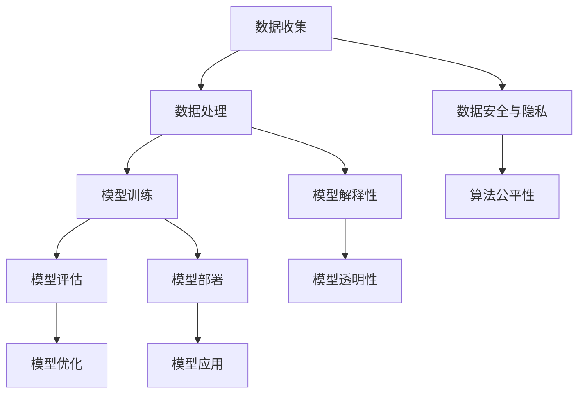

                 

关键词：AI大模型、人才需求、培养、专业素养、技术应用、行业前景

摘要：本文旨在探讨AI大模型在当前时代的技术应用与人才需求，并分析人才培养的策略与路径。随着AI技术的不断进步，大模型在自然语言处理、计算机视觉等领域发挥着重要作用。然而，要充分发挥大模型潜力，需要拥有相应技术素养的人才。本文将深入剖析AI大模型领域的专业需求，探讨人才培养的关键环节，为相关从业人员及教育机构提供指导。

## 1. 背景介绍

近年来，人工智能（AI）技术取得了飞速发展，尤其在深度学习领域，AI大模型如GPT-3、BERT等取得了显著的成就。这些大模型在自然语言处理、计算机视觉、语音识别等众多领域展现出了强大的能力，推动了行业技术革新。然而，AI大模型的开发和优化需要专业的技术人才，这对人才市场需求和培养提出了新的挑战。

### 1.1 技术背景

AI大模型，即大规模的人工神经网络模型，具有数十亿甚至千亿级别的参数量。这类模型通过在大量数据上进行训练，能够实现高水平的表现，例如在图像识别、语言生成、机器翻译等方面。近年来，GPU（图形处理单元）和TPU（张量处理单元）等高性能计算硬件的发展，为AI大模型的训练提供了强大的支持。

### 1.2 应用领域

AI大模型的应用领域广泛，包括但不限于：

- **自然语言处理（NLP）**：如文本生成、问答系统、机器翻译等。
- **计算机视觉（CV）**：如图像识别、物体检测、图像生成等。
- **语音识别**：如语音识别、语音合成等。
- **推荐系统**：如个性化推荐、广告投放等。
- **医疗健康**：如疾病诊断、药物研发等。

### 1.3 发展趋势

随着技术的不断进步，AI大模型的应用将更加广泛，其发展也将面临新的挑战和机遇。一方面，数据的增长和算法的优化将持续推动大模型性能的提升；另一方面，数据安全和隐私保护、算法公平性和透明性等问题将成为关注的焦点。

## 2. 核心概念与联系

在深入探讨AI大模型的应用之前，有必要先了解一些核心概念，以及它们之间的相互关系。以下是几个关键概念及其关系的Mermaid流程图。



### 2.1 数据收集与处理

数据是AI大模型训练的基础，数据的收集与处理至关重要。数据收集包括数据来源、数据类型和数据质量等方面。数据处理则涉及数据清洗、数据预处理和数据增强等步骤，以确保数据能够满足模型训练的要求。

### 2.2 模型训练与评估

模型训练是通过优化模型参数，使模型能够在训练数据上达到较高的准确性。模型评估则是通过测试数据检验模型的性能，常用的评估指标包括准确率、召回率、F1值等。

### 2.3 模型部署与应用

模型部署是将训练好的模型部署到生产环境中，实现实际应用。模型应用涉及模型在不同领域的应用，如自然语言处理、计算机视觉等。

### 2.4 数据安全与隐私保护

随着AI大模型的应用，数据安全和隐私保护成为重要议题。数据安全和隐私保护措施包括数据加密、访问控制、隐私增强技术等。

### 2.5 模型解释性与透明性

模型解释性和透明性是AI大模型面临的重要挑战。解释性旨在使模型决策过程更加透明，提高用户对模型的信任度；透明性则涉及模型的设计、训练和评估过程，以增加模型的可理解性。

## 3. 核心算法原理 & 具体操作步骤

### 3.1 算法原理概述

AI大模型的核心算法主要包括深度神经网络（DNN）、循环神经网络（RNN）、长短期记忆网络（LSTM）等。这些算法通过多层神经网络结构对数据进行处理和建模，实现复杂的函数映射。

### 3.2 算法步骤详解

1. **数据收集与处理**：收集数据，并进行数据清洗、预处理和增强。
2. **模型设计**：设计神经网络结构，包括输入层、隐藏层和输出层。
3. **模型训练**：使用训练数据对模型进行训练，通过反向传播算法优化模型参数。
4. **模型评估**：使用测试数据对模型进行评估，选择性能较好的模型。
5. **模型部署**：将训练好的模型部署到生产环境中，实现实际应用。

### 3.3 算法优缺点

**优点**：

- **强大的表示能力**：能够对大量数据进行建模，实现高水平的表现。
- **自适应性强**：能够通过训练不断优化模型性能。

**缺点**：

- **计算复杂度高**：训练过程需要大量计算资源。
- **数据需求量大**：需要大量的数据支持训练。

### 3.4 算法应用领域

AI大模型在多个领域有着广泛的应用，如：

- **自然语言处理**：如文本生成、机器翻译、问答系统等。
- **计算机视觉**：如图像识别、物体检测、图像生成等。
- **语音识别**：如语音识别、语音合成等。
- **推荐系统**：如个性化推荐、广告投放等。

## 4. 数学模型和公式 & 详细讲解 & 举例说明

### 4.1 数学模型构建

AI大模型的数学模型主要基于深度学习理论，核心包括以下几个部分：

- **激活函数**：如ReLU、Sigmoid、Tanh等。
- **损失函数**：如交叉熵损失、均方误差等。
- **优化算法**：如梯度下降、Adam等。

### 4.2 公式推导过程

以下是一个简单的深度神经网络模型的数学公式推导：

$$
y' = \sigma(z) = \frac{1}{1 + e^{-z}}
$$

其中，$y'$表示输出值，$z$表示线性组合，$\sigma$表示激活函数。

### 4.3 案例分析与讲解

假设我们有一个二分类问题，需要使用深度神经网络模型进行预测。输入数据为特征向量$x$，输出为标签$y$。

1. **模型设计**：

   - 输入层：1个神经元，接收特征向量$x$。
   - 隐藏层：2个神经元，使用ReLU激活函数。
   - 输出层：1个神经元，使用Sigmoid激活函数。

2. **模型训练**：

   - 初始化模型参数，如权重$W$和偏置$b$。
   - 通过反向传播算法优化模型参数，最小化损失函数。

3. **模型评估**：

   - 使用测试集对模型进行评估，计算准确率、召回率等指标。

4. **模型部署**：

   - 将训练好的模型部署到生产环境中，进行实际应用。

## 5. 项目实践：代码实例和详细解释说明

### 5.1 开发环境搭建

- 安装Python环境，版本为3.8及以上。
- 安装深度学习框架，如TensorFlow或PyTorch。
- 配置GPU或TPU支持。

### 5.2 源代码详细实现

以下是使用TensorFlow实现一个简单的二分类问题的代码实例：

```python
import tensorflow as tf

# 模型设计
model = tf.keras.Sequential([
    tf.keras.layers.Dense(2, activation='relu', input_shape=(1,)),
    tf.keras.layers.Dense(1, activation='sigmoid')
])

# 模型编译
model.compile(optimizer='adam', loss='binary_crossentropy', metrics=['accuracy'])

# 模型训练
model.fit(x_train, y_train, epochs=10, batch_size=32, validation_data=(x_val, y_val))

# 模型评估
loss, accuracy = model.evaluate(x_test, y_test)
print(f"Test accuracy: {accuracy:.2f}")
```

### 5.3 代码解读与分析

1. **模型设计**：

   - `Dense`层表示全连接层，用于处理输入数据。
   - `input_shape`指定输入数据的形状。
   - `activation`参数设置激活函数。

2. **模型编译**：

   - `optimizer`设置优化算法。
   - `loss`设置损失函数。
   - `metrics`设置评估指标。

3. **模型训练**：

   - `fit`方法用于训练模型。
   - `epochs`设置训练轮数。
   - `batch_size`设置批量大小。
   - `validation_data`用于验证集评估。

4. **模型评估**：

   - `evaluate`方法用于评估模型性能。

### 5.4 运行结果展示

在完成上述步骤后，我们可以在控制台上看到模型的训练进度和最终评估结果。

## 6. 实际应用场景

### 6.1 自然语言处理

在自然语言处理领域，AI大模型如GPT-3被广泛应用于文本生成、机器翻译、问答系统等。例如，GPT-3能够生成高质量的文本，用于自动写作、内容生成等场景。

### 6.2 计算机视觉

计算机视觉领域的大模型如ResNet、Inception等在图像识别、物体检测、图像生成等方面有着广泛的应用。例如，ResNet在ImageNet图像识别竞赛中取得了优异的成绩。

### 6.3 医疗健康

在医疗健康领域，AI大模型如GANs在医学图像处理、疾病诊断等方面展现出巨大的潜力。例如，GANs可以生成高质量的医学图像，辅助医生进行诊断。

### 6.4 未来应用展望

随着AI大模型的不断进步，未来应用将更加广泛，涵盖更多领域。例如，在智能驾驶、智能家居、金融科技等方面，AI大模型将发挥重要作用，推动行业创新。

## 7. 工具和资源推荐

### 7.1 学习资源推荐

- 《深度学习》（Goodfellow, Bengio, Courville著）
- 《Python深度学习》（François Chollet著）
- 《动手学深度学习》（Awni Hannun等著）

### 7.2 开发工具推荐

- TensorFlow
- PyTorch
- Keras

### 7.3 相关论文推荐

- "Attention is All You Need"（Vaswani等，2017）
- "Generative Adversarial Nets"（Goodfellow等，2014）
- "A Theoretically Grounded Application of Dropout in Recurrent Neural Networks"（Yin等，2016）

## 8. 总结：未来发展趋势与挑战

### 8.1 研究成果总结

AI大模型在过去几年取得了显著的成果，其在各个领域的应用不断拓展。随着技术的不断进步，大模型在性能和效率方面将进一步提高。

### 8.2 未来发展趋势

未来，AI大模型的发展将聚焦于以下几个方面：

- **计算资源优化**：提高模型训练和推理的效率，降低计算资源消耗。
- **算法创新**：探索新的算法和模型架构，提高模型性能和可解释性。
- **跨领域应用**：推动AI大模型在不同领域的应用，实现跨领域的技术融合。

### 8.3 面临的挑战

AI大模型在发展过程中也面临一些挑战，如：

- **数据隐私与安全**：确保数据在训练和使用过程中的安全性和隐私性。
- **算法公平性与透明性**：提高模型决策过程的透明性和公平性，减少偏见和歧视。
- **伦理与社会责任**：关注AI大模型对社会和伦理的影响，确保其发展符合社会价值观。

### 8.4 研究展望

随着AI大模型的不断进步，未来将在更多领域发挥重要作用，推动技术革新和社会发展。同时，人才培养也将成为关键环节，需要加强相关教育和培训，培养具备专业素养的技术人才。

## 9. 附录：常见问题与解答

### 9.1 什么是AI大模型？

AI大模型是指具有数十亿甚至千亿级别参数的深度学习模型，通过在大量数据上进行训练，实现高水平的表现。常见的AI大模型包括GPT-3、BERT等。

### 9.2 AI大模型如何训练？

AI大模型的训练过程主要包括以下几个步骤：数据收集与处理、模型设计、模型训练、模型评估和模型部署。训练过程中，使用反向传播算法优化模型参数，最小化损失函数。

### 9.3 AI大模型的应用领域有哪些？

AI大模型的应用领域广泛，包括自然语言处理、计算机视觉、语音识别、推荐系统、医疗健康等多个领域。

### 9.4 如何优化AI大模型的训练效率？

优化AI大模型训练效率的方法包括使用高性能计算硬件（如GPU、TPU）、优化模型架构、使用批量归一化等技术。

## 作者署名

作者：禅与计算机程序设计艺术 / Zen and the Art of Computer Programming
----------------------------------------------------------------

以上就是《AI大模型应用的人才需求与培养》一文的完整内容。希望这篇文章能够为从事AI大模型领域的技术人员提供有价值的参考和指导。在未来的发展中，我们将继续关注AI大模型的技术创新和应用，为行业的发展贡献力量。

