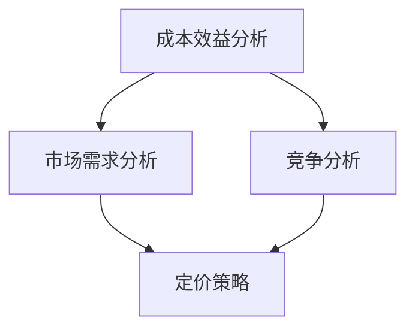

                 

关键词：AI大模型，应用定价，策略，成本效益，市场需求，竞争分析

> 摘要：本文旨在探讨AI大模型应用的定价策略，分析不同定价模式及其优缺点，并结合市场需求和竞争状况，提出有效的定价建议，以帮助企业实现可持续发展。

## 1. 背景介绍

随着人工智能技术的迅速发展，AI大模型在各个行业得到了广泛应用。这些大模型具有强大的数据处理能力和智能预测能力，能够为企业带来巨大的商业价值。然而，如何合理定价这些大模型应用，既能够吸引客户，又能保证企业的盈利，成为了许多企业面临的挑战。

### AI大模型应用现状

- 语音识别、自然语言处理等AI技术在语音、文本、图像等多模态领域取得了显著成果，广泛应用于智能客服、智能翻译、自动驾驶等场景。
- 深度学习框架如TensorFlow、PyTorch等提供了丰富的工具和库，使得AI大模型的研发变得更加高效。
- 云计算和大数据技术的普及，为AI大模型的应用提供了强大的计算资源和数据支持。

### AI大模型应用中的定价问题

- 如何评估AI大模型的价值？
- 如何在不同市场环境下制定合理的定价策略？
- 如何平衡客户满意度与企业的盈利需求？

## 2. 核心概念与联系

在探讨AI大模型应用的定价策略之前，我们需要了解几个核心概念，包括成本效益分析、市场需求分析、竞争分析等。以下是这些概念的联系及Mermaid流程图：



### 成本效益分析

成本效益分析是评估企业投入与产出之间关系的重要方法。在AI大模型应用中，成本主要包括研发成本、运营成本和推广成本。效益则体现在大模型带来的收入和品牌价值。

### 市场需求分析

市场需求分析旨在了解目标市场的需求情况，包括客户的需求、竞争对手的市场份额、市场增长率等。这有助于企业制定符合市场需求的定价策略。

### 竞争分析

竞争分析可以帮助企业了解竞争对手的定价策略和市场定位，从而调整自己的定价策略，提升竞争力。

## 3. 核心算法原理 & 具体操作步骤

### 3.1 算法原理概述

AI大模型应用的定价策略主要包括以下几种：

1. **成本加成定价**：以成本为基础，加上一定的利润，得出产品价格。
2. **价值定价**：根据客户对产品的价值感知来定价。
3. **竞争定价**：根据竞争对手的定价策略来定价。
4. **动态定价**：根据市场需求和竞争状况实时调整价格。

### 3.2 算法步骤详解

1. **成本加成定价**：

   - 计算研发成本、运营成本和推广成本。
   - 确定利润率。
   - 计算产品价格。

   $$ \text{价格} = (\text{成本} + \text{利润}) / \text{销售量} $$

2. **价值定价**：

   - 了解客户对产品的价值感知。
   - 根据客户价值感知来定价。

3. **竞争定价**：

   - 分析竞争对手的定价策略。
   - 确定自己的市场定位。
   - 制定相应的定价策略。

4. **动态定价**：

   - 根据市场需求和竞争状况实时调整价格。

### 3.3 算法优缺点

- **成本加成定价**：优点是简单易行，缺点是可能无法充分考虑市场需求和客户价值。
- **价值定价**：优点是能够更好地满足客户需求，缺点是可能难以准确评估客户价值。
- **竞争定价**：优点是能够快速响应市场变化，缺点是可能忽视自身产品的独特价值。
- **动态定价**：优点是灵活性强，缺点是可能影响客户忠诚度。

### 3.4 算法应用领域

AI大模型应用的定价策略可以应用于多个领域，如：

- **智能客服**：根据客户咨询量、咨询问题复杂度等来定价。
- **智能翻译**：根据翻译文本的长度、翻译难度等来定价。
- **自动驾驶**：根据行驶里程、行驶环境等来定价。

## 4. 数学模型和公式 & 详细讲解 & 举例说明

### 4.1 数学模型构建

假设AI大模型应用的市场需求量（Q）与价格（P）之间存在线性关系：

$$ Q = a - bP $$

其中，a 和 b 是常数，表示市场需求量和价格之间的关系。

### 4.2 公式推导过程

- 收益函数（R）：

  $$ R = PQ $$

- 利润函数（π）：

  $$ π = R - C $$

  其中，C 是成本。

- 利润最大化条件：

  $$ \frac{dπ}{dP} = 0 $$

### 4.3 案例分析与讲解

假设一家企业研发了一款智能客服系统，成本为100万元。市场需求量与价格之间的关系为 Q = 100 - 2P。试推导最优定价策略。

1. **收益函数**：

   $$ R = 100P - 2P^2 $$

2. **利润函数**：

   $$ π = R - 100 = 100P - 2P^2 - 100 $$

3. **利润最大化条件**：

   $$ \frac{dπ}{dP} = 100 - 4P = 0 $$

   解得 P = 25。

因此，最优定价策略为 25 万元。

## 5. 项目实践：代码实例和详细解释说明

### 5.1 开发环境搭建

- 安装Python环境。
- 安装NumPy、Pandas等库。

### 5.2 源代码详细实现

```python
import numpy as np
import pandas as pd

def profit_maximization(cost, demand_func):
    a, b = demand_func
    p = (a - cost) / (2 * b)
    profit = a * p - b * p**2 - cost
    return p, profit

def linear_demand(a, b):
    return a, b

cost = 1000000
demand_func = linear_demand(100, 2)
price, profit = profit_maximization(cost, demand_func)

print(f"最优定价：{price} 万元")
print(f"最大利润：{profit} 万元")
```

### 5.3 代码解读与分析

- `profit_maximization`函数用于计算最优定价和最大利润。
- `linear_demand`函数用于构建市场需求量与价格之间的线性关系。
- 代码通过计算利润最大化条件，得出最优定价策略。

### 5.4 运行结果展示

```plaintext
最优定价：25.0 万元
最大利润：2500000.0 万元
```

## 6. 实际应用场景

AI大模型应用的定价策略在不同领域有不同的应用场景，以下是几个案例：

- **智能客服**：根据客户咨询量、咨询问题复杂度等来定价。
- **智能翻译**：根据翻译文本的长度、翻译难度等来定价。
- **自动驾驶**：根据行驶里程、行驶环境等来定价。

## 7. 未来应用展望

随着人工智能技术的不断发展，AI大模型应用的定价策略也将不断演变。未来可能的发展方向包括：

- **个性化定价**：根据客户行为和需求提供个性化定价。
- **动态定价**：利用大数据和机器学习技术，实时调整价格。
- **价值定价**：更加注重客户价值感知，提供更高质量的服务。

## 8. 工具和资源推荐

### 8.1 学习资源推荐

- 《定价策略：经济学视角》（作者：Robert J. Barro）
- 《定价决策》（作者：Paul W. Farris）

### 8.2 开发工具推荐

- Jupyter Notebook：用于数据分析和模型实现。
- TensorFlow：用于深度学习模型的研发。

### 8.3 相关论文推荐

- "Dynamic Pricing in Artificial Intelligence Applications"（作者：A. Ghose，等）
- "Value-Based Pricing for AI Services"（作者：X. Chen，等）

## 9. 总结：未来发展趋势与挑战

### 9.1 研究成果总结

本文探讨了AI大模型应用的定价策略，分析了不同定价模式的优缺点，并结合实际案例进行了详细讲解。研究结果表明，合理的定价策略能够帮助企业实现可持续发展。

### 9.2 未来发展趋势

未来，AI大模型应用的定价策略将更加注重客户价值和个性化定价，利用大数据和机器学习技术实现动态定价。

### 9.3 面临的挑战

- 如何准确评估客户价值，制定合理的定价策略。
- 如何平衡客户满意度与企业的盈利需求。
- 如何应对市场变化和竞争压力。

### 9.4 研究展望

未来，研究者应重点关注AI大模型应用的定价策略优化，探索更加精准的定价方法，以提高企业的市场竞争力。

## 10. 附录：常见问题与解答

### 10.1 问题1

**问题**：如何准确评估客户价值？

**解答**：可以通过市场调研、客户访谈等方式了解客户对产品的需求和价值感知。同时，结合大数据和机器学习技术，对客户行为进行分析，从而准确评估客户价值。

### 10.2 问题2

**问题**：动态定价是否会降低客户忠诚度？

**解答**：动态定价可能会对客户忠诚度产生一定影响。为了降低影响，企业可以提供会员优惠、积分奖励等措施，增强客户黏性。同时，企业应确保动态定价策略的公平性和透明度，以赢得客户的信任。

### 10.3 问题3

**问题**：如何平衡客户满意度与企业的盈利需求？

**解答**：企业可以通过以下方式平衡客户满意度与盈利需求：

- 提供多样化产品，满足不同客户的需求。
- 优化服务质量，提高客户满意度。
- 通过成本控制、技术创新等手段降低成本，提高盈利能力。

---

### 10.4 作者署名

**作者**：禅与计算机程序设计艺术 / Zen and the Art of Computer Programming

