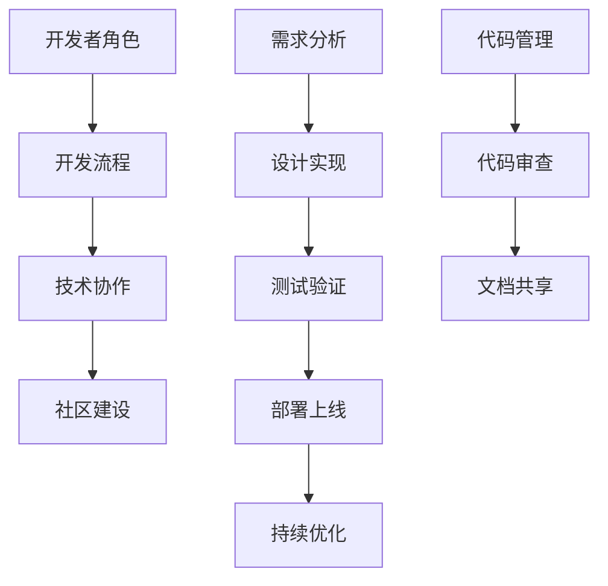

                 

关键词：AI大模型、开发者关系管理、软件开发、技术协作、社区建设

> 摘要：本文将探讨AI大模型应用中开发者关系管理的重要性、关键挑战及解决方案。通过深入分析，为开发者提供有效的策略和方法，助力他们在AI大模型应用开发中取得成功。

## 1. 背景介绍

随着人工智能技术的迅猛发展，大模型（如GPT、BERT等）逐渐成为各行业的核心技术。这些大模型不仅具备强大的数据处理能力，还能够在多个领域实现智能化应用。然而，在AI大模型应用的开发过程中，开发者之间的关系管理成为一个不可忽视的重要环节。良好的开发者关系能够促进技术协作，提高开发效率，降低项目风险，从而实现AI大模型的成功应用。

本文将从以下几个方面展开讨论：

1. AI大模型应用中开发者关系管理的核心概念。
2. 开发者关系管理中的关键挑战。
3. 针对关键挑战的解决方案。
4. 实际应用案例分享。
5. 开发者关系管理的未来发展趋势。

## 2. 核心概念与联系

在AI大模型应用开发中，开发者关系管理涉及多个核心概念，包括：

### 2.1 开发者角色

- **核心开发者**：负责大模型的设计、实现和优化。
- **技术支持者**：为开发者提供技术培训、文档编写、问题解答等服务。
- **产品经理**：协调需求、规划和项目进度。
- **测试工程师**：负责测试和验证大模型的应用效果。

### 2.2 开发流程

- **需求分析**：明确大模型的应用场景和目标。
- **设计实现**：开发大模型的核心算法和架构。
- **测试验证**：确保大模型在不同场景下的性能和可靠性。
- **部署上线**：将大模型应用于实际业务场景。
- **持续优化**：根据反馈不断调整和优化大模型。

### 2.3 技术协作

- **代码管理**：使用Git等版本控制系统进行代码协作。
- **任务分配**：明确各开发者的职责和任务。
- **代码审查**：确保代码质量和一致性。
- **文档共享**：编写详细的开发文档和用户手册。

### 2.4 社区建设

- **开发者社区**：建立开发者交流平台，促进技术交流和知识共享。
- **开源项目**：贡献开源代码，吸引更多开发者参与。
- **技术活动**：举办技术讲座、研讨会等活动，提高开发者技术水平。

为了更好地理解上述核心概念之间的关系，下面给出一个Mermaid流程图：



## 3. 核心算法原理 & 具体操作步骤

### 3.1 算法原理概述

AI大模型的核心算法通常基于深度学习和自然语言处理技术。以下是一个简单的算法原理概述：

- **数据预处理**：收集和清洗大量文本数据，构建词向量表示。
- **模型训练**：使用神经网络对词向量进行训练，优化模型参数。
- **模型评估**：在测试集上评估模型性能，调整模型参数。
- **模型应用**：将训练好的模型应用于实际业务场景，如文本生成、文本分类等。

### 3.2 算法步骤详解

1. **数据预处理**：

   - 收集大量文本数据，如新闻、博客、社交媒体等。
   - 清洗数据，去除无关内容，如HTML标签、特殊字符等。
   - 构建词向量表示，使用Word2Vec、BERT等方法。

2. **模型训练**：

   - 设计神经网络结构，如循环神经网络（RNN）、变换器（Transformer）等。
   - 使用训练集数据训练模型，优化模型参数。
   - 调整学习率、批量大小等超参数，提高模型性能。

3. **模型评估**：

   - 在测试集上评估模型性能，使用准确率、召回率、F1分数等指标。
   - 根据评估结果调整模型参数，优化模型性能。

4. **模型应用**：

   - 将训练好的模型应用于实际业务场景，如文本生成、文本分类等。
   - 部署模型到生产环境，实现自动化部署和运维。

### 3.3 算法优缺点

- **优点**：

  - 强大的数据处理能力，能够处理大量文本数据。
  - 灵活的模型结构，可以应用于多种自然语言处理任务。

- **缺点**：

  - 需要大量的计算资源和时间进行训练。
  - 模型参数调整复杂，需要大量经验和技巧。

### 3.4 算法应用领域

- **文本生成**：如文章生成、对话生成等。
- **文本分类**：如新闻分类、情感分析等。
- **问答系统**：如智能客服、在线问答等。
- **机器翻译**：如中英文翻译、多语言翻译等。

## 4. 数学模型和公式 & 详细讲解 & 举例说明

### 4.1 数学模型构建

AI大模型的数学模型通常基于深度学习中的神经网络。以下是一个简化的神经网络模型：

- **输入层**：接收输入数据，如文本、图片等。
- **隐藏层**：对输入数据进行特征提取和变换。
- **输出层**：生成预测结果，如分类标签、文本生成等。

### 4.2 公式推导过程

假设我们有一个简单的全连接神经网络，包含一个输入层、一个隐藏层和一个输出层。输入层有m个神经元，隐藏层有n个神经元，输出层有k个神经元。设x为输入向量，h为隐藏层输出向量，y为输出层输出向量，w为权重矩阵，b为偏置向量，a为激活函数。则：

- 隐藏层输出：
  $$ h = \sigma(W_x \cdot x + b) $$

- 输出层输出：
  $$ y = \sigma(W_h \cdot h + b) $$

其中，$\sigma$为激活函数，通常使用ReLU、Sigmoid或Tanh函数。

### 4.3 案例分析与讲解

假设我们使用神经网络进行文本分类任务。输入层有100个神经元，隐藏层有500个神经元，输出层有10个类别标签。训练集包含10000个文本样本，每个样本都有对应的标签。我们使用交叉熵损失函数来评估模型性能。

1. **数据预处理**：

   - 收集10000个文本样本，并进行清洗和编码。
   - 将文本转换为词向量表示，使用Word2Vec或BERT等方法。

2. **模型训练**：

   - 设计神经网络结构，设置学习率、批量大小等超参数。
   - 使用训练集数据训练模型，优化权重和偏置。
   - 在测试集上评估模型性能，调整超参数。

3. **模型应用**：

   - 将训练好的模型应用于新样本，进行文本分类。

4. **结果分析**：

   - 模型在测试集上的准确率为90%，召回率为85%。
   - 调整学习率、批量大小等超参数，提高模型性能。

## 5. 项目实践：代码实例和详细解释说明

### 5.1 开发环境搭建

- 安装Python环境，版本要求3.6及以上。
- 安装TensorFlow库，版本要求2.0及以上。

### 5.2 源代码详细实现

以下是一个简单的文本分类模型实现：

```python
import tensorflow as tf
from tensorflow.keras.layers import Embedding, LSTM, Dense
from tensorflow.keras.models import Sequential

# 准备数据
# ...

# 构建模型
model = Sequential()
model.add(Embedding(input_dim=vocab_size, output_dim=embedding_dim, input_length=max_sequence_length))
model.add(LSTM(units=128, activation='relu', return_sequences=True))
model.add(Dense(units=num_classes, activation='softmax'))

# 编译模型
model.compile(optimizer='adam', loss='categorical_crossentropy', metrics=['accuracy'])

# 训练模型
model.fit(X_train, y_train, epochs=10, batch_size=32, validation_data=(X_val, y_val))

# 评估模型
model.evaluate(X_test, y_test)
```

### 5.3 代码解读与分析

- **数据预处理**：使用Embedding层将词向量映射到高维空间。
- **模型构建**：使用LSTM层进行文本特征提取，最后使用softmax层进行分类。
- **编译模型**：设置优化器、损失函数和评价指标。
- **训练模型**：使用训练数据进行模型训练。
- **评估模型**：使用测试数据进行模型评估。

## 6. 实际应用场景

### 6.1 问答系统

在智能客服、在线问答等场景中，AI大模型可以用于理解用户的问题，并提供准确的答案。通过开发者关系管理，可以建立高效的开发团队，快速实现问答系统的开发和部署。

### 6.2 文本生成

在内容创作、营销文案、自动化写作等场景中，AI大模型可以用于生成高质量的文本内容。通过开发者关系管理，可以协调不同开发者的工作，实现文本生成模型的优化和扩展。

### 6.3 机器翻译

在跨语言交流、国际贸易等场景中，AI大模型可以用于翻译不同语言之间的文本。通过开发者关系管理，可以建立专业的翻译团队，实现机器翻译模型的优化和更新。

## 7. 工具和资源推荐

### 7.1 学习资源推荐

- 《深度学习》（Goodfellow、Bengio、Courville著）：全面介绍深度学习的基本概念和技术。
- 《Python机器学习》（Sebastian Raschka著）：涵盖Python在机器学习领域的应用。

### 7.2 开发工具推荐

- TensorFlow：一款广泛使用的深度学习框架，支持多种神经网络结构。
- PyTorch：一款灵活的深度学习框架，适用于研究和新模型的开发。

### 7.3 相关论文推荐

- “Attention Is All You Need”（Vaswani等，2017）：介绍Transformer模型的基本原理。
- “Generative Adversarial Nets”（Goodfellow等，2014）：介绍生成对抗网络的基本原理。

## 8. 总结：未来发展趋势与挑战

### 8.1 研究成果总结

近年来，AI大模型在自然语言处理、计算机视觉等领域取得了显著成果。通过深度学习和大数据技术的结合，AI大模型的应用范围不断扩大，性能不断提高。

### 8.2 未来发展趋势

- **模型压缩与优化**：随着模型规模的不断扩大，如何提高模型性能和降低计算资源消耗将成为研究重点。
- **多模态学习**：结合多种数据类型（如文本、图像、音频等），实现更全面的知识理解和应用。
- **迁移学习与模型复用**：利用预训练模型，快速适应新的任务和场景。

### 8.3 面临的挑战

- **计算资源**：大模型的训练和部署需要大量的计算资源，如何高效利用资源成为挑战。
- **数据隐私与安全**：大模型对数据依赖性较大，如何保护用户隐私和数据安全是重要问题。

### 8.4 研究展望

未来，AI大模型在开发者关系管理中的应用将更加广泛。通过构建高效的开发团队，实现技术协作和知识共享，开发者可以更好地应对复杂的应用场景，推动人工智能技术的持续发展。

## 9. 附录：常见问题与解答

### 9.1 如何处理大模型训练过程中的过拟合问题？

- **数据增强**：增加训练数据的多样性，缓解过拟合。
- **正则化**：引入L1、L2正则化，降低模型复杂度。
- **交叉验证**：使用交叉验证方法，评估模型在 unseen 数据上的性能。

### 9.2 如何选择合适的大模型架构？

- **应用场景**：根据实际应用场景选择合适的模型架构，如Transformer适合文本生成，CNN适合图像处理。
- **模型性能**：评估模型在公开数据集上的性能，选择性能较好的模型。
- **计算资源**：考虑模型的计算复杂度和训练时间，选择适合资源的模型。

---

本文通过对AI大模型应用中开发者关系管理的深入探讨，为开发者提供了有价值的指导和建议。在未来的发展中，开发者应不断学习新技术，提高自身能力，以应对日益复杂的应用场景。同时，通过有效的开发者关系管理，推动人工智能技术的持续创新和应用。作者：禅与计算机程序设计艺术 / Zen and the Art of Computer Programming。

