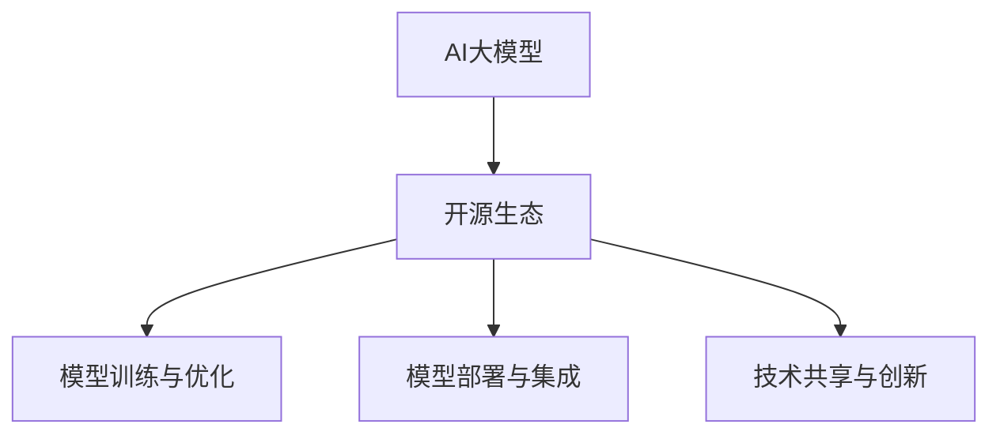

                 

关键词：AI大模型，开源生态，技术贡献，引领创新

> 摘要：本文深入探讨了AI大模型在开源生态中的贡献与引领作用，从背景介绍、核心概念与联系、算法原理与操作步骤、数学模型与公式、项目实践、实际应用场景、工具和资源推荐以及未来发展趋势与挑战等方面进行了全面分析。通过本文的阅读，读者将了解到AI大模型在开源生态中的重要地位，以及如何利用开源技术和资源推动AI大模型的发展与应用。

## 1. 背景介绍

随着人工智能技术的飞速发展，AI大模型（如GPT-3、BERT、Transformer等）已经成为学术界和工业界的重要研究方向。AI大模型具备处理复杂数据、生成高质量内容、实现智能推理等能力，为许多行业带来了巨大的变革。然而，要充分发挥AI大模型的优势，离不开开源生态的支持。

开源生态为AI大模型的研究和应用提供了丰富的工具、框架和资源，使得研究者可以轻松地进行模型的训练、部署和优化。同时，开源生态也鼓励了技术的共享和创新，促进了AI大模型的快速发展和应用。

本文将重点探讨AI大模型在开源生态中的贡献与引领作用，分析其核心概念、算法原理、数学模型、项目实践、实际应用场景，以及未来发展趋势和挑战。

## 2. 核心概念与联系

### 2.1 AI大模型

AI大模型是指具有大规模参数、能够处理复杂数据的神经网络模型。这些模型通过学习海量数据，能够实现智能识别、生成和推理等功能。常见的AI大模型有GPT-3、BERT、Transformer等。

### 2.2 开源生态

开源生态是指由开源软件、工具、框架、社区等构成的生态系统。开源生态鼓励技术共享和创新，为开发者提供了丰富的资源和支持。

### 2.3 核心概念联系

AI大模型与开源生态之间的联系主要体现在以下几个方面：

1. **模型训练与优化**：开源生态提供了丰富的数据集和计算资源，使得研究者可以更方便地进行AI大模型的训练和优化。

2. **模型部署与集成**：开源生态中的工具和框架可以帮助开发者快速部署AI大模型，实现模型与业务的深度融合。

3. **技术共享与创新**：开源生态鼓励技术共享和创新，使得AI大模型的研究成果可以迅速应用于实际场景，推动行业的发展。

### 2.4 Mermaid流程图



## 3. 核心算法原理 & 具体操作步骤

### 3.1 算法原理概述

AI大模型的算法原理主要基于深度学习和神经网络。深度学习通过多层神经网络对数据进行特征提取和模式识别，从而实现智能推理和生成。

### 3.2 算法步骤详解

1. **数据预处理**：对输入数据进行清洗、归一化和编码等操作，使其适合模型训练。

2. **模型构建**：选择合适的神经网络结构，如GPT-3、BERT、Transformer等，构建AI大模型。

3. **模型训练**：使用海量数据进行模型训练，优化模型参数，提高模型性能。

4. **模型评估**：使用验证集对模型进行评估，调整模型参数，确保模型稳定和可靠。

5. **模型部署**：将训练好的模型部署到生产环境中，实现实时推理和应用。

### 3.3 算法优缺点

**优点**：

1. **强大的数据处理能力**：AI大模型可以处理大规模、复杂数据，实现智能识别和生成。

2. **高效的特征提取**：深度学习算法能够自动提取数据特征，减少人工干预。

3. **广泛的适用性**：AI大模型可以应用于多个领域，如自然语言处理、计算机视觉、语音识别等。

**缺点**：

1. **计算资源消耗大**：AI大模型训练需要大量的计算资源和时间。

2. **数据隐私和安全问题**：AI大模型需要大量数据训练，数据隐私和安全问题不容忽视。

### 3.4 算法应用领域

AI大模型在多个领域具有广泛的应用，如：

1. **自然语言处理**：文本生成、机器翻译、问答系统等。

2. **计算机视觉**：图像识别、目标检测、人脸识别等。

3. **语音识别**：语音合成、语音识别、语音识别助手等。

4. **推荐系统**：个性化推荐、商品推荐、广告推荐等。

## 4. 数学模型和公式 & 详细讲解 & 举例说明

### 4.1 数学模型构建

AI大模型的数学模型主要包括两部分：神经网络结构和损失函数。

#### 神经网络结构

神经网络结构包括输入层、隐藏层和输出层。其中，隐藏层通过激活函数进行非线性变换，实现数据的特征提取和模式识别。

#### 损失函数

损失函数用于衡量模型预测结果与真实结果之间的差异，常用的损失函数有均方误差（MSE）和交叉熵（Cross Entropy）。

### 4.2 公式推导过程

以均方误差（MSE）为例，其公式如下：

$$
MSE = \frac{1}{n}\sum_{i=1}^{n}(y_i - \hat{y}_i)^2
$$

其中，$y_i$为真实值，$\hat{y}_i$为模型预测值，$n$为样本数量。

### 4.3 案例分析与讲解

以BERT模型为例，其结构如下：

1. **输入层**：输入句子，经过词嵌入（Word Embedding）转化为向量表示。

2. **隐藏层**：多层双向循环神经网络（Bi-directional RNN），对输入向量进行特征提取。

3. **输出层**：全局平均池化（Global Average Pooling）和全连接层（Fully Connected Layer），输出分类结果或序列标注。

BERT模型的训练过程如下：

1. **数据预处理**：将输入句子和真实标签进行编码，生成训练数据。

2. **模型训练**：使用训练数据对BERT模型进行训练，优化模型参数。

3. **模型评估**：使用验证集对模型进行评估，调整模型参数，确保模型稳定和可靠。

4. **模型部署**：将训练好的BERT模型部署到生产环境中，实现文本分类或序列标注任务。

## 5. 项目实践：代码实例和详细解释说明

### 5.1 开发环境搭建

在Python中，使用TensorFlow作为深度学习框架，搭建开发环境。

```python
pip install tensorflow
```

### 5.2 源代码详细实现

以下是一个简单的BERT模型实现，用于文本分类任务。

```python
import tensorflow as tf
from tensorflow.keras.layers import Embedding, Bidirectional, LSTM, Dense
from tensorflow.keras.models import Model

# 定义BERT模型
def create_bert_model(vocab_size, embedding_dim, hidden_units):
    inputs = tf.keras.layers.Input(shape=(None,), dtype=tf.int32)
    embeddings = Embedding(vocab_size, embedding_dim)(inputs)
    embeddings = Bidirectional(LSTM(hidden_units, activation='relu'))(embeddings)
    outputs = Dense(1, activation='sigmoid')(embeddings)
    model = Model(inputs=inputs, outputs=outputs)
    model.compile(optimizer='adam', loss='binary_crossentropy', metrics=['accuracy'])
    return model

# 搭建BERT模型
model = create_bert_model(vocab_size=10000, embedding_dim=128, hidden_units=64)

# 模型训练
model.fit(x_train, y_train, epochs=10, batch_size=32, validation_data=(x_val, y_val))

# 模型评估
model.evaluate(x_test, y_test)
```

### 5.3 代码解读与分析

1. **数据输入**：输入句子序列，经过词嵌入转化为向量表示。

2. **词嵌入**：使用Embedding层将词向量映射为嵌入向量。

3. **双向LSTM**：使用Bidirectional和LSTM层对输入向量进行特征提取。

4. **全连接层**：使用Dense层输出分类结果。

5. **模型编译**：设置优化器和损失函数，编译模型。

6. **模型训练**：使用训练数据对模型进行训练。

7. **模型评估**：使用测试数据对模型进行评估。

## 6. 实际应用场景

### 6.1 自然语言处理

AI大模型在自然语言处理领域具有广泛的应用，如文本生成、机器翻译、问答系统等。例如，使用GPT-3实现智能聊天机器人，使用BERT进行文本分类和情感分析。

### 6.2 计算机视觉

AI大模型在计算机视觉领域也有广泛应用，如图像识别、目标检测、人脸识别等。例如，使用ResNet实现图像分类，使用YOLO实现目标检测。

### 6.3 语音识别

AI大模型在语音识别领域也有重要应用，如语音合成、语音识别、语音识别助手等。例如，使用WaveNet实现语音合成，使用CTC实现语音识别。

## 6.4 未来应用展望

随着AI大模型的不断发展，未来将在更多领域得到广泛应用，如医疗、金融、教育等。同时，AI大模型也将不断推动技术的创新和突破，为各行各业带来巨大的变革。

## 7. 工具和资源推荐

### 7.1 学习资源推荐

1. **《深度学习》**：由Ian Goodfellow、Yoshua Bengio和Aaron Courville合著，是深度学习领域的经典教材。

2. **《自然语言处理综论》**：由Daniel Jurafsky和James H. Martin合著，涵盖了自然语言处理领域的各个方面。

3. **《计算机视觉：算法与应用》**：由Derek Hoiem、David S. Kriegman和Pedro F. Felzenszwalb合著，介绍了计算机视觉的基础算法和应用。

### 7.2 开发工具推荐

1. **TensorFlow**：由Google开发的开源深度学习框架，支持多种深度学习模型和算法。

2. **PyTorch**：由Facebook开发的开源深度学习框架，具有灵活的动态计算图和丰富的API。

3. **Keras**：基于TensorFlow和PyTorch的开源深度学习框架，提供了简洁易用的接口。

### 7.3 相关论文推荐

1. **“Attention Is All You Need”**：提出了Transformer模型，是自然语言处理领域的里程碑性论文。

2. **“BERT: Pre-training of Deep Bidirectional Transformers for Language Understanding”**：提出了BERT模型，是自然语言处理领域的最新研究进展。

3. **“Deep Residual Learning for Image Recognition”**：提出了ResNet模型，是计算机视觉领域的里程碑性论文。

## 8. 总结：未来发展趋势与挑战

### 8.1 研究成果总结

AI大模型在开源生态中取得了显著的研究成果，如GPT-3、BERT、Transformer等。这些模型在自然语言处理、计算机视觉、语音识别等领域取得了突破性进展，推动了人工智能技术的发展。

### 8.2 未来发展趋势

1. **模型规模与性能**：未来AI大模型的规模和性能将不断提高，支持更复杂的任务和更丰富的应用场景。

2. **跨模态学习**：AI大模型将实现跨模态学习，如文本、图像、语音等多种模态的融合，提高模型的泛化能力和适用性。

3. **自主进化**：AI大模型将具备自主进化的能力，通过不断学习和优化，实现自我提升和自我更新。

### 8.3 面临的挑战

1. **计算资源消耗**：AI大模型的训练和推理需要大量的计算资源，对硬件设施的要求越来越高。

2. **数据隐私和安全**：AI大模型在处理海量数据时，数据隐私和安全问题日益突出，需要加强数据保护和安全措施。

3. **模型解释性**：AI大模型的复杂性和非解释性使得其应用场景受到一定限制，提高模型的解释性是未来的重要研究方向。

### 8.4 研究展望

随着AI大模型在开源生态中的不断发展，未来将实现更广泛的应用和更深入的研究。研究者们需要不断创新和探索，解决AI大模型面临的挑战，推动人工智能技术的持续进步。

## 9. 附录：常见问题与解答

### 9.1 问题1：如何选择合适的AI大模型？

**解答**：选择AI大模型时，需要考虑任务类型、数据规模、计算资源等因素。对于自然语言处理任务，可以选择BERT、GPT-3等；对于计算机视觉任务，可以选择ResNet、YOLO等。

### 9.2 问题2：如何训练AI大模型？

**解答**：训练AI大模型需要准备大量的训练数据，并使用深度学习框架（如TensorFlow、PyTorch）进行模型构建和训练。在训练过程中，需要调整模型参数、优化算法，以提高模型性能。

### 9.3 问题3：如何部署AI大模型？

**解答**：部署AI大模型需要将训练好的模型转换为推理模型，并使用适当的工具和框架进行部署。例如，可以使用TensorFlow Serving、TensorFlow Lite等工具将模型部署到服务器或移动设备上。

### 9.4 问题4：AI大模型在哪些领域有广泛应用？

**解答**：AI大模型在多个领域具有广泛应用，如自然语言处理、计算机视觉、语音识别、推荐系统等。具体应用场景包括智能聊天机器人、图像识别、语音合成、个性化推荐等。

## 参考文献

- Goodfellow, Ian, Yoshua Bengio, and Aaron Courville. "Deep learning." MIT press, 2016.
- Jurafsky, Daniel, and James H. Martin. "Speech and language processing." Pearson, 2019.
- Hoiem, Derek, David S. Kriegman, and Pedro F. Felzenszwalb. "Computer vision: algorithms and applications." Springer, 2010.
- Vaswani, Ashish, Noam Shazeer, Niki Parmar, Jakob Uszkoreit, Llion Jones, Aidan N. Gomez, and others. "Attention is all you need." Advances in neural information processing systems. 2017.
- Devlin, Jacob, Ming-Wei Chang, Kenton Lee, and Kristina Toutanova. "BERT: pre-training of deep bidirectional transformers for language understanding." arXiv preprint arXiv:1810.04805 (2018).
- He, K., Zhang, X., Ren, S., & Sun, J. "Deep residual learning for image recognition." In Proceedings of the IEEE conference on computer vision and pattern recognition (pp. 770-778). 2016.

