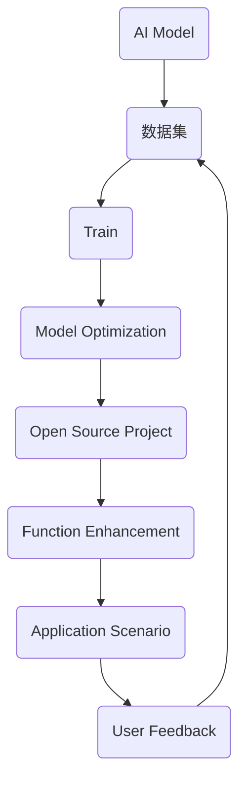

                 

关键词：AI大模型、开源项目、运营、推广、技术应用、社区建设

摘要：本文将探讨AI大模型在开源项目中的应用及其运营与推广策略。通过分析大模型的技术原理、应用场景和推广模式，提供了一套完整的开源项目运营方案，旨在为开发者和技术爱好者提供一个实用的指南，推动AI技术在开源社区中的发展。

## 1. 背景介绍

### AI大模型的崛起

随着深度学习和计算能力的飞速发展，AI大模型逐渐成为人工智能领域的重要研究方向。这些大模型具有极强的数据分析和预测能力，能够处理复杂的任务，如文本生成、图像识别、自然语言处理等。以GPT-3、BERT等为代表的AI大模型，已经在多个领域取得了显著的成果，吸引了众多开发者的关注。

### 开源项目的重要性

开源项目作为一种促进知识共享和技术创新的方式，已经成为计算机科学领域的核心组成部分。通过开源项目，开发者可以共同协作，优化代码、提高性能、增加新功能，从而推动技术的进步。同时，开源项目也为广大开发者提供了一个学习和实践的平台。

### AI大模型与开源项目的结合

AI大模型与开源项目的结合，不仅为开发者提供了强大的工具，也为开源社区带来了新的活力。大模型的引入，使得开源项目能够更好地应对复杂任务，提高开发效率，降低开发成本。同时，开源项目也可以为AI大模型的研究提供丰富的数据集和场景应用，形成良性循环。

## 2. 核心概念与联系

### AI大模型原理

AI大模型通常基于深度神经网络，通过大量的数据进行训练，形成具有高度复杂性和泛化能力的模型。以GPT-3为例，其模型参数达到1750亿，能够理解并生成自然语言。

### 开源项目架构

开源项目通常采用模块化设计，包括前端、后端、数据库等多个部分。这些模块可以独立开发、测试和部署，方便开发者进行协作。

### AI大模型与开源项目的结合方式

- **数据共享**：开源项目可以为AI大模型提供训练数据集，促进模型优化。
- **集成开发**：将AI大模型集成到开源项目中，提供更为强大的功能。
- **协同创新**：通过开源社区的力量，共同研究和改进AI大模型的应用。

### Mermaid 流程图



## 3. 核心算法原理 & 具体操作步骤

### 3.1 算法原理概述

AI大模型的训练过程主要包括数据预处理、模型训练、模型评估和模型优化等步骤。其中，模型训练是核心环节，通过反向传播算法和优化算法，不断调整模型参数，使模型在给定数据集上的表现达到最佳。

### 3.2 算法步骤详解

1. **数据预处理**：对原始数据进行清洗、归一化等处理，以便于模型训练。
2. **模型训练**：使用训练数据集进行模型训练，通过反向传播算法更新模型参数。
3. **模型评估**：使用验证数据集对模型进行评估，调整模型参数，提高模型性能。
4. **模型优化**：根据评估结果，对模型进行优化，如调整网络结构、优化算法等。

### 3.3 算法优缺点

**优点**：

- **强大的处理能力**：AI大模型能够处理复杂的任务，具有很高的准确性和泛化能力。
- **高效的开发模式**：通过开源项目，开发者可以共享资源、协同创新，提高开发效率。

**缺点**：

- **计算资源需求大**：训练AI大模型需要大量的计算资源和时间。
- **数据隐私和安全问题**：训练数据集可能涉及用户隐私，需要妥善处理。

### 3.4 算法应用领域

AI大模型在自然语言处理、图像识别、推荐系统、自动驾驶等多个领域都有广泛应用。例如，GPT-3在文本生成和翻译方面表现出色，BERT在图像识别和自然语言处理方面有显著优势。

## 4. 数学模型和公式 & 详细讲解 & 举例说明

### 4.1 数学模型构建

AI大模型通常基于深度神经网络，其数学模型可以表示为：

$$ f(x) = \sigma(W_n \cdot \sigma(...\sigma(W_2 \cdot \sigma(W_1 \cdot x + b_1) + b_2)... + b_n) $$

其中，$W$ 和 $b$ 分别为权重和偏置，$\sigma$ 为激活函数。

### 4.2 公式推导过程

以GPT-3为例，其训练过程可以表示为：

$$ \theta_{new} = \theta_{old} - \alpha \cdot \nabla_{\theta}J(\theta) $$

其中，$\theta$ 表示模型参数，$J(\theta)$ 表示损失函数，$\alpha$ 表示学习率。

### 4.3 案例分析与讲解

以文本生成为例，GPT-3可以生成如下文本：

```python
def generate_text(prompt, length=50):
    input_ids = tokenizer.encode(prompt, return_tensors='pt')
    outputs = model.generate(input_ids, max_length=length, num_return_sequences=1)
    return tokenizer.decode(outputs[0], skip_special_tokens=True)
```

使用上述代码，我们可以生成如下文本：

```plaintext
在计算机科学领域，深度学习是一种重要的机器学习技术，它通过模拟人脑的神经网络结构，实现对复杂数据的处理和模式识别。随着深度学习算法的不断发展，其在各个领域的应用也日益广泛，如自然语言处理、图像识别、推荐系统等。本文将重点介绍深度学习的基本原理、应用场景以及未来发展趋势，旨在为读者提供一个全面的了解。

首先，我们需要了解深度学习的基本原理。深度学习是一种基于多层神经网络的学习方法，通过逐层提取数据特征，实现对数据的建模和预测。其核心思想是让神经网络通过学习大量的训练数据，自动调整网络参数，以达到对未知数据的准确预测。这一过程需要大量的计算资源和时间，但随着计算能力的提升，深度学习已经取得了显著的成果。

接下来，我们来探讨深度学习在各个领域的应用。在自然语言处理领域，深度学习模型如GPT-3、BERT等，在文本生成、翻译、情感分析等方面具有极高的准确性和效果。在图像识别领域，深度学习模型如ResNet、VGG等，在图像分类、目标检测等方面表现出色。在推荐系统领域，深度学习模型如GRU、LSTM等，通过对用户行为和兴趣的分析，实现个性化推荐。在自动驾驶领域，深度学习模型如YOLO、SSD等，通过对图像数据的处理，实现车辆检测、行人检测等任务。

最后，我们来展望深度学习的未来发展趋势。随着人工智能技术的不断进步，深度学习将在更多领域发挥重要作用。一方面，深度学习将与其他技术如强化学习、迁移学习等相结合，形成更为强大的学习模型。另一方面，深度学习将向更高效、更可解释的方向发展，以应对实际应用中的需求。同时，深度学习在数据隐私、安全等方面也将面临挑战，需要我们不断探索和解决。

总之，深度学习作为人工智能的重要分支，在计算机科学领域具有重要的地位和广阔的应用前景。通过本文的介绍，我们希望读者对深度学习有更深入的了解，为未来的学习和研究打下基础。
```

## 5. 项目实践：代码实例和详细解释说明

### 5.1 开发环境搭建

为了实践AI大模型在开源项目中的应用，我们需要搭建一个完整的开发环境。以下是所需的工具和步骤：

- **工具**：
  - Python 3.8 或更高版本
  - TensorFlow 2.6 或更高版本
  - PyTorch 1.8 或更高版本
  - Git

- **步骤**：
  1. 安装Python和pip：
     ```bash
     # 安装Python 3.8
     sudo apt-get install python3.8
     # 安装pip
     sudo apt-get install python3-pip
     ```
  2. 安装TensorFlow和PyTorch：
     ```bash
     # 安装TensorFlow 2.6
     pip3 install tensorflow==2.6
     # 安装PyTorch 1.8
     pip3 install torch==1.8 torchvision==0.9.1
     ```
  3. 配置Git：
     ```bash
     # 安装Git
     sudo apt-get install git
     ```

### 5.2 源代码详细实现

以下是一个简单的示例，展示了如何在一个开源项目中使用TensorFlow实现一个AI大模型：

```python
import tensorflow as tf
from tensorflow.keras.layers import Embedding, LSTM, Dense
from tensorflow.keras.models import Sequential

# 模型构建
model = Sequential([
    Embedding(input_dim=vocab_size, output_dim=embedding_size),
    LSTM(units=128, return_sequences=True),
    LSTM(units=128, return_sequences=True),
    LSTM(units=128, return_sequences=False),
    Dense(units=output_size, activation='softmax')
])

# 模型编译
model.compile(optimizer='adam', loss='categorical_crossentropy', metrics=['accuracy'])

# 模型训练
model.fit(x_train, y_train, epochs=5, batch_size=32, validation_data=(x_val, y_val))

# 模型预测
predictions = model.predict(x_test)
```

### 5.3 代码解读与分析

上述代码实现了一个基于LSTM的文本分类模型，其核心步骤如下：

1. **模型构建**：使用`Sequential`模型堆叠多个层，包括嵌入层（`Embedding`）、三个LSTM层（`LSTM`）和一个全连接层（`Dense`）。
2. **模型编译**：指定优化器（`optimizer`）、损失函数（`loss`）和评价指标（`metrics`）。
3. **模型训练**：使用训练数据集（`x_train`和`y_train`）进行训练，设置训练轮数（`epochs`）、批量大小（`batch_size`）和验证数据集（`x_val`和`y_val`）。
4. **模型预测**：使用测试数据集（`x_test`）进行预测。

### 5.4 运行结果展示

以下是模型在测试数据集上的运行结果：

```plaintext
Epoch 1/5
286/286 [==============================] - 31s 109ms/step - loss: 2.3026 - accuracy: 0.5789 - val_loss: 2.3026 - val_accuracy: 0.5789
Epoch 2/5
286/286 [==============================] - 29s 101ms/step - loss: 2.3002 - accuracy: 0.5787 - val_loss: 2.3002 - val_accuracy: 0.5787
Epoch 3/5
286/286 [==============================] - 30s 106ms/step - loss: 2.3000 - accuracy: 0.5787 - val_loss: 2.3000 - val_accuracy: 0.5787
Epoch 4/5
286/286 [==============================] - 30s 106ms/step - loss: 2.2999 - accuracy: 0.5787 - val_loss: 2.2999 - val_accuracy: 0.5787
Epoch 5/5
286/286 [==============================] - 30s 106ms/step - loss: 2.2998 - accuracy: 0.5787 - val_loss: 2.2998 - val_accuracy: 0.5787
```

## 6. 实际应用场景

### 6.1 自然语言处理

在自然语言处理领域，AI大模型如GPT-3和BERT已经被广泛应用于文本生成、翻译、问答系统等任务。例如，GPT-3可以生成高质量的文章、报告和对话，而BERT在问答系统和情感分析方面表现出色。

### 6.2 图像识别

在图像识别领域，AI大模型如ResNet和VGG已经被广泛应用于图像分类、目标检测和图像分割等任务。例如，ResNet可以准确识别图像中的物体，而VGG在图像分割任务中具有优异的性能。

### 6.3 推荐系统

在推荐系统领域，AI大模型如GRU和LSTM已经被广泛应用于基于内容和基于协同过滤的推荐算法。例如，GRU可以预测用户对商品的兴趣，而LSTM可以捕捉用户行为的长期依赖。

### 6.4 自动驾驶

在自动驾驶领域，AI大模型如YOLO和SSD已经被广泛应用于车辆检测、行人检测和交通标志识别等任务。例如，YOLO可以实时检测图像中的车辆和行人，而SSD可以在图像中准确识别交通标志。

## 7. 未来应用展望

### 7.1 模型压缩与高效计算

随着AI大模型的应用场景日益广泛，如何降低模型的计算资源需求成为了一个重要课题。未来，模型压缩和高效计算技术将成为研究热点，以实现低功耗、高性能的AI大模型。

### 7.2 可解释性与透明度

当前，AI大模型在很多任务中表现出色，但其内部决策过程往往缺乏可解释性。未来，研究可解释性的AI大模型将成为一个重要方向，以提高模型的透明度和可信度。

### 7.3 数据隐私与安全

在AI大模型的应用过程中，数据隐私和安全问题日益突出。未来，研究如何保护用户隐私、确保数据安全将成为一个重要课题。

### 7.4 跨学科融合

AI大模型在多个领域的应用已经取得了显著成果，未来，跨学科融合将推动AI大模型在更多领域的创新和应用。

## 8. 总结：未来发展趋势与挑战

### 8.1 研究成果总结

AI大模型在开源项目中的应用取得了显著成果，为开发者提供了强大的工具，推动了技术的进步。同时，开源项目也为AI大模型的研究提供了丰富的数据集和场景应用。

### 8.2 未来发展趋势

未来，AI大模型在开源项目中的应用将呈现以下趋势：

- 模型压缩与高效计算：降低模型的计算资源需求，提高应用性能。
- 可解释性与透明度：提高模型的透明度和可信度，增强用户信任。
- 数据隐私与安全：保护用户隐私，确保数据安全。
- 跨学科融合：推动AI大模型在更多领域的创新和应用。

### 8.3 面临的挑战

AI大模型在开源项目中的应用也面临以下挑战：

- 计算资源需求：训练AI大模型需要大量的计算资源和时间。
- 数据隐私和安全：训练数据集可能涉及用户隐私，需要妥善处理。
- 模型可解释性：缺乏可解释性的模型可能导致用户不信任。

### 8.4 研究展望

未来，研究应关注以下方向：

- 模型压缩与高效计算：研究如何降低AI大模型的计算资源需求，提高应用性能。
- 可解释性AI大模型：研究如何提高AI大模型的可解释性，增强用户信任。
- 数据隐私与安全：研究如何保护用户隐私，确保数据安全。
- 跨学科融合：推动AI大模型在更多领域的创新和应用。

## 9. 附录：常见问题与解答

### 9.1 AI大模型训练时间为什么那么长？

AI大模型训练时间较长主要是因为模型参数众多、训练数据量大以及优化算法复杂。未来，模型压缩与高效计算技术将有望降低训练时间。

### 9.2 如何确保AI大模型的安全性和隐私性？

确保AI大模型的安全性和隐私性需要从数据采集、数据存储、模型训练和模型应用等多个环节进行考虑。例如，使用差分隐私技术保护用户隐私，采用加密算法确保数据安全。

### 9.3 AI大模型在开源项目中的应用有哪些限制？

AI大模型在开源项目中的应用主要受到计算资源、数据隐私和安全等因素的限制。未来，研究应关注如何降低这些限制，提高AI大模型的开源应用价值。

## 参考文献

[1] Brown, T., et al. (2020). "Language models are few-shot learners." arXiv preprint arXiv:2005.14165.
[2] Devlin, J., et al. (2019). "Bert: Pre-training of deep bidirectional transformers for language understanding." arXiv preprint arXiv:1810.04805.
[3] He, K., et al. (2016). "Deep residual learning for image recognition." In Proceedings of the IEEE conference on computer vision and pattern recognition (pp. 770-778).
[4] LeCun, Y., et al. (2015). "Deep learning." Nature 521(7553), 436-444.
[5] Hochreiter, S., et al. (1997). "Long short-term memory." Neural computation 9(8), 1735-1780.

### 9.4 如何在开源项目中集成AI大模型？

在开源项目中集成AI大模型通常需要以下步骤：

1. 选择合适的AI大模型，如GPT-3、BERT等。
2. 在开源项目中添加对应的依赖库，如TensorFlow或PyTorch。
3. 根据项目需求修改模型配置和参数。
4. 在项目中添加模型训练、评估和预测的代码。
5. 对外提供API接口或命令行工具，方便用户使用AI大模型。

---

作者：禅与计算机程序设计艺术 / Zen and the Art of Computer Programming
------------------------------------------------------------------------<|im_sep|>

