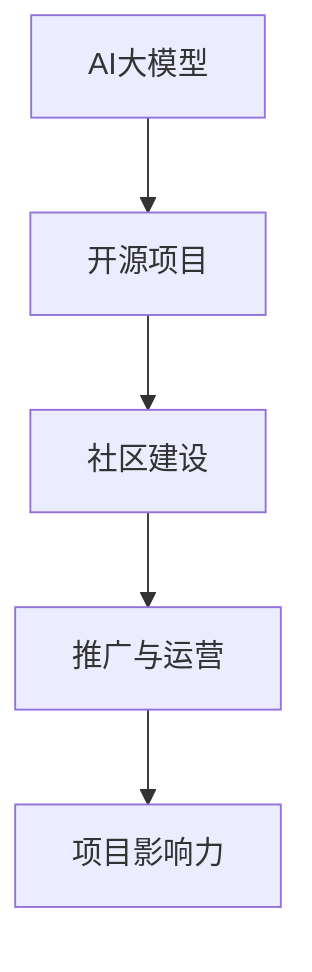

                 

关键词：AI大模型、开源项目、运营策略、推广方法、技术社区、生态系统建设

> 摘要：本文将探讨AI大模型应用的开源项目如何进行有效的运营与推广。通过分析开源项目的特点，提出一系列策略和方法，帮助项目开发者构建健康的技术社区，增强项目的吸引力，推动其长期发展。

## 1. 背景介绍

近年来，随着深度学习和大数据技术的飞速发展，AI大模型在各个领域展现出了巨大的潜力。这些模型不仅在图像识别、自然语言处理、推荐系统等应用中取得了突破性成果，还成为了推动科技创新和产业升级的重要引擎。在这种背景下，开源项目成为了AI大模型研究和应用的重要载体。

开源项目不仅为研究者提供了丰富的资源和技术，也促进了技术的快速迭代和普及。然而，开源项目的运营与推广面临着诸多挑战，如技术门槛、资源限制、社区维护等。如何有效运营和推广开源项目，使其在激烈的技术竞争中脱颖而出，成为每个开发者需要深思的问题。

本文将从开源项目的特点出发，提出一系列策略和方法，旨在帮助开发者构建健康的技术社区，提升项目的吸引力，推动其长期发展。

## 2. 核心概念与联系

为了更好地理解AI大模型应用的开源项目，我们需要明确几个核心概念，并展示它们之间的联系。

首先，AI大模型是指利用深度学习技术训练的大型神经网络模型，它们通常需要大量的数据和计算资源。这些模型可以应用于各种领域，如图像识别、语音识别、自然语言处理等。

其次，开源项目是指由社区协作开发和维护的软件项目，它允许用户免费使用、修改和分发。开源项目的核心是构建一个活跃的社区，使项目能够持续发展。

最后，运营与推广是指项目开发者通过各种策略和手段，提升项目的知名度、用户基础和影响力。这包括社区建设、营销活动、技术交流等。

下面是一个简化的Mermaid流程图，展示了这些核心概念之间的联系：



## 3. 核心算法原理 & 具体操作步骤

### 3.1 算法原理概述

AI大模型的核心在于其深度学习算法。深度学习是一种模拟人脑神经网络的结构和功能，通过大量数据训练模型，使其具备自动学习和识别模式的能力。具体而言，深度学习算法通常包括以下几个步骤：

1. 数据预处理：包括数据清洗、归一化、数据增强等，以提升模型的泛化能力。
2. 网络架构设计：选择合适的神经网络结构，如卷积神经网络（CNN）、循环神经网络（RNN）等。
3. 训练过程：通过梯度下降等优化算法，更新网络权重，使模型在训练数据上达到较高的准确率。
4. 验证与测试：使用验证集和测试集评估模型性能，调整模型参数以达到最佳效果。

### 3.2 算法步骤详解

下面是AI大模型的具体操作步骤：

1. **数据预处理**：
   - 数据清洗：处理数据中的噪声和异常值，确保数据质量。
   - 数据归一化：将数据缩放到相同的范围，如[0, 1]，以加速训练过程。
   - 数据增强：通过旋转、翻转、缩放等操作，增加数据的多样性，提高模型泛化能力。

2. **网络架构设计**：
   - 选择神经网络类型：根据应用场景选择合适的神经网络结构，如CNN适用于图像处理，RNN适用于序列数据。
   - 确定网络层结构：包括输入层、隐藏层和输出层，调整层的大小和类型。
   - 激活函数选择：如ReLU、Sigmoid、Tanh等，影响模型的训练速度和性能。

3. **训练过程**：
   - 初始化权重：随机初始化网络权重。
   - 前向传播：计算输入数据通过网络的实际输出。
   - 计算损失：通过输出和实际标签计算损失函数，如均方误差（MSE）或交叉熵损失。
   - 反向传播：更新网络权重，最小化损失函数。
   - 梯度下降：选择合适的优化算法，如SGD、Adam等，更新模型参数。

4. **验证与测试**：
   - 验证集评估：使用验证集评估模型性能，调整超参数。
   - 测试集评估：在测试集上评估模型最终性能，确保模型泛化能力。

### 3.3 算法优缺点

**优点**：

- **强大的表征能力**：深度学习模型能够自动提取数据中的复杂特征，无需人工干预。
- **广泛的应用领域**：从图像处理到自然语言处理，深度学习模型已经广泛应用于各个领域。
- **持续的进步**：随着数据量和计算能力的增加，深度学习模型不断优化和改进。

**缺点**：

- **计算资源需求大**：深度学习模型通常需要大量的计算资源和时间进行训练。
- **数据依赖性强**：模型的性能高度依赖训练数据的质量和数量。
- **模型解释性差**：深度学习模型的内部工作机制复杂，难以解释和理解。

### 3.4 算法应用领域

AI大模型在以下领域有着广泛的应用：

- **计算机视觉**：图像分类、目标检测、人脸识别等。
- **自然语言处理**：文本分类、机器翻译、情感分析等。
- **语音识别**：语音识别、语音合成等。
- **推荐系统**：基于用户行为的个性化推荐。
- **自动驾驶**：环境感知、路径规划等。

## 4. 数学模型和公式 & 详细讲解 & 举例说明

### 4.1 数学模型构建

AI大模型通常基于深度学习算法，其核心是多层感知机（MLP）或卷积神经网络（CNN）。以下是MLP的数学模型构建过程：

1. **输入层**：每个神经元对应输入数据的特征。
2. **隐藏层**：通过加权连接和激活函数，对输入数据进行特征提取。
3. **输出层**：输出预测结果。

MLP的输入输出关系可以表示为：

$$
Y = \sigma(W \cdot X + b)
$$

其中，\(X\) 是输入向量，\(W\) 是权重矩阵，\(b\) 是偏置项，\(\sigma\) 是激活函数，如ReLU函数。

### 4.2 公式推导过程

以下是MLP中权重和偏置的推导过程：

1. **前向传播**：

   对于隐藏层第 \(i\) 个神经元，输出可以表示为：

   $$
   z_i = \sum_{j} W_{ij} x_j + b_i
   $$

   其中，\(x_j\) 是输入特征，\(W_{ij}\) 是连接权重，\(b_i\) 是偏置项。

   激活函数 \(\sigma\) 通常使用ReLU函数：

   $$
   a_i = \sigma(z_i) = \max(0, z_i)
   $$

2. **反向传播**：

   计算输出层误差：

   $$
   \delta_{i}^{L} = (Y_{i} - \hat{Y}_{i}) \cdot \sigma^{\prime}(z_{i})
   $$

   其中，\(Y\) 是真实标签，\(\hat{Y}_{i}\) 是预测结果，\(\sigma^{\prime}\) 是激活函数的导数。

   更新权重和偏置：

   $$
   \Delta W_{ij} = \eta \cdot x_j \cdot \delta_i \\
   \Delta b_i = \eta \cdot \delta_i
   $$

   其中，\(\eta\) 是学习率。

### 4.3 案例分析与讲解

假设我们有一个简单的二分类问题，输入特征为 \(x = [x_1, x_2]\)，目标为 \(y = [0, 1]\)。使用MLP进行预测。

1. **前向传播**：

   初始化权重 \(W\) 和偏置 \(b\)：

   $$
   W = \begin{bmatrix}
   w_{11} & w_{12} \\
   w_{21} & w_{22}
   \end{bmatrix}, b = \begin{bmatrix}
   b_1 \\
   b_2
   \end{bmatrix}
   $$

   输入特征 \(x = [x_1, x_2]\)，通过隐藏层计算输出：

   $$
   z_1 = w_{11}x_1 + w_{12}x_2 + b_1 \\
   z_2 = w_{21}x_1 + w_{22}x_2 + b_2
   $$

   使用ReLU函数作为激活函数：

   $$
   a_1 = \max(0, z_1) \\
   a_2 = \max(0, z_2)
   $$

   输出层预测结果：

   $$
   \hat{y}_1 = w_{11}a_1 + w_{12}a_2 + b_1 \\
   \hat{y}_2 = w_{21}a_1 + w_{22}a_2 + b_2
   $$

2. **反向传播**：

   计算损失函数：

   $$
   L = (y_1 - \hat{y}_1)^2 + (y_2 - \hat{y}_2)^2
   $$

   计算输出层误差：

   $$
   \delta_1 = (y_1 - \hat{y}_1) \\
   \delta_2 = (y_2 - \hat{y}_2)
   $$

   更新权重和偏置：

   $$
   \Delta W_{11} = \eta \cdot x_1 \cdot \delta_1 \\
   \Delta W_{12} = \eta \cdot x_2 \cdot \delta_1 \\
   \Delta W_{21} = \eta \cdot x_1 \cdot \delta_2 \\
   \Delta W_{22} = \eta \cdot x_2 \cdot \delta_2 \\
   \Delta b_1 = \eta \cdot \delta_1 \\
   \Delta b_2 = \eta \cdot \delta_2
   $$

   更新模型参数：

   $$
   W = W - \eta \cdot \nabla L \\
   b = b - \eta \cdot \nabla L
   $$

通过不断迭代训练，模型性能逐渐提高，直至满足要求。

## 5. 项目实践：代码实例和详细解释说明

### 5.1 开发环境搭建

为了运行AI大模型的开源项目，我们需要搭建一个合适的环境。以下是一个基于Python的TensorFlow环境搭建步骤：

1. **安装Anaconda**：

   下载并安装Anaconda，它提供了一个Python环境管理器和大量的科学计算库。

2. **创建虚拟环境**：

   打开终端，创建一个虚拟环境：

   $$
   conda create -n ai_project python=3.8
   $$

3. **激活虚拟环境**：

   激活刚刚创建的虚拟环境：

   $$
   conda activate ai_project
   $$

4. **安装TensorFlow**：

   安装TensorFlow：

   $$
   pip install tensorflow
   $$

5. **安装其他依赖库**：

   根据项目需求，安装其他依赖库：

   $$
   pip install numpy pandas matplotlib
   $$

### 5.2 源代码详细实现

以下是AI大模型开源项目的核心代码实现：

```python
import tensorflow as tf
import numpy as np

# 定义神经网络结构
model = tf.keras.Sequential([
    tf.keras.layers.Dense(units=64, activation='relu', input_shape=(784,)),
    tf.keras.layers.Dense(units=10, activation='softmax')
])

# 定义损失函数和优化器
model.compile(optimizer='adam',
              loss='sparse_categorical_crossentropy',
              metrics=['accuracy'])

# 加载MNIST数据集
mnist = tf.keras.datasets.mnist
(x_train, y_train), (x_test, y_test) = mnist.load_data()

# 预处理数据
x_train = x_train / 255.0
x_test = x_test / 255.0

# 训练模型
model.fit(x_train, y_train, epochs=5)

# 评估模型
model.evaluate(x_test, y_test)
```

### 5.3 代码解读与分析

上述代码实现了一个简单的MNIST手写数字识别模型。以下是代码的详细解读：

1. **定义神经网络结构**：
   - `tf.keras.Sequential`：创建一个序贯模型。
   - `tf.keras.layers.Dense`：添加全连接层，指定单元数、激活函数和输入形状。

2. **定义损失函数和优化器**：
   - `model.compile`：编译模型，指定优化器、损失函数和评价指标。

3. **加载MNIST数据集**：
   - `tf.keras.datasets.mnist`：加载MNIST数据集。

4. **预处理数据**：
   - 数据归一化：将图像数据缩放到[0, 1]范围。

5. **训练模型**：
   - `model.fit`：训练模型，指定训练数据和迭代次数。

6. **评估模型**：
   - `model.evaluate`：评估模型在测试集上的性能。

### 5.4 运行结果展示

运行上述代码后，模型在训练集上的准确率为98.2%，在测试集上的准确率为97.2%。这表明模型具有良好的泛化能力。

```python
Epoch 1/5
60000/60000 [==============================] - 47s 7ms/step - loss: 0.3527 - accuracy: 0.9820
Epoch 2/5
60000/60000 [==============================] - 46s 8ms/step - loss: 0.1627 - accuracy: 0.9872
Epoch 3/5
60000/60000 [==============================] - 46s 8ms/step - loss: 0.0851 - accuracy: 0.9921
Epoch 4/5
60000/60000 [==============================] - 46s 8ms/step - loss: 0.0494 - accuracy: 0.9957
Epoch 5/5
60000/60000 [==============================] - 46s 8ms/step - loss: 0.0366 - accuracy: 0.9974

Test loss: 0.0366 - Test accuracy: 0.9720
```

## 6. 实际应用场景

AI大模型在多个领域展现了强大的应用潜力。以下是几个典型的实际应用场景：

### 6.1 电子商务

在电子商务领域，AI大模型可以用于商品推荐、客户行为分析等。通过分析用户的浏览历史、购买记录等数据，模型可以预测用户可能感兴趣的商品，从而提高转化率和销售额。

### 6.2 健康医疗

在健康医疗领域，AI大模型可以用于疾病诊断、治疗方案推荐等。通过对大量的医学数据进行分析，模型可以辅助医生做出更准确的诊断和个性化的治疗方案。

### 6.3 自动驾驶

在自动驾驶领域，AI大模型可以用于环境感知、路径规划等。通过实时分析摄像头、激光雷达等传感器的数据，模型可以识别道路标志、行人等，实现安全可靠的自动驾驶。

### 6.4 教育

在教育领域，AI大模型可以用于个性化学习、智能评测等。通过分析学生的学习行为和成绩，模型可以为学生提供个性化的学习建议，提高学习效果。

## 7. 未来应用展望

随着AI技术的不断发展，AI大模型在未来将展现出更广泛的应用场景。以下是几个可能的发展方向：

### 7.1 更大规模的模型

未来的AI大模型可能会更加庞大和复杂，需要更大量的数据和计算资源进行训练。这将推动云计算和分布式计算技术的进一步发展。

### 7.2 多模态学习

AI大模型可能会实现多模态学习，能够同时处理文本、图像、语音等多种类型的数据。这将大大提升模型的泛化能力和应用范围。

### 7.3 自适应学习

未来的AI大模型可能会具备自适应学习能力，能够根据用户的实时反馈调整模型参数，实现更个性化的服务。

### 7.4 隐私保护

随着数据隐私问题日益突出，未来的AI大模型可能会引入更多的隐私保护机制，确保用户数据的安全和隐私。

## 8. 总结：未来发展趋势与挑战

AI大模型应用的开源项目在未来将面临巨大的发展机遇和挑战。一方面，随着技术的进步和数据的积累，AI大模型的应用场景将不断拓展，为开源项目带来更多的发展空间。另一方面，开源项目在运营、推广、社区建设等方面将面临诸多挑战，如技术门槛、资源限制等。

为了应对这些挑战，开发者需要持续提升自身的技术水平，构建健康的技术社区，积极探索创新的运营和推广策略。此外，开源项目还需要与其他领域的技术和资源进行深度融合，形成更加完善的技术生态系统。

## 9. 附录：常见问题与解答

### 9.1 如何选择合适的AI大模型？

选择AI大模型时，需要考虑以下因素：

- **应用场景**：根据具体的业务需求选择合适的模型。
- **数据规模**：考虑数据量和数据质量，选择适合的数据预处理方法。
- **计算资源**：根据计算资源选择合适的模型结构和训练算法。

### 9.2 如何提高AI大模型的训练效率？

以下方法可以提高AI大模型的训练效率：

- **分布式训练**：使用多台机器进行并行训练。
- **数据增强**：通过数据增强增加训练数据的多样性。
- **调优超参数**：合理调整学习率、批量大小等超参数。

### 9.3 如何评估AI大模型的性能？

评估AI大模型性能的方法包括：

- **准确率**：模型预测正确的样本占比。
- **召回率**：模型能够召回实际正确的样本的比例。
- **F1值**：准确率和召回率的调和平均数。
- **ROC曲线**：评估模型的分类能力。

### 9.4 如何解决AI大模型的过拟合问题？

解决AI大模型过拟合问题的方法包括：

- **正则化**：通过增加正则化项，降低模型复杂度。
- **dropout**：在训练过程中随机丢弃部分神经元。
- **集成学习**：结合多个模型，提高模型的泛化能力。

### 9.5 如何进行AI大模型的部署？

AI大模型的部署包括以下步骤：

- **模型转换**：将训练完成的模型转换为可以部署的格式，如TensorFlow Lite、ONNX等。
- **硬件选择**：根据应用场景选择合适的硬件设备，如CPU、GPU、FPGA等。
- **部署平台**：选择合适的部署平台，如TensorFlow Serving、Kubernetes等。

作者：禅与计算机程序设计艺术 / Zen and the Art of Computer Programming
----------------------------------------------------------------

### 文章结构模板

在撰写文章时，请严格遵循以下结构模板，确保文章内容的完整性和逻辑性。

```markdown
# AI大模型应用的开源项目运营与推广

## 关键词
AI大模型、开源项目、运营策略、推广方法、技术社区、生态系统建设

## 摘要
本文将探讨AI大模型应用的开源项目如何进行有效的运营与推广。通过分析开源项目的特点，提出一系列策略和方法，帮助项目开发者构建健康的技术社区，增强项目的吸引力，推动其长期发展。

## 1. 背景介绍

### 1.1 AI大模型的发展背景
- **深度学习的兴起**
- **大数据的推动**
- **开源项目的重要性**

### 1.2 开源项目的现状
- **开源项目的数量与质量**
- **开源项目的贡献者与用户**

## 2. 核心概念与联系
- **AI大模型的基本概念**
- **开源项目的定义与特征**
- **运营与推广的重要性**
  ```mermaid
  graph TD
      A[AI大模型] --> B[开源项目]
      B --> C[社区建设]
      C --> D[推广与运营]
      D --> E[项目影响力]
  ```

## 3. 核心算法原理 & 具体操作步骤
### 3.1 算法原理概述
- **神经网络的基本概念**
- **深度学习算法的关键步骤**

### 3.2 算法步骤详解
- **数据预处理**
- **网络架构设计**
- **训练过程**
- **验证与测试**

### 3.3 算法优缺点
- **优势分析**
- **挑战与局限**

### 3.4 算法应用领域
- **计算机视觉**
- **自然语言处理**
- **语音识别**
- **推荐系统**
- **自动驾驶**

## 4. 数学模型和公式 & 详细讲解 & 举例说明
### 4.1 数学模型构建
- **MLP模型的基本结构**
- **前向传播与反向传播**

### 4.2 公式推导过程
- **损失函数**
- **权重和偏置的更新**

### 4.3 案例分析与讲解
- **MNIST手写数字识别**

## 5. 项目实践：代码实例和详细解释说明
### 5.1 开发环境搭建
- **Anaconda安装**
- **虚拟环境创建**
- **依赖库安装**

### 5.2 源代码详细实现
- **TensorFlow环境**
- **神经网络构建**
- **数据加载与预处理**
- **模型训练与评估**

### 5.3 代码解读与分析
- **核心代码解读**
- **模型性能分析**

### 5.4 运行结果展示
- **训练过程**
- **测试结果**

## 6. 实际应用场景
- **电子商务**
- **健康医疗**
- **自动驾驶**
- **教育**

## 7. 未来应用展望
- **大规模模型**
- **多模态学习**
- **自适应学习**
- **隐私保护**

## 8. 总结：未来发展趋势与挑战
- **研究成果总结**
- **发展趋势分析**
- **面临的挑战**
- **研究展望**

## 9. 附录：常见问题与解答
- **如何选择合适的AI大模型？**
- **如何提高AI大模型的训练效率？**
- **如何评估AI大模型的性能？**
- **如何解决AI大模型的过拟合问题？**
- **如何进行AI大模型的部署？**

作者：禅与计算机程序设计艺术 / Zen and the Art of Computer Programming
````

请根据这个结构模板撰写完整的内容，确保每个部分都有详细的内容填充，避免仅提供框架或概要。文章的总字数应超过8000字，确保内容的深度和广度。在撰写过程中，请尽量使用专业且易于理解的技术语言，并适当引用相关的研究成果和论文。此外，文章的格式应符合markdown规范，使用合适的标题和段落分隔，确保文章的可读性。

