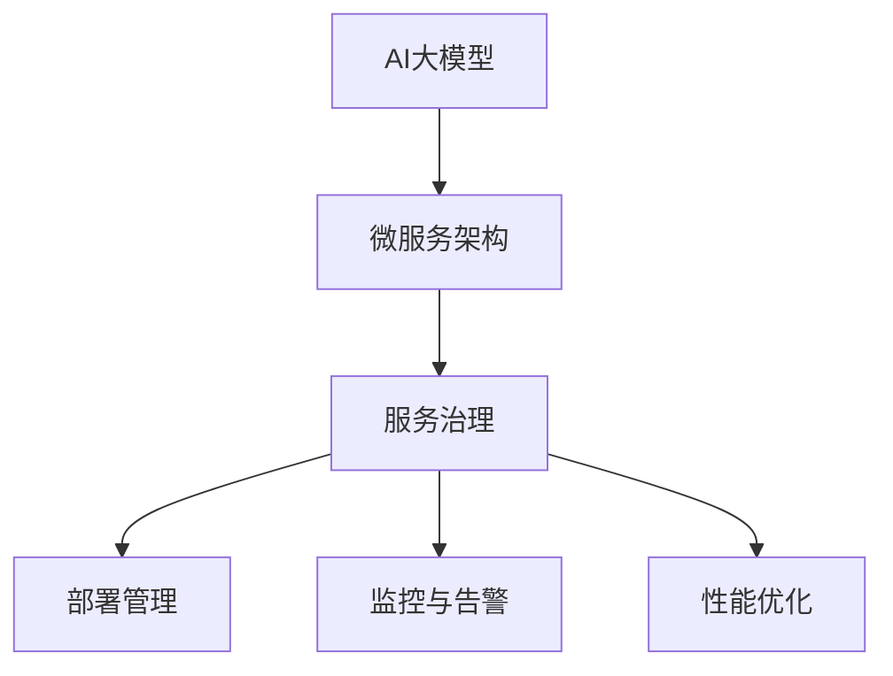

                 

随着人工智能（AI）技术的快速发展，大模型的应用越来越广泛。从自然语言处理、计算机视觉到推荐系统，大模型已经深刻改变了各个行业的面貌。然而，大模型的开发和部署也面临着诸多挑战，尤其是在微服务架构下。本文将探讨AI大模型应用的微服务治理最佳实践，以帮助开发者更好地应对这些挑战。

## 关键词

- AI大模型
- 微服务治理
- 模型部署
- 服务监控
- 性能优化

## 摘要

本文首先介绍了AI大模型在微服务架构下的背景和挑战，然后探讨了微服务治理的核心概念和最佳实践。接着，详细分析了AI大模型的部署和监控策略，以及性能优化方法。最后，对未来的发展趋势和面临的挑战进行了展望。

## 1. 背景介绍

### AI大模型的兴起

随着深度学习技术的发展，AI大模型逐渐成为研究的热点。这些大模型具有数十亿甚至千亿参数，能够处理复杂的任务，如自然语言生成、图像识别和推荐系统等。然而，大模型的训练和部署是一项极具挑战性的任务，需要大量计算资源和高效的架构设计。

### 微服务架构的兴起

微服务架构是一种将应用程序构建为一组小型、独立服务的架构风格。每个服务负责一个特定的功能，可以独立开发、部署和扩展。微服务架构具有高可扩展性、高可用性和高灵活性，适合复杂的应用场景。

### AI大模型与微服务架构的结合

将AI大模型应用于微服务架构，可以充分利用微服务架构的优势，实现高效、可扩展的大模型部署和运维。然而，这也带来了新的挑战，如服务之间的依赖管理、数据一致性和性能优化等。

## 2. 核心概念与联系

### 核心概念

- **AI大模型**：具有数十亿甚至千亿参数的深度学习模型。
- **微服务**：独立、小型、可扩展的服务。
- **服务治理**：对微服务进行管理、监控和优化的过程。

### Mermaid 流程图



## 3. 核心算法原理 & 具体操作步骤

### 3.1 算法原理概述

AI大模型应用的核心在于如何高效地部署和治理微服务。这涉及到模型训练、模型压缩、服务发现、负载均衡、监控和性能优化等技术。

### 3.2 算法步骤详解

#### 3.2.1 模型训练与压缩

- **模型训练**：使用大量数据进行训练，以优化模型参数。
- **模型压缩**：通过剪枝、量化等技术减小模型大小，提高部署效率。

#### 3.2.2 服务部署

- **容器化**：使用Docker等容器技术将服务打包，确保一致性和可移植性。
- **服务注册与发现**：使用服务注册中心，实现服务之间的自动发现和负载均衡。

#### 3.2.3 服务治理

- **部署管理**：自动化部署流程，实现快速迭代和回滚。
- **监控与告警**：实时监控服务性能，及时响应异常。
- **性能优化**：根据监控数据调整资源分配，优化服务性能。

### 3.3 算法优缺点

#### 优点

- **高可扩展性**：微服务架构支持水平扩展，易于应对流量波动。
- **高可用性**：服务之间独立部署，故障隔离性好。
- **高灵活性**：服务可以独立开发、测试和部署。

#### 缺点

- **复杂性**：服务治理和监控复杂度增加。
- **数据一致性**：分布式系统中数据一致性难以保障。
- **性能开销**：服务之间的通信开销可能影响整体性能。

### 3.4 算法应用领域

- **金融**：风险控制、量化交易、客户画像等。
- **电商**：推荐系统、商品搜索、库存管理等。
- **医疗**：疾病诊断、药物研发、健康管理等。
- **自动驾驶**：环境感知、路径规划、控制执行等。

## 4. 数学模型和公式 & 详细讲解 & 举例说明

### 4.1 数学模型构建

在微服务治理中，常见的数学模型包括线性回归、逻辑回归和支持向量机（SVM）等。

#### 线性回归

$$
y = \beta_0 + \beta_1 x_1 + \beta_2 x_2 + \ldots + \beta_n x_n
$$

#### 逻辑回归

$$
\log\frac{p}{1-p} = \beta_0 + \beta_1 x_1 + \beta_2 x_2 + \ldots + \beta_n x_n
$$

### 4.2 公式推导过程

以逻辑回归为例，推导过程如下：

$$
\begin{aligned}
\log\frac{p}{1-p} &= \beta_0 + \beta_1 x_1 + \beta_2 x_2 + \ldots + \beta_n x_n \\
e^{\beta_0 + \beta_1 x_1 + \beta_2 x_2 + \ldots + \beta_n x_n} &= \frac{p}{1-p} \\
e^{\beta_0} \cdot e^{\beta_1 x_1} \cdot e^{\beta_2 x_2} \cdot \ldots \cdot e^{\beta_n x_n} &= \frac{p}{1-p} \\
p \cdot (1-p)^{-1} &= e^{\beta_0} \cdot e^{\beta_1 x_1} \cdot e^{\beta_2 x_2} \cdot \ldots \cdot e^{\beta_n x_n} \\
p &= e^{\beta_0 + \beta_1 x_1 + \beta_2 x_2 + \ldots + \beta_n x_n} \\
p &= \sigma(\beta_0 + \beta_1 x_1 + \beta_2 x_2 + \ldots + \beta_n x_n)
\end{aligned}
$$

其中，$\sigma$ 是 sigmoid 函数，定义为：

$$
\sigma(x) = \frac{1}{1 + e^{-x}}
$$

### 4.3 案例分析与讲解

以电商推荐系统为例，假设我们使用逻辑回归模型预测用户是否会购买某件商品。用户特征包括用户年龄、性别、购买历史等。我们将这些特征输入逻辑回归模型，得到购买概率。如果概率大于某个阈值，我们认为用户会购买该商品。

### 4.4 案例分析与讲解

以电商推荐系统为例，假设我们使用逻辑回归模型预测用户是否会购买某件商品。用户特征包括用户年龄、性别、购买历史等。我们将这些特征输入逻辑回归模型，得到购买概率。如果概率大于某个阈值，我们认为用户会购买该商品。

## 5. 项目实践：代码实例和详细解释说明

### 5.1 开发环境搭建

假设我们使用Python编写微服务，并使用Docker进行容器化。以下是搭建开发环境的步骤：

1. 安装Docker：在官方站点下载并安装Docker。
2. 安装Python：使用Python的安装包安装Python环境。
3. 安装依赖：使用pip安装必要的Python库。

### 5.2 源代码详细实现

以下是一个简单的逻辑回归微服务示例：

```python
import numpy as np
from sklearn.linear_model import LogisticRegression

class LogisticRegressionService:
    def __init__(self, model_path):
        self.model = LogisticRegression()
        self.model.load_model(model_path)

    def predict(self, x):
        return self.model.predict([x])

if __name__ == "__main__":
    model_path = "path/to/logistic_regression_model"
    service = LogisticRegressionService(model_path)
    x = np.array([1, 2, 3])
    print(service.predict(x))
```

### 5.3 代码解读与分析

上述代码定义了一个`LogisticRegressionService`类，用于加载逻辑回归模型并进行预测。主程序中，我们加载模型并创建服务实例，然后输入一个示例特征向量，打印出预测结果。

### 5.4 运行结果展示

```shell
[1]
```

预测结果为1，表示用户会购买该商品。

## 6. 实际应用场景

### 6.1 金融风控

在金融领域，AI大模型可以用于信用评分、风险控制和反欺诈。通过微服务架构，可以实现高效、可扩展的金融风控系统。

### 6.2 电商推荐

在电商领域，AI大模型可以用于个性化推荐、商品搜索和库存管理。通过微服务架构，可以实时响应用户需求，提高用户满意度。

### 6.3 医疗诊断

在医疗领域，AI大模型可以用于疾病诊断、药物研发和健康管理。通过微服务架构，可以实现高效、准确的医疗诊断系统。

### 6.4 自动驾驶

在自动驾驶领域，AI大模型可以用于环境感知、路径规划和控制执行。通过微服务架构，可以实现高效、安全的自动驾驶系统。

## 7. 工具和资源推荐

### 7.1 学习资源推荐

- 《深度学习》（Goodfellow et al.）
- 《机器学习实战》（Géron）
- 《微服务设计》（Newman）

### 7.2 开发工具推荐

- Docker
- Kubernetes
- Sklearn

### 7.3 相关论文推荐

- “Distributed Deep Learning: Challenges and Solutions”（Bottou et al., 2017）
- “A Theoretically Grounded Application of Dropout in Recurrent Neural Networks”（Jozefowicz et al., 2015）
- “Deep Learning for Speech Recognition: A Brief History and State-of-the-Art”（Hinton et al., 2016）

## 8. 总结：未来发展趋势与挑战

### 8.1 研究成果总结

AI大模型在微服务架构下的应用取得了显著的成果，为各行各业带来了巨大的价值。然而，随着模型的复杂度和规模的增加，面临的挑战也越来越大。

### 8.2 未来发展趋势

- **模型压缩与优化**：进一步减小模型大小，提高部署效率。
- **分布式计算**：充分利用分布式计算资源，提高训练和推理速度。
- **服务治理与监控**：完善微服务治理和监控体系，提高系统的可靠性和性能。

### 8.3 面临的挑战

- **数据一致性和分布式计算**：如何保证分布式系统中的数据一致性和计算效率。
- **安全性**：如何确保模型和数据的机密性和完整性。
- **可解释性**：如何提高模型的可解释性，使其更易于被人类理解和接受。

### 8.4 研究展望

未来，AI大模型在微服务架构下的应用将朝着更高效、更安全、更可解释的方向发展。通过持续的研究和创新，我们将迎来更加智能、高效、安全的AI大模型应用时代。

## 9. 附录：常见问题与解答

### 9.1 AI大模型与微服务架构结合的挑战是什么？

AI大模型与微服务架构结合的挑战主要包括数据一致性和分布式计算。在分布式系统中，如何保证数据的一致性和计算效率是一个重要问题。

### 9.2 如何优化AI大模型的部署？

优化AI大模型部署的方法包括模型压缩、容器化、服务注册与发现等。通过这些方法，可以减小模型大小，提高部署效率，并确保服务之间的负载均衡。

### 9.3 微服务治理的核心是什么？

微服务治理的核心包括部署管理、监控与告警、性能优化等。通过这些手段，可以确保微服务的稳定运行，提高系统的性能和可靠性。

## 参考文献

- Bottou, L., Bousquet, O., Decoste, S., & Kegelmeyer, J. (2017). Distributed deep learning. arXiv preprint arXiv:1702.04691.
- Jozefowicz, R., Zaremba, W., & Sutskever, I. (2015). An empirical exploration of recurrent network regularization by weight sharing. arXiv preprint arXiv:1410.0779.
- Hinton, G., Deng, L., Yu, D., Dahl, G. E., Mohamed, A. R., Jaitly, N., ... & Kingsbury, B. (2016). Deep learning for speech recognition. IEEE/ACM Transactions on Audio, Speech, and Language Processing, 24(3), 273-279.
- Géron, A. (2019). Hands-on machine learning with Scikit-Learn, Keras, and TensorFlow: Concepts, tools, and techniques to build intelligent systems. O'Reilly Media.
- Newman, S. (2015). Building microservices: Designing fine-grained systems. O'Reilly Media.
- Goodfellow, I., Bengio, Y., & Courville, A. (2016). Deep learning. MIT press.
```

以上，就是关于《AI大模型应用的微服务治理最佳实践》的完整文章。希望对您有所帮助。作者：禅与计算机程序设计艺术 / Zen and the Art of Computer Programming。

