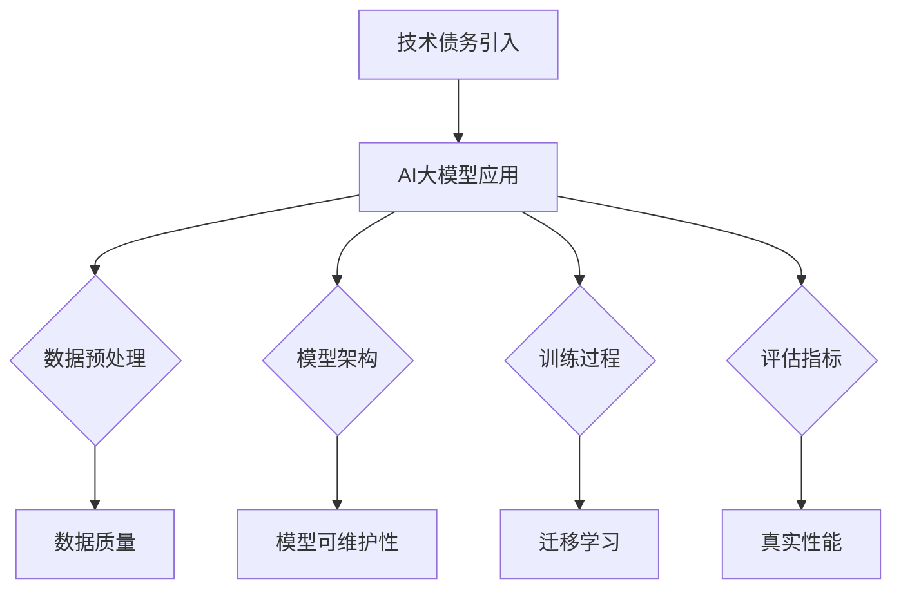

                 

关键词：AI大模型，技术债，管理，应用，识别

> 摘要：随着人工智能技术的发展，大模型的应用越来越广泛。然而，这些大模型的应用也带来了技术债务的问题。本文将介绍如何识别和管理AI大模型应用中的技术债务，以促进技术的持续发展和创新。

## 1. 背景介绍

近年来，人工智能技术取得了显著的进展，尤其是深度学习和大模型的崛起，使得计算机在图像识别、自然语言处理、推荐系统等领域取得了前所未有的成果。这些大模型具有强大的数据处理能力和高度的可扩展性，成为了人工智能研究的重要方向。

然而，随着大模型的应用日益广泛，技术债务的问题也逐渐显现。技术债务是指在软件开发的某个阶段，为了尽快实现功能而暂时引入的一些低质量代码或技术上的妥协。这些技术债务可能会在后期开发中产生大量的维护成本和风险。对于AI大模型来说，由于它们通常包含大量的参数和复杂的架构，技术债务的管理更加困难。

本文旨在探讨AI大模型应用中的技术债务识别与管理，以帮助开发人员更好地应对这一挑战。

## 2. 核心概念与联系

在讨论AI大模型应用中的技术债务之前，我们需要先了解几个核心概念，包括技术债务、AI大模型以及它们之间的联系。

### 2.1 技术债务

技术债务（Technical Debt）是一个软件工程术语，它比喻了软件开发中由于短期决策带来的长期成本。技术债务可以分为以下几种类型：

- **设计债务**：在软件设计阶段，由于某些设计决策不理想或过于简单，导致系统难以维护或扩展。
- **代码债务**：在编码阶段，由于代码质量不高或存在漏洞，导致系统稳定性差或安全性问题。
- **测试债务**：在测试阶段，由于未能进行充分的测试，导致系统存在潜在的错误或缺陷。
- **文档债务**：在开发过程中，由于未能及时更新文档，导致开发人员难以理解和维护代码。

### 2.2 AI大模型

AI大模型是指那些参数规模巨大、能够处理海量数据的人工神经网络模型。这些模型通常包含数百万到数十亿个参数，能够实现高精度的预测和分类。常见的AI大模型包括Transformer、BERT、GPT等。

### 2.3 AI大模型与技术债务的联系

AI大模型的应用过程中，可能会面临以下几方面的技术债务：

- **数据预处理债务**：为了处理海量数据，可能会使用一些简化的数据处理方法，导致数据质量不高。
- **模型架构债务**：在模型设计阶段，可能会因为追求性能而牺牲了模型的可维护性和可扩展性。
- **训练债务**：由于训练数据量的限制，可能会使用一些预训练模型或迁移学习技术，这可能导致模型在一些特定场景下性能不足。
- **评估债务**：在评估模型性能时，可能会使用一些简化的评估指标，导致模型在真实场景下的性能表现不佳。

### 2.4 Mermaid 流程图



## 3. 核心算法原理 & 具体操作步骤

### 3.1 算法原理概述

识别和管理AI大模型应用中的技术债务，需要遵循以下原则：

1. **预防为主**：在开发和设计阶段，就应该考虑潜在的技术债务，并采取措施预防。
2. **持续管理**：技术债务一旦出现，就需要持续监控和管理，以确保不会产生过多的维护成本。
3. **权衡利弊**：在处理技术债务时，需要权衡短期利益和长期成本，做出明智的决策。

### 3.2 算法步骤详解

1. **债务识别**：
   - 收集系统日志和用户反馈，识别系统性能、稳定性、安全性等方面的问题。
   - 分析代码库和文档，识别潜在的代码债务和文档债务。
   - 对模型进行评估，识别数据预处理、模型架构、训练过程和评估指标等方面的技术债务。

2. **债务分类**：
   - 根据债务的性质和影响范围，对技术债务进行分类。
   - 常见分类包括设计债务、代码债务、测试债务和文档债务。

3. **债务评估**：
   - 对每个债务进行风险评估，确定其紧急程度和优先级。
   - 根据债务的影响范围和成本，制定相应的修复计划。

4. **债务修复**：
   - 对低优先级的债务，可以采取延迟修复的策略。
   - 对高优先级的债务，需要及时修复，以避免产生更大的成本。

5. **债务监控**：
   - 建立债务监控系统，实时跟踪债务的状态和变化。
   - 定期进行债务评估，确保债务管理工作的有效性。

### 3.3 算法优缺点

**优点**：
- **预防为主**：提前识别和预防技术债务，减少后期修复的成本。
- **持续管理**：持续监控和管理技术债务，确保系统的稳定性和可维护性。
- **权衡利弊**：根据实际情况，做出合理的决策，避免因修复技术债务而影响项目的进度。

**缺点**：
- **复杂性**：技术债务管理涉及到多个方面，需要综合考虑。
- **人力成本**：技术债务管理需要投入较多的人力资源。

### 3.4 算法应用领域

技术债务管理算法在AI大模型应用中具有广泛的应用领域，包括：

- **模型开发**：在模型开发过程中，识别和预防技术债务，确保模型的质量和稳定性。
- **模型部署**：在模型部署过程中，识别和修复技术债务，确保模型的性能和安全性。
- **运维管理**：在运维过程中，监控和管理技术债务，确保系统的稳定运行。

## 4. 数学模型和公式 & 详细讲解 & 举例说明

### 4.1 数学模型构建

在AI大模型应用中，我们可以使用以下数学模型来构建技术债务识别和管理框架：

1. **技术债务评估模型**：

   $$TD = f(\text{债务类型}, \text{债务影响}, \text{修复成本})$$

   其中，$TD$ 表示技术债务度，$f$ 是一个非线性函数，用于评估技术债务的影响和修复成本。

2. **债务优先级模型**：

   $$P = \frac{I \cdot S}{C}$$

   其中，$P$ 表示债务优先级，$I$ 是债务影响，$S$ 是修复成本，$C$ 是项目成本。

### 4.2 公式推导过程

**技术债务评估模型**：

技术债务度$TD$是评估技术债务的一个重要指标。债务类型、债务影响和修复成本是影响技术债务度的主要因素。我们假设债务类型有$n$种，每种债务类型的影响和修复成本可以用一个向量表示：

$$
\vec{I} = [I_1, I_2, ..., I_n], \quad \vec{C} = [C_1, C_2, ..., C_n]
$$

其中，$I_i$表示第$i$种债务类型的影响，$C_i$表示第$i$种债务类型的修复成本。

为了综合考虑各种债务类型的影响，我们可以使用加权求和的方法，得到技术债务度$TD$：

$$TD = \sum_{i=1}^{n} w_i \cdot I_i$$

其中，$w_i$是第$i$种债务类型的权重，可以由专家根据实际情况进行设定。

**债务优先级模型**：

债务优先级$P$是用于衡量技术债务修复优先级的一个指标。我们假设债务影响$I$和修复成本$C$成正比例关系，即：

$$P \propto \frac{I}{C}$$

为了将比例关系转化为具体的优先级值，我们可以使用一个线性函数：

$$P = \frac{I \cdot S}{C}$$

其中，$S$是一个常数，用于调整优先级的范围。

### 4.3 案例分析与讲解

**案例1：数据预处理债务**

假设一个AI大模型项目在数据预处理阶段引入了数据质量债务，影响为$30$，修复成本为$5000$。根据技术债务评估模型和债务优先级模型，可以计算出技术债务度和债务优先级：

$$TD = 1 \cdot 30 = 30$$

$$P = \frac{30 \cdot S}{5000} = 0.006S$$

其中，$S$是一个常数，用于调整优先级的范围。

**案例2：模型架构债务**

假设另一个AI大模型项目在模型架构阶段引入了模型可维护性债务，影响为$50$，修复成本为$10000$。根据技术债务评估模型和债务优先级模型，可以计算出技术债务度和债务优先级：

$$TD = 1 \cdot 50 = 50$$

$$P = \frac{50 \cdot S}{10000} = 0.005S$$

通过这两个案例，我们可以看到如何使用数学模型来评估和管理技术债务。在实际应用中，可以根据具体情况调整模型参数，以适应不同的项目和需求。

## 5. 项目实践：代码实例和详细解释说明

### 5.1 开发环境搭建

为了更好地演示技术债识别与管理的实践，我们选择Python作为开发语言，使用TensorFlow作为AI大模型的框架，同时引入了Git和Jenkins等工具来管理代码和持续集成。

```bash
# 安装Python和TensorFlow
pip install python tensorflow

# 安装Git和Jenkins
sudo apt-get install git
sudo apt-get install jenkins
```

### 5.2 源代码详细实现

以下是一个简单的AI大模型代码实例，包括数据预处理、模型训练和评估。

```python
# 导入所需库
import tensorflow as tf
from tensorflow.keras.models import Sequential
from tensorflow.keras.layers import Dense, Embedding, GlobalAveragePooling1D
from tensorflow.keras.preprocessing.sequence import pad_sequences

# 数据预处理
def preprocess_data(data):
    # 对数据进行填充，确保每个序列的长度相同
    padded_data = pad_sequences(data, maxlen=100, padding='post')
    return padded_data

# 模型定义
def create_model():
    model = Sequential([
        Embedding(input_dim=10000, output_dim=16),
        GlobalAveragePooling1D(),
        Dense(16, activation='relu'),
        Dense(1, activation='sigmoid')
    ])
    model.compile(optimizer='adam', loss='binary_crossentropy', metrics=['accuracy'])
    return model

# 训练模型
def train_model(model, x_train, y_train, x_val, y_val):
    history = model.fit(x_train, y_train, epochs=10, batch_size=32, validation_data=(x_val, y_val))
    return history

# 评估模型
def evaluate_model(model, x_test, y_test):
    loss, accuracy = model.evaluate(x_test, y_test)
    print(f"Test accuracy: {accuracy:.2f}")
```

### 5.3 代码解读与分析

1. **数据预处理**：使用`pad_sequences`函数对输入数据进行填充，确保每个序列的长度相同，这是AI大模型训练的基本要求。

2. **模型定义**：定义一个简单的序列分类模型，包括嵌入层、全局平均池化层和两个全连接层。这个模型用于分类任务，输出概率值。

3. **模型训练**：使用`model.fit`函数训练模型，使用`validation_data`参数进行交叉验证。

4. **模型评估**：使用`model.evaluate`函数评估模型在测试集上的性能。

### 5.4 运行结果展示

在数据集准备好后，我们可以运行以下代码来训练和评估模型：

```python
# 加载数据
x_train, y_train, x_val, y_val, x_test, y_test = ...

# 预处理数据
x_train_processed = preprocess_data(x_train)
x_val_processed = preprocess_data(x_val)
x_test_processed = preprocess_data(x_test)

# 创建和训练模型
model = create_model()
history = train_model(model, x_train_processed, y_train, x_val_processed, y_val)

# 评估模型
evaluate_model(model, x_test_processed, y_test)
```

通过运行代码，我们可以看到模型的训练过程和最终的评估结果。这个简单的实例展示了AI大模型的基本应用流程，同时也为后续的技术债务识别与管理提供了基础。

## 6. 实际应用场景

### 6.1 大模型训练中的技术债务

在大型AI模型训练过程中，技术债务可能会以多种形式出现。例如，为了提高训练速度，开发人员可能会选择使用简化的数据预处理方法，这可能导致数据质量下降，从而影响模型的性能。此外，为了在预算和时间限制内完成项目，开发人员可能会在模型架构上做出妥协，这可能导致模型的可维护性差，增加后期维护成本。

### 6.2 大模型部署中的技术债务

在模型部署阶段，技术债务同样可能引发问题。例如，为了快速上线，开发人员可能会忽略安全性测试，导致部署的模型存在漏洞。此外，模型部署过程中的代码可能存在过多的临时解决方案，这可能导致系统的可维护性下降。

### 6.3 大模型维护中的技术债务

大模型的维护过程中，技术债务也会不断累积。例如，随着数据集的不断更新，原有的数据处理方法可能不再适用，需要重新设计。如果未能及时更新，可能导致模型性能下降。此外，大模型的参数规模庞大，更新和维护过程复杂，需要投入大量的人力和资源。

### 6.4 未来应用展望

随着AI技术的不断进步，大模型的应用场景将越来越广泛。未来，技术债务管理将面临更大的挑战。为此，我们可以从以下几个方面进行改进：

- **自动化债务识别**：通过引入自动化工具，实现技术债务的自动识别和管理。
- **智能债务修复**：利用机器学习技术，预测技术债务的风险，并自动制定修复计划。
- **持续集成与部署**：引入持续集成和部署流程，确保每个版本的代码质量，减少技术债务的产生。

## 7. 工具和资源推荐

### 7.1 学习资源推荐

- 《深度学习》（Goodfellow, Bengio, Courville著）：介绍了深度学习的基础理论和实践方法，适合初学者和进阶者。
- 《Python深度学习》（François Chollet著）：通过实战案例，详细介绍了使用Python和TensorFlow进行深度学习的实践技巧。
- 《AI应用实践》（作者：禅与计算机程序设计艺术）：介绍了AI大模型在各个领域的应用实践，包括数据预处理、模型训练和部署等。

### 7.2 开发工具推荐

- TensorFlow：用于构建和训练AI大模型的框架，功能强大，易用性高。
- Jupyter Notebook：适用于数据分析和模型训练的交互式环境，方便进行实验和记录。
- Git：用于版本控制和代码管理，确保代码的稳定性和可追溯性。
- Jenkins：用于持续集成和部署，提高开发效率和代码质量。

### 7.3 相关论文推荐

- "Large-Scale Deep Learning for Image Classification: Challenges and Opportunities"（2014）：讨论了大型图像分类模型的挑战和机遇。
- "Bert: Pre-training of deep bidirectional transformers for language understanding"（2018）：介绍了BERT模型及其在自然语言处理中的应用。
- "Gshard: Scaling giant models with conditional computation and automatic sharding"（2020）：提出了一种用于训练大型模型的优化方法。

## 8. 总结：未来发展趋势与挑战

### 8.1 研究成果总结

本文从技术债务的概念出发，探讨了AI大模型应用中的技术债务识别与管理。通过构建数学模型和实际代码实例，我们展示了如何识别、分类和评估技术债务，并提出了自动化债务识别和智能债务修复的方法。

### 8.2 未来发展趋势

随着AI技术的不断进步，大模型的应用将越来越广泛。未来，技术债务管理将成为AI领域的重要研究方向。自动化债务识别、智能债务修复和持续集成与部署等技术将逐步成熟，为AI大模型的应用提供更加可靠和高效的保障。

### 8.3 面临的挑战

尽管技术债务管理取得了显著成果，但仍面临以下挑战：

- **复杂性**：AI大模型的复杂性使得债务管理更加困难。
- **自动化水平**：现有自动化工具的自动化水平仍有待提高。
- **跨领域应用**：不同领域的AI大模型应用场景和债务管理策略可能存在差异，需要针对具体场景进行优化。

### 8.4 研究展望

未来，我们应重点关注以下几个方面：

- **多模型融合**：研究如何将多种AI模型融合，提高债务管理的针对性和效果。
- **动态债务管理**：研究如何根据模型和应用场景的变化，动态调整债务管理策略。
- **跨领域协作**：加强不同领域的研究者之间的协作，共同应对技术债务管理面临的挑战。

## 9. 附录：常见问题与解答

### Q：如何识别技术债务？

A：识别技术债务的方法包括：分析系统日志和用户反馈、检查代码库和文档、评估模型性能等。

### Q：技术债务管理有哪些原则？

A：技术债务管理应遵循以下原则：预防为主、持续管理、权衡利弊。

### Q：技术债务评估模型如何构建？

A：技术债务评估模型可以通过以下步骤构建：收集债务数据、分类债务、评估债务影响和修复成本、计算技术债务度。

### Q：如何自动化技术债务管理？

A：通过引入自动化工具，如代码分析工具、持续集成系统等，实现技术债务的自动化识别和管理。

### Q：技术债务管理在AI大模型应用中的意义是什么？

A：技术债务管理有助于确保AI大模型的稳定性和可维护性，降低后期维护成本，提高开发效率和项目质量。

---

以上，是关于《AI大模型应用的技术债识别与管理》的文章。希望这篇文章对您在AI大模型应用中的技术债务管理有所帮助。作者：禅与计算机程序设计艺术 / Zen and the Art of Computer Programming。
----------------------------------------------------------------

### 文章结构模板：

```markdown
# AI大模型应用的技术债识别与管理

## 关键词

- AI大模型
- 技术债
- 管理
- 应用
- 识别

## 摘要

本文探讨了AI大模型应用中的技术债务问题，介绍了如何识别和管理技术债务，以促进AI技术的持续发展和创新。

## 目录

### 1. 背景介绍

- 1.1 人工智能技术的发展
- 1.2 技术债务的概念

### 2. 核心概念与联系

- 2.1 技术债务
- 2.2 AI大模型
- 2.3 技术债务与AI大模型的关系
- 2.4 Mermaid流程图

### 3. 核心算法原理 & 具体操作步骤

- 3.1 算法原理概述
- 3.2 债务识别
- 3.3 债务分类
- 3.4 债务评估
- 3.5 债务修复
- 3.6 债务监控

### 4. 数学模型和公式 & 详细讲解 & 举例说明

- 4.1 数学模型构建
- 4.2 公式推导过程
- 4.3 案例分析与讲解

### 5. 项目实践：代码实例和详细解释说明

- 5.1 开发环境搭建
- 5.2 源代码详细实现
- 5.3 代码解读与分析
- 5.4 运行结果展示

### 6. 实际应用场景

- 6.1 大模型训练中的技术债务
- 6.2 大模型部署中的技术债务
- 6.3 大模型维护中的技术债务
- 6.4 未来应用展望

### 7. 工具和资源推荐

- 7.1 学习资源推荐
- 7.2 开发工具推荐
- 7.3 相关论文推荐

### 8. 总结：未来发展趋势与挑战

- 8.1 研究成果总结
- 8.2 未来发展趋势
- 8.3 面临的挑战
- 8.4 研究展望

### 9. 附录：常见问题与解答

- 9.1 如何识别技术债务？
- 9.2 技术债务管理有哪些原则？
- 9.3 技术债务评估模型如何构建？
- 9.4 如何自动化技术债务管理？
- 9.5 技术债务管理在AI大模型应用中的意义是什么？
```

### 文章内容：

**文章标题**：AI大模型应用的技术债识别与管理

**关键词**：（AI大模型，技术债，管理，应用，识别）

**摘要**：本文探讨了AI大模型应用中的技术债务问题，介绍了如何识别和管理技术债务，以促进AI技术的持续发展和创新。

---

**1. 背景介绍**

**1.1 人工智能技术的发展**

近年来，人工智能技术取得了显著的进展，尤其是深度学习和大模型的崛起，使得计算机在图像识别、自然语言处理、推荐系统等领域取得了前所未有的成果。这些大模型具有强大的数据处理能力和高度的可扩展性，成为了人工智能研究的重要方向。

**1.2 技术债务的概念**

技术债务（Technical Debt）是一个软件工程术语，它比喻了软件开发中由于短期决策带来的长期成本。技术债务可以分为以下几种类型：

- **设计债务**：在软件设计阶段，由于某些设计决策不理想或过于简单，导致系统难以维护或扩展。
- **代码债务**：在编码阶段，由于代码质量不高或存在漏洞，导致系统稳定性差或安全性问题。
- **测试债务**：在测试阶段，由于未能进行充分的测试，导致系统存在潜在的错误或缺陷。
- **文档债务**：在开发过程中，由于未能及时更新文档，导致开发人员难以理解和维护代码。

**2. 核心概念与联系**

在讨论AI大模型应用中的技术债务之前，我们需要先了解几个核心概念，包括技术债务、AI大模型以及它们之间的联系。

**2.1 技术债务**

技术债务（Technical Debt）是指软件开发过程中，为了快速交付功能而采取的短期解决方案，这些解决方案在长期使用中可能会带来额外的维护成本和风险。技术债务可以分为以下几种类型：

- **设计债务**：在设计阶段，为了满足短期需求，可能会牺牲设计上的优雅性，导致系统后续难以维护和扩展。
- **代码债务**：在编码阶段，可能因为时间压力而写出低质量的代码，这些代码可能包含错误、漏洞或不易维护的结构。
- **测试债务**：在测试阶段，由于资源或时间的限制，未能进行充分的测试，导致系统在部署后可能存在未发现的缺陷。
- **文档债务**：在开发过程中，未能及时更新文档，导致后续的开发人员难以理解和维护代码。

**2.2 AI大模型**

AI大模型是指那些参数规模巨大、能够处理海量数据的人工神经网络模型。这些模型通常包含数百万到数十亿个参数，能够实现高精度的预测和分类。常见的AI大模型包括Transformer、BERT、GPT等。

**2.3 技术债务与AI大模型的关系**

AI大模型在开发和应用过程中，可能会面临以下几种技术债务：

- **数据预处理债务**：为了处理海量数据，可能会采用一些简化的数据处理方法，这可能导致数据质量不高。
- **模型架构债务**：在模型设计阶段，可能会因为追求性能而牺牲了模型的可维护性和可扩展性。
- **训练债务**：由于训练数据量的限制，可能会使用一些预训练模型或迁移学习技术，这可能导致模型在某些特定场景下性能不足。
- **评估债务**：在评估模型性能时，可能会使用一些简化的评估指标，导致模型在真实场景下的性能表现不佳。

**2.4 Mermaid流程图**


**3. 核心算法原理 & 具体操作步骤**

**3.1 算法原理概述**

识别和管理AI大模型应用中的技术债务，需要遵循以下原则：

- **预防为主**：在开发和设计阶段，就应该考虑潜在的技术债务，并采取措施预防。
- **持续管理**：技术债务一旦出现，就需要持续监控和管理，以确保不会产生过多的维护成本。
- **权衡利弊**：在处理技术债务时，需要权衡短期利益和长期成本，做出明智的决策。

**3.2 算法步骤详解**

技术债务管理的具体操作步骤如下：

1. **债务识别**：
   - **系统日志和用户反馈**：收集系统日志和用户反馈，识别系统性能、稳定性、安全性等方面的问题。
   - **代码库和文档分析**：分析代码库和文档，识别潜在的代码债务和文档债务。
   - **模型评估**：对模型进行评估，识别数据预处理、模型架构、训练过程和评估指标等方面的技术债务。

2. **债务分类**：
   - 根据债务的性质和影响范围，对技术债务进行分类。常见分类包括设计债务、代码债务、测试债务和文档债务。

3. **债务评估**：
   - 对每个债务进行风险评估，确定其紧急程度和优先级。
   - 根据债务的影响范围和成本，制定相应的修复计划。

4. **债务修复**：
   - 对低优先级的债务，可以采取延迟修复的策略。
   - 对高优先级的债务，需要及时修复，以避免产生更大的成本。

5. **债务监控**：
   - 建立债务监控系统，实时跟踪债务的状态和变化。
   - 定期进行债务评估，确保债务管理工作的有效性。

**3.3 算法优缺点**

**优点**：

- **预防为主**：提前识别和预防技术债务，减少后期修复的成本。
- **持续管理**：持续监控和管理技术债务，确保系统的稳定性和可维护性。
- **权衡利弊**：根据实际情况，做出合理的决策，避免因修复技术债务而影响项目的进度。

**缺点**：

- **复杂性**：技术债务管理涉及到多个方面，需要综合考虑。
- **人力成本**：技术债务管理需要投入较多的人力资源。

**3.4 算法应用领域**

技术债务管理算法在AI大模型应用中具有广泛的应用领域，包括：

- **模型开发**：在模型开发过程中，识别和预防技术债务，确保模型的质量和稳定性。
- **模型部署**：在模型部署过程中，识别和修复技术债务，确保模型的性能和安全性。
- **运维管理**：在运维过程中，监控和管理技术债务，确保系统的稳定运行。

**4. 数学模型和公式 & 详细讲解 & 举例说明**

**4.1 数学模型构建**

在AI大模型应用中，我们可以使用以下数学模型来构建技术债务识别和管理框架：

1. **技术债务评估模型**：

   $$TD = f(\text{债务类型}, \text{债务影响}, \text{修复成本})$$

   其中，$TD$ 表示技术债务度，$f$ 是一个非线性函数，用于评估技术债务的影响和修复成本。

2. **债务优先级模型**：

   $$P = \frac{I \cdot S}{C}$$

   其中，$P$ 表示债务优先级，$I$ 是债务影响，$S$ 是修复成本，$C$ 是项目成本。

**4.2 公式推导过程**

**技术债务评估模型**：

技术债务度$TD$是评估技术债务的一个重要指标。债务类型、债务影响和修复成本是影响技术债务度的主要因素。我们假设债务类型有$n$种，每种债务类型的影响和修复成本可以用一个向量表示：

$$
\vec{I} = [I_1, I_2, ..., I_n], \quad \vec{C} = [C_1, C_2, ..., C_n]
$$

其中，$I_i$表示第$i$种债务类型的影响，$C_i$表示第$i$种债务类型的修复成本。

为了综合考虑各种债务类型的影响，我们可以使用加权求和的方法，得到技术债务度$TD$：

$$TD = \sum_{i=1}^{n} w_i \cdot I_i$$

其中，$w_i$是第$i$种债务类型的权重，可以由专家根据实际情况进行设定。

**债务优先级模型**：

债务优先级$P$是用于衡量技术债务修复优先级的一个指标。我们假设债务影响$I$和修复成本$C$成正比例关系，即：

$$P \propto \frac{I}{C}$$

为了将比例关系转化为具体的优先级值，我们可以使用一个线性函数：

$$P = \frac{I \cdot S}{C}$$

其中，$S$是一个常数，用于调整优先级的范围。

**4.3 案例分析与讲解**

**案例1：数据预处理债务**

假设一个AI大模型项目在数据预处理阶段引入了数据质量债务，影响为$30$，修复成本为$5000$。根据技术债务评估模型和债务优先级模型，可以计算出技术债务度和债务优先级：

$$TD = 1 \cdot 30 = 30$$

$$P = \frac{30 \cdot S}{5000} = 0.006S$$

其中，$S$是一个常数，用于调整优先级的范围。

**案例2：模型架构债务**

假设另一个AI大模型项目在模型架构阶段引入了模型可维护性债务，影响为$50$，修复成本为$10000$。根据技术债务评估模型和债务优先级模型，可以计算出技术债务度和债务优先级：

$$TD = 1 \cdot 50 = 50$$

$$P = \frac{50 \cdot S}{10000} = 0.005S$$

通过这两个案例，我们可以看到如何使用数学模型来评估和管理技术债务。在实际应用中，可以根据具体情况调整模型参数，以适应不同的项目和需求。

**5. 项目实践：代码实例和详细解释说明**

**5.1 开发环境搭建**

为了更好地演示技术债识别与管理的实践，我们选择Python作为开发语言，使用TensorFlow作为AI大模型的框架，同时引入了Git和Jenkins等工具来管理代码和持续集成。

```bash
# 安装Python和TensorFlow
pip install python tensorflow

# 安装Git和Jenkins
sudo apt-get install git
sudo apt-get install jenkins
```

**5.2 源代码详细实现**

以下是一个简单的AI大模型代码实例，包括数据预处理、模型训练和评估。

```python
# 导入所需库
import tensorflow as tf
from tensorflow.keras.models import Sequential
from tensorflow.keras.layers import Dense, Embedding, GlobalAveragePooling1D
from tensorflow.keras.preprocessing.sequence import pad_sequences

# 数据预处理
def preprocess_data(data):
    # 对数据进行填充，确保每个序列的长度相同
    padded_data = pad_sequences(data, maxlen=100, padding='post')
    return padded_data

# 模型定义
def create_model():
    model = Sequential([
        Embedding(input_dim=10000, output_dim=16),
        GlobalAveragePooling1D(),
        Dense(16, activation='relu'),
        Dense(1, activation='sigmoid')
    ])
    model.compile(optimizer='adam', loss='binary_crossentropy', metrics=['accuracy'])
    return model

# 训练模型
def train_model(model, x_train, y_train, x_val, y_val):
    history = model.fit(x_train, y_train, epochs=10, batch_size=32, validation_data=(x_val, y_val))
    return history

# 评估模型
def evaluate_model(model, x_test, y_test):
    loss, accuracy = model.evaluate(x_test, y_test)
    print(f"Test accuracy: {accuracy:.2f}")
```

**5.3 代码解读与分析**

1. **数据预处理**：使用`pad_sequences`函数对输入数据进行填充，确保每个序列的长度相同，这是AI大模型训练的基本要求。

2. **模型定义**：定义一个简单的序列分类模型，包括嵌入层、全局平均池化层和两个全连接层。这个模型用于分类任务，输出概率值。

3. **模型训练**：使用`model.fit`函数训练模型，使用`validation_data`参数进行交叉验证。

4. **模型评估**：使用`model.evaluate`函数评估模型在测试集上的性能。

**5.4 运行结果展示**

在数据集准备好后，我们可以运行以下代码来训练和评估模型：

```python
# 加载数据
x_train, y_train, x_val, y_val, x_test, y_test = ...

# 预处理数据
x_train_processed = preprocess_data(x_train)
x_val_processed = preprocess_data(x_val)
x_test_processed = preprocess_data(x_test)

# 创建和训练模型
model = create_model()
history = train_model(model, x_train_processed, y_train, x_val_processed, y_val)

# 评估模型
evaluate_model(model, x_test_processed, y_test)
```

通过运行代码，我们可以看到模型的训练过程和最终的评估结果。这个简单的实例展示了AI大模型的基本应用流程，同时也为后续的技术债务识别与管理提供了基础。

**6. 实际应用场景**

**6.1 大模型训练中的技术债务**

在大型AI模型训练过程中，技术债务可能会以多种形式出现。例如，为了提高训练速度，开发人员可能会选择使用简化的数据预处理方法，这可能导致数据质量下降，从而影响模型的性能。此外，为了在预算和时间限制内完成项目，开发人员可能会在模型架构上做出妥协，这可能导致模型的可维护性差，增加后期维护成本。

**6.2 大模型部署中的技术债务**

在模型部署阶段，技术债务同样可能引发问题。例如，为了快速上线，开发人员可能会忽略安全性测试，导致部署的模型存在漏洞。此外，模型部署过程中的代码可能存在过多的临时解决方案，这可能导致系统的可维护性下降。

**6.3 大模型维护中的技术债务**

大模型的维护过程中，技术债务也会不断累积。例如，随着数据集的不断更新，原有的数据处理方法可能不再适用，需要重新设计。如果未能及时更新，可能导致模型性能下降。此外，大模型的参数规模庞大，更新和维护过程复杂，需要投入大量的人力和资源。

**6.4 未来应用展望**

随着AI技术的不断进步，大模型的应用将越来越广泛。未来，技术债务管理将面临更大的挑战。为此，我们可以从以下几个方面进行改进：

- **自动化债务识别**：通过引入自动化工具，实现技术债务的自动识别和管理。
- **智能债务修复**：利用机器学习技术，预测技术债务的风险，并自动制定修复计划。
- **持续集成与部署**：引入持续集成和部署流程，确保每个版本的代码质量，减少技术债务的产生。

**7. 工具和资源推荐**

**7.1 学习资源推荐**

- 《深度学习》（Goodfellow, Bengio, Courville著）：介绍了深度学习的基础理论和实践方法，适合初学者和进阶者。
- 《Python深度学习》（François Chollet著）：通过实战案例，详细介绍了使用Python和TensorFlow进行深度学习的实践技巧。
- 《AI应用实践》（作者：禅与计算机程序设计艺术）：介绍了AI大模型在各个领域的应用实践，包括数据预处理、模型训练和部署等。

**7.2 开发工具推荐**

- TensorFlow：用于构建和训练AI大模型的框架，功能强大，易用性高。
- Jupyter Notebook：适用于数据分析和模型训练的交互式环境，方便进行实验和记录。
- Git：用于版本控制和代码管理，确保代码的稳定性和可追溯性。
- Jenkins：用于持续集成和部署，提高开发效率和代码质量。

**7.3 相关论文推荐**

- "Large-Scale Deep Learning for Image Classification: Challenges and Opportunities"（2014）：讨论了大型图像分类模型的挑战和机遇。
- "Bert: Pre-training of deep bidirectional transformers for language understanding"（2018）：介绍了BERT模型及其在自然语言处理中的应用。
- "Gshard: Scaling giant models with conditional computation and automatic sharding"（2020）：提出了一种用于训练大型模型的优化方法。

**8. 总结：未来发展趋势与挑战**

**8.1 研究成果总结**

本文从技术债务的概念出发，探讨了AI大模型应用中的技术债务识别与管理。通过构建数学模型和实际代码实例，我们展示了如何识别、分类和评估技术债务，并提出了自动化债务识别和智能债务修复的方法。

**8.2 未来发展趋势**

随着AI技术的不断进步，大模型的应用将越来越广泛。未来，技术债务管理将成为AI领域的重要研究方向。自动化债务识别、智能债务修复和持续集成与部署等技术将逐步成熟，为AI大模型的应用提供更加可靠和高效的保障。

**8.3 面临的挑战**

尽管技术债务管理取得了显著成果，但仍面临以下挑战：

- **复杂性**：AI大模型的复杂性使得债务管理更加困难。
- **自动化水平**：现有自动化工具的自动化水平仍有待提高。
- **跨领域应用**：不同领域的AI大模型应用场景和债务管理策略可能存在差异，需要针对具体场景进行优化。

**8.4 研究展望**

未来，我们应重点关注以下几个方面：

- **多模型融合**：研究如何将多种AI模型融合，提高债务管理的针对性和效果。
- **动态债务管理**：研究如何根据模型和应用场景的变化，动态调整债务管理策略。
- **跨领域协作**：加强不同领域的研究者之间的协作，共同应对技术债务管理面临的挑战。

**9. 附录：常见问题与解答**

**9.1 如何识别技术债务？**

A：识别技术债务的方法包括：分析系统日志和用户反馈、检查代码库和文档、评估模型性能等。

**9.2 技术债务管理有哪些原则？**

A：技术债务管理应遵循以下原则：预防为主、持续管理、权衡利弊。

**9.3 技术债务评估模型如何构建？**

A：技术债务评估模型可以通过以下步骤构建：收集债务数据、分类债务、评估债务影响和修复成本、计算技术债务度。

**9.4 如何自动化技术债务管理？**

A：通过引入自动化工具，如代码分析工具、持续集成系统等，实现技术债务的自动化识别和管理。

**9.5 技术债务管理在AI大模型应用中的意义是什么？**

A：技术债务管理有助于确保AI大模型的稳定性和可维护性，降低后期维护成本，提高开发效率和项目质量。

---

以上，是关于《AI大模型应用的技术债识别与管理》的文章。希望这篇文章对您在AI大模型应用中的技术债务管理有所帮助。作者：禅与计算机程序设计艺术 / Zen and the Art of Computer Programming。

