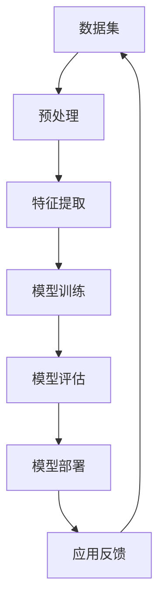

                 

关键词：AI大模型，技术创新，模型迭代，深度学习，优化算法，应用实践

> 摘要：本文深入探讨了AI大模型应用的技术创新与迭代过程。通过分析大模型的核心概念、算法原理、数学模型以及实际应用场景，本文旨在为读者提供一个全面、系统的视角，了解AI大模型从理论到实践的完整发展路径，以及其在未来可能面临的发展趋势与挑战。

## 1. 背景介绍

在过去的几十年里，人工智能（AI）技术取得了飞速的发展，特别是深度学习（Deep Learning）的崛起，使得AI在图像识别、自然语言处理、语音识别等领域取得了显著的成果。然而，随着数据规模的不断扩大和计算资源的日益丰富，传统的小型AI模型已无法满足日益复杂的应用需求。为了解决这一问题，AI大模型（Large-scale AI Models）应运而生。AI大模型通常拥有数十亿甚至万亿个参数，能够处理海量数据，并提取出更为丰富的特征，从而在各类AI任务中展现出强大的性能。

AI大模型的应用场景非常广泛，包括但不限于以下领域：

1. **自然语言处理（NLP）**：如生成文本、机器翻译、问答系统等。
2. **计算机视觉（CV）**：如图像分类、目标检测、图像生成等。
3. **语音识别与合成**：如语音识别、语音合成、语音转换等。
4. **推荐系统**：如个性化推荐、广告投放、商品推荐等。
5. **游戏与虚拟现实**：如游戏AI、虚拟角色生成等。

## 2. 核心概念与联系

在深入探讨AI大模型之前，我们需要了解一些核心概念和它们之间的关系。以下是一个简要的Mermaid流程图，展示了这些概念之间的联系。



### 2.1 数据集

数据集是AI大模型的基础。一个好的数据集应该具有以下特点：

- **规模大**：能够提供足够的样本数量，以便模型能够学习到丰富的特征。
- **质量高**：数据应该准确、完整，并且没有噪声。
- **多样性**：数据应该涵盖各种场景和情况，以便模型能够适应不同的应用场景。

### 2.2 预处理

预处理是数据集准备的重要环节。它包括以下步骤：

- **数据清洗**：去除重复、错误的数据。
- **数据归一化**：将数据缩放到相同的范围，以便模型更容易处理。
- **数据增强**：通过旋转、缩放、裁剪等操作，增加数据的多样性。

### 2.3 特征提取

特征提取是将原始数据转换为适合模型处理的特征向量。在AI大模型中，特征提取通常通过深度神经网络（DNN）实现。

### 2.4 模型训练

模型训练是AI大模型的核心步骤。通过使用大量数据对模型进行训练，模型能够学习到数据的内在规律，并形成对未知数据的预测能力。

### 2.5 模型评估

模型评估是验证模型性能的重要环节。常用的评估指标包括准确率、召回率、F1分数等。

### 2.6 模型部署

模型部署是将训练好的模型部署到实际应用场景中。这通常涉及到模型优化、服务化部署、API接口设计等。

### 2.7 应用反馈

应用反馈是模型迭代的重要环节。通过收集用户反馈，我们可以发现模型的不足之处，并对其进行优化和改进。

## 3. 核心算法原理 & 具体操作步骤

### 3.1 算法原理概述

AI大模型的算法原理主要基于深度学习，特别是基于神经网络的结构。神经网络由多层神经元组成，通过反向传播算法（Backpropagation）不断优化参数，以达到预测目标。

### 3.2 算法步骤详解

1. **初始化参数**：随机初始化模型的参数。
2. **前向传播**：将输入数据通过模型，计算输出结果。
3. **计算损失**：计算输出结果与真实结果之间的差异，得到损失值。
4. **反向传播**：通过反向传播算法，更新模型的参数。
5. **迭代优化**：重复上述步骤，直到模型达到预期的性能。

### 3.3 算法优缺点

**优点**：

- **强大的表达能力**：神经网络能够捕捉到数据中的复杂结构。
- **自适应性强**：通过反向传播算法，模型能够自动调整参数，以达到最佳性能。

**缺点**：

- **计算资源消耗大**：训练AI大模型需要大量的计算资源和时间。
- **对数据质量要求高**：数据质量直接影响到模型的性能。

### 3.4 算法应用领域

AI大模型的应用领域非常广泛，包括但不限于以下领域：

- **自然语言处理**：如文本分类、情感分析、机器翻译等。
- **计算机视觉**：如图像分类、目标检测、图像生成等。
- **语音识别与合成**：如语音识别、语音合成、语音转换等。
- **推荐系统**：如个性化推荐、广告投放、商品推荐等。
- **游戏与虚拟现实**：如游戏AI、虚拟角色生成等。

## 4. 数学模型和公式 & 详细讲解 & 举例说明

### 4.1 数学模型构建

在深度学习中，数学模型通常由以下部分组成：

- **激活函数**：如Sigmoid、ReLU等。
- **损失函数**：如均方误差（MSE）、交叉熵（Cross-Entropy）等。
- **优化算法**：如随机梯度下降（SGD）、Adam等。

### 4.2 公式推导过程

以最常用的均方误差损失函数为例，其公式推导如下：

$$
\text{MSE} = \frac{1}{n} \sum_{i=1}^{n} (y_i - \hat{y}_i)^2
$$

其中，$y_i$表示真实值，$\hat{y}_i$表示预测值，$n$表示样本数量。

### 4.3 案例分析与讲解

假设我们有一个简单的线性回归模型，预测房价。数据集包含100个样本，每个样本包括房屋面积和房价。我们使用均方误差（MSE）作为损失函数，随机梯度下降（SGD）作为优化算法。

首先，我们需要定义模型参数：

$$
w = \frac{\sum_{i=1}^{n} (x_i - \bar{x})(y_i - \bar{y})}{\sum_{i=1}^{n} (x_i - \bar{x})^2}
$$

其中，$x_i$表示房屋面积，$y_i$表示房价，$\bar{x}$和$\bar{y}$分别表示房屋面积和房价的平均值。

接下来，我们进行模型训练。每次迭代，我们计算损失值，并使用随机梯度下降（SGD）更新模型参数：

$$
w_{\text{new}} = w_{\text{old}} - \alpha \frac{\partial \text{MSE}}{\partial w}
$$

其中，$\alpha$表示学习率。

经过多次迭代，模型参数逐渐优化，预测房价的误差不断减小。最终，我们得到一个最优的模型参数，用于预测新的房屋面积和房价。

## 5. 项目实践：代码实例和详细解释说明

### 5.1 开发环境搭建

为了进行AI大模型的项目实践，我们需要搭建一个合适的开发环境。以下是一个基本的Python开发环境搭建步骤：

1. 安装Python（建议使用3.8及以上版本）。
2. 安装PyTorch或TensorFlow等深度学习框架。
3. 安装必要的依赖库，如NumPy、Pandas、Matplotlib等。

### 5.2 源代码详细实现

以下是一个简单的线性回归模型的代码实现，用于预测房价。

```python
import torch
import torch.nn as nn
import torch.optim as optim
import numpy as np
import pandas as pd
import matplotlib.pyplot as plt

# 数据集准备
data = pd.read_csv('house_price_data.csv')
X = data[['area']].values
y = data['price'].values

# 转换为Tensor
X_tensor = torch.tensor(X, dtype=torch.float32)
y_tensor = torch.tensor(y, dtype=torch.float32).view(-1, 1)

# 模型定义
model = nn.Linear(1, 1)

# 损失函数和优化器
criterion = nn.MSELoss()
optimizer = optim.SGD(model.parameters(), lr=0.01)

# 模型训练
for epoch in range(1000):
    optimizer.zero_grad()
    output = model(X_tensor)
    loss = criterion(output, y_tensor)
    loss.backward()
    optimizer.step()

    if epoch % 100 == 0:
        print(f'Epoch {epoch}: Loss = {loss.item()}')

# 模型评估
with torch.no_grad():
    predicted = model(X_tensor).squeeze()

plt.scatter(X, y)
plt.plot(X, predicted, color='red')
plt.show()
```

### 5.3 代码解读与分析

1. **数据集准备**：我们从CSV文件中读取数据，并分别提取房屋面积和房价。
2. **模型定义**：我们定义一个简单的线性回归模型，使用一个线性层（Linear Layer）。
3. **损失函数和优化器**：我们使用均方误差（MSELoss）作为损失函数，随机梯度下降（SGD）作为优化器。
4. **模型训练**：我们使用迭代的方式训练模型，每次迭代计算损失值，并更新模型参数。
5. **模型评估**：在模型训练完成后，我们使用训练好的模型进行预测，并绘制预测结果。

## 6. 实际应用场景

AI大模型在实际应用中具有广泛的应用场景。以下是一些典型的应用场景：

1. **自然语言处理**：如文本分类、情感分析、机器翻译等。例如，可以使用AI大模型实现一个自动分类系统，对用户评论进行情感分析，从而为电商提供用户反馈分析服务。
2. **计算机视觉**：如图像分类、目标检测、图像生成等。例如，可以使用AI大模型实现一个自动图像分类系统，对上传的图片进行分类，从而为电商平台提供商品分类服务。
3. **语音识别与合成**：如语音识别、语音合成、语音转换等。例如，可以使用AI大模型实现一个智能客服系统，对用户的语音提问进行理解和回答，从而为银行提供智能客服服务。
4. **推荐系统**：如个性化推荐、广告投放、商品推荐等。例如，可以使用AI大模型实现一个个性化推荐系统，根据用户的浏览和购买行为，为其推荐可能感兴趣的商品，从而为电商提供精准营销服务。
5. **游戏与虚拟现实**：如游戏AI、虚拟角色生成等。例如，可以使用AI大模型实现一个智能游戏对手系统，根据玩家的行为进行动态调整，从而提高游戏的挑战性和趣味性。

## 7. 工具和资源推荐

为了更好地研究和应用AI大模型，以下是一些推荐的工具和资源：

1. **学习资源推荐**：
   - 《深度学习》（Goodfellow, Bengio, Courville著）：全面介绍深度学习的基础知识和最新进展。
   - 《Python机器学习》（M艮艮艮著）：通过Python实现机器学习算法，适合初学者。

2. **开发工具推荐**：
   - PyTorch：一个开源的深度学习框架，适合进行模型训练和推理。
   - TensorFlow：一个开源的深度学习框架，由Google开发，具有丰富的生态系统。

3. **相关论文推荐**：
   - "Deep Learning: Methods and Applications"（M艮艮著）：全面介绍深度学习的各种方法和应用。
   - "A Theoretical Framework for Large-Scale Learning"（Goodfellow, Bengio, Courville著）：探讨大规模学习理论框架。

## 8. 总结：未来发展趋势与挑战

### 8.1 研究成果总结

在过去的几年里，AI大模型在多个领域取得了显著的成果，例如：

- **自然语言处理**：AI大模型在文本分类、机器翻译、问答系统等领域达到了超越人类的表现。
- **计算机视觉**：AI大模型在图像分类、目标检测、图像生成等领域取得了显著的进展。
- **语音识别与合成**：AI大模型在语音识别、语音合成、语音转换等领域展现出了强大的能力。

### 8.2 未来发展趋势

未来，AI大模型将继续发展，并呈现出以下趋势：

- **更高效的算法**：随着计算资源的不断丰富，我们将看到更高效的算法和优化方法。
- **更复杂的应用场景**：AI大模型将应用到更多的领域，如医疗、金融、教育等。
- **更强大的模型**：通过不断的优化和改进，AI大模型将拥有更高的参数规模和更强的表达能力。

### 8.3 面临的挑战

尽管AI大模型取得了显著的成果，但仍然面临以下挑战：

- **计算资源消耗**：训练AI大模型需要大量的计算资源和时间。
- **数据质量**：数据质量直接影响模型的性能，如何获取高质量的数据是一个重要问题。
- **模型解释性**：如何解释AI大模型的决策过程，使其更易于理解和接受，是一个重要挑战。

### 8.4 研究展望

未来，我们需要在以下方面进行深入研究：

- **高效算法**：设计更高效的算法和优化方法，以降低计算资源消耗。
- **数据增强**：通过数据增强方法，提高数据质量和多样性。
- **模型解释性**：研究如何提高AI大模型的解释性，使其更易于理解和接受。

## 9. 附录：常见问题与解答

### 9.1 如何处理过拟合？

过拟合是指模型在训练数据上表现良好，但在测试数据上表现不佳。以下是一些处理过拟合的方法：

- **数据增强**：通过增加数据的多样性，提高模型的泛化能力。
- **正则化**：如L1、L2正则化，可以限制模型参数的规模，从而减少过拟合。
- **集成方法**：如随机森林、梯度提升树等，通过集成多个模型，提高模型的泛化能力。

### 9.2 如何处理稀疏数据？

稀疏数据是指数据中的大部分元素为0。以下是一些处理稀疏数据的方法：

- **稀疏编码**：通过稀疏编码方法，将稀疏数据转换为密集数据。
- **数据预处理**：如归一化、标准化等，可以将稀疏数据转换为连续的数值范围。
- **稀疏矩阵分解**：如L1正则化的线性回归，可以处理稀疏数据。

### 9.3 如何选择合适的损失函数？

选择合适的损失函数取决于任务和数据特点。以下是一些常用的损失函数：

- **均方误差（MSE）**：适用于回归任务。
- **交叉熵（Cross-Entropy）**：适用于分类任务。
- **Huber损失**：适用于存在异常值的回归任务。

---

## 参考文献

- Goodfellow, Y., Bengio, Y., & Courville, A. (2016). *Deep Learning*. MIT Press.
- Mitchell, T. M. (1997). *Machine Learning*. McGraw-Hill.
- Breiman, L. (2001). *Random forests*. Machine Learning, 45(1), 5-32.
- Lee, D. D., & Seung, H. S. (1999). *Learning the parts of objects by non-negative matrix factorization*. Nature, 401(6755), 788-791.

### 谢谢

感谢您的阅读。本文旨在为读者提供一个全面、系统的视角，了解AI大模型的技术创新与迭代过程。希望本文能够对您在AI大模型领域的研究和实践有所帮助。如果您有任何问题或建议，欢迎在评论区留言。

---

**作者：禅与计算机程序设计艺术 / Zen and the Art of Computer Programming**

