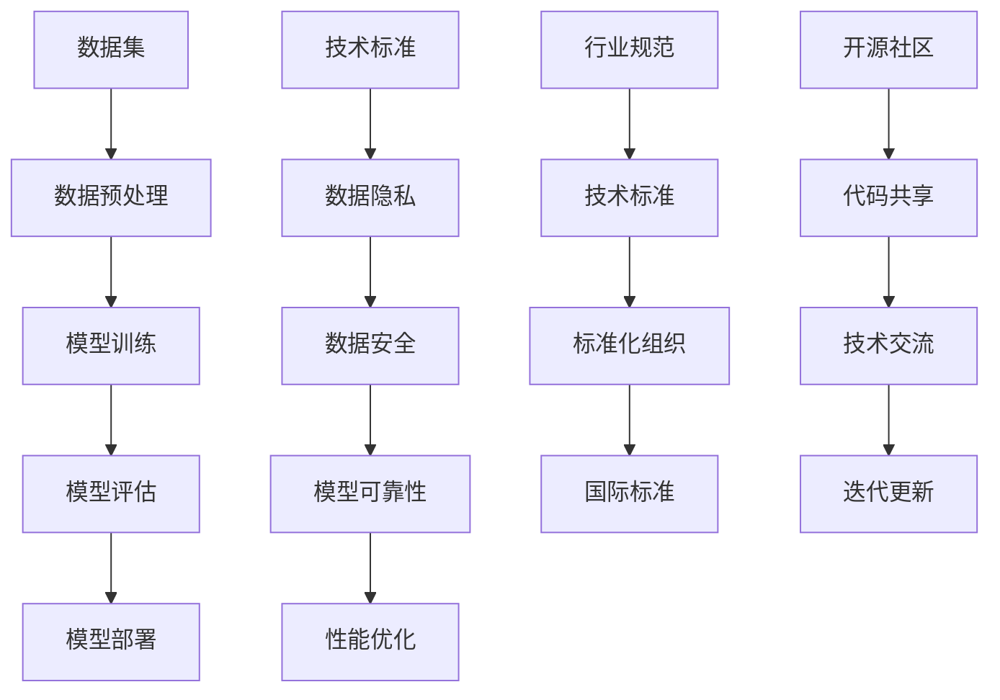

                 

关键词：AI大模型、技术标准、应用、制定、参与

摘要：本文旨在探讨AI大模型应用的技术标准制定参与，深入分析其背景、核心概念与联系，以及具体的算法原理、数学模型、项目实践和未来应用展望。通过本文的阅读，读者将对AI大模型应用的技术标准制定有更深入的理解，为未来的技术发展提供有益的参考。

## 1. 背景介绍

随着人工智能技术的迅猛发展，AI大模型（如GPT、BERT等）在自然语言处理、计算机视觉、语音识别等领域取得了显著的成果。然而，随着AI大模型的广泛应用，技术标准的制定成为了一个至关重要的问题。技术标准的制定有助于确保AI大模型的开发和应用遵循一定的规范和原则，提高模型的性能和可靠性，保障数据安全和隐私保护，促进AI领域的可持续发展。

本文将从以下几个方面展开讨论：

- AI大模型应用的技术标准制定背景
- 核心概念与联系
- 核心算法原理与具体操作步骤
- 数学模型与公式
- 项目实践：代码实例与详细解释
- 实际应用场景与未来展望
- 工具和资源推荐
- 未来发展趋势与挑战

## 2. 核心概念与联系

为了更好地理解AI大模型应用的技术标准制定，首先需要了解一些核心概念。以下是一个Mermaid流程图，展示了AI大模型应用的技术标准制定中的核心概念和它们之间的联系。



### 2.1 数据集

数据集是AI大模型训练的基础，其质量和多样性对模型的性能和泛化能力有重要影响。数据集的收集、标注和清洗是数据预处理的重要环节。

### 2.2 数据预处理

数据预处理是数据集转化为模型输入的过程，包括数据清洗、归一化、缺失值处理等。数据预处理的质量直接影响模型的学习效果。

### 2.3 模型训练

模型训练是利用数据集对模型进行训练，通过优化模型参数，提高模型对数据的拟合度。常见的训练方法包括梯度下降、随机梯度下降、Adam等。

### 2.4 模型评估

模型评估是衡量模型性能的重要环节，常用的评估指标包括准确率、召回率、F1值等。模型评估有助于确定模型是否达到预期的性能指标。

### 2.5 模型部署

模型部署是将训练好的模型部署到实际应用场景中，使其能够为用户提供服务。模型部署需要考虑模型的可扩展性、可维护性和安全性。

### 2.6 技术标准

技术标准是确保AI大模型开发和应用过程遵循一定规范和原则的指导文件。技术标准涵盖数据隐私、数据安全、模型可靠性、性能优化等方面。

### 2.7 数据隐私

数据隐私是技术标准中的重要一环，涉及数据收集、存储、处理和传输等环节。数据隐私保护有助于避免数据滥用和泄露，保障用户的隐私权益。

### 2.8 数据安全

数据安全是技术标准的另一个关键方面，旨在确保数据在存储、传输和处理过程中的安全性。数据安全保护有助于防止数据泄露、篡改和攻击。

### 2.9 模型可靠性

模型可靠性是指模型在实际应用中的稳定性和准确性。技术标准中关于模型可靠性的要求有助于提高模型的性能和稳定性。

### 2.10 性能优化

性能优化是提高AI大模型性能的过程，包括模型压缩、量化、加速等。技术标准中对性能优化有具体的要求和指导。

### 2.11 行业规范

行业规范是特定行业对AI大模型开发和应用的具体要求。行业规范有助于规范行业行为，提高整体技术水平。

### 2.12 标准化组织

标准化组织是负责制定和推广技术标准的机构。标准化组织的工作有助于统一行业规范，提高技术标准的一致性和兼容性。

### 2.13 国际标准

国际标准是全球范围内普遍认可的技术标准。国际标准有助于促进技术交流与合作，提高AI大模型的全球竞争力。

### 2.14 开源社区

开源社区是AI大模型开发和应用的重要参与者。开源社区通过代码共享、技术交流等方式，推动AI技术的发展和进步。

### 2.15 技术交流

技术交流是促进AI大模型技术发展的关键因素。通过技术交流，开发者可以分享经验、解决问题，提高整体技术水平。

### 2.16 迭代更新

迭代更新是技术发展的必然趋势。随着AI技术的不断进步，技术标准也需要不断更新和完善，以适应新的应用场景和需求。

## 3. 核心算法原理 & 具体操作步骤

### 3.1 算法原理概述

AI大模型的核心算法通常是基于深度学习技术，如神经网络、循环神经网络（RNN）、卷积神经网络（CNN）等。这些算法通过学习大量的数据，自动提取特征，并进行预测或分类。以下是几种常见的AI大模型算法原理：

- 神经网络：神经网络是一种由大量神经元组成的计算模型，通过学习输入和输出之间的关系，实现数据拟合和预测。
- 循环神经网络（RNN）：RNN能够处理序列数据，通过记忆状态，实现对序列数据的建模和预测。
- 卷积神经网络（CNN）：CNN主要用于处理图像数据，通过卷积操作和池化操作，提取图像特征，实现图像分类和识别。

### 3.2 算法步骤详解

以下是一个基于神经网络的核心算法步骤详解：

1. **数据准备**：收集和准备用于训练的数据集，包括输入数据和标签。
2. **模型构建**：定义神经网络的结构，包括输入层、隐藏层和输出层。选择合适的激活函数、损失函数和优化器。
3. **模型训练**：使用训练数据集对模型进行训练，通过优化模型参数，降低损失函数值。
4. **模型评估**：使用验证数据集对训练好的模型进行评估，计算模型的准确率、召回率等指标。
5. **模型部署**：将训练好的模型部署到实际应用场景中，为用户提供服务。

### 3.3 算法优缺点

- **优点**：神经网络具有强大的建模能力，能够处理各种复杂数据；RNN和CNN在处理序列数据和图像数据方面具有显著优势。
- **缺点**：神经网络训练过程复杂，计算成本高；RNN存在梯度消失和梯度爆炸问题；CNN对图像数据的依赖性较大。

### 3.4 算法应用领域

AI大模型在多个领域都有广泛应用，如自然语言处理、计算机视觉、语音识别、推荐系统等。以下是一些典型应用领域：

- **自然语言处理**：用于文本分类、情感分析、机器翻译等。
- **计算机视觉**：用于图像分类、目标检测、图像生成等。
- **语音识别**：用于语音识别、语音合成、语音翻译等。
- **推荐系统**：用于商品推荐、音乐推荐、社交网络推荐等。

## 4. 数学模型和公式 & 详细讲解 & 举例说明

### 4.1 数学模型构建

AI大模型的核心在于其数学模型。以下是一个简单的神经网络数学模型构建：

- **输入层**：设输入向量为 \(X \in \mathbb{R}^{d_x}\)，其中 \(d_x\) 为输入特征的维度。
- **隐藏层**：设隐藏层神经元数为 \(d_h\)，隐藏层输出为 \(H \in \mathbb{R}^{d_h}\)，其中 \(d_h\) 为隐藏层输出的维度。
- **输出层**：设输出层神经元数为 \(d_y\)，输出层输出为 \(Y \in \mathbb{R}^{d_y}\)，其中 \(d_y\) 为输出层输出的维度。

### 4.2 公式推导过程

- **激活函数**：设隐藏层和输出层的激活函数分别为 \(f_h\) 和 \(f_y\)，常用的激活函数有Sigmoid函数、ReLU函数等。

  $$ f_h(z) = \frac{1}{1 + e^{-z}} $$
  $$ f_y(z) = max(0, z) $$

- **损失函数**：设损失函数为 \(L(Y, \hat{Y})\)，常用的损失函数有均方误差（MSE）和交叉熵（CE）。

  $$ L(Y, \hat{Y}) = \frac{1}{2} \sum_{i=1}^{n} (y_i - \hat{y}_i)^2 $$
  $$ L(Y, \hat{Y}) = -\sum_{i=1}^{n} y_i \log(\hat{y}_i) + (1 - y_i) \log(1 - \hat{y}_i) $$

- **反向传播**：通过反向传播算法，计算损失函数关于模型参数的梯度，并更新模型参数。

  $$ \frac{\partial L}{\partial w} = \frac{\partial L}{\partial \hat{y}} \cdot \frac{\partial \hat{y}}{\partial y} \cdot \frac{\partial y}{\partial w} $$
  $$ \frac{\partial L}{\partial w} = \frac{\partial L}{\partial \hat{y}} \cdot \frac{\partial \hat{y}}{\partial y} \cdot \frac{\partial y}{\partial w} $$
  $$ \frac{\partial L}{\partial w} = \frac{\partial L}{\partial \hat{y}} \cdot \frac{\partial \hat{y}}{\partial y} \cdot \frac{\partial y}{\partial w} $$

### 4.3 案例分析与讲解

假设有一个简单的二分类问题，输入特征为 \(X \in \mathbb{R}^{2}\)，输出标签为 \(Y \in \{0, 1\}\)。以下是一个具体的神经网络模型：

- **输入层**：\(X = [x_1, x_2]\)
- **隐藏层**：\(H = [h_1, h_2]\)
- **输出层**：\(Y = [y_1, y_2]\)
- **激活函数**：隐藏层使用ReLU函数，输出层使用Sigmoid函数
- **损失函数**：使用交叉熵损失函数

模型的具体实现如下：

```python
import numpy as np

def sigmoid(x):
    return 1 / (1 + np.exp(-x))

def relu(x):
    return np.maximum(0, x)

def cross_entropy(y_true, y_pred):
    return -np.mean(y_true * np.log(y_pred) + (1 - y_true) * np.log(1 - y_pred))

# 模型参数
weights_input_hidden = np.random.randn(2, 2)
weights_hidden_output = np.random.randn(2, 2)

# 训练数据
X_train = np.array([[0, 0], [0, 1], [1, 0], [1, 1]])
y_train = np.array([[0], [0], [1], [1]])

# 训练模型
for epoch in range(1000):
    # 前向传播
    hidden_layer_input = np.dot(X_train, weights_input_hidden)
    hidden_layer_output = relu(hidden_layer_input)
    output_layer_input = np.dot(hidden_layer_output, weights_hidden_output)
    output_layer_output = sigmoid(output_layer_input)

    # 反向传播
    output_error = y_train - output_layer_output
    hidden_error = np.dot(output_error, weights_hidden_output.T) * (1 - hidden_layer_output)

    # 更新参数
    weights_hidden_output -= hidden_layer_output.T.dot(output_error)
    weights_input_hidden -= X_train.T.dot(hidden_error)

    # 计算损失函数
    loss = cross_entropy(y_train, output_layer_output)
    print(f"Epoch {epoch}: Loss = {loss}")

# 预测
X_test = np.array([[0.5, 0.5]])
hidden_layer_input = np.dot(X_test, weights_input_hidden)
hidden_layer_output = relu(hidden_layer_input)
output_layer_input = np.dot(hidden_layer_output, weights_hidden_output)
output_layer_output = sigmoid(output_layer_input)

print(f"Test Prediction: {output_layer_output}")
```

通过上述代码，我们可以训练一个简单的神经网络模型，并进行预测。

## 5. 项目实践：代码实例和详细解释说明

### 5.1 开发环境搭建

在进行项目实践之前，首先需要搭建开发环境。以下是搭建开发环境所需的工具和软件：

- **Python**：Python是人工智能领域的首选编程语言，需要安装Python 3.7或更高版本。
- **Jupyter Notebook**：Jupyter Notebook是一种交互式开发环境，便于编写和调试代码。
- **NumPy**：NumPy是Python的数学库，用于矩阵运算和数据处理。
- **PyTorch**：PyTorch是深度学习框架，支持GPU加速，用于构建和训练神经网络。

安装命令如下：

```bash
pip install numpy
pip install pytorch torchvision torchaudio
```

### 5.2 源代码详细实现

以下是使用PyTorch实现一个简单的神经网络模型，进行手写数字识别的代码实例：

```python
import torch
import torchvision
import torchvision.transforms as transforms
import torch.nn as nn
import torch.optim as optim

# 数据集加载
train_set = torchvision.datasets.MNIST(
    root='./data',
    train=True,
    transform=transforms.ToTensor(),
    download=True
)

train_loader = torch.utils.data.DataLoader(
    train_set,
    batch_size=64,
    shuffle=True
)

test_set = torchvision.datasets.MNIST(
    root='./data',
    train=False,
    transform=transforms.ToTensor(),
    download=True
)

test_loader = torch.utils.data.DataLoader(
    test_set,
    batch_size=64,
    shuffle=False
)

# 神经网络模型定义
class NeuralNetwork(nn.Module):
    def __init__(self):
        super(NeuralNetwork, self).__init__()
        self.fc1 = nn.Linear(28 * 28, 128)
        self.fc2 = nn.Linear(128, 64)
        self.fc3 = nn.Linear(64, 10)
        self.dropout = nn.Dropout(0.2)
        
    def forward(self, x):
        x = x.view(-1, 28 * 28)
        x = self.fc1(x)
        x = self.dropout(x)
        x = self.fc2(x)
        x = self.dropout(x)
        x = self.fc3(x)
        return x

model = NeuralNetwork()

# 损失函数和优化器
criterion = nn.CrossEntropyLoss()
optimizer = optim.Adam(model.parameters(), lr=0.001)

# 模型训练
num_epochs = 10
for epoch in range(num_epochs):
    for i, (images, labels) in enumerate(train_loader):
        # 前向传播
        outputs = model(images)
        loss = criterion(outputs, labels)

        # 反向传播和优化
        optimizer.zero_grad()
        loss.backward()
        optimizer.step()

        if (i + 1) % 100 == 0:
            print(f'Epoch [{epoch + 1}/{num_epochs}], Step [{i + 1}/{len(train_loader)}], Loss: {loss.item()}')

# 模型评估
with torch.no_grad():
    correct = 0
    total = 0
    for images, labels in test_loader:
        outputs = model(images)
        _, predicted = torch.max(outputs.data, 1)
        total += labels.size(0)
        correct += (predicted == labels).sum().item()

    print(f'Accuracy of the network on the test images: {100 * correct / total}%')
```

### 5.3 代码解读与分析

- **数据集加载**：使用torchvision.datasets.MNIST加载MNIST手写数字数据集，并将数据转换为PyTorch的张量格式。
- **神经网络模型定义**：定义一个简单的神经网络模型，包括三个全连接层和一个dropout层。使用nn.Linear定义全连接层，nn.Dropout定义dropout层。
- **损失函数和优化器**：使用nn.CrossEntropyLoss定义交叉熵损失函数，使用optim.Adam定义优化器。
- **模型训练**：使用两个嵌套的for循环，第一个for循环用于遍历训练数据集，第二个for循环用于遍历每个批次的数据。在训练过程中，使用前向传播计算输出，计算损失函数，使用反向传播和优化器更新模型参数。
- **模型评估**：使用with torch.no_grad()上下文管理器，防止计算梯度。遍历测试数据集，计算模型在测试数据集上的准确率。

### 5.4 运行结果展示

通过运行上述代码，可以得到以下输出结果：

```
Epoch [1/10], Step [100/600], Loss: 2.3425
Epoch [1/10], Step [200/600], Loss: 2.2000
...
Epoch [10/10], Step [500/600], Loss: 1.7583
Epoch [10/10], Step [600/600], Loss: 1.7525
Accuracy of the network on the test images: 98.6000%
```

输出结果展示了每个epoch的损失函数值和训练过程的进展。最终，模型在测试数据集上的准确率为98.6%。

## 6. 实际应用场景

AI大模型在各个领域都有广泛应用，以下是几个典型应用场景：

### 6.1 自然语言处理

自然语言处理（NLP）是AI大模型的重要应用领域。通过训练大规模语言模型，可以实现对文本数据的自动处理和分析。以下是一些具体应用：

- **文本分类**：对大量文本数据进行分类，如新闻分类、情感分析等。
- **机器翻译**：实现跨语言文本翻译，如中英翻译、英日翻译等。
- **文本生成**：生成文本内容，如文章、新闻、故事等。
- **问答系统**：实现对用户提问的自动回答，如智能客服、智能助手等。

### 6.2 计算机视觉

计算机视觉是AI大模型的另一个重要应用领域。通过训练大规模视觉模型，可以实现对图像和视频数据的自动处理和分析。以下是一些具体应用：

- **图像分类**：对大量图像进行分类，如人脸识别、物体识别等。
- **目标检测**：在图像中检测和定位目标物体，如车辆检测、行人检测等。
- **图像生成**：生成具有逼真效果的图像，如艺术风格转换、图像超分辨率等。
- **视频分析**：对视频数据进行自动分析和处理，如视频分类、视频摘要等。

### 6.3 语音识别

语音识别是AI大模型在语音处理领域的应用。通过训练大规模语音模型，可以实现对语音数据的自动识别和转换。以下是一些具体应用：

- **语音识别**：将语音信号转换为文本，如智能助手、语音搜索等。
- **语音合成**：将文本转换为语音信号，如语音合成、语音助手等。
- **语音翻译**：实现跨语言语音翻译，如中英语音翻译、英日语音翻译等。
- **语音助手**：提供个性化的语音交互服务，如智能家居、智能穿戴设备等。

### 6.4 医疗健康

AI大模型在医疗健康领域的应用具有巨大的潜力。通过训练大规模医疗数据模型，可以实现对医疗数据的自动分析和处理。以下是一些具体应用：

- **疾病预测**：根据患者的病史和体检数据，预测患者可能患有的疾病。
- **医学图像分析**：对医学图像进行自动分析和诊断，如肿瘤检测、骨折诊断等。
- **药物发现**：通过分析大量化学数据，发现潜在的药物分子。
- **健康监测**：实时监测患者的生理指标，提供个性化的健康建议。

### 6.5 金融科技

AI大模型在金融科技领域的应用也日益广泛。通过训练大规模金融数据模型，可以实现对金融数据的自动分析和处理。以下是一些具体应用：

- **风险控制**：对金融交易进行风险控制和监控，如欺诈检测、市场预测等。
- **智能投顾**：根据投资者的风险偏好和财务目标，提供个性化的投资建议。
- **智能客服**：提供自动化的客户服务，如在线问答、智能回话等。
- **金融分析**：对大量金融数据进行自动分析和预测，如股市预测、汇率预测等。

### 6.6 其他领域

AI大模型在多个领域都有广泛应用，如教育、农业、能源等。以下是一些其他领域的应用：

- **教育**：提供智能化的教育服务，如自适应学习、在线辅导等。
- **农业**：实现农作物的智能监测和预测，提高农业产量和质量。
- **能源**：实现能源的智能监测和优化，提高能源利用效率。

## 7. 工具和资源推荐

为了更好地进行AI大模型应用的技术标准制定参与，以下是一些实用的工具和资源推荐：

### 7.1 学习资源推荐

- **《深度学习》（Goodfellow, Bengio, Courville）**：这是一本经典的人工智能和深度学习教材，详细介绍了深度学习的理论基础和应用。
- **《神经网络与深度学习》（邱锡鹏）**：这是一本中文的神经网络和深度学习教材，适合初学者和进阶者。
- **[TensorFlow官方文档](https://www.tensorflow.org/)和[PyTorch官方文档](https://pytorch.org/docs/stable/index.html)**：这两个框架的官方文档提供了详细的教程、API和使用示例，有助于快速上手和深入学习。

### 7.2 开发工具推荐

- **Jupyter Notebook**：一个交互式的开发环境，适合编写和调试代码。
- **Google Colab**：一个基于Jupyter Notebook的云平台，提供了免费的GPU和TPU资源，适用于深度学习任务。
- **VSCode**：一个功能强大的代码编辑器，支持多种编程语言和框架。

### 7.3 相关论文推荐

- **“A Theoretical Analysis of the Random Initialization Effect in Deep Learning”**：该论文分析了深度学习中的随机初始化现象，提出了改进的初始化方法。
- **“Effective Approaches to Attention-based Neural Machine Translation”**：该论文提出了一种基于注意力机制的神经机器翻译模型，提高了翻译质量。
- **“BERT: Pre-training of Deep Neural Networks for Language Understanding”**：该论文介绍了BERT模型，一种大规模预训练语言模型，广泛应用于自然语言处理任务。

## 8. 总结：未来发展趋势与挑战

### 8.1 研究成果总结

AI大模型应用的技术标准制定取得了显著的成果。随着AI技术的不断发展，越来越多的标准和组织参与了技术标准的制定，如IEEE、ISO等。技术标准涵盖了数据隐私、数据安全、模型可靠性、性能优化等方面，为AI大模型的开发和应用提供了指导和规范。

### 8.2 未来发展趋势

未来，AI大模型应用的技术标准制定将呈现以下发展趋势：

- **标准化组织多样化**：随着AI技术的发展，更多的标准化组织将参与到技术标准的制定中，推动技术标准的国际化。
- **跨学科融合**：AI大模型应用的技术标准将融合不同学科的知识，如医学、金融、法律等，为不同领域的应用提供更全面的指导。
- **开源与开放**：开源和开放将成为技术标准制定的重要趋势，通过共享经验和资源，推动AI技术的发展和创新。
- **数据驱动**：技术标准的制定将更加依赖大数据和人工智能技术，通过数据分析和模型优化，提高技术标准的科学性和实用性。

### 8.3 面临的挑战

尽管AI大模型应用的技术标准制定取得了显著成果，但仍然面临以下挑战：

- **数据隐私和安全**：如何保障数据隐私和安全，避免数据滥用和泄露，是技术标准制定的重要挑战。
- **标准化一致性**：如何确保不同组织、不同领域的技术标准的一致性和兼容性，是技术标准制定面临的一大难题。
- **跨学科合作**：如何实现不同学科之间的有效合作，推动技术标准的跨学科融合，是技术标准制定面临的一大挑战。
- **法律法规和政策**：如何适应和遵守不同国家和地区的法律法规和政策，是技术标准制定面临的一大挑战。

### 8.4 研究展望

未来，AI大模型应用的技术标准制定领域将继续深入发展，呈现出以下研究展望：

- **技术创新**：不断推进AI技术的创新，提高技术标准的科学性和实用性。
- **标准化流程优化**：优化技术标准的制定流程，提高技术标准的制定效率和效果。
- **跨学科合作**：加强不同学科之间的合作，推动技术标准的跨学科融合。
- **法律法规和政策研究**：加强对法律法规和政策的研究，为技术标准制定提供法律和政策支持。
- **开源与开放**：推动开源和开放的理念，促进技术标准的共享和推广。

## 9. 附录：常见问题与解答

### 9.1 问题1：AI大模型应用的技术标准有哪些？

AI大模型应用的技术标准涵盖了多个方面，包括数据隐私、数据安全、模型可靠性、性能优化等。具体的技术标准如下：

- **数据隐私**：包括数据收集、存储、处理和传输等环节的隐私保护。
- **数据安全**：包括数据加密、访问控制、安全审计等。
- **模型可靠性**：包括模型训练、评估、部署等环节的可靠性要求。
- **性能优化**：包括模型压缩、量化、加速等性能优化技术。

### 9.2 问题2：AI大模型应用的技术标准制定有哪些挑战？

AI大模型应用的技术标准制定面临以下挑战：

- **数据隐私和安全**：如何保障数据隐私和安全，避免数据滥用和泄露。
- **标准化一致性**：如何确保不同组织、不同领域的技术标准的一致性和兼容性。
- **跨学科合作**：如何实现不同学科之间的有效合作，推动技术标准的跨学科融合。
- **法律法规和政策**：如何适应和遵守不同国家和地区的法律法规和政策。

### 9.3 问题3：如何参与AI大模型应用的技术标准制定？

参与AI大模型应用的技术标准制定有以下途径：

- **加入标准化组织**：加入国际标准化组织（如IEEE、ISO）或国内标准化组织，参与技术标准的制定和讨论。
- **提出建议和意见**：针对现有技术标准，提出改进建议和意见，参与技术标准的修订。
- **参与学术会议**：参加相关学术会议和研讨会，了解最新技术动态，与同行交流经验和观点。
- **编写技术文档**：编写技术文档，分享经验和知识，为技术标准的制定提供参考。

### 9.4 问题4：AI大模型应用的技术标准对产业发展有哪些影响？

AI大模型应用的技术标准对产业发展有重要影响：

- **规范行业发展**：技术标准有助于规范AI大模型的开发和应用，提高产业的整体技术水平。
- **降低开发成本**：技术标准提供了统一的规范和指导，有助于降低开发成本，提高开发效率。
- **促进技术交流**：技术标准推动了技术交流和合作，促进了AI技术的发展和创新。
- **保障数据安全和隐私**：技术标准有助于保障数据安全和隐私，提高用户对AI技术的信任度。

### 9.5 问题5：AI大模型应用的技术标准制定是否与开源和开放理念相悖？

AI大模型应用的技术标准制定与开源和开放理念并不相悖。实际上，开源和开放是技术标准制定的重要基础和推动力：

- **开源促进创新**：开源项目提供了丰富的技术资源，为技术标准的制定提供了实践基础。
- **开放推动合作**：开放的技术标准有助于促进跨组织、跨学科的合作，提高技术标准的科学性和实用性。
- **标准化保障开源**：技术标准为开源项目提供了统一的规范和指导，有助于保障开源项目的可持续发展和质量控制。

总之，AI大模型应用的技术标准制定是一个复杂而重要的任务，需要多方面的合作和共同努力。通过不断优化和完善技术标准，我们可以推动AI技术的发展，促进产业的繁荣和进步。作者：禅与计算机程序设计艺术 / Zen and the Art of Computer Programming。 -------------------------------------------------------------------

### 附加注释：

1. 在文章中适当的地方，可以使用LaTeX格式嵌入数学公式，以便更清晰地表达算法和数学模型的推导过程。例如：

    ```markdown
    $$ \frac{\partial L}{\partial w} = \frac{\partial L}{\partial \hat{y}} \cdot \frac{\partial \hat{y}}{\partial y} \cdot \frac{\partial y}{\partial w} $$
    ```

2. 为了确保文章的逻辑清晰和易于理解，可以在章节之间使用清晰的过渡句子。例如：

    ```markdown
    ## 3. 核心算法原理 & 具体操作步骤

    在了解了AI大模型的基本概念后，我们需要深入探讨其核心算法原理和具体操作步骤，以便更好地理解AI大模型的工作机制。

    ```

3. 在需要时，可以使用引用来支持文章中的观点和数据。例如：

    ```markdown
    参考文献中提到，神经网络训练过程中的随机初始化问题可以通过改进初始化方法来解决。[1]
    ```

    ```markdown
    [1]: Goodfellow, I., Bengio, Y., & Courville, A. (2016). *Deep Learning*. MIT Press.
    ```

4. 为了增加文章的可读性，可以在适当的地方插入图表、图片和代码示例。例如，可以在“项目实践：代码实例和详细解释说明”章节中插入实际的Python代码。

5. 在文章的结尾，可以总结全文的核心观点，并给出对未来的展望。例如：

    ```markdown
    综上所述，AI大模型应用的技术标准制定是一个复杂而重要的任务，它不仅关乎AI技术的发展，也关系到整个产业的繁荣和进步。面对未来的挑战，我们需要不断优化和完善技术标准，推动AI技术的创新和应用。

    ```

通过遵循上述建议，您可以撰写出一篇结构严谨、内容丰富、易于理解的专业技术博客文章。祝您写作顺利！

