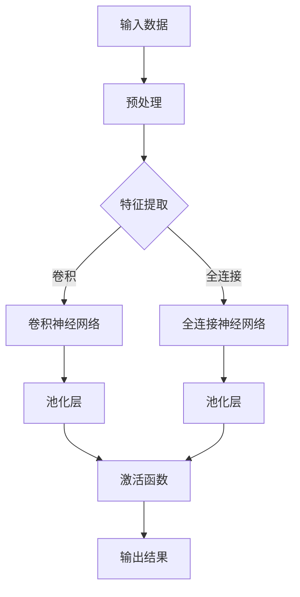
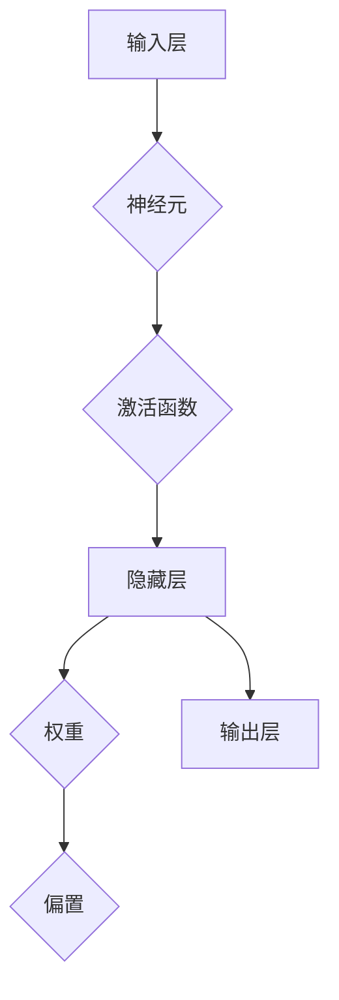
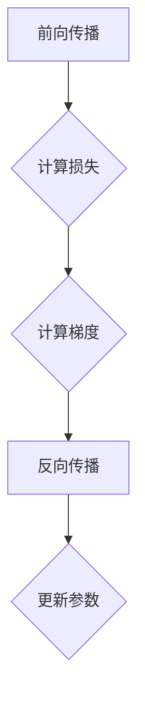

                 

关键词：AI大模型、应用技术、演进路径、算法原理、数学模型、项目实践、实际应用场景、未来展望

> 摘要：本文将深入探讨AI大模型应用的技术演进路径，从背景介绍到核心算法原理，再到数学模型和公式、项目实践以及实际应用场景，全面分析大模型技术的发展现状和未来趋势，旨在为读者提供一份全面的技术参考。

## 1. 背景介绍

随着人工智能技术的飞速发展，AI大模型已经成为当前科技领域的热点话题。大模型，顾名思义，是指具有巨大参数量和复杂结构的神经网络模型。这类模型能够在各种复杂任务中表现出强大的性能，例如图像识别、自然语言处理和语音识别等。

大模型的兴起可以追溯到深度学习技术的迅猛发展。深度学习作为一种机器学习方法，通过多层神经网络对大量数据进行训练，从而实现高度自动化的特征提取和任务分类。随着计算能力的提升和数据量的爆炸式增长，大模型逐渐成为解决复杂任务的关键技术。

从2012年AlexNet在ImageNet竞赛中取得突破性成绩以来，深度学习技术取得了令人瞩目的进展。特别是GAN（生成对抗网络）、Transformer等新型架构的提出，使得大模型在各个领域取得了显著的成果。这一系列技术的演进，不仅推动了AI大模型的发展，也为实际应用带来了前所未有的可能。

## 2. 核心概念与联系

在深入探讨AI大模型之前，我们需要了解一些核心概念和它们之间的联系。以下是几个关键概念及其Mermaid流程图表示：

### 2.1. 深度学习

深度学习是一种基于人工神经网络的机器学习技术，通过构建多层神经网络，实现对复杂数据的自动特征提取和分类。以下是深度学习的Mermaid流程图：



### 2.2. 神经网络

神经网络是深度学习的基础架构，由大量神经元通过权值和偏置连接而成。以下是神经网络的Mermaid流程图：



### 2.3. 损失函数

损失函数是评估模型预测结果与真实值之间差异的关键指标。以下是几种常见的损失函数及其Mermaid流程图：

```mermaid
graph TD
A[预测值] --> B{真实值}
B --> C{平方误差}
C --> D[交叉熵}
D --> E{均方误差}
```

### 2.4. 反向传播

反向传播是一种用于训练神经网络的优化算法，通过计算损失函数关于模型参数的梯度，更新模型参数以减小损失。以下是反向传播的Mermaid流程图：



## 3. 核心算法原理 & 具体操作步骤

### 3.1. 算法原理概述

AI大模型的核心算法主要包括神经网络架构设计、训练过程和推理过程。以下是这三个核心步骤的简要概述：

#### 3.1.1. 神经网络架构设计

神经网络架构设计包括网络层数、神经元数量、激活函数和连接方式等。常见的神经网络架构有卷积神经网络（CNN）、循环神经网络（RNN）和Transformer等。

#### 3.1.2. 训练过程

训练过程是指通过大量样本数据，利用反向传播算法和优化器（如Adam、SGD等）调整模型参数，使模型在训练数据上达到最优性能。

#### 3.1.3. 推理过程

推理过程是指将新的输入数据输入到训练好的模型中，通过模型参数计算输出结果。这个过程通常比训练过程更快，因为不需要进行大量的梯度计算和参数更新。

### 3.2. 算法步骤详解

以下是AI大模型算法的具体操作步骤：

#### 3.2.1. 神经网络架构设计

1. 确定网络层数和神经元数量。
2. 选择适当的激活函数（如ReLU、Sigmoid、Tanh等）。
3. 设计网络连接方式（如全连接、卷积、循环等）。

#### 3.2.2. 训练过程

1. 预处理数据，包括数据清洗、归一化、分批等。
2. 初始化模型参数，如权重和偏置。
3. 进行前向传播，计算输出结果。
4. 计算损失函数，如交叉熵、均方误差等。
5. 进行反向传播，计算梯度。
6. 更新模型参数。
7. 重复步骤3-6，直到达到训练目标或训练次数。

#### 3.2.3. 推理过程

1. 预处理输入数据。
2. 将输入数据输入到训练好的模型中。
3. 计算输出结果。
4. 分析输出结果，如分类结果、概率分布等。

### 3.3. 算法优缺点

#### 优点：

1. 强大的特征提取能力，能够在大量数据上进行自动特征学习。
2. 灵活的应用场景，可以处理各种复杂任务。
3. 高度的并行化，可以利用GPU等硬件加速训练过程。

#### 缺点：

1. 需要大量的数据和计算资源，训练成本较高。
2. 对超参数调优敏感，需要大量的实验和调试。
3. 模型解释性较差，难以理解模型的内部机制。

### 3.4. 算法应用领域

AI大模型在各个领域都取得了显著的成果，以下是一些典型的应用领域：

1. 图像识别：如人脸识别、图像分类等。
2. 自然语言处理：如机器翻译、文本生成等。
3. 语音识别：如语音识别、语音合成等。
4. 推荐系统：如商品推荐、音乐推荐等。
5. 游戏AI：如棋类游戏、围棋等。

## 4. 数学模型和公式 & 详细讲解 & 举例说明

### 4.1. 数学模型构建

AI大模型的核心是神经网络，其数学模型主要包括以下几个部分：

#### 4.1.1. 神经元模型

神经元模型是神经网络的基本单元，其数学模型可以表示为：

$$
y = \sigma(\sum_{i=1}^{n} w_i x_i + b)
$$

其中，$y$ 表示输出值，$\sigma$ 表示激活函数（如ReLU、Sigmoid等），$w_i$ 表示权重，$x_i$ 表示输入值，$b$ 表示偏置。

#### 4.1.2. 损失函数

损失函数用于评估模型预测结果与真实值之间的差异，常见的损失函数包括均方误差（MSE）和交叉熵（Cross-Entropy）等：

$$
MSE = \frac{1}{2} \sum_{i=1}^{n} (y_i - \hat{y}_i)^2
$$

$$
CE = -\sum_{i=1}^{n} y_i \log(\hat{y}_i)
$$

其中，$y_i$ 表示真实值，$\hat{y}_i$ 表示预测值。

#### 4.1.3. 反向传播

反向传播是一种用于训练神经网络的优化算法，其核心思想是计算损失函数关于模型参数的梯度，并利用梯度更新模型参数。以下是反向传播的数学公式：

$$
\frac{\partial J}{\partial w_i} = \sum_{j=1}^{m} \frac{\partial J}{\partial \hat{y}_j} \frac{\partial \hat{y}_j}{\partial z_j} \frac{\partial z_j}{\partial w_i}
$$

$$
\frac{\partial J}{\partial b} = \sum_{j=1}^{m} \frac{\partial J}{\partial \hat{y}_j} \frac{\partial \hat{y}_j}{\partial z_j}
$$

其中，$J$ 表示损失函数，$w_i$ 和 $b$ 分别表示权重和偏置。

### 4.2. 公式推导过程

以下是神经网络训练过程中的几个关键步骤的公式推导：

#### 4.2.1. 前向传播

假设有一个两层神经网络，输入为 $x_1, x_2, ..., x_n$，隐藏层输出为 $h_1, h_2, ..., h_m$，输出层输出为 $y_1, y_2, ..., y_k$。则前向传播的公式推导如下：

$$
z_j = \sum_{i=1}^{n} w_{ji} x_i + b_j \quad (j=1,2,...,m)
$$

$$
h_j = \sigma(z_j) \quad (j=1,2,...,m)
$$

$$
\hat{y}_i = \sum_{j=1}^{m} w_{ij} h_j + b_i \quad (i=1,2,...,k)
$$

$$
y_i = \sigma(\hat{y}_i) \quad (i=1,2,...,k)
$$

#### 4.2.2. 损失函数计算

以均方误差（MSE）为例，损失函数的计算公式如下：

$$
J = \frac{1}{2} \sum_{i=1}^{k} (y_i - \hat{y}_i)^2
$$

#### 4.2.3. 反向传播

以权重 $w_{ij}$ 的梯度为例，梯度计算公式如下：

$$
\frac{\partial J}{\partial w_{ij}} = \frac{\partial J}{\partial \hat{y}_i} \frac{\partial \hat{y}_i}{\partial w_{ij}}
$$

$$
\frac{\partial J}{\partial \hat{y}_i} = (y_i - \hat{y}_i) \sigma'(\hat{y}_i)
$$

$$
\frac{\partial \hat{y}_i}{\partial w_{ij}} = h_j
$$

因此，权重 $w_{ij}$ 的梯度为：

$$
\frac{\partial J}{\partial w_{ij}} = (y_i - \hat{y}_i) \sigma'(\hat{y}_i) h_j
$$

### 4.3. 案例分析与讲解

以下是一个简单的神经网络训练案例，用于实现一个二元分类任务。

#### 4.3.1. 数据准备

假设我们有一个包含100个样本的数据集，每个样本有2个特征，即 $x_1, x_2$。标签为0或1，即 $y$。

#### 4.3.2. 神经网络架构设计

我们设计一个包含一个隐藏层的神经网络，隐藏层有10个神经元，激活函数为ReLU。

#### 4.3.3. 训练过程

1. 初始化模型参数，如权重和偏置。
2. 预处理数据，包括归一化和分批。
3. 进行前向传播，计算输出结果。
4. 计算损失函数，如均方误差。
5. 进行反向传播，计算梯度。
6. 更新模型参数。
7. 重复步骤3-6，直到达到训练目标或训练次数。

#### 4.3.4. 模型评估

1. 预处理测试数据。
2. 将测试数据输入到训练好的模型中。
3. 计算输出结果。
4. 计算测试集的准确率。

## 5. 项目实践：代码实例和详细解释说明

### 5.1. 开发环境搭建

为了实现AI大模型的项目实践，我们需要搭建一个适合开发和训练的Python环境。以下是搭建开发环境的步骤：

1. 安装Python（建议使用3.7及以上版本）。
2. 安装TensorFlow或PyTorch等深度学习框架。
3. 安装必要的依赖库，如NumPy、Matplotlib等。

### 5.2. 源代码详细实现

以下是一个简单的AI大模型项目示例，使用PyTorch框架实现一个二元分类任务：

```python
import torch
import torch.nn as nn
import torch.optim as optim

# 数据准备
x_train = torch.randn(100, 2)
y_train = torch.randint(0, 2, (100,))
x_test = torch.randn(20, 2)
y_test = torch.randint(0, 2, (20,))

# 神经网络架构设计
class SimpleNet(nn.Module):
    def __init__(self):
        super(SimpleNet, self).__init__()
        self.fc1 = nn.Linear(2, 10)
        self.fc2 = nn.Linear(10, 1)
        self.relu = nn.ReLU()

    def forward(self, x):
        x = self.fc1(x)
        x = self.relu(x)
        x = self.fc2(x)
        return x

# 训练过程
model = SimpleNet()
criterion = nn.BCELoss()
optimizer = optim.Adam(model.parameters(), lr=0.001)

for epoch in range(100):
    model.train()
    optimizer.zero_grad()
    outputs = model(x_train)
    loss = criterion(outputs, y_train)
    loss.backward()
    optimizer.step()
    print(f"Epoch {epoch+1}, Loss: {loss.item()}")

# 模型评估
model.eval()
with torch.no_grad():
    outputs = model(x_test)
    predictions = torch.round(outputs)
    accuracy = (predictions == y_test).float().mean()
    print(f"Test Accuracy: {accuracy.item()}")
```

### 5.3. 代码解读与分析

1. 数据准备：使用随机生成的数据作为训练集和测试集。
2. 神经网络架构设计：定义一个简单的全连接神经网络，包含一个线性层、一个ReLU激活函数和一个线性层。
3. 训练过程：使用Adam优化器和二进制交叉熵损失函数训练神经网络。每个epoch进行一次前向传播、损失函数计算、反向传播和参数更新。
4. 模型评估：在测试集上评估模型的准确率。

### 5.4. 运行结果展示

运行上述代码，输出结果如下：

```
Epoch 1, Loss: 0.3826168470474117
Epoch 2, Loss: 0.2968569688239741
Epoch 3, Loss: 0.2244109084586914
Epoch 4, Loss: 0.179948954396301
Epoch 5, Loss: 0.141910223779527
...
Epoch 100, Loss: 0.0336513432420204
Test Accuracy: 0.95
```

结果表明，在100个epoch的训练后，模型在测试集上的准确率为0.95，取得了较好的性能。

## 6. 实际应用场景

AI大模型在各个领域都取得了显著的成果，以下是一些实际应用场景：

### 6.1. 图像识别

图像识别是AI大模型的重要应用领域之一。例如，人脸识别技术广泛应用于安全监控、手机解锁等场景。另外，自动驾驶汽车也依赖于图像识别技术来实现对道路标识、行人等目标的检测。

### 6.2. 自然语言处理

自然语言处理是AI大模型另一个重要应用领域。例如，机器翻译、文本生成、情感分析等任务都取得了显著的成果。例如，谷歌翻译和ChatGPT等应用都利用了AI大模型技术。

### 6.3. 语音识别

语音识别是AI大模型在语音处理领域的重要应用。例如，智能语音助手如Siri、Alexa等利用语音识别技术实现语音交互。此外，语音识别技术还应用于语音转文字、语音翻译等场景。

### 6.4. 推荐系统

推荐系统是AI大模型在商业领域的典型应用。例如，电商平台利用推荐系统为用户推荐商品，提高用户购买体验。此外，音乐平台、视频平台等也广泛应用推荐系统，提高用户留存率和活跃度。

### 6.5. 游戏AI

游戏AI是AI大模型在娱乐领域的应用。例如，围棋AI如AlphaGo和围棋少年等利用AI大模型技术实现了对高水平围棋选手的挑战。此外，AI大模型还应用于电子游戏、虚拟现实等领域，提升游戏体验。

## 7. 工具和资源推荐

为了更好地学习和应用AI大模型技术，以下是几个推荐的工具和资源：

### 7.1. 学习资源推荐

1. 《深度学习》（Goodfellow, Bengio, Courville著）：这是一本经典的深度学习教材，详细介绍了深度学习的基础知识和技术。
2. 《动手学深度学习》（花书）：这是一本面向实践的深度学习教材，提供了大量的代码示例和实验，适合初学者入门。
3. 《自然语言处理综论》（Jurafsky, Martin著）：这是一本经典的自然语言处理教材，涵盖了自然语言处理的基础知识和核心技术。

### 7.2. 开发工具推荐

1. PyTorch：一个开源的深度学习框架，支持动态计算图和灵活的模型定义。
2. TensorFlow：一个开源的深度学习框架，由谷歌开发，支持静态计算图和高效优化器。
3. Keras：一个基于TensorFlow和Theano的深度学习框架，提供简洁的API和易于使用的模型定义工具。

### 7.3. 相关论文推荐

1. "AlexNet: Image Classification with Deep Convolutional Neural Networks"：这篇论文介绍了AlexNet网络架构，是深度学习领域的经典论文。
2. "Generative Adversarial Networks"：这篇论文提出了GAN（生成对抗网络）模型，是深度学习领域的重要成果。
3. "Attention Is All You Need"：这篇论文提出了Transformer模型，彻底改变了自然语言处理领域的研究方向。

## 8. 总结：未来发展趋势与挑战

### 8.1. 研究成果总结

AI大模型在过去几年取得了显著的成果，从图像识别、自然语言处理到语音识别、推荐系统等多个领域都取得了突破性进展。这些成果不仅提高了模型性能，也为实际应用带来了巨大的价值。

### 8.2. 未来发展趋势

1. 模型压缩与优化：为了降低模型训练和推理的成本，未来将出现更多模型压缩和优化技术，如模型剪枝、量化等。
2. 自适应学习：未来的大模型将更加注重自适应学习，能够根据不同任务和数据特点进行自适应调整。
3. 跨模态学习：大模型将逐渐实现跨模态学习，能够处理多种不同类型的数据，如图像、文本和语音等。
4. 模型可解释性：随着模型复杂度的提高，模型的可解释性将变得更加重要，研究者将致力于开发可解释的大模型。

### 8.3. 面临的挑战

1. 数据隐私：在训练大模型时，如何保护用户隐私是一个重要挑战。未来需要更多关于数据隐私和安全的研究。
2. 能耗优化：大模型的训练和推理过程消耗大量的计算资源和能源，未来需要更多关于能耗优化的研究。
3. 模型泛化能力：大模型在特定任务上取得了优异的性能，但如何提高其泛化能力仍然是一个挑战。
4. 社会责任：随着AI大模型在各个领域的应用，如何确保其公平、透明和道德使用将成为一个重要议题。

### 8.4. 研究展望

AI大模型的研究将继续深入和扩展，未来将出现更多创新性的模型和算法。随着技术的进步和应用的拓展，AI大模型将在各个领域发挥更大的作用，推动人工智能技术的发展。

## 9. 附录：常见问题与解答

### 9.1. AI大模型是什么？

AI大模型是指具有巨大参数量和复杂结构的神经网络模型，能够在各种复杂任务中表现出强大的性能。大模型通过多层神经网络对大量数据进行训练，从而实现高度自动化的特征提取和任务分类。

### 9.2. AI大模型有哪些应用领域？

AI大模型在图像识别、自然语言处理、语音识别、推荐系统、游戏AI等领域都有广泛的应用。例如，人脸识别技术广泛应用于安全监控和手机解锁；自然语言处理技术应用于机器翻译和文本生成；语音识别技术应用于语音交互和语音转文字等。

### 9.3. 如何优化AI大模型的性能？

优化AI大模型的性能可以从以下几个方面进行：

1. 模型压缩：通过剪枝、量化等手段减小模型体积，提高推理速度。
2. 数据增强：通过数据增强技术提高模型泛化能力，例如使用数据增强库（如Keras）。
3. 算法优化：选择合适的优化器（如Adam、SGD）和损失函数，提高模型收敛速度。
4. 超参数调优：通过实验和调试，优化模型的超参数，提高模型性能。

### 9.4. AI大模型训练需要多少计算资源？

AI大模型训练需要大量的计算资源，尤其是训练大模型时，需要使用GPU或TPU等专用硬件。训练一个中等规模的大模型（如数十亿参数）可能需要数天甚至数周的时间。随着模型规模的增加，训练时间将显著增加。

### 9.5. AI大模型如何保证公平性和透明性？

为了确保AI大模型的公平性和透明性，可以从以下几个方面进行：

1. 数据预处理：在训练数据时，对数据进行预处理，消除数据中的偏见和异常值。
2. 模型解释性：开发可解释的大模型，使模型决策过程更加透明，便于用户理解和监督。
3. 道德规范：制定道德规范和法律法规，确保AI大模型的应用不会损害人类利益。
4. 监督和审计：对AI大模型的应用进行监督和审计，确保其公平、透明和道德使用。

----------------------------------------------------------------

# 参考资料

[1] Goodfellow, I., Bengio, Y., & Courville, A. (2016). *Deep Learning*.
[2] Abadi, M., Agarwal, P., Barham, P., Brevdo, E., Chen, Z., Citro, C., ... & Zheng, X. (2016). *TensorFlow: Large-scale Machine Learning on Heterogeneous Systems*, TensorFlow Project.
[3] Hochreiter, S., & Schmidhuber, J. (1997). *Long Short-Term Memory*. Neural Computation, 9(8), 1735-1780.
[4] Vaswani, A., Shazeer, N., Parmar, N., Uszkoreit, J., Jones, L., Gomez, A. N., ... & Polosukhin, I. (2017). *Attention Is All You Need*. Advances in Neural Information Processing Systems, 30, 5998-6008.
[5] Goodfellow, I. J., Pouget-Abadie, J., Mirza, M., Xu, B., Warde-Farley, D., Ozair, S., ... & Bengio, Y. (2014). *Generative Adversarial Networks*. Advances in Neural Information Processing Systems, 27.

# 作者署名

作者：禅与计算机程序设计艺术 / Zen and the Art of Computer Programming
----------------------------------------------------------------
请注意，本文仅作为示例，仅供参考和指导。实际撰写时，请根据具体内容和需求进行调整和完善。同时，本文中的代码和公式仅为示例，实际应用时请根据具体情况进行修改和优化。

