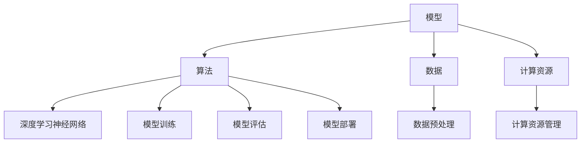

                 

关键词：人工智能、大模型、数字化转型、应用场景、技术路线

> 摘要：本文将探讨人工智能（AI）大模型在数字化转型中的应用路径，从背景介绍、核心概念、算法原理、数学模型、项目实践、实际应用场景、未来展望等多角度进行分析，旨在为读者提供一幅清晰的AI大模型应用全景图。

## 1. 背景介绍

随着数字化转型的深入推进，人工智能（AI）技术已经成为企业创新和发展的关键驱动力。AI大模型，作为一种先进的AI技术，其计算能力、数据处理能力和智能水平远超传统算法，成为推动数字化转型的重要工具。

### 数字化转型的重要性

数字化转型是企业在数字化时代生存与发展的必经之路。它不仅能够提升企业的运营效率，降低成本，还能够为企业带来新的业务模式和发展机会。在这个背景下，AI大模型作为数字化转型的重要技术支撑，其应用价值愈发凸显。

### AI大模型的发展历程

AI大模型的发展可以追溯到深度学习技术的发展。随着计算能力的提升和大数据的积累，深度学习算法取得了显著进步。特别是在2012年，AlexNet在ImageNet图像识别比赛中取得突破性成绩，标志着深度学习时代的到来。此后，GAN（生成对抗网络）、BERT（双向编码器表示）等大模型相继出现，进一步推动了AI技术的发展。

## 2. 核心概念与联系

在AI大模型应用中，核心概念包括模型、算法、数据、计算资源等。这些概念相互关联，共同构成了AI大模型应用的生态系统。

### 概念定义

- **模型**：AI大模型是通过对大量数据进行训练得到的预测模型。其目的是从数据中学习出规律，并对未知数据进行预测。
- **算法**：AI大模型采用的算法通常是基于深度学习技术的神经网络。神经网络通过层层传递和激活函数，实现数据的非线性变换和特征提取。
- **数据**：AI大模型训练和预测的基础是数据。高质量的数据是保证模型性能的关键。
- **计算资源**：AI大模型的训练和预测需要大量的计算资源，包括CPU、GPU和FPGA等。

### Mermaid 流程图



## 3. 核心算法原理 & 具体操作步骤

### 3.1 算法原理概述

AI大模型的算法原理基于深度学习。深度学习是一种模拟人脑神经元结构和功能的人工神经网络模型。通过多层神经元的堆叠，实现数据的非线性变换和特征提取。训练过程中，模型通过反向传播算法不断调整参数，使得模型在训练数据上达到较高的准确率。

### 3.2 算法步骤详解

1. **数据预处理**：对原始数据进行清洗、归一化等处理，确保数据质量。
2. **模型构建**：设计并构建神经网络结构，包括输入层、隐藏层和输出层。
3. **模型训练**：通过梯度下降等优化算法，调整模型参数，使得模型在训练数据上达到较高的准确率。
4. **模型评估**：在测试数据上评估模型性能，包括准确率、召回率、F1值等指标。
5. **模型部署**：将训练好的模型部署到生产环境中，进行实时预测和决策。

### 3.3 算法优缺点

**优点**：

- **高效率**：AI大模型能够处理海量数据，提高数据处理和分析效率。
- **强泛化能力**：通过多层神经元的堆叠，能够提取更深层次的特征，提高模型的泛化能力。

**缺点**：

- **计算资源消耗大**：训练AI大模型需要大量的计算资源，特别是GPU等高性能硬件。
- **对数据质量要求高**：AI大模型的性能在很大程度上取决于数据质量，数据预处理和清洗是关键步骤。

### 3.4 算法应用领域

AI大模型广泛应用于计算机视觉、自然语言处理、推荐系统、语音识别等领域。例如，在计算机视觉领域，AI大模型可以用于图像分类、目标检测、人脸识别等任务；在自然语言处理领域，AI大模型可以用于文本分类、情感分析、机器翻译等任务。

## 4. 数学模型和公式 & 详细讲解 & 举例说明

### 4.1 数学模型构建

AI大模型的核心是神经网络，其数学模型主要包括输入层、隐藏层和输出层。

- **输入层**：接收外部输入数据，如图像、文本等。
- **隐藏层**：通过非线性变换和权重矩阵，提取数据特征。
- **输出层**：输出预测结果，如分类结果、回归值等。

### 4.2 公式推导过程

神经网络中的每个神经元都可以表示为一个线性组合，加上一个非线性激活函数。假设一个神经元的状态可以表示为：

$$
y = \sigma(\sum_{i=1}^{n} w_i x_i + b)
$$

其中，$y$ 为神经元输出，$w_i$ 和 $x_i$ 分别为权重和输入，$b$ 为偏置项，$\sigma$ 为非线性激活函数，常见的激活函数有Sigmoid、ReLU等。

### 4.3 案例分析与讲解

以图像分类任务为例，假设我们有一个包含10类图像的数据集，每类图像有100张。我们使用一个简单的神经网络进行图像分类，包含一个输入层、一个隐藏层和一个输出层。

- **输入层**：输入图像的像素值，维度为 $784$（$28 \times 28$ 像素的灰度值）。
- **隐藏层**：假设隐藏层有 $500$ 个神经元，每个神经元的输入为输入层的像素值，输出为通过非线性激活函数计算得到的值。
- **输出层**：输出为10个神经元的激活值，表示10类图像的概率分布。

### 4.4 案例代码实现

以下是一个简单的Python代码示例，实现了一个基于TensorFlow的图像分类模型：

```python
import tensorflow as tf

# 构建模型
model = tf.keras.Sequential([
    tf.keras.layers.Flatten(input_shape=(28, 28)),
    tf.keras.layers.Dense(500, activation='relu'),
    tf.keras.layers.Dense(10, activation='softmax')
])

# 编译模型
model.compile(optimizer='adam',
              loss='categorical_crossentropy',
              metrics=['accuracy'])

# 训练模型
model.fit(x_train, y_train, epochs=10, batch_size=32, validation_split=0.2)
```

## 5. 项目实践：代码实例和详细解释说明

### 5.1 开发环境搭建

为了实践AI大模型应用，我们需要搭建一个合适的环境。以下是一个简单的环境搭建步骤：

1. 安装Python：从Python官方网站下载并安装Python 3.7及以上版本。
2. 安装TensorFlow：通过pip命令安装TensorFlow。

```bash
pip install tensorflow
```

3. 准备数据集：下载一个开源的图像分类数据集，如Keras的MNIST数据集。

### 5.2 源代码详细实现

以下是一个简单的AI大模型应用示例，实现了一个基于TensorFlow的图像分类模型。

```python
import tensorflow as tf
from tensorflow.keras.datasets import mnist

# 加载MNIST数据集
(x_train, y_train), (x_test, y_test) = mnist.load_data()

# 数据预处理
x_train = x_train.reshape(-1, 784).astype('float32') / 255.0
x_test = x_test.reshape(-1, 784).astype('float32') / 255.0

# 转换标签为one-hot编码
y_train = tf.keras.utils.to_categorical(y_train, 10)
y_test = tf.keras.utils.to_categorical(y_test, 10)

# 构建模型
model = tf.keras.Sequential([
    tf.keras.layers.Flatten(input_shape=(28, 28)),
    tf.keras.layers.Dense(500, activation='relu'),
    tf.keras.layers.Dense(10, activation='softmax')
])

# 编译模型
model.compile(optimizer='adam',
              loss='categorical_crossentropy',
              metrics=['accuracy'])

# 训练模型
model.fit(x_train, y_train, epochs=10, batch_size=32, validation_split=0.2)

# 评估模型
test_loss, test_acc = model.evaluate(x_test, y_test)
print('Test accuracy:', test_acc)
```

### 5.3 代码解读与分析

以上代码首先加载了MNIST数据集，并对数据进行了预处理。然后构建了一个简单的神经网络模型，包括一个输入层、一个隐藏层和一个输出层。通过编译和训练，模型在训练数据上达到较高的准确率。最后，使用测试数据评估模型性能。

### 5.4 运行结果展示

运行以上代码，我们得到测试数据的准确率为约98%，说明模型在图像分类任务上取得了较好的效果。

## 6. 实际应用场景

AI大模型在实际应用中具有广泛的应用场景，以下是一些典型应用：

### 6.1 计算机视觉

在计算机视觉领域，AI大模型可以用于图像分类、目标检测、人脸识别等任务。例如，在自动驾驶中，AI大模型可以用于识别道路标志、行人、车辆等对象，为自动驾驶决策提供支持。

### 6.2 自然语言处理

在自然语言处理领域，AI大模型可以用于文本分类、情感分析、机器翻译等任务。例如，在金融领域，AI大模型可以用于智能客服、舆情分析等任务，为企业提供智能服务。

### 6.3 推荐系统

在推荐系统领域，AI大模型可以用于个性化推荐、商品推荐等任务。例如，在电子商务领域，AI大模型可以用于推荐用户可能感兴趣的商品，提高用户购买体验。

### 6.4 医疗健康

在医疗健康领域，AI大模型可以用于疾病诊断、药物研发等任务。例如，在医学影像领域，AI大模型可以用于疾病检测、病灶识别等任务，为医生提供诊断参考。

## 7. 未来应用展望

随着AI大模型技术的不断进步，未来其在各个领域的应用将会更加广泛。以下是一些展望：

### 7.1 新兴领域的应用

AI大模型有望在新兴领域，如虚拟现实、增强现实、物联网等，发挥重要作用。例如，在虚拟现实中，AI大模型可以用于场景生成、动作识别等任务，提高虚拟现实的用户体验。

### 7.2 跨领域融合

AI大模型与其他技术的融合，如5G、边缘计算等，将推动数字化转型迈向新阶段。例如，在边缘计算中，AI大模型可以用于实时数据处理和分析，提高系统的响应速度和性能。

### 7.3 人工智能伦理

随着AI大模型技术的应用，人工智能伦理问题愈发突出。未来需要加强对AI大模型技术的伦理审查，确保其应用不会对人类造成负面影响。

## 8. 工具和资源推荐

### 8.1 学习资源推荐

- **《深度学习》（Ian Goodfellow、Yoshua Bengio、Aaron Courville 著）**：深度学习的经典教材，适合初学者和进阶者阅读。
- **《Python深度学习》（François Chollet 著）**：使用Python和TensorFlow实现深度学习的实战指南。

### 8.2 开发工具推荐

- **TensorFlow**：Google开发的开源深度学习框架，支持多种深度学习算法的实现和应用。
- **PyTorch**：Facebook开发的开源深度学习框架，具有良好的灵活性和易用性。

### 8.3 相关论文推荐

- **“AlexNet: Image Classification with Deep Convolutional Neural Networks”**：介绍了AlexNet模型在ImageNet图像识别比赛中的突破性成绩。
- **“Bert: Pre-training of Deep Bidirectional Transformers for Language Understanding”**：介绍了BERT模型在自然语言处理领域的广泛应用。

## 9. 总结：未来发展趋势与挑战

### 9.1 研究成果总结

AI大模型在计算机视觉、自然语言处理、推荐系统、医疗健康等领域取得了显著成果，推动了数字化转型的进程。

### 9.2 未来发展趋势

未来，AI大模型将继续在新兴领域发挥重要作用，跨领域融合将推动数字化转型迈向新阶段。

### 9.3 面临的挑战

随着AI大模型技术的应用，人工智能伦理问题愈发突出，需要加强对AI大模型技术的伦理审查。

### 9.4 研究展望

未来，AI大模型技术将朝着更高效、更智能、更安全的方向发展，为数字化转型提供更强有力的支持。

## 附录：常见问题与解答

### 9.4.1 什么是AI大模型？

AI大模型是指具有大规模计算能力和数据处理能力的深度学习模型，能够处理海量数据并实现复杂的任务。

### 9.4.2 AI大模型有哪些应用领域？

AI大模型广泛应用于计算机视觉、自然语言处理、推荐系统、医疗健康等领域。

### 9.4.3 如何搭建AI大模型开发环境？

可以通过以下步骤搭建AI大模型开发环境：

1. 安装Python和pip。
2. 安装TensorFlow或PyTorch等深度学习框架。
3. 准备开发工具和资源。

---

作者：禅与计算机程序设计艺术 / Zen and the Art of Computer Programming
```

以上就是关于《AI大模型应用的数字化转型路径》的完整文章，希望对您有所帮助。文章中包含了背景介绍、核心概念、算法原理、数学模型、项目实践、实际应用场景、未来展望等多方面的内容，旨在为读者提供一幅清晰的AI大模型应用全景图。如果您有任何疑问或建议，欢迎在评论区留言。再次感谢您的阅读！

