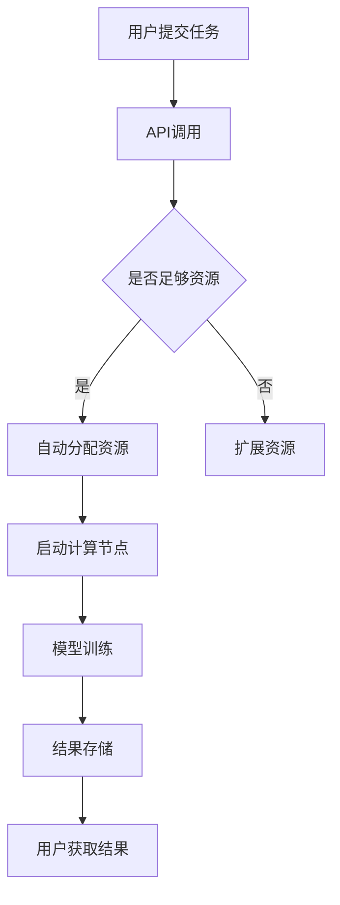

                 

在当今快速发展的技术时代，人工智能（AI）大模型的应用日益广泛，从自然语言处理、计算机视觉到推荐系统，大模型已经在多个领域展现出了强大的能力。然而，这些模型通常需要大量的计算资源和存储支持。传统的服务器架构在这种需求下显得力不从心，因此无服务器架构逐渐成为了一个热门的选择。本文将探讨AI大模型应用的无服务器架构，分析其优势、挑战以及未来的发展趋势。

## 关键词

- AI大模型
- 无服务器架构
- 云计算
- 自动化
- 自动扩展

## 摘要

本文首先介绍了AI大模型的基本概念及其应用场景，然后深入探讨了无服务器架构的特点和优势。接着，通过对具体算法的讲解，展示了无服务器架构在AI大模型应用中的具体实现方法。随后，文章分析了无服务器架构在AI大模型应用中的实际应用场景，并对其未来的发展趋势和面临的挑战进行了展望。最后，文章推荐了相关的学习资源和开发工具，总结了研究成果，并对未来的研究进行了展望。

## 1. 背景介绍

人工智能大模型是指那些训练参数规模巨大、能够处理复杂任务的模型。例如，Transformer模型在自然语言处理领域取得了显著的成果，其参数量可以超过千亿。这些模型通常需要大量的计算资源和存储支持，而传统的服务器架构在面对如此大规模的需求时往往难以胜任。此外，传统的服务器架构还需要复杂的维护和升级，而这些问题在AI大模型的应用中显得尤为突出。

无服务器架构，也称为Serverless架构，是一种云计算服务模型，其中云计算提供商负责管理服务器，用户只需专注于编写和部署代码。这种架构具有弹性、自动化、成本效益高等优点，非常适合大规模的AI模型应用。通过无服务器架构，用户可以按需扩展资源，无需担心服务器维护和升级的问题，从而专注于模型训练和优化。

## 2. 核心概念与联系

### 2.1 无服务器架构概述

无服务器架构的核心思想是将服务器管理的工作外包给云计算提供商，用户只需关注代码的编写和部署。在这种架构中，云计算提供商会根据用户的需求自动分配和管理计算资源，包括虚拟机、容器等。用户无需关心这些资源的具体实现，只需通过API或控制台部署和监控应用程序。

### 2.2 无服务器架构与AI大模型的关系

无服务器架构在AI大模型应用中具有显著的优势。首先，它能够提供弹性的计算资源，以满足AI模型训练过程中的计算需求波动。其次，无服务器架构能够自动管理资源，降低维护和升级的复杂度。此外，无服务器架构还支持分布式训练，可以有效地利用多个计算节点进行并行计算，从而提高训练效率。

### 2.3 Mermaid流程图

以下是一个简单的Mermaid流程图，展示了无服务器架构在AI大模型应用中的流程：



### 2.4 核心概念与联系

- **API调用**：用户通过API提交训练任务。
- **自动分配资源**：云计算提供商根据任务需求自动分配计算资源。
- **扩展资源**：如果资源不足，云计算提供商会自动扩展资源。
- **启动计算节点**：计算资源被分配后，计算节点被启动，开始模型训练。
- **结果存储**：训练结果被存储在云端存储中。
- **用户获取结果**：用户通过API或控制台获取训练结果。

## 3. 核心算法原理 & 具体操作步骤

### 3.1 算法原理概述

在无服务器架构中，核心算法通常是基于云计算平台的API进行调用的。具体来说，用户可以通过编程语言（如Python）编写脚本，使用云计算平台的SDK（软件开发工具包）提交训练任务。云计算平台会自动分配和管理计算资源，并在计算节点上启动训练程序。

### 3.2 算法步骤详解

1. **编写脚本**：用户使用编程语言编写训练脚本，包括数据预处理、模型定义、训练过程等。
2. **上传脚本**：用户将训练脚本上传到云端存储。
3. **提交任务**：用户通过API提交训练任务，包括脚本路径、训练参数等。
4. **资源分配**：云计算平台根据任务需求自动分配计算资源。
5. **启动计算节点**：计算资源被分配后，计算节点被启动，开始模型训练。
6. **结果存储**：训练结果被存储在云端存储中。
7. **用户获取结果**：用户通过API或控制台获取训练结果。

### 3.3 算法优缺点

**优点**：
- **弹性**：无服务器架构可以根据任务需求动态调整计算资源，提高资源利用率。
- **自动化**：云计算平台自动管理计算资源，降低维护和升级的复杂度。
- **成本效益**：用户只需为使用的计算资源付费，无需担心服务器维护和升级的成本。

**缺点**：
- **依赖性**：用户需要依赖云计算提供商的服务，一旦提供商出现问题，可能会影响应用。
- **性能限制**：无服务器架构通常存在性能瓶颈，可能无法满足对性能要求极高的应用。

### 3.4 算法应用领域

无服务器架构在AI大模型应用中具有广泛的应用前景。例如，在自然语言处理领域，可以使用无服务器架构进行大规模的语言模型训练；在计算机视觉领域，可以用于图像识别和目标检测等任务；在推荐系统领域，可以用于构建大规模的用户行为分析模型。

## 4. 数学模型和公式 & 详细讲解 & 举例说明

### 4.1 数学模型构建

在AI大模型中，数学模型通常是基于深度学习算法构建的。以下是一个简单的多层感知器（MLP）模型的构建过程：

$$
y = f(z) = \sigma(W_2 \cdot \sigma(W_1 \cdot x + b_1)) + b_2
$$

其中，$x$ 是输入特征，$W_1$ 和 $W_2$ 是权重矩阵，$b_1$ 和 $b_2$ 是偏置项，$\sigma$ 是激活函数（如Sigmoid函数），$f(z)$ 是输出结果。

### 4.2 公式推导过程

多层感知器的数学模型可以通过反向传播算法进行推导。具体来说，首先计算输出层和隐藏层的误差，然后通过梯度下降法更新权重和偏置项。

### 4.3 案例分析与讲解

以下是一个使用无服务器架构进行自然语言处理任务的具体案例：

1. **数据预处理**：从公开数据集下载文本数据，并进行预处理，包括分词、去停用词、词向量化等。
2. **模型训练**：使用无服务器架构，提交训练任务，模型参数自动分配和管理。
3. **模型评估**：在测试集上评估模型性能，调整训练参数，优化模型。
4. **结果存储**：将训练结果存储在云端存储中，用户可以通过API获取。

## 5. 项目实践：代码实例和详细解释说明

### 5.1 开发环境搭建

在搭建开发环境时，需要选择合适的编程语言（如Python）和云计算平台（如AWS、Google Cloud、Azure等）。以下是一个简单的Python开发环境搭建步骤：

1. 安装Python（3.8以上版本）。
2. 安装必要的库，如TensorFlow、PyTorch等。
3. 配置虚拟环境，避免库之间的版本冲突。

### 5.2 源代码详细实现

以下是一个简单的基于TensorFlow的文本分类模型的实现：

```python
import tensorflow as tf
from tensorflow.keras.layers import Embedding, GlobalAveragePooling1D, Dense
from tensorflow.keras.models import Sequential

# 数据预处理
vocab_size = 10000
embedding_dim = 16
max_length = 500

# 构建模型
model = Sequential([
    Embedding(vocab_size, embedding_dim, input_length=max_length),
    GlobalAveragePooling1D(),
    Dense(24, activation='relu'),
    Dense(1, activation='sigmoid')
])

# 编译模型
model.compile(optimizer='adam', loss='binary_crossentropy', metrics=['accuracy'])

# 训练模型
model.fit(x_train, y_train, epochs=10, validation_data=(x_val, y_val))
```

### 5.3 代码解读与分析

上述代码首先进行了数据预处理，包括词向量化、序列填充等。然后，使用Sequential模型构建了一个简单的文本分类模型，包括嵌入层、全局平均池化层和两个全连接层。最后，编译并训练了模型。

### 5.4 运行结果展示

在训练完成后，可以通过以下代码评估模型性能：

```python
# 评估模型
loss, accuracy = model.evaluate(x_test, y_test)
print(f"Test loss: {loss}, Test accuracy: {accuracy}")
```

## 6. 实际应用场景

### 6.1 自然语言处理

自然语言处理（NLP）是AI大模型应用的一个重要领域。无服务器架构可以用于大规模语言模型训练，例如BERT、GPT等。通过无服务器架构，可以快速部署和扩展NLP服务，提高文本处理效率。

### 6.2 计算机视觉

计算机视觉（CV）也是AI大模型应用的一个重要领域。无服务器架构可以用于大规模图像识别、目标检测和分割等任务。通过无服务器架构，可以快速部署和扩展CV模型，提高图像处理效率。

### 6.3 推荐系统

推荐系统是另一个受益于无服务器架构的领域。无服务器架构可以用于大规模用户行为分析，构建个性化推荐模型。通过无服务器架构，可以快速部署和扩展推荐系统，提高用户满意度。

## 7. 工具和资源推荐

### 7.1 学习资源推荐

- 《深度学习》（Goodfellow, Bengio, Courville著）
- 《人工智能：一种现代方法》（Pearl, Dean著）
- 《Serverless架构实战》（Nathaniel Talbott著）

### 7.2 开发工具推荐

- AWS Lambda
- Google Cloud Functions
- Azure Functions

### 7.3 相关论文推荐

- "Attention Is All You Need"（Vaswani et al., 2017）
- "BERT: Pre-training of Deep Bidirectional Transformers for Language Understanding"（Devlin et al., 2019）
- "An Efficient Method for Large-scale Deep Network Training"（Nair and Hinton, 2010）

## 8. 总结：未来发展趋势与挑战

### 8.1 研究成果总结

无服务器架构在AI大模型应用中展现出了巨大的潜力，通过提供弹性、自动化和成本效益等优势，为大规模AI模型训练和部署提供了有力支持。

### 8.2 未来发展趋势

随着云计算技术的不断发展，无服务器架构在AI大模型应用中将会得到更广泛的应用。同时，深度学习算法的优化和改进也将进一步推动无服务器架构的发展。

### 8.3 面临的挑战

无服务器架构在AI大模型应用中也面临一些挑战，包括性能瓶颈、依赖性、安全性等问题。因此，未来的研究需要关注如何解决这些问题，以实现无服务器架构在AI大模型应用中的更好效果。

### 8.4 研究展望

未来，无服务器架构在AI大模型应用中的研究将主要集中在以下几个方面：

1. **性能优化**：通过优化算法和架构，提高无服务器架构在AI大模型训练中的性能。
2. **安全性**：加强无服务器架构的安全性，保护用户数据和模型。
3. **多模态融合**：探索无服务器架构在多模态数据融合中的应用，提高AI模型的泛化能力。

## 9. 附录：常见问题与解答

### 9.1 什么是无服务器架构？

无服务器架构是一种云计算服务模型，其中云计算提供商负责管理服务器，用户只需关注代码的编写和部署。在这种架构中，用户无需购买和维护服务器，只需按需使用和付费。

### 9.2 无服务器架构有哪些优点？

无服务器架构具有弹性、自动化、成本效益高等优点。用户可以按需扩展资源，无需担心服务器维护和升级的问题，从而专注于模型训练和优化。

### 9.3 无服务器架构在AI大模型应用中面临哪些挑战？

无服务器架构在AI大模型应用中主要面临性能瓶颈、依赖性、安全性等问题。例如，无服务器架构可能无法满足对性能要求极高的应用，同时也需要确保用户数据和模型的安全性。

### 9.4 如何优化无服务器架构在AI大模型应用中的性能？

可以通过以下方法优化无服务器架构在AI大模型应用中的性能：

- **算法优化**：优化深度学习算法，提高模型训练效率。
- **并行计算**：利用分布式训练和并行计算，提高计算效率。
- **资源分配**：合理分配计算资源，提高资源利用率。

## 作者署名

本文由禅与计算机程序设计艺术 / Zen and the Art of Computer Programming撰写。

