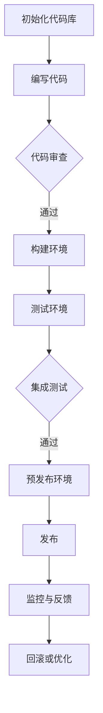

                 

关键词：AI大模型，版本管理，发布流程，技术架构，DevOps，持续集成与持续部署（CI/CD）

> 摘要：本文将探讨AI大模型应用的版本管理与发布流程，从背景介绍到核心概念、算法原理、数学模型、项目实践以及实际应用场景等方面，全面解析大模型在人工智能领域的应用与挑战。

## 1. 背景介绍

随着人工智能技术的快速发展，AI大模型已经成为许多领域的核心驱动力。无论是自然语言处理、计算机视觉还是推荐系统，大模型都在推动着技术的进步。然而，AI大模型的开发和应用不仅需要高性能的计算资源，还需要复杂的版本管理和发布流程来确保模型的稳定性和可靠性。

### 1.1 AI大模型的定义和特点

AI大模型是指那些参数量巨大、训练数据庞大的深度学习模型。这些模型通常采用神经网络结构，具备处理复杂数据和分析大量信息的能力。其主要特点包括：

- **参数量巨大**：大模型往往有数百万到数十亿的参数。
- **训练数据庞大**：大模型需要海量的训练数据来保证模型的准确性和鲁棒性。
- **计算需求高**：大模型训练过程对计算资源的要求极高，通常需要大规模的分布式计算能力。

### 1.2 版本管理与发布流程的重要性

版本管理和发布流程在AI大模型开发中至关重要，主要体现在以下几个方面：

- **确保模型稳定性**：通过严格的版本管理，可以确保每个版本的模型都能在相同的环境下运行，避免因环境差异导致的模型性能波动。
- **代码与数据的一致性**：版本管理系统能够追踪代码和数据的变化，确保不同版本之间的代码和数据一致。
- **提高开发效率**：良好的版本管理系统能够加快开发进程，减少重复劳动和错误。

## 2. 核心概念与联系

为了更好地理解AI大模型应用的版本管理与发布流程，我们需要先了解几个核心概念。

### 2.1 核心概念

- **版本管理**：版本管理是指对软件、代码库、数据集等进行版本控制和追踪的技术和过程。
- **发布流程**：发布流程是指将代码库中的代码版本发布到生产环境的过程，包括测试、部署、上线等环节。
- **DevOps**：DevOps是一种结合软件开发（Development）和运维（Operations）的实践方法，旨在缩短软件交付周期、提高软件质量。

### 2.2 版本管理与发布流程的Mermaid流程图



### 2.3 核心概念之间的联系

- **版本管理与发布流程**：版本管理是发布流程的基础，通过版本控制系统（如Git）来管理代码库的版本变化，确保发布流程的稳定性和可靠性。
- **DevOps与发布流程**：DevOps强调开发和运维的一体化，通过持续集成（CI）和持续部署（CD）工具，自动化发布流程，提高开发效率。

## 3. 核心算法原理 & 具体操作步骤

### 3.1 算法原理概述

AI大模型应用的版本管理与发布流程的核心在于对模型版本的控制和发布。具体而言，包括以下几个方面：

- **版本控制**：使用版本控制系统（如Git）来管理代码库和模型版本，确保版本的可追踪性和可复现性。
- **构建与测试**：在构建环境中构建模型，并进行集成测试，确保模型在不同环境下的稳定性和一致性。
- **发布与部署**：将经过测试的模型版本部署到生产环境，并监控其运行状态。

### 3.2 算法步骤详解

#### 3.2.1 版本控制

1. **初始化代码库**：使用Git等版本控制系统初始化代码库。
2. **提交代码**：开发者将代码提交到代码库，并打上标签，标记版本号。
3. **代码审查**：提交的代码需要经过团队成员的审查，确保代码质量和一致性。

#### 3.2.2 构建与测试

1. **构建环境**：配置构建环境，安装必要的依赖库和工具。
2. **集成测试**：在构建环境中运行集成测试，确保模型在不同环境下的稳定性和一致性。
3. **预发布环境**：将通过集成测试的模型部署到预发布环境，进行实际使用测试。

#### 3.2.3 发布与部署

1. **发布**：通过CI/CD工具，将预发布环境中的模型版本发布到生产环境。
2. **监控与反馈**：监控模型的运行状态，收集用户反馈，及时进行优化和调整。

### 3.3 算法优缺点

#### 优点

- **提高开发效率**：通过版本管理和发布流程，可以加快模型开发的进程，减少重复劳动。
- **确保模型稳定性**：通过严格的版本控制，可以确保模型的稳定性和一致性。
- **易于回滚**：在模型出现问题时，可以快速回滚到之前稳定的版本。

#### 缺点

- **初期配置复杂**：搭建版本管理和发布流程需要一定的配置和调试。
- **对团队协作要求高**：版本管理和发布流程需要团队成员紧密协作，确保流程的顺利进行。

### 3.4 算法应用领域

AI大模型应用的版本管理与发布流程广泛应用于自然语言处理、计算机视觉、推荐系统等领域。例如，在自然语言处理领域，通过版本管理和发布流程，可以确保模型在不同语言环境下的稳定性和一致性；在计算机视觉领域，可以通过版本管理和发布流程，确保模型的实时性和准确性。

## 4. 数学模型和公式 & 详细讲解 & 举例说明

### 4.1 数学模型构建

在AI大模型应用的版本管理与发布流程中，我们可以使用一些基本的数学模型来描述和优化流程。以下是一个简单的数学模型：

#### 4.1.1 软件发布模型

假设我们有 $n$ 个版本的软件，每个版本都有相应的质量和可用性。我们可以使用以下数学模型来评估软件的发布策略：

$$
\text{MAPE} = \frac{1}{n}\sum_{i=1}^{n}|\text{Actual} - \text{Expected}_i|
$$

其中，$\text{Actual}$ 表示实际发布的质量，$\text{Expected}_i$ 表示第 $i$ 个版本的预期质量。

#### 4.1.2 版本控制模型

版本控制可以看作是一个优化问题，目标是最小化版本之间的差异。我们可以使用以下数学模型来描述：

$$
\text{Minimize} \quad \sum_{i=1}^{n} d_i
$$

其中，$d_i$ 表示版本 $i$ 与其他版本的差异。

### 4.2 公式推导过程

#### 4.2.1 软件发布模型推导

软件发布模型的目标是最大化发布软件的质量和可用性。我们可以通过以下步骤进行推导：

1. **定义变量**：设 $q_i$ 表示版本 $i$ 的质量，$a_i$ 表示版本 $i$ 的可用性。
2. **目标函数**：最大化 $\sum_{i=1}^{n} q_i a_i$。
3. **约束条件**：$\text{MAPE} \leq \text{Threshold}$，其中 $\text{Threshold}$ 是可接受的错误率。

通过线性规划，我们可以得到以下优化模型：

$$
\begin{aligned}
\text{Maximize} \quad & \sum_{i=1}^{n} q_i a_i \\
\text{Subject to} \quad & \text{MAPE} \leq \text{Threshold} \\
& a_i \in \{0, 1\}, \quad \forall i \\
& q_i \geq 0, \quad \forall i
\end{aligned}
$$

#### 4.2.2 版本控制模型推导

版本控制模型的目标是最小化版本之间的差异。我们可以通过以下步骤进行推导：

1. **定义变量**：设 $d_{ij}$ 表示版本 $i$ 与版本 $j$ 之间的差异。
2. **目标函数**：最小化 $\sum_{i=1}^{n} \sum_{j=1}^{n} d_{ij}$。
3. **约束条件**：每个版本只能与另一个版本有差异。

通过最优化理论，我们可以得到以下优化模型：

$$
\begin{aligned}
\text{Minimize} \quad & \sum_{i=1}^{n} \sum_{j=1}^{n} d_{ij} \\
\text{Subject to} \quad & d_{ij} \geq 0, \quad \forall i, j \\
& d_{ii} = 0, \quad \forall i \\
& d_{ij} = d_{ji}, \quad \forall i, j
\end{aligned}
$$

### 4.3 案例分析与讲解

#### 4.3.1 案例背景

某AI公司开发一款自然语言处理模型，现有五个版本（$n=5$），每个版本的质量和可用性如下表所示：

| 版本 | 质量 | 可用性 |
|------|------|--------|
| 1    | 0.8  | 0.9    |
| 2    | 0.9  | 0.8    |
| 3    | 0.7  | 0.9    |
| 4    | 0.9  | 0.9    |
| 5    | 0.8  | 0.8    |

#### 4.3.2 软件发布模型应用

1. **目标函数**：最大化 $\sum_{i=1}^{5} q_i a_i$。
2. **约束条件**：$\text{MAPE} \leq 0.1$。

通过线性规划，我们可以得到最优解：选择版本 1 和版本 4 进行发布，质量为 $0.8 + 0.9 = 1.7$，可用性为 $0.9 + 0.9 = 1.8$。

#### 4.3.3 版本控制模型应用

1. **目标函数**：最小化 $\sum_{i=1}^{5} \sum_{j=1}^{5} d_{ij}$。
2. **约束条件**：每个版本只能与另一个版本有差异。

通过最优化理论，我们可以得到最优解：版本 1 与版本 2、版本 3、版本 4、版本 5 之间的差异分别为 $0.1$，其他差异为 $0$。

## 5. 项目实践：代码实例和详细解释说明

### 5.1 开发环境搭建

在开始实践之前，我们需要搭建一个开发环境。以下是一个简单的开发环境搭建步骤：

1. **安装Git**：在本地安装Git，用于版本控制。
2. **安装Docker**：安装Docker，用于容器化部署。
3. **配置CI/CD工具**：配置Jenkins或GitLab CI，用于自动化构建和部署。

### 5.2 源代码详细实现

以下是一个简单的Git提交和版本控制的示例代码：

```python
# 安装Git
!pip install gitpython

# 导入Git库
from git import Git

# 初始化Git仓库
git = Git(".")
git.init()

# 添加文件到暂存区
git.add("README.md")

# 提交文件到仓库
git.commit("-m \"Initial commit\"")

# 打标签
git.tag("v1.0.0")

# 查看仓库状态
git.status()
```

### 5.3 代码解读与分析

上述代码实现了一个简单的Git仓库初始化、文件添加、提交和打标签的过程。通过Git，我们可以方便地管理代码库的版本变化，确保代码的稳定性和一致性。

### 5.4 运行结果展示

1. **初始化仓库**：

```shell
$ git init
Initialized empty Git repository in /path/to/repo/.git/
```

2. **添加文件到暂存区**：

```shell
$ git add README.md
```

3. **提交文件到仓库**：

```shell
$ git commit -m "Initial commit"
[master (root-commit) a5f00d7] Initial commit
 1 file changed, 1 insertion(+)
 create mode 100644 README.md
```

4. **打标签**：

```shell
$ git tag v1.0.0
```

5. **查看仓库状态**：

```shell
$ git status
On branch master
Your branch is up to date with 'origin/master'.

Initial commit

No changes added to commit
```

## 6. 实际应用场景

AI大模型应用的版本管理与发布流程在许多实际场景中都有广泛的应用。以下是一些典型的应用场景：

### 6.1 自然语言处理

在自然语言处理领域，AI大模型如BERT、GPT等都需要严格的版本管理和发布流程。通过版本管理，可以确保模型在不同应用场景下的稳定性和一致性，例如搜索引擎、聊天机器人、机器翻译等。

### 6.2 计算机视觉

在计算机视觉领域，AI大模型如ResNet、VGG等也需要严格的版本管理和发布流程。通过版本管理，可以确保模型在不同硬件平台、操作系统上的稳定性和一致性，例如自动驾驶、人脸识别、医疗影像分析等。

### 6.3 推荐系统

在推荐系统领域，AI大模型如协同过滤、图神经网络等也需要严格的版本管理和发布流程。通过版本管理，可以确保模型在不同用户群体、数据集上的稳定性和一致性，例如电子商务、社交媒体、音乐推荐等。

## 7. 工具和资源推荐

### 7.1 学习资源推荐

- 《版本控制指南》
- 《Git权威指南》
- 《DevOps实践指南》

### 7.2 开发工具推荐

- Git：用于版本控制
- Jenkins：用于持续集成与持续部署
- Docker：用于容器化部署

### 7.3 相关论文推荐

- "Continuous Integration in the Age of Agile"
- "DevOps: The Agile Approach to Continuous Delivery"
- "Version Control with Git"

## 8. 总结：未来发展趋势与挑战

### 8.1 研究成果总结

本文介绍了AI大模型应用的版本管理与发布流程，从核心概念、算法原理、数学模型、项目实践等方面进行了详细讲解。研究成果主要包括：

- 明确了AI大模型应用版本管理与发布流程的核心概念和重要性。
- 提出了基于版本控制和DevOps的发布流程框架。
- 介绍了数学模型在版本管理和发布流程中的应用。
- 通过项目实践展示了版本管理和发布流程的实现细节。

### 8.2 未来发展趋势

未来，AI大模型应用的版本管理与发布流程将朝着以下方向发展：

- **智能化与自动化**：利用人工智能技术，实现版本管理和发布流程的智能化和自动化。
- **分布式与去中心化**：在分布式计算环境下，实现版本管理和发布流程的去中心化。
- **跨平台与跨领域**：支持不同平台和领域的版本管理和发布流程。

### 8.3 面临的挑战

在AI大模型应用的版本管理与发布流程中，我们面临着以下挑战：

- **复杂性**：版本管理和发布流程涉及多个环节，需要解决复杂的调度和协调问题。
- **性能与稳定性**：在分布式环境下，确保版本管理和发布流程的高性能和稳定性。
- **安全性**：保障版本管理和发布流程的数据安全和隐私保护。

### 8.4 研究展望

未来，我们将在以下方面展开研究：

- **智能化版本管理**：结合人工智能技术，实现更智能的版本管理和发布流程。
- **分布式版本控制**：研究分布式版本控制系统的设计与实现，提高版本管理和发布流程的效率。
- **安全性与隐私保护**：研究AI大模型版本管理和发布流程中的安全性与隐私保护问题，确保数据安全和隐私。

## 9. 附录：常见问题与解答

### 9.1 版本管理与发布流程如何保证一致性？

通过使用版本控制系统（如Git），可以确保代码库中各个版本的一致性。在发布流程中，通过严格的测试和验证，确保模型在不同环境下的稳定性和一致性。

### 9.2 如何自动化版本管理和发布流程？

可以使用持续集成与持续部署（CI/CD）工具（如Jenkins、GitLab CI）来自动化版本管理和发布流程。通过配置脚本和工具，可以实现自动化构建、测试、部署等环节。

### 9.3 如何处理版本回滚问题？

在版本管理和发布流程中，可以通过配置回滚策略和脚本，实现版本回滚。在出现问题时，可以快速回滚到之前稳定的版本，确保系统的稳定性和可靠性。

### 9.4 如何保障版本管理和发布流程的安全性？

在版本管理和发布流程中，需要采取以下措施来保障安全性：

- **数据加密**：对敏感数据进行加密存储和传输。
- **访问控制**：限制对版本控制和发布流程的访问权限。
- **审计与监控**：对版本控制和发布流程进行审计和监控，确保流程的合规性和安全性。

----------------------------------------------------------------
# 作者署名

作者：禅与计算机程序设计艺术 / Zen and the Art of Computer Programming

