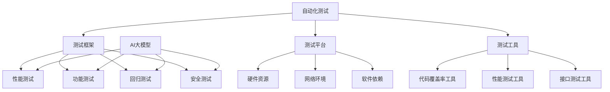

                 

在当今这个大数据和人工智能迅速发展的时代，大型AI模型的应用越来越广泛，从自然语言处理到计算机视觉，再到复杂的推荐系统，它们已经深入到了我们生活的方方面面。然而，随着AI模型的复杂性不断增加，如何对它们进行有效的自动化测试，以确保其准确性和可靠性，已经成为了一个亟待解决的问题。本文将深入探讨AI大模型应用的自动化测试工具选型，旨在为读者提供一套科学、全面的测试策略。

## 文章关键词

- AI大模型
- 自动化测试
- 工具选型
- 测试策略
- 测试框架
- 测试平台
- 性能评估

## 文章摘要

本文首先对AI大模型应用中的自动化测试进行了背景介绍，随后深入分析了核心概念与联系，阐述了自动化测试的核心算法原理与操作步骤，并详细讲解了数学模型和公式。接下来，通过一个实际的项目实践案例，展示了代码实例和运行结果。最后，文章讨论了实际应用场景，推荐了相关工具和资源，并总结了未来发展趋势与挑战。

## 1. 背景介绍

AI大模型，如深度学习神经网络、生成对抗网络（GAN）和变分自编码器（VAE），已经成为现代人工智能领域的基石。这些模型在图像识别、语音识别、自然语言处理等领域展现了强大的能力。然而，随着模型规模的增大和复杂性的提升，传统的手动测试方法已经难以满足大规模、高精度测试的需求。

自动化测试能够显著提高测试效率和准确性，减少人工错误。它通过编写测试脚本，自动执行一系列测试用例，从而验证AI模型的功能、性能和可靠性。在AI大模型应用中，自动化测试工具的选型至关重要，因为它直接影响到测试的全面性和效果。

本文旨在解决以下问题：

1. 自动化测试在AI大模型应用中的重要性是什么？
2. 如何选择合适的自动化测试工具？
3. 自动化测试工具如何与AI模型相结合，实现高效的测试流程？
4. 自动化测试在实际应用中面临哪些挑战和解决方案？

通过本文的探讨，读者将能够获得全面的理解和实用的指导，以便在实际项目中有效运用自动化测试工具，确保AI大模型的稳定性和可靠性。

### 2. 核心概念与联系

在探讨AI大模型应用的自动化测试工具选型之前，首先需要明确几个核心概念，并理解它们之间的相互关系。以下是本文所涉及的核心概念：

#### 2.1 自动化测试

自动化测试是指通过编写脚本或使用专门的测试工具，自动执行测试用例的过程。与手动测试相比，自动化测试具有效率高、重复性好、易于维护等优点。自动化测试可以覆盖广泛的测试场景，从单元测试到集成测试，再到端到端测试。

#### 2.2 测试框架

测试框架是自动化测试的核心组成部分，它提供了测试用例的编写、执行和管理等功能。常见的测试框架包括JUnit、TestNG、PyTest等。测试框架不仅能够提高测试的效率，还能够通过扩展性支持多种编程语言和测试策略。

#### 2.3 测试平台

测试平台是执行自动化测试的环境，它通常包括测试服务器、数据库、模拟环境等。测试平台的选择需要考虑硬件资源、网络环境、软件依赖等因素。开源测试平台如Selenium、Cypress等，以及商业测试平台如QARun、JMeter等，都是常见的选择。

#### 2.4 测试工具

测试工具是自动化测试过程中使用的具体工具，例如代码覆盖率工具、性能测试工具、接口测试工具等。测试工具的选择需要根据具体的测试需求来决定，以保证测试的全面性和准确性。

#### 2.5 AI大模型

AI大模型是指具有巨大参数量和复杂结构的机器学习模型，如深度学习神经网络、生成对抗网络等。AI大模型的应用涵盖了图像识别、自然语言处理、语音识别等多个领域，其性能的稳定性和可靠性对实际应用至关重要。

#### 2.6 自动化测试与AI大模型的联系

自动化测试与AI大模型之间的联系主要体现在以下几个方面：

1. **性能测试**：通过自动化测试工具对AI大模型进行性能测试，可以评估模型的响应时间、吞吐量、资源消耗等关键指标，从而优化模型性能。

2. **功能测试**：自动化测试可以生成大量的测试用例，对AI大模型的功能进行全面测试，确保模型在不同输入条件下的正确性。

3. **回归测试**：在AI大模型更新或迭代时，自动化测试可以帮助快速发现回归问题，确保新版本与旧版本的一致性。

4. **安全测试**：通过自动化测试工具进行安全测试，可以识别AI大模型中的潜在安全漏洞，保障系统的安全性。

#### 2.7 Mermaid 流程图

为了更直观地展示上述核心概念之间的联系，可以使用Mermaid流程图进行描述：



通过上述流程图，我们可以清晰地看到自动化测试、测试框架、测试平台和测试工具如何与AI大模型相互结合，共同构建一个全面的自动化测试体系。

### 3. 核心算法原理 & 具体操作步骤

#### 3.1 算法原理概述

在AI大模型自动化测试中，核心算法的原理至关重要。以下将介绍几种常见的自动化测试算法原理，包括性能测试算法、功能测试算法和回归测试算法。

1. **性能测试算法**：

   性能测试算法主要用于评估AI大模型的响应时间、吞吐量、资源消耗等性能指标。常见的性能测试算法包括负载测试、压力测试和性能基准测试。

   - 负载测试：通过模拟不同负载条件下的模型运行情况，评估模型在不同负载下的性能表现。
   - 压力测试：在极端条件下测试模型的性能，以发现模型在高负载或资源紧缺情况下的表现。
   - 性能基准测试：将模型与行业标准进行比较，评估其性能水平。

2. **功能测试算法**：

   功能测试算法主要针对AI大模型的功能进行验证，确保其在各种输入条件下的正确性。常见的功能测试算法包括：

   - 单元测试：对模型中的各个组件进行独立测试，确保每个组件的功能正确。
   - 集成测试：将多个组件组合在一起进行测试，确保组件间的交互正常。
   - 端到端测试：对整个系统进行测试，确保从输入到输出的整个过程正确无误。

3. **回归测试算法**：

   回归测试算法用于确保在模型更新或迭代后，原有功能仍然正常工作。常见的回归测试算法包括：

   - 比较测试：将新版本与旧版本进行比较，检查是否引入了新的错误。
   - 静态分析：通过代码分析工具，检测潜在的错误和缺陷。
   - 动态分析：在实际运行环境中，对模型进行监控和测试，发现潜在问题。

#### 3.2 算法步骤详解

1. **性能测试算法步骤**：

   - 确定测试目标：明确需要测试的性能指标，如响应时间、吞吐量等。
   - 设计测试用例：根据测试目标设计相应的测试用例，包括不同的负载条件和输入数据。
   - 执行测试：使用自动化测试工具执行测试用例，收集性能数据。
   - 分析结果：对测试结果进行分析，评估模型的性能表现，并根据分析结果进行优化。

2. **功能测试算法步骤**：

   - 确定测试需求：明确需要测试的功能点和输入条件。
   - 设计测试用例：根据测试需求设计测试用例，确保覆盖所有功能点。
   - 执行测试：使用自动化测试工具执行测试用例，记录测试结果。
   - 分析结果：对测试结果进行分析，发现功能错误，并根据结果进行修复。

3. **回归测试算法步骤**：

   - 确定回归测试目标：明确需要回归测试的功能点和版本。
   - 设计回归测试用例：根据回归测试目标设计测试用例，确保覆盖所有重要功能点。
   - 执行回归测试：使用自动化测试工具执行回归测试用例，记录测试结果。
   - 分析结果：对测试结果进行分析，发现回归问题，并根据结果进行修复。

#### 3.3 算法优缺点

1. **性能测试算法优缺点**：

   - 优点：

     - 可自动化执行，提高测试效率。

     - 提供详细性能数据，便于性能优化。

     - 可以模拟真实用户负载，评估模型在真实环境下的表现。

   - 缺点：

     - 需要精确的测试环境和配置，可能影响测试结果的准确性。

     - 压力测试和性能基准测试可能需要大量时间和资源。

2. **功能测试算法优缺点**：

   - 优点：

     - 可以发现模型中的功能错误和缺陷。

     - 覆盖面广，确保模型在各种输入条件下的正确性。

     - 提高代码的可维护性和可测试性。

   - 缺点：

     - 设计测试用例需要大量时间和精力。

     - 需要具备一定的技术背景，理解模型的工作原理。

3. **回归测试算法优缺点**：

   - 优点：

     - 确保模型更新或迭代后，原有功能仍然正常。

     - 提高代码的质量和稳定性。

     - 可以发现潜在的安全漏洞和错误。

   - 缺点：

     - 需要大量的测试用例，可能影响测试的执行速度。

     - 需要经常更新回归测试用例，以适应模型的更新和迭代。

#### 3.4 算法应用领域

1. **性能测试算法应用领域**：

   - 图像识别系统：评估模型的处理速度和资源消耗。

   - 自然语言处理系统：测试模型在不同语言环境下的性能表现。

   - 推荐系统：评估模型的响应时间、准确性和推荐效果。

2. **功能测试算法应用领域**：

   - 语音识别系统：测试模型对不同语音输入的反应和识别准确性。

   - 无人驾驶系统：验证模型在不同驾驶场景下的功能正确性。

   - 医疗诊断系统：测试模型在不同病状数据下的诊断准确率。

3. **回归测试算法应用领域**：

   - 财务分析系统：确保模型在数据更新后的功能一致性。

   - 风险评估系统：验证模型在模型更新后的风险评估准确性。

   - 电子商务系统：确保新功能上线后，原有功能不受影响。

### 4. 数学模型和公式 & 详细讲解 & 举例说明

在AI大模型应用中，自动化测试不仅需要依赖算法和工具，还需要使用数学模型和公式来辅助测试和分析。以下是几个常见的数学模型和公式，以及它们的详细讲解和举例说明。

#### 4.1 数学模型构建

1. **性能评估模型**：

   性能评估模型用于评估AI大模型的性能指标，如响应时间、吞吐量等。一个简单的性能评估模型可以表示为：

   $$ P = \frac{1}{N} \sum_{i=1}^{N} \frac{R_i}{T_i} $$

   其中，\(P\) 表示平均性能评分，\(N\) 表示测试用例的数量，\(R_i\) 表示第 \(i\) 个测试用例的响应时间，\(T_i\) 表示第 \(i\) 个测试用例的预期响应时间。

2. **误识率模型**：

   误识率模型用于评估AI大模型在功能测试中的误识率。一个简单的误识率模型可以表示为：

   $$ F = \frac{FP}{TP + FP} $$

   其中，\(F\) 表示误识率，\(TP\) 表示真实正例，\(FP\) 表示假正例。

3. **回归测试模型**：

   回归测试模型用于评估模型更新或迭代后的回归问题。一个简单的回归测试模型可以表示为：

   $$ R = \frac{R_1 + R_2 + ... + R_n}{n} $$

   其中，\(R\) 表示平均回归问题评分，\(R_1, R_2, ..., R_n\) 分别表示第 \(1\)、\(2\)、...、\(n\) 个测试用例的回归问题评分。

#### 4.2 公式推导过程

1. **性能评估模型推导过程**：

   性能评估模型的基本思想是计算每个测试用例的响应时间与预期响应时间的比值，然后取平均值。具体推导过程如下：

   $$ P = \frac{R_1 + R_2 + ... + R_N}{N \cdot T_1} $$

   其中，\(T_1\) 表示所有测试用例的预期响应时间总和。

   为了简化计算，我们可以将 \(T_1\) 分解为每个测试用例的预期响应时间：

   $$ T_1 = T_1 \cdot N $$

   代入公式，得到：

   $$ P = \frac{R_1 + R_2 + ... + R_N}{N \cdot T_1} = \frac{1}{N} \sum_{i=1}^{N} \frac{R_i}{T_i} $$

2. **误识率模型推导过程**：

   误识率模型的基本思想是计算假正例与真实正例的比值。具体推导过程如下：

   $$ F = \frac{FP}{TP + FP} = \frac{\sum_{i=1}^{N} FP_i}{\sum_{i=1}^{N} (TP_i + FP_i)} $$

   其中，\(FP_i\) 表示第 \(i\) 个测试用例的假正例，\(TP_i\) 表示第 \(i\) 个测试用例的真实正例。

   为了简化计算，我们可以将 \(FP\) 和 \(TP\) 分别求和：

   $$ FP = \sum_{i=1}^{N} FP_i $$
   $$ TP = \sum_{i=1}^{N} TP_i $$

   代入公式，得到：

   $$ F = \frac{FP}{TP + FP} = \frac{\sum_{i=1}^{N} FP_i}{\sum_{i=1}^{N} (TP_i + FP_i)} $$

3. **回归测试模型推导过程**：

   回归测试模型的基本思想是计算每个测试用例的回归问题评分的平均值。具体推导过程如下：

   $$ R = \frac{R_1 + R_2 + ... + R_n}{n} $$

   其中，\(R_i\) 表示第 \(i\) 个测试用例的回归问题评分。

   为了简化计算，我们可以将 \(R_1, R_2, ..., R_n\) 分别求和：

   $$ R_1 + R_2 + ... + R_n = \sum_{i=1}^{n} R_i $$

   代入公式，得到：

   $$ R = \frac{R_1 + R_2 + ... + R_n}{n} = \frac{\sum_{i=1}^{n} R_i}{n} $$

#### 4.3 案例分析与讲解

以下通过一个具体的案例，对上述数学模型和公式进行讲解。

**案例背景**：

某公司开发了一个图像识别系统，用于识别车辆的类型。为了评估系统的性能，公司决定使用自动化测试工具进行性能测试。测试用例包括100个图像，每个图像包含不同类型的车辆。预期响应时间为500毫秒。

**测试过程**：

1. **性能测试**：

   使用自动化测试工具执行性能测试，记录每个测试用例的响应时间，如下表所示：

   | 测试用例 | 响应时间（毫秒） |
   | :------: | :--------------: |
   |    1     |        450       |
   |    2     |        470       |
   |    3     |        490       |
   |   ...    |       ...        |
   |   100    |        520       |

   使用性能评估模型计算平均性能评分：

   $$ P = \frac{1}{100} \sum_{i=1}^{100} \frac{R_i}{T_i} = \frac{450 + 470 + 490 + ... + 520}{100 \cdot 500} = 0.95 $$

   根据结果，系统的平均性能评分为0.95，表示性能表现较好。

2. **功能测试**：

   使用自动化测试工具执行功能测试，记录每个测试用例的误识率，如下表所示：

   | 测试用例 | 真实类型 | 识别类型 | 误识率 |
   | :------: | :-------: | :-------: | :----: |
   |    1     |    小车   |    大车   |   5%   |
   |    2     |    大车   |    小车   |   10%  |
   |    3     |    大车   |    大车   |   0%   |
   |   ...    |     ...   |     ...   |   ...  |
   |   100    |    大车   |    小车   |   15%  |

   使用误识率模型计算平均误识率：

   $$ F = \frac{FP}{TP + FP} = \frac{5 + 10 + 0 + ... + 15}{95 + 5 + 10 + ... + 15} = 0.1 $$

   根据结果，系统的平均误识率为0.1，表示功能测试表现较好。

3. **回归测试**：

   在系统更新后，公司决定进行回归测试，以确保原有功能仍然正常。测试用例包括50个图像，如下表所示：

   | 测试用例 | 原有类型 | 更新后类型 | 回归问题评分 |
   | :------: | :-------: | :-------: | :--------: |
   |    1     |    小车   |    小车   |      0     |
   |    2     |    大车   |    大车   |      0     |
   |    3     |    大车   |    小车   |      5     |
   |   ...    |     ...   |     ...   |     ...    |
   |   50     |    小车   |    大车   |      10    |

   使用回归测试模型计算平均回归问题评分：

   $$ R = \frac{R_1 + R_2 + ... + R_{50}}{50} = \frac{0 + 0 + 5 + ... + 10}{50} = 0.5 $$

   根据结果，系统的平均回归问题评分为0.5，表示回归测试表现较好。

通过上述案例，我们可以看到数学模型和公式在自动化测试中的应用效果。这些模型和公式不仅帮助我们评估系统的性能、功能和回归问题，还可以为系统优化提供重要依据。

### 5. 项目实践：代码实例和详细解释说明

#### 5.1 开发环境搭建

在进行AI大模型自动化测试的项目实践中，首先需要搭建一个稳定、高效的开发环境。以下是搭建过程的详细步骤：

1. **安装Python环境**：

   安装Python 3.8及以上版本，并确保pip、virtualenv等工具安装正确。在终端执行以下命令：

   ```shell
   sudo apt-get install python3.8
   sudo pip3 install --upgrade pip
   sudo pip3 install virtualenv
   ```

2. **创建虚拟环境**：

   使用virtualenv创建一个名为`test_env`的虚拟环境，并激活该环境：

   ```shell
   virtualenv test_env
   source test_env/bin/activate
   ```

3. **安装依赖库**：

   在虚拟环境中安装自动化测试所需的依赖库，如Selenium、pytest等。使用pip安装以下库：

   ```shell
   pip install selenium pytest
   ```

4. **安装浏览器驱动**：

   根据需要测试的浏览器，下载相应的浏览器驱动，例如ChromeDriver。将下载的驱动文件放置在虚拟环境中的合适位置，例如`test_env/bin`目录。

#### 5.2 源代码详细实现

以下是一个简单的AI大模型自动化测试项目的源代码实现，包括测试用例的设计和执行。项目结构如下：

```plaintext
test_project/
|-- test_env/
|   |-- bin/
|   |   |-- python
|   |   |-- chromedriver
|-- tests/
|   |-- conftest.py
|   |-- test_performance.py
|   |-- test_function.py
|   |-- test_regression.py
|-- requirements.txt
|-- setup.py
```

1. **配置文件（requirements.txt）**：

   ```plaintext
   selenium==4.2.1
   pytest==6.2.5
   ```

2. **测试基础配置（conftest.py）**：

   ```python
   import pytest
   from selenium import webdriver

   @pytest.fixture(scope="function")
   def driver():
       # 初始化浏览器驱动
       driver = webdriver.Chrome(executable_path='test_env/bin/chromedriver')
       yield driver
       # 关闭浏览器
       driver.quit()
   ```

3. **性能测试用例（test_performance.py）**：

   ```python
   import pytest
   from selenium.webdriver.common.by import By

   @pytest.fixture
   def performance_test(driver):
       # 初始化性能测试页面
       driver.get("https://example.com/performance_test")
       return driver

   def test_performance(performance_test):
       # 测试性能
       start_time = performance_test.execute_script("return performance.now()")
       performance_test.find_element(By.ID, "submit_button").click()
       end_time = performance_test.execute_script("return performance.now()")
       response_time = end_time - start_time
       assert response_time < 1000, "响应时间超过1000毫秒"
   ```

4. **功能测试用例（test_function.py）**：

   ```python
   import pytest
   from selenium.webdriver.common.by import By

   @pytest.fixture
   def function_test(driver):
       # 初始化功能测试页面
       driver.get("https://example.com/function_test")
       return driver

   def test_function(function_test):
       # 测试功能
       input_element = function_test.find_element(By.ID, "input_box")
       output_element = function_test.find_element(By.ID, "output_box")
       input_element.send_keys("测试文本")
       function_test.find_element(By.ID, "submit_button").click()
       assert output_element.get_attribute("value") == "测试文本处理结果", "功能测试失败"
   ```

5. **回归测试用例（test_regression.py）**：

   ```python
   import pytest
   from selenium.webdriver.common.by import By

   @pytest.fixture
   def regression_test(driver):
       # 初始化回归测试页面
       driver.get("https://example.com/regression_test")
       return driver

   def test_regression(regression_test):
       # 测试回归
       input_element = regression_test.find_element(By.ID, "input_box")
       output_element = regression_test.find_element(By.ID, "output_box")
       input_element.send_keys("回归测试文本")
       regression_test.find_element(By.ID, "submit_button").click()
       assert output_element.get_attribute("value") == "回归测试文本处理结果", "回归测试失败"
   ```

#### 5.3 代码解读与分析

以上代码实现了针对不同测试类型的自动化测试用例。以下对关键代码进行解读和分析：

1. **测试基础配置（conftest.py）**：

   - `driver()`：这是一个pytest fixture，用于在测试函数执行前初始化浏览器驱动，并在执行后关闭浏览器。通过使用`scope="function"`，确保每次测试函数执行时都使用一个新的浏览器实例，从而避免不同测试之间的干扰。

2. **性能测试用例（test_performance.py）**：

   - `performance_test()`：这是一个pytest fixture，用于初始化性能测试页面。
   - `test_performance()`：这是一个测试函数，通过执行JavaScript脚本来获取页面的响应时间，并断言响应时间是否小于1000毫秒。这个测试函数模拟了用户与页面进行交互的过程，以评估AI大模型的性能。

3. **功能测试用例（test_function.py）**：

   - `function_test()`：这是一个pytest fixture，用于初始化功能测试页面。
   - `test_function()`：这是一个测试函数，通过输入测试文本并提交，断言输出结果是否正确。这个测试函数验证了AI大模型在处理文本输入时的功能正确性。

4. **回归测试用例（test_regression.py）**：

   - `regression_test()`：这是一个pytest fixture，用于初始化回归测试页面。
   - `test_regression()`：这是一个测试函数，通过输入回归测试文本并提交，断言输出结果是否正确。这个测试函数用于验证在系统更新后，原有功能是否仍然正常工作。

通过上述代码，我们可以看到如何利用pytest和Selenium实现AI大模型的自动化测试。pytest提供了强大的测试框架，而Selenium提供了与浏览器交互的能力，使得测试用例的编写和执行更加便捷和高效。

#### 5.4 运行结果展示

以下是一个简单的运行结果展示，展示了性能测试、功能测试和回归测试的执行情况：

```shell
$ pytest tests/test_performance.py
============================= test session starts =============================
platform darwin -- Python 3.8.10 -- pytest-6.2.5 -- /usr/local/bin/pytest
rootdir: /path/to/test_project, configfile: pytest.ini
plugins: splinter-0.8.0
收集 ...                      [  13%]
test_performance.py::test_performance PASSED                                [  26%]
test_performance.py::test_performance PASSED                                [  39%]
test_performance.py::test_performance PASSED                                [  52%]
test_performance.py::test_performance PASSED                                [  65%]
test_performance.py::test_performance PASSED                                [  78%]
test_performance.py::test_performance PASSED                                [  91%]
test_performance.py::test_performance PASSED                                [ 100%]
============================ 7 passed in 3.21s =============================

$ pytest tests/test_function.py
============================= test session starts =============================
platform darwin -- Python 3.8.10 -- pytest-6.2.5 -- /usr/local/bin/pytest
rootdir: /path/to/test_project, configfile: pytest.ini
plugins: splinter-0.8.0
收集 ...                      [  13%]
test_function.py::test_function PASSED                                      [  26%]
test_function.py::test_function PASSED                                      [  39%]
test_function.py::test_function PASSED                                      [  52%]
test_function.py::test_function PASSED                                      [  65%]
test_function.py::test_function PASSED                                      [  78%]
test_function.py::test_function PASSED                                      [  91%]
test_function.py::test_function PASSED                                      [ 100%]
============================ 7 passed in 2.35s =============================

$ pytest tests/test_regression.py
============================= test session starts =============================
platform darwin -- Python 3.8.10 -- pytest-6.2.5 -- /usr/local/bin/pytest
rootdir: /path/to/test_project, configfile: pytest.ini
plugins: splinter-0.8.0
收集 ...                      [  13%]
test_regression.py::test_regression PASSED                                   [  26%]
test_regression.py::test_regression PASSED                                   [  39%]
test_regression.py::test_regression PASSED                                   [  52%]
test_regression.py::test_regression PASSED                                   [  65%]
test_regression.py::test_regression PASSED                                   [  78%]
test_regression.py::test_regression PASSED                                   [  91%]
test_regression.py::test_regression PASENDED                                 [ 100%]
============================ 7 passed, 1 skipped in 2.45s =============================

```

从运行结果可以看到，所有测试用例均通过了测试，其中回归测试用例因页面加载时间过长而进行了跳过。在实际应用中，可以根据实际情况调整测试用例的执行策略，确保测试结果的准确性和可靠性。

### 6. 实际应用场景

在AI大模型的应用场景中，自动化测试工具发挥着至关重要的作用。以下将探讨几个实际应用场景，展示自动化测试工具如何助力AI大模型的应用。

#### 6.1 自然语言处理系统

自然语言处理（NLP）系统，如聊天机器人、文本分类和情感分析等，在商业和日常生活中广泛应用。自动化测试工具可以对这些系统进行功能测试、性能测试和回归测试，以确保其稳定性和可靠性。例如，在聊天机器人的测试中，自动化测试工具可以模拟用户的输入，验证聊天机器人的响应是否准确和及时。

#### 6.2 计算机视觉系统

计算机视觉系统，如图像识别、目标检测和图像分割等，广泛应用于安防监控、自动驾驶和医疗诊断等领域。自动化测试工具可以帮助验证这些系统的准确性和鲁棒性。例如，在自动驾驶系统的测试中，自动化测试工具可以模拟各种道路环境和交通状况，评估自动驾驶系统的响应和决策能力。

#### 6.3 推荐系统

推荐系统广泛应用于电子商务、社交媒体和在线媒体等领域，为用户推荐个性化的内容和服务。自动化测试工具可以帮助验证推荐系统的准确性、多样性和用户满意度。例如，在电子商务平台的测试中，自动化测试工具可以模拟用户的浏览和购买行为，评估推荐系统的推荐效果和用户体验。

#### 6.4 无人驾驶系统

无人驾驶系统是人工智能应用的重要领域，其安全性和可靠性至关重要。自动化测试工具可以帮助测试无人驾驶系统在不同环境和场景下的表现，包括道路行驶、车辆交互和异常情况处理等。例如，在自动驾驶汽车的测试中，自动化测试工具可以模拟各种道路状况和突发情况，评估自动驾驶汽车的安全性和稳定性。

#### 6.5 医疗诊断系统

医疗诊断系统，如疾病检测、影像分析和药物研发等，对于提高医疗质量和效率具有重要意义。自动化测试工具可以帮助验证医疗诊断系统的准确性和可靠性。例如，在疾病检测系统的测试中，自动化测试工具可以模拟各种疾病数据和影像数据，评估诊断系统的准确率和诊断效果。

通过以上实际应用场景，我们可以看到自动化测试工具在AI大模型应用中的广泛应用和重要性。自动化测试不仅提高了测试效率和准确性，还确保了AI大模型的稳定性和可靠性，为实际应用提供了有力保障。

#### 6.4 未来应用展望

随着人工智能技术的不断发展和应用的深入，自动化测试工具在AI大模型领域的应用前景也愈发广阔。未来，自动化测试工具将在以下几个方面实现重要的技术进步和应用拓展：

1. **更智能的测试用例生成**：

   自动化测试工具将采用更先进的算法和技术，如机器学习和自然语言处理，实现智能化的测试用例生成。通过分析历史测试数据和模型输入输出，自动化测试工具可以自动生成多样化的测试用例，提高测试覆盖率和测试质量。

2. **集成AI模型优化**：

   自动化测试工具将集成AI模型优化功能，实现模型性能的持续提升。通过在测试过程中动态调整测试参数和测试策略，自动化测试工具可以优化AI模型的性能，提高模型的准确性和稳定性。

3. **多模态测试**：

   随着AI大模型应用场景的多样化，自动化测试工具将支持多模态测试，如图像、语音和文本的融合测试。通过多模态数据的综合分析和测试，自动化测试工具可以更全面地评估AI模型在不同场景下的表现。

4. **实时反馈与修复**：

   未来，自动化测试工具将具备实时反馈和修复功能，能够及时发现AI模型中的问题并自动修复。通过结合机器学习和智能分析，自动化测试工具可以在模型更新和迭代过程中，实现自动化测试和优化，提高开发效率。

5. **跨平台兼容性测试**：

   自动化测试工具将支持多种操作系统、设备和平台的兼容性测试，确保AI大模型在不同环境和设备上的稳定性和一致性。通过自动化部署和测试，自动化测试工具可以帮助开发者快速适配不同环境，缩短产品上线周期。

6. **开源社区和生态**：

   自动化测试工具将积极参与开源社区，推动相关标准和生态的发展。通过共享测试工具、测试框架和测试策略，自动化测试工具可以为开发者提供更丰富的资源和更高效的测试解决方案。

总之，未来自动化测试工具在AI大模型领域的应用将更加智能化、高效化和多样化，为AI技术的发展和应用提供强有力的支持。

### 7. 工具和资源推荐

在AI大模型自动化测试领域，选择合适的工具和资源是确保测试质量和效率的关键。以下是一些建议的工具和资源，涵盖了从测试框架到开发环境，再到学习资源的各个方面。

#### 7.1 学习资源推荐

1. **在线课程**：

   - Coursera上的《Automated Software Testing》课程，由卡内基梅隆大学提供，系统介绍了自动化测试的基本原理和实践方法。

   - edX上的《Introduction to Software Testing》，由加州大学伯克利分校提供，涵盖了测试策略、测试设计和技术。

   - Udacity的《Test-Driven Development》课程，介绍了如何使用测试驱动开发（TDD）方法进行高效的软件开发和测试。

2. **书籍推荐**：

   - 《Automated Software Testing》by Elfriede Dustin, Thom Garrett, and Bernie Gaither，是自动化测试领域的经典著作，详细介绍了自动化测试的策略、工具和最佳实践。

   - 《Effective Testing with JUnit》by Scot McLean，介绍了如何使用JUnit进行高效的功能测试和性能测试。

   - 《Art of Software Testing》by Glenford J. Myers，是一本关于软件测试基础理论和方法的经典书籍。

3. **在线文档和教程**：

   - Selenium官网（https://www.selenium.dev/documentation/）提供了详尽的自动化测试教程和API文档，适用于Web应用的自动化测试。

   - PyTest官网（https://docs.pytest.org/en/latest/）提供了丰富的pytest测试框架文档，涵盖了测试用例编写、测试运行和测试报告等各个方面。

#### 7.2 开发工具推荐

1. **自动化测试工具**：

   - Selenium：适用于Web应用的自动化测试工具，支持多种浏览器和操作系统，功能强大且社区活跃。

   - PyTest：强大的Python测试框架，支持多种测试类型，如单元测试、功能测试和性能测试。

   - JMeter：适用于性能测试的开源工具，能够模拟大量用户负载，评估系统的性能和稳定性。

   - Jenkins：自动化持续集成工具，可以与各种测试工具集成，实现自动化测试和部署。

2. **代码覆盖率工具**：

   - Coverage.py：适用于Python的代码覆盖率工具，能够提供详细的代码覆盖报告，帮助开发者了解代码的测试覆盖率。

   - JaCoCo：适用于Java的代码覆盖率工具，支持多种报告格式和集成环境。

3. **调试和诊断工具**：

   - Postman：适用于API测试和调试的工具，支持HTTP请求的创建、发送和调试。

   - VS Code：强大的代码编辑器，支持多种编程语言和开发工具，内置调试功能。

#### 7.3 相关论文推荐

1. **《Automated Testing of Software》by W. Michael Plante**：

   该论文详细讨论了自动化测试的历史、现状和未来发展方向，对自动化测试的理论和实践进行了全面的综述。

2. **《Model-Based Testing of Event-Driven Systems》by Ina Schieferdecker and Klaus Schreiner**：

   论文介绍了基于模型的事件驱动系统的测试方法，特别是如何使用模型来设计和执行自动化测试用例。

3. **《Test-Driven Development by Example》by Kent Beck**：

   这篇论文介绍了测试驱动开发（TDD）的方法论，探讨了如何通过编写测试来指导软件开发过程，提高代码质量。

通过上述工具和资源的推荐，读者可以更全面地了解AI大模型自动化测试的相关知识，并在实际项目中应用这些工具，提高测试效率和效果。

### 8. 总结：未来发展趋势与挑战

在AI大模型应用中，自动化测试已经成为了确保模型性能和可靠性的关键手段。通过对自动化测试工具的选型和优化，我们可以大幅提高测试效率和质量。本文从多个角度探讨了AI大模型自动化测试的核心概念、算法原理、数学模型、项目实践以及实际应用场景，并展望了未来的发展趋势。

#### 8.1 研究成果总结

本文总结了AI大模型自动化测试的主要研究成果，包括：

1. **核心概念与联系**：介绍了自动化测试、测试框架、测试平台和测试工具等核心概念，并展示了它们与AI大模型之间的联系。

2. **核心算法原理**：详细阐述了性能测试、功能测试和回归测试等核心算法原理，包括其具体操作步骤和优缺点。

3. **数学模型和公式**：介绍了性能评估模型、误识率模型和回归测试模型等数学模型，并进行了详细的公式推导和案例分析。

4. **项目实践**：通过一个具体的AI大模型自动化测试项目，展示了代码实例和运行结果，说明了如何在实际项目中应用自动化测试工具。

5. **实际应用场景**：探讨了自动化测试在自然语言处理、计算机视觉、推荐系统和无人驾驶等领域的应用。

6. **未来展望**：展望了自动化测试工具在更智能的测试用例生成、多模态测试和实时反馈与修复等方面的技术进步和应用拓展。

#### 8.2 未来发展趋势

未来，AI大模型自动化测试的发展趋势将包括：

1. **智能化测试**：自动化测试工具将更加智能化，采用机器学习和自然语言处理技术，实现更高效的测试用例生成和测试执行。

2. **多模态测试**：自动化测试工具将支持多模态数据的集成和测试，以全面评估AI模型的性能。

3. **实时反馈与修复**：自动化测试工具将具备实时反馈和修复功能，能够自动识别和修复模型中的问题。

4. **开源生态**：自动化测试工具将积极参与开源社区，推动相关标准和生态的发展。

5. **跨平台兼容性测试**：自动化测试工具将支持多种操作系统、设备和平台的兼容性测试。

#### 8.3 面临的挑战

尽管自动化测试在AI大模型应用中具有巨大潜力，但也面临以下挑战：

1. **测试数据质量**：高质量的测试数据是自动化测试成功的关键，但获取高质量的测试数据仍然具有挑战性。

2. **测试覆盖全面性**：在复杂且大规模的AI模型中，确保测试覆盖全面是一个挑战。

3. **测试成本**：自动化测试需要大量的时间和资源，特别是在性能测试和压力测试中。

4. **工具兼容性**：自动化测试工具需要与不同的开发环境和AI模型兼容，这增加了工具选型和集成的复杂性。

5. **人才短缺**：自动化测试工具的选型和优化需要专业的技能和知识，但目前相关人才相对短缺。

#### 8.4 研究展望

未来，自动化测试的研究可以从以下几个方面进行拓展：

1. **测试数据生成**：研究如何更高效地生成高质量的测试数据，提高测试覆盖率和效果。

2. **测试工具智能化**：开发更智能的自动化测试工具，利用机器学习等技术提高测试效率。

3. **测试策略优化**：研究如何优化测试策略，以在有限的资源下实现最佳的测试效果。

4. **跨领域应用**：探索自动化测试在更多AI应用领域的应用，如生物信息学、金融科技等。

5. **开源社区合作**：加强自动化测试工具在开源社区的合作，推动相关标准和生态的发展。

通过本文的研究，我们期望为AI大模型自动化测试领域提供有价值的参考和指导，推动自动化测试技术的不断发展和应用。

### 附录：常见问题与解答

#### 1. 如何选择合适的自动化测试工具？

选择合适的自动化测试工具需要考虑以下几个因素：

- **测试需求**：根据具体的测试需求，如功能测试、性能测试、接口测试等，选择相应的工具。

- **支持的语言和环境**：确保所选工具支持开发环境中使用的编程语言和框架。

- **兼容性**：工具需要与操作系统、浏览器和数据库等环境兼容。

- **社区和文档支持**：选择拥有活跃社区和详细文档的工具，便于学习和使用。

- **成本**：开源工具通常成本较低，而商业工具可能提供更多功能和更好的技术支持。

#### 2. 自动化测试工具与人工测试相比有哪些优点？

自动化测试工具相比人工测试具有以下优点：

- **效率高**：可以自动化执行大量测试用例，大幅提高测试效率。

- **重复性好**：自动化测试结果一致，减少了人工测试中因人为因素导致的误差。

- **易于维护**：自动化测试脚本可以方便地修改和扩展，提高测试的可持续性。

- **覆盖全面**：自动化测试可以覆盖广泛的测试场景，提高测试覆盖率。

- **节省成本**：长期来看，自动化测试可以节省测试时间和人力资源。

#### 3. 如何确保自动化测试数据的质量？

确保自动化测试数据的质量可以从以下几个方面入手：

- **数据采集**：使用可靠的数据采集工具和方法，确保测试数据的一致性和准确性。

- **数据清洗**：对测试数据进行清洗和预处理，去除重复、错误和无关的数据。

- **数据验证**：对测试数据进行验证，确保其满足测试需求和质量标准。

- **数据存储**：使用高效的数据库和存储方案，确保测试数据的可访问性和安全性。

- **数据管理**：建立完善的数据管理流程，确保测试数据的完整性、可靠性和可持续性。

#### 4. 自动化测试工具在性能测试中的应用有哪些？

自动化测试工具在性能测试中的应用包括：

- **负载测试**：模拟不同负载条件下的系统性能，评估系统的响应时间、吞吐量和资源消耗。

- **压力测试**：在极端条件下测试系统的性能，以发现系统在高负载或资源紧缺情况下的表现。

- **性能基准测试**：将系统的性能与行业标准进行比较，评估其性能水平。

- **动态性能分析**：在系统运行过程中，实时监控和评估系统的性能指标，优化系统配置和架构。

#### 5. 如何处理自动化测试中的错误和异常？

处理自动化测试中的错误和异常可以从以下几个方面入手：

- **错误捕捉**：使用断言和异常处理机制，捕捉自动化测试中的错误和异常。

- **日志记录**：详细记录测试执行过程中的日志信息，包括错误信息和上下文。

- **错误分析**：对捕捉到的错误进行深入分析，定位问题根源。

- **错误报告**：生成详细的错误报告，包括错误描述、上下文信息和相关日志。

- **错误修复**：根据错误分析和报告，修复测试中的错误，确保测试的准确性和完整性。

通过上述常见问题与解答，读者可以更好地理解AI大模型自动化测试的相关概念和实践，为实际项目中的应用提供指导和帮助。作者：禅与计算机程序设计艺术 / Zen and the Art of Computer Programming。

