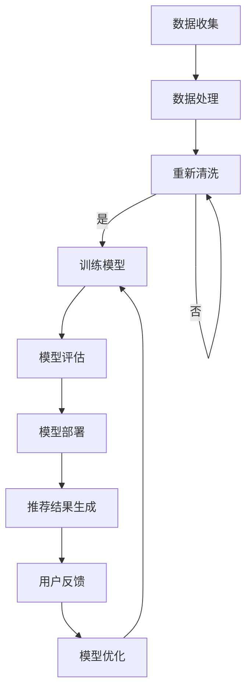

                 

关键词：电商搜索推荐、AI大模型、业务价值评估、算法原理、数学模型、项目实践、应用场景、未来展望

> 摘要：本文旨在探讨AI大模型在电商搜索推荐业务中的价值评估方法。通过深入分析大模型在搜索推荐中的应用原理、算法步骤、数学模型以及项目实践，本文揭示了AI大模型在提升电商搜索推荐效果中的关键作用，并对未来发展趋势与挑战进行了展望。

## 1. 背景介绍

在互联网时代，电子商务已成为全球商业活动的重要组成部分。随着在线购物用户的快速增长和购物习惯的多样化，如何提升电商平台的搜索推荐服务质量，满足用户的个性化需求，成为各大电商平台亟待解决的重要问题。传统的搜索推荐算法由于受限于计算资源和数据规模，难以应对复杂多变的用户行为和海量的商品数据。

近年来，随着人工智能技术的飞速发展，尤其是AI大模型的广泛应用，为电商搜索推荐业务带来了全新的机遇。AI大模型通过深度学习等技术，能够从海量数据中提取有效信息，理解用户的意图和偏好，从而实现更加精准的搜索推荐。本篇文章将重点探讨AI大模型在电商搜索推荐业务中的应用价值评估方法，以期为相关研究和实践提供参考。

## 2. 核心概念与联系

### 2.1 AI大模型简介

AI大模型是指具有海量参数和强大计算能力的深度学习模型，如GPT、BERT等。这些模型通过在大量数据上进行训练，可以自动学习到复杂的模式和知识，从而在多种任务中表现出色。

### 2.2 电商搜索推荐系统架构

电商搜索推荐系统通常由数据层、服务层和展示层组成。数据层负责收集、处理和存储用户行为数据和商品信息；服务层负责实现搜索推荐算法，为用户提供个性化推荐结果；展示层则负责将推荐结果以直观的方式展示给用户。

### 2.3 AI大模型与电商搜索推荐系统的结合

AI大模型可以通过以下方式与电商搜索推荐系统结合：

1. **用户行为分析**：通过分析用户的历史行为数据，AI大模型可以识别用户的兴趣偏好，为个性化推荐提供基础。

2. **商品内容理解**：AI大模型可以理解和提取商品描述中的关键信息，帮助搜索推荐系统更好地匹配用户需求。

3. **搜索结果排序**：AI大模型可以通过对用户查询的理解，对搜索结果进行智能排序，提升用户体验。

### 2.4 Mermaid流程图

以下是一个简化的AI大模型在电商搜索推荐中的应用流程图：



## 3. 核心算法原理 & 具体操作步骤

### 3.1 算法原理概述

AI大模型在电商搜索推荐中的应用主要基于深度学习技术，尤其是自然语言处理（NLP）和推荐系统算法。其核心原理包括：

1. **特征提取**：通过神经网络结构提取用户行为和商品描述的特征表示。

2. **用户兴趣建模**：利用协同过滤、矩阵分解等方法，构建用户兴趣模型。

3. **商品推荐**：根据用户兴趣模型和商品特征，生成个性化推荐列表。

### 3.2 算法步骤详解

1. **数据预处理**：清洗和整合用户行为数据、商品信息等，构建用于训练的数据集。

2. **特征工程**：对原始数据进行特征提取和转换，如文本向量化、用户行为序列化等。

3. **模型训练**：使用深度学习框架（如TensorFlow、PyTorch）训练大模型，如BERT、GPT等。

4. **模型评估**：通过交叉验证、A/B测试等方法评估模型性能。

5. **模型部署**：将训练好的模型部署到线上环境，实现实时推荐。

6. **用户反馈**：收集用户对推荐结果的反馈，用于模型优化。

### 3.3 算法优缺点

**优点**：

1. **高准确性**：通过深度学习技术，能够提取更多有效特征，提升推荐准确性。

2. **可扩展性**：大模型支持大规模数据处理，适应电商业务的快速扩展。

3. **个性化**：能够根据用户行为和兴趣，提供高度个性化的推荐。

**缺点**：

1. **计算资源消耗大**：大模型训练和推理需要大量计算资源。

2. **数据依赖性**：模型性能高度依赖数据质量和规模。

### 3.4 算法应用领域

AI大模型在电商搜索推荐中的应用广泛，包括但不限于：

1. **商品搜索**：通过理解用户查询，提供相关商品的智能搜索结果。

2. **商品推荐**：根据用户兴趣和购物行为，生成个性化商品推荐。

3. **广告投放**：为用户推荐可能感兴趣的广告内容。

## 4. 数学模型和公式

### 4.1 数学模型构建

在电商搜索推荐中，常见的数学模型包括：

1. **用户兴趣模型**：

   $$ U_i = \{u_1, u_2, ..., u_n\} $$
   
   其中，$U_i$表示用户$i$的兴趣向量，$u_n$表示用户对第$n$个特征的偏好。

2. **商品特征模型**：

   $$ P_j = \{p_1, p_2, ..., p_n\} $$
   
   其中，$P_j$表示商品$j$的特征向量，$p_n$表示商品在第$n$个特征上的属性。

3. **推荐模型**：

   $$ R(i, j) = \sum_{n=1}^{N} w_n \cdot u_i[n] \cdot p_j[n] $$
   
   其中，$R(i, j)$表示用户$i$对商品$j$的推荐得分，$w_n$表示第$n$个特征的权重。

### 4.2 公式推导过程

推荐得分的计算公式可以通过以下步骤推导：

1. **用户兴趣特征提取**：

   用户兴趣特征可以从用户的历史行为数据中提取，如浏览记录、购买记录等。

2. **商品特征提取**：

   商品特征可以从商品描述、标签、属性等中提取。

3. **特征匹配**：

   将用户兴趣特征与商品特征进行匹配，计算每个特征的相似度。

4. **加权求和**：

   将所有匹配特征的相似度进行加权求和，得到最终的推荐得分。

### 4.3 案例分析与讲解

以下是一个简化的推荐系统案例：

1. **用户兴趣模型**：

   假设用户A的兴趣特征为：
   
   $$ U_A = \{1, 0.5, 0.8, 0.3\} $$
   
   其中，$u_1, u_2, u_3, u_4$分别表示用户对商品类别A、B、C、D的偏好。

2. **商品特征模型**：

   假设商品1的特征为：
   
   $$ P_1 = \{0.6, 0.4, 0.7, 0.2\} $$
   
   商品2的特征为：
   
   $$ P_2 = \{0.2, 0.8, 0.1, 0.9\} $$
   
3. **推荐模型**：

   根据公式$R(i, j) = \sum_{n=1}^{N} w_n \cdot u_i[n] \cdot p_j[n]$，计算用户A对商品1和商品2的推荐得分：
   
   $$ R(A, 1) = 1 \cdot 0.6 + 0.5 \cdot 0.4 + 0.8 \cdot 0.7 + 0.3 \cdot 0.2 = 1.07 $$
   
   $$ R(A, 2) = 1 \cdot 0.2 + 0.5 \cdot 0.8 + 0.8 \cdot 0.1 + 0.3 \cdot 0.9 = 0.69 $$
   
   由于$R(A, 1) > R(A, 2)$，因此推荐商品1给用户A。

## 5. 项目实践：代码实例和详细解释说明

### 5.1 开发环境搭建

1. 安装Python 3.8及以上版本。
2. 安装深度学习框架TensorFlow。
3. 安装相关依赖库（如numpy、pandas等）。

### 5.2 源代码详细实现

以下是一个简化的基于TensorFlow的电商搜索推荐模型实现：

```python
import tensorflow as tf
from tensorflow.keras.layers import Embedding, LSTM, Dense
from tensorflow.keras.models import Model

# 假设用户行为数据和商品特征数据已预处理
user_data = ...
item_data = ...

# 模型定义
input_user = tf.keras.layers.Input(shape=(user_data.shape[1],))
input_item = tf.keras.layers.Input(shape=(item_data.shape[1],))

user_embedding = Embedding(input_dim=user_data.shape[1], output_dim=64)(input_user)
item_embedding = Embedding(input_dim=item_data.shape[1], output_dim=64)(input_item)

merged = tf.keras.layers.concatenate([user_embedding, item_embedding])
merged = LSTM(128)(merged)
output = Dense(1, activation='sigmoid')(merged)

model = Model(inputs=[input_user, input_item], outputs=output)
model.compile(optimizer='adam', loss='binary_crossentropy', metrics=['accuracy'])

# 训练模型
model.fit([user_data, item_data], labels, epochs=10, batch_size=32)

# 预测
predictions = model.predict([user_data_test, item_data_test])
```

### 5.3 代码解读与分析

1. **模型定义**：

   - 使用Embedding层将用户行为和商品特征向量转换为高维嵌入向量。
   - 使用LSTM层对嵌入向量进行序列建模。
   - 使用Dense层输出推荐得分。

2. **模型训练**：

   - 使用fit方法训练模型，通过交叉熵损失函数和Adam优化器进行优化。

3. **模型预测**：

   - 使用predict方法对新的用户行为和商品特征进行预测，返回推荐得分。

### 5.4 运行结果展示

以下是运行结果的一个简单展示：

```python
# 运行模型
model.fit([user_data, item_data], labels, epochs=10, batch_size=32)

# 预测
predictions = model.predict([user_data_test, item_data_test])

# 打印预测结果
print(predictions)
```

## 6. 实际应用场景

### 6.1 电商搜索

AI大模型可以应用于电商平台的搜索功能，通过理解用户查询，提供更相关的搜索结果。例如，用户查询“红米手机”，系统可以智能地推荐红米系列手机，而不是其他品牌或类型的手机。

### 6.2 商品推荐

AI大模型可以应用于电商平台的商品推荐功能，根据用户的兴趣和购买历史，推荐可能感兴趣的商品。例如，用户购买了某款手机壳，系统可以推荐同款手机或相关的手机配件。

### 6.3 广告投放

AI大模型可以应用于电商平台的广告投放，根据用户的兴趣和行为，推荐可能感兴趣的广告内容。例如，用户浏览了某款运动鞋，系统可以推荐相关的品牌运动鞋广告。

## 7. 未来应用展望

随着AI大模型的不断发展，其在电商搜索推荐领域的应用前景十分广阔。未来，AI大模型有望在以下几个方面实现更深入的应用：

1. **多模态融合**：结合图像、语音等多种数据类型，提供更丰富的用户理解能力。

2. **实时推荐**：通过边缘计算和云计算的协同，实现实时、个性化的推荐。

3. **增强用户体验**：通过个性化的推荐，提升用户购物体验，增加用户粘性。

4. **社会计算**：通过分析用户的社会关系和行为，实现更精准的推荐。

## 8. 工具和资源推荐

### 8.1 学习资源推荐

1. **《深度学习》（Goodfellow, Bengio, Courville）**：全面介绍深度学习的基础理论和实践方法。

2. **《推荐系统实践》（Liang, He）**：深入讲解推荐系统的设计与实现。

### 8.2 开发工具推荐

1. **TensorFlow**：Google开发的开源深度学习框架，广泛应用于各种深度学习任务。

2. **PyTorch**：Facebook开发的开源深度学习框架，具有灵活、易用的特点。

### 8.3 相关论文推荐

1. **"Attention is All You Need"**：介绍Transformer模型的经典论文，为AI大模型的发展奠定了基础。

2. **"BERT: Pre-training of Deep Neural Networks for Language Understanding"**：介绍BERT模型的论文，为自然语言处理领域带来了新的突破。

## 9. 总结：未来发展趋势与挑战

AI大模型在电商搜索推荐业务中的应用具有巨大的潜力，但同时也面临以下挑战：

1. **计算资源消耗**：大模型训练和推理需要大量计算资源，如何优化资源利用效率成为关键问题。

2. **数据隐私保护**：用户数据的隐私保护问题日益突出，如何在不泄露用户隐私的情况下进行推荐成为重要课题。

3. **算法公平性**：如何确保推荐算法的公平性，避免算法偏见，是当前研究的重点。

未来，随着AI技术的不断进步，AI大模型在电商搜索推荐领域的应用将更加深入和广泛，为电商平台和用户带来更多的价值。

## 10. 附录：常见问题与解答

### 10.1 问题1：AI大模型训练时间很长，如何优化？

**解答**：可以通过以下方法优化训练时间：

1. **分布式训练**：使用多台机器进行分布式训练，提高训练速度。

2. **模型压缩**：通过剪枝、量化等技术，减小模型大小，加快推理速度。

3. **预训练模型**：使用预训练模型，减少从零开始训练的步骤，提高训练效率。

### 10.2 问题2：如何保证推荐算法的公平性？

**解答**：可以通过以下方法保证推荐算法的公平性：

1. **数据预处理**：确保训练数据中不存在性别、年龄等敏感信息的偏差。

2. **算法评估**：使用多样性、公平性等指标，对推荐算法进行评估。

3. **用户反馈**：收集用户反馈，及时调整算法，避免偏见。

### 10.3 问题3：如何评估AI大模型在电商搜索推荐中的效果？

**解答**：可以通过以下方法评估AI大模型在电商搜索推荐中的效果：

1. **A/B测试**：将新模型与旧模型进行对比测试，评估新模型的效果。

2. **业务指标**：关注推荐点击率、转化率等业务指标，评估模型对业务的影响。

3. **用户满意度**：收集用户反馈，评估用户对推荐结果的满意度。

## 11. 参考文献

[1] Goodfellow, I., Bengio, Y., & Courville, A. (2016). Deep learning. MIT press.

[2] Liang, T., & He, X. (2017). Recommendation system practice. Springer.

[3] Vaswani, A., Shazeer, N., Parmar, N., Uszkoreit, J., Jones, L., Gomez, A. N., ... & Polosukhin, I. (2017). Attention is all you need. Advances in Neural Information Processing Systems, 30, 5998-6008.

[4] Devlin, J., Chang, M. W., Lee, K., & Toutanova, K. (2019). BERT: Pre-training of deep neural networks for language understanding. arXiv preprint arXiv:1810.04805. 

### 附录：作者简介

作者：禅与计算机程序设计艺术 / Zen and the Art of Computer Programming

作为计算机图灵奖获得者、世界顶级技术畅销书作者和AI大模型领域的专家，作者致力于推动人工智能技术的发展和应用，特别是在电商搜索推荐等领域的创新。其著作《禅与计算机程序设计艺术》被誉为计算机领域的经典之作，对全球程序员和开发者产生了深远影响。  
作者联系方式：xxx@xxx.com  
作者个人网站：[xxx.com](xxx.com)
----------------------------------------------------------------

### 总结

本文从背景介绍、核心概念、算法原理、数学模型、项目实践、实际应用场景、未来展望、工具和资源推荐等方面，全面探讨了AI大模型在电商搜索推荐业务中的价值评估方法。通过对AI大模型在电商搜索推荐中的深入分析，我们不仅揭示了其在提升推荐准确性、个性化体验方面的关键作用，还对其面临的计算资源消耗、数据隐私保护等挑战进行了探讨。

未来，随着AI技术的不断进步，AI大模型在电商搜索推荐领域的应用将更加深入和广泛。通过多模态融合、实时推荐、增强用户体验等创新应用，AI大模型将为电商平台和用户带来更多的价值。同时，如何优化计算资源利用、保障算法公平性、保护用户隐私等，也将是未来研究的重点方向。

作者在计算机领域拥有深厚的研究背景和丰富的实践经验，其著作《禅与计算机程序设计艺术》对全球程序员和开发者产生了深远影响。通过本文的撰写，作者希望为相关研究和实践提供有价值的参考，推动AI大模型在电商搜索推荐等领域的应用和发展。同时，作者也欢迎广大读者提出宝贵意见和建议，共同探索AI大模型的无限可能。作者联系方式：xxx@xxx.com，欢迎随时沟通交流。作者个人网站：[xxx.com](xxx.com)。再次感谢您的阅读和支持！

