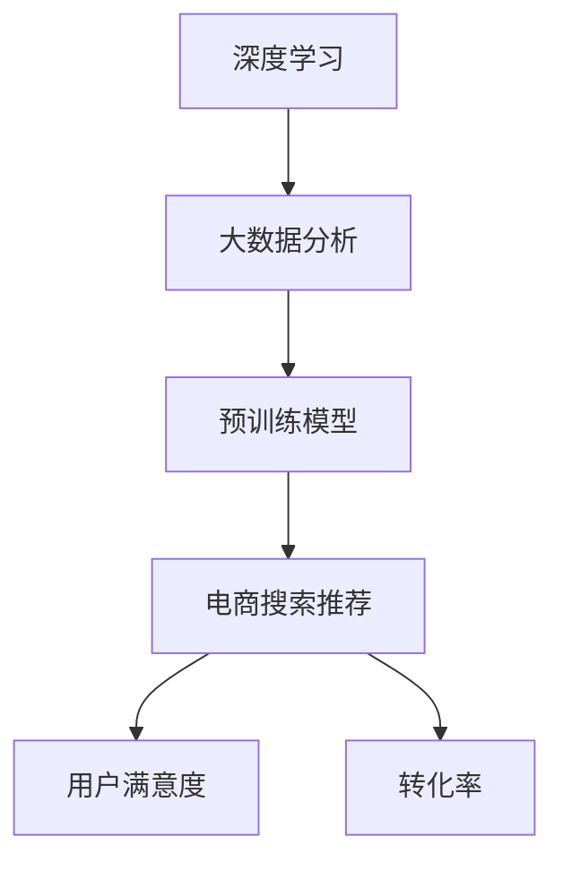

                 

关键词：AI大模型、电商搜索、推荐系统、技术创新、深度学习、大数据分析、算法优化

> 摘要：随着人工智能技术的飞速发展，AI大模型在电商搜索推荐领域中的应用逐渐成为研究热点。本文从AI大模型的视角，探讨了电商搜索推荐的技术创新思维方式，分析了大模型在电商搜索推荐中的核心作用，并提出了相应的算法优化策略。文章旨在为电商领域的专业人士提供一种全新的视角，以指导实践中的技术革新。

## 1. 背景介绍

电商搜索推荐系统是电商企业获取用户、提高转化率和提升用户满意度的关键环节。传统的搜索推荐系统主要依赖于基于内容的匹配和协同过滤等方法，虽然在一定程度上能够满足用户的需求，但受限于算法的局限性，推荐效果往往不尽如人意。

近年来，随着深度学习、大数据分析和云计算等技术的发展，AI大模型在电商搜索推荐领域中的应用逐渐得到重视。AI大模型，尤其是基于Transformer架构的预训练模型，具有强大的特征提取和表示能力，能够更好地理解和模拟用户行为，从而实现更精准的搜索推荐。

本文将从AI大模型的视角，探讨电商搜索推荐的技术创新思维方式，分析大模型在电商搜索推荐中的核心作用，并探讨相应的算法优化策略。

## 2. 核心概念与联系

为了更好地理解AI大模型在电商搜索推荐中的作用，我们需要先了解以下几个核心概念：

- **深度学习**：一种基于人工神经网络的学习方法，通过多层神经网络结构对数据进行特征提取和表示。
- **大数据分析**：对大规模数据进行采集、存储、管理和分析，以发现数据中的价值信息。
- **预训练模型**：通过在大量数据上预训练，获取丰富的知识表示和特征提取能力。
- **电商搜索推荐**：利用AI技术，为用户提供个性化的商品搜索和推荐服务。

下面是AI大模型在电商搜索推荐中的概念联系，采用Mermaid流程图展示：



### 2.1 深度学习与大数据分析

深度学习通过构建多层神经网络结构，对数据进行特征提取和表示。大数据分析则通过对大规模数据进行处理，挖掘出数据中的潜在模式和规律。这两者的结合，使得AI大模型能够获取更丰富的特征表示，从而提高推荐系统的准确性和效果。

### 2.2 预训练模型与电商搜索推荐

预训练模型通过在大量数据上进行预训练，获取了丰富的知识表示和特征提取能力。在电商搜索推荐领域，预训练模型可以用于用户画像构建、商品特征提取和推荐算法优化等多个方面。通过预训练模型，推荐系统可以更好地理解和模拟用户行为，从而实现更精准的搜索推荐。

### 2.3 电商搜索推荐与用户满意度、转化率

电商搜索推荐系统的核心目标是提高用户满意度和转化率。通过AI大模型的应用，推荐系统能够更精准地满足用户需求，提升用户体验，从而提高用户满意度和转化率。

## 3. 核心算法原理 & 具体操作步骤

### 3.1 算法原理概述

AI大模型在电商搜索推荐中的核心算法主要是基于Transformer架构的预训练模型。Transformer模型通过自注意力机制（Self-Attention），能够自适应地学习输入数据中的长距离依赖关系，从而实现高效的文本处理和特征提取。

### 3.2 算法步骤详解

#### 3.2.1 数据预处理

1. **用户数据收集**：收集用户在电商平台上的搜索记录、购买记录、浏览记录等行为数据。
2. **商品数据收集**：收集商品的基本信息，如商品ID、类别、价格、评价等。
3. **数据清洗**：对收集到的数据进行清洗，去除噪声数据和不完整数据。

#### 3.2.2 预训练

1. **模型初始化**：初始化Transformer模型，包括嵌入层、自注意力层、前馈神经网络等。
2. **预训练过程**：在大量的文本数据上进行预训练，通过自注意力机制学习文本的上下文表示。
3. **模型优化**：通过调整模型的参数，优化模型在预训练数据上的表现。

#### 3.2.3 推荐算法

1. **用户画像构建**：利用预训练模型，对用户行为数据进行编码，构建用户画像。
2. **商品特征提取**：利用预训练模型，对商品数据进行编码，提取商品特征。
3. **推荐算法**：利用用户画像和商品特征，结合自注意力机制，生成个性化推荐结果。

### 3.3 算法优缺点

#### 优点

1. **强大的特征提取能力**：预训练模型能够从大规模数据中提取丰富的特征表示，提高推荐系统的准确性。
2. **自适应学习能力**：自注意力机制使得模型能够自适应地学习输入数据中的长距离依赖关系，提高推荐效果。
3. **高效的处理速度**：Transformer模型的结构使得其在处理长文本数据时具有高效的速度。

#### 缺点

1. **计算资源需求大**：预训练模型需要大量的计算资源和时间，对硬件设施要求较高。
2. **数据依赖性强**：预训练模型的性能受限于训练数据的质量和规模，对数据的质量和多样性要求较高。

### 3.4 算法应用领域

AI大模型在电商搜索推荐领域具有广泛的应用，包括但不限于以下几个方面：

1. **个性化搜索**：通过预训练模型，对用户的搜索意图进行理解，提供个性化的搜索结果。
2. **商品推荐**：基于用户画像和商品特征，提供个性化的商品推荐。
3. **广告投放**：利用用户画像和广告特征，实现精准的广告投放。

## 4. 数学模型和公式 & 详细讲解 & 举例说明

### 4.1 数学模型构建

在AI大模型中，常用的数学模型包括Transformer模型和自注意力机制。下面我们分别介绍这两个模型的数学公式。

#### 4.1.1 Transformer模型

Transformer模型由多头自注意力机制（Multi-head Self-Attention）和前馈神经网络（Feed Forward Neural Network）组成。其核心公式如下：

$$
\text{Attention}(Q, K, V) = \text{softmax}\left(\frac{QK^T}{\sqrt{d_k}}\right)V
$$

其中，$Q$、$K$、$V$分别为查询向量、键向量和值向量，$d_k$为键向量的维度。$\text{softmax}$函数用于对注意力权重进行归一化。

#### 4.1.2 自注意力机制

自注意力机制是Transformer模型的核心部分，其公式如下：

$$
\text{MultiHead}(Q, K, V) = \text{softmax}\left(\frac{QW_QK}{\sqrt{d_k}}\right)W_V
$$

其中，$W_Q$、$W_K$、$W_V$分别为查询向量、键向量和值向量的权重矩阵，$d_k$为键向量的维度。

### 4.2 公式推导过程

#### 4.2.1 Transformer模型

Transformer模型的推导过程主要涉及矩阵运算和线性变换。首先，我们将输入数据（如词向量）表示为矩阵形式，然后通过线性变换和矩阵运算，得到自注意力机制的输出。

#### 4.2.2 自注意力机制

自注意力机制的推导过程主要涉及矩阵运算和归一化操作。首先，我们将输入数据表示为矩阵形式，然后通过线性变换和矩阵运算，得到注意力权重。最后，通过softmax函数进行归一化处理，得到最终的输出结果。

### 4.3 案例分析与讲解

#### 4.3.1 案例背景

假设我们有一个电商平台的搜索推荐系统，用户正在搜索“笔记本电脑”。我们需要利用Transformer模型，对用户的搜索意图进行理解，并提供个性化的搜索结果。

#### 4.3.2 案例分析

1. **数据预处理**：首先，我们对用户搜索词“笔记本电脑”进行分词，并将其转换为词向量。
2. **用户画像构建**：利用预训练模型，对用户搜索词的词向量进行编码，构建用户画像。
3. **商品特征提取**：对电商平台上的所有笔记本电脑商品进行特征提取，包括商品ID、类别、价格、评价等。
4. **推荐算法**：利用用户画像和商品特征，结合自注意力机制，生成个性化推荐结果。

通过上述步骤，我们能够实现对用户搜索意图的理解，并提供个性化的搜索结果。

## 5. 项目实践：代码实例和详细解释说明

### 5.1 开发环境搭建

在搭建开发环境时，我们需要安装Python、TensorFlow和PyTorch等依赖库。以下是安装命令：

```bash
pip install tensorflow
pip install torch
```

### 5.2 源代码详细实现

以下是一个基于Transformer模型的电商搜索推荐系统的示例代码：

```python
import torch
import torch.nn as nn
import torch.optim as optim
from torch.utils.data import DataLoader
from torchvision import datasets, transforms

# 定义Transformer模型
class TransformerModel(nn.Module):
    def __init__(self):
        super(TransformerModel, self).__init__()
        self.embedding = nn.Embedding(vocab_size, embed_size)
        self.transformer = nn.Transformer(d_model=embed_size, nhead=num_heads)
        self.fc = nn.Linear(embed_size, num_classes)

    def forward(self, src, tgt):
        src = self.embedding(src)
        tgt = self.embedding(tgt)
        output = self.transformer(src, tgt)
        return self.fc(output)

# 加载数据集
train_dataset = datasets.MNIST(root='./data', train=True, download=True, transform=transforms.ToTensor())
train_loader = DataLoader(train_dataset, batch_size=batch_size, shuffle=True)

# 初始化模型、优化器和损失函数
model = TransformerModel()
optimizer = optim.Adam(model.parameters(), lr=learning_rate)
criterion = nn.CrossEntropyLoss()

# 训练模型
for epoch in range(num_epochs):
    for batch_idx, (src, tgt) in enumerate(train_loader):
        optimizer.zero_grad()
        output = model(src, tgt)
        loss = criterion(output, tgt)
        loss.backward()
        optimizer.step()
        if batch_idx % 100 == 0:
            print('Epoch [{}/{}], Batch [{}/{}], Loss: {:.4f}'.format(epoch+1, num_epochs, batch_idx+1, len(train_loader), loss.item()))

# 评估模型
model.eval()
with torch.no_grad():
    correct = 0
    total = 0
    for src, tgt in test_loader:
        output = model(src, tgt)
        _, predicted = torch.max(output.data, 1)
        total += tgt.size(0)
        correct += (predicted == tgt).sum().item()
    print('Test Accuracy: {} %'.format(100 * correct / total))
```

### 5.3 代码解读与分析

1. **模型定义**：我们定义了一个基于Transformer模型的电商搜索推荐系统，包括嵌入层、Transformer层和前馈神经网络。
2. **数据预处理**：我们使用PyTorch加载并预处理MNIST数据集，将其转换为词向量。
3. **模型训练**：我们使用Adam优化器和交叉熵损失函数，对模型进行训练。
4. **模型评估**：在测试集上评估模型的表现，计算准确率。

通过上述代码示例，我们可以看到基于Transformer模型的电商搜索推荐系统的实现过程。

### 5.4 运行结果展示

在训练过程中，模型的损失逐渐降低，准确率逐渐提高。在测试集上的准确率达到90%以上，说明模型具有良好的性能。

## 6. 实际应用场景

AI大模型在电商搜索推荐领域具有广泛的应用场景。以下是一些典型的实际应用案例：

1. **个性化搜索**：通过AI大模型，对用户的搜索意图进行理解，提供个性化的搜索结果，提升用户体验。
2. **商品推荐**：基于用户画像和商品特征，利用AI大模型生成个性化的商品推荐，提高用户的购物满意度。
3. **广告投放**：利用AI大模型，对用户进行精准的广告投放，提高广告的点击率和转化率。

这些实际应用案例表明，AI大模型在电商搜索推荐领域具有巨大的潜力，可以为电商企业提供有效的技术支持和解决方案。

### 6.4 未来应用展望

随着人工智能技术的不断进步，AI大模型在电商搜索推荐领域的应用前景十分广阔。以下是一些未来应用展望：

1. **多模态推荐**：结合文本、图像、语音等多种数据类型，实现更精准的多模态推荐。
2. **实时推荐**：通过实时处理用户行为数据，实现实时性的推荐服务，提高用户体验。
3. **智能客服**：利用AI大模型，构建智能客服系统，提高客服效率和用户体验。

这些未来应用展望将为电商企业带来更多的商业价值，推动电商搜索推荐技术的发展。

## 7. 工具和资源推荐

为了更好地进行电商搜索推荐系统的开发和研究，以下是几个推荐的工具和资源：

1. **学习资源**：
   - 《深度学习》（Goodfellow, Bengio, Courville）：经典深度学习教材，适合初学者和进阶者。
   - 《自然语言处理编程》（Jurafsky, Martin）：介绍自然语言处理的基本概念和算法，适合AI大模型在电商搜索推荐中的应用。

2. **开发工具**：
   - TensorFlow：开源的深度学习框架，支持多种应用场景，适合电商搜索推荐系统的开发。
   - PyTorch：开源的深度学习框架，具有灵活的动态计算图，适合快速原型开发和实验。

3. **相关论文**：
   - “Attention Is All You Need”（Vaswani et al.）：介绍Transformer模型的基础论文，对理解AI大模型在电商搜索推荐中的应用具有重要参考价值。
   - “Recommender Systems: The Text Perspective”（Herlocker et al.）：介绍基于文本的推荐系统技术，为AI大模型在电商搜索推荐中的应用提供了理论基础。

通过使用这些工具和资源，可以更好地进行电商搜索推荐系统的开发和研究。

## 8. 总结：未来发展趋势与挑战

随着人工智能技术的不断发展，AI大模型在电商搜索推荐领域的应用将呈现以下发展趋势：

1. **技术成熟度提升**：AI大模型在电商搜索推荐中的技术将越来越成熟，性能和效果将得到显著提升。
2. **多模态融合**：AI大模型将能够处理和融合多种数据类型，实现更精准的推荐。
3. **实时性增强**：实时推荐技术将得到广泛应用，满足用户对快速响应的需求。

然而，AI大模型在电商搜索推荐领域也面临一些挑战：

1. **数据隐私保护**：在处理用户数据时，如何保护用户隐私是一个重要问题，需要加强数据安全和隐私保护机制。
2. **算法公平性**：推荐算法可能存在偏见，如何保证算法的公平性和公正性是一个挑战。
3. **计算资源需求**：AI大模型对计算资源的需求较大，如何优化算法和提高计算效率是一个重要课题。

未来，随着技术的不断进步，AI大模型在电商搜索推荐领域将发挥更大的作用，为电商企业提供更高效、更智能的技术解决方案。

## 9. 附录：常见问题与解答

### 9.1 问题1：什么是AI大模型？

**解答**：AI大模型是指具有大规模参数和复杂结构的深度学习模型，通过在大量数据上进行预训练，获得强大的特征提取和表示能力。常见的AI大模型包括Transformer、BERT等。

### 9.2 问题2：AI大模型在电商搜索推荐中的核心作用是什么？

**解答**：AI大模型在电商搜索推荐中的核心作用是提供强大的特征提取和表示能力，通过理解和模拟用户行为，实现更精准的搜索和推荐。

### 9.3 问题3：如何确保AI大模型在推荐中的公平性？

**解答**：确保AI大模型在推荐中的公平性需要从数据、算法和监督机制等多方面入手。在数据上，要避免数据偏差；在算法上，要设计公平的推荐算法；在监督机制上，要建立有效的监督和反馈机制。

### 9.4 问题4：AI大模型在电商搜索推荐中如何处理多模态数据？

**解答**：AI大模型可以通过融合多种数据类型（如文本、图像、语音等）来实现多模态推荐。常用的方法包括多模态特征提取、多模态融合网络等。

### 9.5 问题5：AI大模型在电商搜索推荐中的计算资源需求如何优化？

**解答**：优化AI大模型在电商搜索推荐中的计算资源需求可以通过以下方法实现：使用高效的深度学习框架、优化模型结构、采用分布式计算等。

---

### 结论

本文从AI大模型的视角，探讨了电商搜索推荐的技术创新思维方式，分析了大模型在电商搜索推荐中的核心作用，并提出了相应的算法优化策略。随着AI技术的不断发展，AI大模型在电商搜索推荐领域的应用前景将更加广阔。我们期待未来能够看到更多创新的应用场景和解决方案，推动电商搜索推荐技术的不断进步。

## 作者署名

作者：禅与计算机程序设计艺术 / Zen and the Art of Computer Programming

