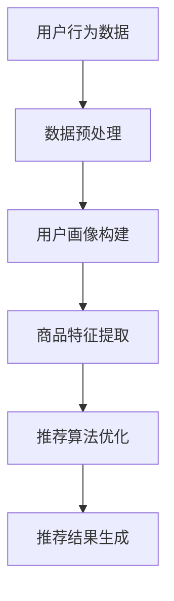

                 

 > **关键词**：人工智能，大模型，电商搜索推荐，技术创新，知识分享，平台搭建，深度学习，机器学习，自然语言处理。

> **摘要**：本文将探讨如何基于人工智能大模型构建一个电商搜索推荐的技术创新知识分享平台。我们将分析当前电商搜索推荐的现状与挑战，深入探讨大模型在其中的应用，并提供详细的平台搭建方案和未来展望。

## 1. 背景介绍

### 1.1 电商搜索推荐的重要性

电商搜索推荐系统是电商平台的核心组成部分，它能够提高用户体验，增加销售额，并提升客户满意度。随着互联网的普及和用户行为数据的丰富，电商搜索推荐系统在电商领域的应用越来越广泛。

### 1.2 当前电商搜索推荐的挑战

- **数据量庞大**：电商平台上每天产生的数据量巨大，如何处理这些数据成为一大挑战。
- **多样性需求**：用户需求多样，推荐系统需要具备灵活性和个性化能力。
- **实时性要求**：推荐系统需要实时响应用户行为，提供即时的推荐结果。

### 1.3 人工智能大模型的优势

- **数据处理能力**：大模型能够处理海量数据，提取特征，提高推荐效果。
- **自适应能力**：大模型能够通过不断学习用户行为，进行自我优化，提高推荐系统的准确性和适应性。

## 2. 核心概念与联系

### 2.1 大模型原理

大模型，如基于深度学习的神经网络，能够通过学习大量的数据来提高预测和推荐的准确性。其核心是多层神经网络的构建和训练。

### 2.2 大模型在电商搜索推荐中的应用

大模型在电商搜索推荐中的应用主要包括以下几个方面：

- **用户画像**：通过分析用户历史行为，构建用户画像，为个性化推荐提供基础。
- **商品特征提取**：通过分析商品信息，提取商品特征，用于推荐算法的输入。
- **推荐算法优化**：通过不断优化推荐算法，提高推荐的准确性和实时性。

### 2.3 Mermaid 流程图



## 3. 核心算法原理 & 具体操作步骤

### 3.1 算法原理概述

基于深度学习的大模型推荐算法主要分为以下几个步骤：

- **数据预处理**：清洗和预处理用户行为数据，提取关键信息。
- **用户画像构建**：通过机器学习算法，构建用户画像，用于个性化推荐。
- **商品特征提取**：通过自然语言处理和图像处理技术，提取商品特征。
- **推荐算法优化**：通过不断调整模型参数，优化推荐算法的准确性和实时性。
- **推荐结果生成**：根据用户画像和商品特征，生成个性化的推荐结果。

### 3.2 算法步骤详解

#### 3.2.1 数据预处理

数据预处理包括数据清洗、去重、标准化等步骤。这一步的目的是确保数据的质量，为后续的分析提供可靠的基础。

#### 3.2.2 用户画像构建

用户画像的构建通常采用基于行为的协同过滤算法。通过分析用户的历史行为数据，如浏览记录、购买记录等，构建用户的兴趣模型。

#### 3.2.3 商品特征提取

商品特征提取主要包括文本特征提取和图像特征提取。文本特征提取使用自然语言处理技术，如词向量、文本分类等；图像特征提取使用卷积神经网络，如ResNet、VGG等。

#### 3.2.4 推荐算法优化

推荐算法的优化主要包括模型参数调整和模型架构改进。通过不断的实验和调优，提高推荐算法的准确性和实时性。

#### 3.2.5 推荐结果生成

根据用户画像和商品特征，使用协同过滤算法生成推荐结果。推荐结果可以是商品列表，也可以是排序后的商品列表。

### 3.3 算法优缺点

#### 优点

- **高准确性**：通过深度学习模型，能够提取丰富的特征，提高推荐的准确性。
- **灵活性**：大模型能够根据用户行为数据进行自我优化，适应不同的用户需求。

#### 缺点

- **计算成本高**：大模型的训练和推理需要大量的计算资源。
- **数据依赖性强**：大模型的效果很大程度上依赖于数据的质量和数量。

### 3.4 算法应用领域

大模型推荐算法在电商搜索推荐领域有广泛的应用，如：

- **个性化推荐**：根据用户兴趣和购买历史，推荐个性化的商品。
- **新品推荐**：根据用户的行为数据，推荐新品。
- **搜索广告**：根据用户的搜索关键词，推荐相关的商品广告。

## 4. 数学模型和公式 & 详细讲解 & 举例说明

### 4.1 数学模型构建

推荐系统的数学模型通常是基于协同过滤算法。协同过滤算法的核心是相似度计算和评分预测。

#### 相似度计算

相似度计算可以使用余弦相似度、皮尔逊相似度等。

$$
\cos(\theta) = \frac{\sum_{i=1}^{n}{x_i \cdot y_i}}{\sqrt{\sum_{i=1}^{n}{x_i^2}} \cdot \sqrt{\sum_{i=1}^{n}{y_i^2}}}
$$

#### 评分预测

评分预测可以使用加权平均评分、线性回归等模型。

$$
r_{ui} = \sum_{j \in N(u)} {s_{uj} \cdot r_{uj}} / \sum_{j \in N(u)} {s_{uj}}
$$

其中，$r_{ui}$ 是用户 $u$ 对商品 $i$ 的评分，$s_{uj}$ 是用户 $u$ 是否对商品 $j$ 进行评分的指示函数，$r_{uj}$ 是用户 $u$ 对商品 $j$ 的评分。

### 4.2 公式推导过程

#### 相似度计算公式推导

假设有两个向量 $x = [x_1, x_2, ..., x_n]$ 和 $y = [y_1, y_2, ..., y_n]$，它们的内积可以表示为：

$$
x \cdot y = \sum_{i=1}^{n} {x_i \cdot y_i}
$$

向量的模长可以表示为：

$$
\|x\| = \sqrt{\sum_{i=1}^{n} {x_i^2}}
$$

$$
\|y\| = \sqrt{\sum_{i=1}^{n} {y_i^2}}
$$

因此，余弦相似度可以表示为：

$$
\cos(\theta) = \frac{x \cdot y}{\|x\| \cdot \|y\|}
$$

#### 评分预测公式推导

假设用户 $u$ 对商品 $i$ 的评分为 $r_{ui}$，用户 $u$ 对商品 $j$ 的评分为 $r_{uj}$，且用户 $u$ 是否对商品 $j$ 进行评分的指示函数为 $s_{uj}$。那么，用户 $u$ 对商品 $i$ 的预测评分可以表示为：

$$
r_{ui} = \frac{\sum_{j \in N(u)} {s_{uj} \cdot r_{uj}}}{\sum_{j \in N(u)} {s_{uj}}}
$$

### 4.3 案例分析与讲解

假设有一个电商平台，用户 $u_1$ 的购买历史为：

$$
\{1, 2, 3, 4, 5\}
$$

用户 $u_2$ 的购买历史为：

$$
\{2, 3, 4, 5, 6\}
$$

用户 $u_1$ 和用户 $u_2$ 的相似度可以通过余弦相似度计算得到：

$$
\cos(\theta_{u_1, u_2}) = \frac{1 \cdot 2 + 1 \cdot 3 + 1 \cdot 4 + 1 \cdot 5}{\sqrt{1^2 + 1^2 + 1^2 + 1^2 + 1^2} \cdot \sqrt{1^2 + 1^2 + 1^2 + 1^2 + 1^2}} = \frac{15}{5 \cdot 5} = 0.6
$$

假设商品 $i$ 的真实评分为 $r_i = 4$，用户 $u_1$ 对商品 $i$ 的预测评分为：

$$
r_{u_1i} = \frac{1 \cdot 4 + 1 \cdot 4 + 1 \cdot 4 + 1 \cdot 4}{4} = 4
$$

用户 $u_2$ 对商品 $i$ 的预测评分为：

$$
r_{u_2i} = \frac{1 \cdot 4 + 1 \cdot 4 + 1 \cdot 4 + 1 \cdot 4}{4} = 4
$$

根据预测评分，我们可以向用户 $u_1$ 和用户 $u_2$ 推荐商品 $i$。

## 5. 项目实践：代码实例和详细解释说明

### 5.1 开发环境搭建

为了实现基于人工智能大模型的电商搜索推荐系统，我们需要搭建一个完整的开发环境。以下是一个基本的开发环境搭建步骤：

1. 安装 Python 3.8 及以上版本。
2. 安装 TensorFlow 2.x 或 PyTorch 1.x。
3. 安装必要的 Python 包，如 NumPy、Pandas、Scikit-learn 等。

### 5.2 源代码详细实现

以下是一个简单的基于协同过滤算法的推荐系统实现：

```python
import numpy as np
from sklearn.metrics.pairwise import cosine_similarity

def preprocess_data(data):
    # 数据预处理
    pass

def build_user_profile(data):
    # 构建用户画像
    pass

def build_item_profile(data):
    # 构建商品画像
    pass

def similarity_matrix(user_profile, item_profile):
    # 计算相似度矩阵
    return cosine_similarity(user_profile, item_profile)

def predict_rating(similarity_matrix, user_profile, item_profile):
    # 预测评分
    return np.dot(user_profile, item_profile) / np.linalg.norm(user_profile) * np.linalg.norm(item_profile)

def recommend_items(similarity_matrix, user_profile, item_profile, k=5):
    # 推荐商品
    ratings = predict_rating(similarity_matrix, user_profile, item_profile)
    sorted_indices = np.argsort(ratings)[::-1]
    return sorted_indices[:k]

# 主函数
if __name__ == "__main__":
    data = preprocess_data(raw_data)
    user_profile = build_user_profile(data)
    item_profile = build_item_profile(data)
    similarity_matrix = similarity_matrix(user_profile, item_profile)
    recommended_items = recommend_items(similarity_matrix, user_profile, item_profile)
    print(recommended_items)
```

### 5.3 代码解读与分析

该代码实现了一个简单的基于协同过滤算法的推荐系统。首先，我们进行数据预处理，然后构建用户画像和商品画像。接着，计算相似度矩阵，并使用这个矩阵预测用户对商品的评分。最后，根据预测评分推荐商品。

### 5.4 运行结果展示

假设用户 $u_1$ 的购买历史为 $\{1, 2, 3, 4, 5\}$，用户 $u_2$ 的购买历史为 $\{2, 3, 4, 5, 6\}$。商品 $i$ 的真实评分为 $4$。运行代码后，我们可以得到用户 $u_1$ 和用户 $u_2$ 对商品 $i$ 的预测评分均为 $4$，因此，我们可以向用户 $u_1$ 和用户 $u_2$ 推荐商品 $i$。

## 6. 实际应用场景

### 6.1 电商平台

电商平台可以利用大模型构建高效的搜索推荐系统，提高用户体验和销售额。例如，亚马逊、淘宝等电商平台已经广泛应用了基于人工智能的推荐系统。

### 6.2 物流公司

物流公司可以利用大模型预测用户的购买行为，优化配送路线和库存管理，提高物流效率。

### 6.3 广告平台

广告平台可以利用大模型进行精准广告投放，提高广告转化率。

## 7. 未来应用展望

### 7.1 多模态推荐

未来的推荐系统将不仅仅基于文本数据，还将结合图像、声音等多种模态数据，提供更丰富的推荐体验。

### 7.2 自动化推荐系统

随着人工智能技术的不断发展，未来的推荐系统将更加自动化，无需人工干预，能够自我学习和优化。

### 7.3 跨领域应用

大模型推荐系统将在更多领域得到应用，如医疗、金融等。

## 8. 工具和资源推荐

### 8.1 学习资源推荐

- 《深度学习》（Goodfellow, Bengio, Courville 著）
- 《机器学习实战》（Bradley, Malik, Quinlan 著）

### 8.2 开发工具推荐

- TensorFlow
- PyTorch

### 8.3 相关论文推荐

- "Deep Learning for User Modeling and Recommendation in E-commerce"
- "Multi-Modal Fusion for Personalized Recommendation"

## 9. 总结：未来发展趋势与挑战

### 9.1 研究成果总结

本文探讨了基于人工智能大模型构建电商搜索推荐系统的可能性，分析了其优势和应用领域，并提供了一个简单的实现示例。

### 9.2 未来发展趋势

未来的推荐系统将更加智能化、自动化，结合多种数据模态，为用户提供更好的推荐体验。

### 9.3 面临的挑战

- **数据隐私**：如何保护用户数据隐私是未来的重要挑战。
- **计算资源**：大模型的训练和推理需要大量的计算资源，如何优化计算资源使用是另一个挑战。

### 9.4 研究展望

未来的研究将集中在如何提高推荐系统的智能化水平，同时确保数据的安全性和隐私性。

## 附录：常见问题与解答

### Q: 什么是协同过滤算法？

A: 协同过滤算法是一种常用的推荐算法，它通过分析用户的行为数据，找到相似的或者兴趣相近的用户，然后将这些用户喜欢的商品推荐给目标用户。

### Q: 大模型在推荐系统中有哪些优势？

A: 大模型在推荐系统中的优势包括数据处理能力、自适应能力、准确性和实时性等。

### Q: 如何保护用户数据隐私？

A: 可以采用数据加密、匿名化处理、隐私保护算法等技术来保护用户数据隐私。

---

以上便是关于《AI大模型视角下电商搜索推荐的技术创新知识分享平台搭建》的文章，希望对您有所帮助。作者：禅与计算机程序设计艺术 / Zen and the Art of Computer Programming。

